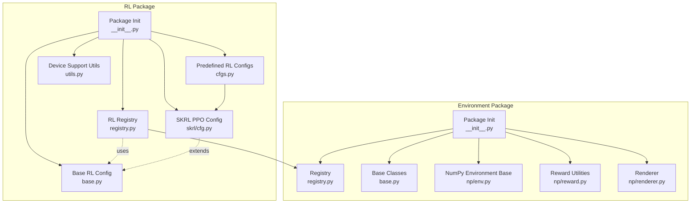
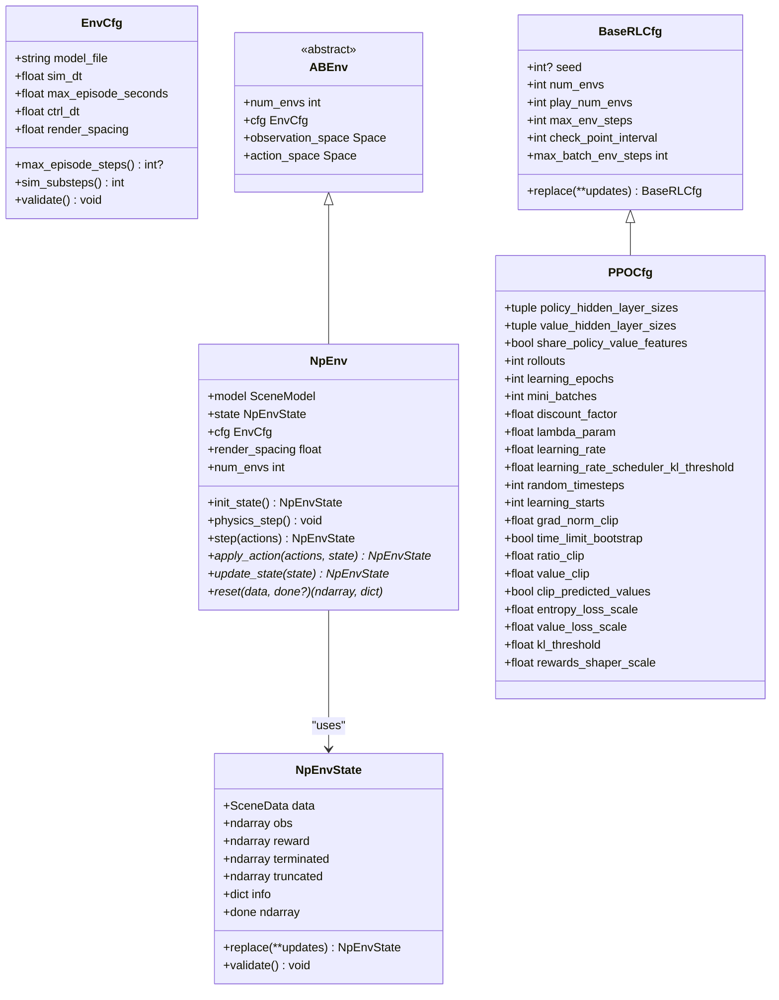
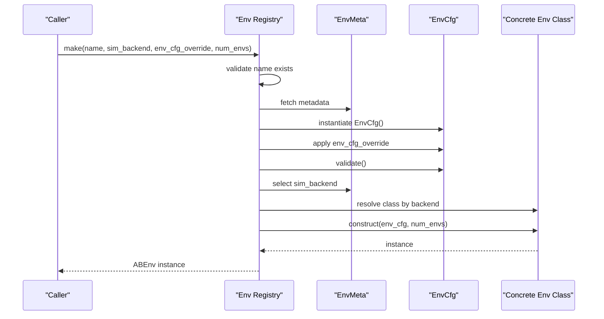
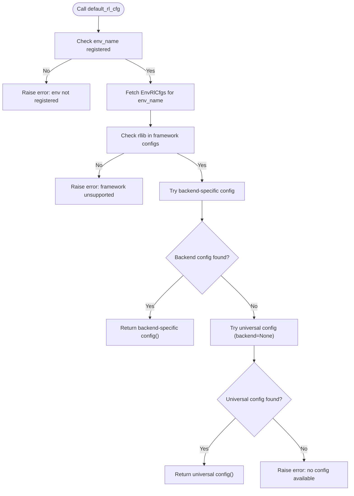
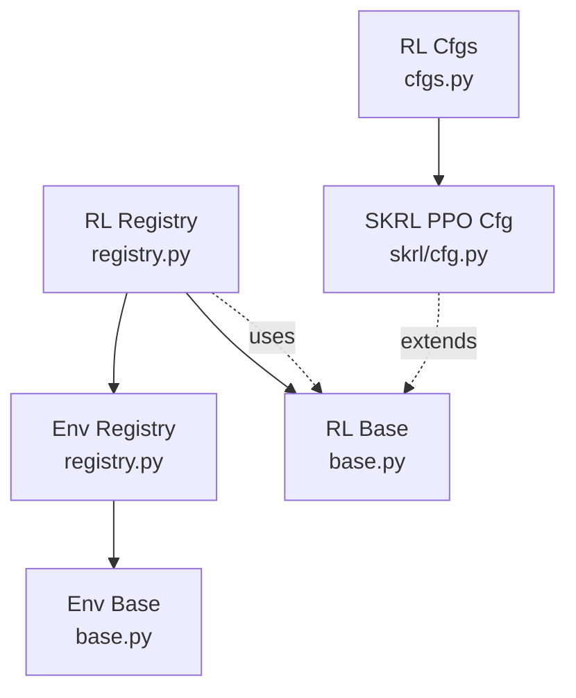

# API Reference

<cite>
**Referenced Files in This Document**
- [registry.py](file://motrix_envs/src/motrix_envs/registry.py)
- [base.py](file://motrix_envs/src/motrix_envs/base.py)
- [env.py](file://motrix_envs/src/motrix_envs/np/env.py)
- [renderer.py](file://motrix_envs/src/motrix_envs/np/renderer.py)
- [reward.py](file://motrix_envs/src/motrix_envs/np/reward.py)
- [__init__.py](file://motrix_envs/src/motrix_envs/__init__.py)
- [registry.py](file://motrix_rl/src/motrix_rl/registry.py)
- [base.py](file://motrix_rl/src/motrix_rl/base.py)
- [cfgs.py](file://motrix_rl/src/motrix_rl/cfgs.py)
- [cfg.py](file://motrix_rl/src/motrix_rl/skrl/cfg.py)
- [utils.py](file://motrix_rl/src/motrix_rl/utils.py)
- [__init__.py](file://motrix_rl/src/motrix_rl/__init__.py)
</cite>

## Table of Contents
1. [Introduction](#introduction)
2. [Project Structure](#project-structure)
3. [Core Components](#core-components)
4. [Architecture Overview](#architecture-overview)
5. [Detailed Component Analysis](#detailed-component-analysis)
6. [Dependency Analysis](#dependency-analysis)
7. [Performance Considerations](#performance-considerations)
8. [Troubleshooting Guide](#troubleshooting-guide)
9. [Conclusion](#conclusion)
10. [Appendices](#appendices)

## Introduction
This document provides a comprehensive API reference for the environment and reinforcement learning (RL) registries, along with base classes, configuration dataclasses, and interface contracts. It covers:
- Environment registry API: registration functions, lookup mechanisms, and instantiation patterns
- RL registry API: training configuration management and backend selection
- Base classes and abstract methods
- Configuration dataclasses and their fields
- Usage examples, error handling patterns, and integration approaches

## Project Structure
The repository organizes environment-related code under the environment package and RL-related code under the RL package. The environment registry manages environment configurations and concrete environment classes, while the RL registry manages RL training configurations mapped to environments and backends.

**Diagram sources**
- [registry.py](file://motrix_envs/src/motrix_envs/registry.py#L1-L172)
- [base.py](file://motrix_envs/src/motrix_envs/base.py#L1-L85)
- [env.py](file://motrix_envs/src/motrix_envs/np/env.py#L1-L209)
- [reward.py](file://motrix_envs/src/motrix_envs/np/reward.py#L1-L84)
- [renderer.py](file://motrix_envs/src/motrix_envs/np/renderer.py#L1-L65)
- [__init__.py](file://motrix_envs/src/motrix_envs/__init__.py#L1-L17)
- [registry.py](file://motrix_rl/src/motrix_rl/registry.py#L1-L115)
- [base.py](file://motrix_rl/src/motrix_rl/base.py#L1-L43)
- [cfgs.py](file://motrix_rl/src/motrix_rl/cfgs.py#L1-L333)
- [cfg.py](file://motrix_rl/src/motrix_rl/skrl/cfg.py#L1-L74)
- [utils.py](file://motrix_rl/src/motrix_rl/utils.py#L1-L62)
- [__init__.py](file://motrix_rl/src/motrix_rl/__init__.py#L1-L17)

**Section sources**
- [registry.py](file://motrix_envs/src/motrix_envs/registry.py#L1-L172)
- [base.py](file://motrix_envs/src/motrix_envs/base.py#L1-L85)
- [env.py](file://motrix_envs/src/motrix_envs/np/env.py#L1-L209)
- [registry.py](file://motrix_rl/src/motrix_rl/registry.py#L1-L115)
- [base.py](file://motrix_rl/src/motrix_rl/base.py#L1-L43)
- [cfgs.py](file://motrix_rl/src/motrix_rl/cfgs.py#L1-L333)
- [cfg.py](file://motrix_rl/src/motrix_rl/skrl/cfg.py#L1-L74)
- [utils.py](file://motrix_rl/src/motrix_rl/utils.py#L1-L62)
- [__init__.py](file://motrix_rl/src/motrix_rl/__init__.py#L1-L17)

## Core Components
This section documents the primary APIs and data structures used to register, discover, and instantiate environments and RL training configurations.

- Environment Registry API
  - Registration decorators and functions
  - Lookup and instantiation
  - Available backends and listing

- RL Registry API
  - Registration decorators and functions
  - Default configuration retrieval with fallback behavior
  - Backend-aware selection

- Base Classes and Interfaces
  - Environment configuration dataclass
  - Abstract base environment interface
  - NumPy environment base class
  - RL configuration dataclass
  - Predefined PPO configuration for SKRL

- Utilities
  - Device capability detection for backends

**Section sources**
- [registry.py](file://motrix_envs/src/motrix_envs/registry.py#L41-L172)
- [base.py](file://motrix_envs/src/motrix_envs/base.py#L23-L85)
- [env.py](file://motrix_envs/src/motrix_envs/np/env.py#L26-L209)
- [registry.py](file://motrix_rl/src/motrix_rl/registry.py#L42-L115)
- [base.py](file://motrix_rl/src/motrix_rl/base.py#L20-L43)
- [cfg.py](file://motrix_rl/src/motrix_rl/skrl/cfg.py#L28-L74)
- [utils.py](file://motrix_rl/src/motrix_rl/utils.py#L19-L62)

## Architecture Overview
The environment and RL registries form a layered architecture:
- Environment registry stores environment configurations and concrete environment classes keyed by environment name and backend.
- RL registry stores RL configuration classes keyed by environment name, RL framework, and backend, with fallback to a universal backend entry.
- Base classes define the contracts for environments and RL configurations.
- Predefined RL configurations extend the base RL configuration and are registered via decorators.

**Diagram sources**
- [base.py](file://motrix_envs/src/motrix_envs/base.py#L23-L85)
- [env.py](file://motrix_envs/src/motrix_envs/np/env.py#L26-L209)
- [base.py](file://motrix_rl/src/motrix_rl/base.py#L20-L43)
- [cfg.py](file://motrix_rl/src/motrix_rl/skrl/cfg.py#L28-L74)

## Detailed Component Analysis

### Environment Registry API
The environment registry provides decorators and functions to register environment configurations and concrete environment classes, and to instantiate environments with optional overrides and backend selection.

Key functions and decorators:
- register_env_config(name, env_cfg_cls)
  - Registers an environment configuration class under a given name.
  - Raises an error if the name is already registered.
  - Signature: register_env_config(name: str, env_cfg_cls: Type[EnvCfg]) -> None
  - Usage example path: [cartpole cfg registration](file://motrix_envs/src/motrix_envs/basic/cartpole/cfg.py#L25-L32)

- envcfg(name)
  - Decorator to register an environment configuration class with a name.
  - Usage example path: [cartpole cfg decorator usage](file://motrix_envs/src/motrix_envs/basic/cartpole/cfg.py#L25-L32)

- register_env(name, env_cls, sim_backend)
  - Registers a concrete environment class for a given name and backend.
  - Validates backend support and prevents duplicate registrations.
  - Signature: register_env(name: str, env_cls: Type[ABEnv], sim_backend: str) -> None
  - Supported backends: currently "np"

- env(name, sim_backend)
  - Decorator to register a concrete environment class with a name and backend.
  - Usage example path: [cartpole env decorator usage](file://motrix_envs/src/motrix_envs/basic/cartpole/cartpole_np.py#L26-L28)

- contains(name)
  - Checks if an environment configuration is registered.
  - Signature: contains(name: str) -> bool

- find_available_sim_backend(env_name)
  - Finds the first available simulation backend for an environment.
  - Raises an error if the environment is not registered or has no backend.
  - Signature: find_available_sim_backend(env_name: str) -> str

- make(name, sim_backend=None, env_cfg_override=None, num_envs=1)
  - Creates an environment instance by name with optional backend selection and config overrides.
  - Validates configuration and backend support.
  - Signature: make(name: str, sim_backend: Optional[str]=None, env_cfg_override: Optional[Dict[str,Any]]=None, num_envs: int=1) -> ABEnv
  - Returns: Environment instance

- list_registered_envs()
  - Lists all registered environments with their configuration class and available backends.
  - Signature: list_registered_envs() -> Dict[str, Dict[str, Any]]

Lookup and instantiation flow:

**Diagram sources**
- [registry.py](file://motrix_envs/src/motrix_envs/registry.py#L114-L161)

Usage examples:
- Register environment configuration: [cartpole cfg](file://motrix_envs/src/motrix_envs/basic/cartpole/cfg.py#L25-L32)
- Register environment class: [cartpole env](file://motrix_envs/src/motrix_envs/basic/cartpole/cartpole_np.py#L26-L28)
- Instantiate environment: [env registry make](file://motrix_envs/src/motrix_envs/registry.py#L114-L161)

Error handling patterns:
- Duplicate registration raises a value error
- Unsupported backend raises a value error
- Unregistered environment or missing backend raises a value error
- Unknown config override keys raise a value error

**Section sources**
- [registry.py](file://motrix_envs/src/motrix_envs/registry.py#L41-L172)
- [base.py](file://motrix_envs/src/motrix_envs/base.py#L23-L85)
- [env.py](file://motrix_envs/src/motrix_envs/np/env.py#L52-L209)
- [cfgs.py](file://motrix_rl/src/motrix_rl/cfgs.py#L22-L333)

### RL Registry API
The RL registry manages RL training configuration classes associated with environments, RL frameworks, and backends, with a fallback mechanism to a universal backend entry.

Key functions and decorators:
- _register_rlcfg(env_name, rllib, backend, train_cfg_cls)
  - Internal function to register a training configuration class for an environment, RL framework, and backend.
  - Validates environment registration in the environment registry.
  - Signature: _register_rlcfg(env_name: str, rllib: str, backend: str, train_cfg_cls: Type[BaseRLCfg]) -> None

- rlcfg(env_name, backend=None)
  - Decorator to register a training configuration class for an environment and RL framework ("skrl"), optionally for specific backends.
  - If backend is None, registers for "jax" and "torch".
  - Signature: rlcfg(env_name: str, backend: Optional[str]=None) -> Callable[[Type[TRLCfg]], Type[TRLCfg]]

- default_rl_cfg(env_name, rllib, backend)
  - Retrieves the default RL configuration for an environment, RL framework, and backend.
  - Tries backend-specific config first; falls back to universal config (backend=None); raises if none found.
  - Signature: default_rl_cfg(env_name: str, rllib: str, backend: str) -> BaseRLCfg

Registration and selection flow:

**Diagram sources**
- [registry.py](file://motrix_rl/src/motrix_rl/registry.py#L81-L115)

Usage examples:
- Register RL configs for environments: [basic RL configs](file://motrix_rl/src/motrix_rl/cfgs.py#L22-L184), [locomotion RL configs](file://motrix_rl/src/motrix_rl/cfgs.py#L186-L236), [manipulation RL configs](file://motrix_rl/src/motrix_rl/cfgs.py#L238-L275), [navigation RL configs](file://motrix_rl/src/motrix_rl/cfgs.py#L277-L333)
- Retrieve default RL config: [default_rl_cfg](file://motrix_rl/src/motrix_rl/registry.py#L81-L115)

Error handling patterns:
- Environment not registered in env registry raises a value error
- Framework not supported raises a value error
- No backend-specific or universal config raises a value error

**Section sources**
- [registry.py](file://motrix_rl/src/motrix_rl/registry.py#L42-L115)
- [base.py](file://motrix_rl/src/motrix_rl/base.py#L20-L43)
- [cfgs.py](file://motrix_rl/src/motrix_rl/cfgs.py#L22-L333)

### Base Classes and Abstract Methods
Environment configuration and interface contracts:
- EnvCfg
  - Fields: model_file, sim_dt, max_episode_seconds, ctrl_dt, render_spacing
  - Properties: max_episode_steps, sim_substeps
  - Method: validate()

- ABEnv (abstract)
  - Properties: num_envs, cfg, observation_space, action_space
  - Abstract methods: apply_action, update_state, reset

- NpEnv (concrete)
  - Extends ABEnv
  - Adds model, state, render_spacing, and step lifecycle
  - Implements physics_step and state transitions

- NpEnvState
  - Holds scene data, observations, rewards, termination/truncation flags, and info
  - Provides done property and validation

RL configuration contracts:
- BaseRLCfg
  - Fields: seed, num_envs, play_num_envs, max_env_steps, check_point_interval
  - Methods: replace, max_batch_env_steps

- PPOCfg (SKRL)
  - Extends BaseRLCfg
  - Adds model architecture, agent settings, learning rate settings, training settings, clipping settings, loss settings, and reward shaping parameters

Usage examples:
- Define environment config: [EnvCfg](file://motrix_envs/src/motrix_envs/base.py#L23-L60)
- Implement environment: [CartPoleEnv](file://motrix_envs/src/motrix_envs/basic/cartpole/cartpole_np.py#L26-L98)
- Implement RL config: [PPOCfg](file://motrix_rl/src/motrix_rl/skrl/cfg.py#L28-L74)

**Section sources**
- [base.py](file://motrix_envs/src/motrix_envs/base.py#L23-L85)
- [env.py](file://motrix_envs/src/motrix_envs/np/env.py#L26-L209)
- [base.py](file://motrix_rl/src/motrix_rl/base.py#L20-L43)
- [cfg.py](file://motrix_rl/src/motrix_rl/skrl/cfg.py#L28-L74)

### Configuration Dataclasses
Environment configuration:
- EnvCfg
  - Purpose: Centralized environment settings
  - Typical usage: Extend with environment-specific fields and override defaults

RL configuration:
- BaseRLCfg
  - Purpose: Shared RL training parameters
  - Typical usage: Extend with algorithm-specific fields

- PPOCfg (SKRL)
  - Purpose: PPO agent configuration aligned with SKRL YAML structure
  - Typical usage: Override fields for specific tasks and backends

Predefined RL configurations:
- Located under cfgs.py, grouped by domains (basic, locomotion, manipulation, navigation)
- Registered via rlcfg decorator for specific environments and backends

Usage examples:
- Environment config: [CartPoleEnvCfg](file://motrix_envs/src/motrix_envs/basic/cartpole/cfg.py#L25-L32)
- RL configs: [basic RL configs](file://motrix_rl/src/motrix_rl/cfgs.py#L22-L184), [locomotion RL configs](file://motrix_rl/src/motrix_rl/cfgs.py#L186-L236), [manipulation RL configs](file://motrix_rl/src/motrix_rl/cfgs.py#L238-L275), [navigation RL configs](file://motrix_rl/src/motrix_rl/cfgs.py#L277-L333)

**Section sources**
- [base.py](file://motrix_envs/src/motrix_envs/base.py#L23-L60)
- [base.py](file://motrix_rl/src/motrix_rl/base.py#L20-L43)
- [cfg.py](file://motrix_rl/src/motrix_rl/skrl/cfg.py#L28-L74)
- [cfgs.py](file://motrix_rl/src/motrix_rl/cfgs.py#L22-L333)

### Interface Contracts and Integration Patterns
- Environment registration contract
  - Register EnvCfg subclass with envcfg decorator
  - Register concrete ABEnv subclass with env decorator
  - Use make to instantiate with optional overrides and backend selection

- RL configuration registration contract
  - Register BaseRLCfg subclass (often PPOCfg) with rlcfg decorator
  - Use default_rl_cfg to retrieve appropriate configuration for env/framework/backend

- Integration examples
  - Environment instantiation: [env registry make](file://motrix_envs/src/motrix_envs/registry.py#L114-L161)
  - RL config retrieval: [default_rl_cfg](file://motrix_rl/src/motrix_rl/registry.py#L81-L115)

Common usage patterns:
- Domain-specific RL configs: [basic](file://motrix_rl/src/motrix_rl/cfgs.py#L22-L184), [locomotion](file://motrix_rl/src/motrix_rl/cfgs.py#L186-L236), [manipulation](file://motrix_rl/src/motrix_rl/cfgs.py#L238-L275), [navigation](file://motrix_rl/src/motrix_rl/cfgs.py#L277-L333)
- Backend-aware registration: [rlcfg decorator](file://motrix_rl/src/motrix_rl/registry.py#L63-L78)

**Section sources**
- [registry.py](file://motrix_envs/src/motrix_envs/registry.py#L41-L172)
- [registry.py](file://motrix_rl/src/motrix_rl/registry.py#L42-L115)
- [cfgs.py](file://motrix_rl/src/motrix_rl/cfgs.py#L22-L333)

## Dependency Analysis
The RL registry depends on the environment registry for environment existence checks and on the RL base configuration class for configuration instances. The environment registry depends on the environment base classes. The RL predefined configurations depend on the SKRL PPO configuration class.

**Diagram sources**
- [registry.py](file://motrix_envs/src/motrix_envs/registry.py#L1-L172)
- [base.py](file://motrix_envs/src/motrix_envs/base.py#L1-L85)
- [registry.py](file://motrix_rl/src/motrix_rl/registry.py#L1-L115)
- [base.py](file://motrix_rl/src/motrix_rl/base.py#L1-L43)
- [cfgs.py](file://motrix_rl/src/motrix_rl/cfgs.py#L1-L333)
- [cfg.py](file://motrix_rl/src/motrix_rl/skrl/cfg.py#L1-L74)

**Section sources**
- [registry.py](file://motrix_envs/src/motrix_envs/registry.py#L1-L172)
- [registry.py](file://motrix_rl/src/motrix_rl/registry.py#L1-L115)
- [cfgs.py](file://motrix_rl/src/motrix_rl/cfgs.py#L1-L333)

## Performance Considerations
- Environment stepping pipeline
  - Physics substeps computed from sim_dt and ctrl_dt
  - Vectorized operations for actions, observations, and termination flags
  - Efficient state updates and truncation checks

- RL configuration batching
  - max_batch_env_steps ensures batch-aligned training steps
  - num_envs controls parallelism; tune based on device capabilities

- Rendering
  - Grid-based rendering layout scales with sqrt(num_envs)
  - Shadow rendering disabled for performance

[No sources needed since this section provides general guidance]

## Troubleshooting Guide
Common errors and resolutions:
- Environment registry
  - Duplicate registration: Ensure unique environment names
  - Unsupported backend: Verify backend is supported and registered
  - Unregistered environment: Register EnvCfg and concrete Env class first
  - Unknown config override keys: Check EnvCfg fields before overriding

- RL registry
  - Environment not registered in env registry: Register environment first
  - Framework unsupported: Confirm framework name and backend availability
  - No configuration found: Provide backend-specific or universal config

- Environment instantiation
  - Validation failures: Adjust EnvCfg fields (e.g., sim_dt vs ctrl_dt)
  - Backend mismatch: Select supported backend or extend registration

- RL configuration retrieval
  - Fallback behavior: Provide universal config when backend-specific is missing

**Section sources**
- [registry.py](file://motrix_envs/src/motrix_envs/registry.py#L46-L83)
- [registry.py](file://motrix_rl/src/motrix_rl/registry.py#L42-L61)
- [base.py](file://motrix_envs/src/motrix_envs/base.py#L53-L59)
- [base.py](file://motrix_rl/src/motrix_rl/base.py#L33-L43)

## Conclusion
This API reference documents the environment and RL registries, base classes, and configuration dataclasses that enable flexible environment registration, instantiation, and RL training configuration management. By following the provided decorators and functions, developers can register environments and RL configurations, select appropriate backends, and integrate them into training pipelines with robust error handling and predictable behavior.

[No sources needed since this section summarizes without analyzing specific files]

## Appendices

### Environment Registry API Reference
- register_env_config(name: str, env_cfg_cls: Type[EnvCfg]) -> None
- envcfg(name: str) -> Callable[[Type[TEnvCfg]], Type[TEnvCfg]]
- register_env(name: str, env_cls: Type[ABEnv], sim_backend: str) -> None
- env(name: str, sim_backend: str) -> Callable[[Type[ABEnv]], Type[ABEnv]]
- contains(name: str) -> bool
- find_available_sim_backend(env_name: str) -> str
- make(name: str, sim_backend: Optional[str]=None, env_cfg_override: Optional[Dict[str,Any]]=None, num_envs: int=1) -> ABEnv
- list_registered_envs() -> Dict[str, Dict[str, Any]]

**Section sources**
- [registry.py](file://motrix_envs/src/motrix_envs/registry.py#L41-L172)

### RL Registry API Reference
- _register_rlcfg(env_name: str, rllib: str, backend: str, train_cfg_cls: Type[BaseRLCfg]) -> None
- rlcfg(env_name: str, backend: Optional[str]=None) -> Callable[[Type[TRLCfg]], Type[TRLCfg]]
- default_rl_cfg(env_name: str, rllib: str, backend: str) -> BaseRLCfg

**Section sources**
- [registry.py](file://motrix_rl/src/motrix_rl/registry.py#L42-L115)

### Base Classes and Dataclasses Reference
- EnvCfg
  - Fields: model_file, sim_dt, max_episode_seconds, ctrl_dt, render_spacing
  - Methods: max_episode_steps(), sim_substeps(), validate()
- ABEnv (abstract)
  - Properties: num_envs, cfg, observation_space, action_space
  - Methods: apply_action(), update_state(), reset()
- NpEnv
  - Properties: model, state, cfg, render_spacing, num_envs
  - Methods: init_state(), physics_step(), step(), apply_action(), update_state(), reset()
- NpEnvState
  - Fields: data, obs, reward, terminated, truncated, info
  - Methods: done, replace(), validate()
- BaseRLCfg
  - Fields: seed, num_envs, play_num_envs, max_env_steps, check_point_interval
  - Methods: replace(), max_batch_env_steps()
- PPOCfg (SKRL)
  - Fields: policy_hidden_layer_sizes, value_hidden_layer_sizes, share_policy_value_features, rollouts, learning_epochs, mini_batches, discount_factor, lambda_param, learning_rate, learning_rate_scheduler_kl_threshold, random_timesteps, learning_starts, grad_norm_clip, time_limit_bootstrap, ratio_clip, value_clip, clip_predicted_values, entropy_loss_scale, value_loss_scale, kl_threshold, rewards_shaper_scale

**Section sources**
- [base.py](file://motrix_envs/src/motrix_envs/base.py#L23-L85)
- [env.py](file://motrix_envs/src/motrix_envs/np/env.py#L26-L209)
- [base.py](file://motrix_rl/src/motrix_rl/base.py#L20-L43)
- [cfg.py](file://motrix_rl/src/motrix_rl/skrl/cfg.py#L28-L74)

### Utilities Reference
- DeviceSupports
  - Fields: torch, torch_gpu, jax, jax_gpu
- get_device_supports() -> DeviceSupports
  - Detects installed backends and GPU availability

**Section sources**
- [utils.py](file://motrix_rl/src/motrix_rl/utils.py#L19-L62)