# Base Classes API

<cite>
**Referenced Files in This Document**
- [base.py](file://motrix_envs/src/motrix_envs/base.py)
- [np/env.py](file://motrix_envs/src/motrix_envs/np/env.py)
- [registry.py](file://motrix_envs/src/motrix_envs/registry.py)
- [base.py](file://motrix_rl/src/motrix_rl/base.py)
- [cfg.py](file://motrix_rl/src/motrix_rl/skrl/cfg.py)
- [cfgs.py](file://motrix_rl/src/motrix_rl/cfgs.py)
- [registry.py](file://motrix_rl/src/motrix_rl/registry.py)
- [wrap_np.py (JAX)](file://motrix_rl/src/motrix_rl/skrl/jax/wrap_np.py)
- [wrap_np.py (Torch)](file://motrix_rl/src/motrix_rl/skrl/torch/wrap_np.py)
- [cartpole_np.py](file://motrix_envs/src/motrix_envs/basic/cartpole/cartpole_np.py)
- [walk_np.py](file://motrix_envs/src/motrix_envs/locomotion/go1/walk_np.py)
- [cfg.py (CartPole)](file://motrix_envs/src/motrix_envs/basic/cartpole/cfg.py)
- [cfg.py (Go1)](file://motrix_envs/src/motrix_envs/locomotion/go1/cfg.py)
- [cfg.py (Franka Lift Cube)](file://motrix_envs/src/motrix_envs/manipulation/franka_lift_cube/cfg.py)
</cite>

## Table of Contents
1. [Introduction](#introduction)
2. [Project Structure](#project-structure)
3. [Core Components](#core-components)
4. [Architecture Overview](#architecture-overview)
5. [Detailed Component Analysis](#detailed-component-analysis)
6. [Dependency Analysis](#dependency-analysis)
7. [Performance Considerations](#performance-considerations)
8. [Troubleshooting Guide](#troubleshooting-guide)
9. [Conclusion](#conclusion)
10. [Appendices](#appendices)

## Introduction
This document provides comprehensive API documentation for the base classes that define the core interfaces and contracts in the environment and reinforcement learning subsystems. It focuses on:
- The ABEnv abstract base class and its required abstract members
- The EnvCfg dataclass structure, validation, and inheritance patterns
- Base RL configuration classes and shared parameters
- Contract enforcement mechanisms and common implementation patterns
- Examples of extending base classes to create custom environments and training configurations

## Project Structure
The base classes and their extensions are organized into two primary packages:
- Environment package: defines the abstract environment interface and NumPy-based environment implementation
- RL package: defines base RL configuration classes and environment-specific RL configurations

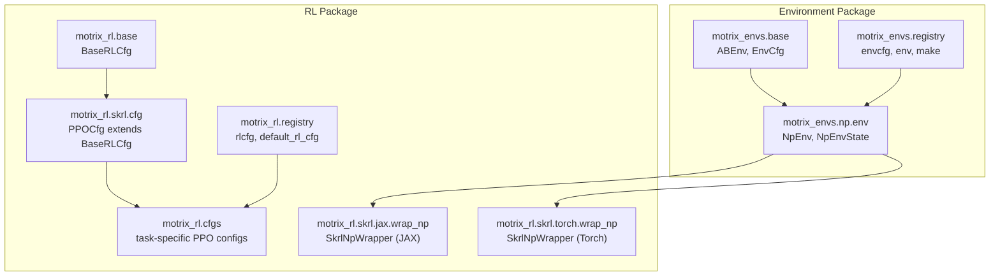

**Diagram sources**
- [base.py](file://motrix_envs/src/motrix_envs/base.py#L61-L85)
- [np/env.py](file://motrix_envs/src/motrix_envs/np/env.py#L52-L209)
- [registry.py](file://motrix_envs/src/motrix_envs/registry.py#L46-L161)
- [base.py](file://motrix_rl/src/motrix_rl/base.py#L20-L43)
- [cfg.py](file://motrix_rl/src/motrix_rl/skrl/cfg.py#L28-L74)
- [cfgs.py](file://motrix_rl/src/motrix_rl/cfgs.py#L22-L333)
- [registry.py](file://motrix_rl/src/motrix_rl/registry.py#L42-L115)
- [wrap_np.py (JAX)](file://motrix_rl/src/motrix_rl/skrl/jax/wrap_np.py#L27-L81)
- [wrap_np.py (Torch)](file://motrix_rl/src/motrix_rl/skrl/torch/wrap_np.py#L26-L80)

**Section sources**
- [base.py](file://motrix_envs/src/motrix_envs/base.py#L1-L85)
- [np/env.py](file://motrix_envs/src/motrix_envs/np/env.py#L1-L209)
- [registry.py](file://motrix_envs/src/motrix_envs/registry.py#L1-L172)
- [base.py](file://motrix_rl/src/motrix_rl/base.py#L1-L43)
- [cfg.py](file://motrix_rl/src/motrix_rl/skrl/cfg.py#L1-L74)
- [cfgs.py](file://motrix_rl/src/motrix_rl/cfgs.py#L1-L333)
- [registry.py](file://motrix_rl/src/motrix_rl/registry.py#L1-L115)
- [wrap_np.py (JAX)](file://motrix_rl/src/motrix_rl/skrl/jax/wrap_np.py#L1-L81)
- [wrap_np.py (Torch)](file://motrix_rl/src/motrix_rl/skrl/torch/wrap_np.py#L1-L80)

## Core Components
This section documents the foundational abstractions and their contracts.

- ABEnv (abstract base class)
  - Purpose: Defines the environment interface for vectorized environments backed by a physics engine
  - Required abstract properties:
    - num_envs: int — number of environments in the batch
    - cfg: EnvCfg — environment configuration object
    - observation_space: gym.Space — Gymnasium observation space
    - action_space: gym.Space — Gymnasium action space
  - Additional abstract methods to implement in subclasses:
    - apply_action(actions: np.ndarray, state: NpEnvState) -> NpEnvState
    - update_state(state: NpEnvState) -> NpEnvState
    - reset(data: SceneData, done: Optional[np.ndarray] = None) -> tuple[np.ndarray, dict]
  - Provided methods:
    - init_state() -> NpEnvState — initializes internal state and resets done environments
    - step(actions: np.ndarray) -> NpEnvState — orchestrates a single environment step
    - physics_step() — advances the physics simulation by configured substeps
    - model property — access to the underlying physics model
    - state property — access to the current environment state
    - render_spacing property — controls rendering layout for multi-environment grids

- EnvCfg (dataclass)
  - Purpose: Centralized configuration for environment runtime behavior
  - Fields:
    - model_file: str — path to the scene/model XML
    - sim_dt: float — simulation timestep
    - max_episode_seconds: float — optional maximum episode duration
    - ctrl_dt: float — control timestep
    - render_spacing: float — rendering grid spacing parameter
  - Computed properties:
    - max_episode_steps: Optional[int] — derived from max_episode_seconds / ctrl_dt
    - sim_substeps: int — derived from ctrl_dt / sim_dt (rounded)
  - Validation:
    - validate() — ensures sim_dt <= ctrl_dt

- BaseRLCfg (dataclass)
  - Purpose: Shared baseline for RL training configuration
  - Fields:
    - seed: Optional[int]
    - num_envs: int — number of parallel environments
    - play_num_envs: int — number of environments during evaluation
    - max_env_steps: int — total environment steps
    - check_point_interval: int — checkpoint frequency
  - Methods:
    - replace(**updates) -> BaseRLCfg — returns a new instance with updates applied
    - max_batch_env_steps: int — derived from max_env_steps and num_envs, rounded to the nearest check_point_interval

- PPOCfg (dataclass)
  - Purpose: Extends BaseRLCfg with PPO-specific parameters
  - Fields include model architecture, agent settings, learning rate scheduling, training settings, clipping parameters, loss settings, and reward shaping parameters

**Section sources**
- [base.py](file://motrix_envs/src/motrix_envs/base.py#L61-L85)
- [base.py](file://motrix_envs/src/motrix_envs/base.py#L23-L60)
- [np/env.py](file://motrix_envs/src/motrix_envs/np/env.py#L52-L209)
- [base.py](file://motrix_rl/src/motrix_rl/base.py#L20-L43)
- [cfg.py](file://motrix_rl/src/motrix_rl/skrl/cfg.py#L28-L74)

## Architecture Overview
The environment and RL configuration systems are decoupled but integrated via registries and wrappers:
- Environments are registered with names and backends; instances are created via a factory that validates configuration and selects the appropriate backend
- RL configurations are registered per environment and backend; defaults are resolved by the RL registry
- NumPy-based environments are wrapped for SKRL frameworks (JAX and Torch) to expose Gymnasium-compatible interfaces

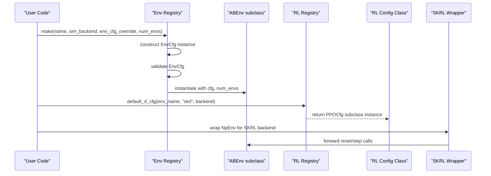

**Diagram sources**
- [registry.py](file://motrix_envs/src/motrix_envs/registry.py#L114-L161)
- [registry.py](file://motrix_rl/src/motrix_rl/registry.py#L81-L115)
- [wrap_np.py (JAX)](file://motrix_rl/src/motrix_rl/skrl/jax/wrap_np.py#L35-L61)
- [wrap_np.py (Torch)](file://motrix_rl/src/motrix_rl/skrl/torch/wrap_np.py#L34-L60)

## Detailed Component Analysis

### ABEnv Abstract Base Class
ABEnv defines the environment contract for vectorized simulations. Subclasses must implement:
- Observation and action spaces
- apply_action to apply actions to the physics state
- update_state to compute observations, rewards, terminations, and truncations
- reset to initialize states for newly done environments

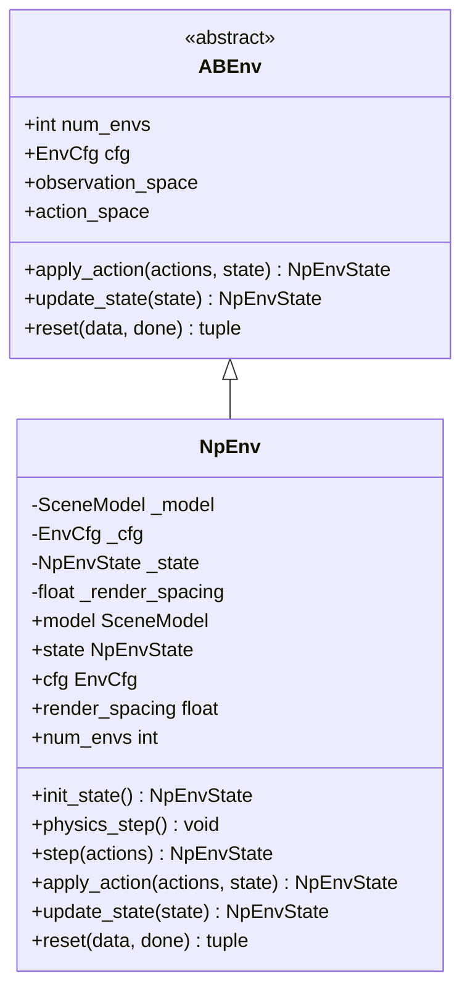

**Diagram sources**
- [base.py](file://motrix_envs/src/motrix_envs/base.py#L61-L85)
- [np/env.py](file://motrix_envs/src/motrix_envs/np/env.py#L52-L209)

**Section sources**
- [base.py](file://motrix_envs/src/motrix_envs/base.py#L61-L85)
- [np/env.py](file://motrix_envs/src/motrix_envs/np/env.py#L52-L209)

### EnvCfg Dataclass and Validation
EnvCfg centralizes environment configuration and provides computed properties and validation:
- Computed max_episode_steps and sim_substeps
- Validation ensuring sim_dt ≤ ctrl_dt

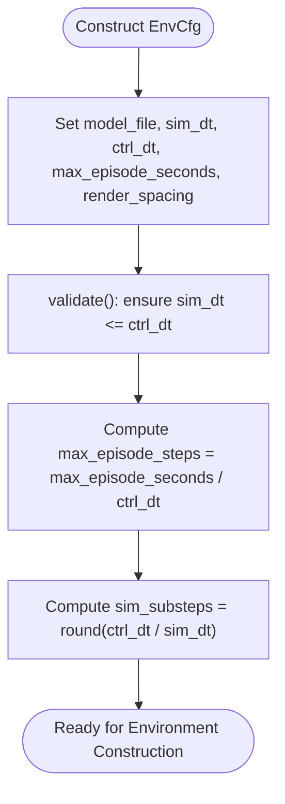

**Diagram sources**
- [base.py](file://motrix_envs/src/motrix_envs/base.py#L23-L60)

**Section sources**
- [base.py](file://motrix_envs/src/motrix_envs/base.py#L23-L60)

### Base RL Configuration Classes
BaseRLCfg provides shared training parameters and derived metrics. PPOCfg extends it with algorithm-specific parameters.

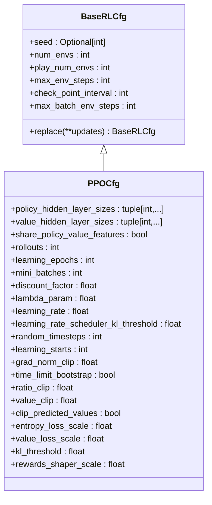

**Diagram sources**
- [base.py](file://motrix_rl/src/motrix_rl/base.py#L20-L43)
- [cfg.py](file://motrix_rl/src/motrix_rl/skrl/cfg.py#L28-L74)

**Section sources**
- [base.py](file://motrix_rl/src/motrix_rl/base.py#L20-L43)
- [cfg.py](file://motrix_rl/src/motrix_rl/skrl/cfg.py#L28-L74)

### Environment Registration and Factory
Environments are registered with names and backends. The factory constructs instances, applies overrides, validates configuration, and selects the backend.

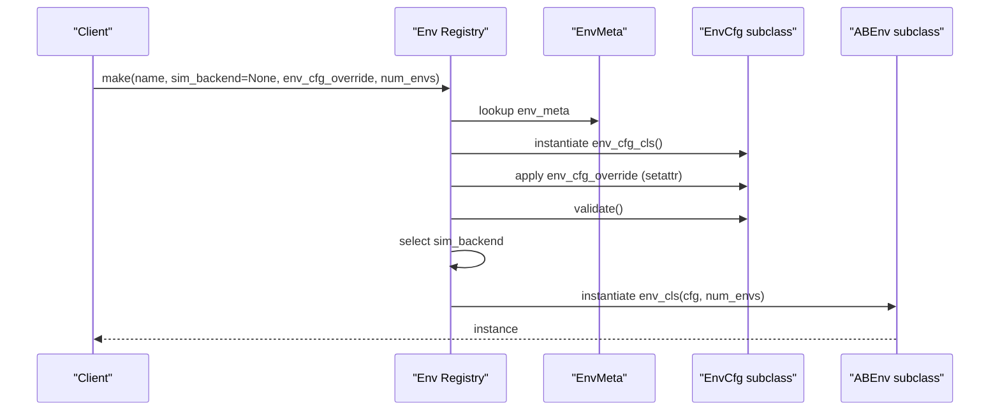

**Diagram sources**
- [registry.py](file://motrix_envs/src/motrix_envs/registry.py#L114-L161)

**Section sources**
- [registry.py](file://motrix_envs/src/motrix_envs/registry.py#L46-L161)

### RL Configuration Registration and Resolution
RL configurations are registered per environment and backend. Defaults are resolved by the RL registry.

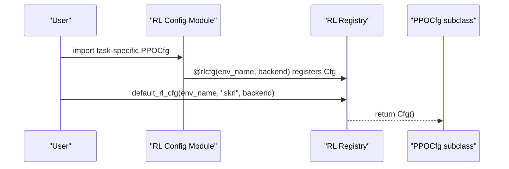

**Diagram sources**
- [cfgs.py](file://motrix_rl/src/motrix_rl/cfgs.py#L22-L333)
- [registry.py](file://motrix_rl/src/motrix_rl/registry.py#L63-L115)

**Section sources**
- [cfgs.py](file://motrix_rl/src/motrix_rl/cfgs.py#L22-L333)
- [registry.py](file://motrix_rl/src/motrix_rl/registry.py#L42-L115)

### SKRL Wrappers for NumPy Environments
SKRL wrappers adapt NumPy-based environments to JAX or Torch backends, exposing Gymnasium-compatible interfaces.

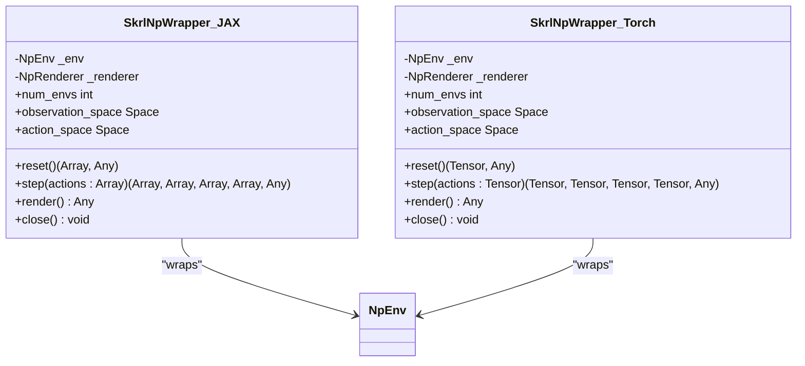

**Diagram sources**
- [wrap_np.py (JAX)](file://motrix_rl/src/motrix_rl/skrl/jax/wrap_np.py#L27-L81)
- [wrap_np.py (Torch)](file://motrix_rl/src/motrix_rl/skrl/torch/wrap_np.py#L26-L80)

**Section sources**
- [wrap_np.py (JAX)](file://motrix_rl/src/motrix_rl/skrl/jax/wrap_np.py#L27-L81)
- [wrap_np.py (Torch)](file://motrix_rl/src/motrix_rl/skrl/torch/wrap_np.py#L26-L80)

### Example: Extending ABEnv to Create a Custom Environment
To create a new environment:
- Define a subclass of NpEnv (or ABEnv) and implement:
  - observation_space and action_space properties
  - apply_action to set actuator controls
  - update_state to compute observations, rewards, terminated, truncated
  - reset to initialize states
- Register the environment configuration with a name and the environment class with the same name and backend

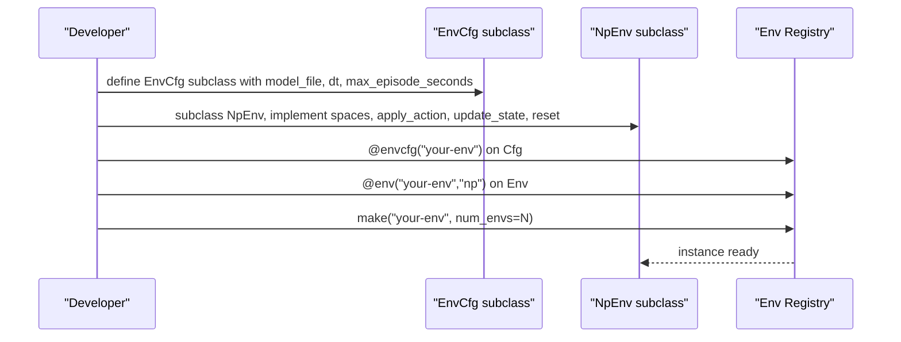

**Diagram sources**
- [cartpole_np.py](file://motrix_envs/src/motrix_envs/basic/cartpole/cartpole_np.py#L26-L98)
- [cfg.py (CartPole)](file://motrix_envs/src/motrix_envs/basic/cartpole/cfg.py#L25-L32)
- [registry.py](file://motrix_envs/src/motrix_envs/registry.py#L53-L99)

**Section sources**
- [cartpole_np.py](file://motrix_envs/src/motrix_envs/basic/cartpole/cartpole_np.py#L26-L98)
- [cfg.py (CartPole)](file://motrix_envs/src/motrix_envs/basic/cartpole/cfg.py#L25-L32)
- [registry.py](file://motrix_envs/src/motrix_envs/registry.py#L53-L99)

### Example: Extending Base RL Configuration Classes
To create a new RL configuration:
- Extend PPOCfg (or BaseRLCfg) with task-specific parameters
- Register the configuration with @rlcfg("env-name", backend="jax|torch")

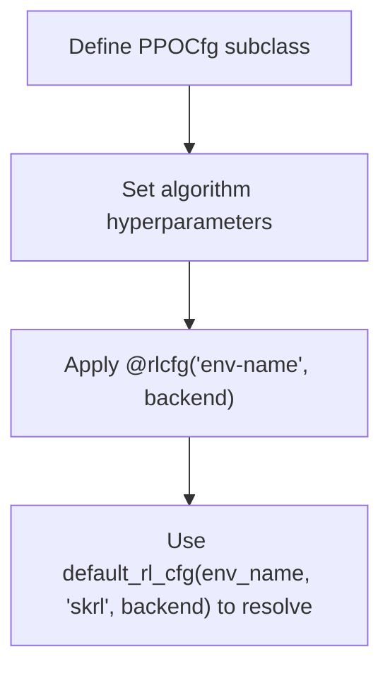

**Diagram sources**
- [cfgs.py](file://motrix_rl/src/motrix_rl/cfgs.py#L22-L333)
- [registry.py](file://motrix_rl/src/motrix_rl/registry.py#L63-L115)

**Section sources**
- [cfgs.py](file://motrix_rl/src/motrix_rl/cfgs.py#L22-L333)
- [registry.py](file://motrix_rl/src/motrix_rl/registry.py#L63-L115)

## Dependency Analysis
The following diagram shows key dependencies among base classes, registries, and wrappers:

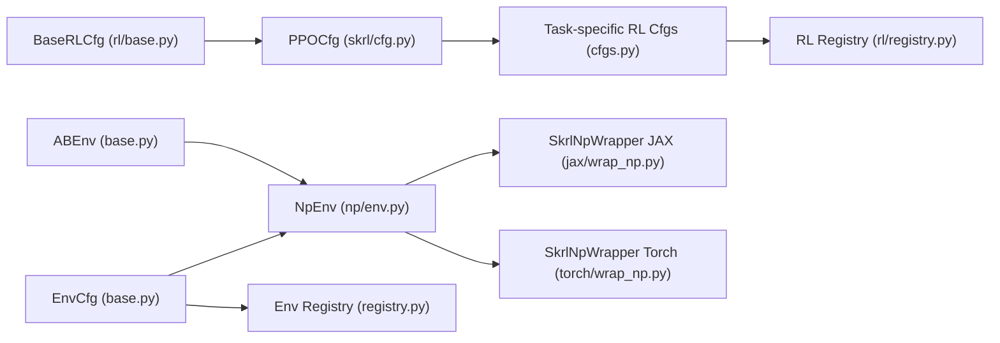

**Diagram sources**
- [base.py](file://motrix_envs/src/motrix_envs/base.py#L23-L85)
- [np/env.py](file://motrix_envs/src/motrix_envs/np/env.py#L52-L209)
- [registry.py](file://motrix_envs/src/motrix_envs/registry.py#L46-L161)
- [base.py](file://motrix_rl/src/motrix_rl/base.py#L20-L43)
- [cfg.py](file://motrix_rl/src/motrix_rl/skrl/cfg.py#L28-L74)
- [cfgs.py](file://motrix_rl/src/motrix_rl/cfgs.py#L22-L333)
- [registry.py](file://motrix_rl/src/motrix_rl/registry.py#L42-L115)
- [wrap_np.py (JAX)](file://motrix_rl/src/motrix_rl/skrl/jax/wrap_np.py#L27-L81)
- [wrap_np.py (Torch)](file://motrix_rl/src/motrix_rl/skrl/torch/wrap_np.py#L26-L80)

**Section sources**
- [base.py](file://motrix_envs/src/motrix_envs/base.py#L23-L85)
- [np/env.py](file://motrix_envs/src/motrix_envs/np/env.py#L52-L209)
- [registry.py](file://motrix_envs/src/motrix_envs/registry.py#L46-L161)
- [base.py](file://motrix_rl/src/motrix_rl/base.py#L20-L43)
- [cfg.py](file://motrix_rl/src/motrix_rl/skrl/cfg.py#L28-L74)
- [cfgs.py](file://motrix_rl/src/motrix_rl/cfgs.py#L22-L333)
- [registry.py](file://motrix_rl/src/motrix_rl/registry.py#L42-L115)
- [wrap_np.py (JAX)](file://motrix_rl/src/motrix_rl/skrl/jax/wrap_np.py#L27-L81)
- [wrap_np.py (Torch)](file://motrix_rl/src/motrix_rl/skrl/torch/wrap_np.py#L26-L80)

## Performance Considerations
- Simulation substeps: sim_substeps determines how many physics steps are executed per control step; tune sim_dt and ctrl_dt to balance accuracy and speed
- Vectorization: num_envs controls parallelism; larger batches improve throughput but require sufficient memory
- Checkpoint intervals: check_point_interval affects training throughput and checkpoint granularity
- Rendering: render_spacing influences rendering overhead; set to 0 for training and increase for visualization

## Troubleshooting Guide
Common issues and resolutions:
- Environment not registered: Ensure the environment configuration and class are decorated with @envcfg and @env respectively and registered under the same name
- Unsupported backend: Only "np" is supported for environment registration; verify the backend argument
- Configuration override errors: Only existing attributes can be overridden; verify keys against the EnvCfg subclass
- Validation failures: EnvCfg.validate enforces sim_dt ≤ ctrl_dt; adjust timesteps accordingly
- RL configuration resolution: If default_rl_cfg fails, ensure the environment name and backend are registered via @rlcfg

**Section sources**
- [registry.py](file://motrix_envs/src/motrix_envs/registry.py#L46-L161)
- [base.py](file://motrix_envs/src/motrix_envs/base.py#L53-L60)
- [registry.py](file://motrix_rl/src/motrix_rl/registry.py#L81-L115)

## Conclusion
The base classes establish a clear contract for environments and RL configurations:
- ABEnv and EnvCfg define the environment interface and configuration
- BaseRLCfg and PPOCfg define shared and algorithm-specific RL parameters
- Registries enforce contract compliance and enable flexible composition
- Wrappers integrate NumPy environments with SKRL frameworks

By adhering to these contracts and leveraging the registries, developers can extend the system with new environments and training configurations while maintaining compatibility and consistency.

## Appendices

### Example: Creating a Locomotion Environment
- Define a configuration class inheriting from EnvCfg with task-specific fields (e.g., noise_config, control_config, reward_config)
- Implement a subclass of NpEnv with observation/action spaces, apply_action, update_state, and reset
- Register the configuration and environment with matching names and backend

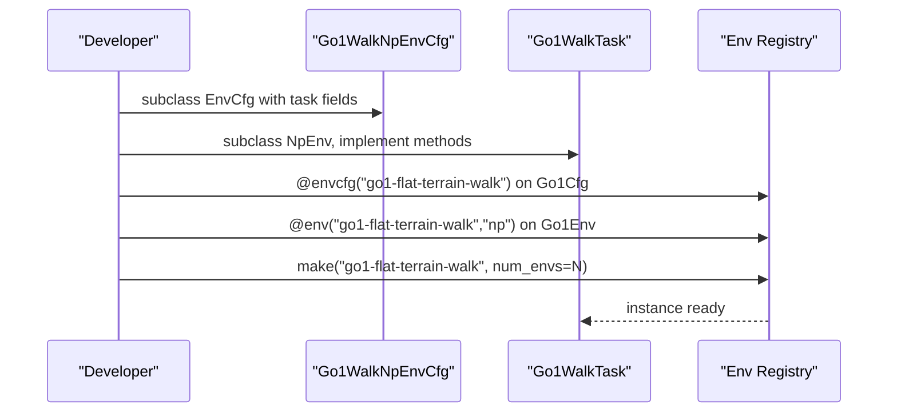

**Diagram sources**
- [cfg.py (Go1)](file://motrix_envs/src/motrix_envs/locomotion/go1/cfg.py#L122-L151)
- [walk_np.py](file://motrix_envs/src/motrix_envs/locomotion/go1/walk_np.py#L26-L287)
- [registry.py](file://motrix_envs/src/motrix_envs/registry.py#L53-L99)

**Section sources**
- [cfg.py (Go1)](file://motrix_envs/src/motrix_envs/locomotion/go1/cfg.py#L122-L151)
- [walk_np.py](file://motrix_envs/src/motrix_envs/locomotion/go1/walk_np.py#L26-L287)
- [registry.py](file://motrix_envs/src/motrix_envs/registry.py#L53-L99)

### Example: Creating a Manipulation Environment
- Define a configuration class inheriting from EnvCfg with task-specific fields (e.g., init_state, control_config, asset)
- Implement a subclass of NpEnv with observation/action spaces, apply_action, update_state, and reset

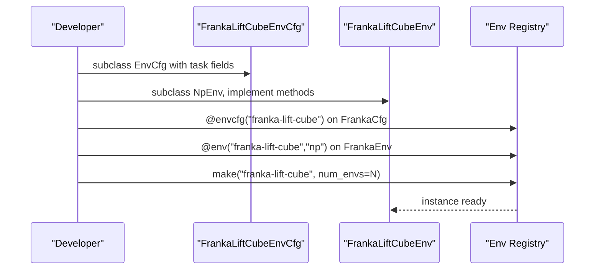

**Diagram sources**
- [cfg.py (Franka Lift Cube)](file://motrix_envs/src/motrix_envs/manipulation/franka_lift_cube/cfg.py#L69-L84)
- [registry.py](file://motrix_envs/src/motrix_envs/registry.py#L53-L99)

**Section sources**
- [cfg.py (Franka Lift Cube)](file://motrix_envs/src/motrix_envs/manipulation/franka_lift_cube/cfg.py#L69-L84)
- [registry.py](file://motrix_envs/src/motrix_envs/registry.py#L53-L99)