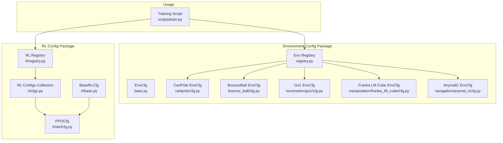
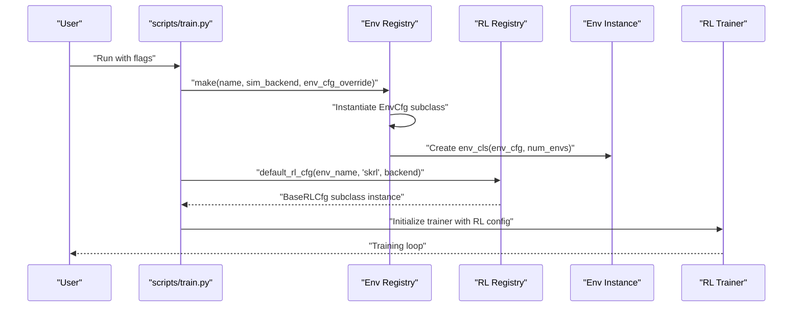
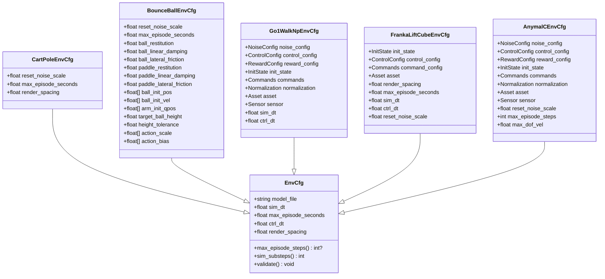
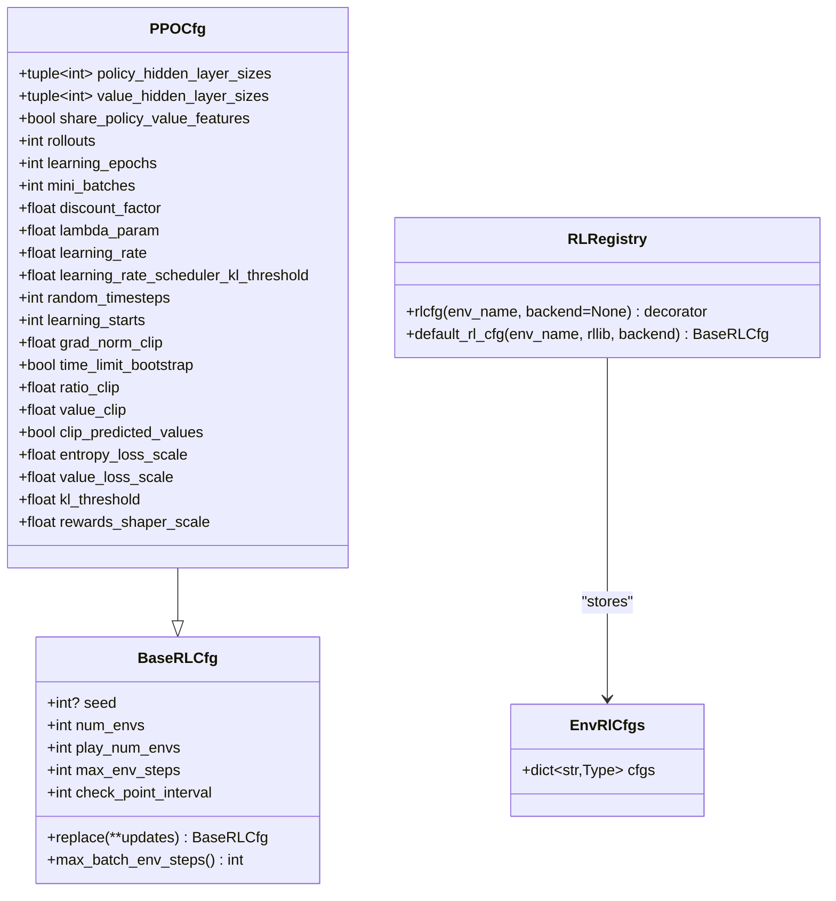
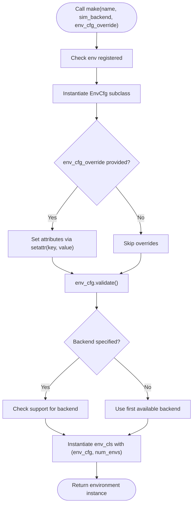
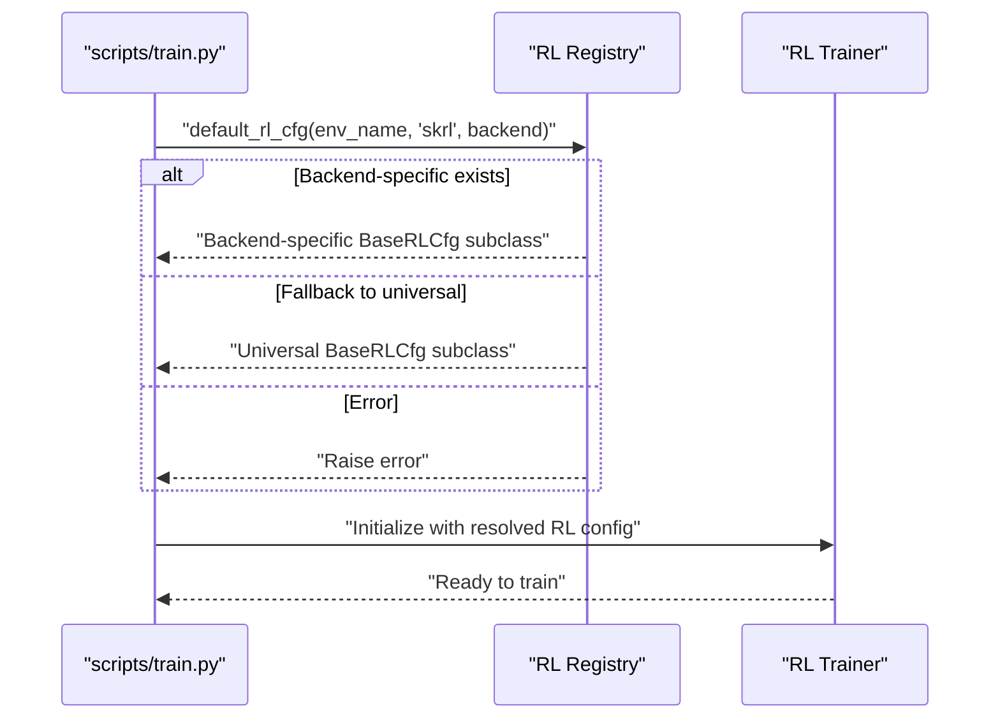
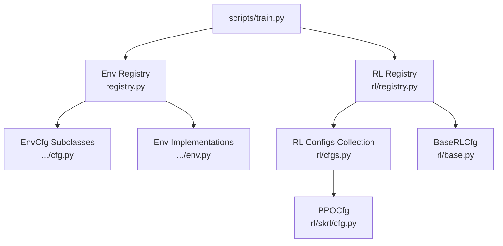

# Configuration APIs

<cite>
**Referenced Files in This Document**
- [base.py](file://motrix_envs/src/motrix_envs/base.py)
- [registry.py](file://motrix_envs/src/motrix_envs/registry.py)
- [cfg.py](file://motrix_envs/src/motrix_envs/basic/cartpole/cfg.py)
- [cfg.py](file://motrix_envs/src/motrix_envs/basic/bounce_ball/cfg.py)
- [cfg.py](file://motrix_envs/src/motrix_envs/locomotion/go1/cfg.py)
- [cfg.py](file://motrix_envs/src/motrix_envs/manipulation/franka_lift_cube/cfg.py)
- [cfg.py](file://motrix_envs/src/motrix_envs/navigation/anymal_c/cfg.py)
- [cartpole_np.py](file://motrix_envs/src/motrix_envs/basic/cartpole/cartpole_np.py)
- [base.py](file://motrix_rl/src/motrix_rl/base.py)
- [cfg.py](file://motrix_rl/src/motrix_rl/skrl/cfg.py)
- [cfgs.py](file://motrix_rl/src/motrix_rl/cfgs.py)
- [registry.py](file://motrix_rl/src/motrix_rl/registry.py)
- [train.py](file://scripts/train.py)
- [physics_environment.md](file://docs/source/en/user_guide/tutorial/physics_environment.md)
- [training_environment_config.md](file://docs/source/en/user_guide/tutorial/training_environment_config.md)
</cite>

## Table of Contents
1. [Introduction](#introduction)
2. [Project Structure](#project-structure)
3. [Core Components](#core-components)
4. [Architecture Overview](#architecture-overview)
5. [Detailed Component Analysis](#detailed-component-analysis)
6. [Dependency Analysis](#dependency-analysis)
7. [Performance Considerations](#performance-considerations)
8. [Troubleshooting Guide](#troubleshooting-guide)
9. [Conclusion](#conclusion)
10. [Appendices](#appendices)

## Introduction
This document provides comprehensive API documentation for the configuration management system across the framework. It covers environment configuration dataclasses (EnvCfg), reinforcement learning configuration classes (BaseRLCfg and PPOCfg), and environment-specific parameter structures. It explains configuration validation, parameter inheritance patterns, override systems, creation and selection processes, defaults, and customization options. It also documents the relationship between configuration classes and their registry entries, and presents best practices and common patterns used throughout the framework.

## Project Structure
The configuration system spans two primary packages:
- Environment configuration package: Defines EnvCfg and environment-specific parameter structures, and registers them via decorators.
- RL configuration package: Defines BaseRLCfg and PPOCfg, organizes RL configurations per environment and backend, and exposes selection utilities.

**Diagram sources**
- [base.py](file://motrix_envs/src/motrix_envs/base.py#L23-L58)
- [registry.py](file://motrix_envs/src/motrix_envs/registry.py#L46-L161)
- [cfg.py](file://motrix_envs/src/motrix_envs/basic/cartpole/cfg.py#L25-L31)
- [cfg.py](file://motrix_envs/src/motrix_envs/basic/bounce_ball/cfg.py#L25-L65)
- [cfg.py](file://motrix_envs/src/motrix_envs/locomotion/go1/cfg.py#L122-L188)
- [cfg.py](file://motrix_envs/src/motrix_envs/manipulation/franka_lift_cube/cfg.py#L69-L84)
- [cfg.py](file://motrix_envs/src/motrix_envs/navigation/anymal_c/cfg.py#L95-L116)
- [base.py](file://motrix_rl/src/motrix_rl/base.py#L20-L43)
- [cfg.py](file://motrix_rl/src/motrix_rl/skrl/cfg.py#L28-L74)
- [cfgs.py](file://motrix_rl/src/motrix_rl/cfgs.py#L22-L333)
- [registry.py](file://motrix_rl/src/motrix_rl/registry.py#L42-L114)
- [train.py](file://scripts/train.py#L52-L90)

**Section sources**
- [base.py](file://motrix_envs/src/motrix_envs/base.py#L23-L85)
- [registry.py](file://motrix_envs/src/motrix_envs/registry.py#L46-L161)
- [base.py](file://motrix_rl/src/motrix_rl/base.py#L20-L43)
- [cfg.py](file://motrix_rl/src/motrix_rl/skrl/cfg.py#L28-L74)
- [cfgs.py](file://motrix_rl/src/motrix_rl/cfgs.py#L22-L333)
- [registry.py](file://motrix_rl/src/motrix_rl/registry.py#L42-L114)
- [train.py](file://scripts/train.py#L52-L90)

## Core Components
- EnvCfg: Base environment configuration dataclass with simulation timing, episode limits, and validation.
- Environment-specific EnvCfg subclasses: Extend EnvCfg with domain/task-specific parameters and nested structures.
- BaseRLCfg: Base RL configuration dataclass with training parameters and helpers.
- PPOCfg: RL configuration specialized for PPO, aligned with SKRL’s YAML structure.
- RL configuration collection: Predefined RL configurations grouped by task and backend.
- Registries:
  - Environment registry: Registers EnvCfg classes and environment implementations by name and backend.
  - RL registry: Registers RL configuration classes per environment and backend, and resolves defaults.

Key behaviors:
- Validation: EnvCfg.validate ensures sim_dt ≤ ctrl_dt.
- Derived properties: EnvCfg provides max_episode_steps and sim_substeps computed from dt parameters.
- Overrides: make supports env_cfg_override dictionary to set attributes safely.
- Selection: default_rl_cfg chooses backend-specific RL configs with fallback to universal ones.

**Section sources**
- [base.py](file://motrix_envs/src/motrix_envs/base.py#L23-L58)
- [registry.py](file://motrix_envs/src/motrix_envs/registry.py#L114-L161)
- [base.py](file://motrix_rl/src/motrix_rl/base.py#L20-L43)
- [cfg.py](file://motrix_rl/src/motrix_rl/skrl/cfg.py#L28-L74)
- [cfgs.py](file://motrix_rl/src/motrix_rl/cfgs.py#L22-L333)
- [registry.py](file://motrix_rl/src/motrix_rl/registry.py#L81-L114)

## Architecture Overview
The configuration architecture separates environment and RL concerns while enabling flexible composition and selection.

**Diagram sources**
- [train.py](file://scripts/train.py#L52-L90)
- [registry.py](file://motrix_envs/src/motrix_envs/registry.py#L114-L161)
- [registry.py](file://motrix_rl/src/motrix_rl/registry.py#L81-L114)

## Detailed Component Analysis

### EnvCfg and Environment-Specific Configurations
EnvCfg defines core simulation parameters and derived properties. Environment-specific EnvCfg subclasses extend it with domain parameters and nested structures.

**Diagram sources**
- [base.py](file://motrix_envs/src/motrix_envs/base.py#L23-L58)
- [cfg.py](file://motrix_envs/src/motrix_envs/basic/cartpole/cfg.py#L25-L31)
- [cfg.py](file://motrix_envs/src/motrix_envs/basic/bounce_ball/cfg.py#L25-L65)
- [cfg.py](file://motrix_envs/src/motrix_envs/locomotion/go1/cfg.py#L122-L188)
- [cfg.py](file://motrix_envs/src/motrix_envs/manipulation/franka_lift_cube/cfg.py#L69-L84)
- [cfg.py](file://motrix_envs/src/motrix_envs/navigation/anymal_c/cfg.py#L95-L116)

Implementation highlights:
- EnvCfg.validate enforces sim_dt ≤ ctrl_dt.
- EnvCfg.derived properties compute episode steps and simulation substeps from dt.
- Environment-specific EnvCfg instances define model_file, episode duration, and domain-specific parameters.
- Nested structures (e.g., NoiseConfig, ControlConfig, RewardConfig) encapsulate related parameters.

**Section sources**
- [base.py](file://motrix_envs/src/motrix_envs/base.py#L23-L58)
- [cfg.py](file://motrix_envs/src/motrix_envs/basic/cartpole/cfg.py#L25-L31)
- [cfg.py](file://motrix_envs/src/motrix_envs/basic/bounce_ball/cfg.py#L25-L65)
- [cfg.py](file://motrix_envs/src/motrix_envs/locomotion/go1/cfg.py#L23-L188)
- [cfg.py](file://motrix_envs/src/motrix_envs/manipulation/franka_lift_cube/cfg.py#L69-L84)
- [cfg.py](file://motrix_envs/src/motrix_envs/navigation/anymal_c/cfg.py#L95-L116)

### RL Configuration Classes and Registry
BaseRLCfg provides training parameters and a replace helper. PPOCfg specializes it for SKRL-compatible parameters. The RL registry associates RL configurations with environments and backends.

**Diagram sources**
- [base.py](file://motrix_rl/src/motrix_rl/base.py#L20-L43)
- [cfg.py](file://motrix_rl/src/motrix_rl/skrl/cfg.py#L28-L74)
- [registry.py](file://motrix_rl/src/motrix_rl/registry.py#L28-L114)

Selection logic:
- default_rl_cfg prefers backend-specific configs, falls back to universal (backend=None), and raises if none found.

**Section sources**
- [base.py](file://motrix_rl/src/motrix_rl/base.py#L20-L43)
- [cfg.py](file://motrix_rl/src/motrix_rl/skrl/cfg.py#L28-L74)
- [registry.py](file://motrix_rl/src/motrix_rl/registry.py#L81-L114)

### Configuration Creation and Override Flow
The environment creation flow constructs EnvCfg, applies overrides, validates, selects backend, and instantiates the environment.

**Diagram sources**
- [registry.py](file://motrix_envs/src/motrix_envs/registry.py#L114-L161)

**Section sources**
- [registry.py](file://motrix_envs/src/motrix_envs/registry.py#L114-L161)

### RL Configuration Resolution and Usage
RL configuration resolution follows a strict precedence: backend-specific → universal → overrides.

**Diagram sources**
- [registry.py](file://motrix_rl/src/motrix_rl/registry.py#L81-L114)
- [train.py](file://scripts/train.py#L76-L86)

**Section sources**
- [registry.py](file://motrix_rl/src/motrix_rl/registry.py#L81-L114)
- [train.py](file://scripts/train.py#L76-L86)

### Examples of Configuration Patterns
- Environment model and timing:
  - Define model_file and set sim_dt, ctrl_dt appropriately.
  - Use max_episode_seconds to derive episode steps.
- Domain-specific parameters:
  - Locomotion: nested NoiseConfig, ControlConfig, RewardConfig, InitState, Commands, Normalization, Asset, Sensor.
  - Manipulation: InitState, ControlConfig, Commands, Asset with task-specific targets and limits.
  - Navigation: Similar nested structures tailored for navigation tasks.
- RL configuration:
  - Use PPOCfg defaults and override selectively (e.g., hidden sizes, rollouts, learning rates).
  - Prefer backend-specific RL configs when available.

**Section sources**
- [cfg.py](file://motrix_envs/src/motrix_envs/basic/cartpole/cfg.py#L25-L31)
- [cfg.py](file://motrix_envs/src/motrix_envs/basic/bounce_ball/cfg.py#L25-L65)
- [cfg.py](file://motrix_envs/src/motrix_envs/locomotion/go1/cfg.py#L122-L188)
- [cfg.py](file://motrix_envs/src/motrix_envs/manipulation/franka_lift_cube/cfg.py#L69-L84)
- [cfg.py](file://motrix_envs/src/motrix_envs/navigation/anymal_c/cfg.py#L95-L116)
- [cfg.py](file://motrix_rl/src/motrix_rl/skrl/cfg.py#L28-L74)
- [cfgs.py](file://motrix_rl/src/motrix_rl/cfgs.py#L22-L333)

## Dependency Analysis
The configuration system relies on decorators and registries to bind configurations to environment names and backends.

**Diagram sources**
- [registry.py](file://motrix_envs/src/motrix_envs/registry.py#L46-L161)
- [registry.py](file://motrix_rl/src/motrix_rl/registry.py#L42-L114)
- [cfgs.py](file://motrix_rl/src/motrix_rl/cfgs.py#L22-L333)
- [cfg.py](file://motrix_rl/src/motrix_rl/skrl/cfg.py#L28-L74)
- [base.py](file://motrix_rl/src/motrix_rl/base.py#L20-L43)
- [train.py](file://scripts/train.py#L52-L90)

**Section sources**
- [registry.py](file://motrix_envs/src/motrix_envs/registry.py#L46-L161)
- [registry.py](file://motrix_rl/src/motrix_rl/registry.py#L42-L114)
- [cfgs.py](file://motrix_rl/src/motrix_rl/cfgs.py#L22-L333)
- [cfg.py](file://motrix_rl/src/motrix_rl/skrl/cfg.py#L28-L74)
- [base.py](file://motrix_rl/src/motrix_rl/base.py#L20-L43)
- [train.py](file://scripts/train.py#L52-L90)

## Performance Considerations
- Simulation stability: Keep sim_dt reasonable (e.g., 0.001–0.02) and ensure ctrl_dt is a multiple of sim_dt.
- Episode length: Use max_episode_seconds to cap training duration; EnvCfg derives max_episode_steps from dt.
- Parallelism: Adjust num_envs thoughtfully; BaseRLCfg provides max_batch_env_steps to align checkpoint intervals.
- Backend selection: Choose backend-specific RL configs for optimal performance and compatibility.

[No sources needed since this section provides general guidance]

## Troubleshooting Guide
Common configuration issues and resolutions:
- Invalid dt relationship: EnvCfg.validate raises if sim_dt > ctrl_dt.
- Unsupported backend: Env registry rejects unsupported sim backends and missing registrations.
- Missing registration: Creating an environment requires prior registration of EnvCfg and env class.
- RL config mismatch: RL registry raises if no backend-specific or universal RL config is found.
- Path errors: Ensure model_file paths are correct and accessible; avoid hard-coded absolute paths.

**Section sources**
- [base.py](file://motrix_envs/src/motrix_envs/base.py#L53-L58)
- [registry.py](file://motrix_envs/src/motrix_envs/registry.py#L71-L82)
- [registry.py](file://motrix_envs/src/motrix_envs/registry.py#L132-L134)
- [registry.py](file://motrix_rl/src/motrix_rl/registry.py#L94-L98)
- [physics_environment.md](file://docs/source/en/user_guide/tutorial/physics_environment.md#L47-L59)

## Conclusion
The framework’s configuration system cleanly separates environment and RL concerns, enabling modular, extensible, and maintainable setups. EnvCfg and environment-specific subclasses capture simulation and domain parameters, while BaseRLCfg and PPOCfg standardize RL hyperparameters. Registries connect configurations to environment names and backends, and selection logic ensures robust defaults with clear override semantics. Following the documented patterns and best practices yields reliable and efficient training pipelines.

[No sources needed since this section summarizes without analyzing specific files]

## Appendices

### API Reference: EnvCfg
- Fields:
  - model_file: Path to the simulation model file.
  - sim_dt: Simulation timestep.
  - max_episode_seconds: Episode duration in seconds.
  - ctrl_dt: Control update interval.
  - render_spacing: Rendering interval.
- Properties:
  - max_episode_steps: Computed from max_episode_seconds and ctrl_dt.
  - sim_substeps: Computed from sim_dt and ctrl_dt.
- Methods:
  - validate(): Enforces sim_dt ≤ ctrl_dt.

**Section sources**
- [base.py](file://motrix_envs/src/motrix_envs/base.py#L23-L58)

### API Reference: Environment Registry
- Decorators:
  - @envcfg(name): Registers an EnvCfg subclass.
  - @env(name, "np"): Registers an environment implementation for the "np" backend.
- Functions:
  - contains(name): Checks registration.
  - make(name, sim_backend, env_cfg_override, num_envs): Creates an environment instance with overrides and validation.
  - list_registered_envs(): Lists registered environments and backends.

**Section sources**
- [registry.py](file://motrix_envs/src/motrix_envs/registry.py#L46-L172)

### API Reference: RL Registry and Configs
- Decorators:
  - @rlcfg(env_name, backend=None): Registers a BaseRLCfg subclass for an environment and backend.
- Functions:
  - default_rl_cfg(env_name, rllib, backend): Resolves RL config with backend-specific preference and fallback.
- Predefined RL Configs:
  - Grouped by task domains (basic, locomotion, manipulation, navigation) and backends (jax, torch).
  - Inherit from PPOCfg and override selected parameters.

**Section sources**
- [registry.py](file://motrix_rl/src/motrix_rl/registry.py#L63-L114)
- [cfgs.py](file://motrix_rl/src/motrix_rl/cfgs.py#L22-L333)
- [cfg.py](file://motrix_rl/src/motrix_rl/skrl/cfg.py#L28-L74)

### Usage Examples and Best Practices
- Environment configuration:
  - Define EnvCfg subclass with model_file and dt parameters.
  - Use nested structures for domain-specific parameters.
  - Derive episode steps from max_episode_seconds.
- RL configuration:
  - Prefer backend-specific RL configs when available.
  - Override only necessary parameters; keep defaults for others.
  - Use BaseRLCfg.replace for temporary overrides.
- Training script integration:
  - Pass flags to override RL parameters (e.g., num_envs, seed).
  - Allow automatic backend detection.

**Section sources**
- [train.py](file://scripts/train.py#L52-L90)
- [training_environment_config.md](file://docs/source/en/user_guide/tutorial/training_environment_config.md#L129-L179)
- [physics_environment.md](file://docs/source/en/user_guide/tutorial/physics_environment.md#L10-L29)