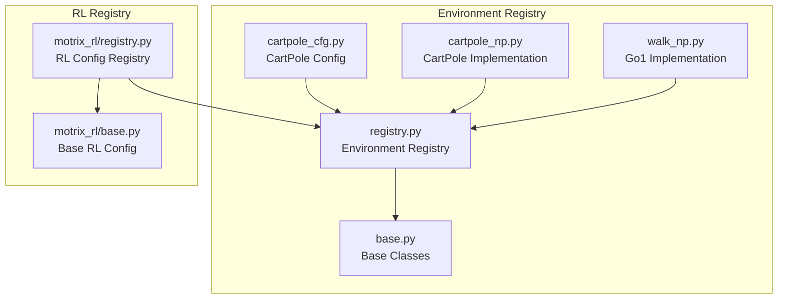
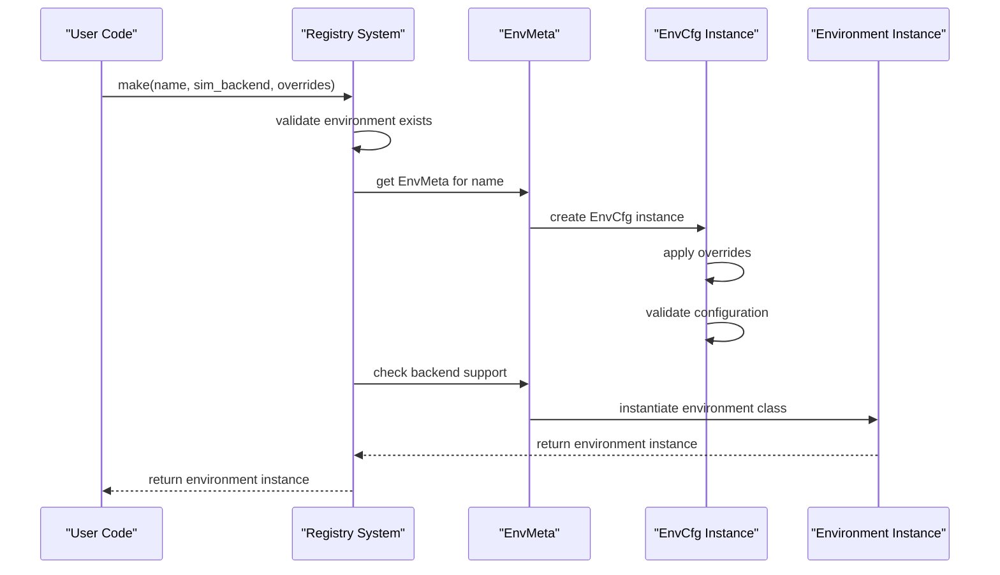
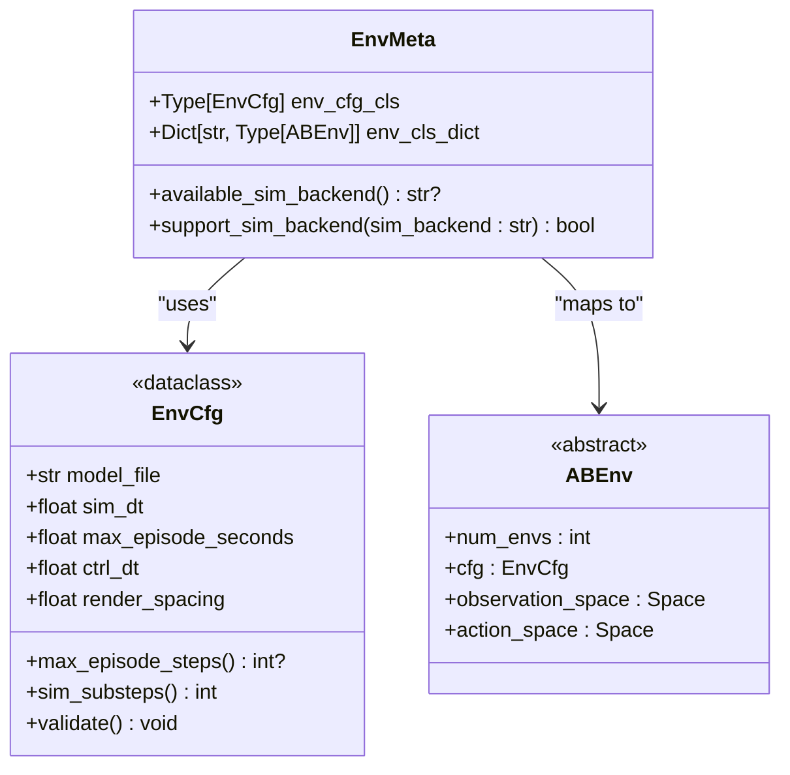
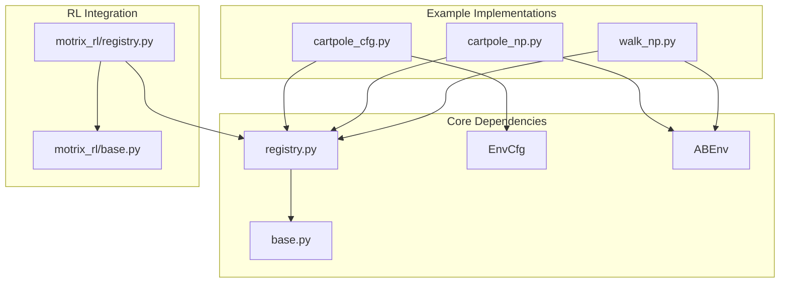

# Environment Registry API

<cite>
**Referenced Files in This Document**
- [registry.py](file://motrix_envs/src/motrix_envs/registry.py)
- [base.py](file://motrix_envs/src/motrix_envs/base.py)
- [README.md](file://motrix_envs/README.md)
- [cartpole_np.py](file://motrix_envs/src/motrix_envs/basic/cartpole/cartpole_np.py)
- [cartpole_cfg.py](file://motrix_envs/src/motrix_envs/basic/cartpole/cfg.py)
- [walk_np.py](file://motrix_envs/src/motrix_envs/locomotion/go1/walk_np.py)
- [registry.py](file://motrix_rl/src/motrix_rl/registry.py)
- [base.py](file://motrix_rl/src/motrix_rl/base.py)
</cite>

## Table of Contents
1. [Introduction](#introduction)
2. [Project Structure](#project-structure)
3. [Core Components](#core-components)
4. [Architecture Overview](#architecture-overview)
5. [Detailed Component Analysis](#detailed-component-analysis)
6. [Dependency Analysis](#dependency-analysis)
7. [Performance Considerations](#performance-considerations)
8. [Troubleshooting Guide](#troubleshooting-guide)
9. [Conclusion](#conclusion)

## Introduction
This document provides comprehensive API documentation for the environment registry system used in the MotrixLab-S1 project. The registry enables dynamic registration and instantiation of simulation environments with configurable parameters and backend selection. It supports a decorator-based registration system for environment configurations and implementations, and provides robust error handling for common misconfiguration scenarios.

## Project Structure
The environment registry system is primarily implemented in the `motrix_envs` package, with supporting base classes and configuration structures. The RL configuration registry in `motrix_rl` complements the environment registry by providing training configuration management.



**Diagram sources**
- [registry.py](file://motrix_envs/src/motrix_envs/registry.py#L1-L172)
- [base.py](file://motrix_envs/src/motrix_envs/base.py#L1-L85)
- [cartpole_cfg.py](file://motrix_envs/src/motrix_envs/basic/cartpole/cfg.py#L1-L32)
- [cartpole_np.py](file://motrix_envs/src/motrix_envs/basic/cartpole/cartpole_np.py#L1-L98)
- [walk_np.py](file://motrix_envs/src/motrix_envs/locomotion/go1/walk_np.py#L1-L387)
- [registry.py](file://motrix_rl/src/motrix_rl/registry.py#L1-L115)
- [base.py](file://motrix_rl/src/motrix_rl/base.py#L1-L43)

**Section sources**
- [registry.py](file://motrix_envs/src/motrix_envs/registry.py#L1-L172)
- [base.py](file://motrix_envs/src/motrix_envs/base.py#L1-L85)
- [README.md](file://motrix_envs/README.md#L1-L173)

## Core Components
The environment registry system consists of several key components that work together to manage environment registration and instantiation:

### EnvMeta Class
The `EnvMeta` class serves as the central metadata container for environment configurations and implementations. It maintains two primary attributes:

- **env_cfg_cls**: The configuration class associated with the environment
- **env_cls_dict**: A dictionary mapping simulation backends to environment implementation classes

The class provides utility methods for backend availability checking and support verification.

### Global Registry Storage
The registry maintains a global dictionary `_envs` that maps environment names to their corresponding `EnvMeta` instances. This allows for centralized environment discovery and management.

### Base Classes
The system relies on two fundamental base classes:
- **EnvCfg**: Defines the configuration interface and validation mechanisms
- **ABEnv**: Abstract base class defining the environment interface contract

**Section sources**
- [registry.py](file://motrix_envs/src/motrix_envs/registry.py#L24-L36)
- [base.py](file://motrix_envs/src/motrix_envs/base.py#L23-L85)

## Architecture Overview
The environment registry follows a layered architecture with clear separation of concerns:



**Diagram sources**
- [registry.py](file://motrix_envs/src/motrix_envs/registry.py#L114-L160)
- [base.py](file://motrix_envs/src/motrix_envs/base.py#L23-L60)

## Detailed Component Analysis

### EnvMeta Class Structure
The `EnvMeta` class encapsulates environment metadata and provides essential utility functions:



**Diagram sources**
- [registry.py](file://motrix_envs/src/motrix_envs/registry.py#L24-L36)
- [base.py](file://motrix_envs/src/motrix_envs/base.py#L23-L85)

#### EnvMeta Methods
- **available_sim_backend()**: Returns the first available simulation backend or None
- **support_sim_backend(sim_backend)**: Checks if a specific backend is supported

**Section sources**
- [registry.py](file://motrix_envs/src/motrix_envs/registry.py#L24-L36)
- [base.py](file://motrix_envs/src/motrix_envs/base.py#L23-L85)

### Registry Functions

#### contains(name: str) -> bool
Checks if an environment configuration is registered in the system.

**Parameters:**
- `name` (str): Environment name to check

**Returns:**
- `bool`: True if environment is registered, False otherwise

**Exception Handling:**
- No exceptions raised

**Section sources**
- [registry.py](file://motrix_envs/src/motrix_envs/registry.py#L41-L43)

#### register_env_config(name: str, env_cfg_cls: Type[EnvCfg]) -> None
Registers an environment configuration class with a specific name.

**Parameters:**
- `name` (str): Unique identifier for the environment
- `env_cfg_cls` (Type[EnvCfg]): Configuration class to register

**Returns:**
- `None`: Registration successful

**Exception Handling:**
- Raises `ValueError` if environment name is already registered

**Section sources**
- [registry.py](file://motrix_envs/src/motrix_envs/registry.py#L46-L50)

#### envcfg(name: str) -> Callable[[Type[TEnvCfg]], Type[TEnvCfg]]
Decorator factory for registering environment configuration classes.

**Parameters:**
- `name` (str): Environment name for registration

**Returns:**
- `Callable`: Decorator function that registers the decorated class

**Usage Pattern:**
```python
@envcfg("my-env")
@dataclass
class MyEnvCfg(EnvCfg):
    # configuration fields
```

**Exception Handling:**
- Delegates to `register_env_config()` which raises `ValueError` on duplicates

**Section sources**
- [registry.py](file://motrix_envs/src/motrix_envs/registry.py#L53-L68)

#### register_env(name: str, env_cls: Type[ABEnv], sim_backend: str) -> None
Registers an environment class with a specific name and simulation backend.

**Parameters:**
- `name` (str): Environment name
- `env_cls` (Type[ABEnv]): Environment class to register
- `sim_backend` (str): Simulation backend identifier

**Returns:**
- `None`: Registration successful

**Exception Handling:**
- Raises `ValueError` for unsupported backends (only "np" currently supported)
- Raises `ValueError` if environment is not registered
- Raises `ValueError` if backend is already registered for this environment

**Section sources**
- [registry.py](file://motrix_envs/src/motrix_envs/registry.py#L71-L82)

#### env(name: str, sim_backend: str) -> Callable[[Type[ABEnv]], Type[ABEnv]]
Decorator factory for registering environment classes with backends.

**Parameters:**
- `name` (str): Environment name
- `sim_backend` (str): Simulation backend identifier

**Returns:**
- `Callable`: Decorator function for environment registration

**Usage Pattern:**
```python
@env("my-env", "np")
class MyEnv(ABEnv):
    # environment implementation
```

**Exception Handling:**
- Delegates to `register_env()` with the same error conditions

**Section sources**
- [registry.py](file://motrix_envs/src/motrix_envs/registry.py#L85-L99)

#### find_available_sim_backend(env_name: str) -> str
Finds the first available simulation backend for an environment.

**Parameters:**
- `env_name` (str): Environment name to query

**Returns:**
- `str`: First available backend identifier

**Exception Handling:**
- Raises `ValueError` if environment is not registered
- Raises `ValueError` if environment has no supported backends

**Section sources**
- [registry.py](file://motrix_envs/src/motrix_envs/registry.py#L102-L111)

#### make(name: str, sim_backend: Optional[str] = None, env_cfg_override: Optional[Dict[str, Any]] = None, num_envs: int = 1) -> ABEnv
Creates an environment instance by name with optional configuration overrides and backend selection.

**Parameters:**
- `name` (str): Environment name
- `sim_backend` (Optional[str]): Simulation backend ("np"). If None, uses first available
- `env_cfg_override` (Optional[Dict[str, Any]]): Dictionary of configuration overrides
- `num_envs` (int): Number of environments to create

**Returns:**
- `ABEnv`: Environment instance

**Exception Handling:**
- Raises `ValueError` if environment is not registered
- Raises `ValueError` if configuration overrides reference non-existent attributes
- Raises `ValueError` if selected backend is not supported
- Raises `ValueError` if environment has no supported backends

**Section sources**
- [registry.py](file://motrix_envs/src/motrix_envs/registry.py#L114-L160)

#### list_registered_envs() -> Dict[str, Dict[str, Any]]
Lists all registered environments with their available backends.

**Parameters:**
- None

**Returns:**
- `Dict[str, Dict[str, Any]]`: Dictionary mapping environment names to metadata containing config class and available backends

**Exception Handling:**
- No exceptions raised

**Section sources**
- [registry.py](file://motrix_envs/src/motrix_envs/registry.py#L163-L171)

### Decorator-Based Registration System
The registry provides a decorator-based registration system that simplifies environment registration:

#### Configuration Registration
The `@envcfg()` decorator registers environment configuration classes:
- Applied before the `@dataclass` decorator
- Takes the environment name as a parameter
- Creates an `EnvMeta` instance with the configuration class

#### Environment Registration  
The `@env()` decorator registers environment implementations:
- Applied before the environment class definition
- Takes environment name and backend as parameters
- Adds the environment class to the corresponding backend mapping

**Section sources**
- [registry.py](file://motrix_envs/src/motrix_envs/registry.py#L53-L99)
- [cartpole_cfg.py](file://motrix_envs/src/motrix_envs/basic/cartpole/cfg.py#L25-L31)
- [cartpole_np.py](file://motrix_envs/src/motrix_envs/basic/cartpole/cartpole_np.py#L26-L31)

### Environment Instantiation Process
The `make()` function orchestrates environment instantiation through several stages:

```mermaid
flowchart TD
Start([make() called]) --> ValidateName["Validate environment exists"]
ValidateName --> CreateCfg["Create EnvCfg instance"]
CreateCfg --> ApplyOverrides["Apply configuration overrides"]
ApplyOverrides --> ValidateCfg["Validate configuration"]
ValidateCfg --> SelectBackend["Select simulation backend"]
SelectBackend --> CheckSupport["Check backend support"]
CheckSupport --> CreateEnv["Instantiate environment class"]
CreateEnv --> ReturnEnv["Return environment instance"]
ValidateName --> |Error| RaiseError1["Raise ValueError"]
ApplyOverrides --> |Invalid attribute| RaiseError2["Raise ValueError"]
CheckSupport --> |Not supported| RaiseError3["Raise ValueError"]
RaiseError1 --> End([End])
RaiseError2 --> End
RaiseError3 --> End
ReturnEnv --> End
```

**Diagram sources**
- [registry.py](file://motrix_envs/src/motrix_envs/registry.py#L114-L160)

**Section sources**
- [registry.py](file://motrix_envs/src/motrix_envs/registry.py#L114-L160)

### Practical Examples

#### Registering Custom Environments
To create a custom environment, follow these steps:

1. **Define Configuration Class:**
```python
@envcfg("my-custom-env")
@dataclass
class MyEnvCfg(EnvCfg):
    reset_noise_scale: float = 0.01
    max_episode_seconds: float = 10.0
    custom_param_1: float = 1.0
    custom_param_2: str = "default_value"
    enable_feature_x: bool = True
```

2. **Implement Environment Class:**
```python
@env("my-custom-env", "np")
class MyCustomEnv(NpEnv):
    def __init__(self, cfg: MyEnvCfg, num_envs: int = 1):
        super().__init__(cfg, num_envs=num_envs)
        # Initialize spaces and buffers
    
    @property
    def observation_space(self):
        return gym.spaces.Box(-np.inf, np.inf, (self._obs_dim,), dtype=np.float32)
    
    @property
    def action_space(self):
        return gym.spaces.Box(-1.0, 1.0, (self._action_dim,), dtype=np.float32)
    
    def apply_action(self, actions: np.ndarray, state: NpEnvState):
        # Apply actions to simulation
        return state
    
    def update_state(self, state: NpEnvState):
        # Compute observations, rewards, termination
        return state
    
    def reset(self, data: SceneData):
        # Reset environment state
        return obs, info
```

3. **Instantiate Environment:**
```python
# Ensure module is imported to trigger registration
import my_custom_env_module  # noqa: F401

env = registry.make(
    name="my-custom-env",
    sim_backend="np",
    num_envs=256,
    env_cfg_override={
        "custom_param_1": 2.0,
        "reset_noise_scale": 0.02
    }
)
```

**Section sources**
- [README.md](file://motrix_envs/README.md#L61-L173)
- [cartpole_cfg.py](file://motrix_envs/src/motrix_envs/basic/cartpole/cfg.py#L25-L31)
- [cartpole_np.py](file://motrix_envs/src/motrix_envs/basic/cartpole/cartpole_np.py#L26-L98)

## Dependency Analysis
The registry system has clear dependency relationships that ensure proper separation of concerns:



**Diagram sources**
- [registry.py](file://motrix_envs/src/motrix_envs/registry.py#L16-L21)
- [base.py](file://motrix_envs/src/motrix_envs/base.py#L16-L21)
- [cartpole_cfg.py](file://motrix_envs/src/motrix_envs/basic/cartpole/cfg.py#L19-L21)
- [cartpole_np.py](file://motrix_envs/src/motrix_envs/basic/cartpole/cartpole_np.py#L20-L23)
- [walk_np.py](file://motrix_envs/src/motrix_envs/locomotion/go1/walk_np.py#L20-L23)
- [registry.py](file://motrix_rl/src/motrix_rl/registry.py#L20-L21)
- [base.py](file://motrix_rl/src/motrix_rl/base.py#L16-L18)

**Section sources**
- [registry.py](file://motrix_envs/src/motrix_envs/registry.py#L16-L21)
- [base.py](file://motrix_envs/src/motrix_envs/base.py#L16-L21)
- [registry.py](file://motrix_rl/src/motrix_rl/registry.py#L20-L21)

## Performance Considerations
The registry system is designed for minimal overhead:

- **Lookup Complexity**: O(1) dictionary access for environment registration and lookup
- **Memory Usage**: Minimal memory footprint with lazy instantiation
- **Validation**: Configuration validation occurs once during instantiation
- **Backend Selection**: Efficient backend availability checking through dictionary membership testing

## Troubleshooting Guide

### Common Registration Errors
1. **Environment Already Registered**: Occurs when attempting to register the same environment name twice
   - **Solution**: Use unique environment names or unregister existing entries

2. **Unsupported Backend**: Attempting to register with non-"np" backend
   - **Solution**: Use "np" backend or extend the registry to support additional backends

3. **Missing Configuration**: Registering environment class without corresponding configuration
   - **Solution**: Ensure `@envcfg()` decorator is applied before `@env()` decorator

### Runtime Instantiation Errors
1. **Environment Not Found**: Using `make()` with unregistered environment name
   - **Solution**: Import the environment module to trigger registration, or register the environment manually

2. **Invalid Configuration Overrides**: Specifying non-existent configuration attributes
   - **Solution**: Verify attribute names match the configuration class fields

3. **Backend Not Supported**: Selecting backend not available for the environment
   - **Solution**: Use `find_available_sim_backend()` to discover supported backends

### Debugging Tips
- Use `list_registered_envs()` to inspect current registry state
- Check environment availability with `contains()` before instantiation
- Verify backend support with `find_available_sim_backend()` when unsure

**Section sources**
- [registry.py](file://motrix_envs/src/motrix_envs/registry.py#L46-L82)
- [registry.py](file://motrix_envs/src/motrix_envs/registry.py#L114-L160)
- [registry.py](file://motrix_envs/src/motrix_envs/registry.py#L163-L171)

## Conclusion
The environment registry system provides a robust, extensible framework for managing simulation environments in the MotrixLab ecosystem. Its decorator-based registration system simplifies environment development while maintaining strong type safety and comprehensive error handling. The modular design allows for easy extension to additional simulation backends and integrates seamlessly with the RL configuration system for comprehensive training pipeline management.