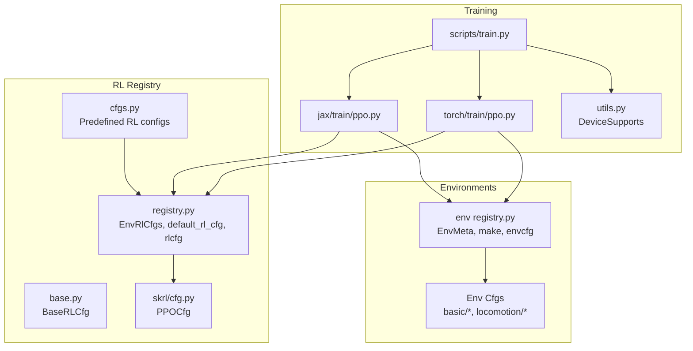
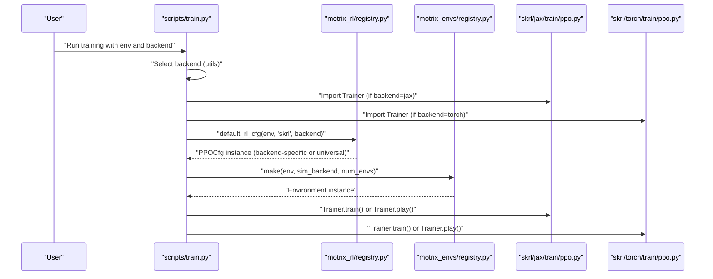
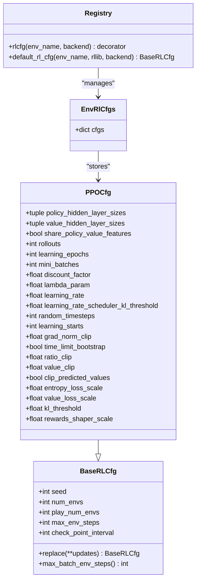
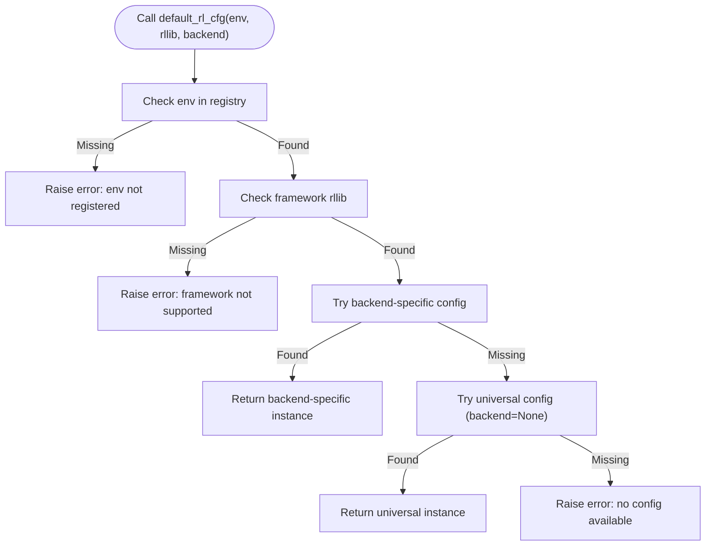
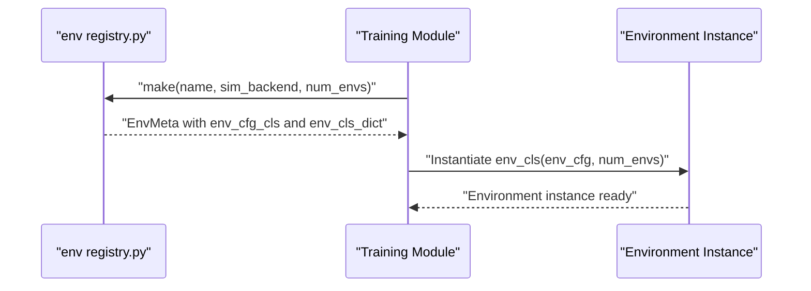
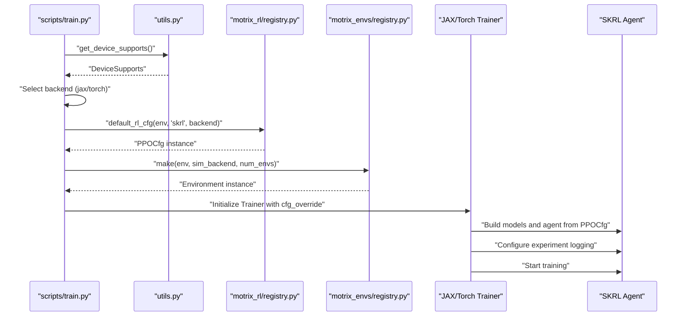
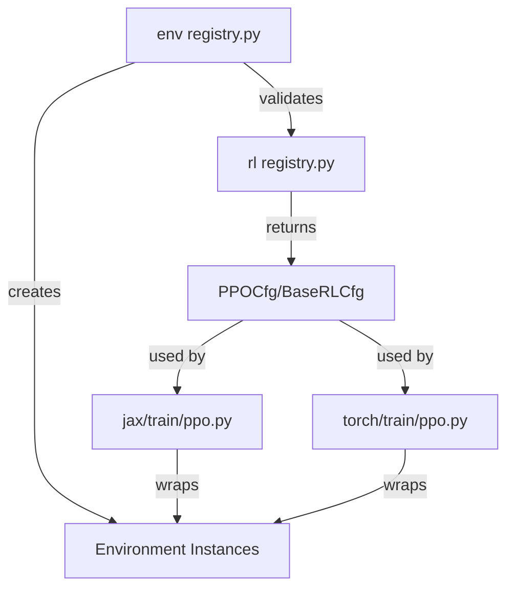

# RL Registry API

<cite>
**Referenced Files in This Document**
- [registry.py](file://motrix_rl/src/motrix_rl/registry.py)
- [cfgs.py](file://motrix_rl/src/motrix_rl/cfgs.py)
- [base.py](file://motrix_rl/src/motrix_rl/base.py)
- [cfg.py](file://motrix_rl/src/motrix_rl/skrl/cfg.py)
- [ppo.py (JAX)](file://motrix_rl/src/motrix_rl/skrl/jax/train/ppo.py)
- [ppo.py (Torch)](file://motrix_rl/src/motrix_rl/skrl/torch/train/ppo.py)
- [utils.py](file://motrix_rl/src/motrix_rl/utils.py)
- [registry.py (envs)](file://motrix_envs/src/motrix_envs/registry.py)
- [cfg.py (CartPole)](file://motrix_envs/src/motrix_envs/basic/cartpole/cfg.py)
- [cfg.py (Go1)](file://motrix_envs/src/motrix_envs/locomotion/go1/cfg.py)
- [train.py](file://scripts/train.py)
- [training_environment_config.md](file://docs/source/en/user_guide/tutorial/training_environment_config.md)
</cite>

## Table of Contents
1. [Introduction](#introduction)
2. [Project Structure](#project-structure)
3. [Core Components](#core-components)
4. [Architecture Overview](#architecture-overview)
5. [Detailed Component Analysis](#detailed-component-analysis)
6. [Dependency Analysis](#dependency-analysis)
7. [Performance Considerations](#performance-considerations)
8. [Troubleshooting Guide](#troubleshooting-guide)
9. [Conclusion](#conclusion)
10. [Appendices](#appendices)

## Introduction
This document describes the RL registry system used for training configuration management in the MotrixLab project. It explains how RL configurations are registered and looked up, how environments map to training setups, and how to manage training hyperparameters through the registry. The system centers around a registry that maps environment names to RL configuration classes, with support for multiple RL frameworks and backends (JAX and Torch). It integrates with the environment registry to ensure that only registered environments can have RL configurations associated with them.

## Project Structure
The RL registry system spans several modules:
- RL registry and configuration classes: motrix_rl/src/motrix_rl/registry.py, motrix_rl/src/motrix_rl/cfgs.py, motrix_rl/src/motrix_rl/base.py, motrix_rl/src/motrix_rl/skrl/cfg.py
- RL training integrations: motrix_rl/src/motrix_rl/skrl/jax/train/ppo.py, motrix_rl/src/motrix_rl/skrl/torch/train/ppo.py
- Environment registry and environment configs: motrix_envs/src/motrix_envs/registry.py, example environment configs under motrix_envs/src/motrix_envs/basic/*, locomotion/*
- CLI training script: scripts/train.py
- Utility helpers: motrix_rl/src/motrix_rl/utils.py
- Documentation: docs/source/en/user_guide/tutorial/training_environment_config.md

**Diagram sources**
- [registry.py](file://motrix_rl/src/motrix_rl/registry.py#L28-L115)
- [base.py](file://motrix_rl/src/motrix_rl/base.py#L20-L43)
- [cfg.py](file://motrix_rl/src/motrix_rl/skrl/cfg.py#L28-L74)
- [cfgs.py](file://motrix_rl/src/motrix_rl/cfgs.py#L22-L333)
- [registry.py (envs)](file://motrix_envs/src/motrix_envs/registry.py#L24-L172)
- [train.py](file://scripts/train.py#L39-L95)
- [ppo.py (JAX)](file://motrix_rl/src/motrix_rl/skrl/jax/train/ppo.py#L145-L301)
- [ppo.py (Torch)](file://motrix_rl/src/motrix_rl/skrl/torch/train/ppo.py#L145-L356)
- [utils.py](file://motrix_rl/src/motrix_rl/utils.py#L19-L62)

**Section sources**
- [registry.py](file://motrix_rl/src/motrix_rl/registry.py#L1-L115)
- [registry.py (envs)](file://motrix_envs/src/motrix_envs/registry.py#L1-L172)
- [train.py](file://scripts/train.py#L1-L95)

## Core Components
- Base RL configuration class: BaseRLCfg defines common training parameters and a replace method for overriding attributes.
- PPO configuration class: PPOCfg extends BaseRLCfg and adds PPO-specific hyperparameters.
- RL registry: EnvRlCfgs stores per-environment RL configuration classes organized by RL framework and backend. default_rl_cfg retrieves the appropriate configuration based on environment, framework, and backend, with fallback to universal configuration.
- Predefined RL configurations: cfgs.py provides curated RL configurations for various environments and backends.
- Environment registry: Ensures environments are registered before associating RL configurations with them.

Key responsibilities:
- Registration: rlcfg decorator registers RL configuration classes for environments and backends.
- Lookup: default_rl_cfg resolves the correct configuration class instance based on backend preference and availability.
- Integration: Training modules (JAX/Torch) use default_rl_cfg to obtain configuration instances and apply overrides.

**Section sources**
- [base.py](file://motrix_rl/src/motrix_rl/base.py#L20-L43)
- [cfg.py](file://motrix_rl/src/motrix_rl/skrl/cfg.py#L28-L74)
- [registry.py](file://motrix_rl/src/motrix_rl/registry.py#L28-L115)
- [cfgs.py](file://motrix_rl/src/motrix_rl/cfgs.py#L22-L333)
- [registry.py (envs)](file://motrix_envs/src/motrix_envs/registry.py#L24-L172)

## Architecture Overview
The RL registry architecture connects environment registration with RL configuration selection and training execution.

**Diagram sources**
- [train.py](file://scripts/train.py#L52-L95)
- [registry.py](file://motrix_rl/src/motrix_rl/registry.py#L81-L115)
- [registry.py (envs)](file://motrix_envs/src/motrix_envs/registry.py#L114-L161)
- [ppo.py (JAX)](file://motrix_rl/src/motrix_rl/skrl/jax/train/ppo.py#L145-L184)
- [ppo.py (Torch)](file://motrix_rl/src/motrix_rl/skrl/torch/train/ppo.py#L145-L183)

## Detailed Component Analysis

### RL Registry and Configuration Classes
- EnvRlCfgs: Holds a dictionary mapping RL framework to backend to configuration class. Used internally by the registry to store available RL configurations per environment.
- default_rl_cfg: Resolves the correct RL configuration instance for an environment and backend. It prefers backend-specific configurations, falls back to universal configurations (backend=None), and raises errors if nothing is found.
- rlcfg decorator: Registers RL configuration classes for environments and backends. If backend is None, it registers for both JAX and Torch.

**Diagram sources**
- [base.py](file://motrix_rl/src/motrix_rl/base.py#L20-L43)
- [cfg.py](file://motrix_rl/src/motrix_rl/skrl/cfg.py#L28-L74)
- [registry.py](file://motrix_rl/src/motrix_rl/registry.py#L28-L115)

**Section sources**
- [base.py](file://motrix_rl/src/motrix_rl/base.py#L20-L43)
- [cfg.py](file://motrix_rl/src/motrix_rl/skrl/cfg.py#L28-L74)
- [registry.py](file://motrix_rl/src/motrix_rl/registry.py#L28-L115)

### Registration and Lookup Processes
- Registration: The rlcfg decorator validates that the environment is registered in the environment registry, then stores the configuration class under the environment name and backend. If backend is omitted, it registers for both JAX and Torch.
- Lookup: default_rl_cfg ensures the environment exists, checks the framework, and attempts to retrieve a backend-specific configuration. If unavailable, it falls back to a universal configuration (backend=None). If neither exists, it raises an error.

**Diagram sources**
- [registry.py](file://motrix_rl/src/motrix_rl/registry.py#L81-L115)

**Section sources**
- [registry.py](file://motrix_rl/src/motrix_rl/registry.py#L42-L115)

### Environment Mapping to Training Setups
- Environments are registered via envcfg and env decorators in the environment registry. The environment registry ensures that an environment configuration is registered before associating RL configurations with it.
- The training modules (JAX/Torch) call env_registry.make to create environment instances using the selected simulation backend and configured number of environments.

**Diagram sources**
- [registry.py (envs)](file://motrix_envs/src/motrix_envs/registry.py#L114-L161)
- [ppo.py (JAX)](file://motrix_rl/src/motrix_rl/skrl/jax/train/ppo.py#L171-L172)
- [ppo.py (Torch)](file://motrix_rl/src/motrix_rl/skrl/torch/train/ppo.py#L171-L172)

**Section sources**
- [registry.py (envs)](file://motrix_envs/src/motrix_envs/registry.py#L46-L161)
- [ppo.py (JAX)](file://motrix_rl/src/motrix_rl/skrl/jax/train/ppo.py#L171-L172)
- [ppo.py (Torch)](file://motrix_rl/src/motrix_rl/skrl/torch/train/ppo.py#L171-L172)

### Predefined RL Configurations and Inheritance
- Predefined configurations are grouped by domains (basic, locomotion, manipulation, navigation) and inherit from PPOCfg. They override specific hyperparameters for different environments and backends.
- Some configurations reuse others (e.g., Go1WalkRoughPPO inherits from Go1WalkPPO), enabling incremental customization.

Examples of predefined configurations:
- Basic environments: CartPolePPO, BounceBallPPO, WalkerPPO variants, CheetahPPO variants, HopperPPO variants, ReacherPPO variants.
- Locomotion: Go1WalkPPO, Go2WalkPPO, Go1WalkRoughPPO, Go1WalkStairsPPO.
- Manipulation: FrankaLiftPPO, FrankaOpenCabinetPPO.
- Navigation: AnymalCPPOConfig, VbotNavSec001PPOConfig.

These demonstrate how to tailor hyperparameters (network sizes, learning rates, rollouts, epochs, mini-batches) to environment complexity and backend characteristics.

**Section sources**
- [cfgs.py](file://motrix_rl/src/motrix_rl/cfgs.py#L22-L333)

### Training Setup Mechanisms
- CLI selection: scripts/train.py determines the training backend based on device capabilities and user input, then imports the corresponding Trainer.
- Trainer initialization: Each Trainer obtains a PPOCfg instance via default_rl_cfg, applies command-line overrides, and creates the environment using env_registry.make.
- Model construction: Trainers build policy/value models using configuration-defined hidden layer sizes and share features settings.
- Agent configuration: Trainers convert PPOCfg into SKRL agent configuration dictionaries, including preprocessor settings and experiment logging intervals.

**Diagram sources**
- [train.py](file://scripts/train.py#L52-L95)
- [utils.py](file://motrix_rl/src/motrix_rl/utils.py#L39-L61)
- [registry.py](file://motrix_rl/src/motrix_rl/registry.py#L81-L115)
- [registry.py (envs)](file://motrix_envs/src/motrix_envs/registry.py#L114-L161)
- [ppo.py (JAX)](file://motrix_rl/src/motrix_rl/skrl/jax/train/ppo.py#L145-L184)
- [ppo.py (Torch)](file://motrix_rl/src/motrix_rl/skrl/torch/train/ppo.py#L145-L183)

**Section sources**
- [train.py](file://scripts/train.py#L39-L95)
- [utils.py](file://motrix_rl/src/motrix_rl/utils.py#L19-L62)
- [ppo.py (JAX)](file://motrix_rl/src/motrix_rl/skrl/jax/train/ppo.py#L145-L184)
- [ppo.py (Torch)](file://motrix_rl/src/motrix_rl/skrl/torch/train/ppo.py#L145-L183)

## Dependency Analysis
- RL registry depends on:
  - Environment registry for validation that environments are registered before associating RL configurations.
  - Base RL configuration classes for inheritance and configuration composition.
- Training modules depend on:
  - RL registry for configuration resolution.
  - Environment registry for environment instantiation.
  - SKRL framework for agent creation and training.
- Predefined configurations depend on:
  - PPOCfg for parameter definitions.
  - RL registry for registration decorators.

**Diagram sources**
- [registry.py (envs)](file://motrix_envs/src/motrix_envs/registry.py#L46-L83)
- [registry.py](file://motrix_rl/src/motrix_rl/registry.py#L42-L61)
- [cfg.py](file://motrix_rl/src/motrix_rl/skrl/cfg.py#L28-L74)
- [ppo.py (JAX)](file://motrix_rl/src/motrix_rl/skrl/jax/train/ppo.py#L145-L184)
- [ppo.py (Torch)](file://motrix_rl/src/motrix_rl/skrl/torch/train/ppo.py#L145-L183)

**Section sources**
- [registry.py (envs)](file://motrix_envs/src/motrix_envs/registry.py#L46-L83)
- [registry.py](file://motrix_rl/src/motrix_rl/registry.py#L42-L61)
- [cfg.py](file://motrix_rl/src/motrix_rl/skrl/cfg.py#L28-L74)
- [ppo.py (JAX)](file://motrix_rl/src/motrix_rl/skrl/jax/train/ppo.py#L145-L184)
- [ppo.py (Torch)](file://motrix_rl/src/motrix_rl/skrl/torch/train/ppo.py#L145-L183)

## Performance Considerations
- Parallel environments: num_envs controls the degree of parallelism; larger values increase throughput but require more memory and compute resources.
- Rollouts and mini-batches: Larger rollouts improve sample efficiency; mini-batches balance memory usage and gradient stability.
- Learning rate scheduling: Using KL-adaptive schedulers helps stabilize training when learning rates are backend-dependent.
- Feature sharing: share_policy_value_features can reduce model size and computation when architectures match; it is only effective with compatible backends.
- Logging intervals: check_point_interval affects checkpoint frequency and disk I/O overhead.

[No sources needed since this section provides general guidance]

## Troubleshooting Guide
Common issues and resolutions:
- Environment not registered: Ensure the environment configuration is registered via envcfg before associating RL configurations.
- No RL configuration found: Verify that a backend-specific or universal configuration exists for the environment and framework.
- Unsupported backend: Confirm that the environment supports the chosen simulation backend and that the training backend is available on the device.
- Configuration override conflicts: Ensure overrides correspond to existing attributes in the configuration class.

**Section sources**
- [registry.py](file://motrix_rl/src/motrix_rl/registry.py#L52-L53)
- [registry.py](file://motrix_rl/src/motrix_rl/registry.py#L94-L98)
- [registry.py](file://motrix_rl/src/motrix_rl/registry.py#L111-L114)
- [registry.py (envs)](file://motrix_envs/src/motrix_envs/registry.py#L76-L82)
- [train.py](file://scripts/train.py#L39-L50)

## Conclusion
The RL registry system provides a structured way to manage training configurations across environments and backends. By combining environment registration, RL configuration registration, and lookup mechanisms, it enables consistent and flexible training setups. Predefined configurations offer sensible defaults, while the registry allows customization and backend-specific tuning. The integration with the environment registry and training modules ensures that only valid combinations are used, and the CLI supports automatic backend selection and overrides.

[No sources needed since this section summarizes without analyzing specific files]

## Appendices

### API Reference

- BaseRLCfg
  - Attributes: seed, num_envs, play_num_envs, max_env_steps, check_point_interval
  - Methods: replace(**updates), max_batch_env_steps()

- PPOCfg (extends BaseRLCfg)
  - Attributes: policy_hidden_layer_sizes, value_hidden_layer_sizes, share_policy_value_features, rollouts, learning_epochs, mini_batches, discount_factor, lambda_param, learning_rate, learning_rate_scheduler_kl_threshold, random_timesteps, learning_starts, grad_norm_clip, time_limit_bootstrap, ratio_clip, value_clip, clip_predicted_values, entropy_loss_scale, value_loss_scale, kl_threshold, rewards_shaper_scale

- EnvRlCfgs
  - Attributes: cfgs (mapping framework to backend to configuration class)

- Registry Functions
  - rlcfg(env_name, backend=None) -> decorator
  - default_rl_cfg(env_name, rllib, backend) -> BaseRLCfg instance

- Environment Registry
  - envcfg(name, env_cfg_cls) -> decorator
  - env(name, sim_backend) -> decorator
  - make(name, sim_backend=None, env_cfg_override=None, num_envs=1) -> environment instance

**Section sources**
- [base.py](file://motrix_rl/src/motrix_rl/base.py#L20-L43)
- [cfg.py](file://motrix_rl/src/motrix_rl/skrl/cfg.py#L28-L74)
- [registry.py](file://motrix_rl/src/motrix_rl/registry.py#L28-L115)
- [registry.py (envs)](file://motrix_envs/src/motrix_envs/registry.py#L46-L161)

### Examples

- Registering a universal RL configuration for an environment:
  - Use @rlcfg("env-name") on a PPOCfg subclass to register a universal configuration.

- Registering backend-specific configurations:
  - Use @rlcfg("env-name", backend="jax") and/or @rlcfg("env-name", backend="torch") to register backend-specific configurations.

- Selecting appropriate RL settings for different environments:
  - Choose higher learning rates and larger rollouts for simpler environments (e.g., CartPole).
  - Increase network sizes and adjust mini-batches for complex environments (e.g., manipulation tasks).

- Managing training hyperparameters:
  - Override attributes via command-line overrides or by passing cfg_override to the Trainer constructor.

**Section sources**
- [cfgs.py](file://motrix_rl/src/motrix_rl/cfgs.py#L22-L333)
- [training_environment_config.md](file://docs/source/en/user_guide/tutorial/training_environment_config.md#L129-L179)
- [ppo.py (JAX)](file://motrix_rl/src/motrix_rl/skrl/jax/train/ppo.py#L152-L165)
- [ppo.py (Torch)](file://motrix_rl/src/motrix_rl/skrl/torch/train/ppo.py#L152-L165)