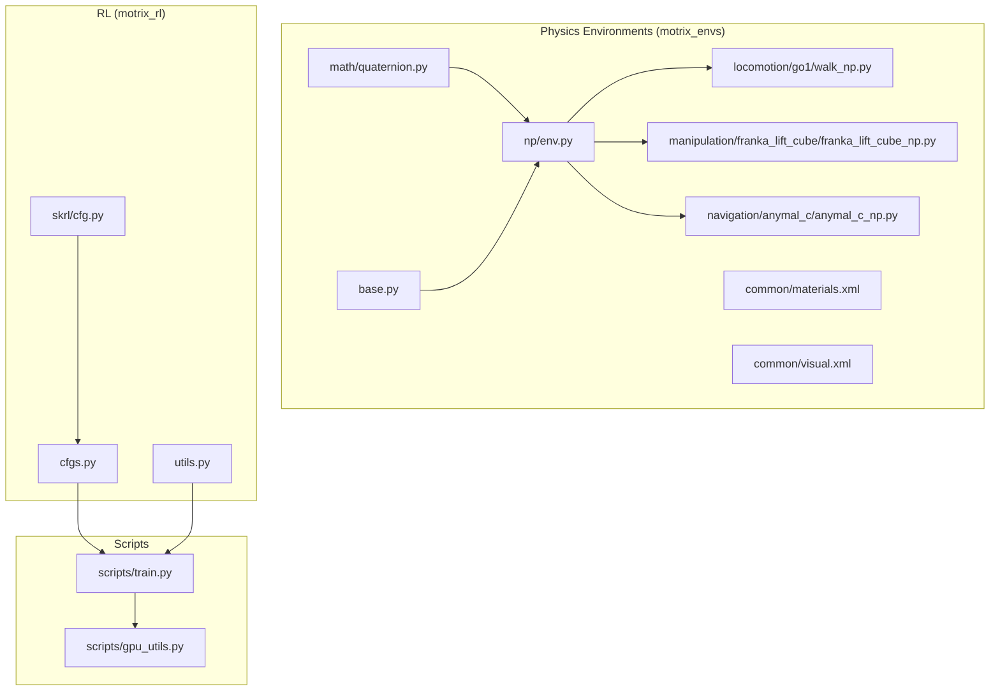
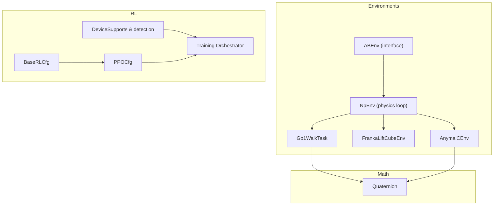
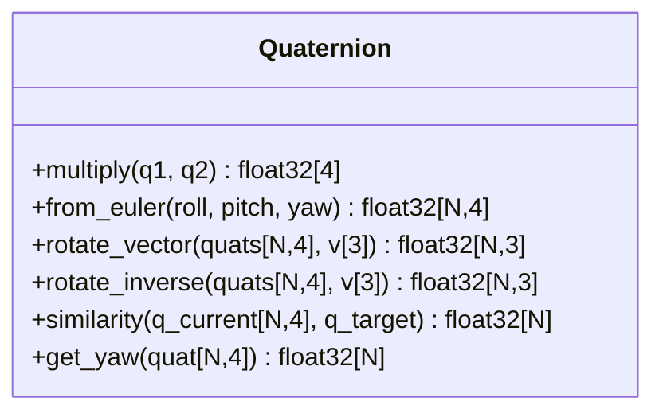
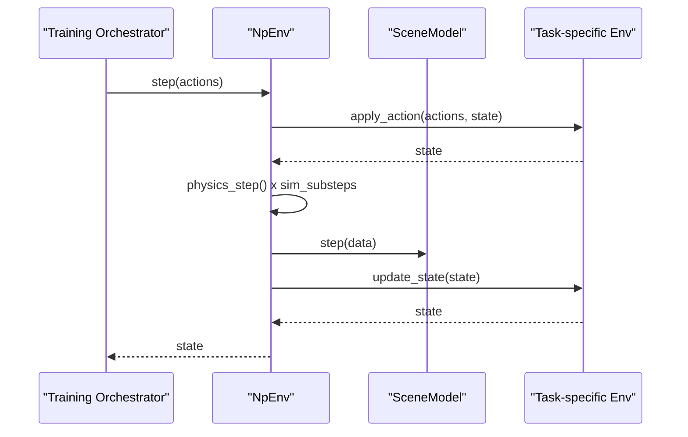
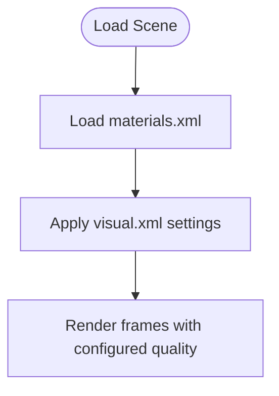
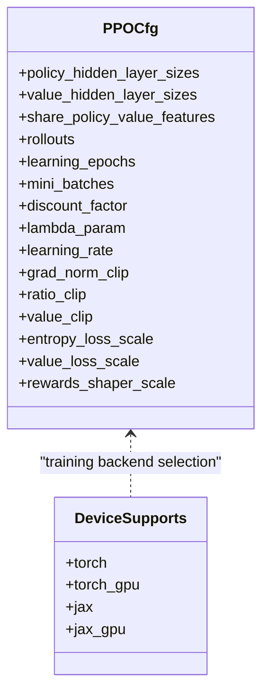
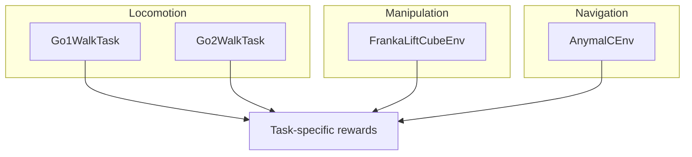
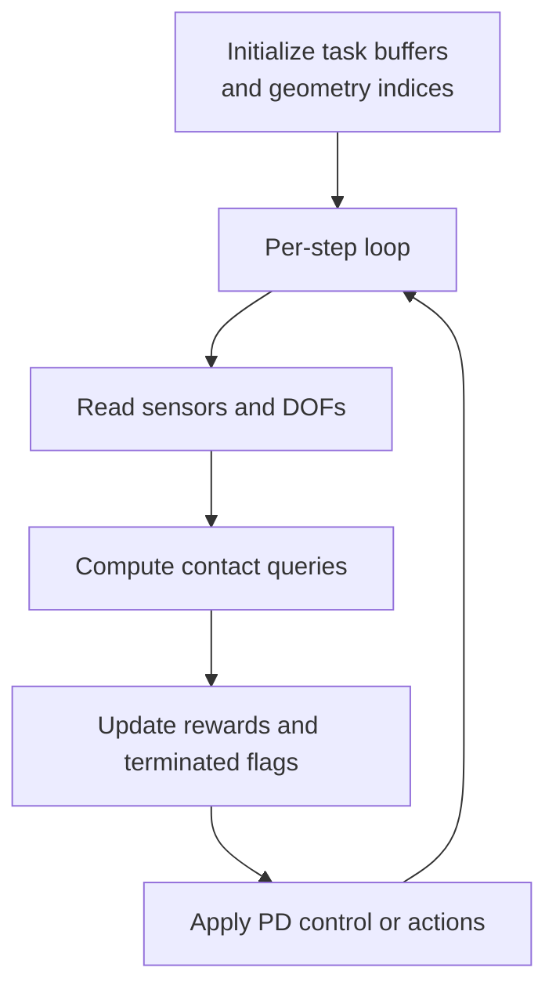
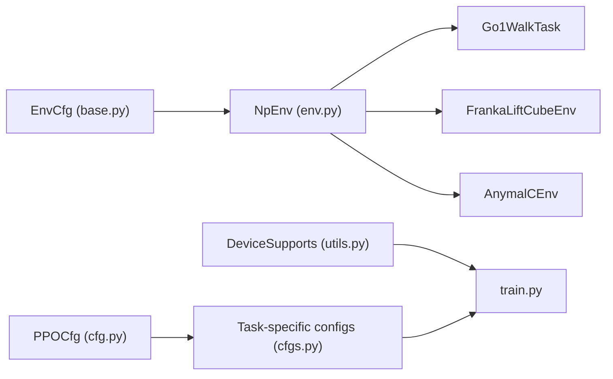
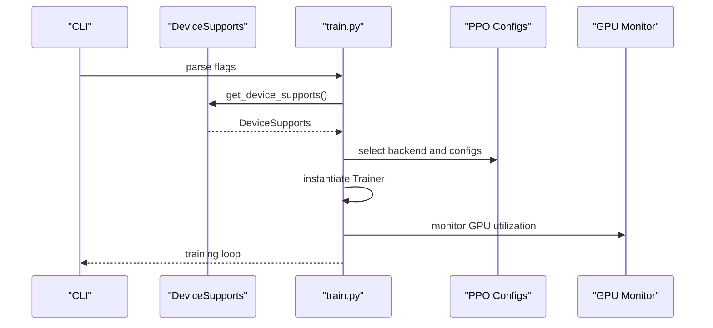

# Advanced Topics

<cite>
**Referenced Files in This Document**
- [quaternion.py](file://motrix_envs/src/motrix_envs/math/quaternion.py)
- [base.py](file://motrix_envs/src/motrix_envs/base.py)
- [env.py](file://motrix_envs/src/motrix_envs/np/env.py)
- [materials.xml](file://motrix_envs/src/motrix_envs/common/materials.xml)
- [visual.xml](file://motrix_envs/src/motrix_envs/common/visual.xml)
- [walk_np.py](file://motrix_envs/src/motrix_envs/locomotion/go1/walk_np.py)
- [franka_lift_cube_np.py](file://motrix_envs/src/motrix_envs/manipulation/franka_lift_cube/franka_lift_cube_np.py)
- [anymal_c_np.py](file://motrix_envs/src/motrix_envs/navigation/anymal_c/anymal_c_np.py)
- [cfg.py](file://motrix_rl/src/motrix_rl/skrl/cfg.py)
- [cfgs.py](file://motrix_rl/src/motrix_rl/cfgs.py)
- [utils.py](file://motrix_rl/src/motrix_rl/utils.py)
- [train.py](file://scripts/train.py)
- [gpu_utils.py](file://scripts/gpu_utils.py)
</cite>

## Table of Contents
1. [Introduction](#introduction)
2. [Project Structure](#project-structure)
3. [Core Components](#core-components)
4. [Architecture Overview](#architecture-overview)
5. [Detailed Component Analysis](#detailed-component-analysis)
6. [Dependency Analysis](#dependency-analysis)
7. [Performance Considerations](#performance-considerations)
8. [Troubleshooting Guide](#troubleshooting-guide)
9. [Conclusion](#conclusion)
10. [Appendices](#appendices)

## Introduction
This document presents advanced topics for the MotrixLab-S1 framework, focusing on mathematical foundations for 3D rotations and coordinate transformations, physics simulation configuration and material definitions, rendering and visualization settings, performance optimization and memory strategies, parallel execution patterns, advanced training methodologies, curriculum learning, and multi-task reinforcement learning. It also covers integration patterns with external tools, custom physics plugins, and scalability considerations for distributed training and production deployments.

## Project Structure
MotrixLab-S1 organizes functionality into three primary areas:
- Physics environments and math utilities under motrix_envs
- Reinforcement learning configurations and trainers under motrix_rl
- Scripts for training, GPU monitoring, and runtime utilities

**Diagram sources**
- [quaternion.py](file://motrix_envs/src/motrix_envs/math/quaternion.py#L1-L151)
- [base.py](file://motrix_envs/src/motrix_envs/base.py#L1-L85)
- [env.py](file://motrix_envs/src/motrix_envs/np/env.py#L1-L209)
- [materials.xml](file://motrix_envs/src/motrix_envs/common/materials.xml#L1-L24)
- [visual.xml](file://motrix_envs/src/motrix_envs/common/visual.xml#L1-L8)
- [walk_np.py](file://motrix_envs/src/motrix_envs/locomotion/go1/walk_np.py#L1-L387)
- [franka_lift_cube_np.py](file://motrix_envs/src/motrix_envs/manipulation/franka_lift_cube/franka_lift_cube_np.py#L1-L292)
- [anymal_c_np.py](file://motrix_envs/src/motrix_envs/navigation/anymal_c/anymal_c_np.py#L1-L919)
- [cfg.py](file://motrix_rl/src/motrix_rl/skrl/cfg.py#L1-L74)
- [cfgs.py](file://motrix_rl/src/motrix_rl/cfgs.py#L1-L333)
- [utils.py](file://motrix_rl/src/motrix_rl/utils.py#L1-L62)
- [train.py](file://scripts/train.py#L1-L95)
- [gpu_utils.py](file://scripts/gpu_utils.py#L1-L41)

**Section sources**
- [base.py](file://motrix_envs/src/motrix_envs/base.py#L1-L85)
- [env.py](file://motrix_envs/src/motrix_envs/np/env.py#L1-L209)
- [cfgs.py](file://motrix_rl/src/motrix_rl/cfgs.py#L1-L333)
- [train.py](file://scripts/train.py#L1-L95)

## Core Components
- Simulation configuration and environment lifecycle:
  - Environment configuration encapsulated in a typed configuration class with validation and derived properties for episode steps and simulation substeps.
  - A base environment interface defining vectorized environments, observation/action spaces, and lifecycle hooks.
  - A NumPy-backed environment implementing physics stepping, action application, state updates, and reset logic.

- Mathematical primitives for 3D rotations:
  - A quaternion class supporting multiplication, conversion from Euler angles, vector rotation via conjugation, inverse rotation, similarity computation for attitude alignment, and yaw extraction.

- Rendering and materials:
  - Shared materials and visual quality settings for consistent asset appearance and lighting.

**Section sources**
- [base.py](file://motrix_envs/src/motrix_envs/base.py#L23-L85)
- [env.py](file://motrix_envs/src/motrix_envs/np/env.py#L52-L209)
- [quaternion.py](file://motrix_envs/src/motrix_envs/math/quaternion.py#L18-L151)
- [materials.xml](file://motrix_envs/src/motrix_envs/common/materials.xml#L6-L24)
- [visual.xml](file://motrix_envs/src/motrix_envs/common/visual.xml#L1-L8)

## Architecture Overview
The framework integrates physics simulation, environment logic, and RL training:
- Environments inherit a common base and use a physics engine model to step dynamics and compute observations/rewards.
- RL configurations define agent hyperparameters and training schedules.
- Training scripts select backends (JAX/Torch), resolve device support, and orchestrate trainer instantiation and execution.

**Diagram sources**
- [base.py](file://motrix_envs/src/motrix_envs/base.py#L61-L85)
- [env.py](file://motrix_envs/src/motrix_envs/np/env.py#L52-L209)
- [walk_np.py](file://motrix_envs/src/motrix_envs/locomotion/go1/walk_np.py#L26-L47)
- [franka_lift_cube_np.py](file://motrix_envs/src/motrix_envs/manipulation/franka_lift_cube/franka_lift_cube_np.py#L32-L43)
- [anymal_c_np.py](file://motrix_envs/src/motrix_envs/navigation/anymal_c/anymal_c_np.py#L26-L31)
- [quaternion.py](file://motrix_envs/src/motrix_envs/math/quaternion.py#L18-L151)
- [cfg.py](file://motrix_rl/src/motrix_rl/skrl/cfg.py#L28-L74)
- [cfgs.py](file://motrix_rl/src/motrix_rl/cfgs.py#L1-L333)
- [utils.py](file://motrix_rl/src/motrix_rl/utils.py#L19-L62)
- [train.py](file://scripts/train.py#L39-L91)

## Detailed Component Analysis

### Mathematical Foundations: Quaternions and Coordinate Systems
- Quaternion multiplication and Euler-to-quaternion conversion follow standard formulations and are designed for vectorized batch operations.
- Vector rotation via conjugation and inverse rotation enable efficient frame transforms for sensor data and gravity projection.
- Similarity metric computes attitude alignment rewards using relative quaternion rotation and angle computation.
- Yaw extraction from quaternions supports navigation and orientation control.

**Diagram sources**
- [quaternion.py](file://motrix_envs/src/motrix_envs/math/quaternion.py#L18-L151)

**Section sources**
- [quaternion.py](file://motrix_envs/src/motrix_envs/math/quaternion.py#L18-L151)

### Physics Simulation and Environment Lifecycle
- Environment configuration defines timestep, control period, episode duration, and derived simulation substeps.
- The NumPy environment loads a physics model, initializes batched scene data, and executes a physics step loop based on configuration.
- Tasks implement action application, state updates, termination checks, and reward computation tailored to locomotion, manipulation, and navigation domains.

**Diagram sources**
- [env.py](file://motrix_envs/src/motrix_envs/np/env.py#L186-L209)
- [walk_np.py](file://motrix_envs/src/motrix_envs/locomotion/go1/walk_np.py#L160-L186)
- [franka_lift_cube_np.py](file://motrix_envs/src/motrix_envs/manipulation/franka_lift_cube/franka_lift_cube_np.py#L72-L120)
- [anymal_c_np.py](file://motrix_envs/src/motrix_envs/navigation/anymal_c/anymal_c_np.py#L222-L232)

**Section sources**
- [base.py](file://motrix_envs/src/motrix_envs/base.py#L23-L85)
- [env.py](file://motrix_envs/src/motrix_envs/np/env.py#L52-L209)
- [walk_np.py](file://motrix_envs/src/motrix_envs/locomotion/go1/walk_np.py#L160-L186)
- [franka_lift_cube_np.py](file://motrix_envs/src/motrix_envs/manipulation/franka_lift_cube/franka_lift_cube_np.py#L72-L120)
- [anymal_c_np.py](file://motrix_envs/src/motrix_envs/navigation/anymal_c/anymal_c_np.py#L222-L232)

### Material Property Definitions and Visual Rendering
- Materials define shared textures, colors, and visual properties used across environments.
- Visual settings configure headlight intensity, depth mapping, and shadow quality for rendering consistency.

**Diagram sources**
- [materials.xml](file://motrix_envs/src/motrix_envs/common/materials.xml#L6-L24)
- [visual.xml](file://motrix_envs/src/motrix_envs/common/visual.xml#L1-L8)

**Section sources**
- [materials.xml](file://motrix_envs/src/motrix_envs/common/materials.xml#L6-L24)
- [visual.xml](file://motrix_envs/src/motrix_envs/common/visual.xml#L1-L8)

### Advanced Training Methodologies and Curriculum Learning
- PPO configuration classes encapsulate agent hyperparameters, rollout lengths, learning epochs, mini-batches, discount factors, and clipping parameters.
- Task-specific overrides demonstrate curriculum-style scaling (network sizes, environment steps, number of environments) and backend-specific tuning.
- Device support detection selects optimal training backend (JAX or Torch) and GPU availability.

**Diagram sources**
- [cfg.py](file://motrix_rl/src/motrix_rl/skrl/cfg.py#L28-L74)
- [cfgs.py](file://motrix_rl/src/motrix_rl/cfgs.py#L22-L333)
- [utils.py](file://motrix_rl/src/motrix_rl/utils.py#L19-L62)

**Section sources**
- [cfg.py](file://motrix_rl/src/motrix_rl/skrl/cfg.py#L28-L74)
- [cfgs.py](file://motrix_rl/src/motrix_rl/cfgs.py#L22-L333)
- [utils.py](file://motrix_rl/src/motrix_rl/utils.py#L19-L62)

### Multi-Task Reinforcement Learning
- Environment-specific configurations illustrate multi-task scenarios:
  - Locomotion tasks (Go1, Go2 walking)
  - Manipulation tasks (Franka reaching/lifting)
  - Navigation tasks (AnymalC, VBot sections)
- Each task defines distinct observation spaces, action spaces, reward functions, and termination conditions, enabling diverse training regimes.

**Diagram sources**
- [walk_np.py](file://motrix_envs/src/motrix_envs/locomotion/go1/walk_np.py#L26-L47)
- [franka_lift_cube_np.py](file://motrix_envs/src/motrix_envs/manipulation/franka_lift_cube/franka_lift_cube_np.py#L32-L43)
- [anymal_c_np.py](file://motrix_envs/src/motrix_envs/navigation/anymal_c/anymal_c_np.py#L26-L31)

**Section sources**
- [walk_np.py](file://motrix_envs/src/motrix_envs/locomotion/go1/walk_np.py#L26-L47)
- [franka_lift_cube_np.py](file://motrix_envs/src/motrix_envs/manipulation/franka_lift_cube/franka_lift_cube_np.py#L32-L43)
- [anymal_c_np.py](file://motrix_envs/src/motrix_envs/navigation/anymal_c/anymal_c_np.py#L26-L31)

### Integration Patterns and Custom Plugins
- Environment tasks integrate with the physics engine to compute sensor values, contact queries, and forward kinematics.
- Visualization enhancements (e.g., direction arrows) are implemented via DOF updates without altering physical dynamics.
- Contact geometry indices are precomputed for efficient collision checks during termination and reward computation.

**Diagram sources**
- [anymal_c_np.py](file://motrix_envs/src/motrix_envs/navigation/anymal_c/anymal_c_np.py#L132-L194)
- [anymal_c_np.py](file://motrix_envs/src/motrix_envs/navigation/anymal_c/anymal_c_np.py#L466-L623)
- [walk_np.py](file://motrix_envs/src/motrix_envs/locomotion/go1/walk_np.py#L118-L158)

**Section sources**
- [anymal_c_np.py](file://motrix_envs/src/motrix_envs/navigation/anymal_c/anymal_c_np.py#L132-L194)
- [anymal_c_np.py](file://motrix_envs/src/motrix_envs/navigation/anymal_c/anymal_c_np.py#L466-L623)
- [walk_np.py](file://motrix_envs/src/motrix_envs/locomotion/go1/walk_np.py#L118-L158)

## Dependency Analysis
- Environment configuration depends on simulation timestep and control timestep to derive substeps and episode limits.
- Tasks depend on the physics model for DOF access, sensor readings, contact queries, and forward kinematics.
- RL configurations depend on device capabilities to choose backends and leverage GPU acceleration.

**Diagram sources**
- [base.py](file://motrix_envs/src/motrix_envs/base.py#L23-L85)
- [env.py](file://motrix_envs/src/motrix_envs/np/env.py#L52-L209)
- [walk_np.py](file://motrix_envs/src/motrix_envs/locomotion/go1/walk_np.py#L26-L47)
- [franka_lift_cube_np.py](file://motrix_envs/src/motrix_envs/manipulation/franka_lift_cube/franka_lift_cube_np.py#L32-L43)
- [anymal_c_np.py](file://motrix_envs/src/motrix_envs/navigation/anymal_c/anymal_c_np.py#L26-L31)
- [cfg.py](file://motrix_rl/src/motrix_rl/skrl/cfg.py#L28-L74)
- [cfgs.py](file://motrix_rl/src/motrix_rl/cfgs.py#L22-L333)
- [utils.py](file://motrix_rl/src/motrix_rl/utils.py#L19-L62)
- [train.py](file://scripts/train.py#L39-L91)

**Section sources**
- [base.py](file://motrix_envs/src/motrix_envs/base.py#L23-L85)
- [env.py](file://motrix_envs/src/motrix_envs/np/env.py#L52-L209)
- [cfgs.py](file://motrix_rl/src/motrix_rl/cfgs.py#L22-L333)
- [utils.py](file://motrix_rl/src/motrix_rl/utils.py#L19-L62)
- [train.py](file://scripts/train.py#L39-L91)

## Performance Considerations
- Vectorized operations:
  - Quaternions and vector rotations operate on batches to minimize Python loops and leverage NumPy’s optimized kernels.
- Simulation efficiency:
  - Physics substeps scale with control timestep to balance accuracy and throughput.
- Memory management:
  - Batched scene data and arrays are reused across steps; masks and views prevent unnecessary allocations.
- Parallel execution:
  - Large-scale training leverages backend-specific accelerations (JAX/XLA or Torch CUDA) and configurable environment counts.
- Rendering overhead:
  - Rendering spacing and visual quality settings can be tuned to reduce GPU load during training.

[No sources needed since this section provides general guidance]

## Troubleshooting Guide
- Numerical stability:
  - Ensure quaternions are normalized before rotation operations; use vectorized conjugation and clamping for safe angle computations.
- Termination and divergence:
  - Monitor DOF velocities and NaN/Inf conditions; terminate episodes early to avoid unstable states.
- Device backend selection:
  - Verify GPU availability and backend compatibility; fallback to CPU when necessary.
- Contact and collision checks:
  - Precompute geometry indices and use contact queries efficiently to avoid repeated lookups.

**Section sources**
- [quaternion.py](file://motrix_envs/src/motrix_envs/math/quaternion.py#L63-L141)
- [anymal_c_np.py](file://motrix_envs/src/motrix_envs/navigation/anymal_c/anymal_c_np.py#L667-L713)
- [utils.py](file://motrix_rl/src/motrix_rl/utils.py#L27-L61)
- [env.py](file://motrix_envs/src/motrix_envs/np/env.py#L112-L148)

## Conclusion
MotrixLab-S1 provides a robust foundation for advanced robotics research integrating precise 3D rotation mathematics, flexible physics environments, and scalable reinforcement learning pipelines. By leveraging vectorized operations, careful numerical practices, and backend-aware training orchestration, researchers can develop sophisticated locomotion, manipulation, and navigation policies while maintaining high performance and reproducibility.

[No sources needed since this section summarizes without analyzing specific files]

## Appendices

### Appendix A: Training Orchestration Flow

**Diagram sources**
- [train.py](file://scripts/train.py#L52-L91)
- [utils.py](file://motrix_rl/src/motrix_rl/utils.py#L39-L62)
- [gpu_utils.py](file://scripts/gpu_utils.py#L20-L41)

**Section sources**
- [train.py](file://scripts/train.py#L52-L91)
- [utils.py](file://motrix_rl/src/motrix_rl/utils.py#L39-L62)
- [gpu_utils.py](file://scripts/gpu_utils.py#L20-L41)