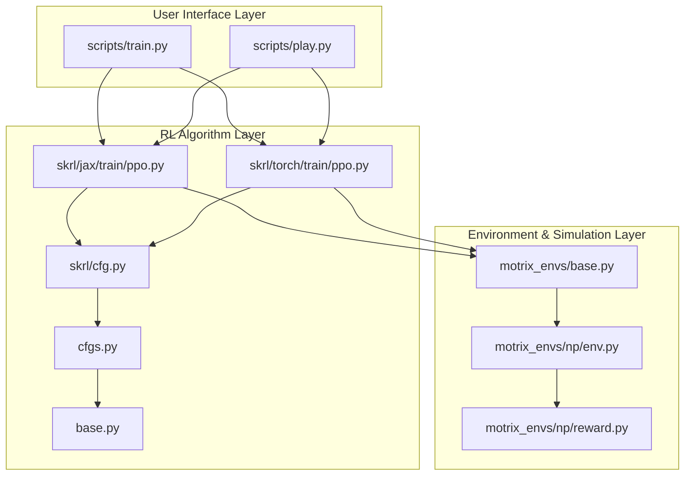
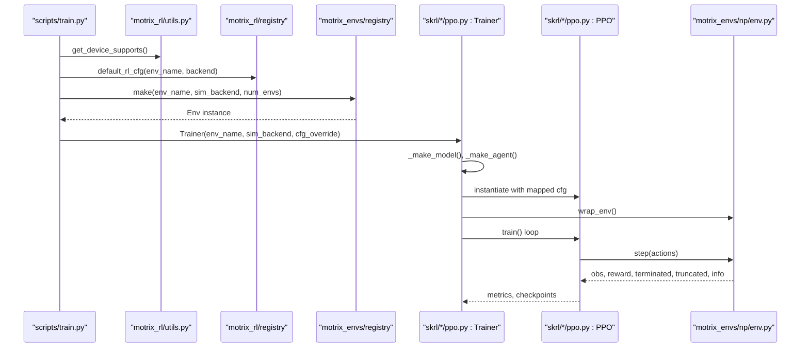
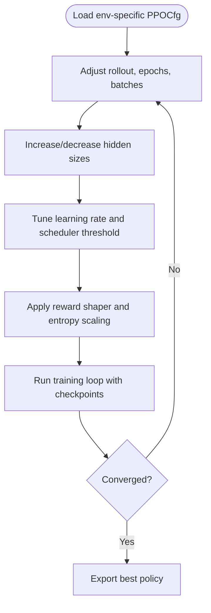
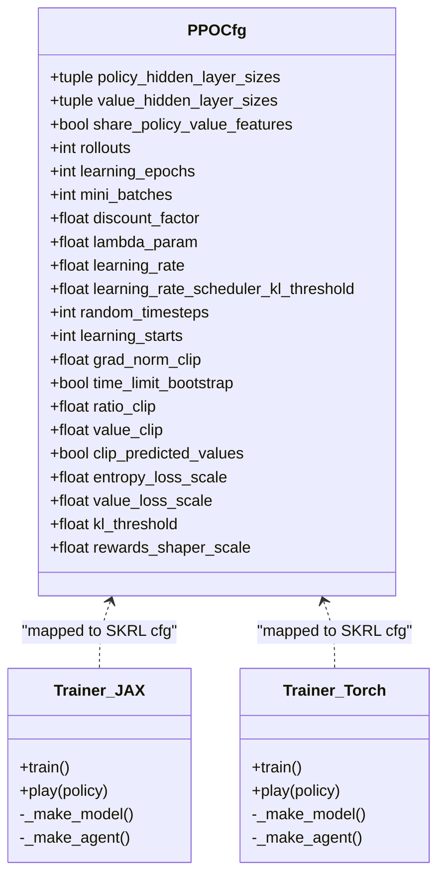
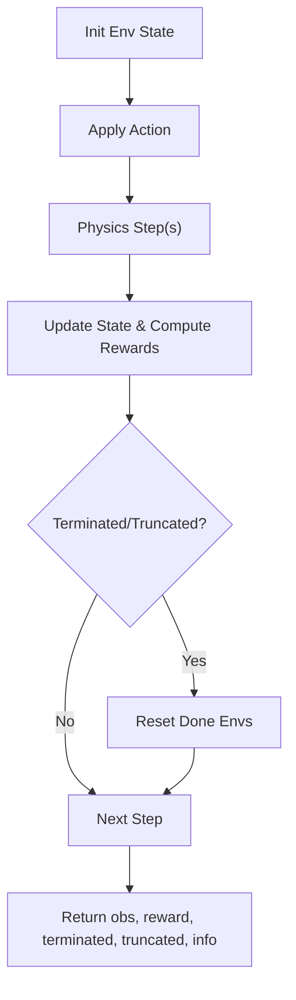
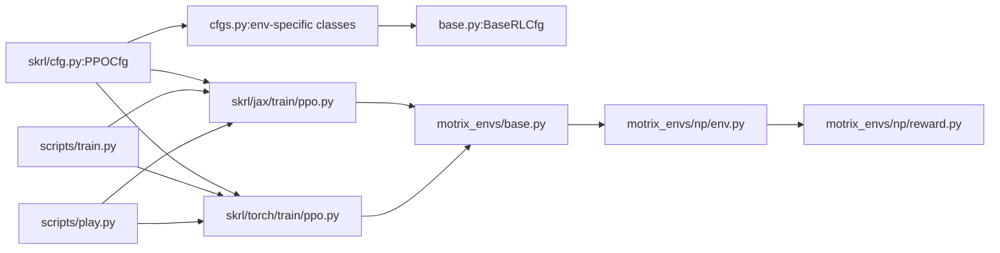

# Advanced Training Methodologies

<cite>
**Referenced Files in This Document**
- [motrix_rl/src/motrix_rl/skrl/cfg.py](file://motrix_rl/src/motrix_rl/skrl/cfg.py)
- [motrix_rl/src/motrix_rl/cfgs.py](file://motrix_rl/src/motrix_rl/cfgs.py)
- [motrix_rl/src/motrix_rl/base.py](file://motrix_rl/src/motrix_rl/base.py)
- [motrix_rl/src/motrix_rl/skrl/jax/train/ppo.py](file://motrix_rl/src/motrix_rl/skrl/jax/train/ppo.py)
- [motrix_rl/src/motrix_rl/skrl/torch/train/ppo.py](file://motrix_rl/src/motrix_rl/skrl/torch/train/ppo.py)
- [scripts/train.py](file://scripts/train.py)
- [scripts/play.py](file://scripts/play.py)
- [motrix_envs/src/motrix_envs/base.py](file://motrix_envs/src/motrix_envs/base.py)
- [motrix_envs/src/motrix_envs/np/env.py](file://motrix_envs/src/motrix_envs/np/env.py)
- [motrix_envs/src/motrix_envs/np/reward.py](file://motrix_envs/src/motrix_envs/np/reward.py)
- [motrix_rl/src/motrix_rl/utils.py](file://motrix_rl/src/motrix_rl/utils.py)
- [docs/source/en/user_guide/tutorial/basic_frame.md](file://docs/source/en/user_guide/tutorial/basic_frame.md)
- [docs/source/en/user_guide/tutorial/training_environment_config.md](file://docs/source/en/user_guide/tutorial/training_environment_config.md)
</cite>

## Table of Contents
1. [Introduction](#introduction)
2. [Project Structure](#project-structure)
3. [Core Components](#core-components)
4. [Architecture Overview](#architecture-overview)
5. [Detailed Component Analysis](#detailed-component-analysis)
6. [Dependency Analysis](#dependency-analysis)
7. [Performance Considerations](#performance-considerations)
8. [Troubleshooting Guide](#troubleshooting-guide)
9. [Conclusion](#conclusion)
10. [Appendices](#appendices)

## Introduction
This document presents advanced training methodologies enabled by the repository’s modular reinforcement learning stack. It focuses on sophisticated policy optimization, reward shaping, curriculum-style configurations, and scalable training pipelines. While the current implementation centers on PPO via SKRL, the architecture supports extension to advanced policy optimization algorithms, multi-task and hierarchical training, transfer learning, and distributed paradigms. The content is organized to be accessible to practitioners at varying levels of expertise.

## Project Structure
The repository is organized into three primary layers:
- User interface layer: CLI entry points for training and inference
- RL algorithm layer: SKRL-backed PPO trainers with JAX and PyTorch backends
- Environment and simulation layer: Physics-based environments with configurable dynamics and reward computation

**Diagram sources**
- [scripts/train.py](file://scripts/train.py#L52-L91)
- [scripts/play.py](file://scripts/play.py#L110-L159)
- [motrix_rl/src/motrix_rl/skrl/jax/train/ppo.py](file://motrix_rl/src/motrix_rl/skrl/jax/train/ppo.py#L145-L184)
- [motrix_rl/src/motrix_rl/skrl/torch/train/ppo.py](file://motrix_rl/src/motrix_rl/skrl/torch/train/ppo.py#L145-L183)
- [motrix_rl/src/motrix_rl/skrl/cfg.py](file://motrix_rl/src/motrix_rl/skrl/cfg.py#L28-L74)
- [motrix_rl/src/motrix_rl/cfgs.py](file://motrix_rl/src/motrix_rl/cfgs.py#L22-L333)
- [motrix_rl/src/motrix_rl/base.py](file://motrix_rl/src/motrix_rl/base.py#L20-L43)
- [motrix_envs/src/motrix_envs/base.py](file://motrix_envs/src/motrix_envs/base.py#L23-L85)
- [motrix_envs/src/motrix_envs/np/env.py](file://motrix_envs/src/motrix_envs/np/env.py#L52-L209)
- [motrix_envs/src/motrix_envs/np/reward.py](file://motrix_envs/src/motrix_envs/np/reward.py#L63-L84)

**Section sources**
- [docs/source/en/user_guide/tutorial/basic_frame.md](file://docs/source/en/user_guide/tutorial/basic_frame.md#L27-L52)

## Core Components
- PPO configuration classes encapsulate algorithm hyperparameters and training controls, with backend-specific overrides and environment-specific tuning.
- SKRL-backed trainers orchestrate environment creation, model construction, agent instantiation, and training loops for both JAX and PyTorch backends.
- Environment base classes define configuration and spaces, while NumPy-based environment implementations manage simulation steps, termination/truncation, and reward computation.
- Utilities detect device capabilities and select appropriate training backends.

Key implementation anchors:
- PPO configuration mapping and reward shaping: [PPOCfg](file://motrix_rl/src/motrix_rl/skrl/cfg.py#L28-L74), [PPO._get_cfg](file://motrix_rl/src/motrix_rl/skrl/jax/train/ppo.py#L38-L84)
- Backend-specific trainers and model factories: [JAX Trainer](file://motrix_rl/src/motrix_rl/skrl/jax/train/ppo.py#L145-L296), [Torch Trainer](file://motrix_rl/src/motrix_rl/skrl/torch/train/ppo.py#L145-L356)
- Environment configuration and lifecycle: [EnvCfg](file://motrix_envs/src/motrix_envs/base.py#L23-L59), [NpEnv](file://motrix_envs/src/motrix_envs/np/env.py#L52-L209)
- Device-aware backend selection: [get_device_supports](file://motrix_rl/src/motrix_rl/utils.py#L39-L61)

**Section sources**
- [motrix_rl/src/motrix_rl/skrl/cfg.py](file://motrix_rl/src/motrix_rl/skrl/cfg.py#L28-L74)
- [motrix_rl/src/motrix_rl/skrl/jax/train/ppo.py](file://motrix_rl/src/motrix_rl/skrl/jax/train/ppo.py#L38-L84)
- [motrix_rl/src/motrix_rl/skrl/torch/train/ppo.py](file://motrix_rl/src/motrix_rl/skrl/torch/train/ppo.py#L37-L83)
- [motrix_envs/src/motrix_envs/base.py](file://motrix_envs/src/motrix_envs/base.py#L23-L59)
- [motrix_envs/src/motrix_envs/np/env.py](file://motrix_envs/src/motrix_envs/np/env.py#L52-L209)
- [motrix_rl/src/motrix_rl/utils.py](file://motrix_rl/src/motrix_rl/utils.py#L39-L61)

## Architecture Overview
The training pipeline integrates CLI entry points, backend-agnostic RL configuration, and environment simulation. The flow below maps actual code paths and demonstrates how configuration cascades from user-defined classes to SKRL agent parameters.

**Diagram sources**
- [scripts/train.py](file://scripts/train.py#L52-L91)
- [motrix_rl/src/motrix_rl/utils.py](file://motrix_rl/src/motrix_rl/utils.py#L39-L61)
- [motrix_rl/src/motrix_rl/skrl/jax/train/ppo.py](file://motrix_rl/src/motrix_rl/skrl/jax/train/ppo.py#L145-L184)
- [motrix_rl/src/motrix_rl/skrl/torch/train/ppo.py](file://motrix_rl/src/motrix_rl/skrl/torch/train/ppo.py#L145-L183)
- [motrix_envs/src/motrix_envs/np/env.py](file://motrix_envs/src/motrix_envs/np/env.py#L52-L209)

## Detailed Component Analysis

### PPO Configuration and Curriculum-Style Tuning
- Centralized configuration via PPOCfg and environment-specific subclasses enables curriculum-style adjustments (e.g., increasing rollout lengths, learning epochs, and network sizes across tasks).
- Reward shaping and preprocessor scaling are exposed through configuration, enabling progressive difficulty and signal engineering.
- Batch scheduling and checkpoint intervals are derived from environment steps and num_envs for consistent iteration control.

Implementation anchors:
- [PPOCfg](file://motrix_rl/src/motrix_rl/skrl/cfg.py#L28-L74)
- [BaseRLCfg.max_batch_env_steps](file://motrix_rl/src/motrix_rl/base.py#L36-L43)
- [basic locomotion configs](file://motrix_rl/src/motrix_rl/cfgs.py#L186-L236)
- [manipulation configs](file://motrix_rl/src/motrix_rl/cfgs.py#L238-L275)
- [navigation configs](file://motrix_rl/src/motrix_rl/cfgs.py#L277-L333)

**Diagram sources**
- [motrix_rl/src/motrix_rl/skrl/cfg.py](file://motrix_rl/src/motrix_rl/skrl/cfg.py#L28-L74)
- [motrix_rl/src/motrix_rl/cfgs.py](file://motrix_rl/src/motrix_rl/cfgs.py#L186-L333)
- [motrix_rl/src/motrix_rl/base.py](file://motrix_rl/src/motrix_rl/base.py#L36-L43)

**Section sources**
- [motrix_rl/src/motrix_rl/skrl/cfg.py](file://motrix_rl/src/motrix_rl/skrl/cfg.py#L28-L74)
- [motrix_rl/src/motrix_rl/cfgs.py](file://motrix_rl/src/motrix_rl/cfgs.py#L186-L333)
- [motrix_rl/src/motrix_rl/base.py](file://motrix_rl/src/motrix_rl/base.py#L36-L43)

### Backend-Agnostic PPO Trainers (JAX and Torch)
- Both JAX and Torch trainers follow identical flows: resolve configuration, construct environment wrappers, build models, map configuration to SKRL defaults, and execute training.
- JAX variant uses functional Flax models and SKRL JAX components; Torch variant supports shared feature extraction between policy/value when architectures match.

Implementation anchors:
- [JAX Trainer.train](file://motrix_rl/src/motrix_rl/skrl/jax/train/ppo.py#L167-L184)
- [JAX Trainer._make_model](file://motrix_rl/src/motrix_rl/skrl/jax/train/ppo.py#L211-L282)
- [JAX Trainer._get_cfg](file://motrix_rl/src/motrix_rl/skrl/jax/train/ppo.py#L38-L84)
- [Torch Trainer.train](file://motrix_rl/src/motrix_rl/skrl/torch/train/ppo.py#L167-L183)
- [Torch Trainer._make_model](file://motrix_rl/src/motrix_rl/skrl/torch/train/ppo.py#L209-L342)
- [Torch Trainer._get_cfg](file://motrix_rl/src/motrix_rl/skrl/torch/train/ppo.py#L37-L83)

**Diagram sources**
- [motrix_rl/src/motrix_rl/skrl/cfg.py](file://motrix_rl/src/motrix_rl/skrl/cfg.py#L28-L74)
- [motrix_rl/src/motrix_rl/skrl/jax/train/ppo.py](file://motrix_rl/src/motrix_rl/skrl/jax/train/ppo.py#L145-L296)
- [motrix_rl/src/motrix_rl/skrl/torch/train/ppo.py](file://motrix_rl/src/motrix_rl/skrl/torch/train/ppo.py#L145-L356)

**Section sources**
- [motrix_rl/src/motrix_rl/skrl/jax/train/ppo.py](file://motrix_rl/src/motrix_rl/skrl/jax/train/ppo.py#L145-L296)
- [motrix_rl/src/motrix_rl/skrl/torch/train/ppo.py](file://motrix_rl/src/motrix_rl/skrl/torch/train/ppo.py#L145-L356)

### Environment Lifecycle and Reward Engineering
- Environment configuration defines simulation timestep, control timestep, episode limits, and rendering spacing.
- The NumPy environment manages batched simulation steps, termination/truncation, and reward computation, exposing hooks for custom reward logic and metrics.

Implementation anchors:
- [EnvCfg](file://motrix_envs/src/motrix_envs/base.py#L23-L59)
- [NpEnv.init_state](file://motrix_envs/src/motrix_envs/np/env.py#L97-L110)
- [NpEnv.step](file://motrix_envs/src/motrix_envs/np/env.py#L196-L209)
- [tolerance reward utility](file://motrix_envs/src/motrix_envs/np/reward.py#L63-L84)

**Diagram sources**
- [motrix_envs/src/motrix_envs/np/env.py](file://motrix_envs/src/motrix_envs/np/env.py#L196-L209)
- [motrix_envs/src/motrix_envs/np/reward.py](file://motrix_envs/src/motrix_envs/np/reward.py#L63-L84)

**Section sources**
- [motrix_envs/src/motrix_envs/base.py](file://motrix_envs/src/motrix_envs/base.py#L23-L59)
- [motrix_envs/src/motrix_envs/np/env.py](file://motrix_envs/src/motrix_envs/np/env.py#L97-L209)
- [motrix_envs/src/motrix_envs/np/reward.py](file://motrix_envs/src/motrix_envs/np/reward.py#L63-L84)

### Reward Shaping and Credit Assignment
- Reward shaping is configurable via a multiplicative scale applied to raw rewards during agent configuration.
- The environment supports structured reward components and metrics via info dictionaries, enabling detailed credit assignment and diagnostics.

Implementation anchors:
- [PPO._get_cfg rewards_shaper](file://motrix_rl/src/motrix_rl/skrl/jax/train/ppo.py#L63-L66)
- [PPO record_transition custom rewards](file://motrix_rl/src/motrix_rl/skrl/jax/train/ppo.py#L114-L137)
- [Torch PPO record_transition](file://motrix_rl/src/motrix_rl/skrl/torch/train/ppo.py#L112-L142)

**Section sources**
- [motrix_rl/src/motrix_rl/skrl/jax/train/ppo.py](file://motrix_rl/src/motrix_rl/skrl/jax/train/ppo.py#L63-L66)
- [motrix_rl/src/motrix_rl/skrl/jax/train/ppo.py](file://motrix_rl/src/motrix_rl/skrl/jax/train/ppo.py#L114-L137)
- [motrix_rl/src/motrix_rl/skrl/torch/train/ppo.py](file://motrix_rl/src/motrix_rl/skrl/torch/train/ppo.py#L112-L142)

### Multi-Task and Hierarchical Training Pipelines
- Environment-specific configuration classes allow hierarchical training progression (e.g., simple locomotion tasks to complex terrain).
- The configuration hierarchy supports backend-specific tuning and environment-specific overrides, enabling staged difficulty increases.

Implementation anchors:
- [locomotion hierarchy](file://motrix_rl/src/motrix_rl/cfgs.py#L186-L236)
- [manipulation hierarchy](file://motrix_rl/src/motrix_rl/cfgs.py#L238-L275)
- [navigation hierarchy](file://motrix_rl/src/motrix_rl/cfgs.py#L277-L333)

**Section sources**
- [motrix_rl/src/motrix_rl/cfgs.py](file://motrix_rl/src/motrix_rl/cfgs.py#L186-L333)

### Transfer Learning and Domain Adaptation
- Policies trained in one environment can be loaded for inference in another via the play utility, enabling cross-domain evaluation and potential fine-tuning.
- Environment wrappers and registries support swapping simulation backends and environments, facilitating domain adaptation experiments.

Implementation anchors:
- [play policy loading](file://scripts/play.py#L128-L158)
- [environment registry usage](file://motrix_rl/src/motrix_rl/skrl/jax/train/ppo.py#L172)

**Section sources**
- [scripts/play.py](file://scripts/play.py#L128-L158)
- [motrix_rl/src/motrix_rl/skrl/jax/train/ppo.py](file://motrix_rl/src/motrix_rl/skrl/jax/train/ppo.py#L172)

### Distributed Training and Asynchronous RL Foundations
- The current implementation uses SKRL’s SequentialTrainer with parallel environments. Distributed training and asynchronous updates are not present in the current codebase.
- The architecture is amenable to distributed extensions by replacing the trainer and integrating parameter servers or asynchronous samplers at the environment level.

[No sources needed since this section provides general guidance]

## Dependency Analysis
The following diagram highlights key dependencies among RL configuration, trainers, and environment layers.

**Diagram sources**
- [motrix_rl/src/motrix_rl/skrl/cfg.py](file://motrix_rl/src/motrix_rl/skrl/cfg.py#L28-L74)
- [motrix_rl/src/motrix_rl/cfgs.py](file://motrix_rl/src/motrix_rl/cfgs.py#L22-L333)
- [motrix_rl/src/motrix_rl/base.py](file://motrix_rl/src/motrix_rl/base.py#L20-L43)
- [motrix_rl/src/motrix_rl/skrl/jax/train/ppo.py](file://motrix_rl/src/motrix_rl/skrl/jax/train/ppo.py#L145-L296)
- [motrix_rl/src/motrix_rl/skrl/torch/train/ppo.py](file://motrix_rl/src/motrix_rl/skrl/torch/train/ppo.py#L145-L356)
- [motrix_envs/src/motrix_envs/base.py](file://motrix_envs/src/motrix_envs/base.py#L23-L85)
- [motrix_envs/src/motrix_envs/np/env.py](file://motrix_envs/src/motrix_envs/np/env.py#L52-L209)
- [motrix_envs/src/motrix_envs/np/reward.py](file://motrix_envs/src/motrix_envs/np/reward.py#L63-L84)
- [scripts/train.py](file://scripts/train.py#L52-L91)
- [scripts/play.py](file://scripts/play.py#L110-L159)

**Section sources**
- [motrix_rl/src/motrix_rl/skrl/cfg.py](file://motrix_rl/src/motrix_rl/skrl/cfg.py#L28-L74)
- [motrix_rl/src/motrix_rl/cfgs.py](file://motrix_rl/src/motrix_rl/cfgs.py#L22-L333)
- [motrix_rl/src/motrix_rl/skrl/jax/train/ppo.py](file://motrix_rl/src/motrix_rl/skrl/jax/train/ppo.py#L145-L296)
- [motrix_rl/src/motrix_rl/skrl/torch/train/ppo.py](file://motrix_rl/src/motrix_rl/skrl/torch/train/ppo.py#L145-L356)
- [motrix_envs/src/motrix_envs/base.py](file://motrix_envs/src/motrix_envs/base.py#L23-L85)
- [motrix_envs/src/motrix_envs/np/env.py](file://motrix_envs/src/motrix_envs/np/env.py#L52-L209)
- [scripts/train.py](file://scripts/train.py#L52-L91)
- [scripts/play.py](file://scripts/play.py#L110-L159)

## Performance Considerations
- Parallel environments: Increase num_envs to improve sample efficiency; ensure device GPU availability for both JAX and Torch backends.
- Scheduler and gradient control: Use learning rate schedulers and gradient norm clipping to stabilize training at higher learning rates.
- Preprocessing: Running standard scalers for state and value improve convergence stability.
- Batch scheduling: max_batch_env_steps ensures aligned checkpoint intervals for consistent monitoring.

[No sources needed since this section provides general guidance]

## Troubleshooting Guide
- Backend selection: If neither JAX nor Torch is available, device detection raises an error; verify environment setup and GPU drivers.
- Policy loading: Ensure policy file suffix matches backend (.pt for Torch, .pickle for JAX).
- Environment resets: If episodes do not terminate as expected, inspect truncation logic and max episode steps.

**Section sources**
- [motrix_rl/src/motrix_rl/utils.py](file://motrix_rl/src/motrix_rl/utils.py#L39-L61)
- [scripts/play.py](file://scripts/play.py#L141-L158)
- [motrix_envs/src/motrix_envs/np/env.py](file://motrix_envs/src/motrix_envs/np/env.py#L141-L148)

## Conclusion
The repository provides a robust foundation for advanced reinforcement learning training with modular configuration, backend flexibility, and environment extensibility. While the current implementation emphasizes PPO, the architecture readily supports extensions to advanced policy optimization algorithms, multi-task and hierarchical training, reward shaping, and distributed paradigms. The included configuration classes and environment abstractions offer practical pathways to implement curriculum learning, transfer learning, and domain adaptation strategies.

## Appendices

### Configuration Hierarchy and Mapping
- User configuration classes map to SKRL configuration dictionaries, enabling seamless integration with the RL framework while preserving environment-specific tuning.

**Section sources**
- [docs/source/en/user_guide/tutorial/training_environment_config.md](file://docs/source/en/user_guide/tutorial/training_environment_config.md#L206-L232)