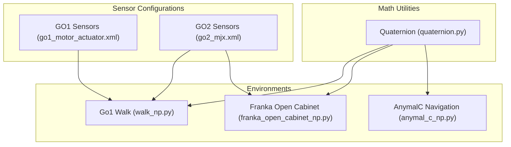
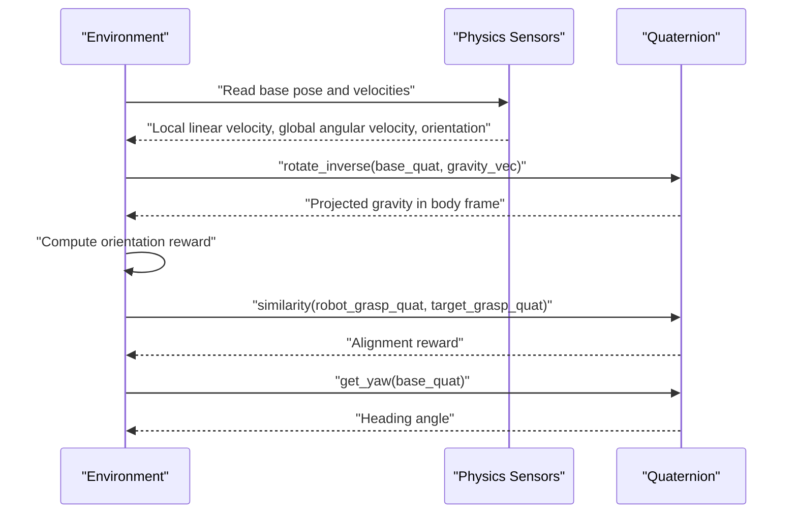
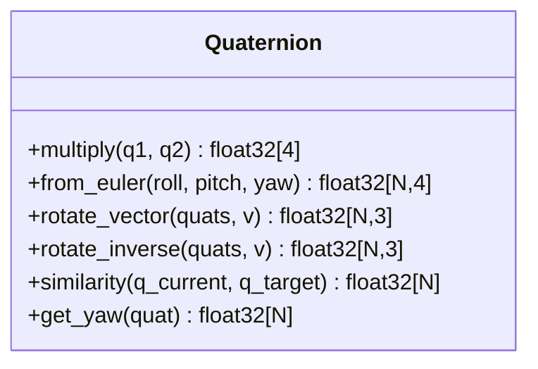
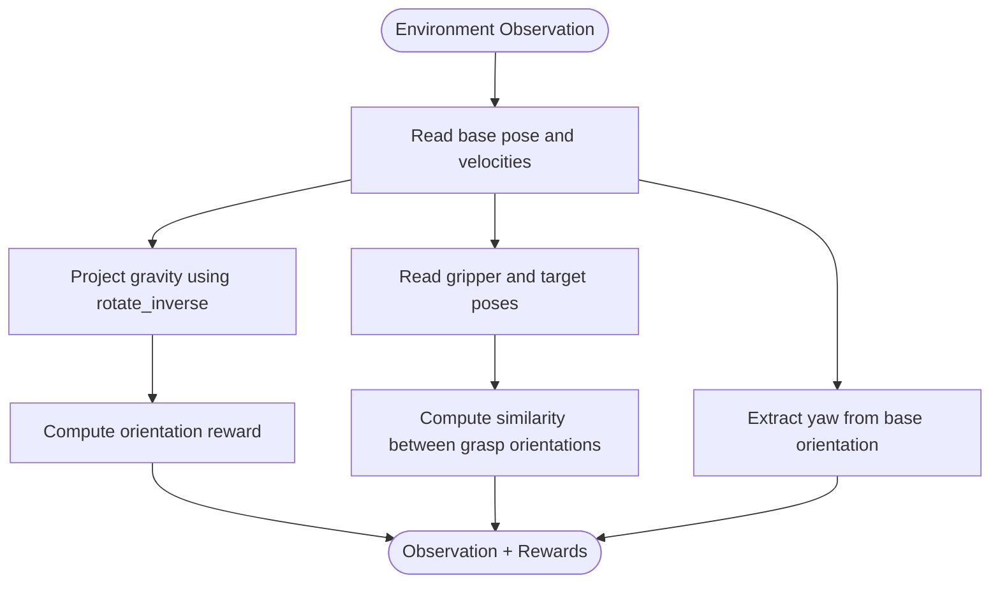
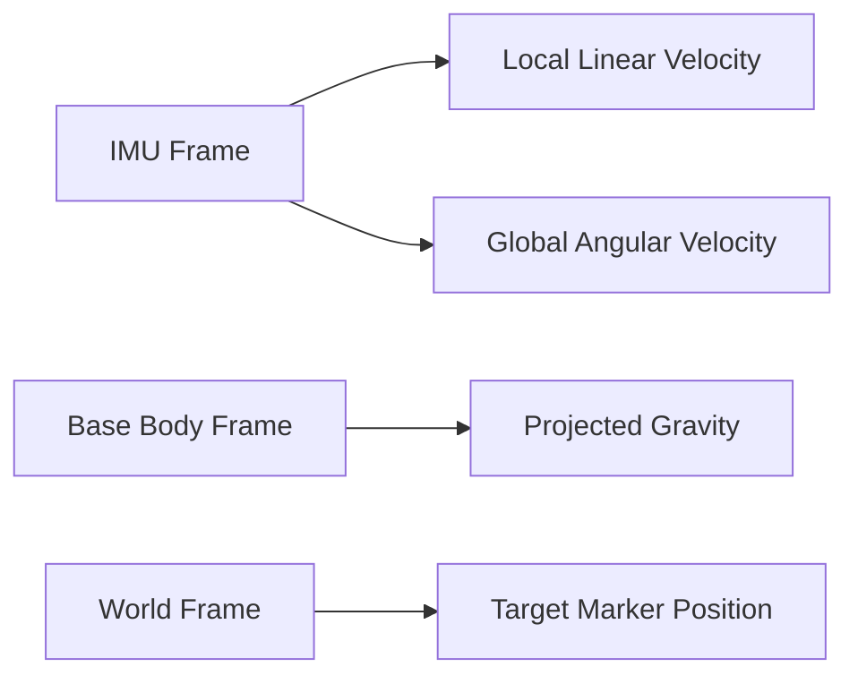
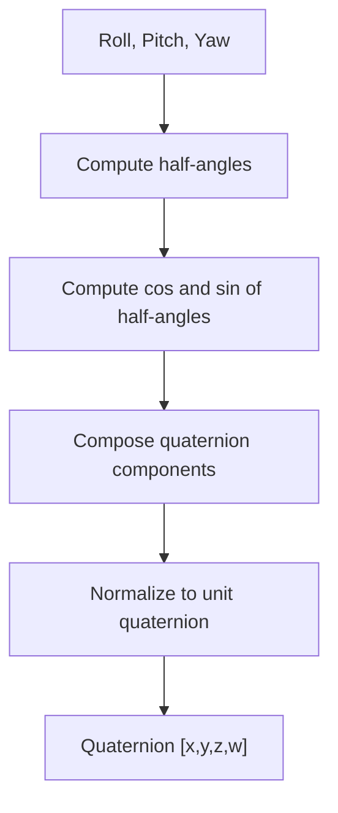
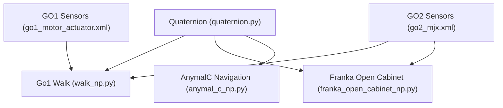

# Mathematical Foundations

<cite>
**Referenced Files in This Document**
- [quaternion.py](file://motrix_envs/src/motrix_envs/math/quaternion.py)
- [walk_np.py](file://motrix_envs/src/motrix_envs/locomotion/go1/walk_np.py)
- [franka_open_cabinet_np.py](file://motrix_envs/src/motrix_envs/manipulation/franka_open_cabinet/franka_open_cabinet_np.py)
- [anymal_c_np.py](file://motrix_envs/src/motrix_envs/navigation/anymal_c/anymal_c_np.py)
- [go1_motor_actuator.xml](file://motrix_envs/src/motrix_envs/locomotion/go1/xmls/go1_motor_actuator.xml)
- [go2_mjx.xml](file://motrix_envs/src/motrix_envs/locomotion/go2/xmls/go2_mjx.xml)
- [walk_np.py](file://motrix_envs/src/motrix_envs/locomotion/go2/walk_np.py)
- [physics_environment.md](file://docs/source/en/user_guide/tutorial/physics_environment.md)
</cite>

## Table of Contents
1. [Introduction](#introduction)
2. [Project Structure](#project-structure)
3. [Core Components](#core-components)
4. [Architecture Overview](#architecture-overview)
5. [Detailed Component Analysis](#detailed-component-analysis)
6. [Dependency Analysis](#dependency-analysis)
7. [Performance Considerations](#performance-considerations)
8. [Troubleshooting Guide](#troubleshooting-guide)
9. [Conclusion](#conclusion)

## Introduction
This document presents the mathematical foundations for robotics simulation with a focus on quaternion operations and 3D transformations. It consolidates the repository’s quaternion utilities, rotation implementations, and sensor-driven usage across locomotion, manipulation, and navigation tasks. It also covers coordinate system conversions, Euler angle representations, and practical applications in robot kinematics, sensor data processing, and animation systems. Numerical stability, floating-point precision, and optimization techniques for real-time simulation are addressed throughout.

## Project Structure
The mathematical foundations are primarily implemented in a dedicated module for quaternions and applied across environment implementations for locomotion, manipulation, and navigation. Sensor configurations define reference frames and coordinate conventions used in physics simulations.

**Diagram sources**
- [quaternion.py](file://motrix_envs/src/motrix_envs/math/quaternion.py#L18-L150)
- [walk_np.py](file://motrix_envs/src/motrix_envs/locomotion/go1/walk_np.py#L22-L223)
- [franka_open_cabinet_np.py](file://motrix_envs/src/motrix_envs/manipulation/franka_open_cabinet/franka_open_cabinet_np.py#L21-L210)
- [anymal_c_np.py](file://motrix_envs/src/motrix_envs/navigation/anymal_c/anymal_c_np.py#L368-L464)
- [go1_motor_actuator.xml](file://motrix_envs/src/motrix_envs/locomotion/go1/xmls/go1_motor_actuator.xml#L219-L238)
- [go2_mjx.xml](file://motrix_envs/src/motrix_envs/locomotion/go2/xmls/go2_mjx.xml#L234-L279)

**Section sources**
- [quaternion.py](file://motrix_envs/src/motrix_envs/math/quaternion.py#L18-L150)
- [walk_np.py](file://motrix_envs/src/motrix_envs/locomotion/go1/walk_np.py#L22-L223)
- [franka_open_cabinet_np.py](file://motrix_envs/src/motrix_envs/manipulation/franka_open_cabinet/franka_open_cabinet_np.py#L21-L210)
- [anymal_c_np.py](file://motrix_envs/src/motrix_envs/navigation/anymal_c/anymal_c_np.py#L368-L464)
- [go1_motor_actuator.xml](file://motrix_envs/src/motrix_envs/locomotion/go1/xmls/go1_motor_actuator.xml#L219-L238)
- [go2_mjx.xml](file://motrix_envs/src/motrix_envs/locomotion/go2/xmls/go2_mjx.xml#L234-L279)

## Core Components
- Quaternion class with vectorized operations for batched rotations, inverse rotations, Euler-to-quaternion conversion, and yaw extraction.
- Environment-specific usage of quaternions for:
  - Gravity projection and orientation rewards.
  - Pose alignment similarity for grasp targets.
  - Heading computation from base orientation.
  - Sensor frame conversions via XML-defined frames.

Key capabilities:
- Vectorized rotation of a fixed vector by a batch of quaternions.
- Vectorized rotation by inverse quaternions.
- Attitude alignment reward via relative quaternion rotation and angle computation.
- Euler-to-quaternion conversion and yaw extraction for navigation.

**Section sources**
- [quaternion.py](file://motrix_envs/src/motrix_envs/math/quaternion.py#L18-L150)
- [walk_np.py](file://motrix_envs/src/motrix_envs/locomotion/go1/walk_np.py#L188-L223)
- [franka_open_cabinet_np.py](file://motrix_envs/src/motrix_envs/manipulation/franka_open_cabinet/franka_open_cabinet_np.py#L180-L210)
- [anymal_c_np.py](file://motrix_envs/src/motrix_envs/navigation/anymal_c/anymal_c_np.py#L368-L464)

## Architecture Overview
The quaternion utilities are consumed by environment implementations to process sensor data and compute rewards. Sensor configurations define reference frames and coordinate conventions used in physics simulations.

**Diagram sources**
- [walk_np.py](file://motrix_envs/src/motrix_envs/locomotion/go1/walk_np.py#L188-L223)
- [franka_open_cabinet_np.py](file://motrix_envs/src/motrix_envs/manipulation/franka_open_cabinet/franka_open_cabinet_np.py#L180-L210)
- [anymal_c_np.py](file://motrix_envs/src/motrix_envs/navigation/anymal_c/anymal_c_np.py#L368-L464)
- [quaternion.py](file://motrix_envs/src/motrix_envs/math/quaternion.py#L51-L150)

## Detailed Component Analysis

### Quaternion Class
The Quaternion class encapsulates:
- Multiplication of two quaternions in [w, x, y, z] format.
- Euler-to-quaternion conversion using half-angles.
- Vectorized rotation of a fixed vector by a batch of quaternions.
- Vectorized rotation by inverse quaternions.
- Attitude alignment reward via relative quaternion and angle computation.
- Yaw extraction from a batch of quaternions.

**Diagram sources**
- [quaternion.py](file://motrix_envs/src/motrix_envs/math/quaternion.py#L18-L150)

**Section sources**
- [quaternion.py](file://motrix_envs/src/motrix_envs/math/quaternion.py#L18-L150)

### Rotation Operations and Applications
- Gravity projection and orientation rewards in locomotion:
  - Uses inverse rotation to transform gravity into the body frame.
  - Computes penalties based on projected gravity components.
- Pose alignment similarity in manipulation:
  - Compares gripper orientation to target handle orientation using the similarity metric.
- Heading computation in navigation:
  - Extracts yaw from base orientation for path-following policies.

**Diagram sources**
- [walk_np.py](file://motrix_envs/src/motrix_envs/locomotion/go1/walk_np.py#L188-L223)
- [franka_open_cabinet_np.py](file://motrix_envs/src/motrix_envs/manipulation/franka_open_cabinet/franka_open_cabinet_np.py#L180-L210)
- [anymal_c_np.py](file://motrix_envs/src/motrix_envs/navigation/anymal_c/anymal_c_np.py#L368-L464)
- [quaternion.py](file://motrix_envs/src/motrix_envs/math/quaternion.py#L51-L150)

**Section sources**
- [walk_np.py](file://motrix_envs/src/motrix_envs/locomotion/go1/walk_np.py#L188-L223)
- [franka_open_cabinet_np.py](file://motrix_envs/src/motrix_envs/manipulation/franka_open_cabinet/franka_open_cabinet_np.py#L180-L210)
- [anymal_c_np.py](file://motrix_envs/src/motrix_envs/navigation/anymal_c/anymal_c_np.py#L368-L464)
- [quaternion.py](file://motrix_envs/src/motrix_envs/math/quaternion.py#L51-L150)

### Coordinate System Conversions and Sensor Frames
- Sensor frames define reference frames for linear and angular velocities, positions, and orientations.
- Environments read sensor values and convert them into appropriate reference frames for control and reward computation.
- XML sensor configurations specify frame types (e.g., global vs. local) and axes conventions.

**Diagram sources**
- [go1_motor_actuator.xml](file://motrix_envs/src/motrix_envs/locomotion/go1/xmls/go1_motor_actuator.xml#L219-L238)
- [go2_mjx.xml](file://motrix_envs/src/motrix_envs/locomotion/go2/xmls/go2_mjx.xml#L234-L279)
- [walk_np.py](file://motrix_envs/src/motrix_envs/locomotion/go2/walk_np.py#L199-L223)

**Section sources**
- [go1_motor_actuator.xml](file://motrix_envs/src/motrix_envs/locomotion/go1/xmls/go1_motor_actuator.xml#L219-L238)
- [go2_mjx.xml](file://motrix_envs/src/motrix_envs/locomotion/go2/xmls/go2_mjx.xml#L234-L279)
- [walk_np.py](file://motrix_envs/src/motrix_envs/locomotion/go2/walk_np.py#L199-L223)

### Euler Angles and Axis-Angle Representations
- Euler-to-quaternion conversion is implemented for [roll, pitch, yaw] inputs.
- Heading extraction via yaw computation enables navigation policies to align orientation with desired headings.
- Additional helper methods demonstrate quaternion multiplication and Euler conversion for internal computations.

**Diagram sources**
- [quaternion.py](file://motrix_envs/src/motrix_envs/math/quaternion.py#L33-L49)
- [anymal_c_np.py](file://motrix_envs/src/motrix_envs/navigation/anymal_c/anymal_c_np.py#L448-L464)

**Section sources**
- [quaternion.py](file://motrix_envs/src/motrix_envs/math/quaternion.py#L33-L49)
- [anymal_c_np.py](file://motrix_envs/src/motrix_envs/navigation/anymal_c/anymal_c_np.py#L448-L464)

### Practical Applications
- Robot kinematics:
  - Gravity projection for stance stability and orientation rewards.
  - Pose alignment for manipulation tasks using similarity metric.
- Sensor data processing:
  - Transforming IMU measurements into body-fixed coordinates.
  - Computing relative orientation between gripper and target.
- Animation systems:
  - Arrow visualization updates using Euler-to-quaternion conversion and normalization.

**Section sources**
- [walk_np.py](file://motrix_envs/src/motrix_envs/locomotion/go1/walk_np.py#L188-L223)
- [franka_open_cabinet_np.py](file://motrix_envs/src/motrix_envs/manipulation/franka_open_cabinet/franka_open_cabinet_np.py#L180-L210)
- [anymal_c_np.py](file://motrix_envs/src/motrix_envs/navigation/anymal_c/anymal_c_np.py#L377-L434)

## Dependency Analysis
Quaternions are used across multiple environments and sensor configurations. The dependency graph highlights how math utilities are consumed by environment logic and sensors.

**Diagram sources**
- [quaternion.py](file://motrix_envs/src/motrix_envs/math/quaternion.py#L18-L150)
- [walk_np.py](file://motrix_envs/src/motrix_envs/locomotion/go1/walk_np.py#L22-L223)
- [franka_open_cabinet_np.py](file://motrix_envs/src/motrix_envs/manipulation/franka_open_cabinet/franka_open_cabinet_np.py#L21-L210)
- [anymal_c_np.py](file://motrix_envs/src/motrix_envs/navigation/anymal_c/anymal_c_np.py#L368-L464)
- [go1_motor_actuator.xml](file://motrix_envs/src/motrix_envs/locomotion/go1/xmls/go1_motor_actuator.xml#L219-L238)
- [go2_mjx.xml](file://motrix_envs/src/motrix_envs/locomotion/go2/xmls/go2_mjx.xml#L234-L279)

**Section sources**
- [quaternion.py](file://motrix_envs/src/motrix_envs/math/quaternion.py#L18-L150)
- [walk_np.py](file://motrix_envs/src/motrix_envs/locomotion/go1/walk_np.py#L22-L223)
- [franka_open_cabinet_np.py](file://motrix_envs/src/motrix_envs/manipulation/franka_open_cabinet/franka_open_cabinet_np.py#L21-L210)
- [anymal_c_np.py](file://motrix_envs/src/motrix_envs/navigation/anymal_c/anymal_c_np.py#L368-L464)
- [go1_motor_actuator.xml](file://motrix_envs/src/motrix_envs/locomotion/go1/xmls/go1_motor_actuator.xml#L219-L238)
- [go2_mjx.xml](file://motrix_envs/src/motrix_envs/locomotion/go2/xmls/go2_mjx.xml#L234-L279)

## Performance Considerations
- Vectorized operations:
  - Batched rotation and similarity computations reduce Python overhead and leverage NumPy’s optimized kernels.
- Floating-point precision:
  - Clamping of computed quantities (e.g., arccos arguments) prevents domain errors and maintains numerical stability.
- Normalization safeguards:
  - Unit quaternion checks and renormalization protect against drift in long-running simulations.
- Sensor frame conversions:
  - Using predefined sensor frames avoids ad-hoc transformations and reduces computational overhead.
- Time step configuration:
  - Proper control and simulation time step selection balances accuracy and performance.

[No sources needed since this section provides general guidance]

## Troubleshooting Guide
Common issues and remedies:
- Non-unit quaternions leading to incorrect rotations:
  - Ensure quaternions are normalized before use; see normalization checks in environment resets and arrow updates.
- Numerical instability in angle computations:
  - Clamp intermediate values to valid ranges before invoking inverse trigonometric functions.
- Sensor frame mismatches:
  - Verify sensor frame definitions in XML and confirm environment reads align with intended reference frames.
- Excessive velocities or NaN/Inf:
  - Apply termination conditions and clipping to prevent divergence; monitor DOF velocities and contact queries.

**Section sources**
- [anymal_c_np.py](file://motrix_envs/src/motrix_envs/navigation/anymal_c/anymal_c_np.py#L775-L800)
- [anymal_c_np.py](file://motrix_envs/src/motrix_envs/navigation/anymal_c/anymal_c_np.py#L667-L713)
- [physics_environment.md](file://docs/source/en/user_guide/tutorial/physics_environment.md#L52-L67)

## Conclusion
The repository integrates robust quaternion mathematics with practical robotics applications across locomotion, manipulation, and navigation domains. The Quaternion class provides vectorized primitives for rotation, alignment, and heading extraction, while environment implementations demonstrate real-world usage patterns for sensor fusion, reward shaping, and stability enforcement. Adhering to numerical stability practices and leveraging sensor frame conventions ensures reliable and efficient real-time simulation.