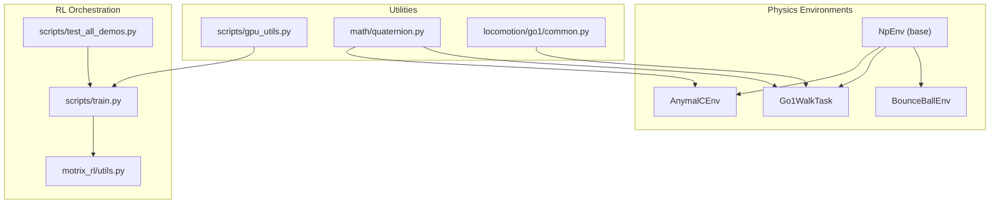
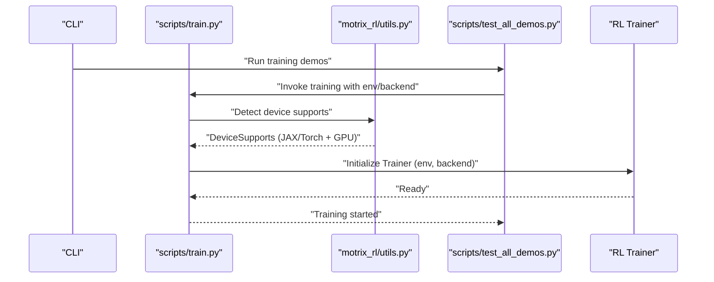
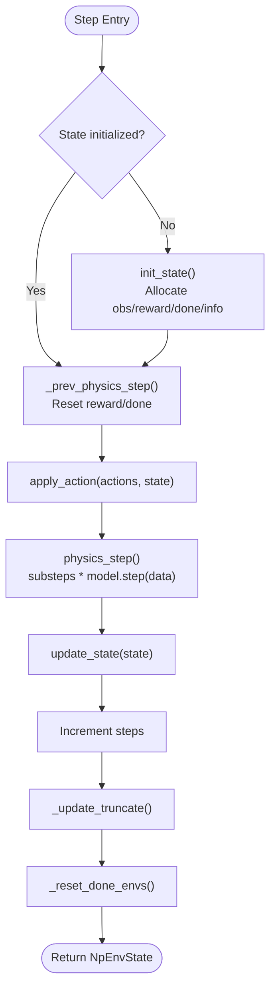
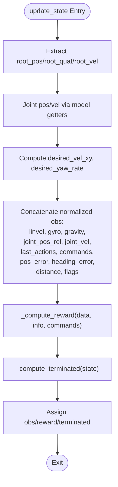
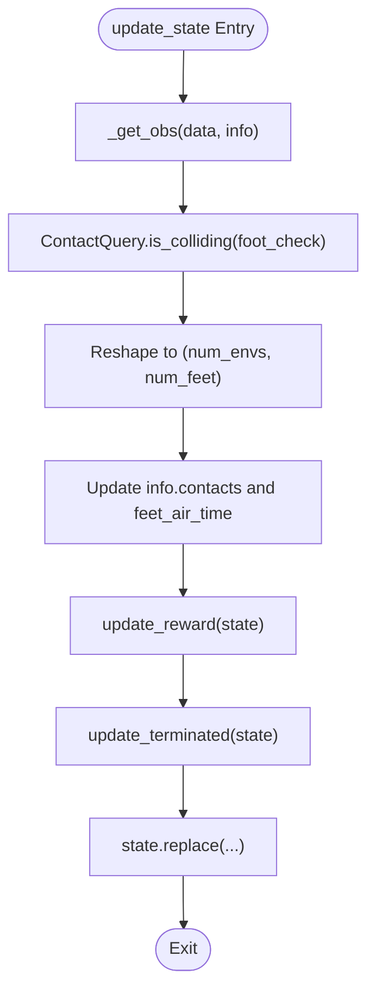
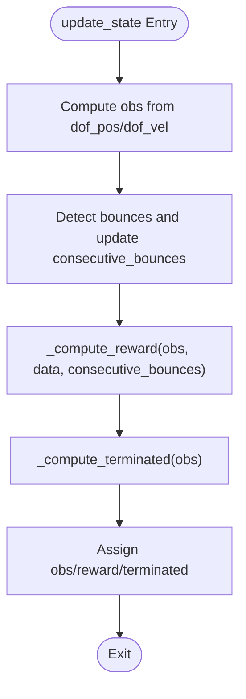
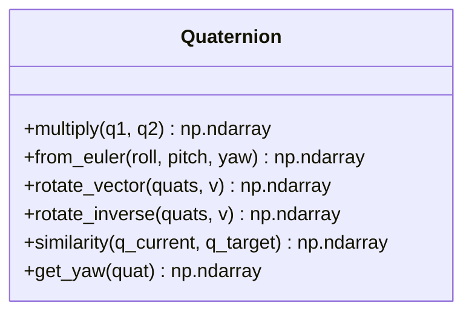
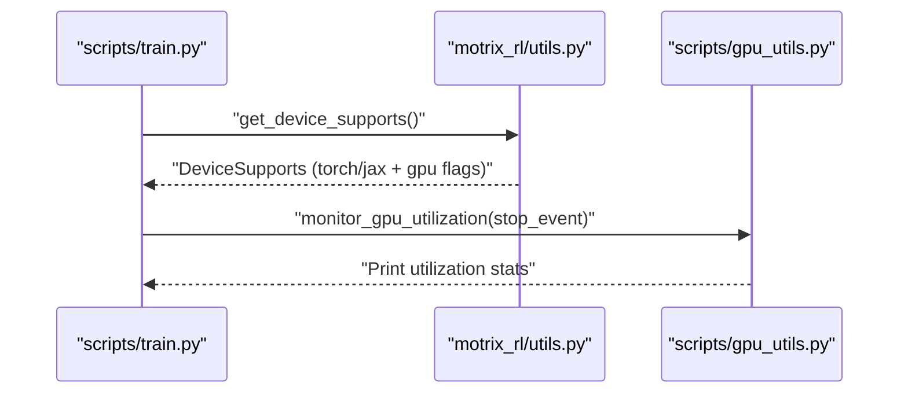
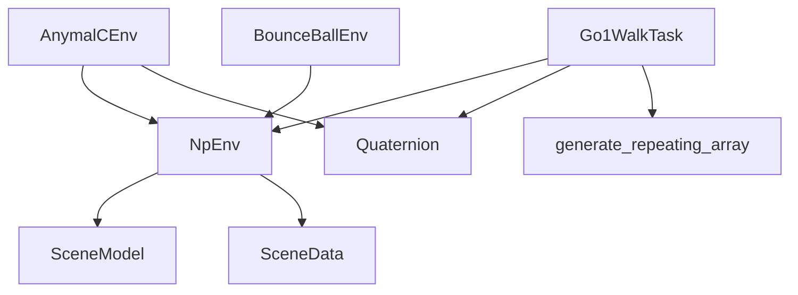

# Performance Optimization

<cite>
**Referenced Files in This Document**
- [env.py](file://motrix_envs/src/motrix_envs/np/env.py)
- [anymal_c_np.py](file://motrix_envs/src/motrix_envs/locomotion/anymal_c/anymal_c_np.py)
- [walk_np.py](file://motrix_envs/src/motrix_envs/locomotion/go1/walk_np.py)
- [bounce_ball_np.py](file://motrix_envs/src/motrix_envs/basic/bounce_ball/bounce_ball_np.py)
- [quaternion.py](file://motrix_envs/src/motrix_envs/math/quaternion.py)
- [gpu_utils.py](file://scripts/gpu_utils.py)
- [train.py](file://scripts/train.py)
- [test_all_demos.py](file://scripts/test_all_demos.py)
- [utils.py](file://motrix_rl/src/motrix_rl/utils.py)
- [common.py](file://motrix_envs/src/motrix_envs/locomotion/go1/common.py)
</cite>

## Table of Contents
1. [Introduction](#introduction)
2. [Project Structure](#project-structure)
3. [Core Components](#core-components)
4. [Architecture Overview](#architecture-overview)
5. [Detailed Component Analysis](#detailed-component-analysis)
6. [Dependency Analysis](#dependency-analysis)
7. [Performance Considerations](#performance-considerations)
8. [Troubleshooting Guide](#troubleshooting-guide)
9. [Conclusion](#conclusion)
10. [Appendices](#appendices)

## Introduction
This document presents a comprehensive guide to performance optimization for numerical simulations and reinforcement learning within the MotrixLab-S1 codebase. It focuses on computational efficiency, memory management, and parallel execution patterns. It also covers NumPy optimization strategies (vectorization, broadcasting, and memory layout), GPU utilization and monitoring, and practical profiling and benchmarking techniques. The goal is to help developers achieve scalable, efficient simulations and training loops across CPU and GPU backends.

## Project Structure
The repository organizes performance-critical code across three primary areas:
- Physics environments and numerical computations: NumPy-based environment abstractions and domain-specific tasks (e.g., locomotion, manipulation, basic physics).
- RL training orchestration: Backend selection and training entry points supporting JAX and PyTorch.
- Utilities for GPU monitoring and device capability detection.

**Diagram sources**
- [env.py](file://motrix_envs/src/motrix_envs/np/env.py#L52-L209)
- [anymal_c_np.py](file://motrix_envs/src/motrix_envs/locomotion/anymal_c/anymal_c_np.py#L28-L657)
- [walk_np.py](file://motrix_envs/src/motrix_envs/locomotion/go1/walk_np.py#L26-L387)
- [bounce_ball_np.py](file://motrix_envs/src/motrix_envs/basic/bounce_ball/bounce_ball_np.py#L26-L309)
- [gpu_utils.py](file://scripts/gpu_utils.py#L20-L41)
- [train.py](file://scripts/train.py#L39-L95)
- [test_all_demos.py](file://scripts/test_all_demos.py#L51-L158)
- [utils.py](file://motrix_rl/src/motrix_rl/utils.py#L19-L61)
- [quaternion.py](file://motrix_envs/src/motrix_envs/math/quaternion.py#L18-L151)
- [common.py](file://motrix_envs/src/motrix_envs/locomotion/go1/common.py#L19-L49)

**Section sources**
- [env.py](file://motrix_envs/src/motrix_envs/np/env.py#L52-L209)
- [train.py](file://scripts/train.py#L39-L95)
- [gpu_utils.py](file://scripts/gpu_utils.py#L20-L41)

## Core Components
- NpEnv: Base environment abstraction encapsulating batched simulation state, physics stepping, and environment lifecycle. It defines the core loop for applying actions, stepping physics, updating state, and resetting done environments.
- Domain-specific environments: AnymalCEnv, Go1WalkTask, and BounceBallEnv implement environment-specific observation extraction, reward shaping, termination logic, and action application using NumPy arrays.
- Numerical primitives: Quaternion utilities provide vectorized rotation and similarity computations suitable for batched environments.
- GPU monitoring and device detection: Utilities detect GPU availability and monitor GPU utilization during training.

Key performance-relevant responsibilities:
- Batched NumPy arrays for observations, rewards, and termination flags.
- Vectorized operations for sensor readings, contact queries, and reward computations.
- Efficient state updates and minimal allocations via in-place updates and masks.

**Section sources**
- [env.py](file://motrix_envs/src/motrix_envs/np/env.py#L52-L209)
- [anymal_c_np.py](file://motrix_envs/src/motrix_envs/locomotion/anymal_c/anymal_c_np.py#L157-L279)
- [walk_np.py](file://motrix_envs/src/motrix_envs/locomotion/go1/walk_np.py#L160-L286)
- [bounce_ball_np.py](file://motrix_envs/src/motrix_envs/basic/bounce_ball/bounce_ball_np.py#L182-L248)
- [quaternion.py](file://motrix_envs/src/motrix_envs/math/quaternion.py#L51-L151)
- [gpu_utils.py](file://scripts/gpu_utils.py#L20-L41)

## Architecture Overview
The runtime architecture couples environment simulation with RL training backends. The training orchestrator selects JAX or PyTorch based on device capabilities and runs the specified environment with configurable batch sizes.

**Diagram sources**
- [train.py](file://scripts/train.py#L39-L95)
- [utils.py](file://motrix_rl/src/motrix_rl/utils.py#L19-L61)
- [test_all_demos.py](file://scripts/test_all_demos.py#L51-L158)

## Detailed Component Analysis

### NpEnv: Environment Loop and Batched Operations
NpEnv centralizes the simulation loop and state management. It initializes batched arrays for observations, rewards, and termination flags, and performs physics stepping with configurable substeps.

**Diagram sources**
- [env.py](file://motrix_envs/src/motrix_envs/np/env.py#L97-L209)

**Section sources**
- [env.py](file://motrix_envs/src/motrix_envs/np/env.py#L52-L209)

### AnymalCEnv: Vectorized Observations, Rewards, and Termination
AnymalCEnv demonstrates vectorized computation patterns:
- Extract root pose, velocities, and joint states in batched form.
- Compute normalized observations, desired velocities, and termination flags using NumPy operations.
- Reward composition blends tracking, stabilization, and penalties with vectorized comparisons and masking.

**Diagram sources**
- [anymal_c_np.py](file://motrix_envs/src/motrix_envs/locomotion/anymal_c/anymal_c_np.py#L169-L279)

**Section sources**
- [anymal_c_np.py](file://motrix_envs/src/motrix_envs/locomotion/anymal_c/anymal_c_np.py#L132-L279)

### Go1WalkTask: Contact Queries, Air-Time Rewards, and Penalities
Go1WalkTask showcases efficient contact detection and reward shaping:
- Contact queries are performed in batch using model-provided APIs.
- Air-time and foot contact tracking leverage vectorized operations and masks.
- Reward computation aggregates multiple terms with configurable scales.

**Diagram sources**
- [walk_np.py](file://motrix_envs/src/motrix_envs/locomotion/go1/walk_np.py#L215-L264)

**Section sources**
- [walk_np.py](file://motrix_envs/src/motrix_envs/locomotion/go1/walk_np.py#L160-L286)

### BounceBallEnv: Observation Design and Reward Composition
BounceBallEnv emphasizes efficient observation concatenation and reward composition:
- DOF-based observations combine positions and velocities.
- Reward computation uses vectorized conditions and thresholds to penalize or reward specific behaviors.

**Diagram sources**
- [bounce_ball_np.py](file://motrix_envs/src/motrix_envs/basic/bounce_ball/bounce_ball_np.py#L197-L248)

**Section sources**
- [bounce_ball_np.py](file://motrix_envs/src/motrix_envs/basic/bounce_ball/bounce_ball_np.py#L182-L248)

### Quaternion Utilities: Vectorized Rotations and Similarity
Quaternion utilities provide vectorized rotation and similarity computations essential for batched pose computations and reward shaping.

**Diagram sources**
- [quaternion.py](file://motrix_envs/src/motrix_envs/math/quaternion.py#L18-L151)

**Section sources**
- [quaternion.py](file://motrix_envs/src/motrix_envs/math/quaternion.py#L51-L151)

### GPU Monitoring and Device Detection
The training orchestrator detects device capabilities and monitors GPU utilization to inform backend selection and validate acceleration.

**Diagram sources**
- [train.py](file://scripts/train.py#L39-L95)
- [utils.py](file://motrix_rl/src/motrix_rl/utils.py#L19-L61)
- [gpu_utils.py](file://scripts/gpu_utils.py#L20-L41)

**Section sources**
- [train.py](file://scripts/train.py#L39-L95)
- [utils.py](file://motrix_rl/src/motrix_rl/utils.py#L19-L61)
- [gpu_utils.py](file://scripts/gpu_utils.py#L20-L41)

## Dependency Analysis
The environment implementations depend on:
- NumPy for vectorized operations and batched arrays.
- Motrixsim SceneData and SceneModel for physics simulation and sensor access.
- Environment-specific configuration and constants for normalization, limits, and reward scales.

**Diagram sources**
- [env.py](file://motrix_envs/src/motrix_envs/np/env.py#L52-L209)
- [anymal_c_np.py](file://motrix_envs/src/motrix_envs/locomotion/anymal_c/anymal_c_np.py#L28-L657)
- [walk_np.py](file://motrix_envs/src/motrix_envs/locomotion/go1/walk_np.py#L26-L387)
- [bounce_ball_np.py](file://motrix_envs/src/motrix_envs/basic/bounce_ball/bounce_ball_np.py#L26-L309)
- [quaternion.py](file://motrix_envs/src/motrix_envs/math/quaternion.py#L18-L151)
- [common.py](file://motrix_envs/src/motrix_envs/locomotion/go1/common.py#L19-L49)

**Section sources**
- [env.py](file://motrix_envs/src/motrix_envs/np/env.py#L52-L209)
- [anymal_c_np.py](file://motrix_envs/src/motrix_envs/locomotion/anymal_c/anymal_c_np.py#L28-L657)
- [walk_np.py](file://motrix_envs/src/motrix_envs/locomotion/go1/walk_np.py#L26-L387)
- [bounce_ball_np.py](file://motrix_envs/src/motrix_envs/basic/bounce_ball/bounce_ball_np.py#L26-L309)
- [quaternion.py](file://motrix_envs/src/motrix_envs/math/quaternion.py#L18-L151)
- [common.py](file://motrix_envs/src/motrix_envs/locomotion/go1/common.py#L19-L49)

## Performance Considerations

### Computational Efficiency
- Vectorization and Broadcasting
  - Prefer vectorized NumPy operations over Python loops for sensor reads, contact checks, and reward computations.
  - Use broadcasting semantics to avoid explicit reshaping where possible (e.g., aligning shapes for element-wise operations).
  - Leverage in-place operations and masks to minimize temporary arrays.

- Memory Layout and Data Types
  - Use float32 for observations and controls to reduce memory footprint and improve cache locality.
  - Keep arrays contiguous along the batch dimension to maximize SIMD utilization.

- Algorithmic Optimizations
  - Pre-allocate arrays in initialization routines (e.g., observation buffers, info dictionaries) to avoid per-step allocations.
  - Reuse intermediate arrays across steps when state transitions permit.

- Physics Substeps
  - Adjust sim_substeps to balance accuracy and throughput; higher substeps increase fidelity but cost compute.

**Section sources**
- [env.py](file://motrix_envs/src/motrix_envs/np/env.py#L97-L109)
- [anymal_c_np.py](file://motrix_envs/src/motrix_envs/locomotion/anymal_c/anymal_c_np.py#L169-L279)
- [walk_np.py](file://motrix_envs/src/motrix_envs/locomotion/go1/walk_np.py#L215-L264)
- [bounce_ball_np.py](file://motrix_envs/src/motrix_envs/basic/bounce_ball/bounce_ball_np.py#L197-L248)

### Memory Management
- Object Pooling and Reuse
  - Initialize large buffers (e.g., observation arrays, info dicts) once in init_state and reuse across episodes.
  - Avoid frequent creation/destruction of large NumPy arrays inside tight loops.

- Garbage Collection Optimization
  - Minimize transient object creation in per-step functions; prefer views and in-place updates.
  - Use np.putmask and boolean indexing to update arrays efficiently without copying.

- Memory Leak Prevention
  - Ensure deterministic cleanup of simulation data via reset and forward kinematics calls.
  - Avoid holding references to large arrays longer than necessary.

**Section sources**
- [env.py](file://motrix_envs/src/motrix_envs/np/env.py#L97-L140)
- [anymal_c_np.py](file://motrix_envs/src/motrix_envs/locomotion/anymal_c/anymal_c_np.py#L494-L652)
- [walk_np.py](file://motrix_envs/src/motrix_envs/locomotion/go1/walk_np.py#L266-L286)

### Parallel Execution Patterns
- Multiprocessing and Threading
  - Use separate processes for independent environment rollouts to exploit multiple CPUs.
  - For I/O-bound stages (e.g., rendering), consider threading sparingly; prefer process-based parallelism for CPU-bound workloads.

- Asynchronous I/O
  - Offload rendering or logging to background threads to avoid blocking the main simulation loop.

- Backend Selection
  - The training orchestrator chooses JAX or PyTorch based on GPU availability, enabling acceleration where present.

**Section sources**
- [train.py](file://scripts/train.py#L39-L95)
- [utils.py](file://motrix_rl/src/motrix_rl/utils.py#L19-L61)

### GPU Utilization and Hardware Acceleration
- Device Capability Detection
  - Detect GPU availability for both JAX and PyTorch to select optimal backends.

- Monitoring
  - Monitor GPU utilization during training to validate acceleration and tune batch sizes.

- Practical Tips
  - Prefer float32 tensors on GPU for reduced bandwidth.
  - Keep batch sizes large enough to saturate the GPU while fitting memory constraints.

**Section sources**
- [utils.py](file://motrix_rl/src/motrix_rl/utils.py#L19-L61)
- [gpu_utils.py](file://scripts/gpu_utils.py#L20-L41)

### Profiling Methodologies and Benchmarking
- Timing and Metrics
  - Measure per-step wall time and throughput (steps per second) across environments and backends.
  - Record reward timing breakdowns for observation extraction, reward computation, and termination checks.

- Regression Testing
  - Run the demo suite across JAX and PyTorch backends to catch performance regressions.
  - Compare metrics across versions to detect slowdowns.

- Practical Scripts
  - Use the training orchestrator to sweep batch sizes and measure throughput.
  - Integrate GPU monitoring to correlate utilization with performance.

**Section sources**
- [test_all_demos.py](file://scripts/test_all_demos.py#L51-L158)
- [train.py](file://scripts/train.py#L39-L95)
- [gpu_utils.py](file://scripts/gpu_utils.py#L20-L41)

### Scalability and Load Balancing
- Batch Size Tuning
  - Increase num_envs to improve throughput until memory or compute becomes the bottleneck.
  - Use the demo runner to systematically evaluate performance across environments.

- Distributed Computing
  - For large-scale simulations, distribute independent rollout workers across machines and aggregate gradients centrally.
  - Ensure deterministic seeding for reproducible experiments.

- Load Balancing
  - Balance physics and neural network workloads; offload rendering and logging to minimize contention.

**Section sources**
- [test_all_demos.py](file://scripts/test_all_demos.py#L51-L158)
- [train.py](file://scripts/train.py#L39-L95)

## Troubleshooting Guide
- Symptom: Unexpected NaNs or divergent velocities
  - Cause: Excessive actions or unstable PD control.
  - Mitigation: Clamp actions, reduce action scales, and add extreme velocity checks in termination logic.

- Symptom: Slow training throughput
  - Cause: Small batch sizes or insufficient vectorization.
  - Mitigation: Increase num_envs, ensure vectorized reward computations, and avoid per-step allocations.

- Symptom: GPU not utilized
  - Cause: CPU-only backend or insufficient workload.
  - Mitigation: Enable GPU backends via device detection and increase batch sizes.

**Section sources**
- [anymal_c_np.py](file://motrix_envs/src/motrix_envs/locomotion/anymal_c/anymal_c_np.py#L462-L492)
- [walk_np.py](file://motrix_envs/src/motrix_envs/locomotion/go1/walk_np.py#L224-L233)
- [utils.py](file://motrix_rl/src/motrix_rl/utils.py#L19-L61)

## Conclusion
Performance optimization in MotrixLab-S1 hinges on vectorized NumPy operations, careful memory management, and strategic backend selection. By leveraging batched computations, minimizing allocations, and monitoring GPU utilization, developers can achieve scalable, efficient simulations and training. The included scripts facilitate automated benchmarking and regression testing across environments and backends.

## Appendices

### Appendix A: Vectorization Checklist
- Replace Python loops with vectorized NumPy operations.
- Use broadcasting to align shapes and avoid explicit tiling.
- Prefer in-place updates and masks for state transitions.
- Initialize large buffers once and reuse across episodes.

### Appendix B: Memory Layout Guidelines
- Use float32 for observations and controls.
- Keep arrays contiguous along the batch dimension.
- Avoid unnecessary copies; use views and strides where safe.

### Appendix C: Benchmarking Workflow
- Run the demo suite with both JAX and PyTorch backends.
- Sweep num_envs and record steps/sec and reward computation times.
- Monitor GPU utilization to validate acceleration.