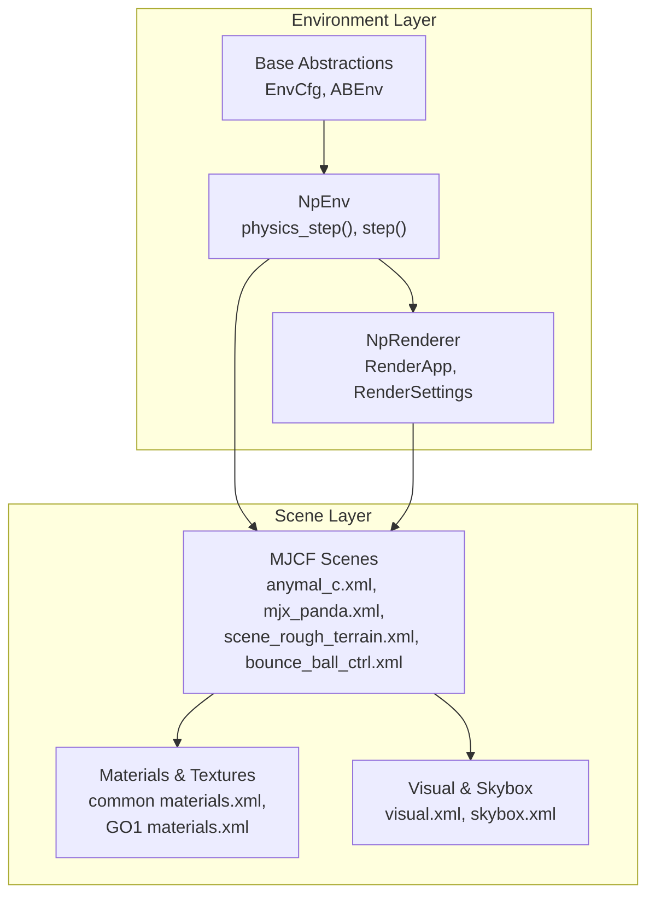
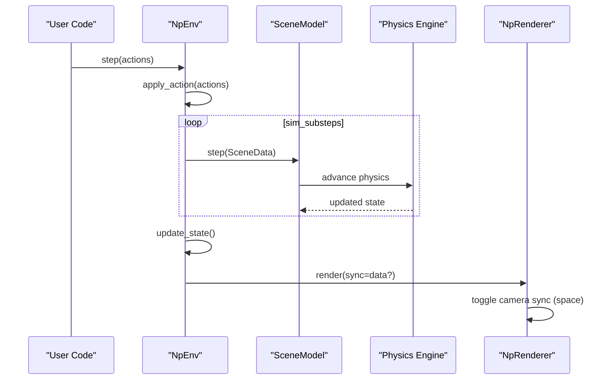
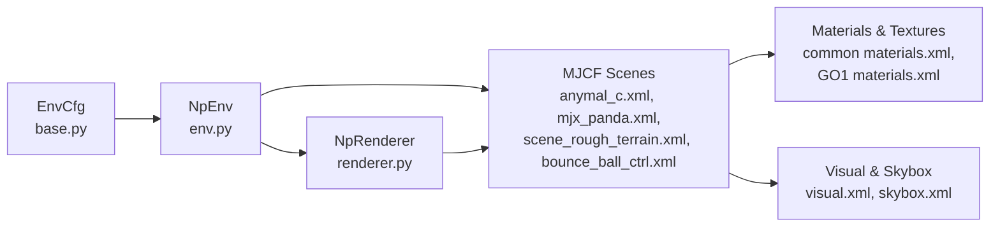

# Physics Simulation Internals

<cite>
**Referenced Files in This Document**
- [env.py](file://motrix_envs/src/motrix_envs/np/env.py)
- [renderer.py](file://motrix_envs/src/motrix_envs/np/renderer.py)
- [base.py](file://motrix_envs/src/motrix_envs/base.py)
- [materials.xml](file://motrix_envs/src/motrix_envs/common/materials.xml)
- [skybox.xml](file://motrix_envs/src/motrix_envs/common/skybox.xml)
- [visual.xml](file://motrix_envs/src/motrix_envs/common/visual.xml)
- [anymal_c.xml](file://motrix_envs/src/motrix_envs/locomotion/anymal_c/xmls/anymal_c.xml)
- [materials.xml (GO1)](file://motrix_envs/src/motrix_envs/locomotion/go1/xmls/materials.xml)
- [scene_rough_terrain.xml](file://motrix_envs/src/motrix_envs/locomotion/go1/xmls/scene_rough_terrain.xml)
- [mjx_panda.xml](file://motrix_envs/src/motrix_envs/manipulation/franka_lift_cube/xmls/mjx_panda.xml)
- [bounce_ball_ctrl.xml](file://motrix_envs/src/motrix_envs/basic/bounce_ball/bounce_ball_ctrl.xml)
- [README.md (franka lift cube)](file://motrix_envs/src/motrix_envs/manipulation/franka_lift_cube/xmls/README.md)
- [uv.lock](file://uv.lock)
</cite>

## Table of Contents
1. [Introduction](#introduction)
2. [Project Structure](#project-structure)
3. [Core Components](#core-components)
4. [Architecture Overview](#architecture-overview)
5. [Detailed Component Analysis](#detailed-component-analysis)
6. [Dependency Analysis](#dependency-analysis)
7. [Performance Considerations](#performance-considerations)
8. [Troubleshooting Guide](#troubleshooting-guide)
9. [Conclusion](#conclusion)

## Introduction
This document explains the physics simulation internals of the MotrixLab-S1 codebase with a focus on:
- Material properties and collision parameters
- Visual rendering pipeline and skybox/atmospheric effects
- Simulation engine integration via the NumPy environment wrapper
- Advanced simulation concepts such as solver settings, contact dynamics, and numerical conditioning
- Performance optimization strategies and debugging techniques

The repository integrates MuJoCo-like MJCF scenes with a Python environment abstraction and a lightweight renderer, enabling efficient robotics and manipulation simulations.

## Project Structure
The physics and rendering stack is organized around:
- Environment abstractions and configuration
- Scene XMLs defining geometry, materials, contacts, and solver options
- Rendering settings and skybox assets
- A NumPy-based environment that drives physics steps and exposes observations

**Diagram sources**
- [env.py](file://motrix_envs/src/motrix_envs/np/env.py#L52-L209)
- [renderer.py](file://motrix_envs/src/motrix_envs/np/renderer.py#L22-L65)
- [base.py](file://motrix_envs/src/motrix_envs/base.py#L23-L85)
- [anymal_c.xml](file://motrix_envs/src/motrix_envs/locomotion/anymal_c/xmls/anymal_c.xml#L1-L392)
- [mjx_panda.xml](file://motrix_envs/src/motrix_envs/manipulation/franka_lift_cube/xmls/mjx_panda.xml#L1-L281)
- [scene_rough_terrain.xml](file://motrix_envs/src/motrix_envs/locomotion/go1/xmls/scene_rough_terrain.xml#L1-L26)
- [materials.xml](file://motrix_envs/src/motrix_envs/common/materials.xml#L1-L24)
- [materials.xml (GO1)](file://motrix_envs/src/motrix_envs/locomotion/go1/xmls/materials.xml#L1-L7)
- [visual.xml](file://motrix_envs/src/motrix_envs/common/visual.xml#L1-L8)
- [skybox.xml](file://motrix_envs/src/motrix_envs/common/skybox.xml#L1-L7)

**Section sources**
- [env.py](file://motrix_envs/src/motrix_envs/np/env.py#L52-L209)
- [renderer.py](file://motrix_envs/src/motrix_envs/np/renderer.py#L22-L65)
- [base.py](file://motrix_envs/src/motrix_envs/base.py#L23-L85)

## Core Components
- Environment configuration and control loop:
  - Simulation timestep, control rate, and substeps are governed by EnvCfg.
  - NpEnv orchestrates physics stepping, action application, and state updates.
- Scene model loading and stepping:
  - The environment loads a scene model from an MJCF file and advances physics via the simulation engine.
- Rendering:
  - NpRenderer launches a render app with configurable settings and batches multiple environments.

Key implementation references:
- Simulation configuration and substeps: [env.py](file://motrix_envs/src/motrix_envs/np/env.py#L58-L63), [base.py](file://motrix_envs/src/motrix_envs/base.py#L37-L51)
- Physics stepping loop: [env.py](file://motrix_envs/src/motrix_envs/np/env.py#L186-L189)
- Renderer initialization and camera sync: [renderer.py](file://motrix_envs/src/motrix_envs/np/renderer.py#L29-L54)

**Section sources**
- [env.py](file://motrix_envs/src/motrix_envs/np/env.py#L52-L209)
- [base.py](file://motrix_envs/src/motrix_envs/base.py#L23-L85)
- [renderer.py](file://motrix_envs/src/motrix_envs/np/renderer.py#L22-L65)

## Architecture Overview
The runtime architecture ties environment configuration, scene definition, and rendering together.

**Diagram sources**
- [env.py](file://motrix_envs/src/motrix_envs/np/env.py#L196-L209)
- [env.py](file://motrix_envs/src/motrix_envs/np/env.py#L186-L189)
- [renderer.py](file://motrix_envs/src/motrix_envs/np/renderer.py#L56-L65)

## Detailed Component Analysis

### Material Definition Systems
Material properties define visual appearance and contact behavior across scenes:
- Common materials and textures: [materials.xml](file://motrix_envs/src/motrix_envs/common/materials.xml#L7-L23)
- Ground texture and material for locomotion scenes: [materials.xml (GO1)](file://motrix_envs/src/motrix_envs/locomotion/go1/xmls/materials.xml#L3-L5)
- Visual quality and headlight settings: [visual.xml](file://motrix_envs/src/motrix_envs/common/visual.xml#L3-L6)
- Skybox gradient background: [skybox.xml](file://motrix_envs/src/motrix_envs/common/skybox.xml#L3-L4)

Contact and friction parameters appear in scene defaults and geometry definitions:
- Locomotion robot defaults (friction, solimp, condim): [anymal_c.xml](file://motrix_envs/src/motrix_envs/locomotion/anymal_c/xmls/anymal_c.xml#L17-L24)
- Manipulation gripper collision defaults (solref, solimp, friction): [mjx_panda.xml](file://motrix_envs/src/motrix_envs/manipulation/franka_lift_cube/xmls/mjx_panda.xml#L17-L35)
- Ball-plane contact and friction: [bounce_ball_ctrl.xml](file://motrix_envs/src/motrix_envs/basic/bounce_ball/bounce_ball_ctrl.xml#L21-L28)

Advanced material attributes observed in scenes:
- Reflectance, metallic, roughness defaults: [anymal_c.xml](file://motrix_envs/src/motrix_envs/locomotion/anymal_c/xmls/anymal_c.xml#L6-L7), [mjx_panda.xml](file://motrix_envs/src/motrix_envs/manipulation/franka_lift_cube/xmls/mjx_panda.xml#L6)
- Density for collision meshes: [0120_C_section01.xml](file:/motrix_envs/src/motrix_envs/navigation/vbot/xmls/0120_C_section01.xml#L100-L109)

Rendering pipeline highlights:
- Shadow resolution and headlight intensity: [visual.xml](file://motrix_envs/src/motrix_envs/common/visual.xml#L4-L6)
- Terrain haze and lighting in rough terrain scene: [scene_rough_terrain.xml](file://motrix_envs/src/motrix_envs/locomotion/go1/xmls/scene_rough_terrain.xml#L8-L13)

**Section sources**
- [materials.xml](file://motrix_envs/src/motrix_envs/common/materials.xml#L1-L24)
- [materials.xml (GO1)](file://motrix_envs/src/motrix_envs/locomotion/go1/xmls/materials.xml#L1-L7)
- [visual.xml](file://motrix_envs/src/motrix_envs/common/visual.xml#L1-L8)
- [skybox.xml](file://motrix_envs/src/motrix_envs/common/skybox.xml#L1-L7)
- [anymal_c.xml](file://motrix_envs/src/motrix_envs/locomotion/anymal_c/xmls/anymal_c.xml#L6-L24)
- [mjx_panda.xml](file://motrix_envs/src/motrix_envs/manipulation/franka_lift_cube/xmls/mjx_panda.xml#L6-L35)
- [bounce_ball_ctrl.xml](file://motrix_envs/src/motrix_envs/basic/bounce_ball/bounce_ball_ctrl.xml#L21-L28)
- [scene_rough_terrain.xml](file://motrix_envs/src/motrix_envs/locomotion/go1/xmls/scene_rough_terrain.xml#L6-L13)

### Visual Rendering Pipeline
The rendering pipeline combines asset definitions, lighting, and camera settings:
- Headlight and depth/map quality: [visual.xml](file://motrix_envs/src/motrix_envs/common/visual.xml#L3-L6)
- Skybox gradient texture: [skybox.xml](file://motrix_envs/src/motrix_envs/common/skybox.xml#L3-L4)
- Scene-specific enhancements (haze, shadow size): [scene_rough_terrain.xml](file://motrix_envs/src/motrix_envs/locomotion/go1/xmls/scene_rough_terrain.xml#L8-L13)

Renderer behavior:
- Batch rendering with optional offset grids and shadow toggles: [renderer.py](file://motrix_envs/src/motrix_envs/np/renderer.py#L32-L54)

**Section sources**
- [visual.xml](file://motrix_envs/src/motrix_envs/common/visual.xml#L1-L8)
- [skybox.xml](file://motrix_envs/src/motrix_envs/common/skybox.xml#L1-L7)
- [scene_rough_terrain.xml](file://motrix_envs/src/motrix_envs/locomotion/go1/xmls/scene_rough_terrain.xml#L6-L13)
- [renderer.py](file://motrix_envs/src/motrix_envs/np/renderer.py#L22-L65)

### Skybox and Atmospheric Effects
Skybox and atmospheric settings:
- Gradient skybox texture: [skybox.xml](file://motrix_envs/src/motrix_envs/common/skybox.xml#L3-L4)
- Haze color and intensity in rough terrain: [scene_rough_terrain.xml](file://motrix_envs/src/motrix_envs/locomotion/go1/xmls/scene_rough_terrain.xml#L8)

These settings influence visual realism and can impact rendering performance depending on shadow and quality settings.

**Section sources**
- [skybox.xml](file://motrix_envs/src/motrix_envs/common/skybox.xml#L1-L7)
- [scene_rough_terrain.xml](file://motrix_envs/src/motrix_envs/locomotion/go1/xmls/scene_rough_terrain.xml#L7-L13)

### Constraint Solving and Contact Dynamics
Solver and contact parameters are defined in scene defaults:
- Iterations, cone type, and dynamic ratio: [anymal_c.xml](file://motrix_envs/src/motrix_envs/locomotion/anymal_c/xmls/anymal_c.xml#L4)
- Foot collision solimp and friction: [anymal_c.xml](file://motrix_envs/src/motrix_envs/locomotion/anymal_c/xmls/anymal_c.xml#L20-L22)
- Gripper contact solref/solimp and friction: [mjx_panda.xml](file://motrix_envs/src/motrix_envs/manipulation/franka_lift_cube/xmls/mjx_panda.xml#L20-L21)
- Ball-plane contact solref: [bounce_ball_ctrl.xml](file://motrix_envs/src/motrix_envs/basic/bounce_ball/bounce_ball_ctrl.xml#L71-L72)

These parameters govern constraint satisfaction, stability, and energy dissipation during contact.

**Section sources**
- [anymal_c.xml](file://motrix_envs/src/motrix_envs/locomotion/anymal_c/xmls/anymal_c.xml#L4-L24)
- [mjx_panda.xml](file://motrix_envs/src/motrix_envs/manipulation/franka_lift_cube/xmls/mjx_panda.xml#L17-L35)
- [bounce_ball_ctrl.xml](file://motrix_envs/src/motrix_envs/basic/bounce_ball/bounce_ball_ctrl.xml#L70-L72)

### Numerical Integration and Stability
Simulation stability and integration characteristics are influenced by:
- Timestep and substeps: [env.py](file://motrix_envs/src/motrix_envs/np/env.py#L62), [base.py](file://motrix_envs/src/motrix_envs/base.py#L47-L51)
- Solver iterations and cone type: [anymal_c.xml](file://motrix_envs/src/motrix_envs/locomotion/anymal_c/xmls/anymal_c.xml#L4)
- Reduced kp/kv gains for manipulator stability: [README.md (franka lift cube)](file://motrix_envs/src/motrix_envs/manipulation/franka_lift_cube/xmls/README.md#L55)

These choices balance accuracy, performance, and numerical conditioning.

**Section sources**
- [env.py](file://motrix_envs/src/motrix_envs/np/env.py#L58-L63)
- [base.py](file://motrix_envs/src/motrix_envs/base.py#L47-L51)
- [anymal_c.xml](file://motrix_envs/src/motrix_envs/locomotion/anymal_c/xmls/anymal_c.xml#L4)
- [README.md (franka lift cube)](file://motrix_envs/src/motrix_envs/manipulation/franka_lift_cube/xmls/README.md#L55)

### Spatial Partitioning and Collision Detection Efficiency
Collision detection efficiency is affected by:
- Geometry groups and contype/conaffinity assignments: [anymal_c.xml](file://motrix_envs/src/motrix_envs/locomotion/anymal_c/xmls/anymal_c.xml#L11-L24), [mjx_panda.xml](file://motrix_envs/src/motrix_envs/manipulation/franka_lift_cube/xmls/mjx_panda.xml#L14-L19)
- Exclusions to avoid self-collision: [anymal_c.xml](file://motrix_envs/src/motrix_envs/locomotion/anymal_c/xmls/anymal_c.xml#L366-L371), [mjx_panda.xml](file://motrix_envs/src/motrix_envs/manipulation/franka_lift_cube/xmls/mjx_panda.xml#L278-L281)
- Heightfields and terrain complexity: [scene_rough_terrain.xml](file://motrix_envs/src/motrix_envs/locomotion/go1/xmls/scene_rough_terrain.xml#L16-L25)

Grouping and exclusions reduce unnecessary broad-phase checks and narrow-phase work.

**Section sources**
- [anymal_c.xml](file://motrix_envs/src/motrix_envs/locomotion/anymal_c/xmls/anymal_c.xml#L11-L24)
- [mjx_panda.xml](file://motrix_envs/src/motrix_envs/manipulation/franka_lift_cube/xmls/mjx_panda.xml#L14-L19)
- [scene_rough_terrain.xml](file://motrix_envs/src/motrix_envs/locomotion/go1/xmls/scene_rough_terrain.xml#L16-L25)

### Post-Processing and Visual Quality
Post-processing and visual quality controls:
- Shadow map size and headlight settings: [visual.xml](file://motrix_envs/src/motrix_envs/common/visual.xml#L4-L6)
- Scene-specific shadow and haze: [scene_rough_terrain.xml](file://motrix_envs/src/motrix_envs/locomotion/go1/xmls/scene_rough_terrain.xml#L12-L13)

These settings trade off realism against rendering throughput.

**Section sources**
- [visual.xml](file://motrix_envs/src/motrix_envs/common/visual.xml#L1-L8)
- [scene_rough_terrain.xml](file://motrix_envs/src/motrix_envs/locomotion/go1/xmls/scene_rough_terrain.xml#L12-L13)

## Dependency Analysis
The environment depends on the simulation engine and renderer, while scenes depend on materials and visual assets.

**Diagram sources**
- [base.py](file://motrix_envs/src/motrix_envs/base.py#L23-L85)
- [env.py](file://motrix_envs/src/motrix_envs/np/env.py#L52-L209)
- [renderer.py](file://motrix_envs/src/motrix_envs/np/renderer.py#L22-L65)
- [anymal_c.xml](file://motrix_envs/src/motrix_envs/locomotion/anymal_c/xmls/anymal_c.xml#L1-L392)
- [mjx_panda.xml](file://motrix_envs/src/motrix_envs/manipulation/franka_lift_cube/xmls/mjx_panda.xml#L1-L281)
- [scene_rough_terrain.xml](file://motrix_envs/src/motrix_envs/locomotion/go1/xmls/scene_rough_terrain.xml#L1-L26)
- [materials.xml](file://motrix_envs/src/motrix_envs/common/materials.xml#L1-L24)
- [materials.xml (GO1)](file://motrix_envs/src/motrix_envs/locomotion/go1/xmls/materials.xml#L1-L7)
- [visual.xml](file://motrix_envs/src/motrix_envs/common/visual.xml#L1-L8)
- [skybox.xml](file://motrix_envs/src/motrix_envs/common/skybox.xml#L1-L7)

**Section sources**
- [base.py](file://motrix_envs/src/motrix_envs/base.py#L23-L85)
- [env.py](file://motrix_envs/src/motrix_envs/np/env.py#L52-L209)
- [renderer.py](file://motrix_envs/src/motrix_envs/np/renderer.py#L22-L65)

## Performance Considerations
- Simulation step scheduling:
  - Control rate vs. simulation timestep and substeps: [base.py](file://motrix_envs/src/motrix_envs/base.py#L37-L51)
  - Physics stepping loop: [env.py](file://motrix_envs/src/motrix_envs/np/env.py#L186-L189)
- Rendering performance:
  - Shadow enablement and quality settings: [renderer.py](file://motrix_envs/src/motrix_envs/np/renderer.py#L45-L52)
  - Visual quality and shadow sizes: [visual.xml](file://motrix_envs/src/motrix_envs/common/visual.xml#L5), [scene_rough_terrain.xml](file://motrix_envs/src/motrix_envs/locomotion/go1/xmls/scene_rough_terrain.xml#L12)
- Solver tuning:
  - Iterations and cone type for convergence: [anymal_c.xml](file://motrix_envs/src/motrix_envs/locomotion/anymal_c/xmls/anymal_c.xml#L4)
  - Reduced gains for stability in manipulator scenes: [README.md (franka lift cube)](file://motrix_envs/src/motrix_envs/manipulation/franka_lift_cube/xmls/README.md#L55)

[No sources needed since this section provides general guidance]

## Troubleshooting Guide
- Symptom: Unstable contacts or jittery motion
  - Check solver iterations and cone type: [anymal_c.xml](file://motrix_envs/src/motrix_envs/locomotion/anymal_c/xmls/anymal_c.xml#L4)
  - Review friction and solimp/solref parameters: [anymal_c.xml](file://motrix_envs/src/motrix_envs/locomotion/anymal_c/xmls/anymal_c.xml#L20-L22), [mjx_panda.xml](file://motrix_envs/src/motrix_envs/manipulation/franka_lift_cube/xmls/mjx_panda.xml#L20-L21)
- Symptom: Excessive penetration or clacking
  - Increase iterations or adjust solref/solimp: [anymal_c.xml](file://motrix_envs/src/motrix_envs/locomotion/anymal_c/xmls/anymal_c.xml#L4), [mjx_panda.xml](file://motrix_envs/src/motrix_envs/manipulation/franka_lift_cube/xmls/mjx_panda.xml#L20-L21)
- Symptom: Poor rendering performance
  - Reduce shadow map size or toggle shadows: [visual.xml](file://motrix_envs/src/motrix_envs/common/visual.xml#L5), [renderer.py](file://motrix_envs/src/motrix_envs/np/renderer.py#L45-L52)
- Symptom: Incorrect material visuals
  - Verify material definitions and texture assignments: [materials.xml](file://motrix_envs/src/motrix_envs/common/materials.xml#L7-L23), [materials.xml (GO1)](file://motrix_envs/src/motrix_envs/locomotion/go1/xmls/materials.xml#L3-L5)
- Symptom: Camera drift during playback
  - Toggle camera sync with spacebar in renderer: [renderer.py](file://motrix_envs/src/motrix_envs/np/renderer.py#L62-L64)

**Section sources**
- [anymal_c.xml](file://motrix_envs/src/motrix_envs/locomotion/anymal_c/xmls/anymal_c.xml#L4-L22)
- [mjx_panda.xml](file://motrix_envs/src/motrix_envs/manipulation/franka_lift_cube/xmls/mjx_panda.xml#L20-L21)
- [visual.xml](file://motrix_envs/src/motrix_envs/common/visual.xml#L5)
- [renderer.py](file://motrix_envs/src/motrix_envs/np/renderer.py#L45-L64)

## Conclusion
The MotrixLab-S1 codebase integrates robust scene definitions with a streamlined NumPy environment and renderer. Physics behavior is primarily controlled through MJCF defaults, materials, and solver parameters, while rendering quality and performance are tunable via visual assets and renderer settings. Proper configuration of timestep, solver iterations, contact parameters, and rendering quality enables stable, efficient simulations suitable for robotics and manipulation tasks.