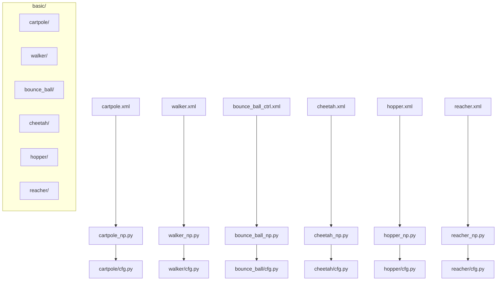
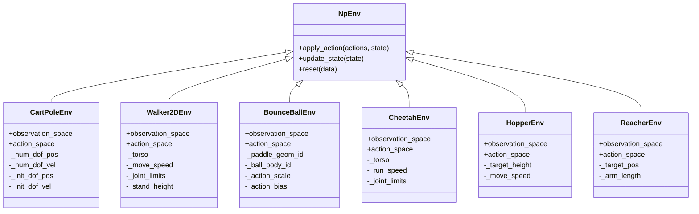
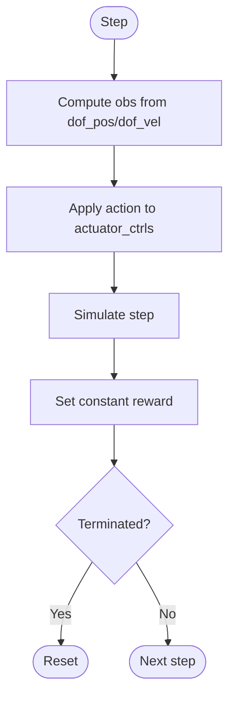
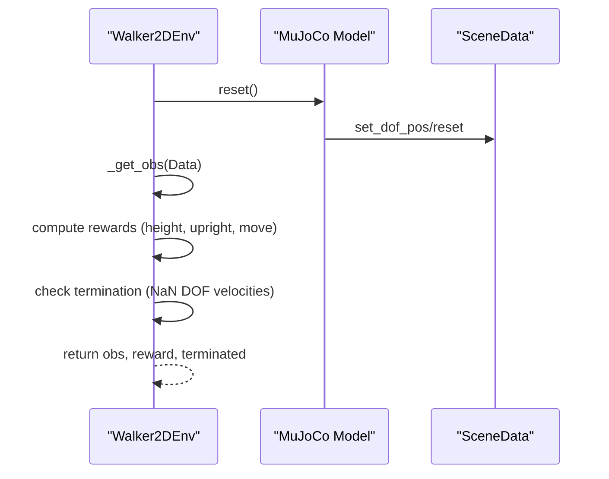
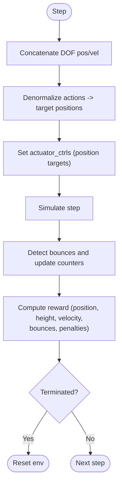
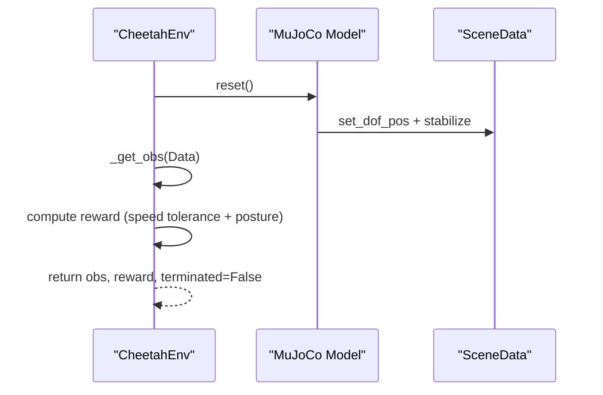
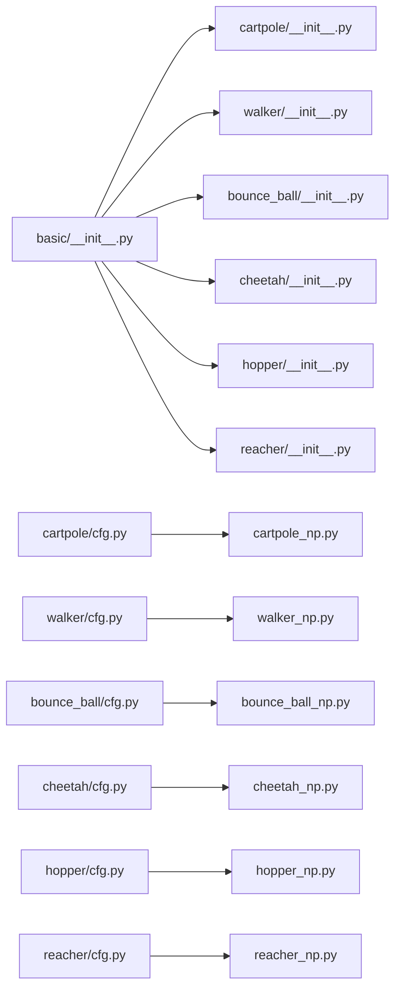

# Basic Control Environments

<cite>
**Referenced Files in This Document**
- [basic/__init__.py](file://motrix_envs/src/motrix_envs/basic/__init__.py)
- [cartpole/__init__.py](file://motrix_envs/src/motrix_envs/basic/cartpole/__init__.py)
- [cartpole/cfg.py](file://motrix_envs/src/motrix_envs/basic/cartpole/cfg.py)
- [cartpole/cartpole_np.py](file://motrix_envs/src/motrix_envs/basic/cartpole/cartpole_np.py)
- [cartpole/cartpole.xml](file://motrix_envs/src/motrix_envs/basic/cartpole/cartpole.xml)
- [walker/__init__.py](file://motrix_envs/src/motrix_envs/basic/walker/__init__.py)
- [walker/cfg.py](file://motrix_envs/src/motrix_envs/basic/walker/cfg.py)
- [walker/walker_np.py](file://motrix_envs/src/motrix_envs/basic/walker/walker_np.py)
- [walker/walker.xml](file://motrix_envs/src/motrix_envs/basic/walker/walker.xml)
- [bounce_ball/__init__.py](file://motrix_envs/src/motrix_envs/basic/bounce_ball/__init__.py)
- [bounce_ball/cfg.py](file://motrix_envs/src/motrix_envs/basic/bounce_ball/cfg.py)
- [bounce_ball/bounce_ball_np.py](file://motrix_envs/src/motrix_envs/basic/bounce_ball/bounce_ball_np.py)
- [bounce_ball/bounce_ball_ctrl.xml](file://motrix_envs/src/motrix_envs/basic/bounce_ball/bounce_ball_ctrl.xml)
- [cheetah/__init__.py](file://motrix_envs/src/motrix_envs/basic/cheetah/__init__.py)
- [cheetah/cfg.py](file://motrix_envs/src/motrix_envs/basic/cheetah/cfg.py)
- [cheetah/cheetah_np.py](file://motrix_envs/src/motrix_envs/basic/cheetah/cheetah_np.py)
- [cheetah/cheetah.xml](file://motrix_envs/src/motrix_envs/basic/cheetah/cheetah.xml)
- [hopper/__init__.py](file://motrix_envs/src/motrix_envs/basic/hopper/__init__.py)
- [hopper/cfg.py](file://motrix_envs/src/motrix_envs/basic/hopper/cfg.py)
- [hopper/hopper_np.py](file://motrix_envs/src/motrix_envs/basic/hopper/hopper_np.py)
- [hopper/hopper.xml](file://motrix_envs/src/motrix_envs/basic/hopper/hopper.xml)
- [reacher/__init__.py](file://motrix_envs/src/motrix_envs/basic/reacher/__init__.py)
- [reacher/cfg.py](file://motrix_envs/src/motrix_envs/basic/reacher/cfg.py)
- [reacher/reacher_np.py](file://motrix_envs/src/motrix_envs/basic/reacher/reacher_np.py)
- [reacher/reacher.xml](file://motrix_envs/src/motrix_envs/basic/reacher/reacher.xml)
</cite>

## Table of Contents
1. [Introduction](#introduction)
2. [Project Structure](#project-structure)
3. [Core Components](#core-components)
4. [Architecture Overview](#architecture-overview)
5. [Detailed Component Analysis](#detailed-component-analysis)
6. [Dependency Analysis](#dependency-analysis)
7. [Performance Considerations](#performance-considerations)
8. [Troubleshooting Guide](#troubleshooting-guide)
9. [Conclusion](#conclusion)

## Introduction
This document describes the basic control environments included in the repository: CartPole, Walker, Bounce Ball, Cheetah, Hopper, and Reacher. Each environment provides a minimal yet instructive control task for reinforcement learning research, with explicit physics models, state/action representations, reward designs, and termination conditions. The environments are implemented using a NumPy-based simulation interface and MuJoCo XML scenes, enabling fast training loops and reproducible baselines.

These environments serve as stepping stones for developing control strategies:
- CartPole: classic balancing task with a single actuator and two DOFs.
- Walker: planar bipedal locomotion with articulated legs and a torso.
- Bounce Ball: a manipulation-style task where an arm-like mechanism keeps a ball aloft at a target height.
- Cheetah: a planar galloping quadruped with articulated legs and a torso.
- Hopper: a planar hopping biped with two articulated legs.
- Reacher: a 2D reacher arm with multiple joints and an end-effector target.

## Project Structure
The basic environments live under the basic package and are registered via the environment registry. Each environment module exposes:
- An XML scene definition for the physics model.
- A NumPy-based environment implementation that defines state transitions, actions, rewards, and resets.
- A configuration class that encapsulates environment-specific parameters (time steps, control periods, target speeds, etc.).

**Diagram sources**
- [basic/__init__.py](file://motrix_envs/src/motrix_envs/basic/__init__.py#L16-L17)
- [cartpole/cartpole_np.py](file://motrix_envs/src/motrix_envs/basic/cartpole/cartpole_np.py#L26-L31)
- [walker/walker_np.py](file://motrix_envs/src/motrix_envs/basic/walker/walker_np.py#L26-L31)
- [bounce_ball/bounce_ball_np.py](file://motrix_envs/src/motrix_envs/basic/bounce_ball/bounce_ball_np.py#L26-L31)
- [cheetah/cheetah_np.py](file://motrix_envs/src/motrix_envs/basic/cheetah/cheetah_np.py#L27-L32)
- [hopper/hopper_np.py](file://motrix_envs/src/motrix_envs/basic/hopper/hopper_np.py#L1-L200)
- [reacher/reacher_np.py](file://motrix_envs/src/motrix_envs/basic/reacher/reacher_np.py#L1-L200)

**Section sources**
- [basic/__init__.py](file://motrix_envs/src/motrix_envs/basic/__init__.py#L16-L17)

## Core Components
Each environment follows a consistent pattern:
- Environment registration via decorators that bind a human-readable name to the NumPy implementation.
- A configuration class that sets model file paths, simulation and control timesteps, episode duration, and task-specific parameters.
- A NumPy environment class that:
  - Defines action and observation spaces.
  - Applies actions to the simulation.
  - Computes observations from scene data.
  - Computes rewards and termination flags.
  - Resets the simulation to initial conditions.

Key shared elements:
- Simulation timestep and control period are configured per environment.
- Observations are derived from degrees-of-freedom positions and velocities.
- Actions are applied as actuator controls or position targets depending on the environment.
- Rewards emphasize task-relevant behaviors (balance, upright posture, forward speed, reaching).

**Section sources**
- [cartpole/cfg.py](file://motrix_envs/src/motrix_envs/basic/cartpole/cfg.py#L25-L32)
- [cartpole/cartpole_np.py](file://motrix_envs/src/motrix_envs/basic/cartpole/cartpole_np.py#L26-L49)
- [walker/cfg.py](file://motrix_envs/src/motrix_envs/basic/walker/cfg.py#L25-L46)
- [walker/walker_np.py](file://motrix_envs/src/motrix_envs/basic/walker/walker_np.py#L26-L67)
- [bounce_ball/cfg.py](file://motrix_envs/src/motrix_envs/basic/bounce_ball/cfg.py#L25-L65)
- [bounce_ball/bounce_ball_np.py](file://motrix_envs/src/motrix_envs/basic/bounce_ball/bounce_ball_np.py#L26-L69)
- [cheetah/cfg.py](file://motrix_envs/src/motrix_envs/basic/cheetah/cfg.py#L25-L34)
- [cheetah/cheetah_np.py](file://motrix_envs/src/motrix_envs/basic/cheetah/cheetah_np.py#L27-L59)

## Architecture Overview
The environments share a common architecture:
- Registry decorators register environment names and backends.
- Configuration classes define environment parameters and model file paths.
- NumPy environments inherit a base class that manages simulation data and lifecycle.
- XML scenes define bodies, joints, actuators, sensors, and assets.

**Diagram sources**
- [cartpole/cartpole_np.py](file://motrix_envs/src/motrix_envs/basic/cartpole/cartpole_np.py#L26-L49)
- [walker/walker_np.py](file://motrix_envs/src/motrix_envs/basic/walker/walker_np.py#L26-L67)
- [bounce_ball/bounce_ball_np.py](file://motrix_envs/src/motrix_envs/basic/bounce_ball/bounce_ball_np.py#L26-L69)
- [cheetah/cheetah_np.py](file://motrix_envs/src/motrix_envs/basic/cheetah/cheetah_np.py#L27-L59)
- [hopper/hopper_np.py](file://motrix_envs/src/motrix_envs/basic/hopper/hopper_np.py#L1-L200)
- [reacher/reacher_np.py](file://motrix_envs/src/motrix_envs/basic/reacher/reacher_np.py#L1-L200)

## Detailed Component Analysis

### CartPole
- Physics model: A cart can slide along a rail; a pole is pinned to the cart’s top. Gravity pulls the pole down, and the actuator applies force to the cart.
- State representation: Concatenation of joint positions and velocities for the cart slider and pole hinge.
- Action space: Continuous force applied to the cart.
- Reward: Positive constant reward per step; no shaping by default in the implementation.
- Termination: Episode ends if the pole angle exceeds a threshold, or the cart leaves the rails.
- Configuration parameters: Model file path, reset noise scale, maximum episode duration, rendering spacing.
- XML scene: Defines rail, cart, pole, floor, and motor actuator with torque limits.

Implementation highlights:
- Observation concatenates DOF positions and velocities.
- Action is directly mapped to actuator controls.
- Termination checks for NaN values, angle thresholds, and cart position bounds.

**Section sources**
- [cartpole/cfg.py](file://motrix_envs/src/motrix_envs/basic/cartpole/cfg.py#L25-L32)
- [cartpole/cartpole_np.py](file://motrix_envs/src/motrix_envs/basic/cartpole/cartpole_np.py#L26-L75)
- [cartpole/cartpole.xml](file://motrix_envs/src/motrix_envs/basic/cartpole/cartpole.xml#L1-L38)

**Diagram sources**
- [cartpole/cartpole_np.py](file://motrix_envs/src/motrix_envs/basic/cartpole/cartpole_np.py#L50-L75)

### Walker
- Physics model: Planar biped with a torso and two legs (hip, knee, ankle per side). Sensors measure linear velocity of the torso subtree.
- State representation: Orientation features for each link (excluding root), torso height, and full DOF velocities.
- Action space: Continuous actuator torques for hip, knee, and ankle joints on both sides.
- Reward: Combination of standing height and upright orientation; optional movement reward when a nonzero target speed is configured.
- Termination: Episode ends if DOF velocities contain NaN values.
- Configuration parameters: Model file path, maximum episode duration, simulation/control timesteps, target speed, and stand height.
- XML scene: Includes default classes for links, motors with gear ratios, and a subtree linear velocity sensor.

Implementation highlights:
- Observation construction uses rotation matrices and selected orientation components.
- Reward composition uses tolerance functions for height and velocity.
- Reset initializes joint angles with randomization around nominal poses.

**Section sources**
- [walker/cfg.py](file://motrix_envs/src/motrix_envs/basic/walker/cfg.py#L25-L46)
- [walker/walker_np.py](file://motrix_envs/src/motrix_envs/basic/walker/walker_np.py#L26-L131)
- [walker/walker.xml](file://motrix_envs/src/motrix_envs/basic/walker/walker.xml#L1-L80)

**Diagram sources**
- [walker/walker_np.py](file://motrix_envs/src/motrix_envs/basic/walker/walker_np.py#L81-L131)

### Bounce Ball
- Physics model: An arm-like serial chain ending in a paddle geometry; a free-floating ball interacts with the paddle via contact dynamics.
- State representation: Concatenation of DOF positions (13) and velocities (12), implicitly encoding ball state.
- Action space: Six-dimensional normalized control representing desired joint position changes; denormalized using configurable scales and biases.
- Reward: Composite reward emphasizing horizontal centering of the ball, upward velocity when positioned correctly, height accuracy, consecutive bounces, and penalties for excessive/dangerous velocities and out-of-bounds positions.
- Termination: Episode ends if the ball falls below a lower bound, exceeds an upper bound, or strays too far horizontally.
- Configuration parameters: Model file path, reset noise scale, maximum episode duration, restitution and damping coefficients for ball/paddle, initial conditions, target height and tolerance, action scaling/bias.
- XML scene: Meshes for the arm links, a blocker paddle geometry, and a freejoint ball body.

Implementation highlights:
- Action denormalization maps [-1,1]^6 actions to absolute joint position changes.
- Reward computation uses Gaussian-shaped terms and piecewise penalties.
- Episode termination conditions enforce spatial and velocity constraints.
- Reset initializes arm joints with noise and sets ball position/quaternion.

**Section sources**
- [bounce_ball/cfg.py](file://motrix_envs/src/motrix_envs/basic/bounce_ball/cfg.py#L25-L65)
- [bounce_ball/bounce_ball_np.py](file://motrix_envs/src/motrix_envs/basic/bounce_ball/bounce_ball_np.py#L26-L309)
- [bounce_ball/bounce_ball_ctrl.xml](file://motrix_envs/src/motrix_envs/basic/bounce_ball/bounce_ball_ctrl.xml#L1-L84)

**Diagram sources**
- [bounce_ball/bounce_ball_np.py](file://motrix_envs/src/motrix_envs/basic/bounce_ball/bounce_ball_np.py#L182-L248)

### Cheetah
- Physics model: A planar quadruped with articulated legs and a torso; sensors capture torso subtree linear velocity.
- State representation: Joint positions excluding root x (to avoid trivial translation) concatenated with velocities.
- Action space: Continuous actuator commands scaled to [-1,1].
- Reward: Combination of forward speed tolerance and posture penalty based on torso height.
- Termination: Not used in this implementation; placeholder array of False values.
- Configuration parameters: Model file path, maximum episode duration, simulation/control timesteps, and target run speed.
- XML scene: Defaults for joint damping and actuator torque limits; sensors for subtree linear velocity.

Implementation highlights:
- Observation excludes the first position dimension (x translation) to encourage forward motion.
- Reward balances speed and stability via a quadratic posture penalty.
- Reset samples joint positions within limits and performs a short simulation stabilization loop.

**Section sources**
- [cheetah/cfg.py](file://motrix_envs/src/motrix_envs/basic/cheetah/cfg.py#L25-L34)
- [cheetah/cheetah_np.py](file://motrix_envs/src/motrix_envs/basic/cheetah/cheetah_np.py#L27-L121)
- [cheetah/cheetah.xml](file://motrix_envs/src/motrix_envs/basic/cheetah/cheetah.xml#L1-L200)

**Diagram sources**
- [cheetah/cheetah_np.py](file://motrix_envs/src/motrix_envs/basic/cheetah/cheetah_np.py#L72-L101)

### Hopper
- Physics model: A planar biped with two articulated legs and a torso; designed for hopping motions.
- State representation: DOF positions (excluding root x) and velocities.
- Action space: Continuous actuator commands.
- Reward: Balances forward speed and stability; posture and speed tolerances guide locomotion.
- Termination: Episode ends when the agent falls or fails to maintain stability.
- Configuration parameters: Model file path, maximum episode duration, simulation/control timesteps, target height, and movement speed.
- XML scene: Includes default joint damping, actuator torque limits, and sensors for subtree linear velocity.

Implementation highlights:
- Observation excludes the first position dimension (x translation).
- Reward combines speed tolerance and posture penalty.
- Reset initializes joint positions within limits and stabilizes the model.

**Section sources**
- [hopper/cfg.py](file://motrix_envs/src/motrix_envs/basic/hopper/cfg.py#L1-L200)
- [hopper/hopper_np.py](file://motrix_envs/src/motrix_envs/basic/hopper/hopper_np.py#L1-L200)
- [hopper/hopper.xml](file://motrix_envs/src/motrix_envs/basic/hopper/hopper.xml#L1-L200)

### Reacher
- Physics model: A 2D reacher arm with multiple joints and an end-effector target.
- State representation: DOF positions and velocities.
- Action space: Continuous actuator commands.
- Reward: Encourages reaching the target with distance-based shaping; posture and speed penalties may be present.
- Termination: Episode ends when the arm reaches the target or exceeds a maximum episode duration.
- Configuration parameters: Model file path, maximum episode duration, simulation/control timesteps, target position, and arm length.
- XML scene: Includes default joint damping, actuator torque limits, and target geometry.

Implementation highlights:
- Observation concatenates DOF positions and velocities.
- Reward emphasizes proximity to the target while penalizing excessive effort.
- Reset initializes joint positions and sets the target.

**Section sources**
- [reacher/cfg.py](file://motrix_envs/src/motrix_envs/basic/reacher/cfg.py#L1-L200)
- [reacher/reacher_np.py](file://motrix_envs/src/motrix_envs/basic/reacher/reacher_np.py#L1-L200)
- [reacher/reacher.xml](file://motrix_envs/src/motrix_envs/basic/reacher/reacher.xml#L1-L200)

## Dependency Analysis
Environment registration and inter-module dependencies:
- The basic package initializer imports submodules to register environments.
- Each environment module registers its NumPy implementation under a specific name.
- Configuration classes depend on the base environment configuration and registry decorators.
- NumPy environments depend on the simulation model, registry, and environment base class.

**Diagram sources**
- [basic/__init__.py](file://motrix_envs/src/motrix_envs/basic/__init__.py#L16-L17)
- [cartpole/__init__.py](file://motrix_envs/src/motrix_envs/basic/cartpole/__init__.py#L16-L17)
- [walker/__init__.py](file://motrix_envs/src/motrix_envs/basic/walker/__init__.py#L16-L17)
- [bounce_ball/__init__.py](file://motrix_envs/src/motrix_envs/basic/bounce_ball/__init__.py#L16-L18)
- [cheetah/__init__.py](file://motrix_envs/src/motrix_envs/basic/cheetah/__init__.py#L16-L17)
- [hopper/__init__.py](file://motrix_envs/src/motrix_envs/basic/hopper/__init__.py#L16-L17)
- [reacher/__init__.py](file://motrix_envs/src/motrix_envs/basic/reacher/__init__.py#L16-L17)

**Section sources**
- [basic/__init__.py](file://motrix_envs/src/motrix_envs/basic/__init__.py#L16-L17)

## Performance Considerations
- Simulation and control timesteps: Tuning sim_dt and ctrl_dt affects numerical stability and training throughput. Smaller sim_dt increases fidelity but costs compute; larger ctrl_dt reduces communication overhead.
- Episode length: Longer episodes enable learning complex skills but increase sample inefficiency. Configure max_episode_seconds per environment to match task difficulty.
- Action scaling: Properly scaling actions to actuator limits prevents unrealistic forces and improves convergence.
- Observation preprocessing: Normalizing observations can accelerate learning; consider adding normalization layers in downstream RL stacks.
- Reward shaping: Use smooth, sparse rewards for stable learning. Avoid overly harsh penalties that cause premature termination.
- Vectorization: Running multiple environments in parallel amplifies throughput; ensure batched operations are used consistently.

[No sources needed since this section provides general guidance]

## Troubleshooting Guide
Common issues and resolutions:
- NaN velocities or unstable dynamics:
  - Verify joint limits and initial conditions.
  - Reduce action magnitudes or increase damping.
  - Check for collisions or invalid geometry configurations.
- Poor reward signal:
  - Adjust reward shaping weights and tolerances.
  - Ensure sensors (e.g., subtree linear velocity) are present and accurate.
- Excessive simulation cost:
  - Increase ctrl_dt or reduce sim_dt judiciously.
  - Use fewer environments in parallel if memory-bound.
- Reset inconsistencies:
  - Confirm that reset noise scales are appropriate for the task.
  - Ensure DOF initialization matches the model’s kinematic structure.

**Section sources**
- [walker/walker_np.py](file://motrix_envs/src/motrix_envs/basic/walker/walker_np.py#L94-L131)
- [bounce_ball/bounce_ball_np.py](file://motrix_envs/src/motrix_envs/basic/bounce_ball/bounce_ball_np.py#L165-L180)
- [cartpole/cartpole_np.py](file://motrix_envs/src/motrix_envs/basic/cartpole/cartpole_np.py#L65-L71)

## Conclusion
The basic control environments provide a cohesive set of tasks spanning rigid-body mechanics, balance control, locomotion, and manipulation. Their modular design—XML scenes, NumPy environments, and configuration-driven parameters—enables rapid experimentation and reproducibility. These baselines are ideal for validating RL algorithms, debugging reward functions, and benchmarking control strategies before advancing to more complex robotic scenarios.

[No sources needed since this section summarizes without analyzing specific files]