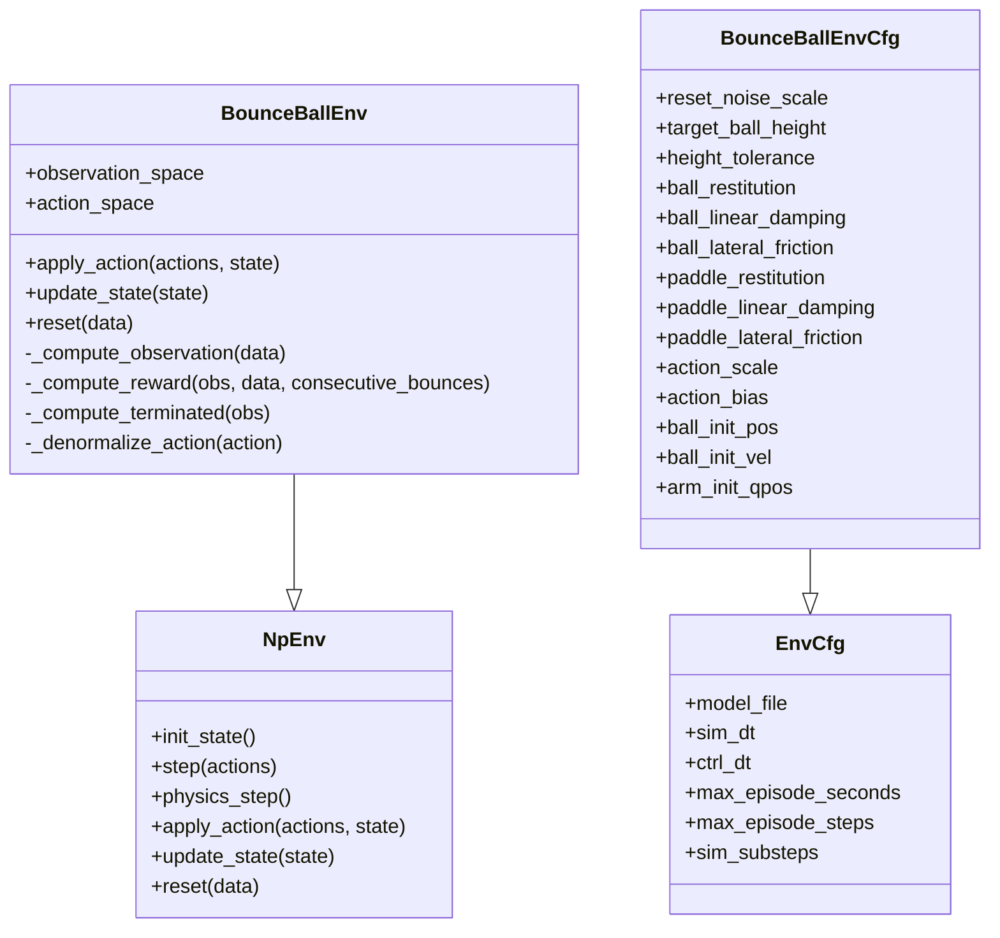

# Bounce Ball Environment

<cite>
**Referenced Files in This Document**
- [bounce_ball_np.py](file://motrix_envs/src/motrix_envs/basic/bounce_ball/bounce_ball_np.py)
- [cfg.py](file://motrix_envs/src/motrix_envs/basic/bounce_ball/cfg.py)
- [bounce_ball_ctrl.xml](file://motrix_envs/src/motrix_envs/basic/bounce_ball/bounce_ball_ctrl.xml)
- [__init__.py](file://motrix_envs/src/motrix_envs/basic/bounce_ball/__init__.py)
- [env.py](file://motrix_envs/src/motrix_envs/np/env.py)
- [base.py](file://motrix_envs/src/motrix_envs/base.py)
- [reward.py](file://motrix_envs/src/motrix_envs/np/reward.py)
- [bounce_ball.md](file://docs/source/en/user_guide/demo/bounce_ball.md)
- [train.py](file://scripts/train.py)
- [ppo.py](file://motrix_rl/src/motrix_rl/skrl/jax/train/ppo.py)
- [cfg.py](file://motrix_rl/src/motrix_rl/skrl/cfg.py)
</cite>

## Table of Contents
1. [Introduction](#introduction)
2. [Project Structure](#project-structure)
3. [Core Components](#core-components)
4. [Architecture Overview](#architecture-overview)
5. [Detailed Component Analysis](#detailed-component-analysis)
6. [Dependency Analysis](#dependency-analysis)
7. [Performance Considerations](#performance-considerations)
8. [Troubleshooting Guide](#troubleshooting-guide)
9. [Conclusion](#conclusion)
10. [Appendices](#appendices)

## Introduction
The Bounce Ball environment is a physics-based manipulation task designed to train a single-arm robotic manipulator to control a paddle and keep a ping pong ball bouncing continuously at a target height and horizontal position. The environment integrates a MuJoCo-based physics simulation with a NumPy-backed environment wrapper, providing a Gymnasium-compatible interface for reinforcement learning. It emphasizes precise position control along with height and velocity regulation, with a reward function that encourages sustained bouncing and penalizes out-of-bounds behavior.

## Project Structure
The Bounce Ball environment is organized within the basic environments package and integrates with the broader MotrixLab ecosystem. Key elements include:
- Environment definition and configuration
- XML control configuration for the robot and ball
- NumPy simulation implementation
- Documentation and usage examples
- Training pipeline and RL configuration

**Diagram sources**
- [__init__.py](file://motrix_envs/src/motrix_envs/basic/bounce_ball/__init__.py#L16-L18)
- [cfg.py](file://motrix_envs/src/motrix_envs/basic/bounce_ball/cfg.py#L25-L65)
- [bounce_ball_ctrl.xml](file://motrix_envs/src/motrix_envs/basic/bounce_ball/bounce_ball_ctrl.xml#L1-L84)
- [bounce_ball_np.py](file://motrix_envs/src/motrix_envs/basic/bounce_ball/bounce_ball_np.py#L26-L309)
- [env.py](file://motrix_envs/src/motrix_envs/np/env.py#L52-L209)
- [base.py](file://motrix_envs/src/motrix_envs/base.py#L23-L85)
- [reward.py](file://motrix_envs/src/motrix_envs/np/reward.py#L21-L84)
- [bounce_ball.md](file://docs/source/en/user_guide/demo/bounce_ball.md#L1-L131)
- [train.py](file://scripts/train.py#L52-L95)
- [ppo.py](file://motrix_rl/src/motrix_rl/skrl/jax/train/ppo.py#L145-L301)
- [cfg.py](file://motrix_rl/src/motrix_rl/skrl/cfg.py#L28-L74)

**Section sources**
- [__init__.py](file://motrix_envs/src/motrix_envs/basic/bounce_ball/__init__.py#L16-L18)
- [cfg.py](file://motrix_envs/src/motrix_envs/basic/bounce_ball/cfg.py#L25-L65)
- [bounce_ball_ctrl.xml](file://motrix_envs/src/motrix_envs/basic/bounce_ball/bounce_ball_ctrl.xml#L1-L84)
- [bounce_ball_np.py](file://motrix_envs/src/motrix_envs/basic/bounce_ball/bounce_ball_np.py#L26-L309)
- [env.py](file://motrix_envs/src/motrix_envs/np/env.py#L52-L209)
- [base.py](file://motrix_envs/src/motrix_envs/base.py#L23-L85)
- [reward.py](file://motrix_envs/src/motrix_envs/np/reward.py#L21-L84)
- [bounce_ball.md](file://docs/source/en/user_guide/demo/bounce_ball.md#L1-L131)
- [train.py](file://scripts/train.py#L52-L95)
- [ppo.py](file://motrix_rl/src/motrix_rl/skrl/jax/train/ppo.py#L145-L301)
- [cfg.py](file://motrix_rl/src/motrix_rl/skrl/cfg.py#L28-L74)

## Core Components
- Environment class: Implements the Bounce Ball environment using NumPy-based simulation and Gymnasium spaces.
- Configuration: Defines environment parameters, physics constants, and initial conditions.
- XML control: Specifies the robot model, actuator configuration, and ball geometry.
- Reward function: Encourages horizontal position control, height accuracy, upward velocity regulation, and consecutive bounces.
- Training pipeline: Provides scripts and RL configuration for training with PPO.

Key implementation references:
- Environment class and methods: [bounce_ball_np.py](file://motrix_envs/src/motrix_envs/basic/bounce_ball/bounce_ball_np.py#L26-L309)
- Configuration defaults and parameters: [cfg.py](file://motrix_envs/src/motrix_envs/basic/bounce_ball/cfg.py#L25-L65)
- XML model and actuator definitions: [bounce_ball_ctrl.xml](file://motrix_envs/src/motrix_envs/basic/bounce_ball/bounce_ball_ctrl.xml#L1-L84)
- NumPy environment base: [env.py](file://motrix_envs/src/motrix_envs/np/env.py#L52-L209)
- Base environment configuration: [base.py](file://motrix_envs/src/motrix_envs/base.py#L23-L85)
- Reward building blocks: [reward.py](file://motrix_envs/src/motrix_envs/np/reward.py#L21-L84)
- Usage and expected results: [bounce_ball.md](file://docs/source/en/user_guide/demo/bounce_ball.md#L1-L131)
- Training entry point: [train.py](file://scripts/train.py#L52-L95)
- PPO training implementation: [ppo.py](file://motrix_rl/src/motrix_rl/skrl/jax/train/ppo.py#L145-L301)
- RL configuration: [cfg.py](file://motrix_rl/src/motrix_rl/skrl/cfg.py#L28-L74)

**Section sources**
- [bounce_ball_np.py](file://motrix_envs/src/motrix_envs/basic/bounce_ball/bounce_ball_np.py#L26-L309)
- [cfg.py](file://motrix_envs/src/motrix_envs/basic/bounce_ball/cfg.py#L25-L65)
- [bounce_ball_ctrl.xml](file://motrix_envs/src/motrix_envs/basic/bounce_ball/bounce_ball_ctrl.xml#L1-L84)
- [env.py](file://motrix_envs/src/motrix_envs/np/env.py#L52-L209)
- [base.py](file://motrix_envs/src/motrix_envs/base.py#L23-L85)
- [reward.py](file://motrix_envs/src/motrix_envs/np/reward.py#L21-L84)
- [bounce_ball.md](file://docs/source/en/user_guide/demo/bounce_ball.md#L1-L131)
- [train.py](file://scripts/train.py#L52-L95)
- [ppo.py](file://motrix_rl/src/motrix_rl/skrl/jax/train/ppo.py#L145-L301)
- [cfg.py](file://motrix_rl/src/motrix_rl/skrl/cfg.py#L28-L74)

## Architecture Overview
The environment architecture combines a MuJoCo XML model with a NumPy simulation wrapper and Gymnasium-compatible interface. The training pipeline integrates with SKRL’s PPO implementation for scalable reinforcement learning.

**Diagram sources**
- [train.py](file://scripts/train.py#L52-L95)
- [ppo.py](file://motrix_rl/src/motrix_rl/skrl/jax/train/ppo.py#L145-L301)
- [bounce_ball_np.py](file://motrix_envs/src/motrix_envs/basic/bounce_ball/bounce_ball_np.py#L26-L309)
- [env.py](file://motrix_envs/src/motrix_envs/np/env.py#L52-L209)
- [cfg.py](file://motrix_envs/src/motrix_envs/basic/bounce_ball/cfg.py#L25-L65)
- [bounce_ball_ctrl.xml](file://motrix_envs/src/motrix_envs/basic/bounce_ball/bounce_ball_ctrl.xml#L1-L84)

## Detailed Component Analysis

### Physics Model and Simulation
- MuJoCo XML defines:
  - Gravity and timestep configuration
  - Ground plane and visual materials
  - Default stiffness and damping parameters
  - Robot structure with 6 revolute joints and a free-floating ball link
  - Actuator list for position control of the joints
- The NumPy environment loads the model and advances physics using a configurable number of simulation substeps per control step.

Implementation highlights:
- XML compiler and option settings: [bounce_ball_ctrl.xml](file://motrix_envs/src/motrix_envs/basic/bounce_ball/bounce_ball_ctrl.xml#L2-L3)
- Default stiffness/damping and contact parameters: [bounce_ball_ctrl.xml](file://motrix_envs/src/motrix_envs/basic/bounce_ball/bounce_ball_ctrl.xml#L21-L28)
- Ball link with freejoint and geometric properties: [bounce_ball_ctrl.xml](file://motrix_envs/src/motrix_envs/basic/bounce_ball/bounce_ball_ctrl.xml#L68-L72)
- Actuator definitions for joint position control: [bounce_ball_ctrl.xml](file://motrix_envs/src/motrix_envs/basic/bounce_ball/bounce_ball_ctrl.xml#L75-L82)
- NumPy environment loading and stepping: [env.py](file://motrix_envs/src/motrix_envs/np/env.py#L58-L189)

Physics parameters in configuration:
- Ball restitution, linear damping, lateral friction
- Paddle restitution, linear damping, lateral friction
- Reset noise scale and episode duration limits

References:
- Physics parameters in configuration: [cfg.py](file://motrix_envs/src/motrix_envs/basic/bounce_ball/cfg.py#L32-L38)
- Episode duration and timestep configuration: [cfg.py](file://motrix_envs/src/motrix_envs/basic/bounce_ball/cfg.py#L29-L30)

**Section sources**
- [bounce_ball_ctrl.xml](file://motrix_envs/src/motrix_envs/basic/bounce_ball/bounce_ball_ctrl.xml#L1-L84)
- [env.py](file://motrix_envs/src/motrix_envs/np/env.py#L58-L189)
- [cfg.py](file://motrix_envs/src/motrix_envs/basic/bounce_ball/cfg.py#L29-L38)

### State Representation
- Observation space: 25-dimensional vector combining:
  - 13 DOF positions (6 arm joints + 7 for the ball’s freejoint)
  - 12 DOF velocities (including ball’s spatial velocity)
- Ball state is implicit in DOF positions and velocities:
  - Ball x, y, z positions are indices 6, 7, 8
  - Ball orientation quaternion is indices 9–12
  - Ball linear and angular velocities are indices 13–24

Observation computation:
- Concatenation of DOF positions and velocities: [bounce_ball_np.py](file://motrix_envs/src/motrix_envs/basic/bounce_ball/bounce_ball_np.py#L75-L83)

Termination conditions:
- Ball z below threshold or above target height plus margin
- Horizontal deviation beyond allowed range

Termination logic:
- [bounce_ball_np.py](file://motrix_envs/src/motrix_envs/basic/bounce_ball/bounce_ball_np.py#L165-L180)

**Section sources**
- [bounce_ball_np.py](file://motrix_envs/src/motrix_envs/basic/bounce_ball/bounce_ball_np.py#L75-L83)
- [bounce_ball_np.py](file://motrix_envs/src/motrix_envs/basic/bounce_ball/bounce_ball_np.py#L165-L180)

### Action Space and Control
- Action space: Box(-1.0, 1.0, (6,)) representing normalized joint position changes for 6 DOFs
- Denormalization scales and biases convert normalized actions to physical position changes
- Actions are applied as target positions for position-controlled actuators

Action application:
- Denormalization and target position computation: [bounce_ball_np.py](file://motrix_envs/src/motrix_envs/basic/bounce_ball/bounce_ball_np.py#L71-L73)
- Applying targets to actuators: [bounce_ball_np.py](file://motrix_envs/src/motrix_envs/basic/bounce_ball/bounce_ball_np.py#L182-L195)

XML actuator mapping:
- Position actuators for each joint: [bounce_ball_ctrl.xml](file://motrix_envs/src/motrix_envs/basic/bounce_ball/bounce_ball_ctrl.xml#L75-L82)

**Section sources**
- [bounce_ball_np.py](file://motrix_envs/src/motrix_envs/basic/bounce_ball/bounce_ball_np.py#L71-L73)
- [bounce_ball_np.py](file://motrix_envs/src/motrix_envs/basic/bounce_ball/bounce_ball_np.py#L182-L195)
- [bounce_ball_ctrl.xml](file://motrix_envs/src/motrix_envs/basic/bounce_ball/bounce_ball_ctrl.xml#L75-L82)

### Reward Function
The reward function balances multiple objectives:
- Horizontal position control around the paddle center
- Height accuracy near the target
- Controlled upward velocity when well-positioned
- Penalties for excessive upward/downward velocities and out-of-position states
- Consecutive bounce reward and bonus for high bounce counts

Reward components:
- Position control reward: [bounce_ball_np.py](file://motrix_envs/src/motrix_envs/basic/bounce_ball/bounce_ball_np.py#L100-L107)
- Height accuracy reward: [bounce_ball_np.py](file://motrix_envs/src/motrix_envs/basic/bounce_ball/bounce_ball_np.py#L105-L107)
- Controlled upward velocity reward: [bounce_ball_np.py](file://motrix_envs/src/motrix_envs/basic/bounce_ball/bounce_ball_np.py#L109-L116)
- Penalty for being out of position: [bounce_ball_np.py](file://motrix_envs/src/motrix_envs/basic/bounce_ball/bounce_ball_np.py#L118-L123)
- Velocity penalties: [bounce_ball_np.py](file://motrix_envs/src/motrix_envs/basic/bounce_ball/bounce_ball_np.py#L125-L128)
- Position-based penalties: [bounce_ball_np.py](file://motrix_envs/src/motrix_envs/basic/bounce_ball/bounce_ball_np.py#L130-L132)
- Consecutive bounces reward: [bounce_ball_np.py](file://motrix_envs/src/motrix_envs/basic/bounce_ball/bounce_ball_np.py#L134-L140)
- High bounce bonus: [bounce_ball_np.py](file://motrix_envs/src/motrix_envs/basic/bounce_ball/bounce_ball_np.py#L142-L147)
- Combined reward computation: [bounce_ball_np.py](file://motrix_envs/src/motrix_envs/basic/bounce_ball/bounce_ball_np.py#L149-L163)

Reward building blocks:
- Tolerance-based sigmoid shaping: [reward.py](file://motrix_envs/src/motrix_envs/np/reward.py#L63-L84)

**Section sources**
- [bounce_ball_np.py](file://motrix_envs/src/motrix_envs/basic/bounce_ball/bounce_ball_np.py#L100-L163)
- [reward.py](file://motrix_envs/src/motrix_envs/np/reward.py#L63-L84)

### Environment Reset and Initialization
- Resets arm joint positions with noise and sets ball position and orientation
- Initializes DOF positions and velocities, then applies them to the simulation
- Tracks consecutive bounces and maximum achieved

Reset logic:
- Noise injection and DOF updates: [bounce_ball_np.py](file://motrix_envs/src/motrix_envs/basic/bounce_ball/bounce_ball_np.py#L250-L296)
- Info initialization: [bounce_ball_np.py](file://motrix_envs/src/motrix_envs/basic/bounce_ball/bounce_ball_np.py#L297-L302)

**Section sources**
- [bounce_ball_np.py](file://motrix_envs/src/motrix_envs/basic/bounce_ball/bounce_ball_np.py#L250-L302)

### Bounce Detection and Tracking
- Detects bounces when the ball transitions from downward to upward motion near the paddle height
- Resets consecutive bounce count when the ball falls too much
- Tracks maximum consecutive bounces

Bounce detection:
- Near-paddle and upward criteria: [bounce_ball_np.py](file://motrix_envs/src/motrix_envs/basic/bounce_ball/bounce_ball_np.py#L212-L217)
- Count updates and resets: [bounce_ball_np.py](file://motrix_envs/src/motrix_envs/basic/bounce_ball/bounce_ball_np.py#L219-L224)
- Maximum tracking: [bounce_ball_np.py](file://motrix_envs/src/motrix_envs/basic/bounce_ball/bounce_ball_np.py#L230-L235)

**Section sources**
- [bounce_ball_np.py](file://motrix_envs/src/motrix_envs/basic/bounce_ball/bounce_ball_np.py#L212-L235)

### Training Pipeline and Configuration
- Training script selects backend and initializes the PPO trainer
- RL configuration defines PPO hyperparameters and preprocessing
- JAX-based PPO trainer wraps the environment and logs metrics

Training entry point:
- [train.py](file://scripts/train.py#L52-L95)

PPO training implementation:
- Environment wrapping and agent creation: [ppo.py](file://motrix_rl/src/motrix_rl/skrl/jax/train/ppo.py#L145-L301)
- Metrics recording and logging: [ppo.py](file://motrix_rl/src/motrix_rl/skrl/jax/train/ppo.py#L87-L144)

RL configuration:
- PPO hyperparameters: [cfg.py](file://motrix_rl/src/motrix_rl/skrl/cfg.py#L28-L74)

**Section sources**
- [train.py](file://scripts/train.py#L52-L95)
- [ppo.py](file://motrix_rl/src/motrix_rl/skrl/jax/train/ppo.py#L145-L301)
- [cfg.py](file://motrix_rl/src/motrix_rl/skrl/cfg.py#L28-L74)

## Architecture Overview

**Diagram sources**
- [bounce_ball_np.py](file://motrix_envs/src/motrix_envs/basic/bounce_ball/bounce_ball_np.py#L26-L309)
- [env.py](file://motrix_envs/src/motrix_envs/np/env.py#L52-L209)
- [base.py](file://motrix_envs/src/motrix_envs/base.py#L23-L85)
- [cfg.py](file://motrix_envs/src/motrix_envs/basic/bounce_ball/cfg.py#L25-L65)

## Detailed Component Analysis

### Reward Function Flow

**Diagram sources**
- [bounce_ball_np.py](file://motrix_envs/src/motrix_envs/basic/bounce_ball/bounce_ball_np.py#L85-L163)

**Section sources**
- [bounce_ball_np.py](file://motrix_envs/src/motrix_envs/basic/bounce_ball/bounce_ball_np.py#L85-L163)

### Episode Termination Logic

**Diagram sources**
- [bounce_ball_np.py](file://motrix_envs/src/motrix_envs/basic/bounce_ball/bounce_ball_np.py#L165-L180)

**Section sources**
- [bounce_ball_np.py](file://motrix_envs/src/motrix_envs/basic/bounce_ball/bounce_ball_np.py#L165-L180)

### Environment Reset Flow

**Diagram sources**
- [bounce_ball_np.py](file://motrix_envs/src/motrix_envs/basic/bounce_ball/bounce_ball_np.py#L250-L302)

**Section sources**
- [bounce_ball_np.py](file://motrix_envs/src/motrix_envs/basic/bounce_ball/bounce_ball_np.py#L250-L302)

## Dependency Analysis
- Environment registration and imports: [__init__.py](file://motrix_envs/src/motrix_envs/basic/bounce_ball/__init__.py#L16-L18)
- Environment class depends on NumPy environment base and configuration: [bounce_ball_np.py](file://motrix_envs/src/motrix_envs/basic/bounce_ball/bounce_ball_np.py#L26-L309)
- XML model is loaded by the NumPy environment wrapper: [env.py](file://motrix_envs/src/motrix_envs/np/env.py#L61-L61)
- Configuration inherits from base environment config: [cfg.py](file://motrix_envs/src/motrix_envs/basic/bounce_ball/cfg.py#L25-L27)

**Diagram sources**
- [__init__.py](file://motrix_envs/src/motrix_envs/basic/bounce_ball/__init__.py#L16-L18)
- [bounce_ball_np.py](file://motrix_envs/src/motrix_envs/basic/bounce_ball/bounce_ball_np.py#L26-L309)
- [env.py](file://motrix_envs/src/motrix_envs/np/env.py#L52-L209)
- [cfg.py](file://motrix_envs/src/motrix_envs/basic/bounce_ball/cfg.py#L25-L65)
- [bounce_ball_ctrl.xml](file://motrix_envs/src/motrix_envs/basic/bounce_ball/bounce_ball_ctrl.xml#L1-L84)
- [reward.py](file://motrix_envs/src/motrix_envs/np/reward.py#L21-L84)
- [train.py](file://scripts/train.py#L52-L95)
- [ppo.py](file://motrix_rl/src/motrix_rl/skrl/jax/train/ppo.py#L145-L301)
- [cfg.py](file://motrix_rl/src/motrix_rl/skrl/cfg.py#L28-L74)

**Section sources**
- [__init__.py](file://motrix_envs/src/motrix_envs/basic/bounce_ball/__init__.py#L16-L18)
- [bounce_ball_np.py](file://motrix_envs/src/motrix_envs/basic/bounce_ball/bounce_ball_np.py#L26-L309)
- [env.py](file://motrix_envs/src/motrix_envs/np/env.py#L52-L209)
- [cfg.py](file://motrix_envs/src/motrix_envs/basic/bounce_ball/cfg.py#L25-L65)
- [bounce_ball_ctrl.xml](file://motrix_envs/src/motrix_envs/basic/bounce_ball/bounce_ball_ctrl.xml#L1-L84)
- [reward.py](file://motrix_envs/src/motrix_envs/np/reward.py#L21-L84)
- [train.py](file://scripts/train.py#L52-L95)
- [ppo.py](file://motrix_rl/src/motrix_rl/skrl/jax/train/ppo.py#L145-L301)
- [cfg.py](file://motrix_rl/src/motrix_rl/skrl/cfg.py#L28-L74)

## Performance Considerations
- Simulation fidelity vs. speed: The environment uses a fixed timestep and configurable simulation substeps per control step. Adjusting sim_dt and ctrl_dt affects stability and throughput.
- Vectorized environments: Training scripts support large numbers of environments to accelerate learning.
- Reward shaping: The reward function is designed to encourage sustained bouncing and stable control, reducing exploration difficulty.
- Numerical stability: Using normalized actions and careful reward clipping helps stabilize training.

[No sources needed since this section provides general guidance]

## Troubleshooting Guide
Common issues and solutions:
- Ball frequently drops or falls off: Increase target height tolerance or reduce excessive upward velocity penalties; verify initial ball position and velocity.
- Poor horizontal control: Tune position control reward weights and adjust action scaling parameters; ensure paddle geometry aligns with target x-position.
- Training instability: Reduce learning rate or increase entropy loss scale; verify reward shaper settings and normalization.
- Excessive computational cost: Decrease num_envs or increase sim_dt; ensure sim_substeps is reasonable relative to ctrl_dt.

**Section sources**
- [bounce_ball_np.py](file://motrix_envs/src/motrix_envs/basic/bounce_ball/bounce_ball_np.py#L100-L163)
- [cfg.py](file://motrix_envs/src/motrix_envs/basic/bounce_ball/cfg.py#L29-L30)
- [ppo.py](file://motrix_rl/src/motrix_rl/skrl/jax/train/ppo.py#L38-L84)

## Conclusion
The Bounce Ball environment provides a robust platform for training robotic manipulation policies to achieve continuous, controlled bouncing of a ping pong ball. Its modular design integrates XML-based physics modeling with a NumPy simulation wrapper and Gymnasium-compatible interface, enabling efficient reinforcement learning with SKRL. The reward function and termination conditions are tuned to promote stable, sustained bouncing while encouraging precise horizontal and vertical control.

[No sources needed since this section summarizes without analyzing specific files]

## Appendices

### Environment Parameters Reference
- Physics parameters:
  - Ball restitution, linear damping, lateral friction
  - Paddle restitution, linear damping, lateral friction
- Initial conditions:
  - Ball initial position and velocity
  - Arm initial joint angles
- Action scaling:
  - Action scale and bias for denormalizing actions
- Episode configuration:
  - Reset noise scale and maximum episode duration

**Section sources**
- [cfg.py](file://motrix_envs/src/motrix_envs/basic/bounce_ball/cfg.py#L32-L64)

### Expected Training Results
- Achieve 3+ consecutive bounces consistently
- Maintain ball horizontal position within ±0.05m of target
- Keep ball height within target ±0.1m
- Regulate upward velocity to 0.1–1.5 m/s when well-positioned
- Sustain stable bouncing for 20 seconds without dropping

**Section sources**
- [bounce_ball.md](file://docs/source/en/user_guide/demo/bounce_ball.md#L124-L131)