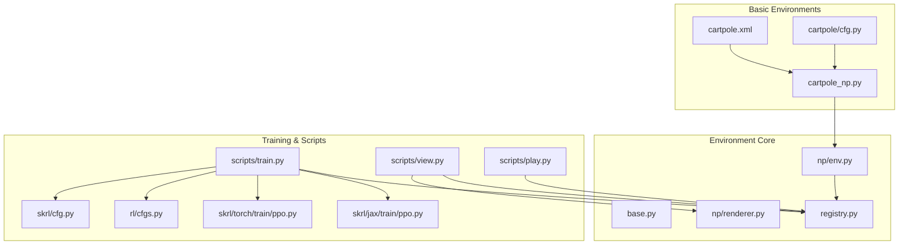
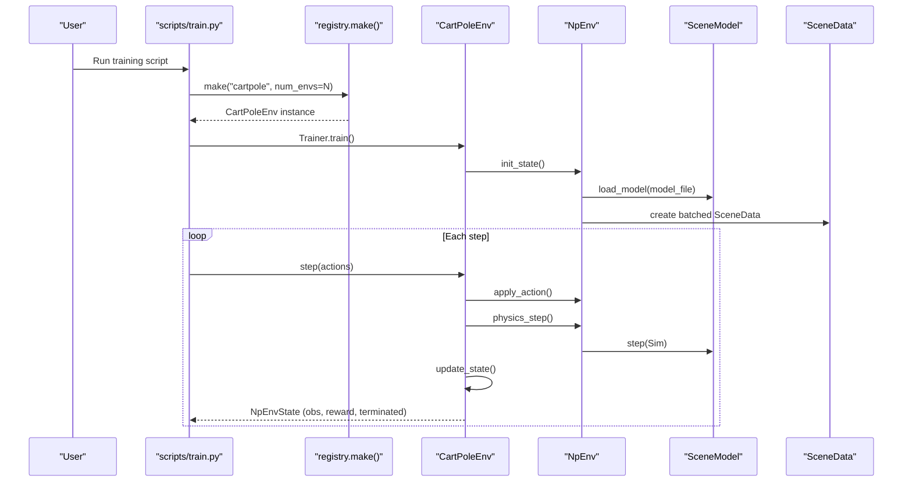
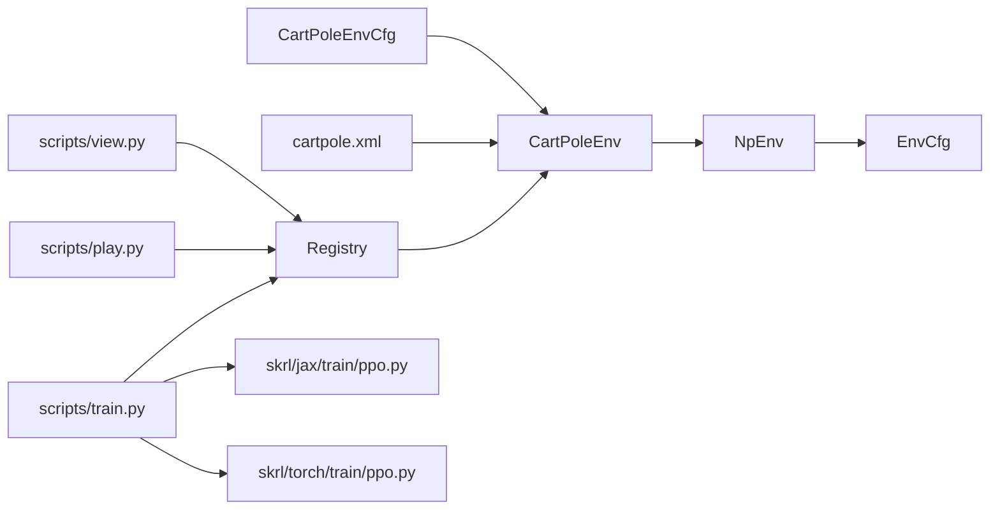
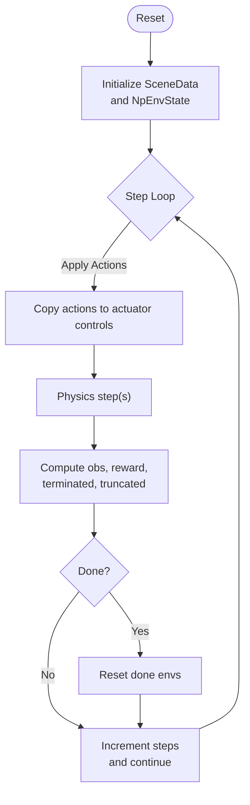
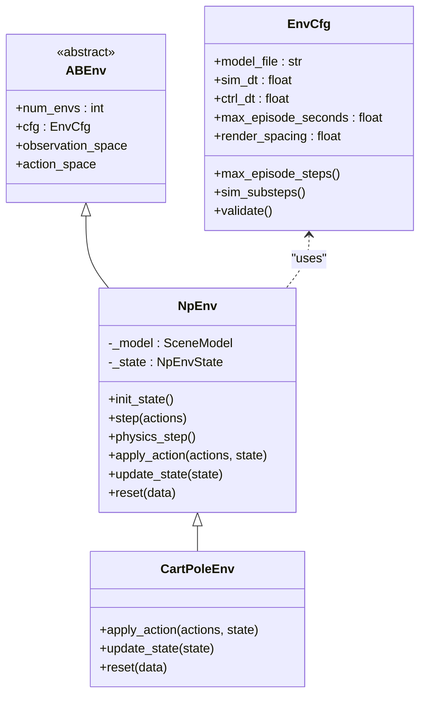

# CartPole Environment

<cite>
**Referenced Files in This Document**
- [cartpole_np.py](file://motrix_envs/src/motrix_envs/basic/cartpole/cartpole_np.py)
- [cartpole.xml](file://motrix_envs/src/motrix_envs/basic/cartpole/cartpole.xml)
- [cfg.py](file://motrix_envs/src/motrix_envs/basic/cartpole/cfg.py)
- [env.py](file://motrix_envs/src/motrix_envs/np/env.py)
- [base.py](file://motrix_envs/src/motrix_envs/base.py)
- [registry.py](file://motrix_envs/src/motrix_envs/registry.py)
- [renderer.py](file://motrix_envs/src/motrix_envs/np/renderer.py)
- [cartpole.md](file://docs/source/en/user_guide/demo/cartpole.md)
- [train.py](file://scripts/train.py)
- [view.py](file://scripts/view.py)
- [play.py](file://scripts/play.py)
- [ppo.py (JAX)](file://motrix_rl/src/motrix_rl/skrl/jax/train/ppo.py)
- [ppo.py (Torch)](file://motrix_rl/src/motrix_rl/skrl/torch/train/ppo.py)
- [cfgs.py](file://motrix_rl/src/motrix_rl/cfgs.py)
- [skrl_cfg.py](file://motrix_rl/src/motrix_rl/skrl/cfg.py)
</cite>

## Table of Contents
1. [Introduction](#introduction)
2. [Project Structure](#project-structure)
3. [Core Components](#core-components)
4. [Architecture Overview](#architecture-overview)
5. [Detailed Component Analysis](#detailed-component-analysis)
6. [Dependency Analysis](#dependency-analysis)
7. [Performance Considerations](#performance-considerations)
8. [Troubleshooting Guide](#troubleshooting-guide)
9. [Conclusion](#conclusion)
10. [Appendices](#appendices)

## Introduction
This document provides comprehensive documentation for the CartPole environment implementation in the MotrixLab-S1 project. It explains the physics model, state/action representation, reward design, XML scene definition, configuration parameters, and the NumPy-based simulation pipeline. It also covers training setup, recommended hyperparameters, performance expectations, and practical debugging techniques. Code examples are provided via file references to guide environment initialization, stepping, and rendering.

## Project Structure
The CartPole environment is implemented as a basic environment module with a MuJoCo XML scene, a NumPy-backed simulation wrapper, and RL training integration.

**Diagram sources**
- [cartpole.xml](file://motrix_envs/src/motrix_envs/basic/cartpole/cartpole.xml#L1-L38)
- [cfg.py](file://motrix_envs/src/motrix_envs/basic/cartpole/cfg.py#L25-L32)
- [cartpole_np.py](file://motrix_envs/src/motrix_envs/basic/cartpole/cartpole_np.py#L26-L98)
- [env.py](file://motrix_envs/src/motrix_envs/np/env.py#L52-L209)
- [registry.py](file://motrix_envs/src/motrix_envs/registry.py#L114-L161)
- [renderer.py](file://motrix_envs/src/motrix_envs/np/renderer.py#L22-L65)
- [train.py](file://scripts/train.py#L52-L95)
- [view.py](file://scripts/view.py#L71-L83)
- [play.py](file://scripts/play.py#L110-L162)
- [ppo.py (JAX)](file://motrix_rl/src/motrix_rl/skrl/jax/train/ppo.py#L145-L185)
- [ppo.py (Torch)](file://motrix_rl/src/motrix_rl/skrl/torch/train/ppo.py#L145-L184)
- [cfgs.py](file://motrix_rl/src/motrix_rl/cfgs.py#L22-L35)
- [skrl_cfg.py](file://motrix_rl/src/motrix_rl/skrl/cfg.py#L28-L74)

**Section sources**
- [cartpole_np.py](file://motrix_envs/src/motrix_envs/basic/cartpole/cartpole_np.py#L26-L98)
- [cartpole.xml](file://motrix_envs/src/motrix_envs/basic/cartpole/cartpole.xml#L1-L38)
- [cfg.py](file://motrix_envs/src/motrix_envs/basic/cartpole/cfg.py#L25-L32)
- [env.py](file://motrix_envs/src/motrix_envs/np/env.py#L52-L209)
- [base.py](file://motrix_envs/src/motrix_envs/base.py#L23-L85)
- [registry.py](file://motrix_envs/src/motrix_envs/registry.py#L114-L161)
- [renderer.py](file://motrix_envs/src/motrix_envs/np/renderer.py#L22-L65)
- [cartpole.md](file://docs/source/en/user_guide/demo/cartpole.md#L1-L54)
- [train.py](file://scripts/train.py#L52-L95)
- [view.py](file://scripts/view.py#L71-L83)
- [play.py](file://scripts/play.py#L110-L162)
- [ppo.py (JAX)](file://motrix_rl/src/motrix_rl/skrl/jax/train/ppo.py#L145-L185)
- [ppo.py (Torch)](file://motrix_rl/src/motrix_rl/skrl/torch/train/ppo.py#L145-L184)
- [cfgs.py](file://motrix_rl/src/motrix_rl/cfgs.py#L22-L35)
- [skrl_cfg.py](file://motrix_rl/src/motrix_rl/skrl/cfg.py#L28-L74)

## Core Components
- CartPoleEnv: Implements the environment logic, action application, state update, termination conditions, and reset behavior.
- Scene XML: Defines the physics world, geometry, actuators, and simulation parameters.
- Configuration: Provides environment-specific parameters and defaults.
- NumPy Environment Base: Handles batching, physics stepping, state lifecycle, and termination/truncation logic.
- Registry: Registers environment configurations and environment classes, enabling creation by name.
- Renderer: Visualizes multiple environments in a tiled grid layout.
- Training Scripts: Provide CLI entry points for training, preview, and playback.

Key implementation references:
- Environment class and methods: [cartpole_np.py](file://motrix_envs/src/motrix_envs/basic/cartpole/cartpole_np.py#L26-L98)
- XML scene definition: [cartpole.xml](file://motrix_envs/src/motrix_envs/basic/cartpole/cartpole.xml#L1-L38)
- Environment configuration: [cfg.py](file://motrix_envs/src/motrix_envs/basic/cartpole/cfg.py#L25-L32)
- NumPy environment base: [env.py](file://motrix_envs/src/motrix_envs/np/env.py#L52-L209)
- Registry: [registry.py](file://motrix_envs/src/motrix_envs/registry.py#L114-L161)
- Renderer: [renderer.py](file://motrix_envs/src/motrix_envs/np/renderer.py#L22-L65)
- Training scripts: [train.py](file://scripts/train.py#L52-L95), [view.py](file://scripts/view.py#L71-L83), [play.py](file://scripts/play.py#L110-L162)

**Section sources**
- [cartpole_np.py](file://motrix_envs/src/motrix_envs/basic/cartpole/cartpole_np.py#L26-L98)
- [cartpole.xml](file://motrix_envs/src/motrix_envs/basic/cartpole/cartpole.xml#L1-L38)
- [cfg.py](file://motrix_envs/src/motrix_envs/basic/cartpole/cfg.py#L25-L32)
- [env.py](file://motrix_envs/src/motrix_envs/np/env.py#L52-L209)
- [registry.py](file://motrix_envs/src/motrix_envs/registry.py#L114-L161)
- [renderer.py](file://motrix_envs/src/motrix_envs/np/renderer.py#L22-L65)
- [train.py](file://scripts/train.py#L52-L95)
- [view.py](file://scripts/view.py#L71-L83)
- [play.py](file://scripts/play.py#L110-L162)

## Architecture Overview
The environment integrates a MuJoCo-based scene with a NumPy simulation wrapper and an RL training loop. The registry resolves environment names to concrete implementations, and the training scripts orchestrate environment creation, agent training, and evaluation.

**Diagram sources**
- [train.py](file://scripts/train.py#L52-L95)
- [registry.py](file://motrix_envs/src/motrix_envs/registry.py#L114-L161)
- [cartpole_np.py](file://motrix_envs/src/motrix_envs/basic/cartpole/cartpole_np.py#L26-L98)
- [env.py](file://motrix_envs/src/motrix_envs/np/env.py#L97-L209)

## Detailed Component Analysis

### Physics Model and Scene Definition
- Scene: Defined in XML with a slider joint for the cart along the rail, a hinge joint for the pole, and a motor actuator applying force to the cart.
- Gravity: Set to a downward acceleration for realistic dynamics.
- Actuation: Motor controls the slider joint with bounded torque/force.
- Geometry: Rail and pole represented as capsules; floor plane for contact.

References:
- Scene XML: [cartpole.xml](file://motrix_envs/src/motrix_envs/basic/cartpole/cartpole.xml#L1-L38)

**Section sources**
- [cartpole.xml](file://motrix_envs/src/motrix_envs/basic/cartpole/cartpole.xml#L1-L38)

### State Representation
- DOF positions: cart slider position, pole hinge angle.
- DOF velocities: cart slider velocity, pole angular velocity.
- Observation: Concatenated position and velocity vectors, shape (num_envs, 4).

References:
- Observation construction: [cartpole_np.py](file://motrix_envs/src/motrix_envs/basic/cartpole/cartpole_np.py#L54-L75)

**Section sources**
- [cartpole_np.py](file://motrix_envs/src/motrix_envs/basic/cartpole/cartpole_np.py#L54-L75)

### Action Space and Control
- Action: Single scalar representing force applied to the cart (bounded).
- Application: Copied into actuator controls for the slider joint.

References:
- Action bounds and application: [cartpole_np.py](file://motrix_envs/src/motrix_envs/basic/cartpole/cartpole_np.py#L30-L52)

**Section sources**
- [cartpole_np.py](file://motrix_envs/src/motrix_envs/basic/cartpole/cartpole_np.py#L30-L52)

### Termination and Reward Design
- Reward: Constant +1 per step (dense reward).
- Termination: Episode ends if pole angle exceeds threshold, cart position leaves bounds, or NaN is detected.

References:
- Termination and reward logic: [cartpole_np.py](file://motrix_envs/src/motrix_envs/basic/cartpole/cartpole_np.py#L62-L75)

**Section sources**
- [cartpole_np.py](file://motrix_envs/src/motrix_envs/basic/cartpole/cartpole_np.py#L62-L75)

### Reset Mechanics
- Noise: Adds uniform noise to initial DOF positions and velocities.
- Initialization: Uses model-provided initial DOF positions; velocities initialized to zero.

References:
- Reset implementation: [cartpole_np.py](file://motrix_envs/src/motrix_envs/basic/cartpole/cartpole_np.py#L77-L98)

**Section sources**
- [cartpole_np.py](file://motrix_envs/src/motrix_envs/basic/cartpole/cartpole_np.py#L77-L98)

### NumPy Simulation Pipeline
- Base class responsibilities:
  - Load scene model and configure timestep.
  - Initialize batched SceneData and environment state.
  - Step physics multiple times per control step according to substeps.
  - Track truncation based on max episode steps.
  - Reset done environments and maintain info counters.

References:
- Base class: [env.py](file://motrix_envs/src/motrix_envs/np/env.py#L52-L209)
- Configuration base: [base.py](file://motrix_envs/src/motrix_envs/base.py#L23-L85)

**Section sources**
- [env.py](file://motrix_envs/src/motrix_envs/np/env.py#L52-L209)
- [base.py](file://motrix_envs/src/motrix_envs/base.py#L23-L85)

### Environment Registration and Creation
- Registry registers environment configurations and environment classes.
- Creation supports backend selection and config overrides.

References:
- Registry: [registry.py](file://motrix_envs/src/motrix_envs/registry.py#L114-L161)

**Section sources**
- [registry.py](file://motrix_envs/src/motrix_envs/registry.py#L114-L161)

### Rendering Multiple Environments
- Renders a grid of environments with configurable spacing.
- Synchronizes scene data for visualization.

References:
- Renderer: [renderer.py](file://motrix_envs/src/motrix_envs/np/renderer.py#L22-L65)

**Section sources**
- [renderer.py](file://motrix_envs/src/motrix_envs/np/renderer.py#L22-L65)

### Training Setup and Hyperparameters
- Training entry points:
  - Training: [train.py](file://scripts/train.py#L52-L95)
  - Preview: [view.py](file://scripts/view.py#L71-L83)
  - Evaluation: [play.py](file://scripts/play.py#L110-L162)
- CartPole RL configuration defaults:
  - Small networks, modest rollouts, dense reward.
  - Reference: [cfgs.py](file://motrix_rl/src/motrix_rl/cfgs.py#L22-L35)
- PPO hyperparameters (SKRL):
  - Reference: [skrl_cfg.py](file://motrix_rl/src/motrix_rl/skrl/cfg.py#L28-L74)
- JAX/Torch trainers:
  - Reference: [ppo.py (JAX)](file://motrix_rl/src/motrix_rl/skrl/jax/train/ppo.py#L145-L185), [ppo.py (Torch)](file://motrix_rl/src/motrix_rl/skrl/torch/train/ppo.py#L145-L184)

Recommended baseline hyperparameters for CartPole:
- Policy/value hidden sizes: small networks (e.g., two 32-unit layers) to encourage fast learning.
- Rollouts: moderate (e.g., 32).
- Learning epochs: 2–5.
- Mini batches: 4–8.
- Learning rate: 1e-3 to 3e-4 depending on backend.
- Ratio clip: 0.2.
- Entropy loss scale: 0.0 (optional).
- Rewards shaper scale: 1.0 (keep dense reward as-is).

**Section sources**
- [train.py](file://scripts/train.py#L52-L95)
- [view.py](file://scripts/view.py#L71-L83)
- [play.py](file://scripts/play.py#L110-L162)
- [cfgs.py](file://motrix_rl/src/motrix_rl/cfgs.py#L22-L35)
- [skrl_cfg.py](file://motrix_rl/src/motrix_rl/skrl/cfg.py#L28-L74)
- [ppo.py (JAX)](file://motrix_rl/src/motrix_rl/skrl/jax/train/ppo.py#L145-L185)
- [ppo.py (Torch)](file://motrix_rl/src/motrix_rl/skrl/torch/train/ppo.py#L145-L184)

### Code Examples

- Environment initialization and reset:
  - Create environment via registry and reset to initial observations.
  - References: [registry.py](file://motrix_envs/src/motrix_envs/registry.py#L114-L161), [cartpole_np.py](file://motrix_envs/src/motrix_envs/basic/cartpole/cartpole_np.py#L77-L98)

- Step operation:
  - Apply actions, advance physics, compute observations and rewards.
  - References: [cartpole_np.py](file://motrix_envs/src/motrix_envs/basic/cartpole/cartpole_np.py#L50-L75), [env.py](file://motrix_envs/src/motrix_envs/np/env.py#L196-L209)

- Rendering:
  - Launch renderer and synchronize scene data for visualization.
  - References: [renderer.py](file://motrix_envs/src/motrix_envs/np/renderer.py#L22-L65), [view.py](file://scripts/view.py#L71-L83)

- Training entry points:
  - Start training, preview, or evaluate policies.
  - References: [train.py](file://scripts/train.py#L52-L95), [view.py](file://scripts/view.py#L71-L83), [play.py](file://scripts/play.py#L110-L162)

**Section sources**
- [registry.py](file://motrix_envs/src/motrix_envs/registry.py#L114-L161)
- [cartpole_np.py](file://motrix_envs/src/motrix_envs/basic/cartpole/cartpole_np.py#L50-L98)
- [env.py](file://motrix_envs/src/motrix_envs/np/env.py#L196-L209)
- [renderer.py](file://motrix_envs/src/motrix_envs/np/renderer.py#L22-L65)
- [view.py](file://scripts/view.py#L71-L83)
- [train.py](file://scripts/train.py#L52-L95)
- [play.py](file://scripts/play.py#L110-L162)

## Dependency Analysis
The environment depends on the registry for instantiation, the base NumPy environment for simulation orchestration, and the MuJoCo scene model for physics. Training scripts depend on the registry and RL trainers.

**Diagram sources**
- [cfg.py](file://motrix_envs/src/motrix_envs/basic/cartpole/cfg.py#L25-L32)
- [cartpole_np.py](file://motrix_envs/src/motrix_envs/basic/cartpole/cartpole_np.py#L26-L98)
- [env.py](file://motrix_envs/src/motrix_envs/np/env.py#L52-L209)
- [base.py](file://motrix_envs/src/motrix_envs/base.py#L23-L85)
- [registry.py](file://motrix_envs/src/motrix_envs/registry.py#L114-L161)
- [train.py](file://scripts/train.py#L52-L95)
- [view.py](file://scripts/view.py#L71-L83)
- [play.py](file://scripts/play.py#L110-L162)
- [ppo.py (JAX)](file://motrix_rl/src/motrix_rl/skrl/jax/train/ppo.py#L145-L185)
- [ppo.py (Torch)](file://motrix_rl/src/motrix_rl/skrl/torch/train/ppo.py#L145-L184)

**Section sources**
- [cfg.py](file://motrix_envs/src/motrix_envs/basic/cartpole/cfg.py#L25-L32)
- [cartpole_np.py](file://motrix_envs/src/motrix_envs/basic/cartpole/cartpole_np.py#L26-L98)
- [env.py](file://motrix_envs/src/motrix_envs/np/env.py#L52-L209)
- [base.py](file://motrix_envs/src/motrix_envs/base.py#L23-L85)
- [registry.py](file://motrix_envs/src/motrix_envs/registry.py#L114-L161)
- [train.py](file://scripts/train.py#L52-L95)
- [view.py](file://scripts/view.py#L71-L83)
- [play.py](file://scripts/play.py#L110-L162)
- [ppo.py (JAX)](file://motrix_rl/src/motrix_rl/skrl/jax/train/ppo.py#L145-L185)
- [ppo.py (Torch)](file://motrix_rl/src/motrix_rl/skrl/torch/train/ppo.py#L145-L184)

## Performance Considerations
- Parallel environments: Use larger num_envs for faster policy gradient updates (e.g., thousands).
- Substepping: Ensure sim_dt and ctrl_dt alignment so sim_substeps is integer-like for stability.
- Rendering overhead: Disable or reduce render frequency during training; enable only for preview/evaluation.
- Network size: For CartPole, small networks converge quickly; avoid over-parameterization.
- Reward shaping: Dense reward is appropriate; avoid unnecessary modifications unless debugging exploration.

[No sources needed since this section provides general guidance]

## Troubleshooting Guide
Common issues and remedies:
- Poor training performance:
  - Increase num_envs for better policy gradients.
  - Adjust learning rate (try 1e-3 to 1e-4).
  - Tune rollout length and mini-batch size.
  - Verify reward scaling and clipping parameters.
- Instability or NaNs:
  - Reduce learning rate.
  - Check action clipping and environment termination thresholds.
  - Inspect physics timestep and substeps.
- Visualization lag:
  - Lower render frequency or disable rendering during training.
  - Use fewer environments in preview mode.

References:
- Training tips: [cartpole.md](file://docs/source/en/user_guide/demo/cartpole.md#L46-L54)
- Training script flags: [train.py](file://scripts/train.py#L26-L36)

**Section sources**
- [cartpole.md](file://docs/source/en/user_guide/demo/cartpole.md#L46-L54)
- [train.py](file://scripts/train.py#L26-L36)

## Conclusion
The CartPole environment integrates a concise MuJoCo scene with a robust NumPy simulation pipeline and a flexible RL training framework. Its design emphasizes simplicity, fast iteration, and clear separation of concerns. With sensible defaults and straightforward training scripts, it serves as an excellent baseline for reinforcement learning research and education.

[No sources needed since this section summarizes without analyzing specific files]

## Appendices

### Environment Lifecycle Flow

**Diagram sources**
- [env.py](file://motrix_envs/src/motrix_envs/np/env.py#L196-L209)
- [cartpole_np.py](file://motrix_envs/src/motrix_envs/basic/cartpole/cartpole_np.py#L50-L75)

### Environment Class Diagram

**Diagram sources**
- [base.py](file://motrix_envs/src/motrix_envs/base.py#L61-L85)
- [env.py](file://motrix_envs/src/motrix_envs/np/env.py#L52-L209)
- [cartpole_np.py](file://motrix_envs/src/motrix_envs/basic/cartpole/cartpole_np.py#L26-L98)