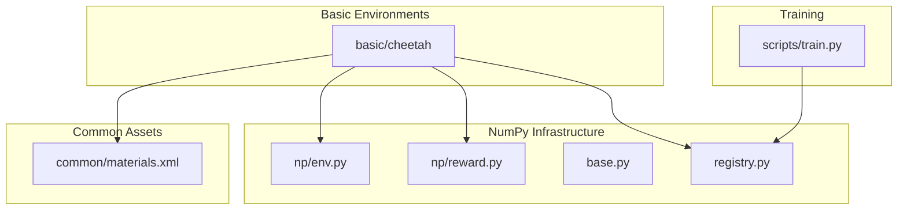
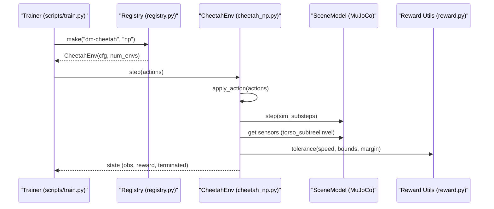
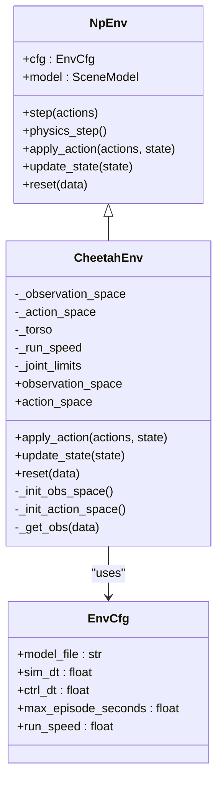
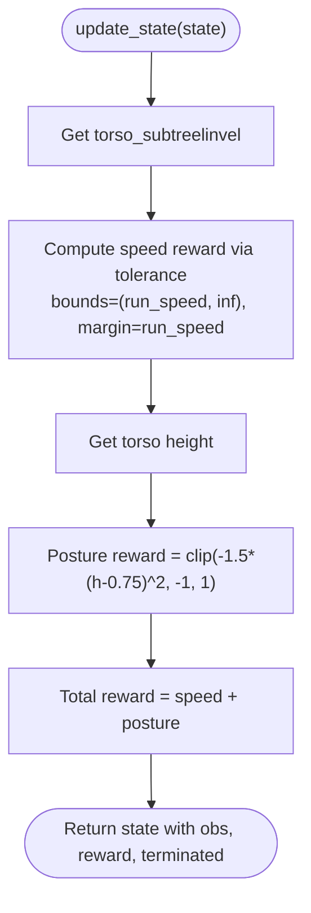
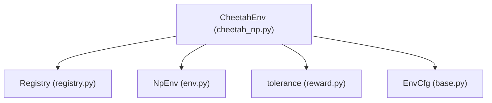

# Cheetah Environment

<cite>
**Referenced Files in This Document**
- [cheetah_np.py](file://motrix_envs/src/motrix_envs/basic/cheetah/cheetah_np.py)
- [cheetah.xml](file://motrix_envs/src/motrix_envs/basic/cheetah/cheetah.xml)
- [cfg.py](file://motrix_envs/src/motrix_envs/basic/cheetah/cfg.py)
- [env.py](file://motrix_envs/src/motrix_envs/np/env.py)
- [reward.py](file://motrix_envs/src/motrix_envs/np/reward.py)
- [base.py](file://motrix_envs/src/motrix_envs/base.py)
- [registry.py](file://motrix_envs/src/motrix_envs/registry.py)
- [__init__.py](file://motrix_envs/src/motrix_envs/basic/__init__.py)
- [walker_np.py](file://motrix_envs/src/motrix_envs/basic/walker/walker_np.py)
- [hopper_np.py](file://motrix_envs/src/motrix_envs/basic/hopper/hopper_np.py)
- [anymal_c_np.py](file://motrix_envs/src/motrix_envs/locomotion/anymal_c/anymal_c_np.py)
- [materials.xml](file://motrix_envs/src/motrix_envs/common/materials.xml)
- [dm_cheetah.md](file://docs/source/en/user_guide/demo/dm_cheetah.md)
- [train.py](file://scripts/train.py)
</cite>

## Table of Contents
1. [Introduction](#introduction)
2. [Project Structure](#project-structure)
3. [Core Components](#core-components)
4. [Architecture Overview](#architecture-overview)
5. [Detailed Component Analysis](#detailed-component-analysis)
6. [Dependency Analysis](#dependency-analysis)
7. [Performance Considerations](#performance-considerations)
8. [Troubleshooting Guide](#troubleshooting-guide)
9. [Conclusion](#conclusion)
10. [Appendices](#appendices)

## Introduction
This document describes the Cheetah environment that simulates a quadruped running dynamics task. It explains the four-legged robot model, joint actuation patterns, and ground contact mechanics. It documents the state and action spaces, reward function emphasis on running speed, stability, and energy efficiency, and provides XML scene configuration and environment parameters. It also outlines training methodologies, hyperparameter optimization strategies, and comparisons with other locomotion environments, including common challenges such as maintaining balance during high-speed running.

## Project Structure
The Cheetah environment is part of the MotrixLab S1 project’s environment suite. The relevant components are organized under the basic environments module and share common infrastructure for NumPy-based environments, reward utilities, and registry mechanisms.

**Diagram sources**
- [cheetah_np.py](file://motrix_envs/src/motrix_envs/basic/cheetah/cheetah_np.py#L27-L121)
- [cheetah.xml](file://motrix_envs/src/motrix_envs/basic/cheetah/cheetah.xml#L1-L80)
- [env.py](file://motrix_envs/src/motrix_envs/np/env.py#L52-L209)
- [reward.py](file://motrix_envs/src/motrix_envs/np/reward.py#L63-L84)
- [base.py](file://motrix_envs/src/motrix_envs/base.py#L23-L85)
- [registry.py](file://motrix_envs/src/motrix_envs/registry.py#L114-L161)
- [train.py](file://scripts/train.py#L52-L95)

**Section sources**
- [cheetah_np.py](file://motrix_envs/src/motrix_envs/basic/cheetah/cheetah_np.py#L1-L121)
- [cheetah.xml](file://motrix_envs/src/motrix_envs/basic/cheetah/cheetah.xml#L1-L80)
- [cfg.py](file://motrix_envs/src/motrix_envs/basic/cheetah/cfg.py#L25-L34)
- [env.py](file://motrix_envs/src/motrix_envs/np/env.py#L52-L209)
- [reward.py](file://motrix_envs/src/motrix_envs/np/reward.py#L63-L84)
- [base.py](file://motrix_envs/src/motrix_envs/base.py#L23-L85)
- [registry.py](file://motrix_envs/src/motrix_envs/registry.py#L114-L161)
- [train.py](file://scripts/train.py#L52-L95)

## Core Components
- CheetahEnv: Implements the NumPy-based environment for the quadruped running task, including observation/action spaces, action application, physics stepping, and reward computation.
- XML Scene: Defines the MuJoCo model with bodies, joints, actuators, sensors, and default parameters for the robot.
- Configuration: Provides environment-specific parameters such as model file path, simulation/control timesteps, and target run speed.
- Reward Utilities: Provides a tolerance function used to compute shaped rewards for speed and posture.
- Base Infrastructure: Provides the base environment configuration, step loop, and state management for NumPy environments.

Key implementation references:
- Environment class definition and methods: [cheetah_np.py](file://motrix_envs/src/motrix_envs/basic/cheetah/cheetah_np.py#L27-L121)
- XML scene definition: [cheetah.xml](file://motrix_envs/src/motrix_envs/basic/cheetah/cheetah.xml#L1-L80)
- Environment configuration: [cfg.py](file://motrix_envs/src/motrix_envs/basic/cheetah/cfg.py#L25-L34)
- Reward tolerance function: [reward.py](file://motrix_envs/src/motrix_envs/np/reward.py#L63-L84)
- NumPy environment base: [env.py](file://motrix_envs/src/motrix_envs/np/env.py#L52-L209)
- Base configuration: [base.py](file://motrix_envs/src/motrix_envs/base.py#L23-L85)

**Section sources**
- [cheetah_np.py](file://motrix_envs/src/motrix_envs/basic/cheetah/cheetah_np.py#L27-L121)
- [cheetah.xml](file://motrix_envs/src/motrix_envs/basic/cheetah/cheetah.xml#L1-L80)
- [cfg.py](file://motrix_envs/src/motrix_envs/basic/cheetah/cfg.py#L25-L34)
- [reward.py](file://motrix_envs/src/motrix_envs/np/reward.py#L63-L84)
- [env.py](file://motrix_envs/src/motrix_envs/np/env.py#L52-L209)
- [base.py](file://motrix_envs/src/motrix_envs/base.py#L23-L85)

## Architecture Overview
The Cheetah environment integrates a MuJoCo XML scene with a NumPy-based environment loop. The environment registers itself via the registry, loads the model, manages state transitions, applies actions, steps physics, and computes rewards.

**Diagram sources**
- [train.py](file://scripts/train.py#L52-L95)
- [registry.py](file://motrix_envs/src/motrix_envs/registry.py#L114-L161)
- [cheetah_np.py](file://motrix_envs/src/motrix_envs/basic/cheetah/cheetah_np.py#L61-L101)
- [reward.py](file://motrix_envs/src/motrix_envs/np/reward.py#L63-L84)

## Detailed Component Analysis

### Cheetah Environment Class
The CheetahEnv extends the NumPy environment base class and implements the core environment logic for the quadruped running task.

**Diagram sources**
- [env.py](file://motrix_envs/src/motrix_envs/np/env.py#L52-L209)
- [cheetah_np.py](file://motrix_envs/src/motrix_envs/basic/cheetah/cheetah_np.py#L27-L121)
- [base.py](file://motrix_envs/src/motrix_envs/base.py#L23-L85)

Implementation highlights:
- Observation space: concatenation of joint positions (excluding root x) and joint velocities.
- Action space: normalized controls for six actuators (hind thigh, shin, foot and fore thigh, shin, foot).
- Reward: speed reward using a tolerance function and posture penalty based on torso height.
- Reset: randomizes limited joint angles and stabilizes the model before returning observations.

References:
- Observation initialization: [cheetah_np.py](file://motrix_envs/src/motrix_envs/basic/cheetah/cheetah_np.py#L40-L43)
- Action initialization: [cheetah_np.py](file://motrix_envs/src/motrix_envs/basic/cheetah/cheetah_np.py#L44-L51)
- Observation extraction: [cheetah_np.py](file://motrix_envs/src/motrix_envs/basic/cheetah/cheetah_np.py#L65-L70)
- Reward computation: [cheetah_np.py](file://motrix_envs/src/motrix_envs/basic/cheetah/cheetah_np.py#L81-L95)
- Reset logic: [cheetah_np.py](file://motrix_envs/src/motrix_envs/basic/cheetah/cheetah_np.py#L103-L121)

**Section sources**
- [cheetah_np.py](file://motrix_envs/src/motrix_envs/basic/cheetah/cheetah_np.py#L27-L121)
- [env.py](file://motrix_envs/src/motrix_envs/np/env.py#L52-L209)
- [base.py](file://motrix_envs/src/motrix_envs/base.py#L23-L85)

### XML Scene Configuration
The MuJoCo XML defines the robot’s kinematic structure, dynamics defaults, assets, actuators, sensors, and simulation options.

Key elements:
- Bodies and Joints: Torso with root freedoms and four legs (hind and fore) with hierarchical joints and capsules for links.
- Actuators: Six motors corresponding to the leg joints with gear ratios.
- Sensors: Subtree linear velocity for the torso.
- Defaults: Joint limits, damping, stiffness, geometry properties, and motor control ranges.

References:
- Scene definition and actuators: [cheetah.xml](file://motrix_envs/src/motrix_envs/basic/cheetah/cheetah.xml#L1-L80)
- Materials and textures: [materials.xml](file://motrix_envs/src/motrix_envs/common/materials.xml#L1-L24)

**Section sources**
- [cheetah.xml](file://motrix_envs/src/motrix_envs/basic/cheetah/cheetah.xml#L1-L80)
- [materials.xml](file://motrix_envs/src/motrix_envs/common/materials.xml#L1-L24)

### Reward Function and Training
The reward balances forward speed and posture stability. The speed reward uses a tolerance function with a margin and linear sigmoid, while posture is penalized by deviations from a target torso height.

**Diagram sources**
- [cheetah_np.py](file://motrix_envs/src/motrix_envs/basic/cheetah/cheetah_np.py#L81-L101)
- [reward.py](file://motrix_envs/src/motrix_envs/np/reward.py#L63-L84)

Training and usage:
- Environment registration and instantiation: [registry.py](file://motrix_envs/src/motrix_envs/registry.py#L114-L161)
- Training script entry point: [train.py](file://scripts/train.py#L52-L95)
- Documentation guide for usage: [dm_cheetah.md](file://docs/source/en/user_guide/demo/dm_cheetah.md#L100-L132)

**Section sources**
- [cheetah_np.py](file://motrix_envs/src/motrix_envs/basic/cheetah/cheetah_np.py#L81-L101)
- [reward.py](file://motrix_envs/src/motrix_envs/np/reward.py#L63-L84)
- [registry.py](file://motrix_envs/src/motrix_envs/registry.py#L114-L161)
- [train.py](file://scripts/train.py#L52-L95)
- [dm_cheetah.md](file://docs/source/en/user_guide/demo/dm_cheetah.md#L100-L132)

### Comparison with Other Locomotion Environments
- Walker2D: 2D bipedal locomotion with orientation and velocity-based rewards; includes move speed reward when configured.
- Hopper: 1D hopping task with stance and hop rewards; includes contact sensors and leg velocity bonuses.
- AnymalC: Full 3D quadruped with position/heading commands, extensive contact and orientation penalties, and reward shaping for tracking and stopping.

References:
- Walker2D reward structure: [walker_np.py](file://motrix_envs/src/motrix_envs/basic/walker/walker_np.py#L97-L131)
- Hopper reward structure: [hopper_np.py](file://motrix_envs/src/motrix_envs/basic/hopper/hopper_np.py#L112-L174)
- AnymalC reward structure: [anymal_c_np.py](file://motrix_envs/src/motrix_envs/locomotion/anymal_c/anymal_c_np.py#L310-L448)

**Section sources**
- [walker_np.py](file://motrix_envs/src/motrix_envs/basic/walker/walker_np.py#L97-L131)
- [hopper_np.py](file://motrix_envs/src/motrix_envs/basic/hopper/hopper_np.py#L112-L174)
- [anymal_c_np.py](file://motrix_envs/src/motrix_envs/locomotion/anymal_c/anymal_c_np.py#L310-L448)

## Dependency Analysis
The environment depends on the registry for instantiation, the NumPy environment base for step loops and state management, and reward utilities for shaped rewards.

**Diagram sources**
- [cheetah_np.py](file://motrix_envs/src/motrix_envs/basic/cheetah/cheetah_np.py#L27-L121)
- [registry.py](file://motrix_envs/src/motrix_envs/registry.py#L114-L161)
- [env.py](file://motrix_envs/src/motrix_envs/np/env.py#L52-L209)
- [reward.py](file://motrix_envs/src/motrix_envs/np/reward.py#L63-L84)
- [base.py](file://motrix_envs/src/motrix_envs/base.py#L23-L85)

**Section sources**
- [cheetah_np.py](file://motrix_envs/src/motrix_envs/basic/cheetah/cheetah_np.py#L27-L121)
- [registry.py](file://motrix_envs/src/motrix_envs/registry.py#L114-L161)
- [env.py](file://motrix_envs/src/motrix_envs/np/env.py#L52-L209)
- [reward.py](file://motrix_envs/src/motrix_envs/np/reward.py#L63-L84)
- [base.py](file://motrix_envs/src/motrix_envs/base.py#L23-L85)

## Performance Considerations
- Simulation and control timesteps: The environment validates that simulation timestep does not exceed control timestep and computes simulation substeps accordingly.
- Vectorized execution: The NumPy environment supports batching multiple environments and resetting done environments independently.
- Reward computation: Shaped rewards using smooth tolerance functions reduce sparse feedback and improve training stability.

Practical tips:
- Tune run speed and margins to balance exploration and exploitation.
- Monitor torso height and speed rewards to detect over- or under-optimization.
- Adjust render spacing for visualization overhead in multi-environment setups.

**Section sources**
- [base.py](file://motrix_envs/src/motrix_envs/base.py#L53-L59)
- [env.py](file://motrix_envs/src/motrix_envs/np/env.py#L186-L209)
- [cheetah_np.py](file://motrix_envs/src/motrix_envs/basic/cheetah/cheetah_np.py#L81-L101)

## Troubleshooting Guide
Common issues and remedies:
- Numerical instabilities: Check for NaN or extreme velocities; terminate episodes when velocities exceed thresholds.
- Poor posture: Increase posture penalty weight or adjust target height margin.
- Low speed: Verify run speed target and reward margin; ensure actuators are properly configured.
- Stabilization at reset: Allow sufficient simulation steps after randomization to settle the model.

References:
- Termination checks and reward shaping: [cheetah_np.py](file://motrix_envs/src/motrix_envs/basic/cheetah/cheetah_np.py#L78-L101)
- Walker2D termination and reward: [walker_np.py](file://motrix_envs/src/motrix_envs/basic/walker/walker_np.py#L94-L131)
- Hopper termination and reward: [hopper_np.py](file://motrix_envs/src/motrix_envs/basic/hopper/hopper_np.py#L107-L174)

**Section sources**
- [cheetah_np.py](file://motrix_envs/src/motrix_envs/basic/cheetah/cheetah_np.py#L78-L101)
- [walker_np.py](file://motrix_envs/src/motrix_envs/basic/walker/walker_np.py#L94-L131)
- [hopper_np.py](file://motrix_envs/src/motrix_envs/basic/hopper/hopper_np.py#L107-L174)

## Conclusion
The Cheetah environment provides a robust, configurable quadruped running simulator with a clear separation between the MuJoCo scene, environment logic, and reward shaping. Its design enables efficient training with NumPy-based environments, supports vectorization, and offers extensible reward engineering. Compared to simpler tasks like Hopper and Walker2D, and more complex 3D quadrupeds like AnymalC, it offers a balanced platform for studying running gaits, stability, and energy efficiency.

## Appendices

### State Space and Action Space
- State space: Concatenation of joint positions (excluding root x) and joint velocities. Dimensions depend on the number of degrees of freedom in the model.
- Action space: Six-dimensional control actions for leg actuators, normalized to [-1, 1].

References:
- Observation construction: [cheetah_np.py](file://motrix_envs/src/motrix_envs/basic/cheetah/cheetah_np.py#L65-L70)
- Action space definition: [cheetah_np.py](file://motrix_envs/src/motrix_envs/basic/cheetah/cheetah_np.py#L44-L51)

**Section sources**
- [cheetah_np.py](file://motrix_envs/src/motrix_envs/basic/cheetah/cheetah_np.py#L44-L70)

### Environment Parameters
- Model file: Path to the MuJoCo XML scene.
- Simulation timestep: Physics integration step.
- Control timestep: Agent control interval; substepping is computed internally.
- Maximum episode seconds: Episode truncation policy.
- Run speed target: Target forward speed for reward shaping.

References:
- Configuration class and defaults: [cfg.py](file://motrix_envs/src/motrix_envs/basic/cheetah/cfg.py#L25-L34)
- Validation and substeps: [base.py](file://motrix_envs/src/motrix_envs/base.py#L53-L59)

**Section sources**
- [cfg.py](file://motrix_envs/src/motrix_envs/basic/cheetah/cfg.py#L25-L34)
- [base.py](file://motrix_envs/src/motrix_envs/base.py#L53-L59)

### Training Methodologies and Hyperparameters
- Training entry point: The training script selects the backend and initializes the environment by name.
- Environment preview and training commands are documented in the usage guide.

References:
- Training script: [train.py](file://scripts/train.py#L52-L95)
- Usage guide: [dm_cheetah.md](file://docs/source/en/user_guide/demo/dm_cheetah.md#L100-L132)

**Section sources**
- [train.py](file://scripts/train.py#L52-L95)
- [dm_cheetah.md](file://docs/source/en/user_guide/demo/dm_cheetah.md#L100-L132)