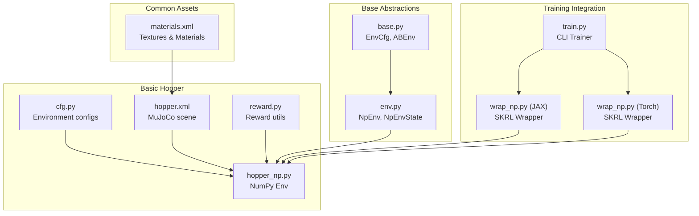
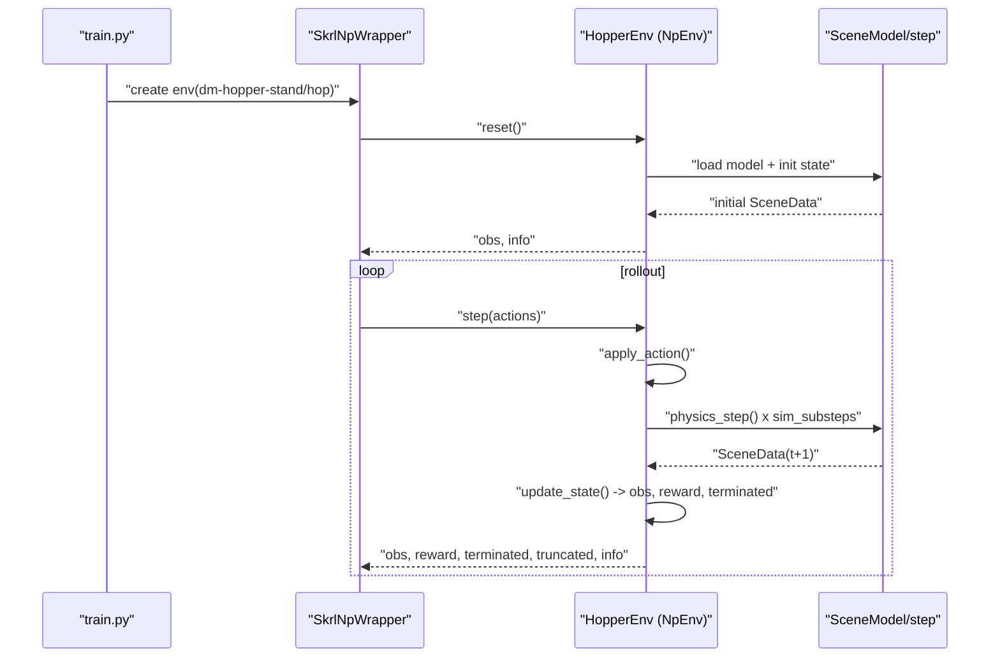
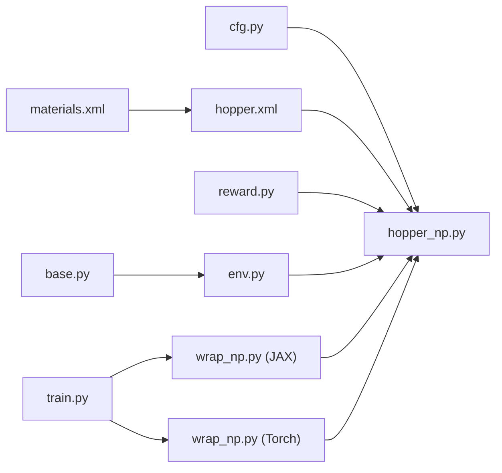

# Hopper Environment

<cite>
**Referenced Files in This Document**
- [hopper_np.py](file://motrix_envs/src/motrix_envs/basic/hopper/hopper_np.py)
- [cfg.py](file://motrix_envs/src/motrix_envs/basic/hopper/cfg.py)
- [hopper.xml](file://motrix_envs/src/motrix_envs/basic/hopper/hopper.xml)
- [reward.py](file://motrix_envs/src/motrix_envs/np/reward.py)
- [env.py](file://motrix_envs/src/motrix_envs/np/env.py)
- [base.py](file://motrix_envs/src/motrix_envs/base.py)
- [materials.xml](file://motrix_envs/src/motrix_envs/common/materials.xml)
- [dm_hopper.md](file://docs/source/en/user_guide/demo/dm_hopper.md)
- [training_environment_config.md](file://docs/source/en/user_guide/tutorial/training_environment_config.md)
- [train.py](file://scripts/train.py)
- [wrap_np.py (JAX)](file://motrix_rl/src/motrix_rl/skrl/jax/wrap_np.py)
- [wrap_np.py (Torch)](file://motrix_rl/src/motrix_rl/skrl/torch/wrap_np.py)
</cite>

## Table of Contents
1. [Introduction](#introduction)
2. [Project Structure](#project-structure)
3. [Core Components](#core-components)
4. [Architecture Overview](#architecture-overview)
5. [Detailed Component Analysis](#detailed-component-analysis)
6. [Dependency Analysis](#dependency-analysis)
7. [Performance Considerations](#performance-considerations)
8. [Troubleshooting Guide](#troubleshooting-guide)
9. [Conclusion](#conclusion)
10. [Appendices](#appendices)

## Introduction
This document provides comprehensive documentation for the Hopper environment that models a simplified single-leg planar robot capable of standing and hopping. It covers the MuJoCo XML scene definition, the NumPy-based simulation interface, the state representation, action space, reward shaping, configuration parameters, training strategies, and performance benchmarking guidance. The goal is to help users understand how the environment works, how to configure it for different behaviors (stand vs hop), and how to train robust policies efficiently.

## Project Structure
The Hopper environment is implemented as part of the basic environments in the repository. The key files are:
- Environment configuration and registration
- XML scene definition with kinematics, actuators, and sensors
- NumPy simulation environment wrapper
- Reward utilities
- Base environment abstractions
- Training and rendering wrappers for SKRL

**Diagram sources**
- [cfg.py](file://motrix_envs/src/motrix_envs/basic/hopper/cfg.py#L25-L40)
- [hopper.xml](file://motrix_envs/src/motrix_envs/basic/hopper/hopper.xml#L1-L70)
- [hopper_np.py](file://motrix_envs/src/motrix_envs/basic/hopper/hopper_np.py#L26-L68)
- [reward.py](file://motrix_envs/src/motrix_envs/np/reward.py#L63-L84)
- [base.py](file://motrix_envs/src/motrix_envs/base.py#L23-L51)
- [env.py](file://motrix_envs/src/motrix_envs/np/env.py#L26-L108)
- [materials.xml](file://motrix_envs/src/motrix_envs/common/materials.xml#L6-L24)
- [train.py](file://scripts/train.py#L52-L90)
- [wrap_np.py (JAX)](file://motrix_rl/src/motrix_rl/skrl/jax/wrap_np.py#L27-L81)
- [wrap_np.py (Torch)](file://motrix_rl/src/motrix_rl/skrl/torch/wrap_np.py#L26-L80)

**Section sources**
- [hopper_np.py](file://motrix_envs/src/motrix_envs/basic/hopper/hopper_np.py#L26-L68)
- [cfg.py](file://motrix_envs/src/motrix_envs/basic/hopper/cfg.py#L25-L40)
- [hopper.xml](file://motrix_envs/src/motrix_envs/basic/hopper/hopper.xml#L1-L70)
- [env.py](file://motrix_envs/src/motrix_envs/np/env.py#L52-L108)
- [base.py](file://motrix_envs/src/motrix_envs/base.py#L23-L51)

## Core Components
- Environment configuration and registration:
  - Two environment variants are registered: a standing variant and a hopping variant. Both share the same model file and differ mainly in simulation step sizes and target behaviors.
- NumPy simulation environment:
  - Implements observation space initialization, action application, state updates, termination conditions, and reward computation.
- MuJoCo XML scene:
  - Defines a planar single-leg robot with torso, pelvis, thigh, calf, and foot segments, articulated joints, actuators with different gear ratios, and ground contact sensors.
- Reward utilities:
  - Provides a configurable tolerance function used to compute shaped rewards based on bounds, margins, and sigmoid shapes.

Key implementation references:
- Environment registration and observation/action spaces: [hopper_np.py](file://motrix_envs/src/motrix_envs/basic/hopper/hopper_np.py#L26-L68)
- Reward computation and termination: [hopper_np.py](file://motrix_envs/src/motrix_envs/basic/hopper/hopper_np.py#L86-L174)
- Configuration classes and parameters: [cfg.py](file://motrix_envs/src/motrix_envs/basic/hopper/cfg.py#L25-L40)
- MuJoCo scene definition: [hopper.xml](file://motrix_envs/src/motrix_envs/basic/hopper/hopper.xml#L1-L70)
- Reward utility: [reward.py](file://motrix_envs/src/motrix_envs/np/reward.py#L63-L84)

**Section sources**
- [hopper_np.py](file://motrix_envs/src/motrix_envs/basic/hopper/hopper_np.py#L26-L68)
- [cfg.py](file://motrix_envs/src/motrix_envs/basic/hopper/cfg.py#L25-L40)
- [hopper.xml](file://motrix_envs/src/motrix_envs/basic/hopper/hopper.xml#L1-L70)
- [reward.py](file://motrix_envs/src/motrix_envs/np/reward.py#L63-L84)

## Architecture Overview
The Hopper environment integrates a MuJoCo-based physics scene with a NumPy simulation loop and SKRL-compatible wrappers for training. The flow is:
- Configuration defines model file, simulation and control timesteps, and environment-specific parameters.
- The NumPy environment loads the model, initializes state, applies actions, advances physics, computes observations and rewards, and manages termination/truncation.
- SKRL wrappers adapt the NumPy environment to JAX or PyTorch frameworks for training.

**Diagram sources**
- [train.py](file://scripts/train.py#L52-L90)
- [wrap_np.py (JAX)](file://motrix_rl/src/motrix_rl/skrl/jax/wrap_np.py#L35-L61)
- [wrap_np.py (Torch)](file://motrix_rl/src/motrix_rl/skrl/torch/wrap_np.py#L34-L60)
- [env.py](file://motrix_envs/src/motrix_envs/np/env.py#L186-L208)
- [hopper_np.py](file://motrix_envs/src/motrix_envs/basic/hopper/hopper_np.py#L69-L174)

## Detailed Component Analysis

### State Representation
The observation vector combines:
- Joint positions (excluding the root-x translation) and velocities
- Ground contact sensor readings (toe and heel), log-scaled for numerical stability

Dimensions and indexing are documented in the environment guide. The observation space is initialized based on the model’s degrees of freedom and sensor count.

Implementation references:
- Observation concatenation: [hopper_np.py](file://motrix_envs/src/motrix_envs/basic/hopper/hopper_np.py#L73-L84)
- Observation space sizing: [hopper_np.py](file://motrix_envs/src/motrix_envs/basic/hopper/hopper_np.py#L44-L50)

Ground contact sensors:
- Sites “touch_toe” and “touch_heel” provide normal forces when contacting the ground; these are log-scaled before being included in the observation.

References:
- Sensor definitions in XML: [hopper.xml](file://motrix_envs/src/motrix_envs/basic/hopper/hopper.xml#L58-L62)
- Sensor usage in observation: [hopper_np.py](file://motrix_envs/src/motrix_envs/basic/hopper/hopper_np.py#L78-L84)

Termination conditions:
- Invalid numerical values in observations
- Excessive joint velocities
- NaN in observations

References:
- Termination checks: [hopper_np.py](file://motrix_envs/src/motrix_envs/basic/hopper/hopper_np.py#L108-L111)

**Section sources**
- [hopper_np.py](file://motrix_envs/src/motrix_envs/basic/hopper/hopper_np.py#L44-L84)
- [hopper_np.py](file://motrix_envs/src/motrix_envs/basic/hopper/hopper_np.py#L108-L111)
- [hopper.xml](file://motrix_envs/src/motrix_envs/basic/hopper/hopper.xml#L58-L62)

### Action Space
Actions are torque commands applied to selected actuators:
- Thigh actuator (hip)
- Leg actuator (knee)
- Foot actuator (ankle)

Action bounds are derived from the model’s actuator control limits. The environment exposes a Box-shaped action space with dimension matching the number of actuators.

References:
- Actuator definitions and ranges: [hopper.xml](file://motrix_envs/src/motrix_envs/basic/hopper/hopper.xml#L64-L69)
- Action space initialization: [hopper_np.py](file://motrix_envs/src/motrix_envs/basic/hopper/hopper_np.py#L52-L59)
- Action application: [hopper_np.py](file://motrix_envs/src/motrix_envs/basic/hopper/hopper_np.py#L69-L71)

**Section sources**
- [hopper.xml](file://motrix_envs/src/motrix_envs/basic/hopper/hopper.xml#L64-L69)
- [hopper_np.py](file://motrix_envs/src/motrix_envs/basic/hopper/hopper_np.py#L52-L71)

### Reward Function for Efficient Hopping
The reward blends multiple shaped components:
- Standing reward: encourages maintaining a stable torso height within a desired range
- Hopping reward: encourages forward speed above a threshold, with a linear sigmoid near the margin
- Leg motion bonus: encourages moderate leg velocity with a tanh scaling
- Knee extension reward: positive contribution when the knee velocity is positive, scaled by standing reward
- Contact reward: encourages appropriate ground reaction forces via summed contact sensors, clipped and scaled

The reward composition and thresholds are set in the environment update logic.

References:
- Standing reward: [hopper_np.py](file://motrix_envs/src/motrix_envs/basic/hopper/hopper_np.py#L112-L116)
- Hopping reward: [hopper_np.py](file://motrix_envs/src/motrix_envs/basic/hopper/hopper_np.py#L118-L125)
- Leg bonus: [hopper_np.py](file://motrix_envs/src/motrix_envs/basic/hopper/hopper_np.py#L127-L129)
- Knee extension reward: [hopper_np.py](file://motrix_envs/src/motrix_envs/basic/hopper/hopper_np.py#L130-L131)
- Contact reward: [hopper_np.py](file://motrix_envs/src/motrix_envs/basic/hopper/hopper_np.py#L136-L137)
- Total reward assembly: [hopper_np.py](file://motrix_envs/src/motrix_envs/basic/hopper/hopper_np.py#L139-L166)

Tolerance utility:
- The reward shaping relies on a configurable tolerance function that smoothly transitions around bounds using various sigmoid curves.

References:
- Tolerance function: [reward.py](file://motrix_envs/src/motrix_envs/np/reward.py#L63-L84)

**Section sources**
- [hopper_np.py](file://motrix_envs/src/motrix_envs/basic/hopper/hopper_np.py#L112-L166)
- [reward.py](file://motrix_envs/src/motrix_envs/np/reward.py#L63-L84)

### XML Scene Setup and Physics
The scene defines:
- Model statistics and timestep
- Default classes for joints, geom, and motors
- Asset textures and materials
- Worldbody hierarchy: torso, pelvis, thigh, calf, foot
- Sensors: subtree linear velocity for torso and ground contact sites
- Actuators: motors for waist, hip, knee, and ankle with distinct gear ratios

References:
- Scene defaults and assets: [hopper.xml](file://motrix_envs/src/motrix_envs/basic/hopper/hopper.xml#L4-L23)
- Body hierarchy and joints: [hopper.xml](file://motrix_envs/src/motrix_envs/basic/hopper/hopper.xml#L25-L56)
- Sensors: [hopper.xml](file://motrix_envs/src/motrix_envs/basic/hopper/hopper.xml#L58-L62)
- Actuators: [hopper.xml](file://motrix_envs/src/motrix_envs/basic/hopper/hopper.xml#L64-L69)
- Materials: [materials.xml](file://motrix_envs/src/motrix_envs/common/materials.xml#L6-L24)

Ground contact physics:
- The ground plane has collision affinity enabled; contact sensors detect normal forces at toe and heel sites.

References:
- Ground plane and sensors: [hopper.xml](file://motrix_envs/src/motrix_envs/basic/hopper/hopper.xml#L28-L62)

Hip joint dynamics:
- Hip joint connects pelvis to thigh; joint limits and damping are defined in defaults; actuators provide torques with gear ratios.

References:
- Hip joint and actuators: [hopper.xml](file://motrix_envs/src/motrix_envs/basic/hopper/hopper.xml#L37-L42)
- Actuator definitions: [hopper.xml](file://motrix_envs/src/motrix_envs/basic/hopper/hopper.xml#L64-L69)

**Section sources**
- [hopper.xml](file://motrix_envs/src/motrix_envs/basic/hopper/hopper.xml#L4-L69)
- [materials.xml](file://motrix_envs/src/motrix_envs/common/materials.xml#L6-L24)

### Configuration Parameters
Environment configurations define:
- Model file path
- Simulation timestep (sim_dt)
- Control timestep (ctrl_dt)
- Maximum episode duration (max_episode_seconds)
- Target standing height (stand_height)
- Target hopping speed (hop_speed)

References:
- Configuration classes: [cfg.py](file://motrix_envs/src/motrix_envs/basic/hopper/cfg.py#L25-L40)
- Base EnvCfg properties and helpers: [base.py](file://motrix_envs/src/motrix_envs/base.py#L23-L51)

Notes:
- The hopping variant sets a non-zero hop speed, while the standing variant keeps it zero.
- Episode steps are computed from max_episode_seconds and ctrl_dt.

**Section sources**
- [cfg.py](file://motrix_envs/src/motrix_envs/basic/hopper/cfg.py#L25-L40)
- [base.py](file://motrix_envs/src/motrix_envs/base.py#L23-L51)

### NumPy Simulation Implementation
The NumPy environment wraps the MuJoCo scene and implements:
- Observation and action space initialization
- Action application to actuator controls
- Physics stepping with multiple simulation substeps per control step
- Observation computation, reward calculation, termination/truncation logic
- Reset logic with randomized joint positions respecting limits

References:
- Environment class and methods: [hopper_np.py](file://motrix_envs/src/motrix_envs/basic/hopper/hopper_np.py#L26-L201)
- Base environment abstraction: [env.py](file://motrix_envs/src/motrix_envs/np/env.py#L52-L208)
- Base configuration: [base.py](file://motrix_envs/src/motrix_envs/base.py#L23-L51)

Physics step:
- The environment advances the simulation sim_substeps times per control step, controlled by the configured timesteps.

References:
- Physics stepping: [env.py](file://motrix_envs/src/motrix_envs/np/env.py#L186-L189)

**Section sources**
- [hopper_np.py](file://motrix_envs/src/motrix_envs/basic/hopper/hopper_np.py#L26-L201)
- [env.py](file://motrix_envs/src/motrix_envs/np/env.py#L52-L208)
- [base.py](file://motrix_envs/src/motrix_envs/base.py#L23-L51)

### Training Strategies and Parameter Tuning
Training is orchestrated via a CLI script that selects a backend (JAX or Torch) and wraps the NumPy environment for SKRL. Users can tune:
- Number of environments (parallelism)
- Seed for reproducibility
- Backend selection based on device capabilities

References:
- Training entry point: [train.py](file://scripts/train.py#L52-L90)
- JAX wrapper: [wrap_np.py (JAX)](file://motrix_rl/src/motrix_rl/skrl/jax/wrap_np.py#L27-L81)
- Torch wrapper: [wrap_np.py (Torch)](file://motrix_rl/src/motrix_rl/skrl/torch/wrap_np.py#L26-L80)

RL configuration parameters (PPO):
- The training guide documents PPO hyperparameters such as learning rate, rollouts, epochs, mini-batches, discount factor, gradient clipping, and network sizes.
- Backend-specific defaults are provided for JAX and Torch.

References:
- Training configuration guide: [training_environment_config.md](file://docs/source/en/user_guide/tutorial/training_environment_config.md#L5-L232)

Behavior-specific tuning tips:
- For standing: emphasize control magnitude regularization to avoid excessive torques; adjust standing reward weight and margin.
- For hopping: increase hop reward weight, adjust speed threshold and margin, and tune leg and knee rewards to stabilize landing and propulsion.

[No sources needed since this section synthesizes guidance from referenced files]

### Performance Benchmarking
Benchmarking against standard RL baselines involves:
- Selecting appropriate PPO hyperparameters for the task difficulty
- Comparing metrics such as average episode reward, success rate (stability or speed), and training throughput
- Using the provided training scripts and environment variants to reproduce results consistently

References:
- Usage examples for training and viewing: [dm_hopper.md](file://docs/source/en/user_guide/demo/dm_hopper.md#L106-L141)

[No sources needed since this section provides general guidance]

## Dependency Analysis
The Hopper environment composes several modules with clear boundaries:
- Configuration and registration feed the environment with model paths and parameters
- The NumPy environment depends on the base environment abstractions and reward utilities
- The MuJoCo scene defines kinematics, dynamics, and sensors
- Training wrappers connect the NumPy environment to SKRL for JAX or Torch backends

**Diagram sources**
- [cfg.py](file://motrix_envs/src/motrix_envs/basic/hopper/cfg.py#L25-L40)
- [hopper_np.py](file://motrix_envs/src/motrix_envs/basic/hopper/hopper_np.py#L26-L68)
- [hopper.xml](file://motrix_envs/src/motrix_envs/basic/hopper/hopper.xml#L1-L70)
- [reward.py](file://motrix_envs/src/motrix_envs/np/reward.py#L63-L84)
- [base.py](file://motrix_envs/src/motrix_envs/base.py#L23-L51)
- [env.py](file://motrix_envs/src/motrix_envs/np/env.py#L52-L108)
- [materials.xml](file://motrix_envs/src/motrix_envs/common/materials.xml#L6-L24)
- [train.py](file://scripts/train.py#L52-L90)
- [wrap_np.py (JAX)](file://motrix_rl/src/motrix_rl/skrl/jax/wrap_np.py#L27-L81)
- [wrap_np.py (Torch)](file://motrix_rl/src/motrix_rl/skrl/torch/wrap_np.py#L26-L80)

**Section sources**
- [hopper_np.py](file://motrix_envs/src/motrix_envs/basic/hopper/hopper_np.py#L26-L68)
- [env.py](file://motrix_envs/src/motrix_envs/np/env.py#L52-L108)

## Performance Considerations
- Simulation substeps: Increase sim_substeps for stiff systems or high-frequency actuators; balance with control frequency to keep training efficient.
- Parallel environments: Larger num_envs improves sample efficiency but requires sufficient GPU/CPU resources.
- Reward scaling: Normalize rewards appropriately to prevent unstable gradients; the training guide mentions a rewards shaper scale parameter.
- Backend selection: Prefer JAX on GPU for speed; fall back to Torch if JAX is unavailable.

[No sources needed since this section provides general guidance]

## Troubleshooting Guide
Common issues and remedies:
- NaN observations or excessive velocities causing early termination:
  - Check reward clipping and action magnitudes; reduce action scales or increase control regularization.
  - Inspect joint limits and initial conditions to avoid extreme poses.
- Poor landing stability:
  - Increase contact reward weight and adjust knee extension reward to favor controlled deceleration.
  - Tighten standing height margin to encourage crouched landings.
- Energy inefficiency:
  - Add or increase a control magnitude penalty term to discourage excessive torques.
  - Monitor leg bonus and adjust scaling to avoid over-energetic motions.

References:
- Termination conditions: [hopper_np.py](file://motrix_envs/src/motrix_envs/basic/hopper/hopper_np.py#L108-L111)
- Reward shaping and penalties: [hopper_np.py](file://motrix_envs/src/motrix_envs/basic/hopper/hopper_np.py#L154-L166)
- Tolerance function behavior: [reward.py](file://motrix_envs/src/motrix_envs/np/reward.py#L63-L84)

**Section sources**
- [hopper_np.py](file://motrix_envs/src/motrix_envs/basic/hopper/hopper_np.py#L108-L166)
- [reward.py](file://motrix_envs/src/motrix_envs/np/reward.py#L63-L84)

## Conclusion
The Hopper environment provides a compact yet expressive platform for studying single-leg locomotion. Its modular design—configuration-driven, XML-defined kinematics, NumPy simulation, and SKRL-ready wrappers—enables rapid experimentation across standing and hopping behaviors. By tuning reward terms, action scales, and training hyperparameters, users can achieve stable and efficient hopping while maintaining strong baseline performance.

[No sources needed since this section summarizes without analyzing specific files]

## Appendices

### Appendix A: Observation and Action Indexing
- Observations include torso height, torso pitch, hip, knee, and ankle angles; torso translational and angular velocities; and log-scaled toe/heel contact signals.
- Actions correspond to torque commands for hip, knee, and ankle actuators.

References:
- Observation construction: [hopper_np.py](file://motrix_envs/src/motrix_envs/basic/hopper/hopper_np.py#L73-L84)
- Action space: [hopper_np.py](file://motrix_envs/src/motrix_envs/basic/hopper/hopper_np.py#L52-L59)
- Actuator mapping: [hopper.xml](file://motrix_envs/src/motrix_envs/basic/hopper/hopper.xml#L64-L69)

**Section sources**
- [hopper_np.py](file://motrix_envs/src/motrix_envs/basic/hopper/hopper_np.py#L52-L84)
- [hopper.xml](file://motrix_envs/src/motrix_envs/basic/hopper/hopper.xml#L64-L69)

### Appendix B: Environment Variants
- dm-hopper-stand: focuses on stable standing with control regularization
- dm-hopper-hop: targets forward hopping at a specified speed

References:
- Registration and variants: [cfg.py](file://motrix_envs/src/motrix_envs/basic/hopper/cfg.py#L25-L40)
- Usage examples: [dm_hopper.md](file://docs/source/en/user_guide/demo/dm_hopper.md#L106-L141)

**Section sources**
- [cfg.py](file://motrix_envs/src/motrix_envs/basic/hopper/cfg.py#L25-L40)
- [dm_hopper.md](file://docs/source/en/user_guide/demo/dm_hopper.md#L106-L141)