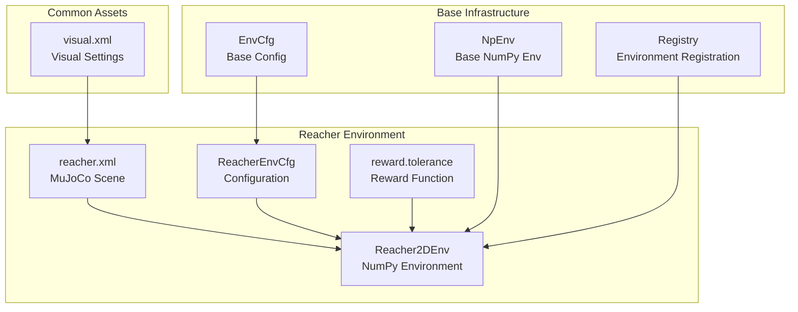
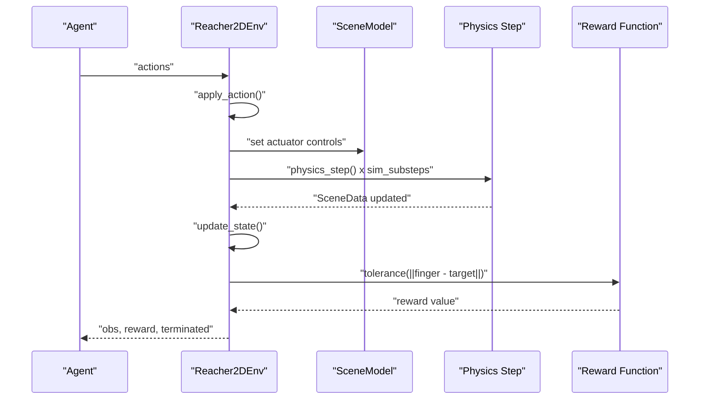
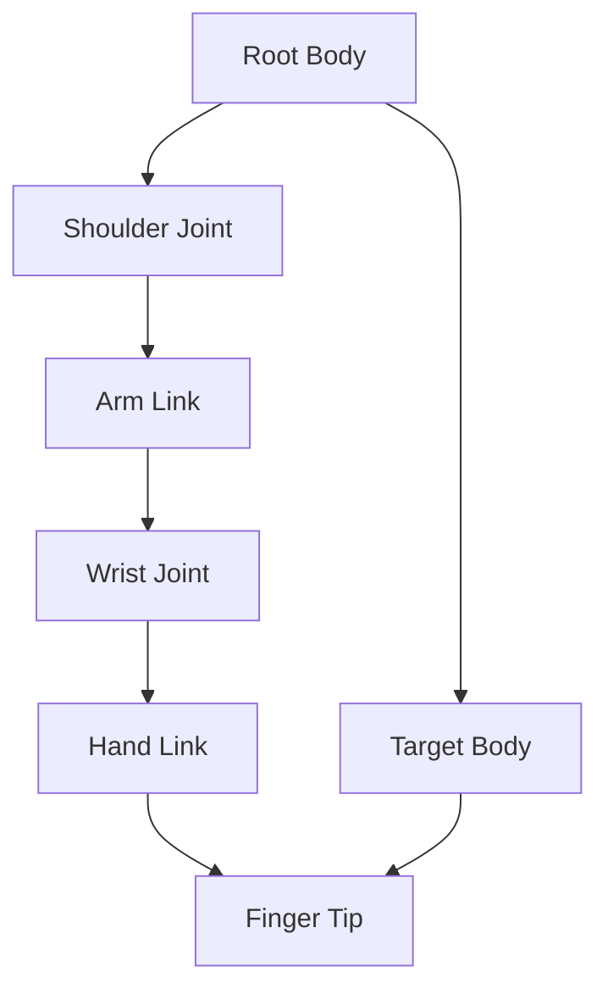
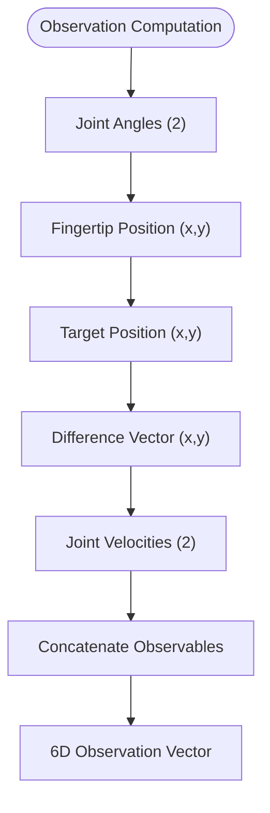
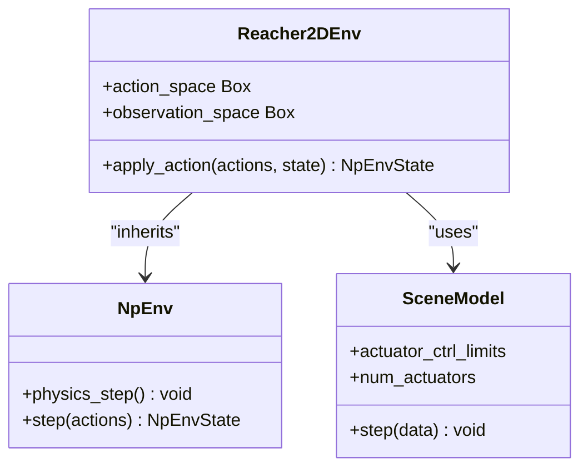
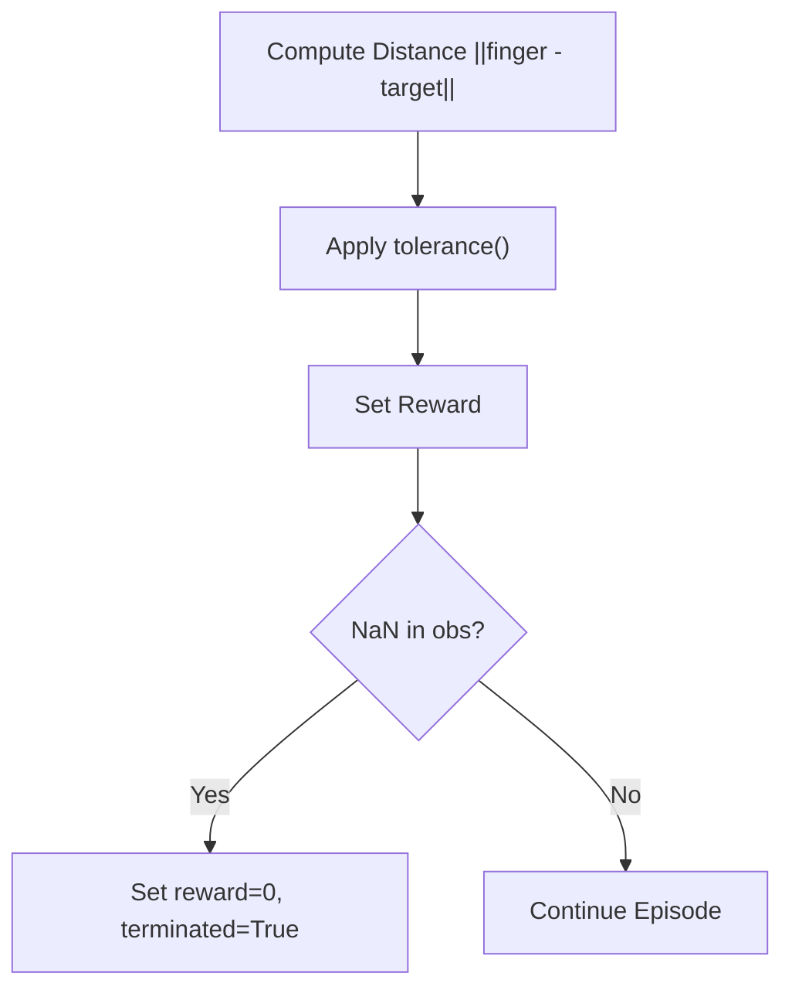
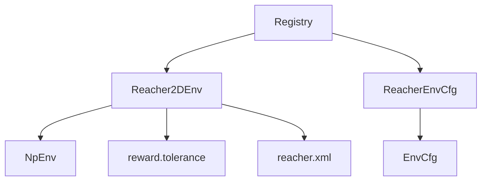

# Reacher Environment

<cite>
**Referenced Files in This Document**
- [reacher_np.py](file://motrix_envs/src/motrix_envs/basic/reacher/reacher_np.py)
- [cfg.py](file://motrix_envs/src/motrix_envs/basic/reacher/cfg.py)
- [reacher.xml](file://motrix_envs/src/motrix_envs/basic/reacher/reacher.xml)
- [env.py](file://motrix_envs/src/motrix_envs/np/env.py)
- [base.py](file://motrix_envs/src/motrix_envs/base.py)
- [reward.py](file://motrix_envs/src/motrix_envs/np/reward.py)
- [registry.py](file://motrix_envs/src/motrix_envs/registry.py)
- [visual.xml](file://motrix_envs/src/motrix_envs/common/visual.xml)
- [dm_reacher.md](file://docs/source/en/user_guide/demo/dm_reacher.md)
</cite>

## Table of Contents
1. [Introduction](#introduction)
2. [Project Structure](#project-structure)
3. [Core Components](#core-components)
4. [Architecture Overview](#architecture-overview)
5. [Detailed Component Analysis](#detailed-component-analysis)
6. [Dependency Analysis](#dependency-analysis)
7. [Performance Considerations](#performance-considerations)
8. [Troubleshooting Guide](#troubleshooting-guide)
9. [Conclusion](#conclusion)
10. [Appendices](#appendices)

## Introduction
This document provides comprehensive documentation for the Reacher environment designed for robotic arm reaching tasks. The environment simulates a two-link planar robotic arm with two revolute joints, where the goal is to move the end-effector (fingertip) as close as possible to a randomly generated target point. The documentation covers the articulated arm model, joint kinematics, target tracking mechanics, state and action spaces, reward function design, XML scene configuration, environment parameters, and NumPy implementation specifics. It also includes training approaches, parameter sensitivity analysis, performance metrics, and guidance for addressing common challenges such as obstacle avoidance and precise target positioning.

## Project Structure
The Reacher environment is implemented within the MotrixLab ecosystem, organized around a modular structure that separates configuration, simulation model, environment logic, and reward computation. The key files include the MuJoCo XML scene definition, environment configuration, NumPy-based environment implementation, and shared base classes for environment abstraction and reward shaping.

**Diagram sources**
- [cfg.py](file://motrix_envs/src/motrix_envs/basic/reacher/cfg.py#L25-L34)
- [reacher.xml](file://motrix_envs/src/motrix_envs/basic/reacher/reacher.xml#L1-L54)
- [reacher_np.py](file://motrix_envs/src/motrix_envs/basic/reacher/reacher_np.py#L27-L116)
- [env.py](file://motrix_envs/src/motrix_envs/np/env.py#L52-L209)
- [base.py](file://motrix_envs/src/motrix_envs/base.py#L23-L85)
- [reward.py](file://motrix_envs/src/motrix_envs/np/reward.py#L63-L84)
- [registry.py](file://motrix_envs/src/motrix_envs/registry.py#L24-L100)
- [visual.xml](file://motrix_envs/src/motrix_envs/common/visual.xml#L1-L8)

**Section sources**
- [cfg.py](file://motrix_envs/src/motrix_envs/basic/reacher/cfg.py#L1-L35)
- [reacher.xml](file://motrix_envs/src/motrix_envs/basic/reacher/reacher.xml#L1-L54)
- [reacher_np.py](file://motrix_envs/src/motrix_envs/basic/reacher/reacher_np.py#L1-L116)
- [env.py](file://motrix_envs/src/motrix_envs/np/env.py#L1-L209)
- [base.py](file://motrix_envs/src/motrix_envs/base.py#L1-L85)
- [reward.py](file://motrix_envs/src/motrix_envs/np/reward.py#L1-L84)
- [registry.py](file://motrix_envs/src/motrix_envs/registry.py#L1-L172)
- [visual.xml](file://motrix_envs/src/motrix_envs/common/visual.xml#L1-L8)

## Core Components
This section outlines the primary components that define the Reacher environment, including the environment configuration, the MuJoCo XML scene, the NumPy-based environment implementation, and the reward computation module.

- Environment Configuration (ReacherEnvCfg)
  - Defines model file path, simulation and control time steps, episode duration, rendering spacing, movement speed, and target size.
  - Provides derived properties for maximum episode steps and simulation substeps based on time step configuration.

- MuJoCo XML Scene (reacher.xml)
  - Specifies a two-link planar arm with two hinge joints and two motors.
  - Includes visual assets, default joint damping, motor torque limits, and a sliding target body with spherical geometry.
  - Sets up lighting, camera, and ground plane for the scene.

- NumPy Environment Implementation (Reacher2DEnv)
  - Inherits from NpEnv and implements observation space initialization, action space initialization, action application, state update, and reset logic.
  - Computes observations as a concatenation of joint positions, end-effector-to-target vector differences, and joint velocities.
  - Uses a tolerance-based reward function to encourage proximity to the target while handling NaN observations.

- Reward Function (tolerance)
  - Implements various sigmoid functions for smooth reward shaping based on distance to the target.
  - Supports configurable bounds, margin, sigmoid type, and value at margin.

- Base Classes and Registry
  - EnvCfg provides base configuration with validation and derived properties.
  - NpEnv manages environment lifecycle, physics stepping, and state transitions.
  - Registry handles environment registration and instantiation.

**Section sources**
- [cfg.py](file://motrix_envs/src/motrix_envs/basic/reacher/cfg.py#L25-L34)
- [reacher.xml](file://motrix_envs/src/motrix_envs/basic/reacher/reacher.xml#L1-L54)
- [reacher_np.py](file://motrix_envs/src/motrix_envs/basic/reacher/reacher_np.py#L27-L116)
- [reward.py](file://motrix_envs/src/motrix_envs/np/reward.py#L63-L84)
- [base.py](file://motrix_envs/src/motrix_envs/base.py#L23-L85)
- [env.py](file://motrix_envs/src/motrix_envs/np/env.py#L52-L209)
- [registry.py](file://motrix_envs/src/motrix_envs/registry.py#L24-L100)

## Architecture Overview
The Reacher environment follows a layered architecture:
- Configuration Layer: Defines environment parameters and derives derived quantities.
- Model Layer: Loads the MuJoCo scene and applies simulation options.
- Environment Layer: Manages state transitions, observation computation, reward calculation, and termination conditions.
- Reward Layer: Provides smooth reward shaping based on distance to target.

**Diagram sources**
- [reacher_np.py](file://motrix_envs/src/motrix_envs/basic/reacher/reacher_np.py#L60-L85)
- [env.py](file://motrix_envs/src/motrix_envs/np/env.py#L186-L208)
- [reward.py](file://motrix_envs/src/motrix_envs/np/reward.py#L63-L84)

## Detailed Component Analysis

### Articulated Arm Model and Joint Kinematics
The articulated arm model is defined in the MuJoCo XML scene:
- Two links connected by hinge joints: shoulder and wrist.
- Motors attached to each joint for torque control.
- End-effector is represented by a spherical geometry at the fingertip.
- Target body uses slide joints for independent x/y motion and a spherical geometry for visibility.

Key XML elements:
- Joint definitions with axis and damping.
- Motor definitions with gear and control range.
- Bodies for arm segments and fingertip.
- Target body with slide joints and site for visualization.

**Diagram sources**
- [reacher.xml](file://motrix_envs/src/motrix_envs/basic/reacher/reacher.xml#L29-L47)

**Section sources**
- [reacher.xml](file://motrix_envs/src/motrix_envs/basic/reacher/reacher.xml#L1-L54)

### State Space Definition
The observation space combines:
- Joint positions (qpos): two hinge joint angles.
- End-effector to target vector difference: x and y components.
- Joint velocities (qvel): two angular velocities.

Dimensions:
- Observation space: 6-dimensional vector (2 joint angles + 2 differences + 2 joint velocities).

Implementation details:
- Observation concatenation performed in the environment's observation getter.
- Vectorized computation across multiple environments.

**Diagram sources**
- [reacher_np.py](file://motrix_envs/src/motrix_envs/basic/reacher/reacher_np.py#L64-L69)

**Section sources**
- [reacher_np.py](file://motrix_envs/src/motrix_envs/basic/reacher/reacher_np.py#L44-L70)
- [dm_reacher.md](file://docs/source/en/user_guide/demo/dm_reacher.md#L37-L58)

### Action Space and Control Mechanics
Actions represent joint torques applied to the shoulder and wrist motors:
- Action space: Box(-1.0, 1.0, (2,), float32).
- Each action corresponds to torque applied to a hinge joint.
- Actuator controls are set directly in the environment's apply_action method.

Control parameters:
- Control time step (ctrl_dt) and simulation time step (sim_dt) determine physics substeps.
- Motor gear and control range are defined in the XML.

**Diagram sources**
- [reacher_np.py](file://motrix_envs/src/motrix_envs/basic/reacher/reacher_np.py#L52-L62)
- [env.py](file://motrix_envs/src/motrix_envs/np/env.py#L186-L208)

**Section sources**
- [reacher_np.py](file://motrix_envs/src/motrix_envs/basic/reacher/reacher_np.py#L48-L62)
- [reacher.xml](file://motrix_envs/src/motrix_envs/basic/reacher/reacher.xml#L10-L13)
- [dm_reacher.md](file://docs/source/en/user_guide/demo/dm_reacher.md#L21-L34)

### Reward Function and Completion Criteria
Reward computation:
- Distance-based reward using a tolerance function that decreases smoothly with distance.
- Target size defines the proximity threshold for maximum reward.
- Termination occurs if NaN appears in observations; reward is set to zero and episode ends.

**Diagram sources**
- [reacher_np.py](file://motrix_envs/src/motrix_envs/basic/reacher/reacher_np.py#L71-L85)
- [reward.py](file://motrix_envs/src/motrix_envs/np/reward.py#L63-L84)

**Section sources**
- [reacher_np.py](file://motrix_envs/src/motrix_envs/basic/reacher/reacher_np.py#L71-L85)
- [reward.py](file://motrix_envs/src/motrix_envs/np/reward.py#L63-L84)
- [dm_reacher.md](file://docs/source/en/user_guide/demo/dm_reacher.md#L61-L96)

### XML Scene Configuration and Visual Settings
The XML scene includes:
- Scene options with timestep and contact flag.
- Default joint and motor settings.
- Asset definitions for textures and materials.
- Worldbody with light, camera, ground plane, arm bodies, and target body.
- Actuator definitions for motors.

Visual settings are configured via an included visual XML asset.

**Section sources**
- [reacher.xml](file://motrix_envs/src/motrix_envs/basic/reacher/reacher.xml#L1-L54)
- [visual.xml](file://motrix_envs/src/motrix_envs/common/visual.xml#L1-L8)

### Environment Parameters and Initialization
Environment configuration parameters:
- model_file: Path to the MuJoCo XML scene.
- max_episode_seconds: Maximum episode duration.
- render_spacing: Spacing for rendering multiple environments.
- sim_dt: Simulation timestep.
- move_speed: Movement speed parameter.
- ctrl_dt: Control timestep.
- target_size: Size of the target sphere.

Initialization behavior:
- Resets joint positions to random angles.
- Randomizes target positions within specified bounds.
- Computes forward kinematics to update end-effector and target poses.

**Section sources**
- [cfg.py](file://motrix_envs/src/motrix_envs/basic/reacher/cfg.py#L25-L34)
- [reacher_np.py](file://motrix_envs/src/motrix_envs/basic/reacher/reacher_np.py#L87-L115)

### NumPy Implementation Specifics
Key implementation aspects:
- Vectorized operations across multiple environments.
- Physics substeps computed from control and simulation timesteps.
- State management with observation, reward, termination, and info dictionaries.
- Forward kinematics for computing end-effector and target positions.

**Section sources**
- [reacher_np.py](file://motrix_envs/src/motrix_envs/basic/reacher/reacher_np.py#L1-L116)
- [env.py](file://motrix_envs/src/motrix_envs/np/env.py#L52-L209)
- [base.py](file://motrix_envs/src/motrix_envs/base.py#L23-L85)

## Dependency Analysis
The environment relies on a clear separation of concerns:
- Configuration depends on base EnvCfg and registry decorators.
- Environment depends on the NumPy environment base class and reward utilities.
- MuJoCo scene provides the physical model and assets.
- Registry enables environment discovery and instantiation.

**Diagram sources**
- [cfg.py](file://motrix_envs/src/motrix_envs/basic/reacher/cfg.py#L25-L34)
- [reacher_np.py](file://motrix_envs/src/motrix_envs/basic/reacher/reacher_np.py#L27-L116)
- [env.py](file://motrix_envs/src/motrix_envs/np/env.py#L52-L209)
- [registry.py](file://motrix_envs/src/motrix_envs/registry.py#L24-L100)

**Section sources**
- [cfg.py](file://motrix_envs/src/motrix_envs/basic/reacher/cfg.py#L25-L34)
- [reacher_np.py](file://motrix_envs/src/motrix_envs/basic/reacher/reacher_np.py#L27-L116)
- [env.py](file://motrix_envs/src/motrix_envs/np/env.py#L52-L209)
- [registry.py](file://motrix_envs/src/motrix_envs/registry.py#L24-L100)

## Performance Considerations
- Simulation and control timesteps: Ensure sim_dt ≤ ctrl_dt; derived sim_substeps determines physics substeps per control step.
- Episode length: Controlled by max_episode_seconds and ctrl_dt; affects training stability and convergence.
- Vectorization: Multiple environments processed in parallel; tune num_envs for throughput vs. memory.
- Reward shaping: Use tolerance function with appropriate margin and sigmoid type to balance exploration and exploitation.
- Rendering: render_spacing affects visualization overhead; adjust for training vs. evaluation scenarios.

[No sources needed since this section provides general guidance]

## Troubleshooting Guide
Common issues and resolutions:
- NaN observations leading to early termination: Verify numerical stability in forward kinematics and ensure valid joint limits.
- Sparse rewards: Adjust target size and reward scaling to improve learning signal.
- Instability: Reduce control timestep or increase simulation damping in the XML defaults.
- Slow convergence: Increase number of environments or adjust learning rate and network architecture.

**Section sources**
- [reacher_np.py](file://motrix_envs/src/motrix_envs/basic/reacher/reacher_np.py#L71-L85)
- [reacher.xml](file://motrix_envs/src/motrix_envs/basic/reacher/reacher.xml#L10-L13)
- [base.py](file://motrix_envs/src/motrix_envs/base.py#L53-L59)

## Conclusion
The Reacher environment provides a compact yet expressive platform for robotic arm reaching tasks. Its modular design integrates configuration, simulation, environment logic, and reward computation, enabling efficient training and evaluation. By leveraging vectorized execution, smooth reward shaping, and a well-defined state/action representation, the environment supports rapid prototyping and deployment of reinforcement learning policies for reaching tasks.

[No sources needed since this section summarizes without analyzing specific files]

## Appendices

### Training Approaches for Different Reaching Tasks
- Baseline training: Use default configuration and standard PPO hyperparameters.
- Parameter sensitivity analysis: Vary sim_dt, ctrl_dt, target_size, and move_speed to assess impact on convergence and performance.
- Multi-task scenarios: Modify target placement distribution or introduce dynamic targets to increase task difficulty.
- Evaluation metrics: Track mean distance to target, success rate, and training throughput.

[No sources needed since this section provides general guidance]

### Parameter Sensitivity Analysis
- Simulation timestep (sim_dt): Affects numerical stability and computational cost.
- Control timestep (ctrl_dt): Impacts temporal resolution and policy responsiveness.
- Target size (target_size): Controls reward granularity and target acquisition difficulty.
- Episode duration (max_episode_seconds): Balances exploration time and training efficiency.

**Section sources**
- [cfg.py](file://motrix_envs/src/motrix_envs/basic/reacher/cfg.py#L25-L34)
- [base.py](file://motrix_envs/src/motrix_envs/base.py#L37-L51)

### Performance Metrics
- Mean distance to target: Average L2 distance between fingertip and target across episodes.
- Success rate: Percentage of episodes where fingertip remains within target radius.
- Training throughput: Steps per second achieved with vectorized environments.
- Stability indicators: Frequency of NaN observations and reward variance.

[No sources needed since this section provides general guidance]

### Obstacle Avoidance and Precise Target Positioning
- Obstacle avoidance: Introduce static or dynamic obstacles in the scene and modify reward to penalize collisions.
- Precise positioning: Reduce target size and refine reward margins; consider curriculum learning with progressive difficulty.
- Smoothness: Incorporate action penalty or velocity regularization to reduce oscillations.

[No sources needed since this section provides general guidance]