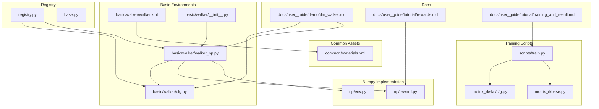
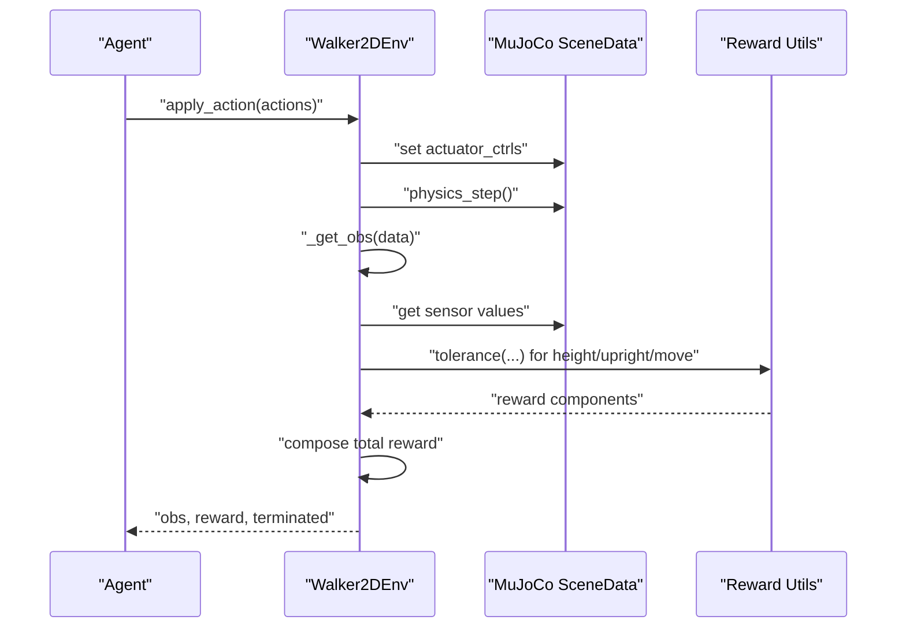
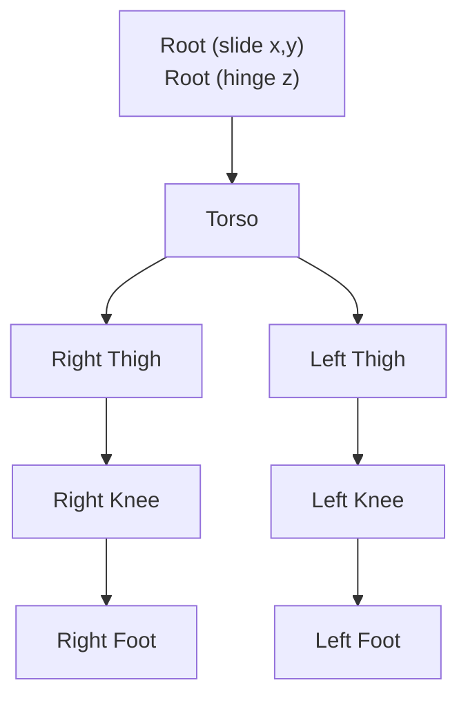
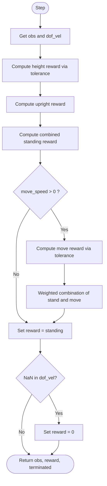
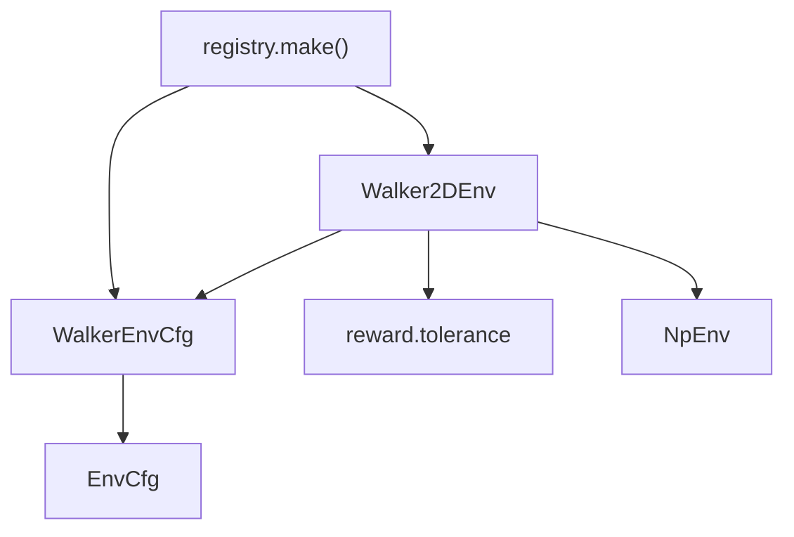

# Walker Environment

<cite>
**Referenced Files in This Document**
- [walker_np.py](file://motrix_envs/src/motrix_envs/basic/walker/walker_np.py)
- [cfg.py](file://motrix_envs/src/motrix_envs/basic/walker/cfg.py)
- [walker.xml](file://motrix_envs/src/motrix_envs/basic/walker/walker.xml)
- [materials.xml](file://motrix_envs/src/motrix_envs/common/materials.xml)
- [reward.py](file://motrix_envs/src/motrix_envs/np/reward.py)
- [base.py](file://motrix_envs/src/motrix_envs/base.py)
- [registry.py](file://motrix_envs/src/motrix_envs/registry.py)
- [dm_walker.md](file://docs/source/en/user_guide/demo/dm_walker.md)
- [training_and_result.md](file://docs/source/en/user_guide/tutorial/training_and_result.md)
- [rewards.md](file://docs/source/en/user_guide/tutorial/rewards.md)
- [train.py](file://scripts/train.py)
- [cfg.py](file://motrix_rl/src/motrix_rl/skrl/cfg.py)
- [base.py](file://motrix_rl/src/motrix_rl/base.py)
</cite>

## Table of Contents
1. [Introduction](#introduction)
2. [Project Structure](#project-structure)
3. [Core Components](#core-components)
4. [Architecture Overview](#architecture-overview)
5. [Detailed Component Analysis](#detailed-component-analysis)
6. [Dependency Analysis](#dependency-analysis)
7. [Performance Considerations](#performance-considerations)
8. [Troubleshooting Guide](#troubleshooting-guide)
9. [Conclusion](#conclusion)
10. [Appendices](#appendices)

## Introduction
This document provides comprehensive documentation for the Walker environment focused on bipedal locomotion simulation. It explains the humanoid-like robot model, joint configurations, and ground contact mechanics. It documents the state space (including joint angles, velocities, and body positions), the action space for hip/knee actuators, and the reward function emphasizing forward velocity, energy efficiency, and stability penalties. It also covers XML scene setup, configuration parameters, and numpy implementation specifics, along with training strategies, hyperparameter tuning guidelines, and comparisons with other locomotion baselines. Finally, it addresses common issues such as falling prevention and gait stabilization.

## Project Structure
The Walker environment is implemented as part of the MotrixLab-S1 repository under the basic environments module. The key files include the environment implementation, configuration, MuJoCo XML scene definition, and reward utilities.

**Diagram sources**
- [walker.xml](file://motrix_envs/src/motrix_envs/basic/walker/walker.xml#L1-L80)
- [cfg.py](file://motrix_envs/src/motrix_envs/basic/walker/cfg.py#L25-L46)
- [walker_np.py](file://motrix_envs/src/motrix_envs/basic/walker/walker_np.py#L26-L156)
- [materials.xml](file://motrix_envs/src/motrix_envs/common/materials.xml#L1-L24)
- [reward.py](file://motrix_envs/src/motrix_envs/np/reward.py#L63-L84)
- [registry.py](file://motrix_envs/src/motrix_envs/registry.py#L114-L161)
- [base.py](file://motrix_envs/src/motrix_envs/base.py#L23-L52)
- [dm_walker.md](file://docs/source/en/user_guide/demo/dm_walker.md#L1-L108)
- [rewards.md](file://docs/source/en/user_guide/tutorial/rewards.md#L1-L51)
- [training_and_result.md](file://docs/source/en/user_guide/tutorial/training_and_result.md#L1-L93)
- [train.py](file://scripts/train.py#L52-L95)
- [cfg.py](file://motrix_rl/src/motrix_rl/skrl/cfg.py#L28-L74)
- [base.py](file://motrix_rl/src/motrix_rl/base.py#L20-L43)

**Section sources**
- [walker_np.py](file://motrix_envs/src/motrix_envs/basic/walker/walker_np.py#L26-L156)
- [cfg.py](file://motrix_envs/src/motrix_envs/basic/walker/cfg.py#L25-L46)
- [walker.xml](file://motrix_envs/src/motrix_envs/basic/walker/walker.xml#L1-L80)
- [materials.xml](file://motrix_envs/src/motrix_envs/common/materials.xml#L1-L24)
- [reward.py](file://motrix_envs/src/motrix_envs/np/reward.py#L63-L84)
- [registry.py](file://motrix_envs/src/motrix_envs/registry.py#L114-L161)
- [base.py](file://motrix_envs/src/motrix_envs/base.py#L23-L52)
- [dm_walker.md](file://docs/source/en/user_guide/demo/dm_walker.md#L1-L108)
- [rewards.md](file://docs/source/en/user_guide/tutorial/rewards.md#L1-L51)
- [training_and_result.md](file://docs/source/en/user_guide/tutorial/training_and_result.md#L1-L93)
- [train.py](file://scripts/train.py#L52-L95)
- [cfg.py](file://motrix_rl/src/motrix_rl/skrl/cfg.py#L28-L74)
- [base.py](file://motrix_rl/src/motrix_rl/base.py#L20-L43)

## Core Components
- Environment class: Walker2DEnv inherits from NpEnv and implements the Walker environment logic.
- Configuration: WalkerEnvCfg defines environment parameters such as model file, simulation timestep, control timestep, maximum episode duration, and target move speed.
- Scene definition: walker.xml specifies the MuJoCo model with links, joints, actuators, sensors, and ground contact.
- Reward utilities: reward.tolerance provides smooth reward shaping for constraints.
- Registry: registration decorators bind environment names to configuration and implementation classes.

Key implementation references:
- Environment class and methods: [walker_np.py](file://motrix_envs/src/motrix_envs/basic/walker/walker_np.py#L26-L156)
- Configuration classes: [cfg.py](file://motrix_envs/src/motrix_envs/basic/walker/cfg.py#L25-L46)
- MuJoCo XML scene: [walker.xml](file://motrix_envs/src/motrix_envs/basic/walker/walker.xml#L1-L80)
- Reward tolerance function: [reward.py](file://motrix_envs/src/motrix_envs/np/reward.py#L63-L84)
- Registry and environment creation: [registry.py](file://motrix_envs/src/motrix_envs/registry.py#L114-L161)

**Section sources**
- [walker_np.py](file://motrix_envs/src/motrix_envs/basic/walker/walker_np.py#L26-L156)
- [cfg.py](file://motrix_envs/src/motrix_envs/basic/walker/cfg.py#L25-L46)
- [walker.xml](file://motrix_envs/src/motrix_envs/basic/walker/walker.xml#L1-L80)
- [reward.py](file://motrix_envs/src/motrix_envs/np/reward.py#L63-L84)
- [registry.py](file://motrix_envs/src/motrix_envs/registry.py#L114-L161)

## Architecture Overview
The Walker environment integrates a MuJoCo-based physics simulation with a Gymnasium-compatible numpy environment. The environment exposes observation and action spaces, applies actions to actuators, simulates physics, computes observations and rewards, and manages termination conditions.

**Diagram sources**
- [walker_np.py](file://motrix_envs/src/motrix_envs/basic/walker/walker_np.py#L68-L131)
- [reward.py](file://motrix_envs/src/motrix_envs/np/reward.py#L63-L84)

**Section sources**
- [walker_np.py](file://motrix_envs/src/motrix_envs/basic/walker/walker_np.py#L68-L131)
- [reward.py](file://motrix_envs/src/motrix_envs/np/reward.py#L63-L84)

## Detailed Component Analysis

### Humanoid Robot Model and Joint Configuration
The Walker model is a planar biped with the following key components:
- Root degrees of freedom: slide in x/y and hinge in z (floating base).
- Torso: central body segment.
- Right leg: right_hip -> right_knee -> right_ankle.
- Left leg: left_hip -> left_knee -> left_ankle.
- Sensors: subtreelinvel for torso linear velocity.
- Actuators: motors for each hip, knee, and ankle with configurable gear ratios.

**Diagram sources**
- [walker.xml](file://motrix_envs/src/motrix_envs/basic/walker/walker.xml#L36-L65)

**Section sources**
- [walker.xml](file://motrix_envs/src/motrix_envs/basic/walker/walker.xml#L36-L65)

### Ground Contact Mechanics
Ground contact is modeled via a plane geom named “floor” with specified friction parameters. Materials and textures are included from common assets.

- Floor geometry: plane with z-axis pointing upward.
- Friction: configured via default geom settings.
- Visual materials: grid and self materials defined centrally.

**Section sources**
- [walker.xml](file://motrix_envs/src/motrix_envs/basic/walker/walker.xml#L33-L35)
- [materials.xml](file://motrix_envs/src/motrix_envs/common/materials.xml#L7-L23)

### State Space Definition
The observation space concatenates:
- Orientation features: for each link except the root, two orientation components are included.
- Torso upright component: extracted from the torso rotation matrix.
- Velocity features: generalized velocities for all DOFs.

Implementation details:
- Observation dimension computed from model metadata.
- Orientation features derived from link rotation matrices.
- Upright component extracted from torso rotation.
- Velocity features from scene data.

**Section sources**
- [walker_np.py](file://motrix_envs/src/motrix_envs/basic/walker/walker_np.py#L42-L48)
- [walker_np.py](file://motrix_envs/src/motrix_envs/basic/walker/walker_np.py#L72-L79)
- [walker_np.py](file://motrix_envs/src/motrix_envs/basic/walker/walker_np.py#L89-L92)

### Action Space and Actuators
- Action space: continuous box matching actuator control limits.
- Actuators: motors for right/left hip, knee, and ankle with gear multipliers.
- Control application: actions are directly assigned to actuator controls.

**Section sources**
- [walker_np.py](file://motrix_envs/src/motrix_envs/basic/walker/walker_np.py#L50-L58)
- [walker_np.py](file://motrix_envs/src/motrix_envs/basic/walker/walker_np.py#L68-L70)
- [walker.xml](file://motrix_envs/src/motrix_envs/basic/walker/walker.xml#L72-L79)

### Reward Function
The reward function balances standing stability and forward motion:
- Height reward: tolerance around target stand height.
- Upright reward: normalized torso upright component.
- Combined standing reward: weighted average of height and upright.
- Movement reward (when move_speed > 0): tolerance around target horizontal velocity with linear sigmoid.
- Final reward: standing reward scaled by movement weight when moving.

**Diagram sources**
- [walker_np.py](file://motrix_envs/src/motrix_envs/basic/walker/walker_np.py#L97-L131)
- [reward.py](file://motrix_envs/src/motrix_envs/np/reward.py#L63-L84)

**Section sources**
- [walker_np.py](file://motrix_envs/src/motrix_envs/basic/walker/walker_np.py#L97-L131)
- [reward.py](file://motrix_envs/src/motrix_envs/np/reward.py#L63-L84)

### Termination Conditions
- Episode terminates if generalized velocities contain NaN values.
- Reward is zeroed out for terminated episodes.

**Section sources**
- [walker_np.py](file://motrix_envs/src/motrix_envs/basic/walker/walker_np.py#L95-L96)
- [walker_np.py](file://motrix_envs/src/motrix_envs/basic/walker/walker_np.py#L125-L126)

### XML Scene Setup and Configuration Parameters
- Model file path: configured in the environment configuration class.
- Simulation parameters: sim_dt, ctrl_dt, max_episode_seconds.
- Target move speed: controls whether movement reward is active.
- Stand height: target torso height for stability reward.

Environment modes:
- dm-stander: move_speed = 0.0 (static standing).
- dm-walker: move_speed = 1.0 (walking).
- dm-runner: move_speed = 5.0 (running).

**Section sources**
- [cfg.py](file://motrix_envs/src/motrix_envs/basic/walker/cfg.py#L22-L33)
- [cfg.py](file://motrix_envs/src/motrix_envs/basic/walker/cfg.py#L36-L46)
- [base.py](file://motrix_envs/src/motrix_envs/base.py#L37-L51)

### Numpy Implementation Specifics
- Observation computation uses link rotation matrices and sensor values.
- Actions are applied directly to actuator controls.
- Reward composition uses the tolerance utility for smooth constraints.
- Reset initializes random root yaw and joint positions within limits.

**Section sources**
- [walker_np.py](file://motrix_envs/src/motrix_envs/basic/walker/walker_np.py#L72-L79)
- [walker_np.py](file://motrix_envs/src/motrix_envs/basic/walker/walker_np.py#L68-L70)
- [walker_np.py](file://motrix_envs/src/motrix_envs/basic/walker/walker_np.py#L133-L155)

### Training Strategies and Hyperparameter Tuning Guidelines
- Backend selection: automatic detection prefers GPU-enabled backends; JAX and Torch are supported.
- Parallel environments: num_envs can be tuned for throughput vs. stability.
- Environment-specific backend configs: different mini_batches and learning_epochs for JAX vs. Torch.
- Reward shaping: adjust rewards_shaper_scale and component weights for stability and speed.

Training command references:
- Basic training: [training_and_result.md](file://docs/source/en/user_guide/tutorial/training_and_result.md#L9-L19)
- Backend-specific configs: [training_and_result.md](file://docs/source/en/user_guide/tutorial/training_and_result.md#L38-L47)
- Reward function position: [rewards.md](file://docs/source/en/user_guide/tutorial/rewards.md#L7-L29)

**Section sources**
- [train.py](file://scripts/train.py#L39-L88)
- [training_and_result.md](file://docs/source/en/user_guide/tutorial/training_and_result.md#L34-L47)
- [rewards.md](file://docs/source/en/user_guide/tutorial/rewards.md#L7-L29)
- [cfg.py](file://motrix_rl/src/motrix_rl/skrl/cfg.py#L28-L74)
- [base.py](file://motrix_rl/src/motrix_rl/base.py#L20-L43)

### Comparison with Other Locomotion Baselines
- The Walker environment aligns with the DeepMind Control Suite Walker2D task, emphasizing standing, walking, and running behaviors.
- Expected results: standing height range, walking speed near 1.0 m/s, running speed near 5.0 m/s.

**Section sources**
- [dm_walker.md](file://docs/source/en/user_guide/demo/dm_walker.md#L96-L108)

## Dependency Analysis
The environment relies on:
- Registry for environment registration and instantiation.
- Base configuration and environment abstractions.
- Reward utilities for constraint shaping.
- MuJoCo scene data for physics simulation and sensor readings.

**Diagram sources**
- [cfg.py](file://motrix_envs/src/motrix_envs/basic/walker/cfg.py#L25-L46)
- [walker_np.py](file://motrix_envs/src/motrix_envs/basic/walker/walker_np.py#L26-L156)
- [reward.py](file://motrix_envs/src/motrix_envs/np/reward.py#L63-L84)
- [registry.py](file://motrix_envs/src/motrix_envs/registry.py#L114-L161)
- [base.py](file://motrix_envs/src/motrix_envs/base.py#L23-L52)

**Section sources**
- [cfg.py](file://motrix_envs/src/motrix_envs/basic/walker/cfg.py#L25-L46)
- [walker_np.py](file://motrix_envs/src/motrix_envs/basic/walker/walker_np.py#L26-L156)
- [reward.py](file://motrix_envs/src/motrix_envs/np/reward.py#L63-L84)
- [registry.py](file://motrix_envs/src/motrix_envs/registry.py#L114-L161)
- [base.py](file://motrix_envs/src/motrix_envs/base.py#L23-L52)

## Performance Considerations
- Simulation step configuration: sim_dt and ctrl_dt define simulation substeps and control intervals.
- Vectorization: increasing num_envs improves throughput but may require careful reward scaling.
- Backend selection: GPU-enabled backends (JAX/Torch) accelerate training; automatic selection prefers GPU availability.
- Reward shaping: smooth tolerances reduce reward variance and improve learning stability.

[No sources needed since this section provides general guidance]

## Troubleshooting Guide
Common issues and remedies:
- Falling prevention:
  - Monitor torso height and upright components; adjust stand_height and reward weights to encourage stability.
  - Ensure reward tolerance margins are appropriate to avoid oscillatory behavior.
- Gait stabilization:
  - Verify joint limits and initial joint positions during reset.
  - Confirm actuator gear ratios and control ranges are suitable for the task.
- Numerical stability:
  - Watch for NaN velocities indicating joint limit violations or numerical drift; terminate episodes accordingly.
- Reward debugging:
  - Use info outputs to inspect decomposed reward components and adjust weights.

**Section sources**
- [walker_np.py](file://motrix_envs/src/motrix_envs/basic/walker/walker_np.py#L95-L96)
- [walker_np.py](file://motrix_envs/src/motrix_envs/basic/walker/walker_np.py#L108-L113)
- [walker_np.py](file://motrix_envs/src/motrix_envs/basic/walker/walker_np.py#L133-L155)

## Conclusion
The Walker environment provides a robust, configurable platform for bipedal locomotion research. Its planar design simplifies control while retaining essential biomechanical challenges. The environment’s reward function emphasizes stability and forward motion, with clear separation of concerns enabling easy tuning. With proper configuration and training strategies, it serves as an excellent baseline for comparing control methods and developing advanced locomotion policies.

[No sources needed since this section summarizes without analyzing specific files]

## Appendices

### Appendix A: Environment Modes and Commands
- dm-stander: static standing mode.
- dm-walker: walking mode with move_speed = 1.0.
- dm-runner: running mode with move_speed = 5.0.

Quick commands:
- Preview: [dm_walker.md](file://docs/source/en/user_guide/demo/dm_walker.md#L48-L52)
- Train: [dm_walker.md](file://docs/source/en/user_guide/demo/dm_walker.md#L54-L60)
- Monitor: [dm_walker.md](file://docs/source/en/user_guide/demo/dm_walker.md#L63-L74)

**Section sources**
- [dm_walker.md](file://docs/source/en/user_guide/demo/dm_walker.md#L24-L74)