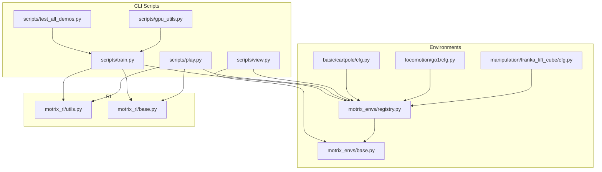
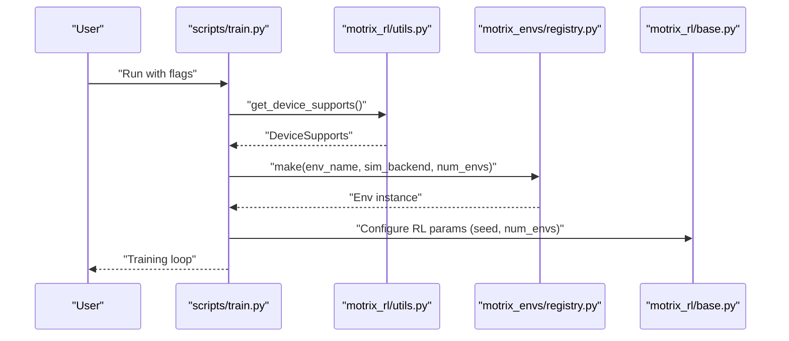
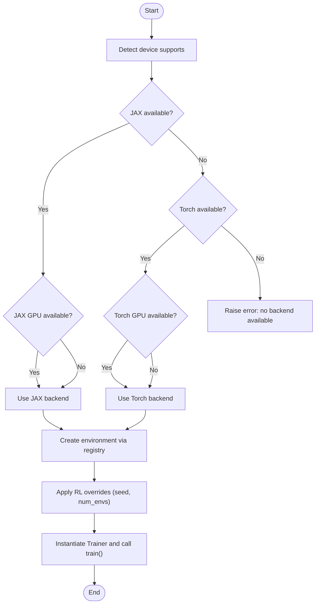
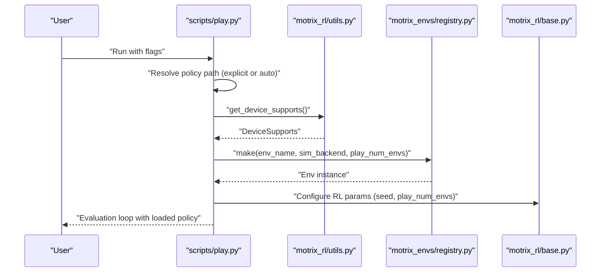
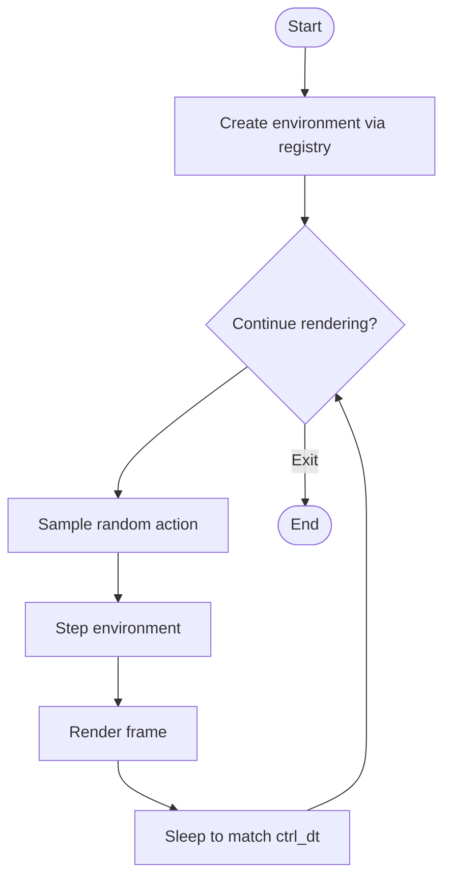
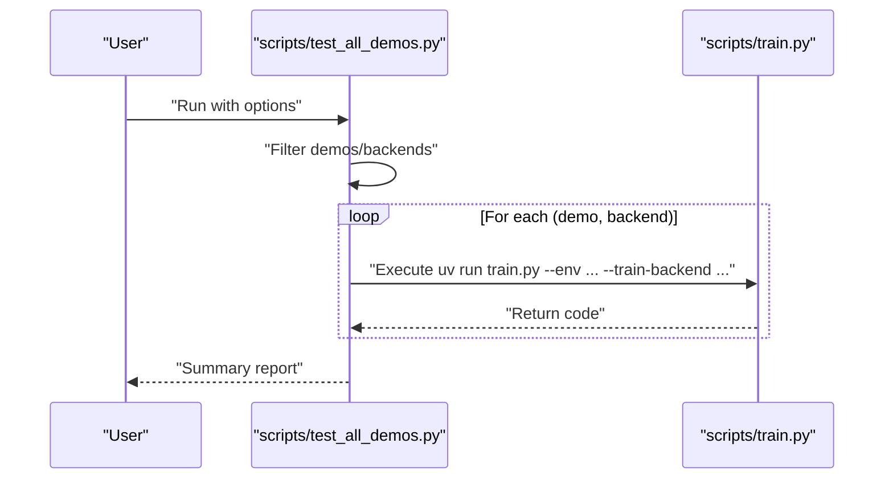
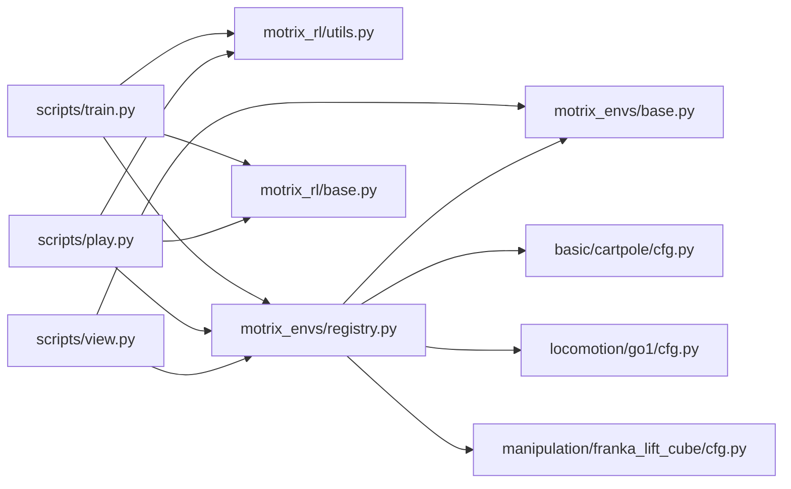

# Command-line Tools

<cite>
**Referenced Files in This Document**
- [scripts/train.py](file://scripts/train.py)
- [scripts/play.py](file://scripts/play.py)
- [scripts/view.py](file://scripts/view.py)
- [scripts/test_all_demos.py](file://scripts/test_all_demos.py)
- [scripts/gpu_utils.py](file://scripts/gpu_utils.py)
- [motrix_rl/src/motrix_rl/utils.py](file://motrix_rl/src/motrix_rl/utils.py)
- [motrix_envs/src/motrix_envs/registry.py](file://motrix_envs/src/motrix_envs/registry.py)
- [motrix_envs/src/motrix_envs/base.py](file://motrix_envs/src/motrix_envs/base.py)
- [motrix_rl/src/motrix_rl/base.py](file://motrix_rl/src/motrix_rl/base.py)
- [motrix_envs/src/motrix_envs/basic/cartpole/cfg.py](file://motrix_envs/src/motrix_envs/basic/cartpole/cfg.py)
- [motrix_envs/src/motrix_envs/locomotion/go1/cfg.py](file://motrix_envs/src/motrix_envs/locomotion/go1/cfg.py)
- [motrix_envs/src/motrix_envs/manipulation/franka_lift_cube/cfg.py](file://motrix_envs/src/motrix_envs/manipulation/franka_lift_cube/cfg.py)
</cite>

## Table of Contents
1. [Introduction](#introduction)
2. [Project Structure](#project-structure)
3. [Core Components](#core-components)
4. [Architecture Overview](#architecture-overview)
5. [Detailed Component Analysis](#detailed-component-analysis)
6. [Dependency Analysis](#dependency-analysis)
7. [Performance Considerations](#performance-considerations)
8. [Troubleshooting Guide](#troubleshooting-guide)
9. [Conclusion](#conclusion)
10. [Appendices](#appendices)

## Introduction
This document describes the command-line tools for training, visualization, inference, and automated validation of physics-based environments. It covers:
- Training script with parameter configuration, environment selection, and experiment management
- Play script for model inference and evaluation
- View script for environment visualization
- Test script for automated environment validation across demos
- GPU utility functions for hardware detection and resource monitoring
It also provides usage examples, parameter descriptions, and integration workflows for quick experimentation, batch training, and performance analysis.

## Project Structure
The command-line tools live under the scripts directory and integrate with environment and RL libraries:
- scripts/train.py: Training entry point with automatic backend selection and experiment configuration
- scripts/play.py: Inference entry point with policy discovery and backend matching
- scripts/view.py: Visualization entry point for environment inspection
- scripts/test_all_demos.py: Automated batch validation across environments and backends
- scripts/gpu_utils.py: GPU monitoring utilities for performance analysis
- Environment registry and base classes define environment creation and configuration
- RL base configuration defines training parameters

**Diagram sources**
- [scripts/train.py](file://scripts/train.py#L1-L95)
- [scripts/play.py](file://scripts/play.py#L1-L162)
- [scripts/view.py](file://scripts/view.py#L1-L83)
- [scripts/test_all_demos.py](file://scripts/test_all_demos.py#L1-L159)
- [scripts/gpu_utils.py](file://scripts/gpu_utils.py#L1-L41)
- [motrix_envs/src/motrix_envs/registry.py](file://motrix_envs/src/motrix_envs/registry.py#L1-L172)
- [motrix_envs/src/motrix_envs/base.py](file://motrix_envs/src/motrix_envs/base.py#L1-L85)
- [motrix_rl/src/motrix_rl/utils.py](file://motrix_rl/src/motrix_rl/utils.py#L1-L62)
- [motrix_rl/src/motrix_rl/base.py](file://motrix_rl/src/motrix_rl/base.py#L1-L43)
- [motrix_envs/src/motrix_envs/basic/cartpole/cfg.py](file://motrix_envs/src/motrix_envs/basic/cartpole/cfg.py#L1-L32)
- [motrix_envs/src/motrix_envs/locomotion/go1/cfg.py](file://motrix_envs/src/motrix_envs/locomotion/go1/cfg.py#L1-L188)
- [motrix_envs/src/motrix_envs/manipulation/franka_lift_cube/cfg.py](file://motrix_envs/src/motrix_envs/manipulation/franka_lift_cube/cfg.py#L1-L84)

**Section sources**
- [scripts/train.py](file://scripts/train.py#L1-L95)
- [scripts/play.py](file://scripts/play.py#L1-L162)
- [scripts/view.py](file://scripts/view.py#L1-L83)
- [scripts/test_all_demos.py](file://scripts/test_all_demos.py#L1-L159)
- [scripts/gpu_utils.py](file://scripts/gpu_utils.py#L1-L41)
- [motrix_envs/src/motrix_envs/registry.py](file://motrix_envs/src/motrix_envs/registry.py#L1-L172)
- [motrix_envs/src/motrix_envs/base.py](file://motrix_envs/src/motrix_envs/base.py#L1-L85)
- [motrix_rl/src/motrix_rl/utils.py](file://motrix_rl/src/motrix_rl/utils.py#L1-L62)
- [motrix_rl/src/motrix_rl/base.py](file://motrix_rl/src/motrix_rl/base.py#L1-L43)

## Core Components
- Training script (train.py)
  - Parameters: env, sim-backend, num-envs, render, train-backend, seed, rand-seed
  - Behavior: Detects device capabilities, selects backend automatically or via flag, constructs RL trainer, and starts training
- Play script (play.py)
  - Parameters: env, sim-backend, policy, num-envs, seed, rand-seed
  - Behavior: Auto-discovers best policy for the environment or loads a specified policy, matches backend to policy type, and runs evaluation
- View script (view.py)
  - Parameters: env, sim-backend, num-envs
  - Behavior: Creates environment instance, runs random actions loop, renders frames at environment rate
- Test script (test_all_demos.py)
  - Parameters: demos, backends, extra-args, stop-on-error
  - Behavior: Iterates over demos and backends, invoking train.py for each combination and reporting results
- GPU utilities (gpu_utils.py)
  - Function: monitor_gpu_utilization(stop_event, gpu_index, interval)
  - Behavior: Monitors GPU utilization periodically and prints statistics

**Section sources**
- [scripts/train.py](file://scripts/train.py#L26-L36)
- [scripts/play.py](file://scripts/play.py#L27-L36)
- [scripts/view.py](file://scripts/view.py#L24-L26)
- [scripts/test_all_demos.py](file://scripts/test_all_demos.py#L77-L103)
- [scripts/gpu_utils.py](file://scripts/gpu_utils.py#L20-L40)

## Architecture Overview
The CLI tools orchestrate environment creation, RL backend selection, and training/inference loops. The environment registry centralizes environment registration and instantiation, while RL utilities provide device capability detection and configuration defaults.

**Diagram sources**
- [scripts/train.py](file://scripts/train.py#L52-L90)
- [motrix_rl/src/motrix_rl/utils.py](file://motrix_rl/src/motrix_rl/utils.py#L39-L61)
- [motrix_envs/src/motrix_envs/registry.py](file://motrix_envs/src/motrix_envs/registry.py#L114-L160)
- [motrix_rl/src/motrix_rl/base.py](file://motrix_rl/src/motrix_rl/base.py#L20-L43)

## Detailed Component Analysis

### Training Script (scripts/train.py)
- Purpose: Train RL policies with configurable environment, backend, and runtime parameters
- Key parameters
  - env: Environment name to train
  - sim-backend: Simulation backend selector (auto if omitted)
  - num-envs: Vectorized environments for training
  - render: Enable rendering during training
  - train-backend: Choose backend explicitly (jax or torch)
  - seed: Fixed seed for reproducibility
  - rand-seed: Generate a new random seed
- Backend selection logic
  - If train-backend is not provided, the script chooses jax if available and GPU-capable, otherwise torch if available and GPU-capable, otherwise jax if available, otherwise torch
- Environment creation and configuration
  - Uses registry.make to instantiate environment with optional sim-backend and num_envs override
  - Applies RL overrides for seed and num_envs
- Execution
  - Instantiates Trainer from the selected backend module and calls train()

**Diagram sources**
- [scripts/train.py](file://scripts/train.py#L39-L89)

**Section sources**
- [scripts/train.py](file://scripts/train.py#L26-L90)
- [motrix_rl/src/motrix_rl/utils.py](file://motrix_rl/src/motrix_rl/utils.py#L39-L61)
- [motrix_envs/src/motrix_envs/registry.py](file://motrix_envs/src/motrix_envs/registry.py#L114-L160)
- [motrix_rl/src/motrix_rl/base.py](file://motrix_rl/src/motrix_rl/base.py#L20-L43)

Usage examples
- Quick experimentation
  - Train a small-scale environment with automatic backend selection and rendering disabled
  - Example invocation: scripts/train.py --env cartpole --num-envs 128
- Batch training
  - Iterate over multiple environments and backends using the test harness
  - Example invocation: scripts/test_all_demos.py --demos cartpole --backends jax torch
- Performance analysis
  - Monitor GPU utilization during training using the GPU utility function
  - Example invocation: python -c "from scripts.gpu_utils import monitor_gpu_utilization; import threading; e=threading.Event(); t=threading.Thread(target=lambda: monitor_gpu_utilization(e)); t.start(); ...; e.set()"

### Play Script (scripts/play.py)
- Purpose: Evaluate trained policies for inference and performance assessment
- Key parameters
  - env: Environment name to evaluate
  - sim-backend: Simulation backend selector
  - policy: Explicit policy path (.pt for torch, .pickle for jax)
  - num-envs: Vectorized environments for evaluation
  - seed: Fixed seed for reproducibility
  - rand-seed: Generate a new random seed
- Policy discovery
  - If no policy is provided, finds the most recent best policy or latest checkpoint from the training log directory
- Backend selection
  - Determines backend from policy extension if not provided
- Execution
  - Instantiates Trainer from the selected backend module and calls play(policy_path)

**Diagram sources**
- [scripts/play.py](file://scripts/play.py#L110-L158)
- [motrix_rl/src/motrix_rl/utils.py](file://motrix_rl/src/motrix_rl/utils.py#L39-L61)
- [motrix_envs/src/motrix_envs/registry.py](file://motrix_envs/src/motrix_envs/registry.py#L114-L160)
- [motrix_rl/src/motrix_rl/base.py](file://motrix_rl/src/motrix_rl/base.py#L20-L43)

**Section sources**
- [scripts/play.py](file://scripts/play.py#L27-L158)

Usage examples
- Evaluate the best policy for a given environment
  - Example invocation: scripts/play.py --env cartpole
- Load a specific policy for evaluation
  - Example invocation: scripts/play.py --env cartpole --policy ./logs/cartpole/checkpoints/best_agent.pt
- Compare policies across backends
  - Example invocation: scripts/play.py --env go1-flat-terrain-walk --policy ./logs/go1-flat-terrain-walk/checkpoints/best_agent.pickle

### View Script (scripts/view.py)
- Purpose: Visualize environments by stepping random actions and rendering frames at the environment’s control rate
- Key parameters
  - env: Environment name to visualize
  - sim-backend: Simulation backend selector
  - num-envs: Number of parallel environments
- Implementation highlights
  - Random action sampling constrained to Box action spaces
  - Rendering loop synchronized to environment control timestep
- Execution
  - Creates environment via registry and runs a continuous loop of random actions and rendering

**Diagram sources**
- [scripts/view.py](file://scripts/view.py#L56-L69)

**Section sources**
- [scripts/view.py](file://scripts/view.py#L24-L79)

Usage examples
- Inspect a basic environment quickly
  - Example invocation: scripts/view.py --env cartpole --num-envs 1
- Explore a complex locomotion environment
  - Example invocation: scripts/view.py --env go1-flat-terrain-walk --num-envs 4

### Test Script (scripts/test_all_demos.py)
- Purpose: Automate training across multiple environments and backends
- Key parameters
  - demos: List of environments to run (or "all")
  - backends: Backends to use (or "all")
  - extra-args: Extra arguments passed to train.py
  - stop-on-error: Stop immediately on first failure
- Execution
  - Builds and executes train.py commands for each demo/backend pair, aggregates results, and reports summary

**Diagram sources**
- [scripts/test_all_demos.py](file://scripts/test_all_demos.py#L51-L154)

**Section sources**
- [scripts/test_all_demos.py](file://scripts/test_all_demos.py#L77-L154)

Usage examples
- Run all demos with both backends
  - Example invocation: scripts/test_all_demos.py --demos all --backends all
- Limit scope to selected environments
  - Example invocation: scripts/test_all_demos.py --demos cartpole go1-flat-terrain-walk --backends jax

### GPU Utilities (scripts/gpu_utils.py)
- Purpose: Monitor GPU utilization during training or evaluation for performance analysis
- Function
  - monitor_gpu_utilization(stop_event, gpu_index=0, interval=1.0)
  - Periodically queries GPU utilization and prints mean, max, min, median over collected samples
- Integration
  - Can be invoked from training/inference scripts to collect metrics during runs

**Section sources**
- [scripts/gpu_utils.py](file://scripts/gpu_utils.py#L20-L40)

Usage examples
- Collect utilization stats during training
  - Launch monitoring thread alongside training process and signal completion via stop event

## Dependency Analysis
The CLI tools depend on environment and RL infrastructure:
- Environment registry and base classes define environment creation and configuration
- RL utilities provide device capability detection and configuration defaults
- Environment configurations define model files, control rates, and episode durations

**Diagram sources**
- [scripts/train.py](file://scripts/train.py#L22-L23)
- [scripts/play.py](file://scripts/play.py#L22-L23)
- [scripts/view.py](file://scripts/view.py#L20-L22)
- [motrix_rl/src/motrix_rl/utils.py](file://motrix_rl/src/motrix_rl/utils.py#L16-L61)
- [motrix_envs/src/motrix_envs/registry.py](file://motrix_envs/src/motrix_envs/registry.py#L16-L171)
- [motrix_envs/src/motrix_envs/base.py](file://motrix_envs/src/motrix_envs/base.py#L23-L85)
- [motrix_rl/src/motrix_rl/base.py](file://motrix_rl/src/motrix_rl/base.py#L20-L43)
- [motrix_envs/src/motrix_envs/basic/cartpole/cfg.py](file://motrix_envs/src/motrix_envs/basic/cartpole/cfg.py#L25-L31)
- [motrix_envs/src/motrix_envs/locomotion/go1/cfg.py](file://motrix_envs/src/motrix_envs/locomotion/go1/cfg.py#L122-L150)
- [motrix_envs/src/motrix_envs/manipulation/franka_lift_cube/cfg.py](file://motrix_envs/src/motrix_envs/manipulation/franka_lift_cube/cfg.py#L69-L83)

**Section sources**
- [scripts/train.py](file://scripts/train.py#L22-L23)
- [scripts/play.py](file://scripts/play.py#L22-L23)
- [scripts/view.py](file://scripts/view.py#L20-L22)
- [motrix_envs/src/motrix_envs/registry.py](file://motrix_envs/src/motrix_envs/registry.py#L16-L171)
- [motrix_envs/src/motrix_envs/base.py](file://motrix_envs/src/motrix_envs/base.py#L23-L85)
- [motrix_rl/src/motrix_rl/utils.py](file://motrix_rl/src/motrix_rl/utils.py#L16-L61)
- [motrix_rl/src/motrix_rl/base.py](file://motrix_rl/src/motrix_rl/base.py#L20-L43)

## Performance Considerations
- Backend selection
  - Prefer JAX with GPU when available for faster numerical computations; fall back to Torch if needed
- Environment vectorization
  - Increase num-envs to saturate GPUs; tune according to memory and throughput
- Rendering overhead
  - Disable render during training to reduce overhead; enable for debugging and visualization
- Monitoring
  - Use GPU utilities to measure utilization and identify bottlenecks during training

[No sources needed since this section provides general guidance]

## Troubleshooting Guide
Common issues and resolutions
- No backend available
  - Symptom: Error indicating neither JAX nor Torch is available
  - Resolution: Install appropriate packages (JAX or PyTorch) and ensure GPU drivers are present
- Unknown policy format
  - Symptom: Error when loading policy in play script
  - Resolution: Ensure policy ends with .pt for Torch or .pickle for JAX
- No training results found
  - Symptom: Auto-discovery fails to locate best policy
  - Resolution: Specify policy explicitly or run training first
- Unsupported simulation backend
  - Symptom: Error when requesting unsupported sim-backend
  - Resolution: Use supported backend (e.g., np) or register a compatible environment

**Section sources**
- [scripts/train.py](file://scripts/train.py#L39-L49)
- [scripts/play.py](file://scripts/play.py#L39-L45)
- [scripts/play.py](file://scripts/play.py#L61-L107)
- [motrix_envs/src/motrix_envs/registry.py](file://motrix_envs/src/motrix_envs/registry.py#L71-L83)

## Conclusion
The command-line tools provide a cohesive workflow for training, evaluating, and visualizing physics-based environments. They integrate environment registration, RL configuration, and backend selection to support rapid experimentation, batch validation, and performance analysis. By leveraging GPU utilities and structured experiment management, users can efficiently iterate on RL policies and environment configurations.

[No sources needed since this section summarizes without analyzing specific files]

## Appendices

### Parameter Reference
- Training script parameters
  - env: Environment name
  - sim-backend: Simulation backend (auto if omitted)
  - num-envs: Number of vectorized environments
  - render: Enable rendering
  - train-backend: Backend choice (jax or torch)
  - seed: Fixed seed
  - rand-seed: Generate random seed
- Play script parameters
  - env: Environment name
  - sim-backend: Simulation backend
  - policy: Policy path (.pt or .pickle)
  - num-envs: Number of vectorized environments
  - seed: Fixed seed
  - rand-seed: Generate random seed
- View script parameters
  - env: Environment name
  - sim-backend: Simulation backend
  - num-envs: Number of parallel environments
- Test script parameters
  - demos: Environments to run
  - backends: Backends to use
  - extra-args: Extra arguments for train.py
  - stop-on-error: Stop on first failure

**Section sources**
- [scripts/train.py](file://scripts/train.py#L26-L36)
- [scripts/play.py](file://scripts/play.py#L27-L36)
- [scripts/view.py](file://scripts/view.py#L24-L26)
- [scripts/test_all_demos.py](file://scripts/test_all_demos.py#L78-L103)