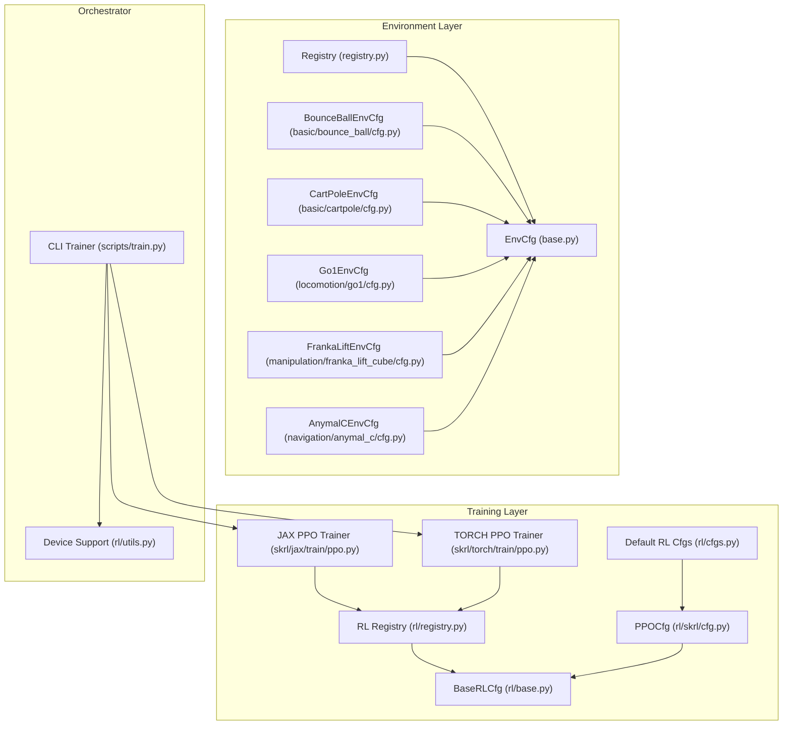
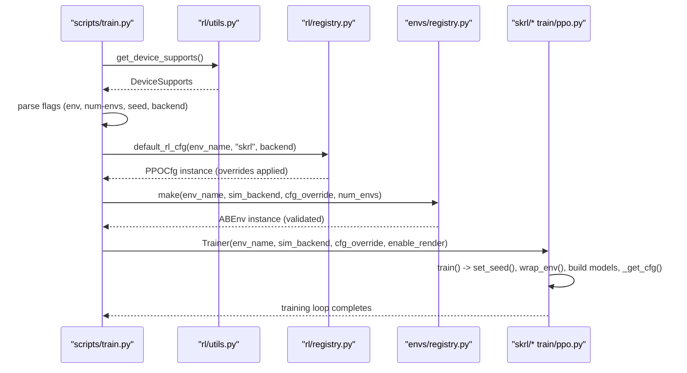
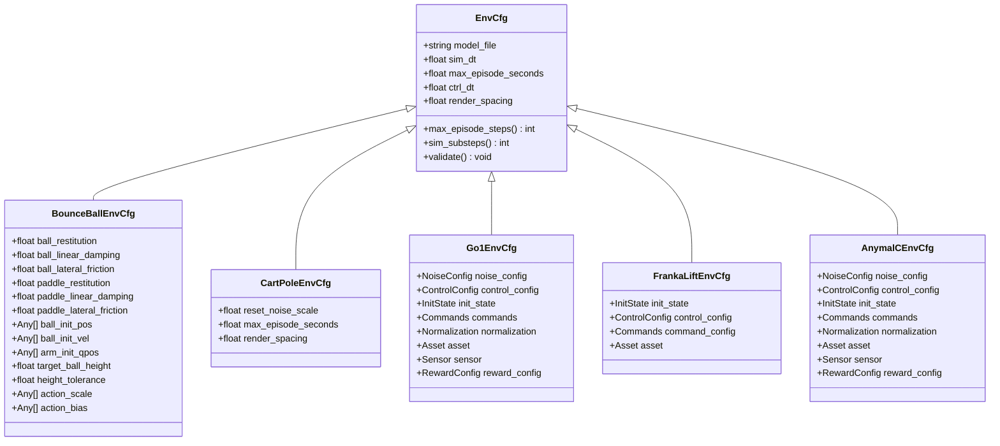
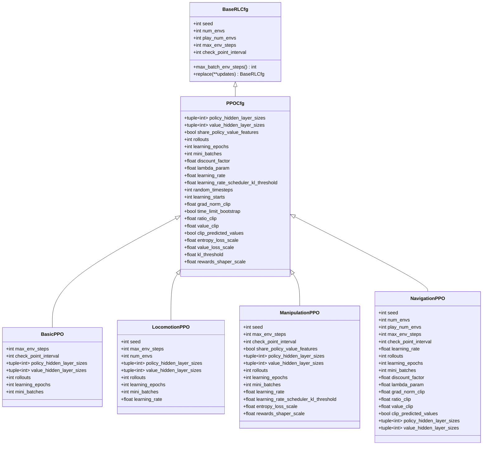
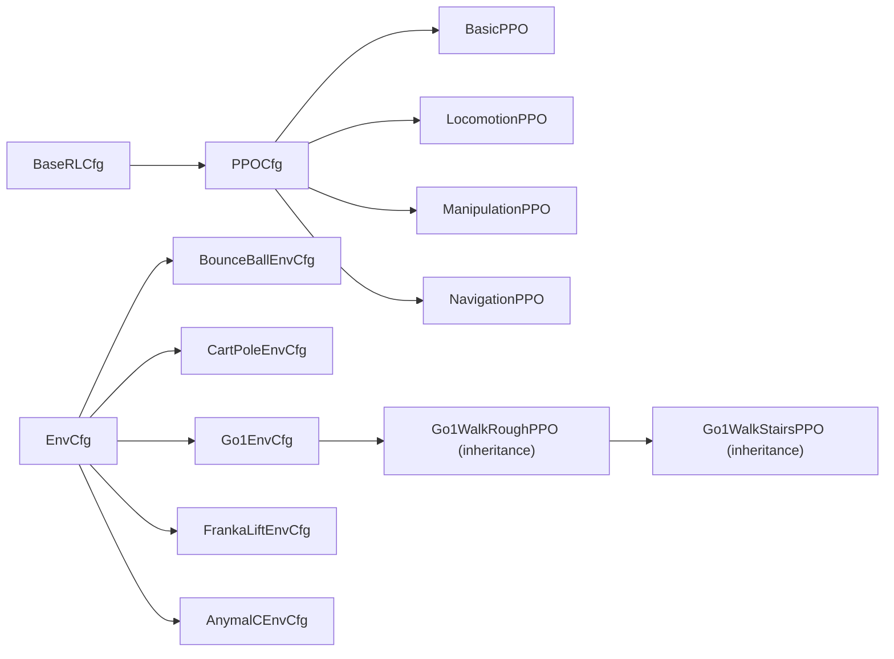
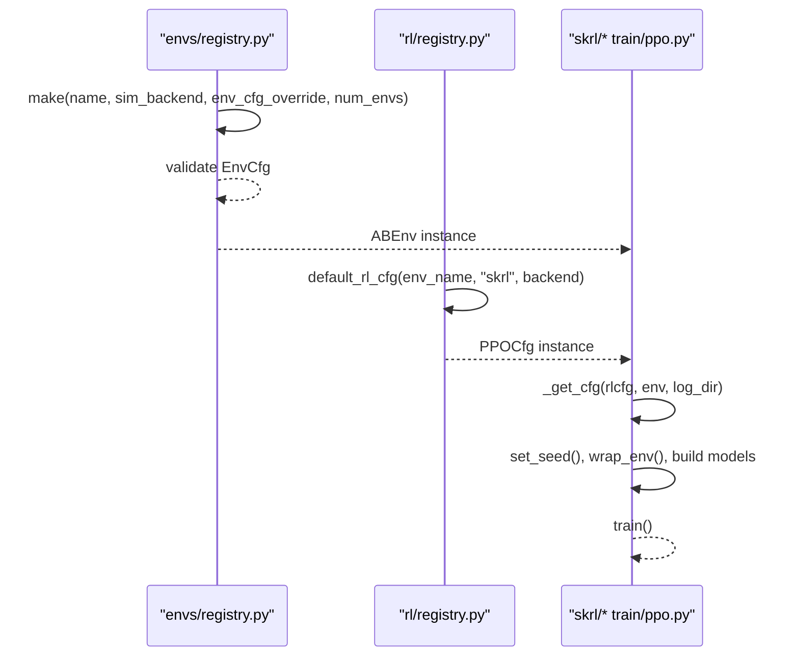
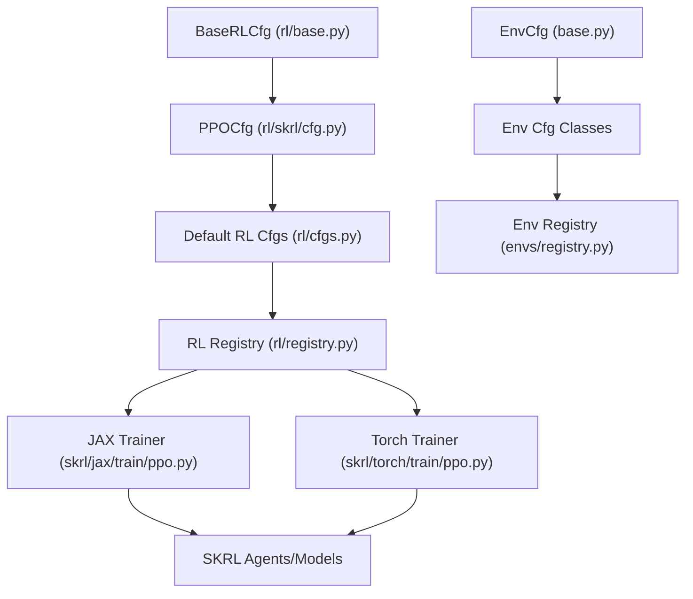

# Configuration System

<cite>
**Referenced Files in This Document**
- [base.py](file://motrix_envs/src/motrix_envs/base.py)
- [registry.py](file://motrix_envs/src/motrix_envs/registry.py)
- [cfg.py](file://motrix_envs/src/motrix_envs/basic/bounce_ball/cfg.py)
- [cfg.py](file://motrix_envs/src/motrix_envs/basic/cartpole/cfg.py)
- [cfg.py](file://motrix_envs/src/motrix_envs/locomotion/go1/cfg.py)
- [cfg.py](file://motrix_envs/src/motrix_envs/manipulation/franka_lift_cube/cfg.py)
- [cfg.py](file://motrix_envs/src/motrix_envs/navigation/anymal_c/cfg.py)
- [base.py](file://motrix_rl/src/motrix_rl/base.py)
- [cfg.py](file://motrix_rl/src/motrix_rl/skrl/cfg.py)
- [cfgs.py](file://motrix_rl/src/motrix_rl/cfgs.py)
- [registry.py](file://motrix_rl/src/motrix_rl/registry.py)
- [ppo.py](file://motrix_rl/src/motrix_rl/skrl/jax/train/ppo.py)
- [ppo.py](file://motrix_rl/src/motrix_rl/skrl/torch/train/ppo.py)
- [utils.py](file://motrix_rl/src/motrix_rl/utils.py)
- [train.py](file://scripts/train.py)
</cite>

## Table of Contents
1. [Introduction](#introduction)
2. [Project Structure](#project-structure)
3. [Core Components](#core-components)
4. [Architecture Overview](#architecture-overview)
5. [Detailed Component Analysis](#detailed-component-analysis)
6. [Dependency Analysis](#dependency-analysis)
7. [Performance Considerations](#performance-considerations)
8. [Troubleshooting Guide](#troubleshooting-guide)
9. [Conclusion](#conclusion)
10. [Appendices](#appendices)

## Introduction
This document explains the configuration system used across the environment and reinforcement learning training layers. It focuses on the dataclass-based configuration architecture, parameter validation, inheritance patterns, and the relationship between configuration classes and their implementations. It also covers environment configuration classes for physics, rewards, and termination, as well as training configuration classes for hyperparameters, experiment tracking, and result storage. Practical examples demonstrate customization, parameter override strategies, and best practices for reproducible experiments.

## Project Structure
The configuration system spans two primary packages:
- Environment configuration: located under motrix_envs, with environment-specific configuration classes and a registry for discovery and instantiation.
- Training configuration: located under motrix_rl, with base RL configuration classes, framework-specific PPO configurations, and a registry for mapping environments to training configurations.

**Diagram sources**
- [base.py](file://motrix_envs/src/motrix_envs/base.py#L23-L64)
- [registry.py](file://motrix_envs/src/motrix_envs/registry.py#L46-L160)
- [cfg.py](file://motrix_envs/src/motrix_envs/basic/bounce_ball/cfg.py#L25-L65)
- [cfg.py](file://motrix_envs/src/motrix_envs/basic/cartpole/cfg.py#L25-L32)
- [cfg.py](file://motrix_envs/src/motrix_envs/locomotion/go1/cfg.py#L122-L187)
- [cfg.py](file://motrix_envs/src/motrix_envs/manipulation/franka_lift_cube/cfg.py#L69-L84)
- [cfg.py](file://motrix_envs/src/motrix_envs/navigation/anymal_c/cfg.py#L95-L116)
- [base.py](file://motrix_rl/src/motrix_rl/base.py#L20-L43)
- [cfg.py](file://motrix_rl/src/motrix_rl/skrl/cfg.py#L28-L74)
- [cfgs.py](file://motrix_rl/src/motrix_rl/cfgs.py#L22-L333)
- [registry.py](file://motrix_rl/src/motrix_rl/registry.py#L42-L114)
- [ppo.py](file://motrix_rl/src/motrix_rl/skrl/jax/train/ppo.py#L145-L295)
- [ppo.py](file://motrix_rl/src/motrix_rl/skrl/torch/train/ppo.py#L145-L355)
- [utils.py](file://motrix_rl/src/motrix_rl/utils.py#L19-L61)
- [train.py](file://scripts/train.py#L52-L91)

**Section sources**
- [base.py](file://motrix_envs/src/motrix_envs/base.py#L23-L64)
- [registry.py](file://motrix_envs/src/motrix_envs/registry.py#L46-L160)
- [base.py](file://motrix_rl/src/motrix_rl/base.py#L20-L43)
- [cfg.py](file://motrix_rl/src/motrix_rl/skrl/cfg.py#L28-L74)
- [cfgs.py](file://motrix_rl/src/motrix_rl/cfgs.py#L22-L333)
- [registry.py](file://motrix_rl/src/motrix_rl/registry.py#L42-L114)
- [ppo.py](file://motrix_rl/src/motrix_rl/skrl/jax/train/ppo.py#L145-L295)
- [ppo.py](file://motrix_rl/src/motrix_rl/skrl/torch/train/ppo.py#L145-L355)
- [utils.py](file://motrix_rl/src/motrix_rl/utils.py#L19-L61)
- [train.py](file://scripts/train.py#L52-L91)

## Core Components
- Environment configuration base: defines simulation timing, episode limits, and validation rules.
- Environment configuration classes: extend the base with domain-specific physics, controls, rewards, and termination.
- RL configuration base: defines training lifecycle parameters and helper utilities.
- RL configuration classes: framework-specific PPO configurations with defaults and environment-specific overrides.
- Registries: map environment names to configuration classes and training configurations, enabling dynamic selection and instantiation.

Key responsibilities:
- Validation: environment configs validate simulation/control step sizes; environment creation validates configs before instantiation.
- Overrides: environment and RL configs support runtime overrides via dictionaries and dataclass replace semantics.
- Backends: training supports JAX and PyTorch backends with environment-specific defaults and overrides.

**Section sources**
- [base.py](file://motrix_envs/src/motrix_envs/base.py#L23-L64)
- [registry.py](file://motrix_envs/src/motrix_envs/registry.py#L114-L160)
- [base.py](file://motrix_rl/src/motrix_rl/base.py#L20-L43)
- [cfg.py](file://motrix_rl/src/motrix_rl/skrl/cfg.py#L28-L74)
- [cfgs.py](file://motrix_rl/src/motrix_rl/cfgs.py#L22-L333)
- [registry.py](file://motrix_rl/src/motrix_rl/registry.py#L42-L114)

## Architecture Overview
The configuration architecture follows a layered pattern:
- Environment layer: dataclass-based EnvCfg subclasses define physics, controls, rewards, and termination. They are registered with the environment registry.
- Training layer: BaseRLCfg defines training lifecycle parameters; PPOCfg extends it with algorithmic hyperparameters. Environment-specific RL configurations inherit or override PPO defaults and are registered via rlcfg decorators.
- Runtime orchestration: CLI reads flags, selects device backends, constructs RL overrides, and instantiates trainers that fetch default RL configs and environment instances.

**Diagram sources**
- [train.py](file://scripts/train.py#L52-L91)
- [utils.py](file://motrix_rl/src/motrix_rl/utils.py#L39-L61)
- [registry.py](file://motrix_rl/src/motrix_rl/registry.py#L81-L114)
- [registry.py](file://motrix_envs/src/motrix_envs/registry.py#L114-L160)
- [ppo.py](file://motrix_rl/src/motrix_rl/skrl/jax/train/ppo.py#L145-L184)
- [ppo.py](file://motrix_rl/src/motrix_rl/skrl/torch/train/ppo.py#L145-L183)

## Detailed Component Analysis

### Environment Configuration Classes
Environment configuration classes inherit from EnvCfg and add domain-specific parameters. They are decorated with envcfg and registered in the environment registry. The registry supports:
- Creating EnvCfg instances and applying overrides.
- Validating configs prior to environment instantiation.
- Selecting simulation backends and constructing environment instances.

Representative examples:
- Bounce Ball: physics parameters for restitution, damping, friction; initial conditions; action scaling.
- CartPole: minimal physics, reset noise, episode duration.
- Go1 Locomotion: nested configuration classes for noise, control, initialization, commands, normalization, assets, sensors, and reward scales; terrain variants override model files and reward scales.
- Franka Manipulation: initialization, control bounds, commands, assets.
- Anymal Navigation: noise, control, initialization, commands, normalization, assets, sensors, reward configuration.

**Diagram sources**
- [base.py](file://motrix_envs/src/motrix_envs/base.py#L23-L64)
- [cfg.py](file://motrix_envs/src/motrix_envs/basic/bounce_ball/cfg.py#L25-L65)
- [cfg.py](file://motrix_envs/src/motrix_envs/basic/cartpole/cfg.py#L25-L32)
- [cfg.py](file://motrix_envs/src/motrix_envs/locomotion/go1/cfg.py#L122-L187)
- [cfg.py](file://motrix_envs/src/motrix_envs/manipulation/franka_lift_cube/cfg.py#L69-L84)
- [cfg.py](file://motrix_envs/src/motrix_envs/navigation/anymal_c/cfg.py#L95-L116)

**Section sources**
- [base.py](file://motrix_envs/src/motrix_envs/base.py#L23-L64)
- [cfg.py](file://motrix_envs/src/motrix_envs/basic/bounce_ball/cfg.py#L25-L65)
- [cfg.py](file://motrix_envs/src/motrix_envs/basic/cartpole/cfg.py#L25-L32)
- [cfg.py](file://motrix_envs/src/motrix_envs/locomotion/go1/cfg.py#L122-L187)
- [cfg.py](file://motrix_envs/src/motrix_envs/manipulation/franka_lift_cube/cfg.py#L69-L84)
- [cfg.py](file://motrix_envs/src/motrix_envs/navigation/anymal_c/cfg.py#L95-L116)

### Training Configuration Classes
Training configuration classes inherit from BaseRLCfg and PPOCfg. They define:
- Lifecycle parameters: seed, num_envs, play_num_envs, max_env_steps, check_point_interval.
- PPO hyperparameters: policy/value architectures, rollout settings, learning schedule, clipping, loss scaling, reward shaping.
- Environment-specific overrides grouped by task families (basic, locomotion, manipulation, navigation).

**Diagram sources**
- [base.py](file://motrix_rl/src/motrix_rl/base.py#L20-L43)
- [cfg.py](file://motrix_rl/src/motrix_rl/skrl/cfg.py#L28-L74)
- [cfgs.py](file://motrix_rl/src/motrix_rl/cfgs.py#L22-L333)

**Section sources**
- [base.py](file://motrix_rl/src/motrix_rl/base.py#L20-L43)
- [cfg.py](file://motrix_rl/src/motrix_rl/skrl/cfg.py#L28-L74)
- [cfgs.py](file://motrix_rl/src/motrix_rl/cfgs.py#L22-L333)

### Parameter Validation Mechanisms
- Environment validation: EnvCfg.validate ensures sim_dt ≤ ctrl_dt and computes derived properties like max_episode_steps and sim_substeps.
- Environment instantiation: The registry applies overrides and calls validate before constructing the environment instance.

**Diagram sources**
- [base.py](file://motrix_envs/src/motrix_envs/base.py#L53-L58)
- [registry.py](file://motrix_envs/src/motrix_envs/registry.py#L137-L147)

**Section sources**
- [base.py](file://motrix_envs/src/motrix_envs/base.py#L53-L58)
- [registry.py](file://motrix_envs/src/motrix_envs/registry.py#L137-L147)

### Inheritance Patterns and Composition
- Environment configs compose nested dataclasses (e.g., NoiseConfig, ControlConfig, InitState, Commands, Normalization, Asset, Sensor, RewardConfig) to encapsulate related parameters.
- Training configs inherit from PPOCfg and override defaults per environment family and backend. Some classes further specialize via inheritance (e.g., Go1 rough/stairs variants).

**Diagram sources**
- [base.py](file://motrix_envs/src/motrix_envs/base.py#L23-L64)
- [cfg.py](file://motrix_envs/src/motrix_envs/locomotion/go1/cfg.py#L227-L235)
- [cfgs.py](file://motrix_rl/src/motrix_rl/cfgs.py#L186-L236)

**Section sources**
- [cfg.py](file://motrix_envs/src/motrix_envs/locomotion/go1/cfg.py#L227-L235)
- [cfgs.py](file://motrix_rl/src/motrix_rl/cfgs.py#L186-L236)

### Relationship Between Configuration Classes and Implementations
- Environment registry: maps environment names to EnvCfg classes and constructs ABEnv instances with optional overrides and validation.
- RL registry: maps environment names and backends to RL configuration classes; default_rl_cfg resolves backend-specific or universal defaults.
- Trainers: fetch RL configs, wrap environments, construct models, and run training loops.

**Diagram sources**
- [registry.py](file://motrix_envs/src/motrix_envs/registry.py#L114-L160)
- [registry.py](file://motrix_rl/src/motrix_rl/registry.py#L81-L114)
- [ppo.py](file://motrix_rl/src/motrix_rl/skrl/jax/train/ppo.py#L145-L184)
- [ppo.py](file://motrix_rl/src/motrix_rl/skrl/torch/train/ppo.py#L145-L183)

**Section sources**
- [registry.py](file://motrix_envs/src/motrix_envs/registry.py#L114-L160)
- [registry.py](file://motrix_rl/src/motrix_rl/registry.py#L81-L114)
- [ppo.py](file://motrix_rl/src/motrix_rl/skrl/jax/train/ppo.py#L145-L184)
- [ppo.py](file://motrix_rl/src/motrix_rl/skrl/torch/train/ppo.py#L145-L183)

## Dependency Analysis
- Coupling: Environment configs depend on EnvCfg; RL configs depend on BaseRLCfg and PPOCfg. Both registries decouple selection from construction.
- Cohesion: Environment configs group related parameters; RL configs group algorithmic hyperparameters; trainers consume configs.
- External dependencies: SKRL agents, preprocessors, schedulers; Gymnasium spaces; NumPy/Torch/JAX backends.

**Diagram sources**
- [base.py](file://motrix_envs/src/motrix_envs/base.py#L23-L64)
- [base.py](file://motrix_rl/src/motrix_rl/base.py#L20-L43)
- [cfg.py](file://motrix_rl/src/motrix_rl/skrl/cfg.py#L28-L74)
- [cfgs.py](file://motrix_rl/src/motrix_rl/cfgs.py#L22-L333)
- [registry.py](file://motrix_envs/src/motrix_envs/registry.py#L46-L160)
- [registry.py](file://motrix_rl/src/motrix_rl/registry.py#L42-L114)
- [ppo.py](file://motrix_rl/src/motrix_rl/skrl/jax/train/ppo.py#L145-L184)
- [ppo.py](file://motrix_rl/src/motrix_rl/skrl/torch/train/ppo.py#L145-L183)

**Section sources**
- [base.py](file://motrix_envs/src/motrix_envs/base.py#L23-L64)
- [base.py](file://motrix_rl/src/motrix_rl/base.py#L20-L43)
- [cfg.py](file://motrix_rl/src/motrix_rl/skrl/cfg.py#L28-L74)
- [cfgs.py](file://motrix_rl/src/motrix_rl/cfgs.py#L22-L333)
- [registry.py](file://motrix_envs/src/motrix_envs/registry.py#L46-L160)
- [registry.py](file://motrix_rl/src/motrix_rl/registry.py#L42-L114)
- [ppo.py](file://motrix_rl/src/motrix_rl/skrl/jax/train/ppo.py#L145-L184)
- [ppo.py](file://motrix_rl/src/motrix_rl/skrl/torch/train/ppo.py#L145-L183)

## Performance Considerations
- Parallelism: num_envs controls vectorized environments; tune for GPU/accelerator capacity.
- Batch sizing: rollouts, learning_epochs, mini_batches balance memory and throughput.
- Preprocessing: RunningStandardScaler reduces training variance; ensure appropriate device placement.
- Logging intervals: check_point_interval determines checkpoint frequency and disk IO overhead.
- Seed determinism: set seed for reproducibility; avoid excessive randomness in environment resets.

[No sources needed since this section provides general guidance]

## Troubleshooting Guide
Common issues and resolutions:
- Invalid simulation step sizes: ensure sim_dt ≤ ctrl_dt; EnvCfg.validate raises errors otherwise.
- Unknown environment or backend: registration checks prevent unsupported combinations; verify envcfg and rlcfg decorators.
- Unsupported device backends: CLI auto-detects device support; if neither JAX nor Torch is available, an exception is raised.
- Config override errors: registry.make validates override keys; unknown attributes cause errors.

**Section sources**
- [base.py](file://motrix_envs/src/motrix_envs/base.py#L53-L58)
- [registry.py](file://motrix_envs/src/motrix_envs/registry.py#L137-L147)
- [utils.py](file://motrix_rl/src/motrix_rl/utils.py#L39-L61)

## Conclusion
The configuration system leverages dataclasses and registries to provide a flexible, extensible, and validated approach to managing environment and training parameters. Environment configs encapsulate domain-specific physics and behaviors, while RL configs define algorithmic hyperparameters with environment-specific defaults. The runtime orchestrator integrates device detection, parameter overrides, and trainer instantiation to support reproducible and efficient training workflows.

[No sources needed since this section summarizes without analyzing specific files]

## Appendices

### Practical Examples and Best Practices

- Environment configuration customization
  - Extend EnvCfg with domain-specific parameters (e.g., reward scales, noise levels, control bounds).
  - Use nested dataclasses to organize related parameters (e.g., NoiseConfig, ControlConfig).
  - Apply env_cfg_override at runtime to adjust episode length, rendering spacing, or reset noise.

- Training configuration customization
  - Override PPO hyperparameters per environment family (e.g., hidden layer sizes, learning rate, rollout counts).
  - Use backend-specific RL configs when differences exist (e.g., share_policy_value_features).
  - Adjust lifecycle parameters (seed, num_envs, max_env_steps, check_point_interval) for reproducibility and resource usage.

- Parameter override strategies
  - CLI overrides: scripts/train.py demonstrates overriding num_envs and seed via flags.
  - Programmatic overrides: pass cfg_override to trainers; RL configs support replace(**updates) for immutable updates.

- Experiment reproducibility
  - Set seed in BaseRLCfg; trainers call set_seed.
  - Pin environment and backend versions; use registry defaults for consistency.
  - Use check_point_interval to snapshot progress and enable resumption.

**Section sources**
- [cfg.py](file://motrix_envs/src/motrix_envs/locomotion/go1/cfg.py#L122-L187)
- [cfgs.py](file://motrix_rl/src/motrix_rl/cfgs.py#L22-L333)
- [train.py](file://scripts/train.py#L58-L67)
- [ppo.py](file://motrix_rl/src/motrix_rl/skrl/jax/train/ppo.py#L152-L162)
- [ppo.py](file://motrix_rl/src/motrix_rl/skrl/torch/train/ppo.py#L152-L162)