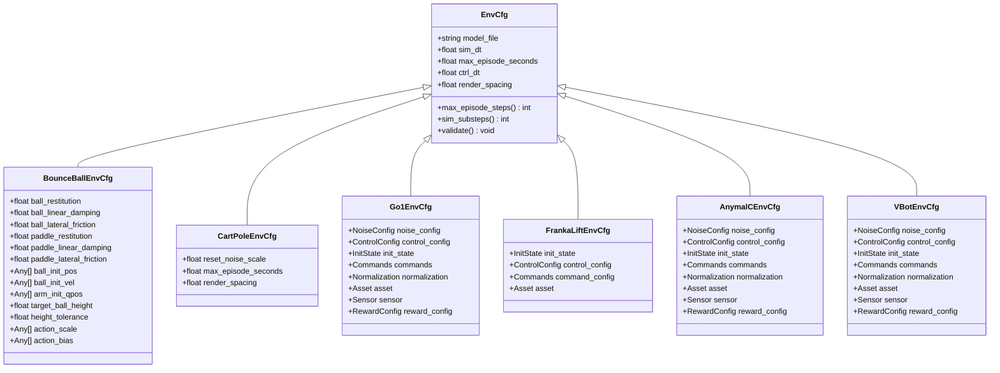

# Configuration System

<cite>
**Referenced Files in This Document**
- [base.py](file://motrix_envs/src/motrix_envs/base.py)
- [registry.py](file://motrix_envs/src/motrix_envs/registry.py)
- [cfg.py](file://motrix_envs/src/motrix_envs/basic/bounce_ball/cfg.py)
- [cfg.py](file://motrix_envs/src/motrix_envs/basic/cartpole/cfg.py)
- [cfg.py](file://motrix_envs/src/motrix_envs/locomotion/go1/cfg.py)
- [cfg.py](file://motrix_envs/src/motrix_envs/manipulation/franka_lift_cube/cfg.py)
- [cfg.py](file://motrix_envs/src/motrix_envs/navigation/anymal_c/cfg.py)
- [cfg.py](file://motrix_envs/src/motrix_envs/navigation/vbot/cfg.py)
- [vbot_section001_np.py](file://motrix_envs/src/motrix_envs/navigation/vbot/vbot_section001_np.py)
- [base.py](file://motrix_rl/src/motrix_rl/base.py)
- [cfg.py](file://motrix_rl/src/motrix_rl/skrl/cfg.py)
- [cfgs.py](file://motrix_rl/src/motrix_rl/cfgs.py)
- [registry.py](file://motrix_rl/src/motrix_rl/registry.py)
- [ppo.py](file://motrix_rl/src/motrix_rl/skrl/jax/train/ppo.py)
- [ppo.py](file://motrix_rl/src/motrix_rl/skrl/torch/train/ppo.py)
- [utils.py](file://motrix_rl/src/motrix_rl/utils.py)
- [train.py](file://scripts/train.py)
</cite>

## Update Summary
**Changes Made**
- Enhanced VBot Section 001 configuration with new radius-based initialization parameters (pos_min_radius=10.8, pos_max_radius=11.0)
- Added support for configurable ring-shaped initialization zones with circular angle distributions (0 to 2π radians)
- Expanded training configuration classes with alternative VBot navigation configurations for different terrain sections
- Updated environment configuration classes to reflect enhanced navigation configurations with multiple terrain variants
- Documented refined initial state configuration with ring-shaped positioning capabilities

## Table of Contents
1. [Introduction](#introduction)
2. [Project Structure](#project-structure)
3. [Core Components](#core-components)
4. [Architecture Overview](#architecture-overview)
5. [Detailed Component Analysis](#detailed-component-analysis)
6. [Dependency Analysis](#dependency-analysis)
7. [Performance Considerations](#performance-considerations)
8. [Troubleshooting Guide](#troubleshooting-guide)
9. [Conclusion](#conclusion)
10. [Appendices](#appendices)

## Introduction
This document explains the configuration system used across the environment and reinforcement learning training layers. It focuses on the dataclass-based configuration architecture, parameter validation, inheritance patterns, and the relationship between configuration classes and their implementations. The system now includes expanded environment configurations with detailed specifications for robot body components, foot contact detection, termination criteria, and refined initial state configuration with multiple position options for different map layouts. It also covers environment configuration classes for physics, rewards, and termination, as well as training configuration classes for hyperparameters, experiment tracking, and result storage. Practical examples demonstrate customization, parameter override strategies, and best practices for reproducible experiments.

## Project Structure
The configuration system spans two primary packages:
- Environment configuration: located under motrix_envs, with environment-specific configuration classes and a registry for discovery and instantiation.
- Training configuration: located under motrix_rl, with base RL configuration classes, framework-specific PPO configurations, and a registry for mapping environments to training configurations.

**Diagram sources**
- [base.py](file://motrix_envs/src/motrix_envs/base.py#L23-L64)
- [registry.py](file://motrix_envs/src/motrix_envs/registry.py#L46-L160)
- [cfg.py](file://motrix_envs/src/motrix_envs/basic/bounce_ball/cfg.py#L25-L65)
- [cfg.py](file://motrix_envs/src/motrix_envs/basic/cartpole/cfg.py#L25-L32)
- [cfg.py](file://motrix_envs/src/motrix_envs/locomotion/go1/cfg.py#L122-L187)
- [cfg.py](file://motrix_envs/src/motrix_envs/manipulation/franka_lift_cube/cfg.py#L69-L84)
- [cfg.py](file://motrix_envs/src/motrix_envs/navigation/anymal_c/cfg.py#L95-L116)
- [cfg.py](file://motrix_envs/src/motrix_envs/navigation/vbot/cfg.py#L118-L138)
- [base.py](file://motrix_rl/src/motrix_rl/base.py#L20-L43)
- [cfg.py](file://motrix_rl/src/motrix_rl/skrl/cfg.py#L28-L74)
- [cfgs.py](file://motrix_rl/src/motrix_rl/cfgs.py#L22-L360)
- [registry.py](file://motrix_rl/src/motrix_rl/registry.py#L42-L114)
- [ppo.py](file://motrix_rl/src/motrix_rl/skrl/jax/train/ppo.py#L145-L295)
- [ppo.py](file://motrix_rl/src/motrix_rl/skrl/torch/train/ppo.py#L145-L355)
- [utils.py](file://motrix_rl/src/motrix_rl/utils.py#L19-L61)
- [train.py](file://scripts/train.py#L52-L91)

**Section sources**
- [base.py](file://motrix_envs/src/motrix_envs/base.py#L23-L64)
- [registry.py](file://motrix_envs/src/motrix_envs/registry.py#L46-L160)
- [base.py](file://motrix_rl/src/motrix_rl/base.py#L20-L43)
- [cfg.py](file://motrix_rl/src/motrix_rl/skrl/cfg.py#L28-L74)
- [cfgs.py](file://motrix_rl/src/motrix_rl/cfgs.py#L22-L360)
- [registry.py](file://motrix_rl/src/motrix_rl/registry.py#L42-L114)
- [ppo.py](file://motrix_rl/src/motrix_rl/skrl/jax/train/ppo.py#L145-L295)
- [ppo.py](file://motrix_rl/src/motrix_rl/skrl/torch/train/ppo.py#L145-L355)
- [utils.py](file://motrix_rl/src/motrix_rl/utils.py#L19-L61)
- [train.py](file://scripts/train.py#L52-L91)

## Core Components
- Environment configuration base: defines simulation timing, episode limits, and validation rules.
- Environment configuration classes: extend the base with domain-specific physics, controls, rewards, and termination.
- RL configuration base: defines training lifecycle parameters and helper utilities.
- RL configuration classes: framework-specific PPO configurations with defaults and environment-specific overrides.
- Registries: map environment names to configuration classes and training configurations, enabling dynamic selection and instantiation.

Key responsibilities:
- Validation: environment configs validate simulation/control step sizes; environment creation validates configs before instantiation.
- Overrides: environment and RL configs support runtime overrides via dictionaries and dataclass replace semantics.
- Backends: training supports JAX and PyTorch backends with environment-specific defaults and overrides.

**Section sources**
- [base.py](file://motrix_envs/src/motrix_envs/base.py#L23-L64)
- [registry.py](file://motrix_envs/src/motrix_envs/registry.py#L114-L160)
- [base.py](file://motrix_rl/src/motrix_rl/base.py#L20-L43)
- [cfg.py](file://motrix_rl/src/motrix_rl/skrl/cfg.py#L28-L74)
- [cfgs.py](file://motrix_rl/src/motrix_rl/cfgs.py#L22-L360)
- [registry.py](file://motrix_rl/src/motrix_rl/registry.py#L42-L114)

## Architecture Overview
The configuration architecture follows a layered pattern:
- Environment layer: dataclass-based EnvCfg subclasses define physics, controls, rewards, and termination. They are registered with the environment registry.
- Training layer: BaseRLCfg defines training lifecycle parameters; PPOCfg extends it with algorithmic hyperparameters. Environment-specific RL configurations inherit or override PPO defaults and are registered via rlcfg decorators.
- Runtime orchestration: CLI reads flags, selects device backends, constructs RL overrides, and instantiates trainers that fetch default RL configs and environment instances.

**Diagram sources**
- [train.py](file://scripts/train.py#L52-L91)
- [utils.py](file://motrix_rl/src/motrix_rl/utils.py#L39-L61)
- [registry.py](file://motrix_rl/src/motrix_rl/registry.py#L81-L114)
- [registry.py](file://motrix_envs/src/motrix_envs/registry.py#L114-L160)
- [ppo.py](file://motrix_rl/src/motrix_rl/skrl/jax/train/ppo.py#L145-L184)
- [ppo.py](file://motrix_rl/src/motrix_rl/skrl/torch/train/ppo.py#L145-L183)

## Detailed Component Analysis

### Environment Configuration Classes
Environment configuration classes inherit from EnvCfg and add domain-specific parameters. They are decorated with envcfg and registered in the environment registry. The registry supports:
- Creating EnvCfg instances and applying overrides.
- Validating configs prior to environment instantiation.
- Selecting simulation backends and constructing environment instances.

Representative examples:
- Bounce Ball: physics parameters for restitution, damping, friction; initial conditions; action scaling.
- CartPole: minimal physics, reset noise, episode duration.
- Go1 Locomotion: nested configuration classes for noise, control, initialization, commands, normalization, assets, sensors, and reward scales; terrain variants override model files and reward scales.
- Franka Manipulation: initialization, control bounds, commands, assets.
- Anymal Navigation: noise, control, initialization, commands, normalization, assets, sensors, reward configuration.
- VBot Navigation: comprehensive terrain variants including flat, stairs, obstacles, and multiple section configurations with detailed initial states, reward configurations, and asset specifications.

**Enhanced** VBot Section 001 now supports ring-shaped initialization zones with configurable radius parameters for enhanced training flexibility.

**Diagram sources**
- [base.py](file://motrix_envs/src/motrix_envs/base.py#L23-L64)
- [cfg.py](file://motrix_envs/src/motrix_envs/basic/bounce_ball/cfg.py#L25-L65)
- [cfg.py](file://motrix_envs/src/motrix_envs/basic/cartpole/cfg.py#L25-L32)
- [cfg.py](file://motrix_envs/src/motrix_envs/locomotion/go1/cfg.py#L122-L187)
- [cfg.py](file://motrix_envs/src/motrix_envs/manipulation/franka_lift_cube/cfg.py#L69-L84)
- [cfg.py](file://motrix_envs/src/motrix_envs/navigation/anymal_c/cfg.py#L95-L116)
- [cfg.py](file://motrix_envs/src/motrix_envs/navigation/vbot/cfg.py#L118-L138)

**Section sources**
- [base.py](file://motrix_envs/src/motrix_envs/base.py#L23-L64)
- [cfg.py](file://motrix_envs/src/motrix_envs/basic/bounce_ball/cfg.py#L25-L65)
- [cfg.py](file://motrix_envs/src/motrix_envs/basic/cartpole/cfg.py#L25-L32)
- [cfg.py](file://motrix_envs/src/motrix_envs/locomotion/go1/cfg.py#L122-L187)
- [cfg.py](file://motrix_envs/src/motrix_envs/manipulation/franka_lift_cube/cfg.py#L69-L84)
- [cfg.py](file://motrix_envs/src/motrix_envs/navigation/anymal_c/cfg.py#L95-L116)
- [cfg.py](file://motrix_envs/src/motrix_envs/navigation/vbot/cfg.py#L118-L138)

### Enhanced Robot Body Components and Asset Configuration
The configuration system now includes detailed specifications for robot body components with advanced foot contact detection and termination criteria:

- **Foot Contact Detection**: Enhanced asset configurations with `foot_names` for multiple legged robots and `feet` sensors for contact force monitoring.
- **Termination Criteria**: Advanced termination logic with `terminate_after_contacts_on` specifying critical body parts that trigger episode termination.
- **Ground Subtree Handling**: Specialized ground detection through `ground_subtree` for complex terrain contact scenarios.
- **Goal Position Tracking**: Navigation-specific goal detection via `goal_name` for target location identification.

**Enhanced** Asset configurations now support VBot navigation with specialized terrain handling and goal detection.

**Diagram sources**
- [cfg.py](file://motrix_envs/src/motrix_envs/locomotion/go1/cfg.py#L80-L86)
- [cfg.py](file://motrix_envs/src/motrix_envs/navigation/anymal_c/cfg.py#L73-L83)
- [cfg.py](file://motrix_envs/src/motrix_envs/navigation/vbot/cfg.py#L80-L93)

**Section sources**
- [cfg.py](file://motrix_envs/src/motrix_envs/locomotion/go1/cfg.py#L80-L86)
- [cfg.py](file://motrix_envs/src/motrix_envs/navigation/anymal_c/cfg.py#L73-L83)
- [cfg.py](file://motrix_envs/src/motrix_envs/navigation/vbot/cfg.py#L80-L93)

### Enhanced Initial State Configuration with Ring-Shaped Initialization
The initial state configuration system now supports advanced ring-shaped initialization zones with configurable radius parameters:

- **Ring-Shaped Initialization**: VBot Section 001 introduces `pos_min_radius` and `pos_max_radius` parameters for creating ring-shaped initialization zones centered at spawn points.
- **Circular Angle Distribution**: Initial positions are generated using uniform circular distribution with angles ranging from 0 to 2π radians for complete radial coverage.
- **Configurable Radius Parameters**: Users can specify inner and outer radius bounds to control the width of the ring-shaped zone.
- **Training vs Play Modes**: Alternative radius configurations are available for training (8.0-9.0) versus play modes (10.8-11.0) to optimize different operational scenarios.

**Enhanced** Initial state configuration now supports sophisticated ring-shaped positioning for VBot navigation training.

**Diagram sources**
- [cfg.py](file://motrix_envs/src/motrix_envs/navigation/vbot/cfg.py#L380-L406)
- [cfg.py](file://motrix_envs/src/motrix_envs/navigation/anymal_c/cfg.py#L35-L56)
- [cfg.py](file://motrix_envs/src/motrix_envs/locomotion/go1/cfg.py#L42-L60)

**Section sources**
- [cfg.py](file://motrix_envs/src/motrix_envs/navigation/vbot/cfg.py#L380-L406)
- [cfg.py](file://motrix_envs/src/motrix_envs/navigation/anymal_c/cfg.py#L35-L56)
- [cfg.py](file://motrix_envs/src/motrix_envs/locomotion/go1/cfg.py#L42-L60)

### Enhanced Reward Systems
The reward configuration system now includes specialized reward functions for different navigation tasks:

- **Navigation Rewards**: Position tracking, fine position tracking, heading tracking, and forward velocity rewards for navigation tasks.
- **Termination Penalties**: Significant termination penalties for collision and stability violations.
- **Locomotion Stability**: Reduced weight for locomotion stability rewards to balance navigation objectives.
- **Task-Specific Scaling**: Environment-specific reward scaling factors optimized for different terrain challenges.

**Enhanced** Reward configurations now support specialized navigation tasks with terrain-specific objectives.

**Diagram sources**
- [cfg.py](file://motrix_envs/src/motrix_envs/navigation/vbot/cfg.py#L95-L116)
- [cfg.py](file://motrix_envs/src/motrix_envs/navigation/anymal_c/cfg.py#L85-L93)
- [cfg.py](file://motrix_envs/src/motrix_envs/locomotion/go1/cfg.py#L96-L119)

**Section sources**
- [cfg.py](file://motrix_envs/src/motrix_envs/navigation/vbot/cfg.py#L95-L116)
- [cfg.py](file://motrix_envs/src/motrix_envs/navigation/anymal_c/cfg.py#L85-L93)
- [cfg.py](file://motrix_envs/src/motrix_envs/locomotion/go1/cfg.py#L96-L119)

### Enhanced Training Configuration Classes
Training configuration classes inherit from BaseRLCfg and PPOCfg. They define:
- Lifecycle parameters: seed, num_envs, play_num_envs, max_env_steps, check_point_interval.
- PPO hyperparameters: policy/value architectures, rollout settings, learning schedule, clipping, loss scaling, reward shaping.
- Environment-specific overrides grouped by task families (basic, locomotion, manipulation, navigation).

**Enhanced** Training configurations now include alternative VBot navigation configurations for different terrain sections with specialized parameter sets.

**Diagram sources**
- [base.py](file://motrix_rl/src/motrix_rl/base.py#L20-L43)
- [cfg.py](file://motrix_rl/src/motrix_rl/skrl/cfg.py#L28-L74)
- [cfgs.py](file://motrix_rl/src/motrix_rl/cfgs.py#L22-L360)
- [cfgs.py](file://motrix_rl/src/motrix_rl/cfgs.py#L306-L360)

**Section sources**
- [base.py](file://motrix_rl/src/motrix_rl/base.py#L20-L43)
- [cfg.py](file://motrix_rl/src/motrix_rl/skrl/cfg.py#L28-L74)
- [cfgs.py](file://motrix_rl/src/motrix_rl/cfgs.py#L22-L360)
- [cfgs.py](file://motrix_rl/src/motrix_rl/cfgs.py#L306-L360)

### Parameter Validation Mechanisms
- Environment validation: EnvCfg.validate ensures sim_dt ≤ ctrl_dt and computes derived properties like max_episode_steps and sim_substeps.
- Environment instantiation: The registry applies overrides and calls validate before constructing the environment instance.

**Diagram sources**
- [base.py](file://motrix_envs/src/motrix_envs/base.py#L53-L58)
- [registry.py](file://motrix_envs/src/motrix_envs/registry.py#L137-L147)

**Section sources**
- [base.py](file://motrix_envs/src/motrix_envs/base.py#L53-L58)
- [registry.py](file://motrix_envs/src/motrix_envs/registry.py#L137-L147)

### Inheritance Patterns and Composition
- Environment configs compose nested dataclasses (e.g., NoiseConfig, ControlConfig, InitState, Commands, Normalization, Asset, Sensor, RewardConfig) to encapsulate related parameters.
- Training configs inherit from PPOCfg and override defaults per environment family and backend. Some classes further specialize via inheritance (e.g., Go1 rough/stairs variants, VBot section variants).

**Enhanced** VBot navigation now includes specialized section variants with alternative training configurations for different terrain sections.

**Diagram sources**
- [base.py](file://motrix_envs/src/motrix_envs/base.py#L23-L64)
- [cfg.py](file://motrix_envs/src/motrix_envs/locomotion/go1/cfg.py#L227-L235)
- [cfg.py](file://motrix_envs/src/motrix_envs/navigation/vbot/cfg.py#L358-L498)
- [cfgs.py](file://motrix_rl/src/motrix_rl/cfgs.py#L186-L236)

**Section sources**
- [cfg.py](file://motrix_envs/src/motrix_envs/locomotion/go1/cfg.py#L227-L235)
- [cfg.py](file://motrix_envs/src/motrix_envs/navigation/vbot/cfg.py#L358-L498)
- [cfgs.py](file://motrix_rl/src/motrix_rl/cfgs.py#L186-L236)

### Relationship Between Configuration Classes and Implementations
- Environment registry: maps environment names to EnvCfg classes and constructs ABEnv instances with optional overrides and validation.
- RL registry: maps environment names and backends to RL configuration classes; default_rl_cfg resolves backend-specific or universal defaults.
- Trainers: fetch RL configs, wrap environments, construct models, and run training loops.

**Diagram sources**
- [registry.py](file://motrix_envs/src/motrix_envs/registry.py#L114-L160)
- [registry.py](file://motrix_rl/src/motrix_rl/registry.py#L81-L114)
- [ppo.py](file://motrix_rl/src/motrix_rl/skrl/jax/train/ppo.py#L145-L184)
- [ppo.py](file://motrix_rl/src/motrix_rl/skrl/torch/train/ppo.py#L145-L183)

**Section sources**
- [registry.py](file://motrix_envs/src/motrix_envs/registry.py#L114-L160)
- [registry.py](file://motrix_rl/src/motrix_rl/registry.py#L81-L114)
- [ppo.py](file://motrix_rl/src/motrix_rl/skrl/jax/train/ppo.py#L145-L184)
- [ppo.py](file://motrix_rl/src/motrix_rl/skrl/torch/train/ppo.py#L145-L183)

## Dependency Analysis
- Coupling: Environment configs depend on EnvCfg; RL configs depend on BaseRLCfg and PPOCfg. Both registries decouple selection from construction.
- Cohesion: Environment configs group related parameters; RL configs group algorithmic hyperparameters; trainers consume configs.
- External dependencies: SKRL agents, preprocessors, schedulers; Gymnasium spaces; NumPy/Torch/JAX backends.

**Enhanced** Training dependencies now include specialized VBot navigation configurations for different terrain sections.

**Diagram sources**
- [base.py](file://motrix_envs/src/motrix_envs/base.py#L23-L64)
- [base.py](file://motrix_rl/src/motrix_rl/base.py#L20-L43)
- [cfg.py](file://motrix_rl/src/motrix_rl/skrl/cfg.py#L28-L74)
- [cfgs.py](file://motrix_rl/src/motrix_rl/cfgs.py#L22-L360)
- [registry.py](file://motrix_envs/src/motrix_envs/registry.py#L46-L160)
- [registry.py](file://motrix_rl/src/motrix_rl/registry.py#L42-L114)
- [ppo.py](file://motrix_rl/src/motrix_rl/skrl/jax/train/ppo.py#L145-L184)
- [ppo.py](file://motrix_rl/src/motrix_rl/skrl/torch/train/ppo.py#L145-L183)

**Section sources**
- [base.py](file://motrix_envs/src/motrix_envs/base.py#L23-L64)
- [base.py](file://motrix_rl/src/motrix_rl/base.py#L20-L43)
- [cfg.py](file://motrix_rl/src/motrix_rl/skrl/cfg.py#L28-L74)
- [cfgs.py](file://motrix_rl/src/motrix_rl/cfgs.py#L22-L360)
- [registry.py](file://motrix_envs/src/motrix_envs/registry.py#L46-L160)
- [registry.py](file://motrix_rl/src/motrix_rl/registry.py#L42-L114)
- [ppo.py](file://motrix_rl/src/motrix_rl/skrl/jax/train/ppo.py#L145-L184)
- [ppo.py](file://motrix_rl/src/motrix_rl/skrl/torch/train/ppo.py#L145-L183)

## Performance Considerations
- Parallelism: num_envs controls vectorized environments; tune for GPU/accelerator capacity.
- Batch sizing: rollouts, learning_epochs, mini_batches balance memory and throughput.
- Preprocessing: RunningStandardScaler reduces training variance; ensure appropriate device placement.
- Logging intervals: check_point_interval determines checkpoint frequency and disk IO overhead.
- Seed determinism: set seed for reproducibility; avoid excessive randomness in environment resets.
- Terrain complexity: navigation tasks with multiple sections require increased episode steps and computational resources.
- Ring-shaped initialization: radius-based positioning provides more controlled training distributions compared to rectangular randomization.

**Enhanced** Performance considerations now include ring-shaped initialization benefits and specialized VBot navigation training requirements.

## Troubleshooting Guide
Common issues and resolutions:
- Invalid simulation step sizes: ensure sim_dt ≤ ctrl_dt; EnvCfg.validate raises errors otherwise.
- Unknown environment or backend: registration checks prevent unsupported combinations; verify envcfg and rlcfg decorators.
- Unsupported device backends: CLI auto-detects device support; if neither JAX nor Torch is available, an exception is raised.
- Config override errors: registry.make validates override keys; unknown attributes cause errors.
- Terrain-specific issues: ensure correct model file paths for different terrain variants; verify asset configurations match environment requirements.
- Ring-shaped initialization problems: verify pos_min_radius < pos_max_radius and check that spawn_center coordinates are properly configured.

**Enhanced** Troubleshooting guidance now includes ring-shaped initialization configuration issues and VBot navigation specific problems.

**Section sources**
- [base.py](file://motrix_envs/src/motrix_envs/base.py#L53-L58)
- [registry.py](file://motrix_envs/src/motrix_envs/registry.py#L137-L147)
- [utils.py](file://motrix_rl/src/motrix_rl/utils.py#L39-L61)

## Conclusion
The configuration system leverages dataclasses and registries to provide a flexible, extensible, and validated approach to managing environment and training parameters. Environment configs encapsulate domain-specific physics and behaviors with enhanced support for complex navigation tasks, robot body components, and terrain-specific configurations. RL configs define algorithmic hyperparameters with environment-specific defaults, including specialized configurations for multiple navigation terrains. The runtime orchestrator integrates device detection, parameter overrides, and trainer instantiation to support reproducible and efficient training workflows across diverse robotic applications.

**Enhanced** The system now supports sophisticated ring-shaped initialization for VBot navigation and alternative training configurations for different terrain sections, providing more flexible and controlled training scenarios.

## Appendices

### Practical Examples and Best Practices

- Environment configuration customization
  - Extend EnvCfg with domain-specific parameters (e.g., reward scales, noise levels, control bounds).
  - Use nested dataclasses to organize related parameters (e.g., NoiseConfig, ControlConfig).
  - Apply env_cfg_override at runtime to adjust episode length, rendering spacing, or reset noise.
  - Configure terrain-specific initial states with precise position coordinates and joint angles.
  - Set up asset configurations with appropriate foot contact detection and termination criteria.
  - Implement ring-shaped initialization using pos_min_radius and pos_max_radius for controlled training distributions.

- Training configuration customization
  - Override PPO hyperparameters per environment family (e.g., hidden layer sizes, learning rate, rollout counts).
  - Use backend-specific RL configs when differences exist (e.g., share_policy_value_features).
  - Adjust lifecycle parameters (seed, num_envs, max_env_steps, check_point_interval) for reproducibility and resource usage.
  - Configure specialized navigation training with appropriate episode durations for complex terrains.
  - Utilize alternative VBot training configurations for different section variants with specialized parameter sets.

- Parameter override strategies
  - CLI overrides: scripts/train.py demonstrates overriding num_envs and seed via flags.
  - Programmatic overrides: pass cfg_override to trainers; RL configs support replace(**updates) for immutable updates.
  - Terrain-specific overrides: use environment-specific configuration classes for different map layouts.
  - Ring-shaped initialization overrides: configure pos_min_radius and pos_max_radius for custom training zones.

- Experiment reproducibility
  - Set seed in BaseRLCfg; trainers call set_seed.
  - Pin environment and backend versions; use registry defaults for consistency.
  - Use check_point_interval to snapshot progress and enable resumption.
  - Configure appropriate episode steps for different terrain complexities.
  - Document ring-shaped initialization parameters for transparent training procedures.

**Enhanced** Examples now include ring-shaped initialization configuration and alternative VBot navigation training approaches.

**Section sources**
- [cfg.py](file://motrix_envs/src/motrix_envs/locomotion/go1/cfg.py#L122-L187)
- [cfg.py](file://motrix_envs/src/motrix_envs/navigation/vbot/cfg.py#L118-L138)
- [cfgs.py](file://motrix_rl/src/motrix_rl/cfgs.py#L22-L360)
- [train.py](file://scripts/train.py#L58-L67)
- [ppo.py](file://motrix_rl/src/motrix_rl/skrl/jax/train/ppo.py#L152-L162)
- [ppo.py](file://motrix_rl/src/motrix_rl/skrl/torch/train/ppo.py#L152-L162)