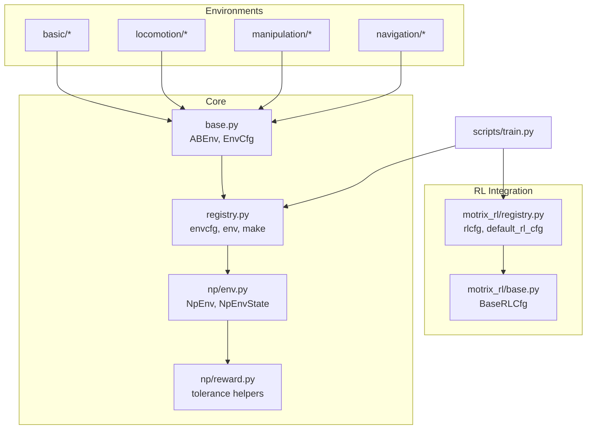
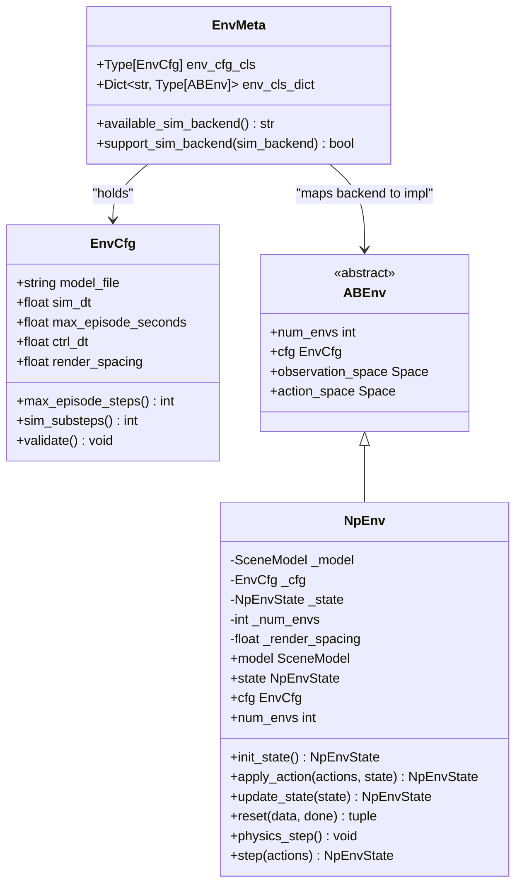
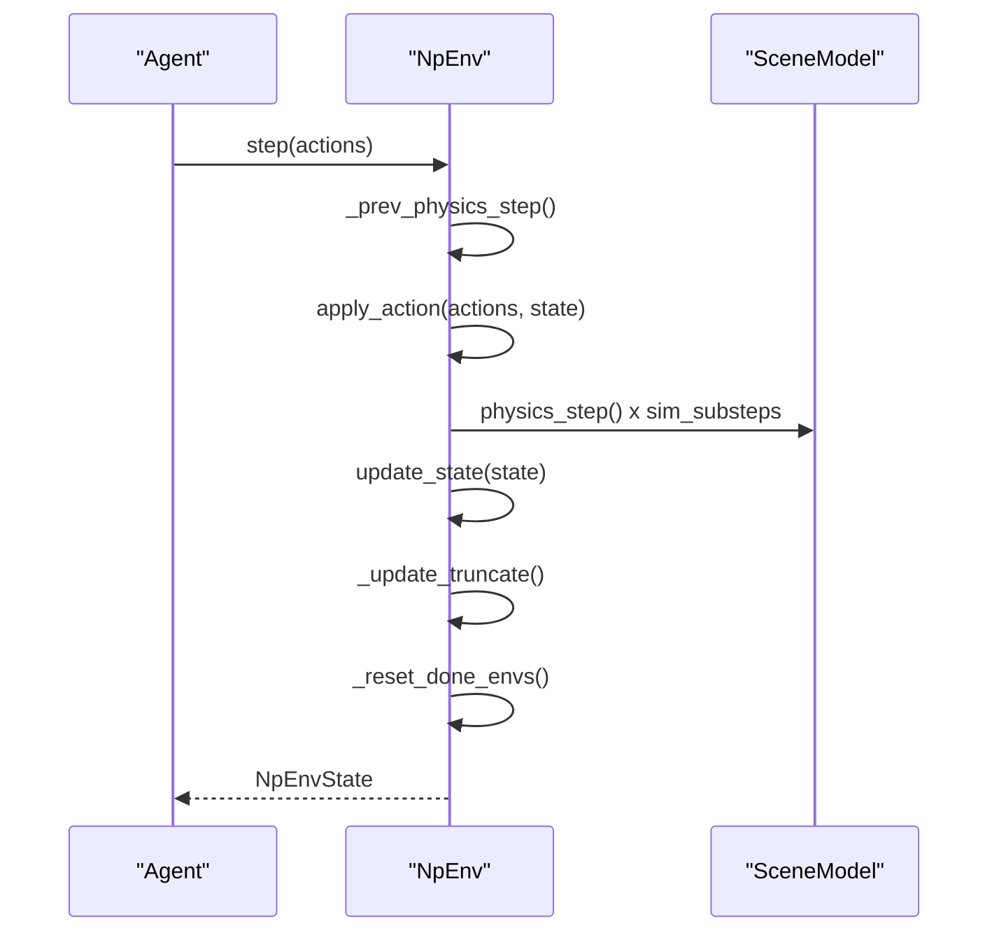
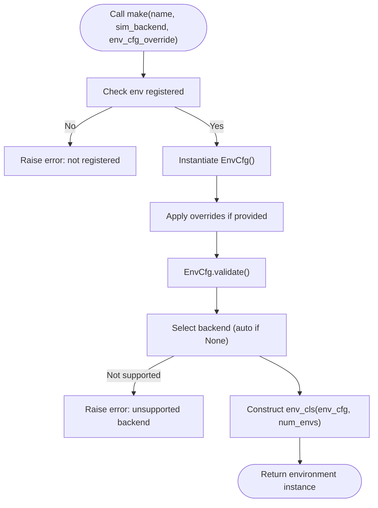
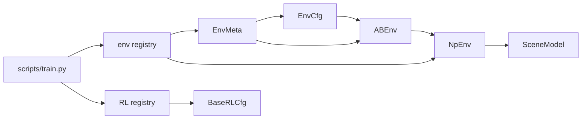

# Custom Environment Development

<cite>
**Referenced Files in This Document**
- [base.py](file://motrix_envs/src/motrix_envs/base.py)
- [registry.py](file://motrix_envs/src/motrix_envs/registry.py)
- [env.py](file://motrix_envs/src/motrix_envs/np/env.py)
- [reward.py](file://motrix_envs/src/motrix_envs/np/reward.py)
- [cartpole_np.py](file://motrix_envs/src/motrix_envs/basic/cartpole/cartpole_np.py)
- [cartpole cfg.py](file://motrix_envs/src/motrix_envs/basic/cartpole/cfg.py)
- [bounce_ball_np.py](file://motrix_envs/src/motrix_envs/basic/bounce_ball/bounce_ball_np.py)
- [bounce_ball cfg.py](file://motrix_envs/src/motrix_envs/basic/bounce_ball/cfg.py)
- [franka_lift_cube_np.py](file://motrix_envs/src/motrix_envs/manipulation/franka_lift_cube/franka_lift_cube_np.py)
- [franka_lift_cube cfg.py](file://motrix_envs/src/motrix_envs/manipulation/franka_lift_cube/cfg.py)
- [walk_np.py](file://motrix_envs/src/motrix_envs/locomotion/go1/walk_np.py)
- [go1 cfg.py](file://motrix_envs/src/motrix_envs/locomotion/go1/cfg.py)
- [registry.py](file://motrix_rl/src/motrix_rl/registry.py)
- [base.py](file://motrix_rl/src/motrix_rl/base.py)
- [train.py](file://scripts/train.py)
</cite>

## Table of Contents
1. [Introduction](#introduction)
2. [Project Structure](#project-structure)
3. [Core Components](#core-components)
4. [Architecture Overview](#architecture-overview)
5. [Detailed Component Analysis](#detailed-component-analysis)
6. [Dependency Analysis](#dependency-analysis)
7. [Performance Considerations](#performance-considerations)
8. [Troubleshooting Guide](#troubleshooting-guide)
9. [Conclusion](#conclusion)
10. [Appendices](#appendices)

## Introduction
This document explains how to develop custom environments in MotrixLab-S1. It covers the environment configuration class structure using dataclasses, parameter validation, inheritance mechanisms, and configuration overrides. It also documents the environment class implementation process, including state management, observation and action space definitions, and reward function design. Finally, it explains the registration system for integrating custom environments into the framework registry, provides step-by-step examples, and offers best practices, testing, debugging, and troubleshooting guidance.

## Project Structure
MotrixLab-S1 organizes environments by domain (basic, locomotion, manipulation, navigation) and provides a NumPy-based simulation backend (np). Environments inherit from a common base and integrate with a registry that supports dynamic creation and backend selection. Training integration is handled via a separate RL registry and configuration system.

**Diagram sources**
- [base.py](file://motrix_envs/src/motrix_envs/base.py#L23-L85)
- [registry.py](file://motrix_envs/src/motrix_envs/registry.py#L24-L172)
- [env.py](file://motrix_envs/src/motrix_envs/np/env.py#L26-L209)
- [reward.py](file://motrix_envs/src/motrix_envs/np/reward.py#L21-L84)
- [registry.py](file://motrix_rl/src/motrix_rl/registry.py#L28-L115)
- [base.py](file://motrix_rl/src/motrix_rl/base.py#L20-L43)
- [train.py](file://scripts/train.py#L52-L95)

**Section sources**
- [base.py](file://motrix_envs/src/motrix_envs/base.py#L16-L85)
- [registry.py](file://motrix_envs/src/motrix_envs/registry.py#L24-L172)
- [env.py](file://motrix_envs/src/motrix_envs/np/env.py#L26-L209)
- [registry.py](file://motrix_rl/src/motrix_rl/registry.py#L28-L115)
- [base.py](file://motrix_rl/src/motrix_rl/base.py#L20-L43)
- [train.py](file://scripts/train.py#L52-L95)

## Core Components
- Environment configuration base: a dataclass with validated timing parameters and derived properties for episode steps and simulation substeps.
- Abstract environment interface: defines required properties for configuration, spaces, and vectorization.
- NumPy environment: implements state lifecycle, physics stepping, and step orchestration.
- Registry: registers environment configurations and implementations, supports backend selection, and construction with overrides.

Key responsibilities:
- EnvCfg: centralizes simulation and episode timing; validates constraints; computes derived values.
- ABEnv: contract for environment implementations.
- NpEnv: manages SceneModel, batched state, and step loop; delegates observation, reward, and termination computation to subclasses.
- Registry: exposes decorators and factory method to construct environments with optional overrides.

**Section sources**
- [base.py](file://motrix_envs/src/motrix_envs/base.py#L23-L85)
- [env.py](file://motrix_envs/src/motrix_envs/np/env.py#L52-L209)
- [registry.py](file://motrix_envs/src/motrix_envs/registry.py#L24-L172)

## Architecture Overview
The environment architecture separates concerns across configuration, environment implementation, and registry. The registry decouples environment selection from implementation, enabling multiple backends per environment name. The NumPy backend encapsulates physics simulation and state transitions.

**Diagram sources**
- [base.py](file://motrix_envs/src/motrix_envs/base.py#L23-L85)
- [env.py](file://motrix_envs/src/motrix_envs/np/env.py#L52-L209)
- [registry.py](file://motrix_envs/src/motrix_envs/registry.py#L24-L38)

## Detailed Component Analysis

### Environment Configuration Class Structure
- Dataclass fields define simulation parameters and environment-specific settings.
- Validation ensures sim_dt ≤ ctrl_dt.
- Derived properties compute max steps and substeps from dt values.
- Configuration overrides are applied via the registry’s make function.

Best practices:
- Keep EnvCfg immutable-like; use dataclass fields for defaults and override via registry make.
- Centralize domain-specific parameters (e.g., noise, control gains, sensors) in nested dataclasses for clarity.

**Section sources**
- [base.py](file://motrix_envs/src/motrix_envs/base.py#L23-L60)
- [registry.py](file://motrix_envs/src/motrix_envs/registry.py#L114-L161)

### Parameter Validation and Overrides
- Validation raises errors early if timing constraints are violated.
- Overrides are applied before instantiation; unknown attributes trigger explicit errors.
- Episode truncation is computed from max_episode_steps; substepping is derived from dt ratio.

Common pitfalls:
- Forgetting to set model_file or mis-specifying dt relations.
- Attempting to override non-existent EnvCfg attributes.

**Section sources**
- [base.py](file://motrix_envs/src/motrix_envs/base.py#L53-L60)
- [registry.py](file://motrix_envs/src/motrix_envs/registry.py#L137-L147)

### Inheritance Mechanisms and Configuration Overrides
- Inheritance enables specialized EnvCfg variants (e.g., terrain-specific locomotion configs).
- Nested dataclasses encapsulate related parameters (e.g., NoiseConfig, ControlConfig, RewardConfig).
- Overrides passed to make are applied to the EnvCfg instance prior to validation.

Example patterns:
- Extend a base EnvCfg with domain-specific fields.
- Override only necessary fields while preserving defaults.

**Section sources**
- [go1 cfg.py](file://motrix_envs/src/motrix_envs/locomotion/go1/cfg.py#L122-L151)
- [franka_lift_cube cfg.py](file://motrix_envs/src/motrix_envs/manipulation/franka_lift_cube/cfg.py#L69-L84)

### Environment Class Implementation
- NpEnv manages a SceneModel, batched NpEnvState, and the simulation loop.
- Subclasses implement apply_action, update_state, and reset to define behavior.
- Observation and action spaces are defined as gymnasium spaces.

Implementation checklist:
- Define observation_space and action_space.
- Implement apply_action to map actions to actuator controls.
- Implement update_state to compute observations, rewards, and termination flags.
- Implement reset to initialize SceneData and info.

**Section sources**
- [env.py](file://motrix_envs/src/motrix_envs/np/env.py#L52-L209)
- [cartpole_np.py](file://motrix_envs/src/motrix_envs/basic/cartpole/cartpole_np.py#L26-L98)
- [bounce_ball_np.py](file://motrix_envs/src/motrix_envs/basic/bounce_ball/bounce_ball_np.py#L26-L309)
- [franka_lift_cube_np.py](file://motrix_envs/src/motrix_envs/manipulation/franka_lift_cube/franka_lift_cube_np.py#L32-L292)
- [walk_np.py](file://motrix_envs/src/motrix_envs/locomotion/go1/walk_np.py#L26-L387)

### State Management and Step Loop
- init_state initializes arrays for obs, reward, terminated, truncated, and info; resets done environments.
- step orchestrates previous step cleanup, action application, physics stepping, state updates, truncation checks, and environment resets.
- NpEnvState encapsulates batched data and provides validation and convenience helpers.

**Diagram sources**
- [env.py](file://motrix_envs/src/motrix_envs/np/env.py#L186-L209)

**Section sources**
- [env.py](file://motrix_envs/src/motrix_envs/np/env.py#L97-L209)

### Observation Space Definition
- Observations are concatenated DOF states or engineered features.
- Ensure shapes match the declared observation_space.
- Use info to carry auxiliary data (e.g., contacts, air time) for reward computation.

Examples:
- CartPole concatenates joint positions and velocities.
- Locomotion builds observations from sensors, joint angles, velocities, and commands.
- Manipulation composes robot DOF states with object poses and targets.

**Section sources**
- [cartpole_np.py](file://motrix_envs/src/motrix_envs/basic/cartpole/cartpole_np.py#L54-L75)
- [walk_np.py](file://motrix_envs/src/motrix_envs/locomotion/go1/walk_np.py#L188-L222)
- [franka_lift_cube_np.py](file://motrix_envs/src/motrix_envs/manipulation/franka_lift_cube/franka_lift_cube_np.py#L167-L183)

### Action Space Specification
- Actions are mapped to actuator controls; ensure shapes align with actuator limits.
- Normalize or denormalize actions as needed; maintain physical feasibility.

Examples:
- CartPole applies bounded continuous actions to a single actuator.
- Locomotion PD-control maps actions to desired joint positions; torques are computed internally.
- Manipulation handles both joint position offsets and gripper binary decisions.

**Section sources**
- [cartpole_np.py](file://motrix_envs/src/motrix_envs/basic/cartpole/cartpole_np.py#L30-L48)
- [walk_np.py](file://motrix_envs/src/motrix_envs/locomotion/go1/walk_np.py#L160-L174)
- [franka_lift_cube_np.py](file://motrix_envs/src/motrix_envs/manipulation/franka_lift_cube/franka_lift_cube_np.py#L72-L100)

### Reward Function Design
- Rewards are computed in update_state or dedicated methods; ensure broadcasting across batch dimension.
- Use domain-specific signals (e.g., tracking, regularization, termination) and combine with configurable scales.
- Consider using tolerance helpers for smooth shaping.

Patterns:
- Locomotion uses modular reward terms weighted by scales.
- Manipulation combines reach, lift, and command tracking with penalties for excessive actions/velocities.
- Bouncing ball balances positional control, upward velocity, and bounce counting.

**Section sources**
- [walk_np.py](file://motrix_envs/src/motrix_envs/locomotion/go1/walk_np.py#L249-L264)
- [franka_lift_cube_np.py](file://motrix_envs/src/motrix_envs/manipulation/franka_lift_cube/franka_lift_cube_np.py#L198-L265)
- [bounce_ball_np.py](file://motrix_envs/src/motrix_envs/basic/bounce_ball/bounce_ball_np.py#L85-L163)
- [reward.py](file://motrix_envs/src/motrix_envs/np/reward.py#L63-L84)

### Registration System
- Register environment configurations with envcfg and implementations with env.
- make constructs environments by name, applies overrides, selects backend, and validates.
- List registered environments and backends for introspection.

**Diagram sources**
- [registry.py](file://motrix_envs/src/motrix_envs/registry.py#L114-L161)

**Section sources**
- [registry.py](file://motrix_envs/src/motrix_envs/registry.py#L46-L100)
- [registry.py](file://motrix_envs/src/motrix_envs/registry.py#L114-L161)

### Step-by-Step Examples

#### Create a New Environment from Scratch
1. Define EnvCfg subclass with model_file, timing, and domain parameters.
2. Implement NpEnv subclass with observation/action spaces, apply_action, update_state, and reset.
3. Register the configuration and environment using envcfg and env decorators.
4. Instantiate via registry.make with optional overrides.

Reference implementations:
- Configuration: [cartpole cfg.py](file://motrix_envs/src/motrix_envs/basic/cartpole/cfg.py#L25-L32)
- Implementation: [cartpole_np.py](file://motrix_envs/src/motrix_envs/basic/cartpole/cartpole_np.py#L26-L98)

**Section sources**
- [cartpole cfg.py](file://motrix_envs/src/motrix_envs/basic/cartpole/cfg.py#L25-L32)
- [cartpole_np.py](file://motrix_envs/src/motrix_envs/basic/cartpole/cartpole_np.py#L26-L98)

#### Modify Existing Environment Configuration
- Extend a base EnvCfg with new fields or override selected ones.
- Use nested dataclasses to group related parameters (e.g., NoiseConfig, RewardConfig).
- Pass env_cfg_override to registry.make to adjust runtime behavior.

Reference implementations:
- Terrain variants: [go1 cfg.py](file://motrix_envs/src/motrix_envs/locomotion/go1/cfg.py#L139-L151)
- Nested configs: [franka_lift_cube cfg.py](file://motrix_envs/src/motrix_envs/manipulation/franka_lift_cube/cfg.py#L27-L84)

**Section sources**
- [go1 cfg.py](file://motrix_envs/src/motrix_envs/locomotion/go1/cfg.py#L139-L151)
- [franka_lift_cube cfg.py](file://motrix_envs/src/motrix_envs/manipulation/franka_lift_cube/cfg.py#L27-L84)

#### Implement Custom Physics Behaviors
- Use SceneModel APIs to query bodies/geoms/sensors and set DOF states.
- Implement PD control or torque mapping in apply_action.
- Track auxiliary info (e.g., contacts, air time) and use them in update_state.

Reference implementations:
- PD control and observation engineering: [walk_np.py](file://motrix_envs/src/motrix_envs/locomotion/go1/walk_np.py#L160-L286)
- Gripper action mapping and reward shaping: [franka_lift_cube_np.py](file://motrix_envs/src/motrix_envs/manipulation/franka_lift_cube/franka_lift_cube_np.py#L72-L265)

**Section sources**
- [walk_np.py](file://motrix_envs/src/motrix_envs/locomotion/go1/walk_np.py#L160-L286)
- [franka_lift_cube_np.py](file://motrix_envs/src/motrix_envs/manipulation/franka_lift_cube/franka_lift_cube_np.py#L72-L265)

## Dependency Analysis
- Environments depend on EnvCfg and ABEnv contracts; NpEnv depends on the simulation backend (SceneModel).
- Registry couples EnvCfg and environment classes by name and backend.
- RL integration depends on environment registration and provides RL configuration classes.

**Diagram sources**
- [base.py](file://motrix_envs/src/motrix_envs/base.py#L23-L85)
- [env.py](file://motrix_envs/src/motrix_envs/np/env.py#L52-L209)
- [registry.py](file://motrix_envs/src/motrix_envs/registry.py#L24-L172)
- [registry.py](file://motrix_rl/src/motrix_rl/registry.py#L28-L115)
- [base.py](file://motrix_rl/src/motrix_rl/base.py#L20-L43)
- [train.py](file://scripts/train.py#L52-L95)

**Section sources**
- [base.py](file://motrix_envs/src/motrix_envs/base.py#L23-L85)
- [registry.py](file://motrix_envs/src/motrix_envs/registry.py#L24-L172)
- [env.py](file://motrix_envs/src/motrix_envs/np/env.py#L52-L209)
- [registry.py](file://motrix_rl/src/motrix_rl/registry.py#L28-L115)
- [base.py](file://motrix_rl/src/motrix_rl/base.py#L20-L43)
- [train.py](file://scripts/train.py#L52-L95)

## Performance Considerations
- Prefer vectorized operations across the batch dimension to maximize utilization of the NumPy backend.
- Minimize redundant computations in update_state; cache sensor queries when appropriate.
- Tune sim_dt and ctrl_dt to balance fidelity and speed; ensure sim_substeps remains integer.
- Use info for auxiliary data to avoid recomputation in subsequent steps.

[No sources needed since this section provides general guidance]

## Troubleshooting Guide
Common issues and resolutions:
- Timing mismatch: ensure sim_dt ≤ ctrl_dt; EnvCfg.validate will raise an error otherwise.
- Unknown config override keys: make will raise an error for non-existent attributes; verify EnvCfg fields.
- Backend not supported: only "np" is supported; attempting others will fail fast.
- Shape mismatches: verify observation/action shapes and ensure broadcasting across batch dimension.
- NaNs in observations or rewards: add assertions and sanitize inputs (e.g., clipping, finite checks).
- Episode termination not triggered: confirm update_state sets terminated/truncated consistently.

Debugging tips:
- Inspect NpEnvState shapes and dt-derived properties.
- Temporarily disable reward shaping to isolate observation computation.
- Use small batch sizes and deterministic seeds for reproducibility.

**Section sources**
- [base.py](file://motrix_envs/src/motrix_envs/base.py#L53-L60)
- [registry.py](file://motrix_envs/src/motrix_envs/registry.py#L137-L147)
- [env.py](file://motrix_envs/src/motrix_envs/np/env.py#L45-L50)
- [franka_lift_cube_np.py](file://motrix_envs/src/motrix_envs/manipulation/franka_lift_cube/franka_lift_cube_np.py#L161-L163)

## Conclusion
MotrixLab-S1 provides a robust foundation for building custom environments using dataclass-based configurations, a clean environment abstraction, and a flexible registry. By following the patterns demonstrated in the included environments—clearly separating configuration, implementation, and registration—you can efficiently develop new tasks, extend existing ones, and integrate them into training pipelines with confidence.

[No sources needed since this section summarizes without analyzing specific files]

## Appendices

### Best Practices Checklist
- Encapsulate domain parameters in nested dataclasses for readability.
- Validate EnvCfg invariants and keep overrides minimal.
- Define gymnasium spaces explicitly and verify shapes.
- Implement modular reward computation with configurable scales.
- Use info for auxiliary data to avoid recomputation.
- Register environments with descriptive names and consistent backends.

[No sources needed since this section provides general guidance]