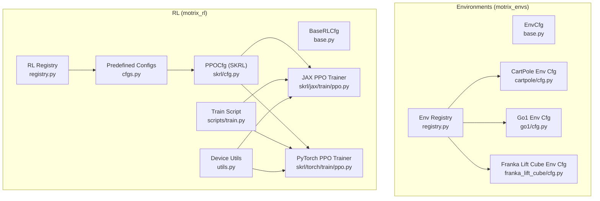
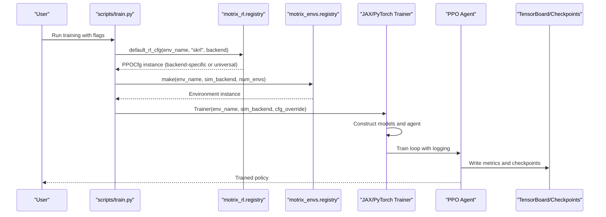
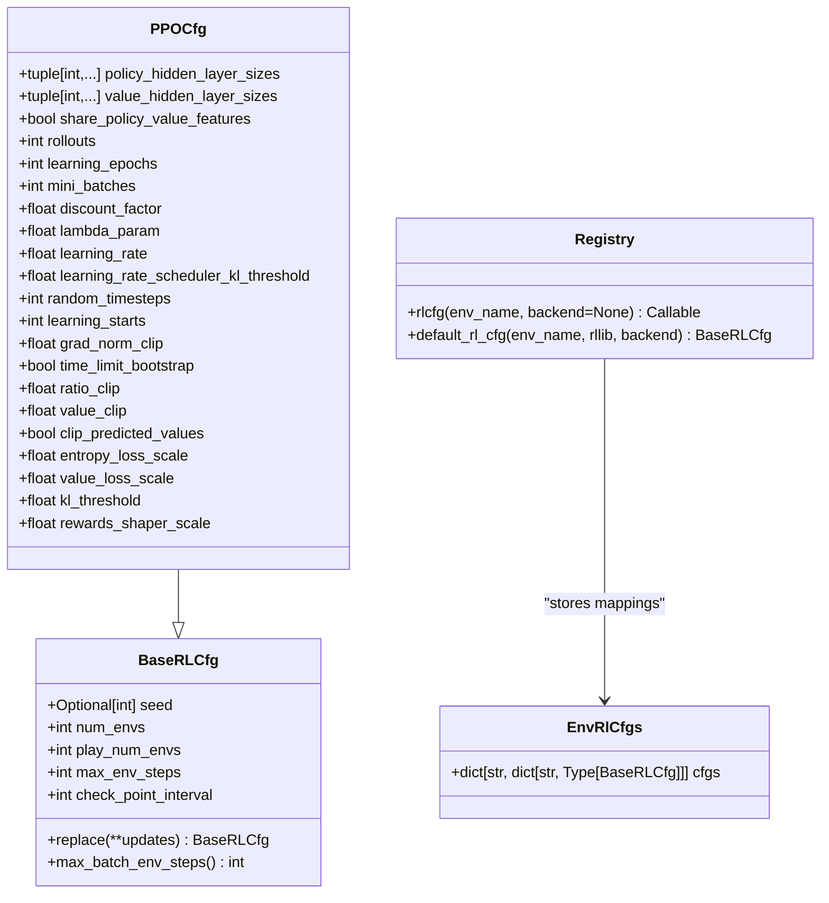
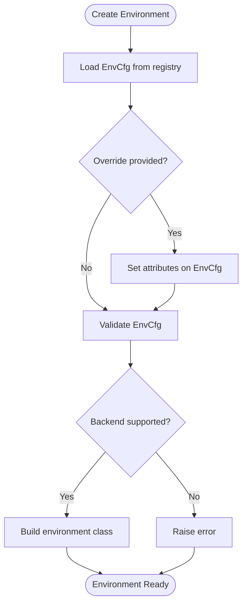
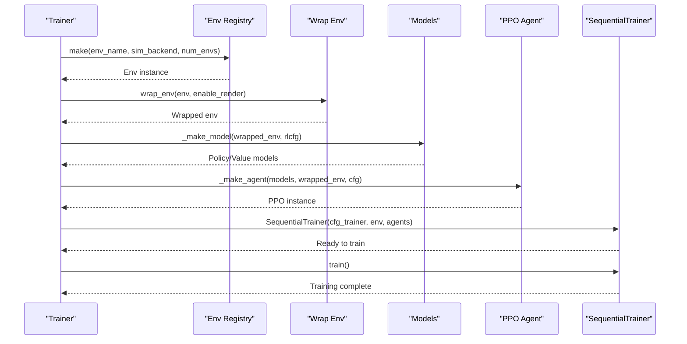
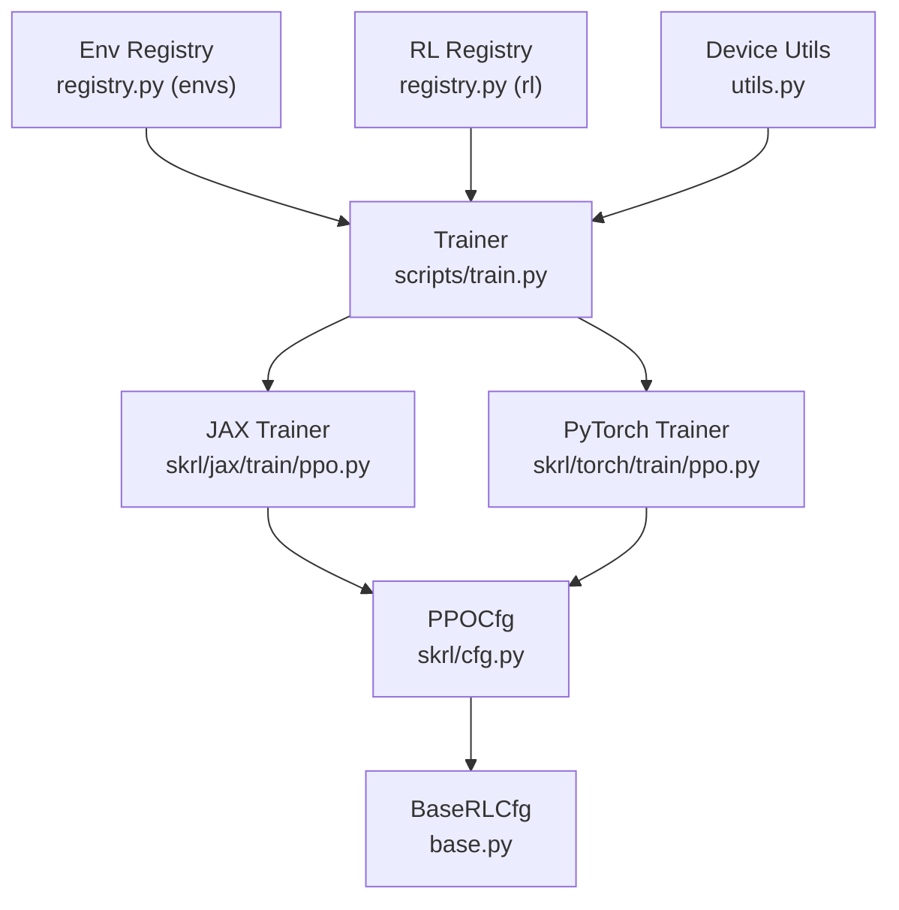

# Custom Training Configurations

<cite>
**Referenced Files in This Document**
- [base.py](file://motrix_rl/src/motrix_rl/base.py)
- [cfg.py](file://motrix_rl/src/motrix_rl/skrl/cfg.py)
- [cfgs.py](file://motrix_rl/src/motrix_rl/cfgs.py)
- [registry.py](file://motrix_rl/src/motrix_rl/registry.py)
- [utils.py](file://motrix_rl/src/motrix_rl/utils.py)
- [ppo.py (JAX)](file://motrix_rl/src/motrix_rl/skrl/jax/train/ppo.py)
- [ppo.py (PyTorch)](file://motrix_rl/src/motrix_rl/skrl/torch/train/ppo.py)
- [registry.py (envs)](file://motrix_envs/src/motrix_envs/registry.py)
- [base.py (envs)](file://motrix_envs/src/motrix_envs/base.py)
- [train.py](file://scripts/train.py)
- [cartpole cfg.py](file://motrix_envs/src/motrix_envs/basic/cartpole/cfg.py)
- [go1 cfg.py](file://motrix_envs/src/motrix_envs/locomotion/go1/cfg.py)
- [franka lift cube cfg.py](file://motrix_envs/src/motrix_envs/manipulation/franka_lift_cube/cfg.py)
</cite>

## Table of Contents
1. [Introduction](#introduction)
2. [Project Structure](#project-structure)
3. [Core Components](#core-components)
4. [Architecture Overview](#architecture-overview)
5. [Detailed Component Analysis](#detailed-component-analysis)
6. [Dependency Analysis](#dependency-analysis)
7. [Performance Considerations](#performance-considerations)
8. [Troubleshooting Guide](#troubleshooting-guide)
9. [Conclusion](#conclusion)
10. [Appendices](#appendices)

## Introduction
This document explains how to create custom training configurations for MotrixLab-S1. It focuses on the RL configuration base class, parameter inheritance patterns, and configuration override mechanisms. You will learn how to implement custom training configurations for different environments, tune hyperparameters, customize algorithm-specific settings, select backends, and manage experiments. It also covers the RL registry system that maps environments to training configurations, provides examples for PPO training parameters, reward shaping customization, and advanced training strategies. Multi-backend support for JAX and PyTorch is documented along with backend-specific optimizations and performance considerations. Finally, it addresses configuration validation, experiment tracking, result management, debugging training issues, and optimizing convergence performance.

## Project Structure
MotrixLab-S1 separates environment definitions from RL training configurations. Environments are defined in the motrix_envs package, while RL training configurations and trainers live in the motrix_rl package. The RL registry maps environment names to configuration classes and supports multiple backends.

**Diagram sources**
- [base.py](file://motrix_rl/src/motrix_rl/base.py#L20-L43)
- [cfg.py](file://motrix_rl/src/motrix_rl/skrl/cfg.py#L28-L74)
- [cfgs.py](file://motrix_rl/src/motrix_rl/cfgs.py#L22-L333)
- [registry.py](file://motrix_rl/src/motrix_rl/registry.py#L28-L115)
- [utils.py](file://motrix_rl/src/motrix_rl/utils.py#L19-L62)
- [ppo.py (JAX)](file://motrix_rl/src/motrix_rl/skrl/jax/train/ppo.py#L145-L301)
- [ppo.py (PyTorch)](file://motrix_rl/src/motrix_rl/skrl/torch/train/ppo.py#L145-L356)
- [registry.py (envs)](file://motrix_envs/src/motrix_envs/registry.py#L24-L172)
- [base.py (envs)](file://motrix_envs/src/motrix_envs/base.py#L23-L85)
- [train.py](file://scripts/train.py#L39-L95)

**Section sources**
- [base.py](file://motrix_rl/src/motrix_rl/base.py#L20-L43)
- [cfg.py](file://motrix_rl/src/motrix_rl/skrl/cfg.py#L28-L74)
- [cfgs.py](file://motrix_rl/src/motrix_rl/cfgs.py#L22-L333)
- [registry.py](file://motrix_rl/src/motrix_rl/registry.py#L28-L115)
- [utils.py](file://motrix_rl/src/motrix_rl/utils.py#L19-L62)
- [ppo.py (JAX)](file://motrix_rl/src/motrix_rl/skrl/jax/train/ppo.py#L145-L301)
- [ppo.py (PyTorch)](file://motrix_rl/src/motrix_rl/skrl/torch/train/ppo.py#L145-L356)
- [registry.py (envs)](file://motrix_envs/src/motrix_envs/registry.py#L24-L172)
- [base.py (envs)](file://motrix_envs/src/motrix_envs/base.py#L23-L85)
- [train.py](file://scripts/train.py#L39-L95)

## Core Components
- BaseRLCfg: Defines baseline training parameters and provides a replace mechanism for overrides.
- PPOCfg (SKRL): Extends BaseRLCfg with PPO-specific hyperparameters and loss settings.
- Predefined configs (cfgs.py): Provides environment-specific PPO configurations grouped by domains (basic, locomotion, manipulation, navigation).
- RL Registry (registry.py): Registers and retrieves environment-to-config mappings for specific RL frameworks and backends.
- Trainers (JAX/PyTorch): Implement PPO training loops, model construction, and experiment logging.

Key capabilities:
- Parameter inheritance: Child configs inherit and override parent fields.
- Backend selection: Configs can be registered for specific backends (jax/torch) or universal fallback.
- Overrides: Runtime overrides via replace() and CLI flags.
- Experiment tracking: Logging to TensorBoard and checkpointing integrated in trainers.

**Section sources**
- [base.py](file://motrix_rl/src/motrix_rl/base.py#L20-L43)
- [cfg.py](file://motrix_rl/src/motrix_rl/skrl/cfg.py#L28-L74)
- [cfgs.py](file://motrix_rl/src/motrix_rl/cfgs.py#L22-L333)
- [registry.py](file://motrix_rl/src/motrix_rl/registry.py#L28-L115)

## Architecture Overview
The RL configuration system is layered:
- Environment registry defines environments and backends.
- RL registry maps environment names to configuration classes for a given RL framework and backend.
- Predefined configs subclass PPOCfg and are decorated with rlcfg to register them.
- Trainers load the appropriate config, construct models, and run training.

**Diagram sources**
- [train.py](file://scripts/train.py#L52-L95)
- [registry.py](file://motrix_rl/src/motrix_rl/registry.py#L81-L115)
- [registry.py (envs)](file://motrix_envs/src/motrix_envs/registry.py#L114-L161)
- [ppo.py (JAX)](file://motrix_rl/src/motrix_rl/skrl/jax/train/ppo.py#L145-L185)
- [ppo.py (PyTorch)](file://motrix_rl/src/motrix_rl/skrl/torch/train/ppo.py#L145-L184)

## Detailed Component Analysis

### Base Configuration Classes
- BaseRLCfg: Centralizes common training parameters (seed, num_envs, play_num_envs, max_env_steps, check_point_interval) and computes max_batch_env_steps.
- PPOCfg (SKRL): Adds PPO-specific fields (network sizes, rollouts, learning_epochs, mini_batches, discount_factor, lambda_param, learning_rate, scheduler threshold, grad_norm_clip, clipping parameters, entropy/value loss scales, KL threshold, rewards_shaper_scale).

Implementation patterns:
- dataclass-based configuration enables easy replacement via replace().
- max_batch_env_steps rounds total steps to multiples of check_point_interval for consistent checkpointing.

**Section sources**
- [base.py](file://motrix_rl/src/motrix_rl/base.py#L20-L43)
- [cfg.py](file://motrix_rl/src/motrix_rl/skrl/cfg.py#L28-L74)

### RL Registry and Configuration Registration
- EnvRlCfgs: Stores mapping from environment to RL framework to backend to configuration class.
- rlcfg decorator: Registers a configuration class for an environment and backend. If backend is None, it registers for all backends.
- default_rl_cfg: Retrieves backend-specific config if present; otherwise falls back to universal config; raises errors if missing.

**Diagram sources**
- [registry.py](file://motrix_rl/src/motrix_rl/registry.py#L28-L115)
- [base.py](file://motrix_rl/src/motrix_rl/base.py#L20-L43)
- [cfg.py](file://motrix_rl/src/motrix_rl/skrl/cfg.py#L28-L74)

**Section sources**
- [registry.py](file://motrix_rl/src/motrix_rl/registry.py#L28-L115)

### Predefined Training Configurations
Predefined configs are organized by domain and environment. They inherit from PPOCfg and override fields to tailor training to specific tasks.

Examples:
- Basic environments (cartpole, bounce_ball): Adjust hidden layer sizes, rollouts, learning_epochs, mini_batches, learning_rate, and num_envs.
- DeepMind-style locomotion (dm-walker, dm-runner, dm-cheetah, dm-hopper-stand/hop, dm-reacher): Provide backend-specific variants (jax/torch) with tuned hyperparameters.
- Locomotion robots (go1, go2): Configure policy/value hidden sizes, rollouts, learning_epochs, mini_batches, learning_rate, and feature sharing.
- Manipulation (franka-lift-cube, franka-open-cabinet): Include reward shaping and entropy loss scaling tailored to manipulation tasks.
- Navigation (anymal_c_navigation_flat, vbot_navigation_section001): Comprehensive PPO parameters including discount factor, lambda, clipping, and gradient norm clipping.

Override mechanisms:
- Field assignment in dataclass subclasses.
- Backend-specific registration via rlcfg with backend parameter.
- Runtime overrides via Trainer constructor’s cfg_override argument.

**Section sources**
- [cfgs.py](file://motrix_rl/src/motrix_rl/cfgs.py#L22-L333)

### Multi-Backend Support (JAX and PyTorch)
- Backend selection: default_rl_cfg prefers backend-specific configs; if absent, falls back to universal config.
- Device detection: get_device_supports determines availability of torch and jax backends and GPUs.
- Trainer initialization: scripts/train.py selects backend based on device support or flag, then imports the appropriate trainer module.
- Model construction: JAX uses Flax/Linen; PyTorch uses torch.nn. Both respect policy/value hidden layer sizes and feature sharing settings.

Backend-specific optimizations:
- JAX: Uses Flax models and SKRL JAX wrappers; rewards shaper can be a lambda; preprocessor uses JAX scalers.
- PyTorch: Supports shared feature extraction when policy/value architectures match; otherwise builds separate networks; uses PyTorch scalers and schedulers.

**Section sources**
- [utils.py](file://motrix_rl/src/motrix_rl/utils.py#L19-L62)
- [train.py](file://scripts/train.py#L39-L95)
- [ppo.py (JAX)](file://motrix_rl/src/motrix_rl/skrl/jax/train/ppo.py#L145-L301)
- [ppo.py (PyTorch)](file://motrix_rl/src/motrix_rl/skrl/torch/train/ppo.py#L145-L356)

### Environment Integration and Validation
- Environment registry: Registers environment configurations and environment classes per backend.
- make(): Creates environment instances with optional overrides and validates configuration.
- Environment base: EnvCfg provides validation checks (e.g., sim_dt vs ctrl_dt) and derived properties (max episode steps, simulation substeps).

**Diagram sources**
- [registry.py (envs)](file://motrix_envs/src/motrix_envs/registry.py#L114-L161)
- [base.py (envs)](file://motrix_envs/src/motrix_envs/base.py#L53-L59)

**Section sources**
- [registry.py (envs)](file://motrix_envs/src/motrix_envs/registry.py#L24-L172)
- [base.py (envs)](file://motrix_envs/src/motrix_envs/base.py#L23-L85)

### PPO Training Implementation Details
- Configuration mapping: _get_cfg translates PPOCfg fields into SKRL agent configuration dictionaries.
- Agent extension: PPO subclasses add custom reward tracking and metrics collection.
- Trainer lifecycle: train() constructs environment, wraps it, builds models, creates agent, sets up trainer, and runs training.
- Play mode: play() loads a saved policy and renders episodes at a fixed FPS.

**Diagram sources**
- [ppo.py (JAX)](file://motrix_rl/src/motrix_rl/skrl/jax/train/ppo.py#L145-L185)
- [ppo.py (PyTorch)](file://motrix_rl/src/motrix_rl/skrl/torch/train/ppo.py#L145-L184)

**Section sources**
- [ppo.py (JAX)](file://motrix_rl/src/motrix_rl/skrl/jax/train/ppo.py#L145-L301)
- [ppo.py (PyTorch)](file://motrix_rl/src/motrix_rl/skrl/torch/train/ppo.py#L145-L356)

### Creating Custom Training Configurations
Steps to implement a new custom training configuration:
1. Define a new environment configuration class in the environment registry (if needed).
2. Create a new dataclass subclassing PPOCfg in the RL configs module.
3. Register the configuration using the rlcfg decorator with the environment name and desired backend(s).
4. Override fields to tune hyperparameters for your environment.
5. Optionally provide backend-specific variants for jax and torch.
6. Use runtime overrides via Trainer(cfg_override=...) or CLI flags to adjust parameters dynamically.

Example patterns:
- Hyperparameter tuning: Adjust learning_rate, rollouts, learning_epochs, mini_batches, policy/value_hidden_layer_sizes.
- Algorithm-specific settings: Modify ratio_clip, value_clip, clip_predicted_values, entropy_loss_scale, value_loss_scale, kl_threshold.
- Backend selection: Register the same config for both backends or provide distinct variants.

**Section sources**
- [cfgs.py](file://motrix_rl/src/motrix_rl/cfgs.py#L22-L333)
- [cfg.py](file://motrix_rl/src/motrix_rl/skrl/cfg.py#L28-L74)
- [registry.py](file://motrix_rl/src/motrix_rl/registry.py#L63-L78)

### Advanced Training Strategies and Reward Shaping
- Reward shaping: Use rewards_shaper_scale to multiply rewards during training. The JAX/PyTorch trainers conditionally apply a lambda reward shaper when the scale differs from 1.0.
- Metrics tracking: PPO subclasses record custom reward components and metrics from environment info dictionaries, aggregating instant and total metrics per episode.
- Entropy and value losses: Tune entropy_loss_scale and value_loss_scale to balance exploration and value fitting.
- Clipping and normalization: ratio_clip, value_clip, clip_predicted_values, grad_norm_clip help stabilize training.

**Section sources**
- [cfg.py](file://motrix_rl/src/motrix_rl/skrl/cfg.py#L68-L74)
- [ppo.py (JAX)](file://motrix_rl/src/motrix_rl/skrl/jax/train/ppo.py#L38-L84)
- [ppo.py (PyTorch)](file://motrix_rl/src/motrix_rl/skrl/torch/train/ppo.py#L37-L83)

## Dependency Analysis
The RL configuration system depends on:
- Environment registry for environment creation and validation.
- RL registry for mapping environments to configuration classes.
- Backend availability utilities for selecting appropriate trainer modules.
- SKRL trainers and agents for executing training loops.

**Diagram sources**
- [registry.py (envs)](file://motrix_envs/src/motrix_envs/registry.py#L114-L161)
- [registry.py (rl)](file://motrix_rl/src/motrix_rl/registry.py#L81-L115)
- [utils.py](file://motrix_rl/src/motrix_rl/utils.py#L39-L62)
- [train.py](file://scripts/train.py#L52-L95)
- [ppo.py (JAX)](file://motrix_rl/src/motrix_rl/skrl/jax/train/ppo.py#L145-L301)
- [ppo.py (PyTorch)](file://motrix_rl/src/motrix_rl/skrl/torch/train/ppo.py#L145-L356)
- [cfg.py](file://motrix_rl/src/motrix_rl/skrl/cfg.py#L28-L74)
- [base.py](file://motrix_rl/src/motrix_rl/base.py#L20-L43)

**Section sources**
- [registry.py (envs)](file://motrix_envs/src/motrix_envs/registry.py#L24-L172)
- [registry.py (rl)](file://motrix_rl/src/motrix_rl/registry.py#L28-L115)
- [utils.py](file://motrix_rl/src/motrix_rl/utils.py#L19-L62)
- [train.py](file://scripts/train.py#L39-L95)
- [ppo.py (JAX)](file://motrix_rl/src/motrix_rl/skrl/jax/train/ppo.py#L145-L301)
- [ppo.py (PyTorch)](file://motrix_rl/src/motrix_rl/skrl/torch/train/ppo.py#L145-L356)
- [cfg.py](file://motrix_rl/src/motrix_rl/skrl/cfg.py#L28-L74)
- [base.py](file://motrix_rl/src/motrix_rl/base.py#L20-L43)

## Performance Considerations
- Parallel environments: Increase num_envs to improve sample efficiency; ensure sufficient GPU/CPU resources.
- Rollouts and mini-batches: Larger rollouts increase data reuse; smaller mini_batches increase update frequency.
- Learning rate scheduling: Use learning_rate_scheduler_kl_threshold to adapt learning rates based on KL divergence.
- Gradient clipping: grad_norm_clip prevents exploding gradients.
- Feature sharing (PyTorch): share_policy_value_features reduces parameters and computation when architectures match.
- Backend choice: Prefer GPU-enabled backends when available; JAX and PyTorch have different strengths in model composition and numerical stability.

[No sources needed since this section provides general guidance]

## Troubleshooting Guide
Common issues and resolutions:
- Environment not registered: Ensure the environment is registered in the environment registry before requesting a training configuration.
- No configuration found: Verify that a backend-specific or universal config exists for the environment and RL framework.
- Backend mismatch: Confirm that the selected backend is supported by the environment and available on the device.
- Configuration validation errors: Check EnvCfg validation rules (e.g., sim_dt <= ctrl_dt) and correct environment configuration overrides.
- Training instability: Reduce learning_rate, adjust ratio_clip/value_clip, increase entropy_loss_scale, or lower rewards_shaper_scale.
- Poor convergence: Increase rollouts, learning_epochs, or num_envs; verify reward shaping and metrics tracking.

**Section sources**
- [registry.py (rl)](file://motrix_rl/src/motrix_rl/registry.py#L94-L114)
- [registry.py (envs)](file://motrix_envs/src/motrix_envs/registry.py#L132-L161)
- [base.py (envs)](file://motrix_envs/src/motrix_envs/base.py#L53-L59)

## Conclusion
MotrixLab-S1 provides a robust, extensible framework for custom RL training configurations. By leveraging BaseRLCfg and PPOCfg, you can inherit sensible defaults and override only what is necessary for your environment. The RL registry system cleanly maps environments to backend-specific configurations, enabling multi-backend training with minimal code changes. With predefined configurations for diverse domains and environments, plus comprehensive experiment tracking and validation, you can rapidly prototype, tune, and deploy RL policies across JAX and PyTorch backends.

[No sources needed since this section summarizes without analyzing specific files]

## Appendices

### Appendix A: Environment and Config Examples
- CartPole: Simple environment with small networks and modest rollouts.
- Go1 locomotion: Complex locomotion with terrain variations and reward shaping.
- Franka manipulation: High-dimensional action spaces with precise control and reward scaling.

**Section sources**
- [cartpole cfg.py](file://motrix_envs/src/motrix_envs/basic/cartpole/cfg.py#L25-L32)
- [go1 cfg.py](file://motrix_envs/src/motrix_envs/locomotion/go1/cfg.py#L122-L188)
- [franka lift cube cfg.py](file://motrix_envs/src/motrix_envs/manipulation/franka_lift_cube/cfg.py#L69-L84)

### Appendix B: CLI Flags and Overrides
- Environment selection: --env
- Simulation backend: --sim-backend
- Training backend: --train-backend
- Rendering: --render
- Parallel environments: --num-envs
- Seeds: --seed or --rand-seed

Overrides precedence:
- CLI flags populate rl_override dictionary.
- Trainer(cfg_override=...) merges overrides into the loaded configuration.
- replace() ensures immutable updates to configuration instances.

**Section sources**
- [train.py](file://scripts/train.py#L26-L67)
- [ppo.py (JAX)](file://motrix_rl/src/motrix_rl/skrl/jax/train/ppo.py#L152-L162)
- [ppo.py (PyTorch)](file://motrix_rl/src/motrix_rl/skrl/torch/train/ppo.py#L152-L162)