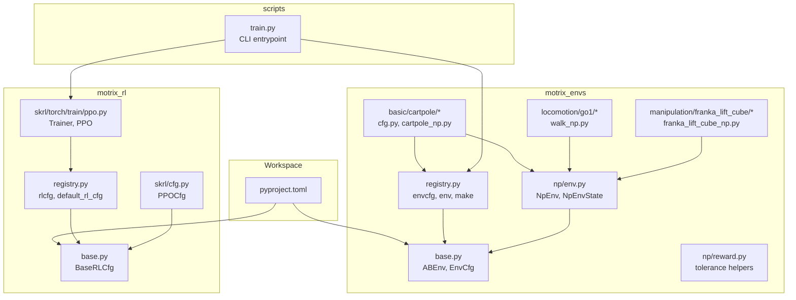
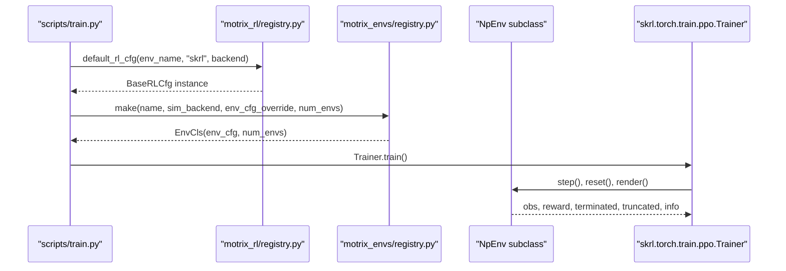
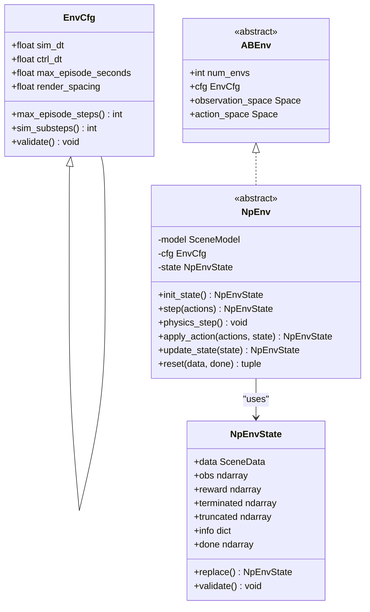
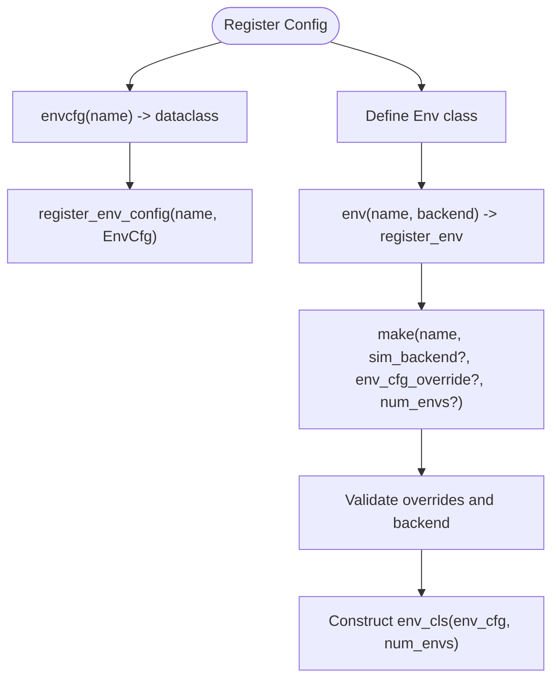
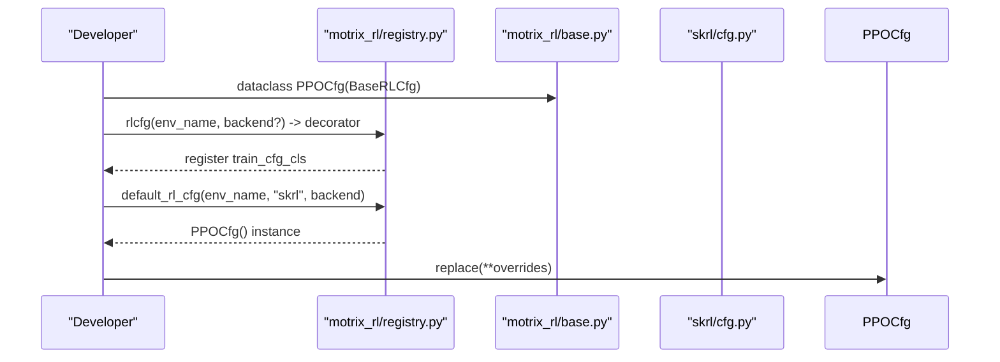
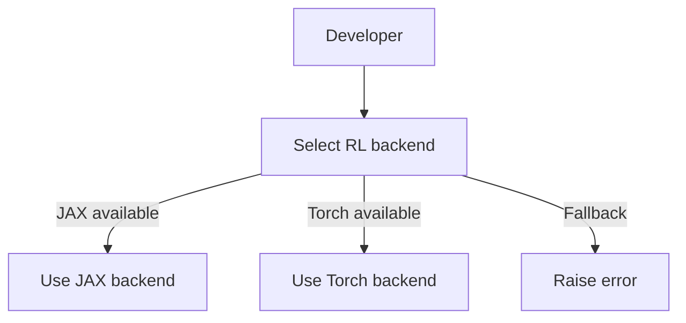
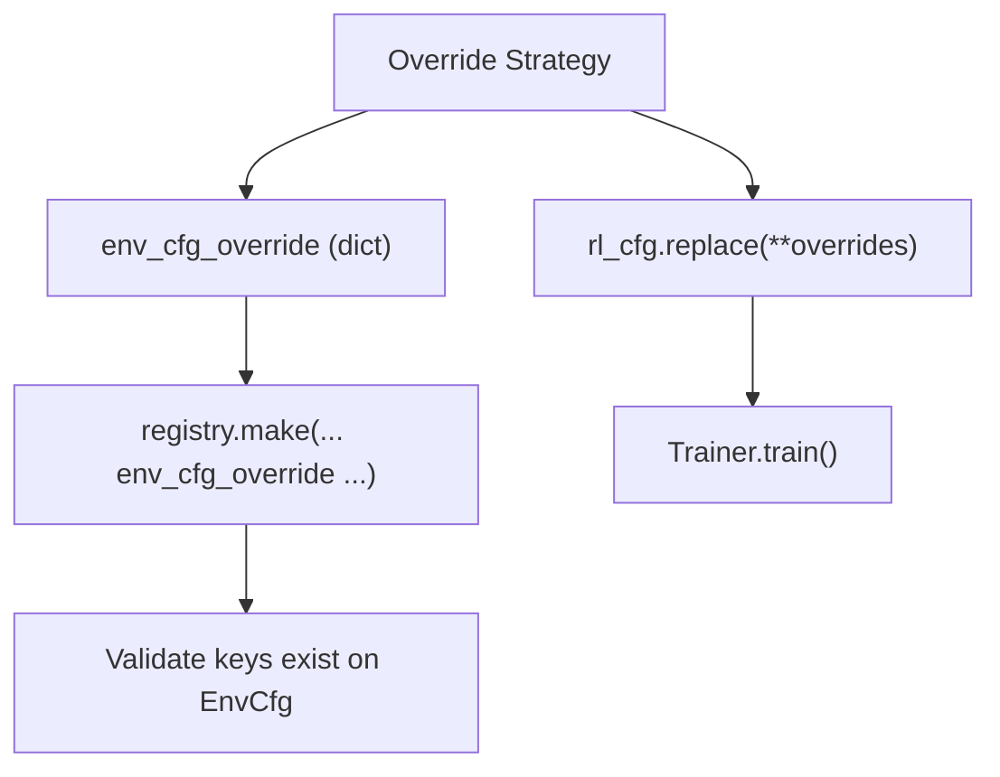
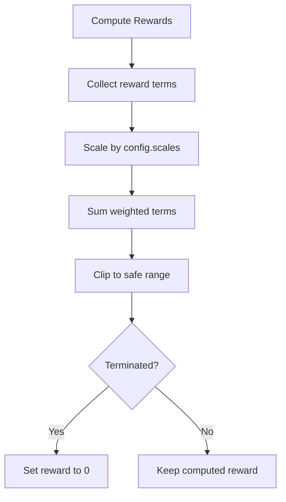
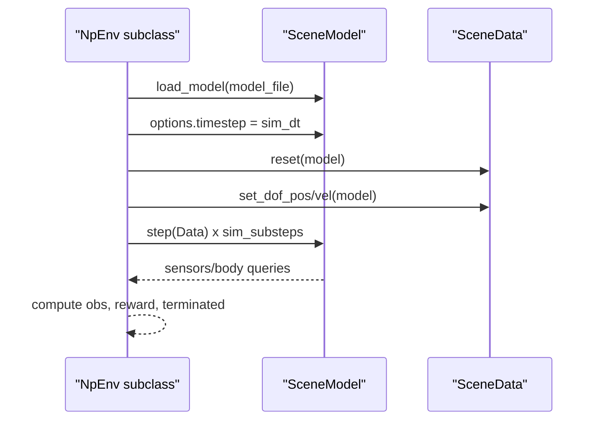
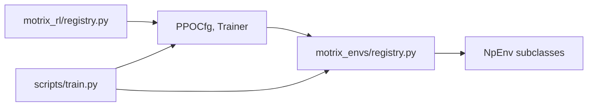

# Development Guide

<cite>
**Referenced Files in This Document**
- [base.py](file://motrix_envs/src/motrix_envs/base.py)
- [registry.py](file://motrix_envs/src/motrix_envs/registry.py)
- [np/env.py](file://motrix_envs/src/motrix_envs/np/env.py)
- [np/reward.py](file://motrix_envs/src/motrix_envs/np/reward.py)
- [basic/cartpole/cfg.py](file://motrix_envs/src/motrix_envs/basic/cartpole/cfg.py)
- [basic/cartpole/cartpole_np.py](file://motrix_envs/src/motrix_envs/basic/cartpole/cartpole_np.py)
- [locomotion/go1/walk_np.py](file://motrix_envs/src/motrix_envs/locomotion/go1/walk_np.py)
- [manipulation/franka_lift_cube/franka_lift_cube_np.py](file://motrix_envs/src/motrix_envs/manipulation/franka_lift_cube/franka_lift_cube_np.py)
- [base.py](file://motrix_rl/src/motrix_rl/base.py)
- [registry.py](file://motrix_rl/src/motrix_rl/registry.py)
- [skrl/cfg.py](file://motrix_rl/src/motrix_rl/skrl/cfg.py)
- [skrl/torch/train/ppo.py](file://motrix_rl/src/motrix_rl/skrl/torch/train/ppo.py)
- [train.py](file://scripts/train.py)
- [pyproject.toml](file://pyproject.toml)
</cite>

## Table of Contents
1. [Introduction](#introduction)
2. [Project Structure](#project-structure)
3. [Core Components](#core-components)
4. [Architecture Overview](#architecture-overview)
5. [Detailed Component Analysis](#detailed-component-analysis)
6. [Dependency Analysis](#dependency-analysis)
7. [Performance Considerations](#performance-considerations)
8. [Troubleshooting Guide](#troubleshooting-guide)
9. [Conclusion](#conclusion)
10. [Appendices](#appendices)

## Introduction
This development guide explains how to extend and customize the MotrixLab-S1 framework. It covers creating custom environments (configuration and class implementation), registering them, building custom training configurations, adapting to backend differences, overriding parameters, designing reward functions, modifying physics models, and integrating with the existing framework. It also provides best practices for code organization, testing, debugging, performance optimization, and contributing to the project.

## Project Structure
MotrixLab-S1 is organized as a Python workspace with two primary packages:
- motrix_envs: Environment definitions, configuration classes, and environment implementations (currently with a NumPy-based backend).
- motrix_rl: Reinforcement learning configuration and training wrappers for SKRL with JAX and Torch backends.
- scripts: CLI entry points for training and playing.

**Diagram sources**
- [pyproject.toml](file://pyproject.toml#L21-L29)
- [base.py](file://motrix_envs/src/motrix_envs/base.py#L23-L85)
- [registry.py](file://motrix_envs/src/motrix_envs/registry.py#L24-L172)
- [np/env.py](file://motrix_envs/src/motrix_envs/np/env.py#L26-L209)
- [np/reward.py](file://motrix_envs/src/motrix_envs/np/reward.py#L21-L84)
- [basic/cartpole/cfg.py](file://motrix_envs/src/motrix_envs/basic/cartpole/cfg.py#L25-L32)
- [basic/cartpole/cartpole_np.py](file://motrix_envs/src/motrix_envs/basic/cartpole/cartpole_np.py#L26-L98)
- [locomotion/go1/walk_np.py](file://motrix_envs/src/motrix_envs/locomotion/go1/walk_np.py#L26-L387)
- [manipulation/franka_lift_cube/franka_lift_cube_np.py](file://motrix_envs/src/motrix_envs/manipulation/franka_lift_cube/franka_lift_cube_np.py#L32-L292)
- [base.py](file://motrix_rl/src/motrix_rl/base.py#L20-L43)
- [registry.py](file://motrix_rl/src/motrix_rl/registry.py#L28-L115)
- [skrl/cfg.py](file://motrix_rl/src/motrix_rl/skrl/cfg.py#L28-L74)
- [skrl/torch/train/ppo.py](file://motrix_rl/src/motrix_rl/skrl/torch/train/ppo.py#L145-L356)
- [train.py](file://scripts/train.py#L52-L95)

**Section sources**
- [pyproject.toml](file://pyproject.toml#L21-L29)

## Core Components
This section introduces the foundational abstractions and registries used across environments and training.

- Environment configuration and base interface
  - EnvCfg defines simulation and episode parameters, derived dt relationships, and validation.
  - ABEnv declares the environment contract: num_envs, cfg, observation_space, action_space, plus lifecycle hooks.
- NumPy environment base
  - NpEnvState encapsulates SceneData, observations, rewards, termination flags, and info.
  - NpEnv provides the simulation loop, physics stepping, truncation, and reset orchestration.
- Environment registry
  - Registers environment configuration classes and environment classes per backend.
  - Provides factory make(name, sim_backend, env_cfg_override, num_envs) with safe validation and backend selection.
- RL configuration base and registry
  - BaseRLCfg centralizes training hyperparameters and batch computation.
  - RL registry maps environment names to RL configuration classes per RL framework and backend.

**Section sources**
- [base.py](file://motrix_envs/src/motrix_envs/base.py#L23-L85)
- [np/env.py](file://motrix_envs/src/motrix_envs/np/env.py#L26-L209)
- [registry.py](file://motrix_envs/src/motrix_envs/registry.py#L24-L172)
- [base.py](file://motrix_rl/src/motrix_rl/base.py#L20-L43)
- [registry.py](file://motrix_rl/src/motrix_rl/registry.py#L28-L115)

## Architecture Overview
The framework follows a layered design:
- Environment layer: configuration classes and environment implementations (NumPy backend).
- Registry layer: centralized registration and instantiation of environments and RL configs.
- RL layer: training wrappers around SKRL agents, with backend-specific adapters.
- CLI layer: training entrypoints that select devices/backends and invoke trainers.

**Diagram sources**
- [train.py](file://scripts/train.py#L52-L95)
- [registry.py](file://motrix_rl/src/motrix_rl/registry.py#L81-L115)
- [registry.py](file://motrix_envs/src/motrix_envs/registry.py#L114-L161)
- [skrl/torch/train/ppo.py](file://motrix_rl/src/motrix_rl/skrl/torch/train/ppo.py#L145-L184)
- [np/env.py](file://motrix_envs/src/motrix_envs/np/env.py#L196-L209)

## Detailed Component Analysis

### Creating a Custom Environment
Follow these steps to add a new environment:

1. Define a configuration class
   - Derive from EnvCfg and set model_file, sim_dt, ctrl_dt, max_episode_seconds, render_spacing, and any domain-specific fields.
   - Use the registry decorator to register the config class under a unique name.

2. Implement the environment class
   - Subclass NpEnv (or another backend-specific base if available).
   - Implement action_space, observation_space, apply_action, update_state, and reset.
   - Use self._model (SceneModel) and self._state (NpEnvState) to interact with the physics engine.

3. Register the environment
   - Use the registry decorator to register the environment class with a backend identifier.

4. Instantiate and test
   - Use registry.make(name, sim_backend, env_cfg_override, num_envs) to create instances.
   - Verify spaces, stepping, and termination conditions.

**Diagram sources**
- [base.py](file://motrix_envs/src/motrix_envs/base.py#L23-L85)
- [np/env.py](file://motrix_envs/src/motrix_envs/np/env.py#L26-L209)

**Section sources**
- [basic/cartpole/cfg.py](file://motrix_envs/src/motrix_envs/basic/cartpole/cfg.py#L25-L32)
- [basic/cartpole/cartpole_np.py](file://motrix_envs/src/motrix_envs/basic/cartpole/cartpole_np.py#L26-L98)
- [registry.py](file://motrix_envs/src/motrix_envs/registry.py#L46-L100)

### Environment Registration Procedures
- Register configuration class: use the envcfg decorator to bind a dataclass to a name.
- Register environment class: use the env decorator to bind a class to a backend under the same name.
- Instantiate via registry.make: validates overrides, selects backend, constructs the environment.

**Diagram sources**
- [registry.py](file://motrix_envs/src/motrix_envs/registry.py#L46-L100)
- [registry.py](file://motrix_envs/src/motrix_envs/registry.py#L114-L161)

**Section sources**
- [registry.py](file://motrix_envs/src/motrix_envs/registry.py#L46-L100)
- [registry.py](file://motrix_envs/src/motrix_envs/registry.py#L114-L161)

### Custom Training Configuration Creation
- Extend BaseRLCfg with environment- or task-specific hyperparameters.
- Use the RL registry decorator to register the training configuration for a given environment and backend.
- Retrieve defaults via default_rl_cfg and override selectively.

**Diagram sources**
- [base.py](file://motrix_rl/src/motrix_rl/base.py#L20-L43)
- [registry.py](file://motrix_rl/src/motrix_rl/registry.py#L63-L78)
- [registry.py](file://motrix_rl/src/motrix_rl/registry.py#L81-L115)
- [skrl/cfg.py](file://motrix_rl/src/motrix_rl/skrl/cfg.py#L28-L74)

**Section sources**
- [base.py](file://motrix_rl/src/motrix_rl/base.py#L20-L43)
- [registry.py](file://motrix_rl/src/motrix_rl/registry.py#L63-L78)
- [registry.py](file://motrix_rl/src/motrix_rl/registry.py#L81-L115)
- [skrl/cfg.py](file://motrix_rl/src/motrix_rl/skrl/cfg.py#L28-L74)

### Backend-Specific Adaptations
- Current environment backend: "np".
- RL backends supported via SKRL: "jax", "torch".
- Device selection logic chooses backend based on availability.

**Diagram sources**
- [train.py](file://scripts/train.py#L39-L50)
- [skrl/torch/train/ppo.py](file://motrix_rl/src/motrix_rl/skrl/torch/train/ppo.py#L145-L184)

**Section sources**
- [train.py](file://scripts/train.py#L39-L50)
- [skrl/torch/train/ppo.py](file://motrix_rl/src/motrix_rl/skrl/torch/train/ppo.py#L145-L184)

### Parameter Override Strategies
- Environment overrides: pass env_cfg_override to registry.make; validated against EnvCfg attributes.
- RL overrides: construct default RL config via default_rl_cfg and call replace(**overrides) before training.

**Diagram sources**
- [registry.py](file://motrix_envs/src/motrix_envs/registry.py#L138-L147)
- [registry.py](file://motrix_envs/src/motrix_envs/registry.py#L114-L161)
- [registry.py](file://motrix_rl/src/motrix_rl/registry.py#L81-L115)
- [skrl/torch/train/ppo.py](file://motrix_rl/src/motrix_rl/skrl/torch/train/ppo.py#L152-L166)

**Section sources**
- [registry.py](file://motrix_envs/src/motrix_envs/registry.py#L138-L147)
- [registry.py](file://motrix_rl/src/motrix_rl/registry.py#L81-L115)
- [skrl/torch/train/ppo.py](file://motrix_rl/src/motrix_rl/skrl/torch/train/ppo.py#L152-L166)

### Environment Customization Examples

- CartPole example
  - Configuration sets model_file and episode duration.
  - Environment defines action/observation spaces, applies actions, computes observations and rewards, and resets with noise.
  - Demonstrates a minimal environment with a constant reward and simple termination.

- Go1 walking example
  - Rich observation composition: joint angles/velocities, IMU-like signals, gravity vector, last actions, commands.
  - Reward design modularized into multiple terms (velocity tracking, orientation, torques, action rate, air time).
  - Termination detection via contacts and thresholds.

- Franka manipulation example
  - Hybrid action space: continuous joint targets and binary gripper action via probabilistic sampling.
  - Observation includes joint states, object pose, command targets, and last actions.
  - Reward blends reach, lift, and command tracking with penalties on actions and velocities.

**Section sources**
- [basic/cartpole/cfg.py](file://motrix_envs/src/motrix_envs/basic/cartpole/cfg.py#L25-L32)
- [basic/cartpole/cartpole_np.py](file://motrix_envs/src/motrix_envs/basic/cartpole/cartpole_np.py#L26-L98)
- [locomotion/go1/walk_np.py](file://motrix_envs/src/motrix_envs/locomotion/go1/walk_np.py#L26-L387)
- [manipulation/franka_lift_cube/franka_lift_cube_np.py](file://motrix_envs/src/motrix_envs/manipulation/franka_lift_cube/franka_lift_cube_np.py#L32-L292)

### Reward Function Design Patterns
- Decompose rewards into named components and scale them via configuration.
- Use shaped rewards (e.g., exponential or sigmoid-like functions) for smooth gradients.
- Combine termination penalties carefully to avoid undesired early stops.
- Track per-reward metrics for diagnostics.

**Diagram sources**
- [locomotion/go1/walk_np.py](file://motrix_envs/src/motrix_envs/locomotion/go1/walk_np.py#L249-L265)
- [manipulation/franka_lift_cube/franka_lift_cube_np.py](file://motrix_envs/src/motrix_envs/manipulation/franka_lift_cube/franka_lift_cube_np.py#L198-L265)

**Section sources**
- [locomotion/go1/walk_np.py](file://motrix_envs/src/motrix_envs/locomotion/go1/walk_np.py#L249-L265)
- [manipulation/franka_lift_cube/franka_lift_cube_np.py](file://motrix_envs/src/motrix_envs/manipulation/franka_lift_cube/franka_lift_cube_np.py#L198-L265)

### Physics Model Modifications
- Environments load a SceneModel from a model_file and set timestep options.
- Actions are applied via SceneData.actuator_ctrls; physics stepping occurs via model.step.
- Observations and rewards derive from sensor readings and body/geometric queries.

**Diagram sources**
- [np/env.py](file://motrix_envs/src/motrix_envs/np/env.py#L58-L96)
- [np/env.py](file://motrix_envs/src/motrix_envs/np/env.py#L186-L209)

**Section sources**
- [np/env.py](file://motrix_envs/src/motrix_envs/np/env.py#L58-L96)
- [np/env.py](file://motrix_envs/src/motrix_envs/np/env.py#L186-L209)

### Integration with the Existing Framework
- Use registry.make to construct environments with overrides.
- Wrap environments for SKRL using the provided wrapper and Trainer classes.
- Configure logging and checkpoint intervals via RL configuration.

**Section sources**
- [registry.py](file://motrix_envs/src/motrix_envs/registry.py#L114-L161)
- [skrl/torch/train/ppo.py](file://motrix_rl/src/motrix_rl/skrl/torch/train/ppo.py#L145-L184)

## Dependency Analysis
The environment and RL layers depend on each other through registries and the training wrapper.

**Diagram sources**
- [registry.py](file://motrix_envs/src/motrix_envs/registry.py#L114-L161)
- [registry.py](file://motrix_rl/src/motrix_rl/registry.py#L81-L115)
- [skrl/torch/train/ppo.py](file://motrix_rl/src/motrix_rl/skrl/torch/train/ppo.py#L145-L184)
- [train.py](file://scripts/train.py#L52-L95)

**Section sources**
- [registry.py](file://motrix_envs/src/motrix_envs/registry.py#L114-L161)
- [registry.py](file://motrix_rl/src/motrix_rl/registry.py#L81-L115)
- [skrl/torch/train/ppo.py](file://motrix_rl/src/motrix_rl/skrl/torch/train/ppo.py#L145-L184)
- [train.py](file://scripts/train.py#L52-L95)

## Performance Considerations
- Vectorization: set num_envs appropriately; ensure arrays are contiguous and avoid excessive copies.
- Simulation fidelity vs speed: adjust sim_dt and sim_substeps; keep ctrl_dt aligned to maintain control periodicity.
- Observation computation: pre-allocate arrays and reuse buffers (as seen in locomotion tasks).
- Reward computation: prefer vectorized NumPy operations; avoid Python loops inside tight steps.
- Memory: use RandomMemory with appropriate rollouts and mini-batches; tune learning rates and schedulers.

[No sources needed since this section provides general guidance]

## Troubleshooting Guide
- Environment not registered
  - Ensure both envcfg and env decorators are applied with the same name and backend.
  - Use list_registered_envs to inspect registrations.

- Unsupported backend
  - Only "np" is supported for environments; "jax" and "torch" are supported for RL backends.

- Invalid config overrides
  - Overrides must correspond to EnvCfg attributes; otherwise, a ValueError is raised.

- Device/backend selection
  - If neither JAX nor Torch is available, training will fail fast; check device_supports and adjust flags.

- Diagnosing rewards and metrics
  - The PPO wrapper records per-reward and metrics; inspect tracking_data for max/min/mean values.

**Section sources**
- [registry.py](file://motrix_envs/src/motrix_envs/registry.py#L46-L100)
- [registry.py](file://motrix_envs/src/motrix_envs/registry.py#L114-L161)
- [train.py](file://scripts/train.py#L39-L50)
- [skrl/torch/train/ppo.py](file://motrix_rl/src/motrix_rl/skrl/torch/train/ppo.py#L89-L143)

## Conclusion
MotrixLab-S1 offers a structured extension mechanism for environments and RL training. By defining EnvCfg and NpEnv subclasses, registering them via decorators, and configuring RL hyperparameters, developers can rapidly prototype new tasks. Adhering to the patterns shown here ensures compatibility, testability, and maintainability across the framework.

[No sources needed since this section summarizes without analyzing specific files]

## Appendices

### Best Practices for Code Organization
- Keep EnvCfg focused on simulation and episode parameters; add domain-specific fields only when necessary.
- Modularize reward computation into named functions and configurable scales.
- Reuse buffers and pre-allocate arrays to minimize allocations during stepping.
- Separate environment logic from rendering; use render_spacing judiciously for vectorized displays.

[No sources needed since this section provides general guidance]

### Testing Procedures
- Unit-test environment stepping with fixed actions and assertions on obs/reward shapes.
- Validate termination conditions with known invalid states.
- Test reset distributions and ensure no NaNs in observations or rewards.
- Verify RL training runs end-to-end with minimal envs and short timesteps.

[No sources needed since this section provides general guidance]

### Debugging Techniques
- Inspect NpEnvState contents (obs, reward, terminated, truncated) after each step.
- Add logging in reward functions and observation builders.
- Use the play mode to visualize episodes and verify sensor readings.

[No sources needed since this section provides general guidance]

### Contribution Guidelines
- Follow repository formatting and linting standards.
- Add new environments under appropriate categories (basic, locomotion, navigation, manipulation).
- Include XML/scene assets alongside environment implementations.
- Provide training configuration classes and register them for the intended RL framework and backend.

[No sources needed since this section provides general guidance]