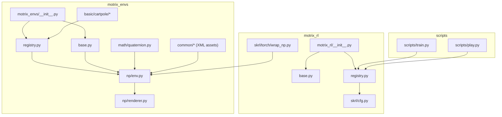
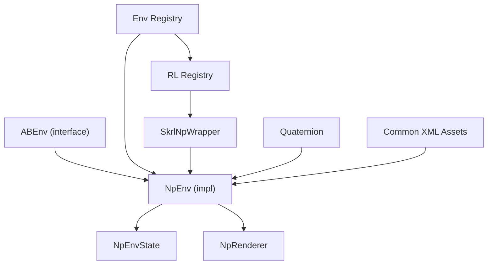
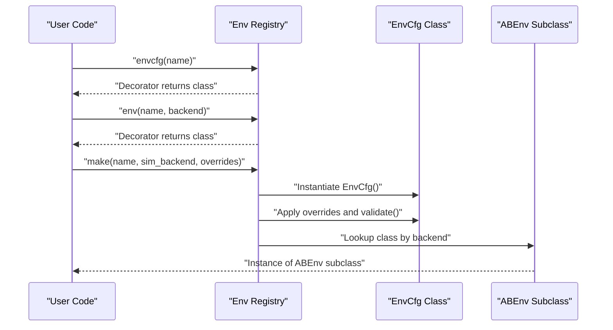
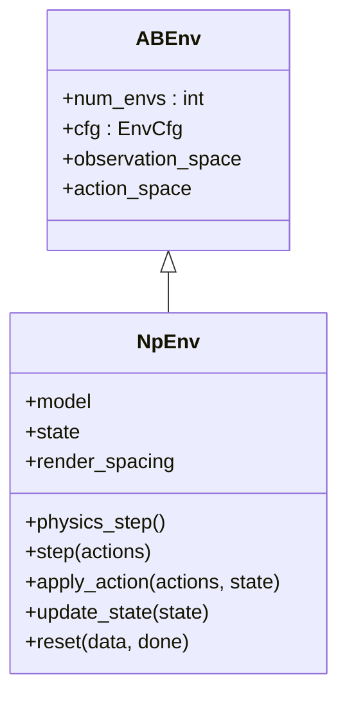
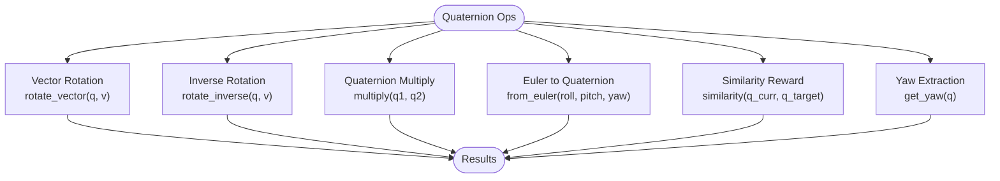
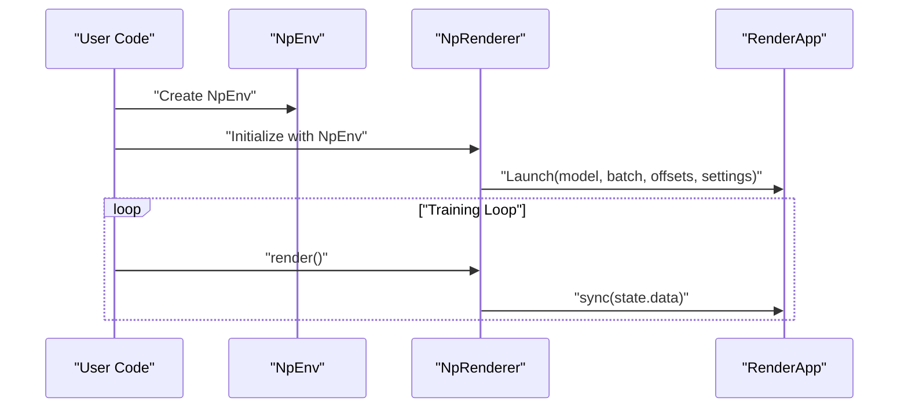
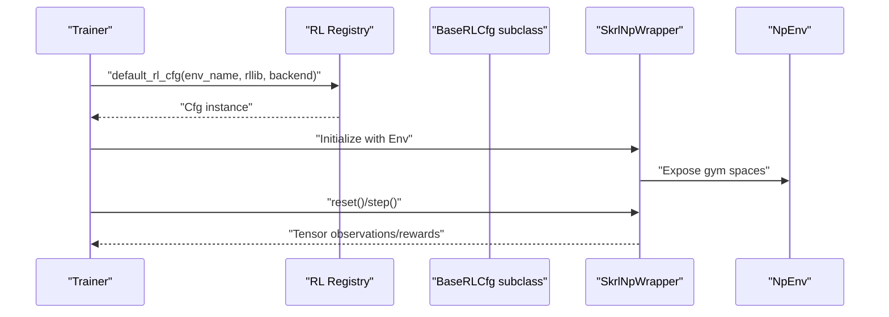
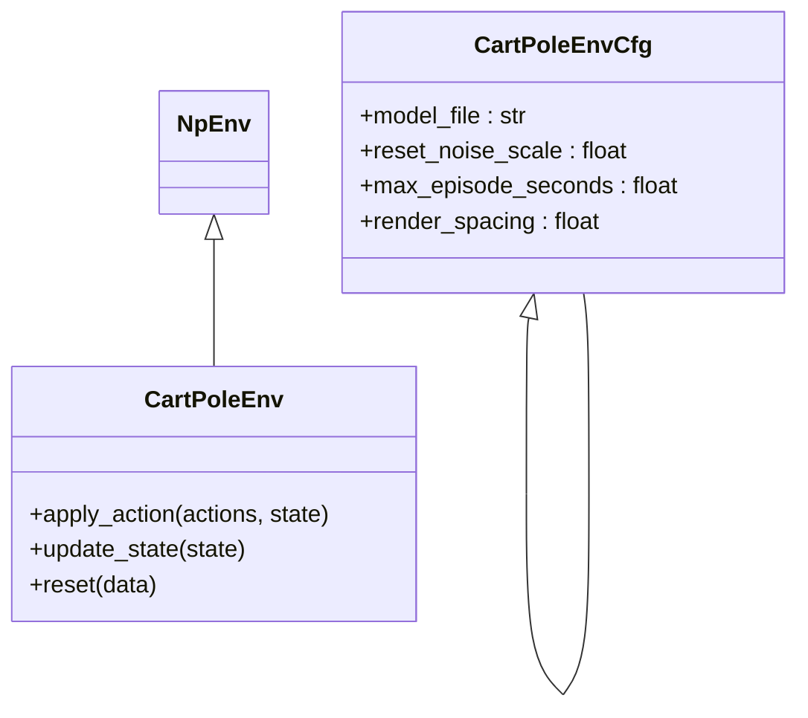
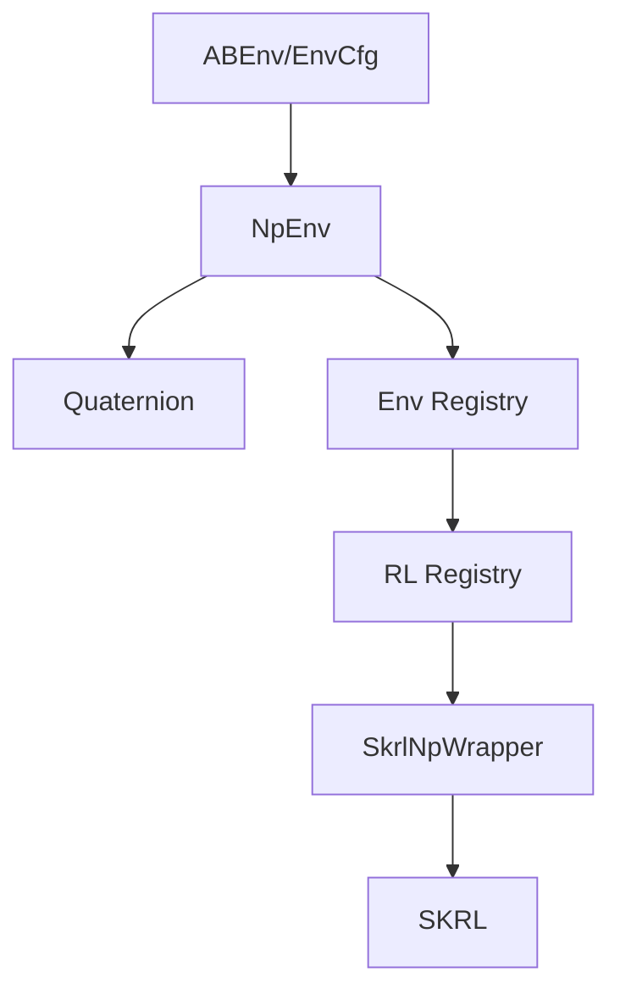

# Extension Patterns and Best Practices

<cite>
**Referenced Files in This Document**
- [__init__.py](file://motrix_envs/src/motrix_envs/__init__.py)
- [base.py](file://motrix_envs/src/motrix_envs/base.py)
- [registry.py](file://motrix_envs/src/motrix_envs/registry.py)
- [env.py](file://motrix_envs/src/motrix_envs/np/env.py)
- [renderer.py](file://motrix_envs/src/motrix_envs/np/renderer.py)
- [quaternion.py](file://motrix_envs/src/motrix_envs/math/quaternion.py)
- [materials.xml](file://motrix_envs/src/motrix_envs/common/materials.xml)
- [skybox.xml](file://motrix_envs/src/motrix_envs/common/skybox.xml)
- [visual.xml](file://motrix_envs/src/motrix_envs/common/visual.xml)
- [cartpole_np.py](file://motrix_envs/src/motrix_envs/basic/cartpole/cartpole_np.py)
- [cfg.py](file://motrix_envs/src/motrix_envs/basic/cartpole/cfg.py)
- [__init__.py](file://motrix_rl/src/motrix_rl/__init__.py)
- [base.py](file://motrix_rl/src/motrix_rl/base.py)
- [registry.py](file://motrix_rl/src/motrix_rl/registry.py)
- [cfg.py](file://motrix_rl/src/motrix_rl/skrl/cfg.py)
- [wrap_np.py](file://motrix_rl/src/motrix_rl/skrl/torch/wrap_np.py)
- [train.py](file://scripts/train.py)
- [play.py](file://scripts/play.py)
</cite>

## Table of Contents
1. [Introduction](#introduction)
2. [Project Structure](#project-structure)
3. [Core Components](#core-components)
4. [Architecture Overview](#architecture-overview)
5. [Detailed Component Analysis](#detailed-component-analysis)
6. [Dependency Analysis](#dependency-analysis)
7. [Performance Considerations](#performance-considerations)
8. [Troubleshooting Guide](#troubleshooting-guide)
9. [Conclusion](#conclusion)
10. [Appendices](#appendices)

## Introduction
This document provides comprehensive guidance for extending MotrixLab-S1 with advanced patterns and best practices. It covers architectural patterns for extensibility such as plugin-style registration, factory-like creation via registries, and strategy-like environment implementations. It also documents mathematical utilities for quaternions and transformations, rendering system extensions and material definitions, and practical advice for performance, memory, and parallel execution. Testing strategies, debugging techniques, and profiling methodologies are included, along with code organization principles, dependency management, and integration guidelines for external libraries. Contribution guidelines, code review processes, and documentation standards are outlined, with examples of advanced features such as custom sensors, actuators, and environmental effects.

## Project Structure
MotrixLab-S1 is organized into two primary packages:
- motrix_envs: Environment framework, base abstractions, registries, NumPy-based environments, math utilities, and rendering.
- motrix_rl: Reinforcement learning configuration and wrappers, with SKRL integration for JAX and PyTorch backends.
- scripts: CLI entry points for training and playing policies.

**Diagram sources**
- [__init__.py](file://motrix_envs/src/motrix_envs/__init__.py#L16-L17)
- [base.py](file://motrix_envs/src/motrix_envs/base.py#L61-L85)
- [registry.py](file://motrix_envs/src/motrix_envs/registry.py#L114-L161)
- [env.py](file://motrix_envs/src/motrix_envs/np/env.py#L52-L209)
- [renderer.py](file://motrix_envs/src/motrix_envs/np/renderer.py#L22-L65)
- [quaternion.py](file://motrix_envs/src/motrix_envs/math/quaternion.py#L18-L151)
- [cartpole_np.py](file://motrix_envs/src/motrix_envs/basic/cartpole/cartpole_np.py#L26-L98)
- [__init__.py](file://motrix_rl/src/motrix_rl/__init__.py#L16-L17)
- [base.py](file://motrix_rl/src/motrix_rl/base.py#L20-L43)
- [registry.py](file://motrix_rl/src/motrix_rl/registry.py#L42-L115)
- [cfg.py](file://motrix_rl/src/motrix_rl/skrl/cfg.py#L28-L74)
- [wrap_np.py](file://motrix_rl/src/motrix_rl/skrl/torch/wrap_np.py#L26-L80)
- [train.py](file://scripts/train.py#L52-L95)
- [play.py](file://scripts/play.py#L110-L162)

**Section sources**
- [__init__.py](file://motrix_envs/src/motrix_envs/__init__.py#L16-L17)
- [__init__.py](file://motrix_rl/src/motrix_rl/__init__.py#L16-L17)

## Core Components
- Environment abstraction and configuration:
  - ABEnv defines the environment interface with properties for num_envs, cfg, observation_space, and action_space.
  - EnvCfg encapsulates simulation timing, model file, and derived properties for episode steps and simulation substeps.
- NumPy-based environment:
  - NpEnv extends ABEnv, manages SceneModel loading, timestep, and batched state updates, and orchestrates physics steps.
  - NpEnvState holds batched observations, rewards, termination/truncation flags, info, and SceneData.
- Registry system:
  - Environment registration via decorators for configuration classes and environment classes with a backend identifier.
  - Factory-like make function constructs environments with optional overrides and backend selection.
- Rendering:
  - NpRenderer integrates with the underlying render system, launching RenderApp with batched offsets and toggling sync behavior.
- Math utilities:
  - Quaternion class provides multiplication, Euler conversion, vector rotation, inverse rotation, similarity measure, and yaw extraction.
- RL configuration and wrappers:
  - BaseRLCfg defines training parameters and derived batch sizes.
  - RL registry maps environment names to RL framework/backend configurations.
  - SkrlNpWrapper adapts NpEnv to SKRL’s PyTorch interface.

**Section sources**
- [base.py](file://motrix_envs/src/motrix_envs/base.py#L23-L85)
- [env.py](file://motrix_envs/src/motrix_envs/np/env.py#L26-L209)
- [registry.py](file://motrix_envs/src/motrix_envs/registry.py#L24-L172)
- [renderer.py](file://motrix_envs/src/motrix_envs/np/renderer.py#L22-L65)
- [quaternion.py](file://motrix_envs/src/motrix_envs/math/quaternion.py#L18-L151)
- [base.py](file://motrix_rl/src/motrix_rl/base.py#L20-L43)
- [registry.py](file://motrix_rl/src/motrix_rl/registry.py#L28-L115)
- [wrap_np.py](file://motrix_rl/src/motrix_rl/skrl/torch/wrap_np.py#L26-L80)

## Architecture Overview
The framework follows a layered architecture:
- Environment layer: ABEnv and NpEnv define the simulation interface and execution loop.
- Registry layer: Centralized registration and factory for environments and RL configurations.
- Math layer: Vectorized math utilities for orientation and transformations.
- Rendering layer: Batched rendering with configurable offsets and performance settings.
- RL layer: Configuration classes and SKRL wrappers for PyTorch/JAX backends.

**Diagram sources**
- [base.py](file://motrix_envs/src/motrix_envs/base.py#L61-L85)
- [env.py](file://motrix_envs/src/motrix_envs/np/env.py#L52-L209)
- [registry.py](file://motrix_envs/src/motrix_envs/registry.py#L114-L161)
- [renderer.py](file://motrix_envs/src/motrix_envs/np/renderer.py#L22-L65)
- [quaternion.py](file://motrix_envs/src/motrix_envs/math/quaternion.py#L18-L151)
- [registry.py](file://motrix_rl/src/motrix_rl/registry.py#L42-L115)
- [wrap_np.py](file://motrix_rl/src/motrix_rl/skrl/torch/wrap_np.py#L26-L80)
- [materials.xml](file://motrix_envs/src/motrix_envs/common/materials.xml#L6-L24)

## Detailed Component Analysis

### Plugin System and Factory Patterns
The registry enables a plugin-style extension mechanism:
- Environment configuration registration via a decorator that binds a configuration class to a name.
- Environment class registration via a decorator that binds an environment class to a name and backend.
- Factory function make resolves the configuration, applies overrides, validates, selects backend, and instantiates the environment.

**Diagram sources**
- [registry.py](file://motrix_envs/src/motrix_envs/registry.py#L53-L99)
- [registry.py](file://motrix_envs/src/motrix_envs/registry.py#L114-L161)

**Section sources**
- [registry.py](file://motrix_envs/src/motrix_envs/registry.py#L46-L100)
- [registry.py](file://motrix_envs/src/motrix_envs/registry.py#L114-L161)

### Strategy Implementation in Environments
Environments implement a strategy-like pattern by overriding abstract methods:
- apply_action: Applies actions to the environment state.
- update_state: Computes observations, rewards, termination/truncation.
- reset: Initializes state for newly reset environments.

**Diagram sources**
- [base.py](file://motrix_envs/src/motrix_envs/base.py#L61-L85)
- [env.py](file://motrix_envs/src/motrix_envs/np/env.py#L52-L209)

**Section sources**
- [env.py](file://motrix_envs/src/motrix_envs/np/env.py#L149-L184)

### Mathematical Utilities: Quaternions and Transformations
Quaternion operations support vectorized batch computations:
- Multiplication and Euler conversion for orientation representation.
- Vector rotation and inverse rotation leveraging vectorized cross products.
- Similarity measure computes alignment rewards between orientations.
- Yaw extraction for 2D heading computation.

**Diagram sources**
- [quaternion.py](file://motrix_envs/src/motrix_envs/math/quaternion.py#L18-L151)

**Section sources**
- [quaternion.py](file://motrix_envs/src/motrix_envs/math/quaternion.py#L18-L151)

### Rendering System Extensions and Material Definitions
Rendering is integrated via NpRenderer:
- Grid layout of multiple environments with configurable spacing.
- Launches RenderApp with performance settings and toggles synchronization via keyboard input.
- Materials, skybox, and visual quality are defined in XML assets and applied to scenes.

**Diagram sources**
- [renderer.py](file://motrix_envs/src/motrix_envs/np/renderer.py#L22-L65)
- [env.py](file://motrix_envs/src/motrix_envs/np/env.py#L52-L96)
- [materials.xml](file://motrix_envs/src/motrix_envs/common/materials.xml#L6-L24)
- [skybox.xml](file://motrix_envs/src/motrix_envs/common/skybox.xml#L1-L7)
- [visual.xml](file://motrix_envs/src/motrix_envs/common/visual.xml#L1-L8)

**Section sources**
- [renderer.py](file://motrix_envs/src/motrix_envs/np/renderer.py#L22-L65)
- [materials.xml](file://motrix_envs/src/motrix_envs/common/materials.xml#L6-L24)
- [skybox.xml](file://motrix_envs/src/motrix_envs/common/skybox.xml#L1-L7)
- [visual.xml](file://motrix_envs/src/motrix_envs/common/visual.xml#L1-L8)

### RL Configuration and Wrappers
RL configuration and wrapper integration:
- BaseRLCfg defines training hyperparameters and derived batch sizes.
- RL registry maps environment names to framework/backend-specific configs.
- SkrlNpWrapper bridges NpEnv to SKRL’s PyTorch interface, enabling seamless training.

**Diagram sources**
- [base.py](file://motrix_rl/src/motrix_rl/base.py#L20-L43)
- [registry.py](file://motrix_rl/src/motrix_rl/registry.py#L81-L115)
- [cfg.py](file://motrix_rl/src/motrix_rl/skrl/cfg.py#L28-L74)
- [wrap_np.py](file://motrix_rl/src/motrix_rl/skrl/torch/wrap_np.py#L26-L80)

**Section sources**
- [base.py](file://motrix_rl/src/motrix_rl/base.py#L20-L43)
- [registry.py](file://motrix_rl/src/motrix_rl/registry.py#L42-L115)
- [cfg.py](file://motrix_rl/src/motrix_rl/skrl/cfg.py#L28-L74)
- [wrap_np.py](file://motrix_rl/src/motrix_rl/skrl/torch/wrap_np.py#L26-L80)

### Example Environment: CartPole
CartPole demonstrates the strategy pattern and registry usage:
- Configuration class decorated for registration with a model file and episode parameters.
- Environment class decorated for registration with backend "np".
- Overrides environment configuration during creation and uses reset noise scaling.

**Diagram sources**
- [cfg.py](file://motrix_envs/src/motrix_envs/basic/cartpole/cfg.py#L25-L32)
- [cartpole_np.py](file://motrix_envs/src/motrix_envs/basic/cartpole/cartpole_np.py#L26-L98)
- [env.py](file://motrix_envs/src/motrix_envs/np/env.py#L52-L209)

**Section sources**
- [cfg.py](file://motrix_envs/src/motrix_envs/basic/cartpole/cfg.py#L25-L32)
- [cartpole_np.py](file://motrix_envs/src/motrix_envs/basic/cartpole/cartpole_np.py#L26-L98)

## Dependency Analysis
The system exhibits low coupling and high cohesion:
- Environment dependencies: ABEnv and EnvCfg form the core abstraction; NpEnv depends on SceneModel and math utilities.
- Registry decouples environment instantiation from application code.
- RL layer depends on environment registry and wraps environments for SKRL compatibility.

**Diagram sources**
- [base.py](file://motrix_envs/src/motrix_envs/base.py#L61-L85)
- [env.py](file://motrix_envs/src/motrix_envs/np/env.py#L52-L209)
- [quaternion.py](file://motrix_envs/src/motrix_envs/math/quaternion.py#L18-L151)
- [registry.py](file://motrix_envs/src/motrix_envs/registry.py#L114-L161)
- [registry.py](file://motrix_rl/src/motrix_rl/registry.py#L42-L115)
- [wrap_np.py](file://motrix_rl/src/motrix_rl/skrl/torch/wrap_np.py#L26-L80)

**Section sources**
- [registry.py](file://motrix_envs/src/motrix_envs/registry.py#L114-L161)
- [registry.py](file://motrix_rl/src/motrix_rl/registry.py#L42-L115)

## Performance Considerations
- Vectorization:
  - Use vectorized math operations (e.g., vectorized quaternion rotations) to process batches efficiently.
- Simulation stepping:
  - Control sim_substeps via EnvCfg to balance accuracy and speed.
- Rendering:
  - Adjust render settings and spacing; toggle synchronization to reduce overhead.
- Memory:
  - Reuse arrays and avoid unnecessary copies; validate state shapes to catch misalignments early.
- Parallel execution:
  - Increase num_envs to leverage batched computation; ensure backend supports vectorized operations.

[No sources needed since this section provides general guidance]

## Troubleshooting Guide
- Environment creation errors:
  - Verify environment registration and backend support; ensure configuration overrides match attributes.
- Physics instability:
  - Check sim_dt vs ctrl_dt relationship and adjust sim_substeps accordingly.
- Rendering issues:
  - Confirm RenderApp launch parameters and keyboard toggles for synchronization.
- RL training mismatches:
  - Validate RL configuration availability for the chosen framework/backend and environment.

**Section sources**
- [registry.py](file://motrix_envs/src/motrix_envs/registry.py#L114-L161)
- [env.py](file://motrix_envs/src/motrix_envs/np/env.py#L186-L209)
- [renderer.py](file://motrix_envs/src/motrix_envs/np/renderer.py#L44-L65)
- [registry.py](file://motrix_rl/src/motrix_rl/registry.py#L81-L115)

## Conclusion
MotrixLab-S1 provides a robust foundation for extensible robotics and simulation environments. The registry-driven factory, strategy-based environment implementations, vectorized math utilities, and SKRL integration enable scalable development. Following the best practices outlined here ensures maintainable, performant, and well-integrated extensions.

[No sources needed since this section summarizes without analyzing specific files]

## Appendices

### Testing Strategies for Custom Components
- Unit tests for math utilities:
  - Validate quaternion multiplication identities and vector rotation correctness across batches.
- Integration tests for environments:
  - Verify apply_action and update_state produce consistent observations and termination flags.
- Regression tests for rendering:
  - Confirm render offsets and synchronization toggles behave as expected.
- RL wrapper tests:
  - Ensure tensor conversions and gym space compatibility are preserved.

[No sources needed since this section provides general guidance]

### Debugging Techniques for Complex Integrations
- Logging:
  - Add structured logs around environment resets, physics steps, and rendering sync.
- State inspection:
  - Print or visualize NpEnvState shapes and values to detect mismatches.
- Profiling:
  - Measure per-iteration time for physics steps and rendering to identify bottlenecks.

[No sources needed since this section provides general guidance]

### Profiling Methodologies
- Timing loops:
  - Profile environment step durations and rendering cycles separately.
- Memory profiling:
  - Monitor batched arrays and SceneData lifecycle to prevent leaks.
- GPU/CPU utilization:
  - Compare JAX and PyTorch backends for throughput and memory usage.

[No sources needed since this section provides general guidance]

### Code Organization Principles
- Feature-based grouping:
  - Keep environment families (basic, locomotion, navigation, manipulation) in separate subpackages.
- Clear separation of concerns:
  - Base abstractions, registries, and implementations in distinct modules.
- XML asset modularity:
  - Define materials, skybox, and visual settings in shared XML files.

[No sources needed since this section provides general guidance]

### Dependency Management and External Libraries
- Environment dependencies:
  - Ensure SceneModel and math utilities are aligned with batched operations.
- RL dependencies:
  - SKRL wrappers depend on gymnasium and torch; JAX variants require appropriate backend configuration.
- CLI orchestration:
  - Scripts select backends based on device capabilities and environment selection.

**Section sources**
- [train.py](file://scripts/train.py#L39-L95)
- [play.py](file://scripts/play.py#L110-L162)

### Integration with External Libraries
- SKRL integration:
  - Use SkrlNpWrapper to adapt NpEnv for SKRL’s PyTorch/JAX APIs.
- Device detection:
  - Scripts determine available backends and configure SKRL accordingly.

**Section sources**
- [wrap_np.py](file://motrix_rl/src/motrix_rl/skrl/torch/wrap_np.py#L26-L80)
- [train.py](file://scripts/train.py#L39-L95)
- [play.py](file://scripts/play.py#L143-L158)

### Contribution Guidelines and Standards
- Code style:
  - Follow existing formatting and linting rules enforced by repository tooling.
- Documentation:
  - Update docstrings and user guides for new environments and features.
- Review process:
  - Submit PRs with clear descriptions, test coverage, and performance notes.

[No sources needed since this section provides general guidance]

### Examples of Advanced Features
- Custom sensors:
  - Extend NpEnv to expose additional sensor readings via SceneData and observations.
- Actuators:
  - Modify apply_action to incorporate custom actuator dynamics or constraints.
- Environmental effects:
  - Introduce perturbations or dynamic obstacles through SceneData updates in reset/update_state.

[No sources needed since this section provides general guidance]