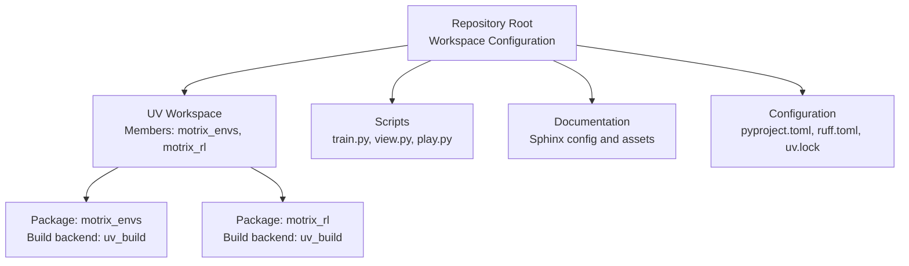
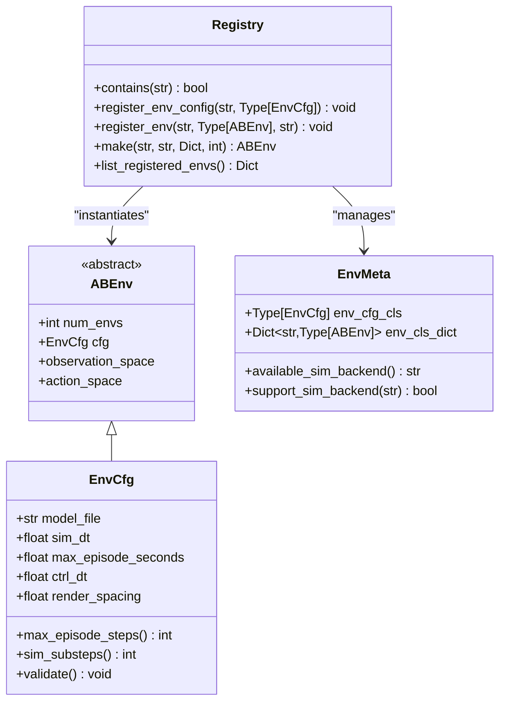
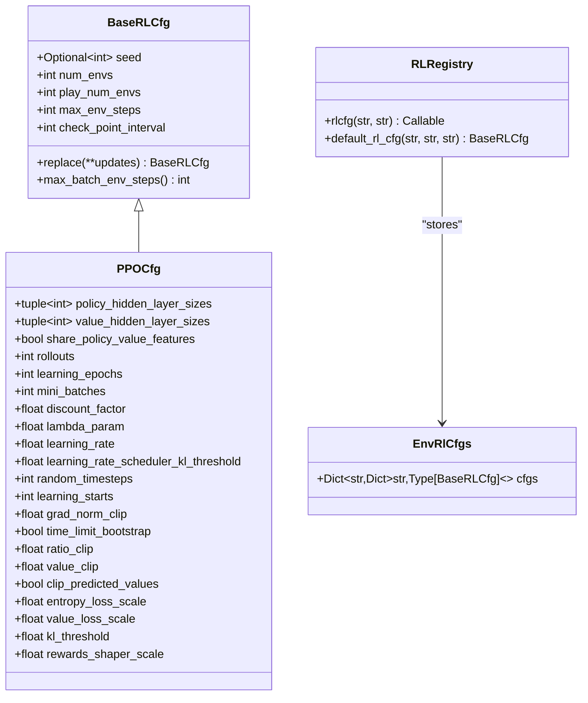
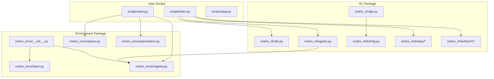
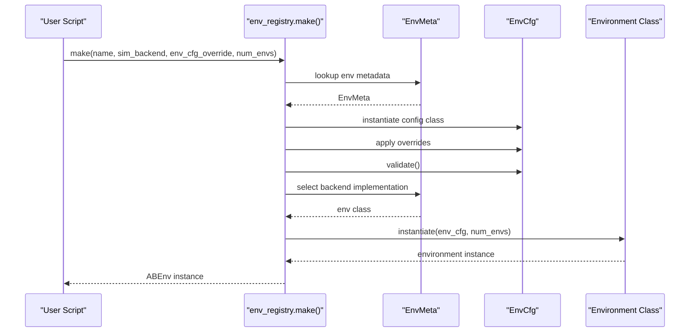
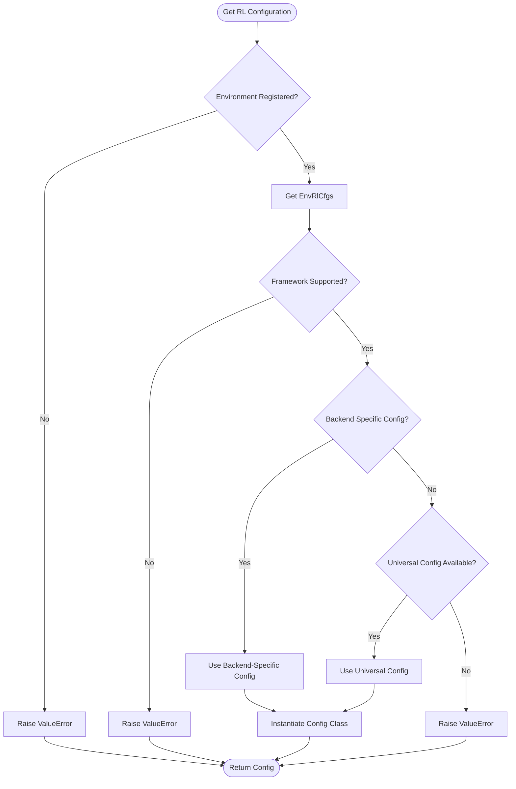
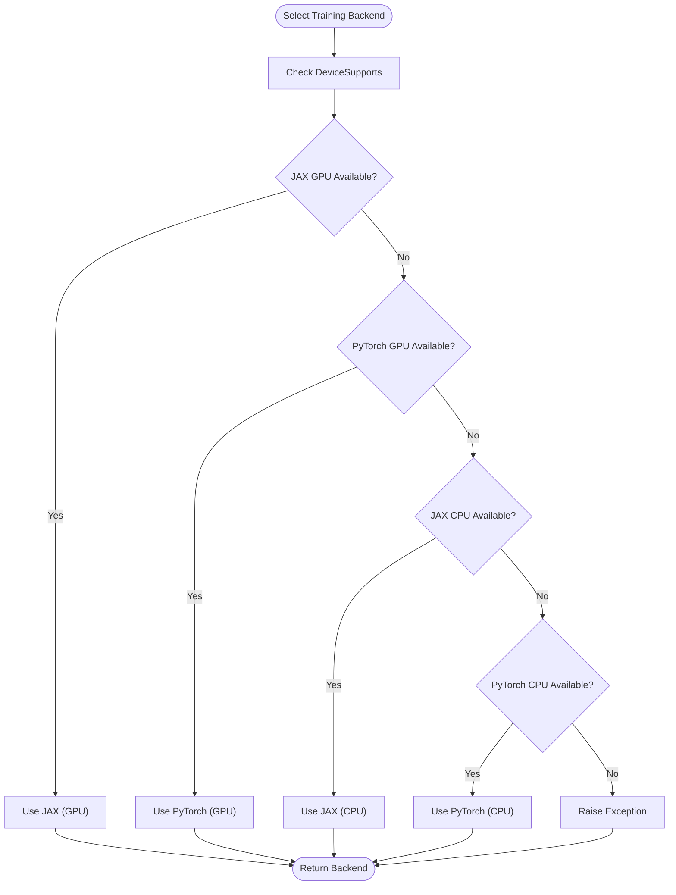
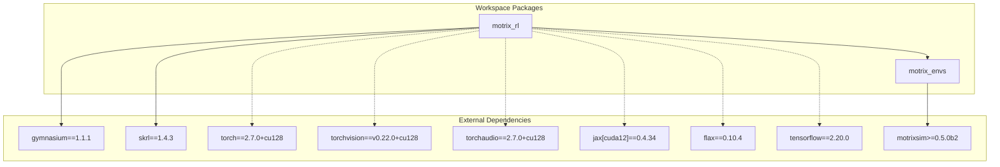

# Python Package Infrastructure

<cite>
**Referenced Files in This Document**
- [pyproject.toml](file://pyproject.toml)
- [README.md](file://README.md)
- [motrix_envs/pyproject.toml](file://motrix_envs/pyproject.toml)
- [motrix_rl/pyproject.toml](file://motrix_rl/pyproject.toml)
- [motrix_envs/src/motrix_envs/__init__.py](file://motrix_envs/src/motrix_envs/__init__.py)
- [motrix_rl/src/motrix_rl/__init__.py](file://motrix_rl/src/motrix_rl/__init__.py)
- [motrix_envs/src/motrix_envs/base.py](file://motrix_envs/src/motrix_envs/base.py)
- [motrix_rl/src/motrix_rl/base.py](file://motrix_rl/src/motrix_rl/base.py)
- [motrix_envs/src/motrix_envs/registry.py](file://motrix_envs/src/motrix_envs/registry.py)
- [motrix_rl/src/motrix_rl/registry.py](file://motrix_rl/src/motrix_rl/registry.py)
- [motrix_rl/src/motrix_rl/cfgs.py](file://motrix_rl/src/motrix_rl/cfgs.py)
- [motrix_rl/src/motrix_rl/utils.py](file://motrix_rl/src/motrix_rl/utils.py)
- [motrix_rl/src/motrix_rl/skrl/cfg.py](file://motrix_rl/src/motrix_rl/skrl/cfg.py)
- [scripts/train.py](file://scripts/train.py)
- [scripts/view.py](file://scripts/view.py)
</cite>

## Table of Contents
1. [Introduction](#introduction)
2. [Project Structure](#project-structure)
3. [Core Components](#core-components)
4. [Architecture Overview](#architecture-overview)
5. [Detailed Component Analysis](#detailed-component-analysis)
6. [Dependency Analysis](#dependency-analysis)
7. [Performance Considerations](#performance-considerations)
8. [Troubleshooting Guide](#troubleshooting-guide)
9. [Conclusion](#conclusion)

## Introduction
This document describes the Python package infrastructure of the MotrixLab project, a reinforcement learning framework built on top of the MotrixSim simulation engine. The project is structured as a multi-package workspace managed by UV, with two primary packages:
- motrix_envs: Simulation environments based on MotrixSim
- motrix_rl: Reinforcement learning training framework integrating SKRL with unified multi-backend interfaces

The infrastructure emphasizes modularity, extensibility, and reproducible installation via a workspace configuration and optional extras for different training backends.

## Project Structure
The repository follows a workspace layout with separate build configurations for each package and shared documentation and scripts at the root level.

**Diagram sources**
- [pyproject.toml](file://pyproject.toml#L21-L29)
- [motrix_envs/pyproject.toml](file://motrix_envs/pyproject.toml#L1-L16)
- [motrix_rl/pyproject.toml](file://motrix_rl/pyproject.toml#L1-L32)

Key characteristics:
- Workspace-managed packages with independent build systems
- Shared Python version constraint (3.10.*) enforced across packages
- Optional extras for documentation and training backends
- Separate README and configuration files for each package

**Section sources**
- [pyproject.toml](file://pyproject.toml#L1-L29)
- [README.md](file://README.md#L1-L124)

## Core Components
The core infrastructure consists of three layers:
1. Environment abstraction and registry
2. RL configuration and registration system
3. Training and visualization utilities

### Environment Layer
The environment layer defines a unified interface for simulation environments and provides a registry for environment configurations and implementations.

**Diagram sources**
- [motrix_envs/src/motrix_envs/base.py](file://motrix_envs/src/motrix_envs/base.py#L61-L85)
- [motrix_envs/src/motrix_envs/registry.py](file://motrix_envs/src/motrix_envs/registry.py#L24-L172)

### RL Configuration Layer
The RL configuration layer provides a framework-agnostic configuration system with environment-specific overrides and backend specialization.

**Diagram sources**
- [motrix_rl/src/motrix_rl/base.py](file://motrix_rl/src/motrix_rl/base.py#L20-L43)
- [motrix_rl/src/motrix_rl/skrl/cfg.py](file://motrix_rl/src/motrix_rl/skrl/cfg.py#L28-L74)
- [motrix_rl/src/motrix_rl/registry.py](file://motrix_rl/src/motrix_rl/registry.py#L28-L115)

**Section sources**
- [motrix_envs/src/motrix_envs/base.py](file://motrix_envs/src/motrix_envs/base.py#L1-L85)
- [motrix_rl/src/motrix_rl/base.py](file://motrix_rl/src/motrix_rl/base.py#L1-L43)
- [motrix_rl/src/motrix_rl/skrl/cfg.py](file://motrix_rl/src/motrix_rl/skrl/cfg.py#L1-L74)

## Architecture Overview
The system architecture separates concerns across packages while maintaining a unified interface for environment creation and RL configuration.

**Diagram sources**
- [scripts/train.py](file://scripts/train.py#L1-L95)
- [scripts/view.py](file://scripts/view.py#L1-L83)
- [motrix_rl/src/motrix_rl/utils.py](file://motrix_rl/src/motrix_rl/utils.py#L1-L62)
- [motrix_rl/src/motrix_rl/registry.py](file://motrix_rl/src/motrix_rl/registry.py#L1-L115)
- [motrix_rl/src/motrix_rl/cfgs.py](file://motrix_rl/src/motrix_rl/cfgs.py#L1-L498)
- [motrix_rl/src/motrix_rl/skrl/cfg.py](file://motrix_rl/src/motrix_rl/skrl/cfg.py#L1-L74)
- [motrix_envs/src/motrix_envs/__init__.py](file://motrix_envs/src/motrix_envs/__init__.py#L1-L17)
- [motrix_envs/src/motrix_envs/base.py](file://motrix_envs/src/motrix_envs/base.py#L1-L85)
- [motrix_envs/src/motrix_envs/registry.py](file://motrix_envs/src/motrix_envs/registry.py#L1-L172)

## Detailed Component Analysis

### Environment Registry and Factory
The environment registry provides a centralized mechanism for registering and instantiating environments with configurable parameters and backend selection.

**Diagram sources**
- [motrix_envs/src/motrix_envs/registry.py](file://motrix_envs/src/motrix_envs/registry.py#L114-L161)

Key features:
- Centralized environment registration with type safety
- Configurable environment parameters via dataclass overrides
- Automatic backend selection with explicit fallback
- Validation of simulation timing parameters

**Section sources**
- [motrix_envs/src/motrix_envs/registry.py](file://motrix_envs/src/motrix_envs/registry.py#L1-L172)

### RL Configuration Management
The RL configuration system enables environment-specific tuning with framework-agnostic defaults and backend specialization.

**Diagram sources**
- [motrix_rl/src/motrix_rl/registry.py](file://motrix_rl/src/motrix_rl/registry.py#L81-L115)

Implementation highlights:
- Decorator-based registration for clean configuration definition
- Hierarchical fallback from backend-specific to universal configurations
- Integration with environment registry for validation
- Extensible framework support (currently SKRL)

**Section sources**
- [motrix_rl/src/motrix_rl/registry.py](file://motrix_rl/src/motrix_rl/registry.py#L1-L115)
- [motrix_rl/src/motrix_rl/cfgs.py](file://motrix_rl/src/motrix_rl/cfgs.py#L1-L498)

### Training Backend Selection
The training infrastructure automatically selects appropriate backends based on device capabilities and user preferences.

**Diagram sources**
- [scripts/train.py](file://scripts/train.py#L39-L50)
- [motrix_rl/src/motrix_rl/utils.py](file://motrix_rl/src/motrix_rl/utils.py#L39-L62)

**Section sources**
- [scripts/train.py](file://scripts/train.py#L1-L95)
- [motrix_rl/src/motrix_rl/utils.py](file://motrix_rl/src/motrix_rl/utils.py#L1-L62)

## Dependency Analysis
The package dependencies form a clear hierarchy with explicit optional extras for different training backends.

**Diagram sources**
- [motrix_rl/pyproject.toml](file://motrix_rl/pyproject.toml#L13-L27)
- [motrix_envs/pyproject.toml](file://motrix_envs/pyproject.toml#L13-L15)

Dependency characteristics:
- Workspace-relative source resolution for local development
- Optional extras for platform-specific GPU support
- Strict version pinning for reproducible builds
- Clear separation between core dependencies and optional backends

**Section sources**
- [pyproject.toml](file://pyproject.toml#L21-L29)
- [motrix_rl/pyproject.toml](file://motrix_rl/pyproject.toml#L1-L32)
- [motrix_envs/pyproject.toml](file://motrix_envs/pyproject.toml#L1-L16)

## Performance Considerations
The infrastructure includes several mechanisms for performance optimization and resource management:

1. **Vectorized Environments**: The environment abstraction supports multiple simultaneous environments for efficient training
2. **Backend Selection**: Automatic detection of GPU availability optimizes computational resources
3. **Configuration Overrides**: Environment-specific tuning allows performance optimization per task
4. **Checkpoint Management**: Configurable checkpoint intervals balance progress preservation and storage overhead

Best practices:
- Use appropriate num_envs settings based on available memory
- Leverage backend-specific optimizations (e.g., shared features in PyTorch)
- Monitor training progress through configurable intervals
- Utilize environment-specific configurations for optimal hyperparameters

## Troubleshooting Guide

### Common Installation Issues
- **Missing Dependencies**: Ensure all optional extras are installed based on target backend
- **Version Conflicts**: The workspace enforces Python 3.10.*; verify environment compatibility
- **Platform-Specific Packages**: Some extras require Linux with CUDA support

### Runtime Issues
- **Backend Detection**: If automatic backend selection fails, specify backend manually via command-line flags
- **Environment Registration**: Verify environment names match registered configurations
- **Configuration Validation**: Check that environment timing parameters satisfy simulation constraints

### Debugging Tools
The system provides structured logging and configuration validation to aid in troubleshooting:
- Device capability detection with detailed reporting
- Environment configuration validation with clear error messages
- Backend-specific error handling for missing dependencies

**Section sources**
- [scripts/train.py](file://scripts/train.py#L39-L50)
- [motrix_envs/src/motrix_envs/registry.py](file://motrix_envs/src/motrix_envs/registry.py#L53-L59)

## Conclusion
The MotrixLab Python package infrastructure demonstrates a well-architected multi-package workspace that balances modularity with usability. The design enables:

- Clean separation of concerns between environment simulation and RL training
- Flexible backend selection with automatic capability detection
- Extensible configuration system supporting multiple environments and frameworks
- Reproducible installation and development workflows through workspace management

The infrastructure provides a solid foundation for extending with new environments, algorithms, and training backends while maintaining backward compatibility and clear upgrade paths.