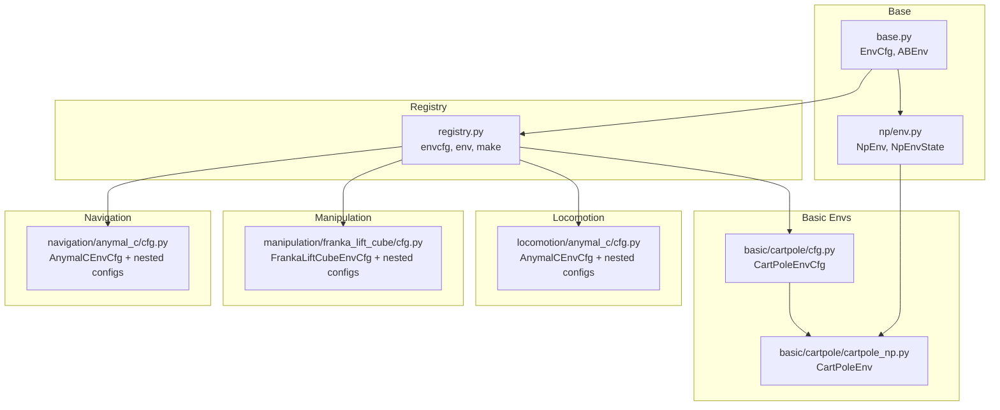
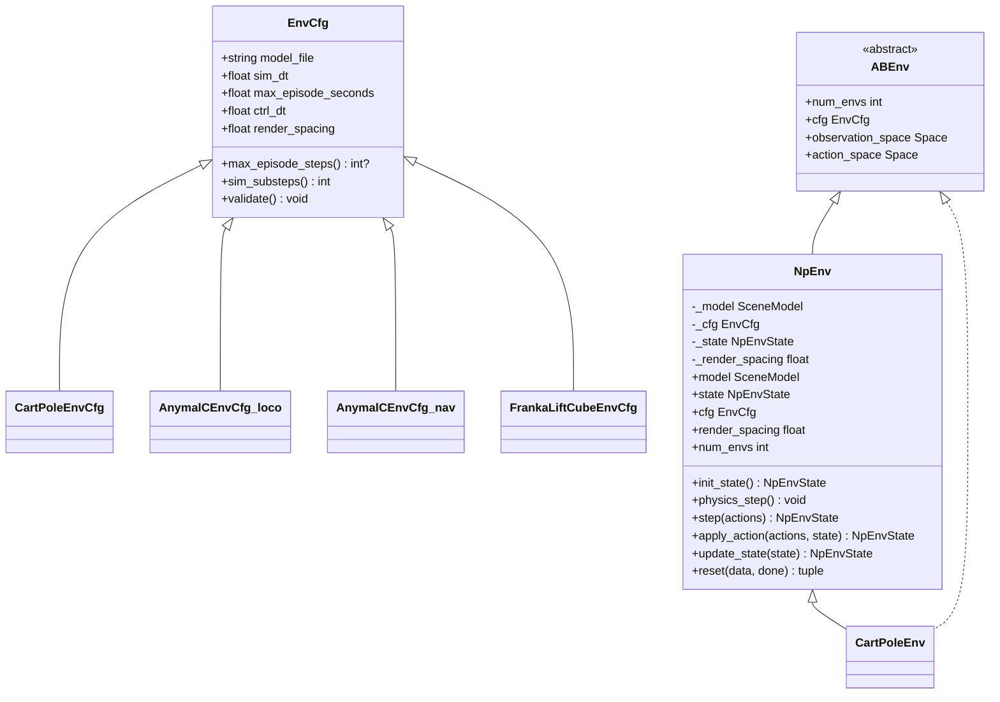
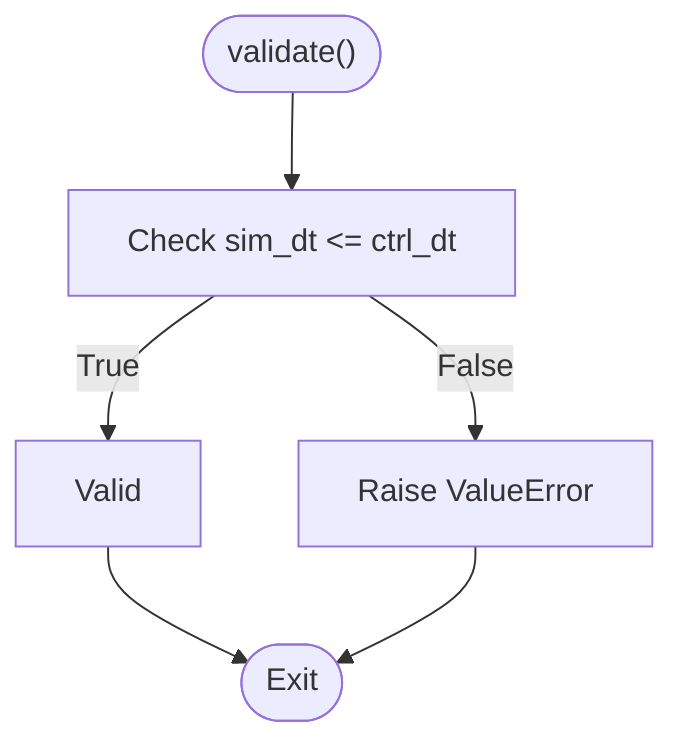
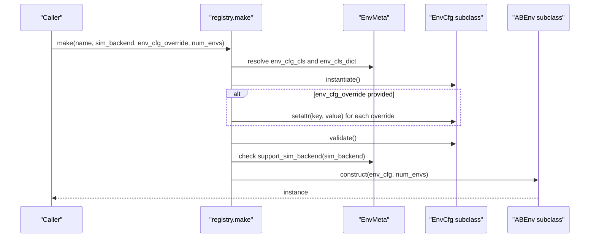
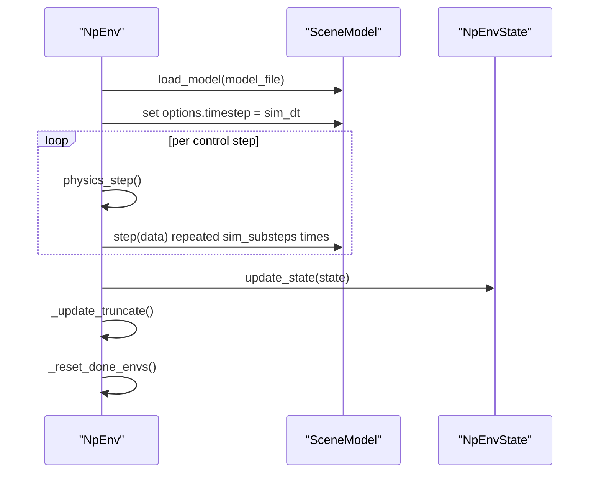
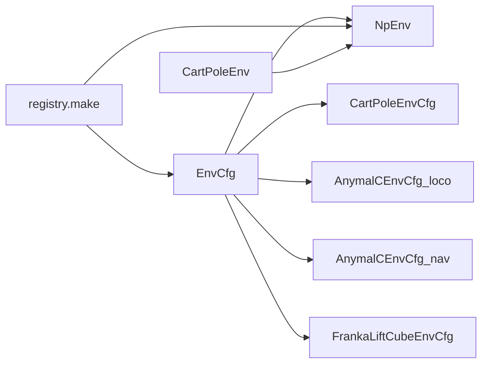
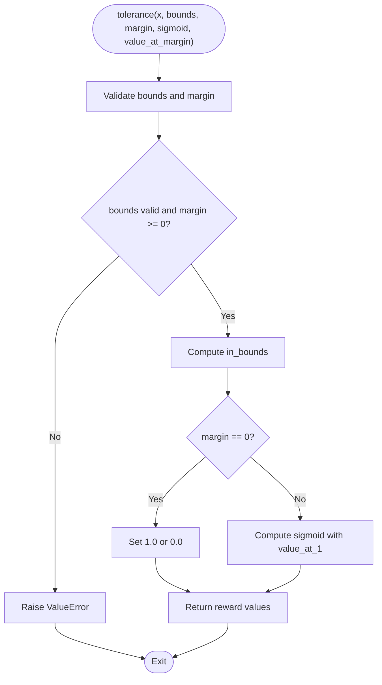

# Configuration Management

<cite>
**Referenced Files in This Document**
- [base.py](file://motrix_envs/src/motrix_envs/base.py)
- [registry.py](file://motrix_envs/src/motrix_envs/registry.py)
- [env.py](file://motrix_envs/src/motrix_envs/np/env.py)
- [cartpole_np.py](file://motrix_envs/src/motrix_envs/basic/cartpole/cartpole_np.py)
- [cartpole_cfg.py](file://motrix_envs/src/motrix_envs/basic/cartpole/cfg.py)
- [anymal_c_loco_cfg.py](file://motrix_envs/src/motrix_envs/locomotion/anymal_c/cfg.py)
- [franka_lift_cube_cfg.py](file://motrix_envs/src/motrix_envs/manipulation/franka_lift_cube/cfg.py)
- [anymal_c_nav_cfg.py](file://motrix_envs/src/motrix_envs/navigation/anymal_c/cfg.py)
- [reward_tolerance.py](file://motrix_envs/src/motrix_envs/np/reward.py)
</cite>

## Table of Contents
1. [Introduction](#introduction)
2. [Project Structure](#project-structure)
3. [Core Components](#core-components)
4. [Architecture Overview](#architecture-overview)
5. [Detailed Component Analysis](#detailed-component-analysis)
6. [Dependency Analysis](#dependency-analysis)
7. [Performance Considerations](#performance-considerations)
8. [Troubleshooting Guide](#troubleshooting-guide)
9. [Conclusion](#conclusion)
10. [Appendices](#appendices)

## Introduction
This document explains the MotrixLab-S1 environment configuration management system with a focus on the EnvCfg dataclass, parameter validation, inheritance patterns, and environment-specific configuration classes. It covers how defaults are set, how overrides work, and how validation ensures safe simulation parameters. It also documents the configuration serialization and persistence mechanisms, and provides practical examples for creating custom configurations and enforcing environment-specific constraints.

## Project Structure
The configuration system centers around a shared EnvCfg base class and a registry-driven factory that constructs environment instances from typed configuration classes. Environment families (basic, locomotion, manipulation, navigation) define specialized configuration classes that inherit from EnvCfg and add domain-specific parameters.

**Diagram sources**
- [base.py](file://motrix_envs/src/motrix_envs/base.py#L23-L85)
- [registry.py](file://motrix_envs/src/motrix_envs/registry.py#L24-L172)
- [env.py](file://motrix_envs/src/motrix_envs/np/env.py#L26-L209)
- [cartpole_cfg.py](file://motrix_envs/src/motrix_envs/basic/cartpole/cfg.py#L25-L32)
- [cartpole_np.py](file://motrix_envs/src/motrix_envs/basic/cartpole/cartpole_np.py#L26-L98)
- [anymal_c_loco_cfg.py](file://motrix_envs/src/motrix_envs/locomotion/anymal_c/cfg.py#L110-L129)
- [franka_lift_cube_cfg.py](file://motrix_envs/src/motrix_envs/manipulation/franka_lift_cube/cfg.py#L69-L84)
- [anymal_c_nav_cfg.py](file://motrix_envs/src/motrix_envs/navigation/anymal_c/cfg.py#L95-L116)

**Section sources**
- [base.py](file://motrix_envs/src/motrix_envs/base.py#L23-L85)
- [registry.py](file://motrix_envs/src/motrix_envs/registry.py#L24-L172)
- [env.py](file://motrix_envs/src/motrix_envs/np/env.py#L26-L209)

## Core Components
- EnvCfg: Base configuration dataclass with simulation timing, model file, and validation. Provides derived properties for episode steps and simulation substeps.
- ABEnv: Abstract base interface for environments, exposing cfg, spaces, and lifecycle methods.
- Registry: Central factory that registers configuration classes and environment implementations, resolves backends, and constructs instances with optional overrides.
- NpEnv: NumPy-based environment base that loads the model, applies timestep, and orchestrates physics steps and state transitions.

Key behaviors:
- Defaults are defined as dataclass fields in EnvCfg and overridden by subclass-specific configuration classes.
- Validation occurs via EnvCfg.validate before constructing an environment instance.
- Overrides are applied to the configuration instance prior to validation.

**Section sources**
- [base.py](file://motrix_envs/src/motrix_envs/base.py#L23-L85)
- [registry.py](file://motrix_envs/src/motrix_envs/registry.py#L114-L161)
- [env.py](file://motrix_envs/src/motrix_envs/np/env.py#L52-L209)

## Architecture Overview
The configuration management architecture follows a layered pattern:
- Base configuration (EnvCfg) defines common parameters and validation.
- Environment families define specialized configuration classes inheriting from EnvCfg.
- The registry decorates configuration and environment classes, enabling discovery and instantiation.
- NpEnv consumes the configuration to initialize the simulation model and runtime behavior.

**Diagram sources**
- [base.py](file://motrix_envs/src/motrix_envs/base.py#L23-L85)
- [env.py](file://motrix_envs/src/motrix_envs/np/env.py#L52-L209)
- [cartpole_cfg.py](file://motrix_envs/src/motrix_envs/basic/cartpole/cfg.py#L25-L32)
- [anymal_c_loco_cfg.py](file://motrix_envs/src/motrix_envs/locomotion/anymal_c/cfg.py#L110-L129)
- [anymal_c_nav_cfg.py](file://motrix_envs/src/motrix_envs/navigation/anymal_c/cfg.py#L95-L116)
- [franka_lift_cube_cfg.py](file://motrix_envs/src/motrix_envs/manipulation/franka_lift_cube/cfg.py#L69-L84)
- [cartpole_np.py](file://motrix_envs/src/motrix_envs/basic/cartpole/cartpole_np.py#L26-L98)

## Detailed Component Analysis

### EnvCfg: Base Configuration and Validation
EnvCfg encapsulates core simulation parameters:
- model_file: Path to the scene/model definition.
- sim_dt: Simulation timestep.
- ctrl_dt: Control timestep.
- max_episode_seconds: Episode duration; derived property computes max_episode_steps.
- render_spacing: Controls rendering cadence.
- sim_substeps: Derived from timestep ratio.

Validation ensures sim_dt ≤ ctrl_dt to maintain causality and stability.

**Diagram sources**
- [base.py](file://motrix_envs/src/motrix_envs/base.py#L53-L59)

**Section sources**
- [base.py](file://motrix_envs/src/motrix_envs/base.py#L23-L85)

### Registry: Registration and Instantiation
The registry provides decorators and a factory:
- @envcfg(name): Registers a configuration class under a given name.
- @env(name, "np"): Registers an environment class for a specific backend.
- make(name, sim_backend=None, env_cfg_override=None, num_envs=1): Constructs an environment instance by applying overrides, validating, selecting backend, and instantiating the environment.

Override mechanism:
- Creates an instance of the registered EnvCfg subclass.
- Iterates env_cfg_override and setattr if the attribute exists; otherwise raises an error.
- Calls validate() before proceeding.

Backend selection:
- Supports "np" backend registration.
- If sim_backend is None, uses the first available backend for the named environment.

**Diagram sources**
- [registry.py](file://motrix_envs/src/motrix_envs/registry.py#L114-L161)

**Section sources**
- [registry.py](file://motrix_envs/src/motrix_envs/registry.py#L24-L172)

### NpEnv: Simulation Runtime and State Management
NpEnv consumes EnvCfg to:
- Load the model from model_file.
- Set the simulation timestep to sim_dt.
- Compute render_spacing and sim_substeps.
- Step the simulation sim_substeps times per control step.
- Track episode truncation via max_episode_steps and reset done environments.

**Diagram sources**
- [env.py](file://motrix_envs/src/motrix_envs/np/env.py#L58-L209)

**Section sources**
- [env.py](file://motrix_envs/src/motrix_envs/np/env.py#L52-L209)

### Environment Families and Specialized Configurations

#### Basic Environments (e.g., CartPole)
- CartPoleEnvCfg extends EnvCfg and sets model_file, reset_noise_scale, max_episode_seconds, and render_spacing.
- CartPoleEnv inherits from NpEnv and uses cfg fields for reset behavior and observation/reward computation.

Practical override example:
- Override max_episode_seconds and render_spacing when calling make.

**Section sources**
- [cartpole_cfg.py](file://motrix_envs/src/motrix_envs/basic/cartpole/cfg.py#L25-L32)
- [cartpole_np.py](file://motrix_envs/src/motrix_envs/basic/cartpole/cartpole_np.py#L26-L98)

#### Locomotion Environments (e.g., Anymal C)
- AnymalCEnvCfg extends EnvCfg and adds nested configuration groups:
  - NoiseConfig: noise levels and scales for sensors/joints.
  - ControlConfig: action scaling/torque limits.
  - InitState: initial base position, randomization range, and default joint angles.
  - Commands: pose command ranges.
  - Normalization: normalization factors for observations.
  - Asset: body/foot names, termination contacts, ground name.
  - Sensor: base sensor names.
  - RewardConfig: reward scales dictionary.
- These nested structures enable modular configuration and easy overrides.

Validation and defaults:
- Inherits EnvCfg.validate; defaults for sim_dt, ctrl_dt, and other EnvCfg fields apply unless overridden.

**Section sources**
- [anymal_c_loco_cfg.py](file://motrix_envs/src/motrix_envs/locomotion/anymal_c/cfg.py#L25-L129)

#### Manipulation Environments (e.g., Franka Lift Cube)
- FrankaLiftCubeEnvCfg extends EnvCfg and adds:
  - InitState: joint names, default positions, and reset noise scale.
  - ControlConfig: actuator names and position limits for position control.
  - Commands: target position ranges for reaching tasks.
  - Asset: ground name and termination contacts.
- These fields guide initialization, action mapping, and termination conditions.

**Section sources**
- [franka_lift_cube_cfg.py](file://motrix_envs/src/motrix_envs/manipulation/franka_lift_cube/cfg.py#L27-L84)

#### Navigation Environments (e.g., Anymal C Navigation)
- AnymalCEnvCfg extends EnvCfg with similar nested groups as locomotion but tailored for navigation scenarios.
- Includes max_episode_steps as an explicit field, complementing max_episode_seconds.

**Section sources**
- [anymal_c_nav_cfg.py](file://motrix_envs/src/motrix_envs/navigation/anymal_c/cfg.py#L95-L116)

### Serialization, Deserialization, and Persistence
- Configuration serialization: EnvCfg and nested configuration classes are Python dataclasses. They can be serialized/deserialized using standard libraries such as pickle or JSON-compatible serializers. For JSON, convert nested dataclasses to dictionaries using the dataclasses.asdict helper before encoding.
- Configuration deserialization: Recreate instances by passing the loaded dictionary back to the dataclass constructor. Ensure nested dataclass fields are reconstructed appropriately.
- Persistence: Store configuration dictionaries to files (e.g., YAML/JSON) and load them at runtime. When using the registry factory, pass the loaded dictionary as env_cfg_override to make.

Note: The repository does not include dedicated serialization utilities; the above describes recommended approaches for integrating with existing EnvCfg/dataclass structures.

[No sources needed since this section provides general guidance]

### Practical Examples

- Creating a custom environment configuration:
  - Define a new EnvCfg subclass with desired defaults and overrides.
  - Decorate it with @envcfg("your-env-name") and register an environment class with @env("your-env-name", "np").
  - Instantiate via registry.make("your-env-name", env_cfg_override={"param": value}).

- Overriding default parameters:
  - Use env_cfg_override to selectively update attributes present on the EnvCfg subclass (e.g., sim_dt, ctrl_dt, render_spacing, max_episode_seconds).
  - The registry applies setattr only if the attribute exists; otherwise it raises an error.

- Implementing validation logic for environment-specific constraints:
  - Extend EnvCfg.validate to enforce additional rules (e.g., ensuring action scales are positive, or that asset names exist).
  - For nested constraints (e.g., reward scales), consider adding validation methods to nested dataclasses and invoking them during EnvCfg.validate.

**Section sources**
- [registry.py](file://motrix_envs/src/motrix_envs/registry.py#L114-L161)
- [base.py](file://motrix_envs/src/motrix_envs/base.py#L53-L59)

## Dependency Analysis
The configuration system exhibits low coupling and high cohesion:
- EnvCfg is the single source of truth for simulation parameters.
- Registry decouples environment construction from configuration classes.
- NpEnv depends only on EnvCfg and the simulation library, keeping runtime logic clean.
- Environment families depend on EnvCfg and optionally on nested configuration classes.

Potential circular dependencies:
- None observed among the analyzed files; registry imports base and vice versa, but this is limited to type references and does not cause import-time cycles.

External dependencies:
- Gymnasium spaces for action/observation spaces.
- NumPy for arrays and physics stepping.
- MotrixSim for scene model loading and stepping.

**Diagram sources**
- [base.py](file://motrix_envs/src/motrix_envs/base.py#L23-L85)
- [registry.py](file://motrix_envs/src/motrix_envs/registry.py#L114-L161)
- [env.py](file://motrix_envs/src/motrix_envs/np/env.py#L52-L209)
- [cartpole_cfg.py](file://motrix_envs/src/motrix_envs/basic/cartpole/cfg.py#L25-L32)
- [anymal_c_loco_cfg.py](file://motrix_envs/src/motrix_envs/locomotion/anymal_c/cfg.py#L110-L129)
- [anymal_c_nav_cfg.py](file://motrix_envs/src/motrix_envs/navigation/anymal_c/cfg.py#L95-L116)
- [franka_lift_cube_cfg.py](file://motrix_envs/src/motrix_envs/manipulation/franka_lift_cube/cfg.py#L69-L84)
- [cartpole_np.py](file://motrix_envs/src/motrix_envs/basic/cartpole/cartpole_np.py#L26-L98)

**Section sources**
- [registry.py](file://motrix_envs/src/motrix_envs/registry.py#L24-L172)
- [base.py](file://motrix_envs/src/motrix_envs/base.py#L23-L85)
- [env.py](file://motrix_envs/src/motrix_envs/np/env.py#L52-L209)

## Performance Considerations
- Simulation substeps: sim_substeps determines how many physics steps occur per control step. Larger sim_dt relative to ctrl_dt increases computational cost.
- Episode length: max_episode_seconds and ctrl_dt jointly determine max_episode_steps; longer episodes increase total simulation time.
- Rendering: render_spacing affects rendering frequency; higher values reduce overhead but decrease visualization fidelity.
- Vectorization: num_envs influences batch size; larger batches improve throughput but require more memory.

[No sources needed since this section provides general guidance]

## Troubleshooting Guide
Common issues and resolutions:
- Invalid timestep relationship: If sim_dt > ctrl_dt, EnvCfg.validate raises an error. Adjust sim_dt or ctrl_dt accordingly.
- Unsupported backend: registry.make raises an error if the requested backend is not supported or not registered. Ensure the environment is decorated with @env(..., "np").
- Unknown override keys: If env_cfg_override contains a key not present on the EnvCfg subclass, registry.make raises an error. Verify attribute names against the configuration class.
- Backend not registered: If an environment name is not registered, registry.make raises an error. Ensure @envcfg(...) was applied to the configuration class and @env(...) to the environment class.

**Section sources**
- [base.py](file://motrix_envs/src/motrix_envs/base.py#L53-L59)
- [registry.py](file://motrix_envs/src/motrix_envs/registry.py#L114-L161)

## Conclusion
The MotrixLab-S1 configuration management system leverages a robust EnvCfg dataclass with validation, a registry-driven factory for safe instantiation, and environment-family-specific subclasses with nested configuration groups. This design enables clear defaults, flexible overrides, and strong validation while maintaining simplicity and extensibility across basic, locomotion, manipulation, and navigation domains.

## Appendices

### Appendix A: Reward Utilities Used by Some Configurations
Some configurations rely on reward utilities that implement tolerance functions with configurable sigmoid shapes and margins. These utilities validate inputs and compute smooth penalties or bonuses.

**Diagram sources**
- [reward_tolerance.py](file://motrix_envs/src/motrix_envs/np/reward.py#L63-L84)

**Section sources**
- [reward_tolerance.py](file://motrix_envs/src/motrix_envs/np/reward.py#L21-L84)