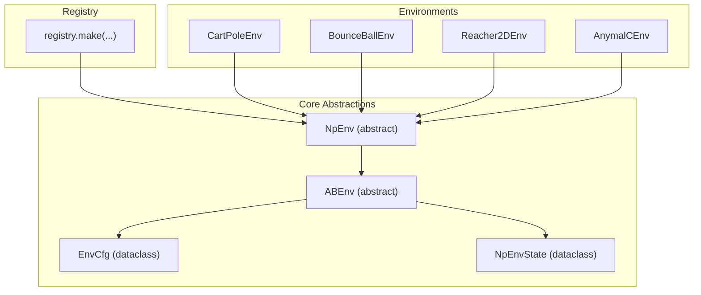
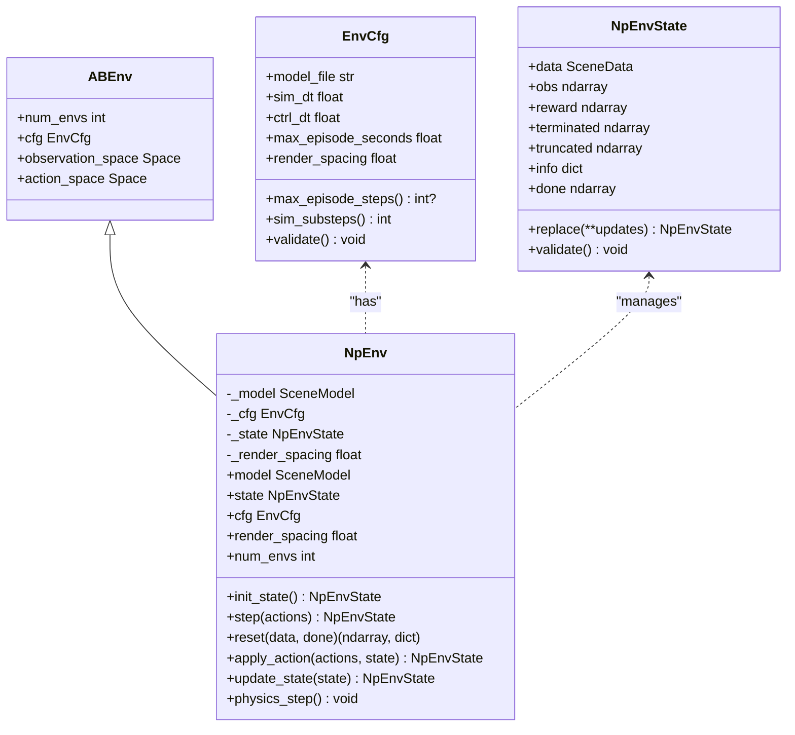
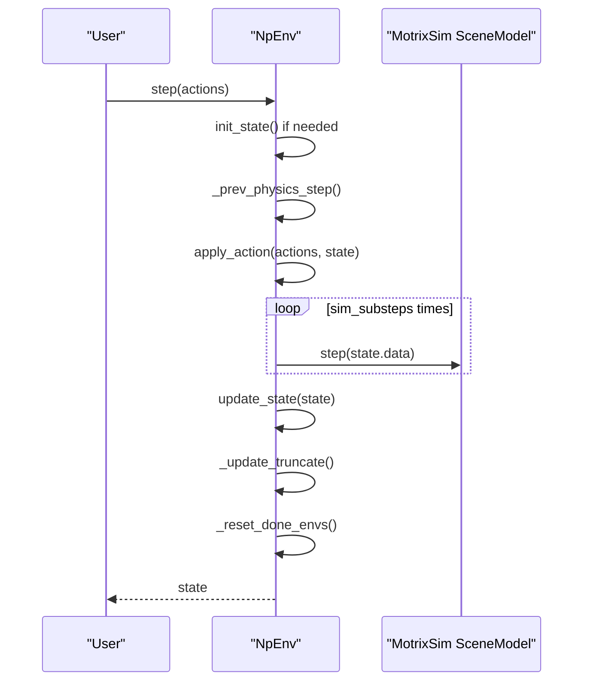
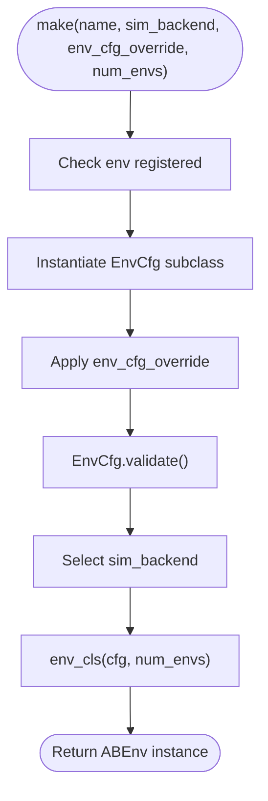
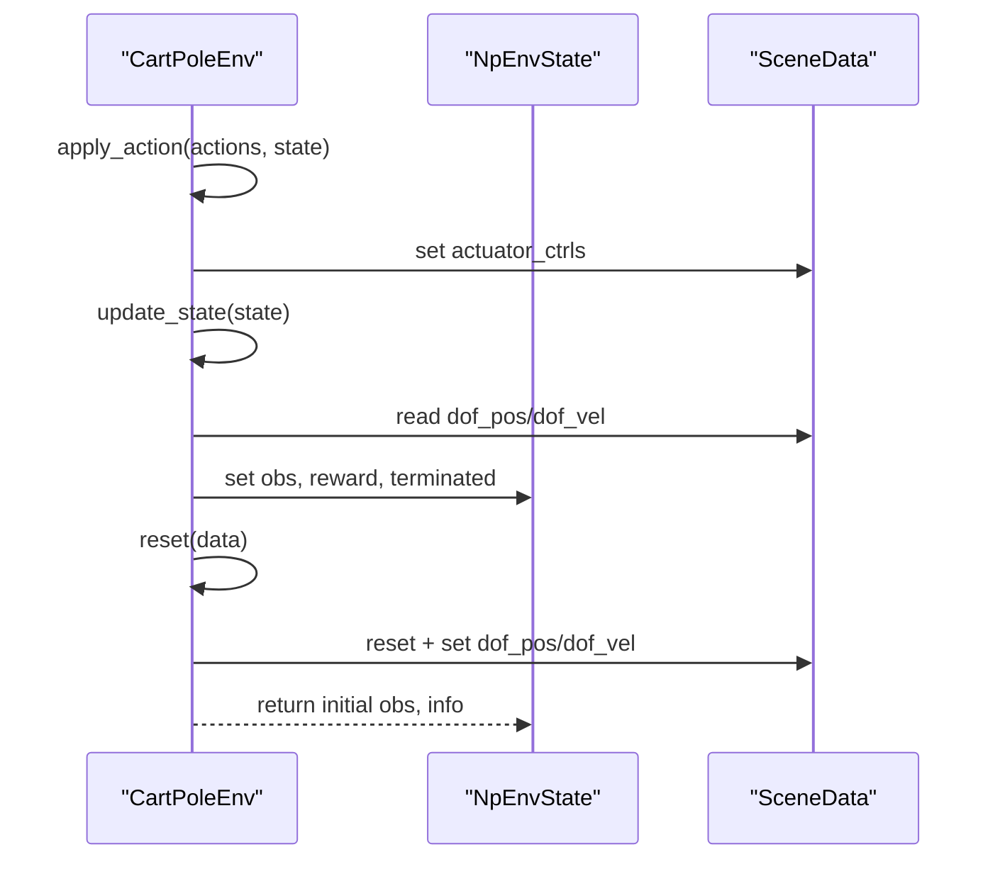
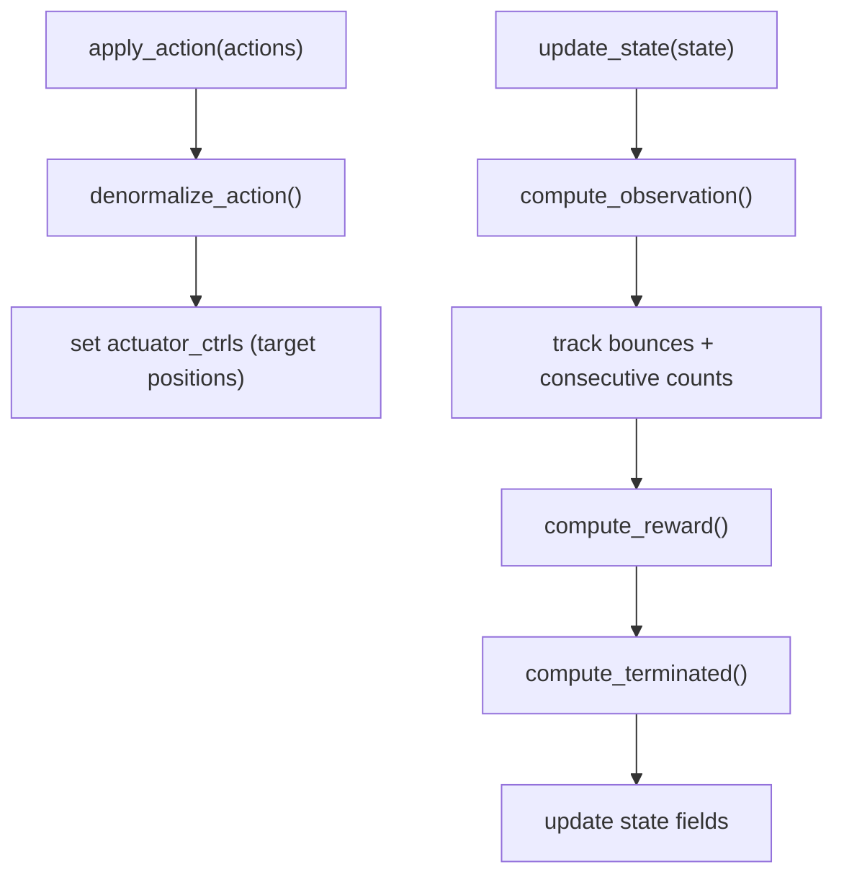
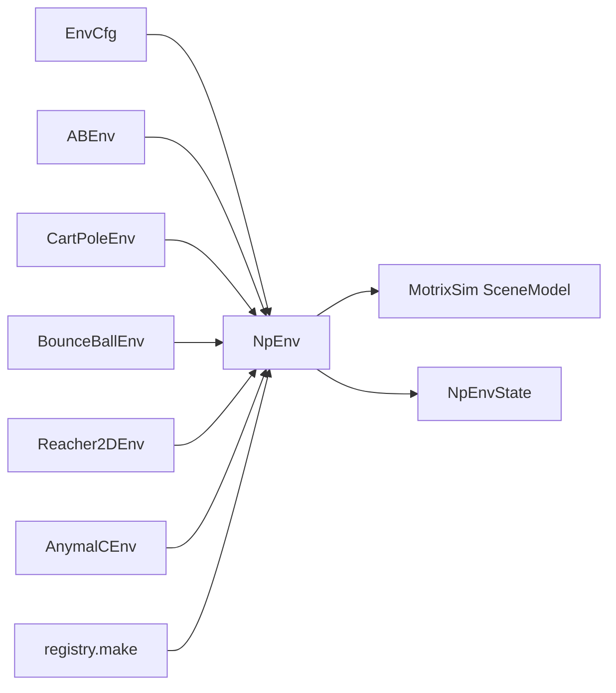

# Environment Architecture and Base Classes

<cite>
**Referenced Files in This Document**
- [base.py](file://motrix_envs/src/motrix_envs/base.py)
- [env.py](file://motrix_envs/src/motrix_envs/np/env.py)
- [registry.py](file://motrix_envs/src/motrix_envs/registry.py)
- [cartpole_np.py](file://motrix_envs/src/motrix_envs/basic/cartpole/cartpole_np.py)
- [cartpole_cfg.py](file://motrix_envs/src/motrix_envs/basic/cartpole/cfg.py)
- [bounce_ball_np.py](file://motrix_envs/src/motrix_envs/basic/bounce_ball/bounce_ball_np.py)
- [bounce_ball_cfg.py](file://motrix_envs/src/motrix_envs/basic/bounce_ball/cfg.py)
- [reacher_np.py](file://motrix_envs/src/motrix_envs/basic/reacher/reacher_np.py)
- [anymal_c_np.py](file://motrix_envs/src/motrix_envs/locomotion/anymal_c/anymal_c_np.py)
- [go1_cfg.py](file://motrix_envs/src/motrix_envs/locomotion/go1/cfg.py)
- [franka_lift_cube_cfg.py](file://motrix_envs/src/motrix_envs/manipulation/franka_lift_cube/cfg.py)
- [reward.py](file://motrix_envs/src/motrix_envs/np/reward.py)
- [physics_environment.md](file://docs/source/en/user_guide/tutorial/physics_environment.md)
- [training_environment_config.md](file://docs/source/en/user_guide/tutorial/training_environment_config.md)
- [train.py](file://scripts/train.py)
</cite>

## Table of Contents
1. [Introduction](#introduction)
2. [Project Structure](#project-structure)
3. [Core Components](#core-components)
4. [Architecture Overview](#architecture-overview)
5. [Detailed Component Analysis](#detailed-component-analysis)
6. [Dependency Analysis](#dependency-analysis)
7. [Performance Considerations](#performance-considerations)
8. [Troubleshooting Guide](#troubleshooting-guide)
9. [Conclusion](#conclusion)
10. [Appendices](#appendices)

## Introduction
This document explains the MotrixLab-S1 environment architecture and the base class system that defines the environment contract. It covers:
- Abstract base classes (ABEnv) and the environment lifecycle
- State management via NpEnvState and the NumPy-based NpEnv implementation
- Observation and reward generation patterns
- EnvCfg dataclass hierarchy, parameter validation, and inheritance
- Initialization, reset, step, and termination logic
- Practical examples for building custom environments and extending the base classes for robotics applications

## Project Structure
The environment system is organized around a small set of core abstractions and a registry-driven instantiation mechanism. Environments are grouped by domain (basic, locomotion, navigation, manipulation) and implemented using the NumPy-backed NpEnv with MotrixSim as the physics engine.

**Diagram sources**
- [base.py](file://motrix_envs/src/motrix_envs/base.py#L61-L85)
- [env.py](file://motrix_envs/src/motrix_envs/np/env.py#L52-L209)
- [registry.py](file://motrix_envs/src/motrix_envs/registry.py#L114-L161)
- [cartpole_np.py](file://motrix_envs/src/motrix_envs/basic/cartpole/cartpole_np.py#L26-L98)
- [bounce_ball_np.py](file://motrix_envs/src/motrix_envs/basic/bounce_ball/bounce_ball_np.py#L26-L309)
- [reacher_np.py](file://motrix_envs/src/motrix_envs/basic/reacher/reacher_np.py#L27-L116)
- [anymal_c_np.py](file://motrix_envs/src/motrix_envs/locomotion/anymal_c/anymal_c_np.py#L28-L657)

**Section sources**
- [base.py](file://motrix_envs/src/motrix_envs/base.py#L23-L85)
- [env.py](file://motrix_envs/src/motrix_envs/np/env.py#L26-L209)
- [registry.py](file://motrix_envs/src/motrix_envs/registry.py#L24-L172)

## Core Components
- ABEnv: Defines the environment contract with abstract properties for num_envs, cfg, observation_space, and action_space. It also declares abstract methods for environment lifecycle hooks that subclasses must implement.
- EnvCfg: A dataclass holding simulation configuration (model_file, sim_dt, ctrl_dt, max_episode_seconds, render_spacing) with computed properties for max_episode_steps and sim_substeps, plus a validate method to enforce constraints.
- NpEnv: A NumPy-backed environment implementation that integrates with MotrixSim. It manages NpEnvState, exposes physics_step, and orchestrates the environment lifecycle (init_state, step, reset, apply_action, update_state).
- NpEnvState: A dataclass encapsulating the environment’s internal state (SceneData, obs, reward, terminated, truncated, info) with validation and convenience helpers.

Key lifecycle and state interfaces:
- Lifecycle: init_state → step → reset (when done) → repeat
- State: NpEnvState holds batched observations, rewards, termination flags, and info dictionary
- Observation/reward: subclasses compute obs, reward, and terminated/truncated in update_state

**Section sources**
- [base.py](file://motrix_envs/src/motrix_envs/base.py#L61-L85)
- [base.py](file://motrix_envs/src/motrix_envs/base.py#L23-L60)
- [env.py](file://motrix_envs/src/motrix_envs/np/env.py#L26-L111)
- [env.py](file://motrix_envs/src/motrix_envs/np/env.py#L149-L209)

## Architecture Overview
The environment architecture follows a layered design:
- Abstract contracts (ABEnv, EnvCfg) define the interface and configuration
- Concrete implementations (NpEnv) implement the lifecycle and integrate with MotrixSim
- Domain-specific environments inherit from NpEnv and implement apply_action, update_state, and reset
- Registry provides a centralized factory for environment creation with configuration overrides and backend selection

**Diagram sources**
- [base.py](file://motrix_envs/src/motrix_envs/base.py#L61-L85)
- [base.py](file://motrix_envs/src/motrix_envs/base.py#L23-L60)
- [env.py](file://motrix_envs/src/motrix_envs/np/env.py#L26-L209)

## Detailed Component Analysis

### Abstract Base Classes (ABEnv) and EnvCfg
- ABEnv declares the environment contract: scalar/vectorized env size, configuration access, and gymnasium Space definitions for observations and actions. Subclasses must implement apply_action, update_state, and reset.
- EnvCfg centralizes simulation parameters:
  - model_file: path to the MuJoCo-compatible XML model
  - sim_dt and ctrl_dt: simulation and control time steps
  - max_episode_seconds: optional episode duration
  - render_spacing: rendering grid spacing for multi-environment visualization
  - Computed properties:
    - max_episode_steps: derived from max_episode_seconds / ctrl_dt
    - sim_substeps: derived from ctrl_dt / sim_dt (rounded)
  - Validation ensures sim_dt ≤ ctrl_dt

Practical implications:
- Use EnvCfg to tune simulation fidelity vs. performance
- Use max_episode_seconds to constrain episode length; NpEnv will truncate episodes accordingly
- Use render_spacing to improve visualization quality for multi-env grids

**Section sources**
- [base.py](file://motrix_envs/src/motrix_envs/base.py#L23-L60)
- [base.py](file://motrix_envs/src/motrix_envs/base.py#L61-L85)

### NpEnv: NumPy-Based Environment Implementation
NpEnv integrates MotrixSim physics:
- Initialization loads the model and sets timestep
- init_state creates batched arrays for obs, reward, terminated, truncated, and info; validates shapes
- step orchestrates:
  - apply_action to set actuator controls
  - physics_step (multiple sim_substeps per control step)
  - update_state to compute obs, reward, terminated, truncated
  - increment step counters, update truncation, and reset done environments
- reset is abstract; subclasses implement environment-specific reset logic

**Diagram sources**
- [env.py](file://motrix_envs/src/motrix_envs/np/env.py#L186-L209)

**Section sources**
- [env.py](file://motrix_envs/src/motrix_envs/np/env.py#L52-L209)

### NpEnvState: State Representation and Validation
- Holds batched SceneData, observations, rewards, termination flags, and info dictionary
- Provides done property combining terminated and truncated
- Provides replace for immutable updates and validate to assert consistent shapes

Usage patterns:
- Subclasses populate obs, reward, terminated, truncated in update_state
- reset returns initial obs and info; info can carry episode statistics

**Section sources**
- [env.py](file://motrix_envs/src/motrix_envs/np/env.py#L26-L51)

### Registry and Environment Instantiation
The registry enables:
- Registering environment configurations (@envcfg decorator) and environment classes (@env decorator)
- Centralized creation via make(name, sim_backend, env_cfg_override, num_envs)
- Validation of config overrides and backend availability

**Diagram sources**
- [registry.py](file://motrix_envs/src/motrix_envs/registry.py#L114-L161)

**Section sources**
- [registry.py](file://motrix_envs/src/motrix_envs/registry.py#L24-L172)

### Example Environments and Patterns

#### CartPole Environment
- Extends NpEnv
- Defines Box action and observation spaces
- apply_action assigns actions to actuator_ctrls
- update_state computes obs from dof_pos/dof_vel, reward, and termination thresholds
- reset initializes DOF positions/velocities around default angles with noise

**Diagram sources**
- [cartpole_np.py](file://motrix_envs/src/motrix_envs/basic/cartpole/cartpole_np.py#L26-L98)

**Section sources**
- [cartpole_np.py](file://motrix_envs/src/motrix_envs/basic/cartpole/cartpole_np.py#L26-L98)
- [cartpole_cfg.py](file://motrix_envs/src/motrix_envs/basic/cartpole/cfg.py#L25-L32)

#### BounceBall Environment
- Extends NpEnv
- Uses DOF positions and velocities for observations
- Implements sophisticated reward shaping using tolerance curves and bounce tracking
- Applies denormalized actions to control paddle targets
- Resets with configurable initial conditions and noise

**Diagram sources**
- [bounce_ball_np.py](file://motrix_envs/src/motrix_envs/basic/bounce_ball/bounce_ball_np.py#L182-L248)

**Section sources**
- [bounce_ball_np.py](file://motrix_envs/src/motrix_envs/basic/bounce_ball/bounce_ball_np.py#L26-L309)
- [bounce_ball_cfg.py](file://motrix_envs/src/motrix_envs/basic/bounce_ball/cfg.py#L25-L65)

#### Reacher2D Environment
- Extends NpEnv
- Builds observation from DOF positions, target-relative finger position, and DOF velocities
- Uses tolerance-based reward from reward.tolerance
- Demonstrates dynamic target placement and info propagation

**Section sources**
- [reacher_np.py](file://motrix_envs/src/motrix_envs/basic/reacher/reacher_np.py#L27-L116)
- [reward.py](file://motrix_envs/src/motrix_envs/np/reward.py#L63-L84)

#### AnymalC Locomotion Environment
- Extends NpEnv
- Implements complex observation space including base state, joint states, commands, and flags
- Computes reward using multiple components (velocity tracking, orientation stability, penalties)
- Handles contact detection and termination conditions
- Demonstrates advanced reset logic with pose commands and visualization updates

**Section sources**
- [anymal_c_np.py](file://motrix_envs/src/motrix_envs/locomotion/anymal_c/anymal_c_np.py#L28-L657)

#### Go1 Terrain Walking Configurations
- Demonstrates EnvCfg inheritance and specialization for different terrains
- Shows composition of NoiseConfig, ControlConfig, RewardConfig, InitState, Commands, Normalization, Asset, Sensor

**Section sources**
- [go1_cfg.py](file://motrix_envs/src/motrix_envs/locomotion/go1/cfg.py#L23-L188)

#### Franka Lift Cube Configuration
- Shows environment-specific configuration for manipulation tasks
- Includes InitState, ControlConfig, Commands, and Asset tailored for robotic manipulation

**Section sources**
- [franka_lift_cube_cfg.py](file://motrix_envs/src/motrix_envs/manipulation/franka_lift_cube/cfg.py#L27-L84)

## Dependency Analysis
- ABEnv depends on gymnasium spaces for observation/action definitions
- EnvCfg depends on dataclasses and validation logic
- NpEnv depends on MotrixSim SceneModel and SceneData, and on ABEnv/EnvCfg contracts
- Domain environments depend on NpEnv and their specific EnvCfg subclasses
- Registry couples EnvCfg and ABEnv subclasses with a simple decorator-based registration

**Diagram sources**
- [base.py](file://motrix_envs/src/motrix_envs/base.py#L23-L85)
- [env.py](file://motrix_envs/src/motrix_envs/np/env.py#L23-L24)
- [registry.py](file://motrix_envs/src/motrix_envs/registry.py#L114-L161)

**Section sources**
- [base.py](file://motrix_envs/src/motrix_envs/base.py#L23-L85)
- [env.py](file://motrix_envs/src/motrix_envs/np/env.py#L23-L24)
- [registry.py](file://motrix_envs/src/motrix_envs/registry.py#L114-L161)

## Performance Considerations
- Simulation fidelity vs. speed: adjust sim_dt and ctrl_dt; ensure ctrl_dt is an integer multiple of sim_dt
- Vectorization: increase num_envs for throughput; ensure batched computations in apply_action/update_state
- Observation/reward computation: keep logic vectorized and avoid Python loops inside update_state
- Rendering: set render_spacing appropriately; disabling rendering improves performance
- Truncation: use max_episode_seconds to cap long episodes and reduce variance

[No sources needed since this section provides general guidance]

## Troubleshooting Guide
Common issues and resolutions:
- Model file path errors: ensure model_file is accessible and paths are relative to the configuration file
- Time step mismatches: verify sim_dt ≤ ctrl_dt and that sim_substeps is integer-valued
- Shape mismatches: ensure obs/reward/terminated/truncated arrays match batch size and dtypes
- Numerical instability: check for NaN/Inf in DOF states and handle in update_state
- Termination conditions: confirm termination flags are computed consistently across environments

**Section sources**
- [physics_environment.md](file://docs/source/en/user_guide/tutorial/physics_environment.md#L43-L67)
- [env.py](file://motrix_envs/src/motrix_envs/np/env.py#L45-L50)

## Conclusion
MotrixLab-S1 provides a clean, extensible environment architecture built on abstract contracts (ABEnv, EnvCfg) and a NumPy-backed implementation (NpEnv) integrated with MotrixSim. The registry simplifies environment instantiation and configuration, while domain-specific environments showcase diverse observation/reward patterns and control strategies. By following the documented patterns, developers can implement robust, high-performance environments for robotics tasks.

[No sources needed since this section summarizes without analyzing specific files]

## Appendices

### Environment Lifecycle Reference
- Initialization: cfg.validate() → NpEnv.__init__ → model load and options set
- First step: init_state → step → apply_action → physics_step → update_state → increment steps → truncate → reset done
- Reset: reset(data) returns initial obs and info; info can carry episode statistics

**Section sources**
- [env.py](file://motrix_envs/src/motrix_envs/np/env.py#L58-L111)
- [env.py](file://motrix_envs/src/motrix_envs/np/env.py#L196-L209)

### Practical Example: Creating a Custom Environment
Steps:
1. Define EnvCfg subclass with model_file, sim_dt, ctrl_dt, max_episode_seconds, and domain-specific parameters
2. Register the configuration with @registry.envcfg("your-env")
3. Implement NpEnv subclass with:
   - observation_space and action_space
   - apply_action to map actions to actuator_ctrls
   - update_state to compute obs, reward, terminated, truncated
   - reset to initialize SceneData and info
4. Register the environment with @registry.env("your-env", "np")
5. Instantiate via registry.make("your-env", num_envs=N)

**Section sources**
- [cartpole_cfg.py](file://motrix_envs/src/motrix_envs/basic/cartpole/cfg.py#L25-L32)
- [cartpole_np.py](file://motrix_envs/src/motrix_envs/basic/cartpole/cartpole_np.py#L26-L98)
- [registry.py](file://motrix_envs/src/motrix_envs/registry.py#L53-L99)

### Training Integration
- Use scripts/train.py to launch training with environment selection and backend configuration
- RL configuration is handled separately via motrix_rl registry and PPOCfg

**Section sources**
- [train.py](file://scripts/train.py#L52-L95)
- [training_environment_config.md](file://docs/source/en/user_guide/tutorial/training_environment_config.md#L1-L232)