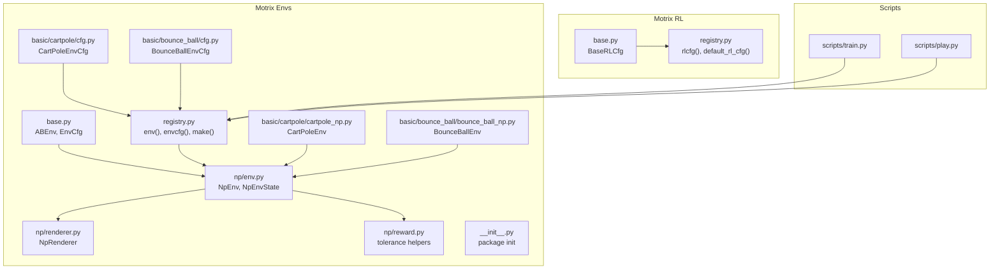
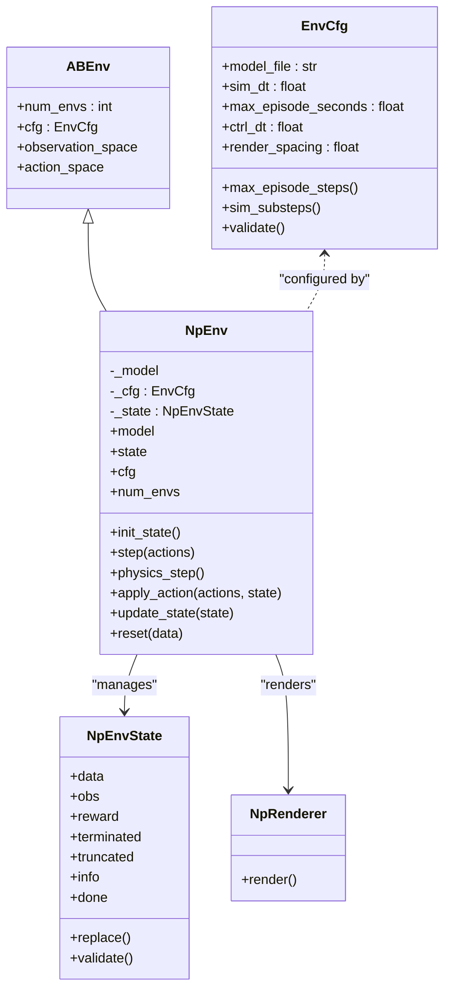
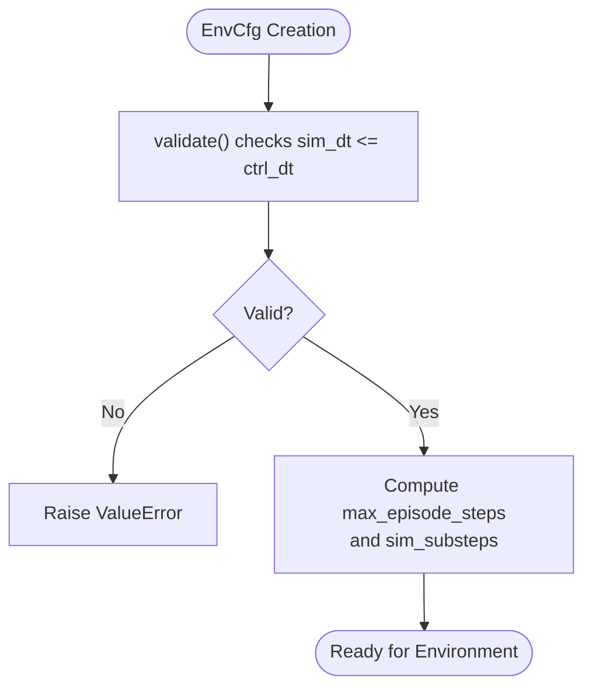
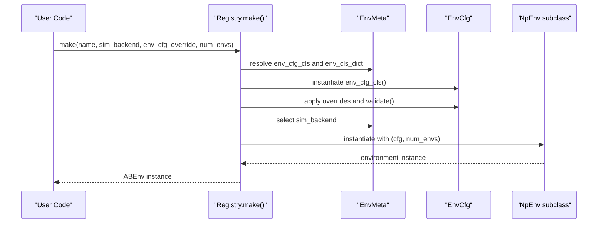
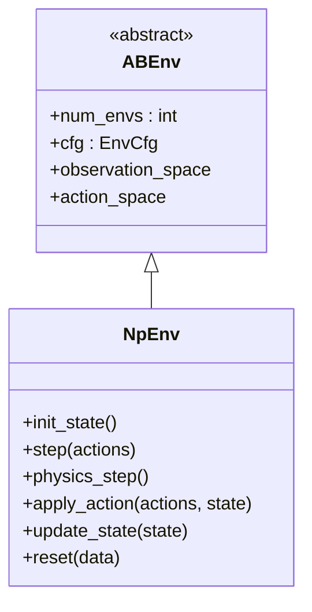
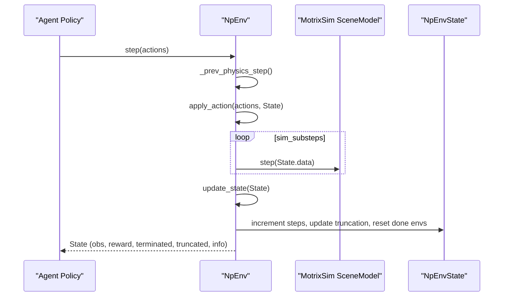
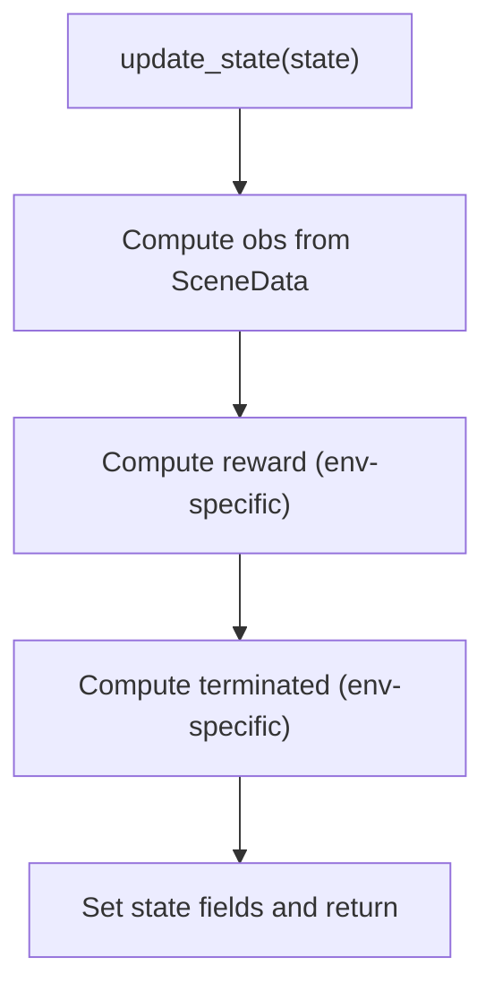
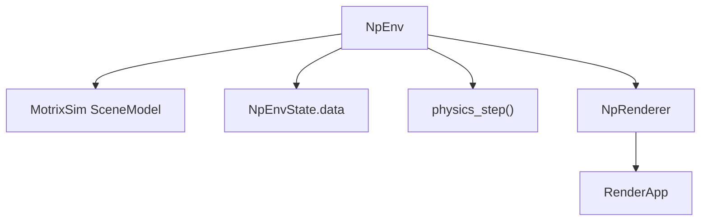
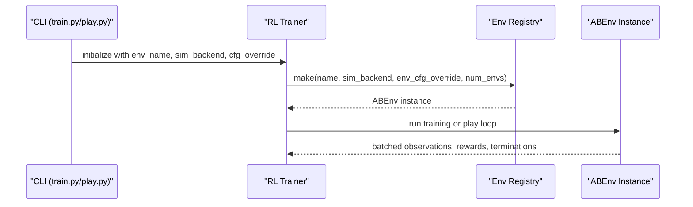
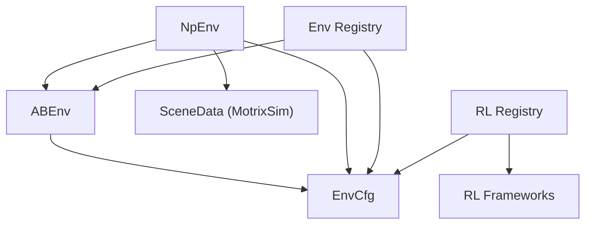

# Environment System

<cite>
**Referenced Files in This Document**
- [base.py](file://motrix_envs/src/motrix_envs/base.py)
- [registry.py](file://motrix_envs/src/motrix_envs/registry.py)
- [env.py](file://motrix_envs/src/motrix_envs/np/env.py)
- [renderer.py](file://motrix_envs/src/motrix_envs/np/renderer.py)
- [reward.py](file://motrix_envs/src/motrix_envs/np/reward.py)
- [cartpole_np.py](file://motrix_envs/src/motrix_envs/basic/cartpole/cartpole_np.py)
- [bounce_ball_np.py](file://motrix_envs/src/motrix_envs/basic/bounce_ball/bounce_ball_np.py)
- [cartpole/cfg.py](file://motrix_envs/src/motrix_envs/basic/cartpole/cfg.py)
- [bounce_ball/cfg.py](file://motrix_envs/src/motrix_envs/basic/bounce_ball/cfg.py)
- [__init__.py](file://motrix_envs/src/motrix_envs/__init__.py)
- [base.py](file://motrix_rl/src/motrix_rl/base.py)
- [registry.py](file://motrix_rl/src/motrix_rl/registry.py)
- [train.py](file://scripts/train.py)
- [play.py](file://scripts/play.py)
</cite>

## Table of Contents
1. [Introduction](#introduction)
2. [Project Structure](#project-structure)
3. [Core Components](#core-components)
4. [Architecture Overview](#architecture-overview)
5. [Detailed Component Analysis](#detailed-component-analysis)
6. [Dependency Analysis](#dependency-analysis)
7. [Performance Considerations](#performance-considerations)
8. [Troubleshooting Guide](#troubleshooting-guide)
9. [Conclusion](#conclusion)
10. [Appendices](#appendices)

## Introduction
This document explains the MotrixLab-S1 environment system architecture with a focus on the unified environment interface design, the registry pattern for dynamic environment creation and lookup, and the base class hierarchy that defines environment contracts. It documents the environment lifecycle from initialization through training episodes, state management, observation generation, and reward calculation. It also covers the integration with the MotrixSim physics engine, rendering system capabilities, and the numpy-based implementation approach. Finally, it describes environment configuration classes, parameter validation mechanisms, and the relationship between environment instances and training processes, with practical usage patterns and customization options.

## Project Structure
The environment system is organized around a core abstraction layer, a registry for dynamic discovery and instantiation, and concrete environment implementations backed by MotrixSim via a numpy-based interface. Training integration is handled by a separate RL module that bridges environments to RL frameworks.

**Diagram sources**
- [base.py](file://motrix_envs/src/motrix_envs/base.py#L23-L85)
- [registry.py](file://motrix_envs/src/motrix_envs/registry.py#L24-L172)
- [env.py](file://motrix_envs/src/motrix_envs/np/env.py#L26-L209)
- [renderer.py](file://motrix_envs/src/motrix_envs/np/renderer.py#L22-L65)
- [reward.py](file://motrix_envs/src/motrix_envs/np/reward.py#L21-L84)
- [cartpole_np.py](file://motrix_envs/src/motrix_envs/basic/cartpole/cartpole_np.py#L26-L98)
- [bounce_ball_np.py](file://motrix_envs/src/motrix_envs/basic/bounce_ball/bounce_ball_np.py#L26-L309)
- [cartpole/cfg.py](file://motrix_envs/src/motrix_envs/basic/cartpole/cfg.py#L25-L32)
- [bounce_ball/cfg.py](file://motrix_envs/src/motrix_envs/basic/bounce_ball/cfg.py#L25-L65)
- [base.py](file://motrix_rl/src/motrix_rl/base.py#L20-L43)
- [registry.py](file://motrix_rl/src/motrix_rl/registry.py#L28-L115)
- [train.py](file://scripts/train.py#L52-L95)
- [play.py](file://scripts/play.py#L110-L162)

**Section sources**
- [base.py](file://motrix_envs/src/motrix_envs/base.py#L23-L85)
- [registry.py](file://motrix_envs/src/motrix_envs/registry.py#L24-L172)
- [env.py](file://motrix_envs/src/motrix_envs/np/env.py#L26-L209)
- [renderer.py](file://motrix_envs/src/motrix_envs/np/renderer.py#L22-L65)
- [reward.py](file://motrix_envs/src/motrix_envs/np/reward.py#L21-L84)
- [cartpole_np.py](file://motrix_envs/src/motrix_envs/basic/cartpole/cartpole_np.py#L26-L98)
- [bounce_ball_np.py](file://motrix_envs/src/motrix_envs/basic/bounce_ball/bounce_ball_np.py#L26-L309)
- [cartpole/cfg.py](file://motrix_envs/src/motrix_envs/basic/cartpole/cfg.py#L25-L32)
- [bounce_ball/cfg.py](file://motrix_envs/src/motrix_envs/basic/bounce_ball/cfg.py#L25-L65)
- [base.py](file://motrix_rl/src/motrix_rl/base.py#L20-L43)
- [registry.py](file://motrix_rl/src/motrix_rl/registry.py#L28-L115)
- [train.py](file://scripts/train.py#L52-L95)
- [play.py](file://scripts/play.py#L110-L162)

## Core Components
- Unified Environment Interface
  - ABEnv: Abstract base defining environment contract (spaces, configuration, and lifecycle hooks).
  - EnvCfg: Configuration dataclass with validation and derived properties for simulation timing and episode limits.
- Numpy-Based Implementation
  - NpEnv: Concrete environment implementing the lifecycle, state management, and integration with MotrixSim.
  - NpEnvState: Typed container for batched simulation data, observations, rewards, termination flags, and info.
- Registry Pattern
  - EnvMeta and registry: Centralized registration and lookup for environment configurations and implementations.
  - Decorators: envcfg and env for registering configuration classes and environment classes with a backend.
- Rendering
  - NpRenderer: Renders multiple environment batches in a tiled grid layout using MotrixSim’s render app.
- Reward Utilities
  - tolerance and sigmoid helpers: Numerical primitives for shaped reward computation.

**Section sources**
- [base.py](file://motrix_envs/src/motrix_envs/base.py#L23-L85)
- [registry.py](file://motrix_envs/src/motrix_envs/registry.py#L24-L172)
- [env.py](file://motrix_envs/src/motrix_envs/np/env.py#L26-L209)
- [renderer.py](file://motrix_envs/src/motrix_envs/np/renderer.py#L22-L65)
- [reward.py](file://motrix_envs/src/motrix_envs/np/reward.py#L21-L84)

## Architecture Overview
The environment system separates concerns across layers:
- Abstraction: ABEnv defines the environment contract.
- Configuration: EnvCfg encapsulates environment parameters and validation.
- Implementation: NpEnv integrates MotrixSim, manages state, and implements the episode loop.
- Discovery: Registry enables dynamic creation of environments by name and backend.
- Rendering: NpRenderer renders batches of environments for visualization.
- RL Integration: RL registry binds environments to RL configurations and frameworks.

**Diagram sources**
- [base.py](file://motrix_envs/src/motrix_envs/base.py#L61-L85)
- [base.py](file://motrix_envs/src/motrix_envs/base.py#L23-L59)
- [env.py](file://motrix_envs/src/motrix_envs/np/env.py#L52-L209)
- [env.py](file://motrix_envs/src/motrix_envs/np/env.py#L26-L51)
- [renderer.py](file://motrix_envs/src/motrix_envs/np/renderer.py#L22-L65)

## Detailed Component Analysis

### Unified Environment Interface Design
- ABEnv defines the minimal contract that all environments must satisfy: spaces, configuration, and lifecycle properties. This ensures consistent behavior across different environment implementations.
- EnvCfg centralizes environment configuration, including model file path, simulation and control timesteps, episode duration, and render spacing. It provides computed properties for episode steps and simulation substeps, and validates constraints between timesteps.

**Diagram sources**
- [base.py](file://motrix_envs/src/motrix_envs/base.py#L53-L59)
- [base.py](file://motrix_envs/src/motrix_envs/base.py#L37-L51)

**Section sources**
- [base.py](file://motrix_envs/src/motrix_envs/base.py#L23-L85)

### Registry Pattern for Dynamic Environment Creation and Lookup
- Registration decorators:
  - envcfg("name"): Registers a configuration class under a name.
  - env("name", "backend"): Registers an environment class for a specific backend.
- Factory method make():
  - Resolves configuration class, applies overrides, validates, selects backend, and instantiates the environment class.
- Utility functions:
  - contains, list_registered_envs, find_available_sim_backend.

**Diagram sources**
- [registry.py](file://motrix_envs/src/motrix_envs/registry.py#L114-L161)

**Section sources**
- [registry.py](file://motrix_envs/src/motrix_envs/registry.py#L24-L172)

### Base Class Hierarchy and Contracts
- ABEnv: Declares required properties and abstract methods for environments.
- EnvCfg: Provides validated configuration and derived simulation parameters.
- NpEnv: Implements the episode loop, state transitions, and integration with MotrixSim.

**Diagram sources**
- [base.py](file://motrix_envs/src/motrix_envs/base.py#L61-L85)
- [env.py](file://motrix_envs/src/motrix_envs/np/env.py#L52-L209)

**Section sources**
- [base.py](file://motrix_envs/src/motrix_envs/base.py#L61-L85)
- [env.py](file://motrix_envs/src/motrix_envs/np/env.py#L52-L209)

### Environment Lifecycle: Initialization, Episode Loop, State Management
- Initialization:
  - NpEnv loads the MotrixSim model, sets timestep, and prepares batched SceneData.
  - init_state creates NpEnvState with zeroed arrays for observations, rewards, and info, and resets done environments.
- Episode loop:
  - step invokes apply_action, advances physics sim_substeps times, update_state, increments steps, updates truncation, resets done environments, and returns the new state.
- State management:
  - NpEnvState holds batched data, observations, rewards, terminated/truncated flags, and info dictionary. It validates shapes and exposes a done property.

**Diagram sources**
- [env.py](file://motrix_envs/src/motrix_envs/np/env.py#L186-L209)
- [env.py](file://motrix_envs/src/motrix_envs/np/env.py#L97-L148)

**Section sources**
- [env.py](file://motrix_envs/src/motrix_envs/np/env.py#L52-L209)

### Observation Generation and Reward Calculation
- CartPoleEnv:
  - Observes concatenation of dof positions and velocities; computes constant reward and termination based on position and angle thresholds.
- BounceBallEnv:
  - Uses DOF positions and velocities for observation; computes reward using configurable parameters and shaped penalties; tracks consecutive bounces and maximum achieved; detects termination based on ball height and horizontal bounds.

**Diagram sources**
- [cartpole_np.py](file://motrix_envs/src/motrix_envs/basic/cartpole/cartpole_np.py#L50-L75)
- [bounce_ball_np.py](file://motrix_envs/src/motrix_envs/basic/bounce_ball/bounce_ball_np.py#L197-L248)

**Section sources**
- [cartpole_np.py](file://motrix_envs/src/motrix_envs/basic/cartpole/cartpole_np.py#L50-L75)
- [bounce_ball_np.py](file://motrix_envs/src/motrix_envs/basic/bounce_ball/bounce_ball_np.py#L197-L248)

### Integration with MotrixSim Physics Engine and Rendering
- Physics:
  - NpEnv loads a SceneModel from model_file and advances simulation via model.step with batched SceneData.
  - Sim timestep and substeps are derived from EnvCfg.
- Rendering:
  - NpRenderer initializes a RenderApp with batched environments arranged in a grid using render_spacing offsets and toggles camera synchronization.

**Diagram sources**
- [env.py](file://motrix_envs/src/motrix_envs/np/env.py#L58-L63)
- [env.py](file://motrix_envs/src/motrix_envs/np/env.py#L186-L189)
- [renderer.py](file://motrix_envs/src/motrix_envs/np/renderer.py#L29-L54)

**Section sources**
- [env.py](file://motrix_envs/src/motrix_envs/np/env.py#L58-L63)
- [env.py](file://motrix_envs/src/motrix_envs/np/env.py#L186-L189)
- [renderer.py](file://motrix_envs/src/motrix_envs/np/renderer.py#L29-L54)

### Numpy-Based Implementation Approach
- Batched computations:
  - NpEnvState stores arrays for observations, rewards, and flags with shape (num_envs, ...).
  - Operations leverage numpy for vectorized reward shaping, termination detection, and info aggregation.
- Shaped rewards:
  - tolerance and sigmoid helpers provide smooth reward shaping commonly used in RL.

**Section sources**
- [env.py](file://motrix_envs/src/motrix_envs/np/env.py#L26-L51)
- [reward.py](file://motrix_envs/src/motrix_envs/np/reward.py#L63-L84)

### Environment Configuration Classes and Parameter Validation
- CartPoleEnvCfg and BounceBallEnvCfg inherit from EnvCfg and register via envcfg decorator.
- Validation ensures sim_dt ≤ ctrl_dt; derived properties compute episode steps and substeps.
- Configurable parameters include reset noise, episode duration, render spacing, and environment-specific physics and control parameters.

**Section sources**
- [cartpole/cfg.py](file://motrix_envs/src/motrix_envs/basic/cartpole/cfg.py#L25-L32)
- [bounce_ball/cfg.py](file://motrix_envs/src/motrix_envs/basic/bounce_ball/cfg.py#L25-L65)
- [base.py](file://motrix_envs/src/motrix_envs/base.py#L53-L59)
- [base.py](file://motrix_envs/src/motrix_envs/base.py#L37-L51)

### Relationship Between Environment Instances and Training Processes
- Scripts:
  - train.py and play.py orchestrate environment creation, backend selection, and training/inference loops.
- RL Integration:
  - RL registry binds environments to RL configurations and frameworks; RL configs define training hyperparameters and batch sizes.

**Diagram sources**
- [train.py](file://scripts/train.py#L52-L95)
- [play.py](file://scripts/play.py#L110-L162)
- [registry.py](file://motrix_envs/src/motrix_envs/registry.py#L114-L161)

**Section sources**
- [train.py](file://scripts/train.py#L52-L95)
- [play.py](file://scripts/play.py#L110-L162)
- [registry.py](file://motrix_envs/src/motrix_envs/registry.py#L114-L161)

### Practical Examples and Customization Options
- Creating an environment:
  - Use registry.make with environment name, optional backend, and config overrides.
- Customizing environments:
  - Define a new EnvCfg subclass and register it with envcfg.
  - Implement a new NpEnv subclass with apply_action, update_state, and reset tailored to your scenario.
  - Register the environment with env decorator for the desired backend.
- Rendering:
  - Instantiate NpRenderer with an existing NpEnv to visualize batched simulations.

**Section sources**
- [registry.py](file://motrix_envs/src/motrix_envs/registry.py#L114-L161)
- [cartpole_np.py](file://motrix_envs/src/motrix_envs/basic/cartpole/cartpole_np.py#L26-L48)
- [bounce_ball_np.py](file://motrix_envs/src/motrix_envs/basic/bounce_ball/bounce_ball_np.py#L26-L74)
- [renderer.py](file://motrix_envs/src/motrix_envs/np/renderer.py#L29-L65)

## Dependency Analysis
The environment system exhibits low coupling and high cohesion:
- ABEnv and EnvCfg define the contract and configuration, decoupled from implementation.
- NpEnv depends on MotrixSim and numpy for physics and batching.
- Registry decouples environment discovery from consumers.
- RL registry decouples environment selection from RL framework specifics.

**Diagram sources**
- [base.py](file://motrix_envs/src/motrix_envs/base.py#L61-L85)
- [env.py](file://motrix_envs/src/motrix_envs/np/env.py#L52-L209)
- [registry.py](file://motrix_envs/src/motrix_envs/registry.py#L24-L172)
- [registry.py](file://motrix_rl/src/motrix_rl/registry.py#L28-L115)

**Section sources**
- [base.py](file://motrix_envs/src/motrix_envs/base.py#L61-L85)
- [env.py](file://motrix_envs/src/motrix_envs/np/env.py#L52-L209)
- [registry.py](file://motrix_envs/src/motrix_envs/registry.py#L24-L172)
- [registry.py](file://motrix_rl/src/motrix_rl/registry.py#L28-L115)

## Performance Considerations
- Vectorization: NpEnv leverages numpy arrays for batched operations, minimizing Python overhead.
- Simulation substeps: sim_substeps balances fidelity and speed; tune sim_dt and ctrl_dt accordingly.
- Rendering cost: Rendering multiple environments increases GPU/CPU load; adjust render_spacing and batch size.
- Episode truncation: Properly configured max_episode_steps prevents unbounded loops and reduces wasted computation.

[No sources needed since this section provides general guidance]

## Troubleshooting Guide
- Configuration validation errors:
  - Ensure sim_dt ≤ ctrl_dt; EnvCfg.validate raises an error otherwise.
- Backend support:
  - Only "np" backend is currently supported; attempting other backends raises an error.
- Missing registration:
  - Calling make with an unregistered environment name raises an error; ensure envcfg and env decorators were applied.
- Episode termination:
  - Verify termination logic in environment subclasses; incorrect thresholds can lead to premature or infinite episodes.

**Section sources**
- [base.py](file://motrix_envs/src/motrix_envs/base.py#L53-L59)
- [registry.py](file://motrix_envs/src/motrix_envs/registry.py#L71-L83)
- [registry.py](file://motrix_envs/src/motrix_envs/registry.py#L132-L134)

## Conclusion
The MotrixLab-S1 environment system provides a clean, extensible architecture that abstracts physics simulation details behind a unified interface, supports dynamic environment discovery and instantiation, and integrates seamlessly with MotrixSim and rendering. The numpy-based implementation enables efficient batched computation, while the configuration and validation mechanisms ensure robust and predictable behavior. The RL integration further streamlines training and inference workflows, enabling scalable experimentation across diverse robotic tasks.

## Appendices
- Package initialization:
  - The environment package imports feature modules to expose built-in environments.

**Section sources**
- [__init__.py](file://motrix_envs/src/motrix_envs/__init__.py#L16-L17)