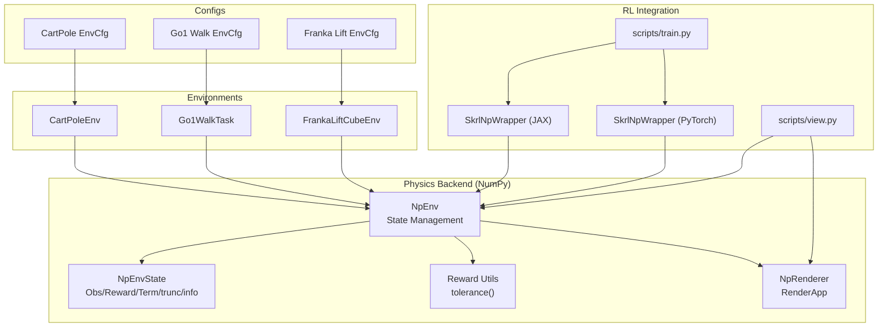
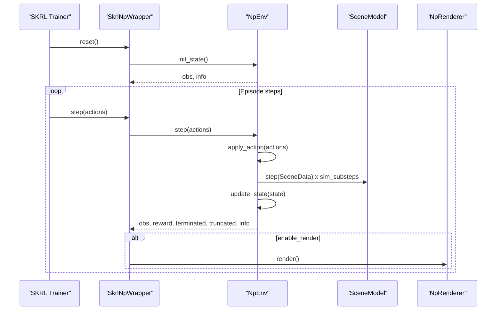
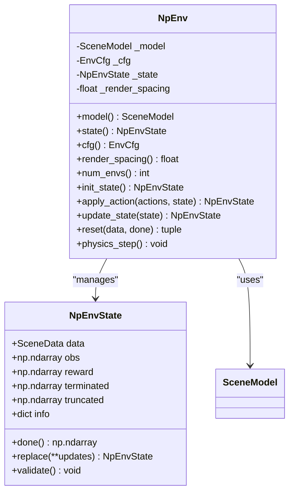
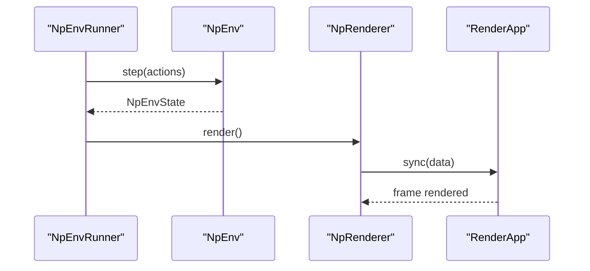
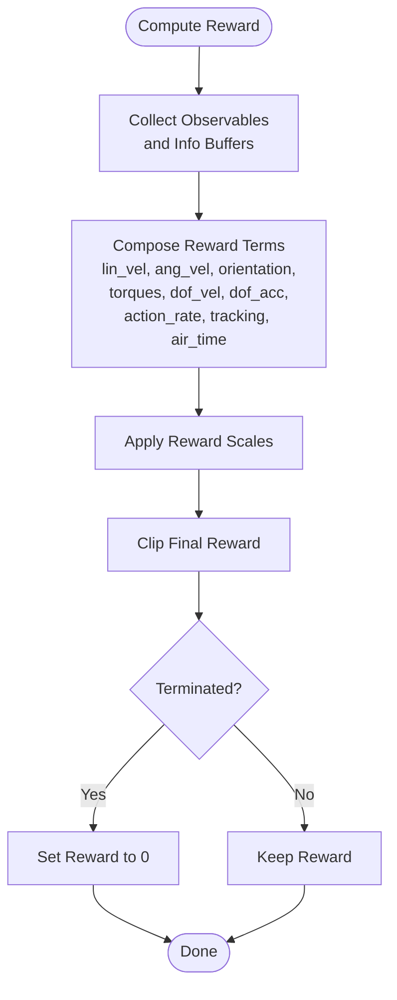
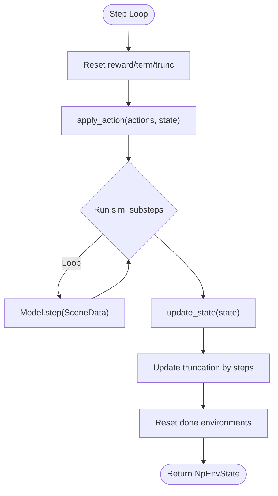
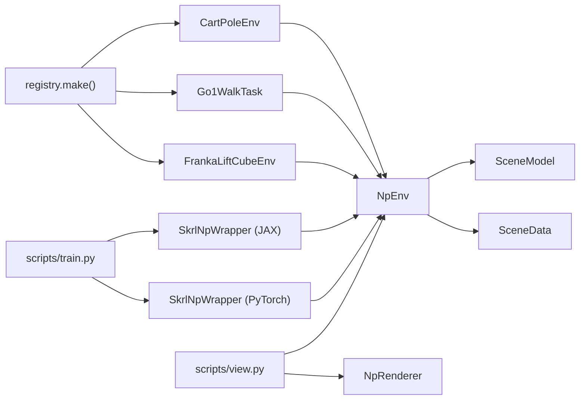

# Physics Simulation Integration

<cite>
**Referenced Files in This Document**
- [env.py](file://motrix_envs/src/motrix_envs/np/env.py)
- [reward.py](file://motrix_envs/src/motrix_envs/np/reward.py)
- [renderer.py](file://motrix_envs/src/motrix_envs/np/renderer.py)
- [base.py](file://motrix_envs/src/motrix_envs/base.py)
- [registry.py](file://motrix_envs/src/motrix_envs/registry.py)
- [cartpole_np.py](file://motrix_envs/src/motrix_envs/basic/cartpole/cartpole_np.py)
- [walk_np.py](file://motrix_envs/src/motrix_envs/locomotion/go1/walk_np.py)
- [franka_lift_cube_np.py](file://motrix_envs/src/motrix_envs/manipulation/franka_lift_cube/franka_lift_cube_np.py)
- [cfg.py (CartPole)](file://motrix_envs/src/motrix_envs/basic/cartpole/cfg.py)
- [cfg.py (Go1 Walk)](file://motrix_envs/src/motrix_envs/locomotion/go1/cfg.py)
- [cfg.py (Franka Lift Cube)](file://motrix_envs/src/motrix_envs/manipulation/franka_lift_cube/cfg.py)
- [wrap_np.py (JAX)](file://motrix_rl/src/motrix_rl/skrl/jax/wrap_np.py)
- [wrap_np.py (PyTorch)](file://motrix_rl/src/motrix_rl/skrl/torch/wrap_np.py)
- [train.py](file://scripts/train.py)
- [view.py](file://scripts/view.py)
</cite>

## Table of Contents
1. [Introduction](#introduction)
2. [Project Structure](#project-structure)
3. [Core Components](#core-components)
4. [Architecture Overview](#architecture-overview)
5. [Detailed Component Analysis](#detailed-component-analysis)
6. [Dependency Analysis](#dependency-analysis)
7. [Performance Considerations](#performance-considerations)
8. [Troubleshooting Guide](#troubleshooting-guide)
9. [Conclusion](#conclusion)
10. [Appendices](#appendices)

## Introduction
This document explains the physics simulation integration of MotrixLab-S1 with the MotrixSim engine. It focuses on the NumPy-based simulation backend, state management via NpEnvState, the integration between physics simulation and reinforcement learning training loops, rendering and visualization, reward computation and shaping, and performance optimization. Practical examples demonstrate configuring simulation parameters, optimizing performance, and integrating custom physics properties for different robots and environments.

## Project Structure
MotrixLab-S1 organizes physics environments, configuration, and RL integration into modular packages:
- Physics environments and NumPy backend: motrix_envs/src/motrix_envs/np/*
- Environment implementations: motrix_envs/src/motrix_envs/*/np.py
- Environment configurations: motrix_envs/src/motrix_envs/*/**/cfg.py
- RL wrappers and training entry points: motrix_rl/src/motrix_rl/skrl/*/wrap_np.py and scripts/train.py
- Rendering and visualization: motrix_envs/src/motrix_envs/np/renderer.py and scripts/view.py

**Diagram sources**
- [env.py](file://motrix_envs/src/motrix_envs/np/env.py#L26-L108)
- [reward.py](file://motrix_envs/src/motrix_envs/np/reward.py#L63-L84)
- [renderer.py](file://motrix_envs/src/motrix_envs/np/renderer.py#L22-L65)
- [cartpole_np.py](file://motrix_envs/src/motrix_envs/basic/cartpole/cartpole_np.py#L26-L98)
- [walk_np.py](file://motrix_envs/src/motrix_envs/locomotion/go1/walk_np.py#L26-L387)
- [franka_lift_cube_np.py](file://motrix_envs/src/motrix_envs/manipulation/franka_lift_cube/franka_lift_cube_np.py#L32-L292)
- [cfg.py (CartPole)](file://motrix_envs/src/motrix_envs/basic/cartpole/cfg.py#L25-L32)
- [cfg.py (Go1 Walk)](file://motrix_envs/src/motrix_envs/locomotion/go1/cfg.py#L122-L137)
- [cfg.py (Franka Lift Cube)](file://motrix_envs/src/motrix_envs/manipulation/franka_lift_cube/cfg.py#L69-L84)
- [wrap_np.py (JAX)](file://motrix_rl/src/motrix_rl/skrl/jax/wrap_np.py#L27-L81)
- [wrap_np.py (PyTorch)](file://motrix_rl/src/motrix_rl/skrl/torch/wrap_np.py#L26-L80)
- [train.py](file://scripts/train.py#L52-L95)
- [view.py](file://scripts/view.py#L29-L83)

**Section sources**
- [env.py](file://motrix_envs/src/motrix_envs/np/env.py#L52-L110)
- [base.py](file://motrix_envs/src/motrix_envs/base.py#L23-L60)
- [registry.py](file://motrix_envs/src/motrix_envs/registry.py#L114-L161)

## Core Components
- NpEnv: Base class for NumPy-backed physics environments. Manages the MotrixSim SceneModel, timestep, substeps, and the environment lifecycle. Implements the step loop: apply_action → physics_step → update_state → truncate → reset done environments.
- NpEnvState: Immutable-like container holding the current SceneData, observations, rewards, termination flags, truncation flags, and info dictionary. Includes validation and convenience helpers (e.g., done).
- NpRenderer: Launches a RenderApp with batched environments arranged in a grid layout, enabling real-time visualization synchronized with simulation state.
- Reward utilities: Provides a smooth tolerance function for shaped rewards using configurable sigmoid curves and margins.
- Registry and EnvCfg: Centralized environment registration and configuration, including simulation timestep, control timestep, and derived substeps.

Key implementation references:
- NpEnv state creation and step loop: [init_state](file://motrix_envs/src/motrix_envs/np/env.py#L97-L110), [step](file://motrix_envs/src/motrix_envs/np/env.py#L196-L209)
- NpEnvState definition and validation: [NpEnvState](file://motrix_envs/src/motrix_envs/np/env.py#L26-L50)
- NpRenderer initialization and render sync: [NpRenderer](file://motrix_envs/src/motrix_envs/np/renderer.py#L22-L65)
- Reward tolerance function: [tolerance](file://motrix_envs/src/motrix_envs/np/reward.py#L63-L84)
- Environment configuration and substeps: [EnvCfg](file://motrix_envs/src/motrix_envs/base.py#L23-L60)

**Section sources**
- [env.py](file://motrix_envs/src/motrix_envs/np/env.py#L26-L110)
- [renderer.py](file://motrix_envs/src/motrix_envs/np/renderer.py#L22-L65)
- [reward.py](file://motrix_envs/src/motrix_envs/np/reward.py#L63-L84)
- [base.py](file://motrix_envs/src/motrix_envs/base.py#L23-L60)

## Architecture Overview
The integration follows a clean separation between physics simulation and RL training:
- Environments inherit from NpEnv and implement apply_action/update_state/reset tailored to the task.
- RL wrappers (SkrlNpWrapper) adapt NpEnv to SKRL’s interface, converting NumPy arrays to JAX/PyTorch tensors and exposing step/obs/reward semantics.
- Training scripts select the backend (JAX or PyTorch) and launch the appropriate wrapper.

**Diagram sources**
- [wrap_np.py (JAX)](file://motrix_rl/src/motrix_rl/skrl/jax/wrap_np.py#L40-L66)
- [wrap_np.py (PyTorch)](file://motrix_rl/src/motrix_rl/skrl/torch/wrap_np.py#L39-L65)
- [env.py](file://motrix_envs/src/motrix_envs/np/env.py#L186-L209)
- [renderer.py](file://motrix_envs/src/motrix_envs/np/renderer.py#L56-L65)

**Section sources**
- [wrap_np.py (JAX)](file://motrix_rl/src/motrix_rl/skrl/jax/wrap_np.py#L27-L81)
- [wrap_np.py (PyTorch)](file://motrix_rl/src/motrix_rl/skrl/torch/wrap_np.py#L26-L80)
- [env.py](file://motrix_envs/src/motrix_envs/np/env.py#L186-L209)
- [renderer.py](file://motrix_envs/src/motrix_envs/np/renderer.py#L56-L65)

## Detailed Component Analysis

### NpEnv and NpEnvState
NpEnv encapsulates:
- SceneModel loading and configuration (timestep, substeps)
- Batched SceneData creation and state lifecycle
- Step loop orchestration and truncation handling
- Reset logic for done environments

NpEnvState ensures consistent shapes and types for observations, rewards, and flags, and exposes a done property combining termination and truncation.

**Diagram sources**
- [env.py](file://motrix_envs/src/motrix_envs/np/env.py#L26-L110)

**Section sources**
- [env.py](file://motrix_envs/src/motrix_envs/np/env.py#L26-L110)

### Rendering System and Real-Time Visualization
NpRenderer:
- Computes a 2D grid offset layout for multiple environments
- Launches RenderApp with performance settings and batched SceneData synchronization
- Supports toggling camera synchronization and manual key handling

**Diagram sources**
- [renderer.py](file://motrix_envs/src/motrix_envs/np/renderer.py#L22-L65)
- [view.py](file://scripts/view.py#L52-L69)

**Section sources**
- [renderer.py](file://motrix_envs/src/motrix_envs/np/renderer.py#L22-L65)
- [view.py](file://scripts/view.py#L29-L83)

### Reward Calculation and Shaping
Reward utilities provide a smooth tolerance function for shaped rewards:
- Accepts bounds, margin, sigmoid type, and value_at_margin
- Produces per-environment reward values using configurable sigmoid families

Environment-specific reward shaping:
- CartPole: constant reward per step with termination based on position/angle thresholds
- Go1 Walk: composite reward with tracking, orientation, torques, joint velocities/accelerations, action rate, feet air time, and termination scaling
- Franka Lift Cube: reach, lift, command tracking (multiple granular sigmoids), penalties on action changes and joint velocities

**Diagram sources**
- [walk_np.py](file://motrix_envs/src/motrix_envs/locomotion/go1/walk_np.py#L249-L265)
- [franka_lift_cube_np.py](file://motrix_envs/src/motrix_envs/manipulation/franka_lift_cube/franka_lift_cube_np.py#L198-L265)
- [reward.py](file://motrix_envs/src/motrix_envs/np/reward.py#L63-L84)

**Section sources**
- [reward.py](file://motrix_envs/src/motrix_envs/np/reward.py#L63-L84)
- [cartpole_np.py](file://motrix_envs/src/motrix_envs/basic/cartpole/cartpole_np.py#L62-L75)
- [walk_np.py](file://motrix_envs/src/motrix_envs/locomotion/go1/walk_np.py#L249-L387)
- [franka_lift_cube_np.py](file://motrix_envs/src/motrix_envs/manipulation/franka_lift_cube/franka_lift_cube_np.py#L198-L292)

### Simulation Stepping, Collision Detection, Contact Forces, and Dynamics
- Simulation stepping: NpEnv.physics_step runs the SceneModel.step multiple times per control step according to sim_substeps derived from EnvCfg.
- Collision detection and contacts: Environments query contact pairs and check collisions against predefined termination/penalty geometry sets.
- Dynamics computation: SceneData holds positions, velocities, controls, and sensors; environments read/write these to compute observations and rewards.

**Diagram sources**
- [env.py](file://motrix_envs/src/motrix_envs/np/env.py#L186-L209)
- [base.py](file://motrix_envs/src/motrix_envs/base.py#L47-L51)

**Section sources**
- [env.py](file://motrix_envs/src/motrix_envs/np/env.py#L186-L209)
- [base.py](file://motrix_envs/src/motrix_envs/base.py#L47-L51)
- [walk_np.py](file://motrix_envs/src/motrix_envs/locomotion/go1/walk_np.py#L218-L234)

### Environment Implementations and Custom Physics Properties
- CartPoleEnv: Minimal observation (dof positions/velocities), constant reward, termination on bounds violations.
- Go1WalkTask: PD control torque computation, extensive observation including base pose/velocity, gravity vector, joint angles/velocities, last actions, and commands; collision/air-time based termination and reward shaping.
- FrankaLiftCubeEnv: Position control with gripper action sampling, observation includes joint states, object pose, target pose, and last actions; termination on joint/cube velocity limits and height.

Practical configuration examples:
- CartPole: set model_file, reset noise, max episode seconds, render spacing
- Go1: configure control gains, normalization scales, reward scales, asset names, sensor names, terrain-specific XMLs
- Franka: define joint limits, default positions, command targets, and control modes

**Section sources**
- [cartpole_np.py](file://motrix_envs/src/motrix_envs/basic/cartpole/cartpole_np.py#L26-L98)
- [walk_np.py](file://motrix_envs/src/motrix_envs/locomotion/go1/walk_np.py#L26-L387)
- [franka_lift_cube_np.py](file://motrix_envs/src/motrix_envs/manipulation/franka_lift_cube/franka_lift_cube_np.py#L32-L292)
- [cfg.py (CartPole)](file://motrix_envs/src/motrix_envs/basic/cartpole/cfg.py#L25-L32)
- [cfg.py (Go1 Walk)](file://motrix_envs/src/motrix_envs/locomotion/go1/cfg.py#L122-L188)
- [cfg.py (Franka Lift Cube)](file://motrix_envs/src/motrix_envs/manipulation/franka_lift_cube/cfg.py#L69-L84)

## Dependency Analysis
The system relies on a clear dependency chain:
- Environments depend on NpEnv and EnvCfg
- NpEnv depends on MotrixSim SceneModel and SceneData
- RL wrappers depend on NpEnv and optionally NpRenderer
- Scripts depend on registry.make to instantiate environments and wrappers

**Diagram sources**
- [registry.py](file://motrix_envs/src/motrix_envs/registry.py#L114-L161)
- [cartpole_np.py](file://motrix_envs/src/motrix_envs/basic/cartpole/cartpole_np.py#L26-L33)
- [walk_np.py](file://motrix_envs/src/motrix_envs/locomotion/go1/walk_np.py#L26-L32)
- [franka_lift_cube_np.py](file://motrix_envs/src/motrix_envs/manipulation/franka_lift_cube/franka_lift_cube_np.py#L32-L37)
- [wrap_np.py (JAX)](file://motrix_rl/src/motrix_rl/skrl/jax/wrap_np.py#L35-L38)
- [wrap_np.py (PyTorch)](file://motrix_rl/src/motrix_rl/skrl/torch/wrap_np.py#L34-L37)
- [train.py](file://scripts/train.py#L75-L87)
- [view.py](file://scripts/view.py#L75-L78)

**Section sources**
- [registry.py](file://motrix_envs/src/motrix_envs/registry.py#L114-L161)
- [wrap_np.py (JAX)](file://motrix_rl/src/motrix_rl/skrl/jax/wrap_np.py#L35-L38)
- [wrap_np.py (PyTorch)](file://motrix_rl/src/motrix_rl/skrl/torch/wrap_np.py#L34-L37)
- [train.py](file://scripts/train.py#L75-L87)
- [view.py](file://scripts/view.py#L75-L78)

## Performance Considerations
- Timestep alignment: EnvCfg derives sim_substeps from sim_dt and ctrl_dt, ensuring integer substeps and stable integration.
- Vectorization: NpEnvState stores batched arrays for observations, rewards, and flags, enabling NumPy vectorized computations.
- Rendering overhead: NpRenderer supports toggling camera synchronization and batched grid layout to balance visualization fidelity and performance.
- Reward computation: Shaped rewards use vectorized NumPy operations and configurable sigmoids; clipping prevents extreme values.
- Action control: PD control in Go1WalkTask computes torques efficiently using batched queries for joint positions/velocities.

Recommendations:
- Tune sim_dt and ctrl_dt to balance accuracy and speed; increase sim_substeps for stability.
- Prefer vectorized operations in update_state and reward shaping to minimize Python loops.
- Limit render updates to reduce GPU/CPU overhead during training; toggle synchronization when needed.

**Section sources**
- [base.py](file://motrix_envs/src/motrix_envs/base.py#L47-L51)
- [env.py](file://motrix_envs/src/motrix_envs/np/env.py#L186-L209)
- [renderer.py](file://motrix_envs/src/motrix_envs/np/renderer.py#L44-L55)
- [walk_np.py](file://motrix_envs/src/motrix_envs/locomotion/go1/walk_np.py#L167-L174)

## Troubleshooting Guide
Common issues and checks:
- Shape mismatches: Validate NpEnvState shapes in init_state and during resets; assert reward/terminated/truncated shapes align with num_envs.
- Episode truncation: Ensure max_episode_steps is computed from max_episode_seconds and ctrl_dt; verify truncation logic updates per step.
- Reset logic: Confirm done environments are properly masked and reinitialized with reset(), updating info buffers and observations.
- Rendering synchronization: Toggle camera synchronization via keyboard input in NpRenderer; verify offsets and render spacing for multi-environment grids.
- RL wrapper compatibility: Ensure actions are converted to NumPy arrays and results reshaped to SKRL expectations.

**Section sources**
- [env.py](file://motrix_envs/src/motrix_envs/np/env.py#L97-L140)
- [env.py](file://motrix_envs/src/motrix_envs/np/env.py#L141-L209)
- [renderer.py](file://motrix_envs/src/motrix_envs/np/renderer.py#L56-L65)
- [wrap_np.py (JAX)](file://motrix_rl/src/motrix_rl/skrl/jax/wrap_np.py#L52-L61)
- [wrap_np.py (PyTorch)](file://motrix_rl/src/motrix_rl/skrl/torch/wrap_np.py#L51-L60)

## Conclusion
MotrixLab-S1 integrates MotrixSim’s physics backend with NumPy-based environments and SKRL’s RL framework. The design cleanly separates simulation, state management, rendering, and training, enabling efficient multi-environment execution and flexible reward shaping. By tuning simulation parameters, leveraging vectorized computations, and using environment-specific configurations, practitioners can optimize performance and tailor physics properties for diverse robotics tasks.

## Appendices

### Practical Examples

- Configure simulation parameters for a new environment:
  - Set model_file, sim_dt, ctrl_dt, max_episode_seconds, and render_spacing in the environment’s EnvCfg subclass.
  - Example references: [CartPole EnvCfg](file://motrix_envs/src/motrix_envs/basic/cartpole/cfg.py#L25-L32), [Go1 Walk EnvCfg](file://motrix_envs/src/motrix_envs/locomotion/go1/cfg.py#L122-L137), [Franka Lift EnvCfg](file://motrix_envs/src/motrix_envs/manipulation/franka_lift_cube/cfg.py#L69-L84)

- Optimize simulation performance:
  - Adjust sim_dt and ctrl_dt to achieve desired sim_substeps; keep sim_dt ≤ ctrl_dt.
  - Use vectorized reward computation and avoid Python loops in update_state.
  - Reduce rendering frequency or disable synchronization during training.

- Integrate custom physics properties:
  - Define asset names, sensor names, and termination/contact geometry in EnvCfg subclasses.
  - Implement apply_action to map actions to actuator controls and update info buffers.
  - Implement reset to initialize SceneData with noise and initial conditions.

- Train with RL:
  - Use scripts/train.py to select backend (JAX/Torch), number of environments, and optional rendering.
  - Wrappers convert NumPy arrays to backend tensors and expose step semantics to SKRL.

**Section sources**
- [cfg.py (CartPole)](file://motrix_envs/src/motrix_envs/basic/cartpole/cfg.py#L25-L32)
- [cfg.py (Go1 Walk)](file://motrix_envs/src/motrix_envs/locomotion/go1/cfg.py#L122-L188)
- [cfg.py (Franka Lift Cube)](file://motrix_envs/src/motrix_envs/manipulation/franka_lift_cube/cfg.py#L69-L84)
- [env.py](file://motrix_envs/src/motrix_envs/np/env.py#L58-L64)
- [train.py](file://scripts/train.py#L52-L95)
- [wrap_np.py (JAX)](file://motrix_rl/src/motrix_rl/skrl/jax/wrap_np.py#L35-L61)
- [wrap_np.py (PyTorch)](file://motrix_rl/src/motrix_rl/skrl/torch/wrap_np.py#L34-L60)