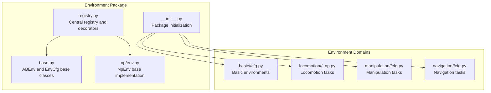
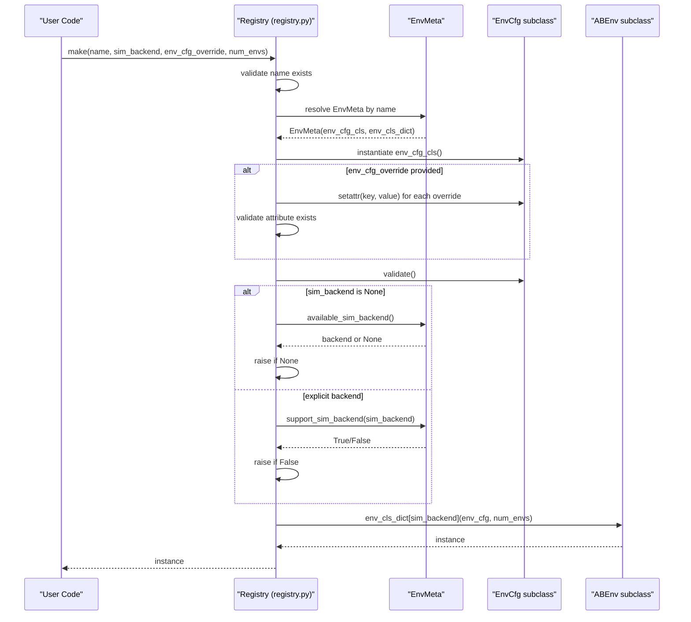
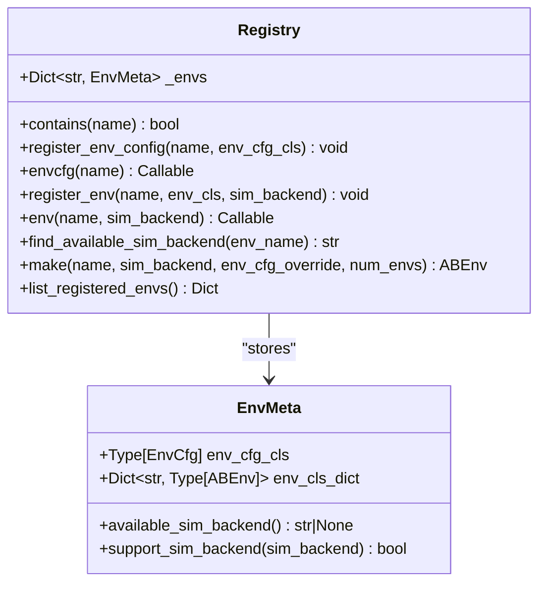
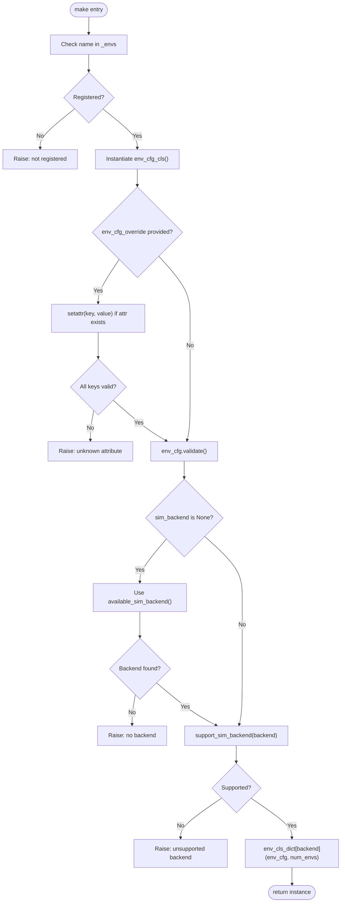
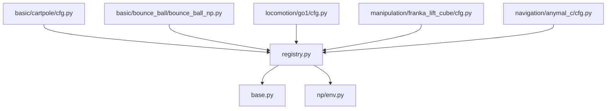

# Registry System

<cite>
**Referenced Files in This Document**
- [registry.py](file://motrix_envs/src/motrix_envs/registry.py)
- [base.py](file://motrix_envs/src/motrix_envs/base.py)
- [env.py](file://motrix_envs/src/motrix_envs/np/env.py)
- [cartpole/cfg.py](file://motrix_envs/src/motrix_envs/basic/cartpole/cfg.py)
- [bounce_ball_np.py](file://motrix_envs/src/motrix_envs/basic/bounce_ball/bounce_ball_np.py)
- [go1/cfg.py](file://motrix_envs/src/motrix_envs/locomotion/go1/cfg.py)
- [franka_lift_cube/cfg.py](file://motrix_envs/src/motrix_envs/manipulation/franka_lift_cube/cfg.py)
- [anymal_c/cfg.py](file://motrix_envs/src/motrix_envs/navigation/anymal_c/cfg.py)
- [__init__.py](file://motrix_envs/src/motrix_envs/__init__.py)
</cite>

## Table of Contents
1. [Introduction](#introduction)
2. [Project Structure](#project-structure)
3. [Core Components](#core-components)
4. [Architecture Overview](#architecture-overview)
5. [Detailed Component Analysis](#detailed-component-analysis)
6. [Dependency Analysis](#dependency-analysis)
7. [Performance Considerations](#performance-considerations)
8. [Troubleshooting Guide](#troubleshooting-guide)
9. [Conclusion](#conclusion)

## Introduction
This document explains the MotrixLab-S1 environment registry system, focusing on how the registry pattern centralizes environment configuration and implementation management. It covers the EnvMeta metadata container, the _envs dictionary registry, the registration decorators (@envcfg and @env), the environment lookup and backend selection mechanisms, and the dynamic instantiation process via the make() function. It also documents parameter validation, error handling, and configuration override capabilities, with practical examples for registering new environments, querying available environments, and handling backend compatibility.

## Project Structure
The registry system resides in the environment package and integrates with environment configurations and implementations across basic, locomotion, manipulation, and navigation domains. The registry module defines the central registry and supporting utilities, while environment-specific modules register their configurations and implementations.

**Diagram sources**
- [registry.py](file://motrix_envs/src/motrix_envs/registry.py#L1-L172)
- [base.py](file://motrix_envs/src/motrix_envs/base.py#L1-L85)
- [env.py](file://motrix_envs/src/motrix_envs/np/env.py#L1-L209)
- [__init__.py](file://motrix_envs/src/motrix_envs/__init__.py#L1-L17)

**Section sources**
- [registry.py](file://motrix_envs/src/motrix_envs/registry.py#L1-L172)
- [base.py](file://motrix_envs/src/motrix_envs/base.py#L1-L85)
- [env.py](file://motrix_envs/src/motrix_envs/np/env.py#L1-L209)
- [__init__.py](file://motrix_envs/src/motrix_envs/__init__.py#L1-L17)

## Core Components
- EnvMeta: Holds an environment configuration class and a mapping of simulation backends to environment implementations. Provides helpers to query available backends and check backend support.
- _envs: Global registry mapping environment names to EnvMeta instances.
- Registration decorators:
  - @envcfg(name): Registers an environment configuration class with a given name.
  - @env(name, sim_backend): Registers an environment implementation class for a specific backend.
- Lookup and instantiation:
  - contains(name): Checks if an environment configuration is registered.
  - make(name, sim_backend=None, env_cfg_override=None, num_envs=1): Creates an environment instance by name, applying configuration overrides and selecting a backend.
  - list_registered_envs(): Lists all registered environments with their configuration class and available backends.
- Base classes:
  - EnvCfg: Defines environment configuration fields and validation logic.
  - ABEnv: Abstract interface for environments, extended by NpEnv.

Key behaviors:
- Centralized registry ensures loose coupling between configuration classes and implementations.
- Backend selection defaults to the first available backend if none is specified.
- Configuration overrides are validated against the configuration class attributes.
- Error messages clearly indicate missing registrations, unsupported backends, or invalid overrides.

**Section sources**
- [registry.py](file://motrix_envs/src/motrix_envs/registry.py#L24-L171)
- [base.py](file://motrix_envs/src/motrix_envs/base.py#L23-L85)

## Architecture Overview
The registry system implements a classic registry pattern with two-phase registration:
1. Configuration registration: An environment configuration class is associated with a logical name.
2. Implementation registration: An environment implementation class is associated with a backend under the same logical name.

At runtime, make() resolves the configuration, applies overrides, validates it, selects a backend, and instantiates the implementation.

**Diagram sources**
- [registry.py](file://motrix_envs/src/motrix_envs/registry.py#L114-L160)

## Detailed Component Analysis

### EnvMeta and _envs Registry
EnvMeta encapsulates:
- env_cfg_cls: The configuration class associated with the environment name.
- env_cls_dict: Mapping from backend identifiers to environment implementation classes.

It provides:
- available_sim_backend(): Returns the first available backend or None.
- support_sim_backend(backend): Checks if a backend is registered for the environment.

_envs is a global dictionary keyed by environment name, storing EnvMeta instances.

**Diagram sources**
- [registry.py](file://motrix_envs/src/motrix_envs/registry.py#L24-L171)

**Section sources**
- [registry.py](file://motrix_envs/src/motrix_envs/registry.py#L24-L83)

### Registration Decorators (@envcfg and @env)
- @envcfg(name): Registers an EnvCfg subclass under the given logical name. The decorator calls register_env_config internally.
- @env(name, sim_backend): Registers an ABEnv subclass for a specific backend under the given logical name. The decorator calls register_env internally.

Usage patterns:
- Configuration registration: Apply @envcfg to a dataclass derived from EnvCfg.
- Implementation registration: Apply @env to a class derived from ABEnv (typically NpEnv) with the environment name and backend identifier.

Backend constraints:
- Currently, only "np" is supported. Attempting to register another backend raises an error.

**Section sources**
- [registry.py](file://motrix_envs/src/motrix_envs/registry.py#L53-L99)

### Environment Lookup and Backend Selection
- contains(name): Checks membership in _envs.
- find_available_sim_backend(env_name): Returns the first available backend for an environment or raises if none.
- make():
  - Validates that the environment name is registered.
  - Instantiates the configuration class and applies overrides safely.
  - Calls env_cfg.validate().
  - Selects backend: if None, uses the first available; otherwise verifies support.
  - Instantiates the matching implementation class with the configuration and number of environments.

**Diagram sources**
- [registry.py](file://motrix_envs/src/motrix_envs/registry.py#L114-L160)

**Section sources**
- [registry.py](file://motrix_envs/src/motrix_envs/registry.py#L102-L160)

### Parameter Validation and Error Handling
Validation and error handling occur at several stages:
- Configuration override validation: Ensures each override key corresponds to an existing configuration attribute; otherwise raises an error indicating the unknown attribute.
- Configuration validation: Calls env_cfg.validate(), which enforces constraints such as sim_dt ≤ ctrl_dt.
- Backend validation: Rejects unsupported backends and missing registrations with descriptive errors.
- Backend selection fallback: If no backend is specified, the system uses the first available backend or raises if none is registered.

These checks ensure robust environment creation and clear diagnostics when misconfiguration occurs.

**Section sources**
- [registry.py](file://motrix_envs/src/motrix_envs/registry.py#L137-L156)
- [base.py](file://motrix_envs/src/motrix_envs/base.py#L53-L59)

### Configuration Override System
The make() function accepts env_cfg_override as a dictionary. Overrides are applied to the instantiated configuration class before validation. Only existing attributes are allowed; attempting to override a non-existent attribute triggers an error. This mechanism enables flexible environment tuning without modifying the original configuration classes.

Practical usage:
- Supply a dictionary of attribute names and values to customize environment behavior at creation time.
- Combine with backend selection to choose the appropriate implementation for a given environment name.

**Section sources**
- [registry.py](file://motrix_envs/src/motrix_envs/registry.py#L137-L144)

### Relationship Between Configurations and Implementations
- One environment name maps to one EnvCfg subclass (registered via @envcfg).
- One environment name can map to multiple ABEnv subclasses across different backends (registered via @env).
- The EnvMeta stores both pieces of information, enabling make() to select the correct implementation for a given backend.

This separation allows:
- Reuse of the same configuration across different backends.
- Extending environments with new backends without changing configuration classes.
- Clear separation of concerns between configuration and implementation.

**Section sources**
- [registry.py](file://motrix_envs/src/motrix_envs/registry.py#L24-L36)

### Practical Examples

#### Example 1: Registering a New Environment
Steps:
1. Define a configuration class derived from EnvCfg and decorate it with @envcfg("your-env-name").
2. Define an implementation class derived from ABEnv (commonly NpEnv) and decorate it with @env("your-env-name", "np").
3. Ensure the package initialization imports the module so the decorators execute during import.

Reference paths:
- Configuration registration: [cartpole/cfg.py](file://motrix_envs/src/motrix_envs/basic/cartpole/cfg.py#L25-L31)
- Implementation registration: [bounce_ball_np.py](file://motrix_envs/src/motrix_envs/basic/bounce_ball/bounce_ball_np.py#L26-L31)
- Package import hook: [__init__.py](file://motrix_envs/src/motrix_envs/__init__.py#L16-L16)

#### Example 2: Querying Available Environments
Use list_registered_envs() to retrieve a dictionary of registered environments, each with its configuration class name and available backends.

Reference path:
- [registry.py](file://motrix_envs/src/motrix_envs/registry.py#L163-L171)

#### Example 3: Creating an Environment Instance
Call make() with the environment name, optional backend, configuration overrides, and number of environments.

Reference path:
- [registry.py](file://motrix_envs/src/motrix_envs/registry.py#L114-L160)

#### Example 4: Backend Compatibility
- Only "np" is currently supported. Attempting to register or select another backend raises an error.
- To add a new backend, extend the backend validation logic and provide corresponding implementation classes.

Reference path:
- [registry.py](file://motrix_envs/src/motrix_envs/registry.py#L73-L74)

### Concrete Environment Examples
- Basic environments: CartPole and BounceBall demonstrate minimal configuration and implementation registration.
  - [cartpole/cfg.py](file://motrix_envs/src/motrix_envs/basic/cartpole/cfg.py#L25-L31)
  - [bounce_ball_np.py](file://motrix_envs/src/motrix_envs/basic/bounce_ball/bounce_ball_np.py#L26-L31)
- Locomotion environments: Go1 variants showcase complex configuration composition with nested dataclasses.
  - [go1/cfg.py](file://motrix_envs/src/motrix_envs/locomotion/go1/cfg.py#L122-L136)
- Manipulation environments: Franka tasks illustrate environment-specific configuration fields and initialization.
  - [franka_lift_cube/cfg.py](file://motrix_envs/src/motrix_envs/manipulation/franka_lift_cube/cfg.py#L69-L83)
- Navigation environments: AnymalC demonstrates domain-specific configuration and reward structures.
  - [anymal_c/cfg.py](file://motrix_envs/src/motrix_envs/navigation/anymal_c/cfg.py#L95-L115)

**Section sources**
- [cartpole/cfg.py](file://motrix_envs/src/motrix_envs/basic/cartpole/cfg.py#L25-L31)
- [bounce_ball_np.py](file://motrix_envs/src/motrix_envs/basic/bounce_ball/bounce_ball_np.py#L26-L31)
- [go1/cfg.py](file://motrix_envs/src/motrix_envs/locomotion/go1/cfg.py#L122-L136)
- [franka_lift_cube/cfg.py](file://motrix_envs/src/motrix_envs/manipulation/franka_lift_cube/cfg.py#L69-L83)
- [anymal_c/cfg.py](file://motrix_envs/src/motrix_envs/navigation/anymal_c/cfg.py#L95-L115)

## Dependency Analysis
The registry module depends on:
- EnvCfg and ABEnv base classes for type safety and validation.
- NpEnv for the concrete NumPy-based environment implementation pattern.

Environment modules depend on:
- The registry for registration decorators.
- Base classes for configuration and interface contracts.

**Diagram sources**
- [registry.py](file://motrix_envs/src/motrix_envs/registry.py#L19-L21)
- [base.py](file://motrix_envs/src/motrix_envs/base.py#L23-L24)
- [env.py](file://motrix_envs/src/motrix_envs/np/env.py#L23-L23)
- [cartpole/cfg.py](file://motrix_envs/src/motrix_envs/basic/cartpole/cfg.py#L19-L20)
- [bounce_ball_np.py](file://motrix_envs/src/motrix_envs/basic/bounce_ball/bounce_ball_np.py#L20-L21)
- [go1/cfg.py](file://motrix_envs/src/motrix_envs/locomotion/go1/cfg.py#L19-L20)
- [franka_lift_cube/cfg.py](file://motrix_envs/src/motrix_envs/manipulation/franka_lift_cube/cfg.py#L21-L22)
- [anymal_c/cfg.py](file://motrix_envs/src/motrix_envs/navigation/anymal_c/cfg.py#L19-L20)

**Section sources**
- [registry.py](file://motrix_envs/src/motrix_envs/registry.py#L19-L21)
- [base.py](file://motrix_envs/src/motrix_envs/base.py#L23-L24)
- [env.py](file://motrix_envs/src/motrix_envs/np/env.py#L23-L23)

## Performance Considerations
- Central registry lookup is O(1) for environment name resolution.
- Backend availability checks are O(B) where B is the number of registered backends for an environment; typically small.
- Configuration override application is linear in the number of overrides.
- Validation occurs once per instantiation; keep overrides minimal to reduce overhead.
- Vectorized environments (num_envs > 1) leverage NumPy operations in NpEnv for efficient batch processing.

## Troubleshooting Guide
Common issues and resolutions:
- Environment not registered: Ensure the environment module is imported so decorators execute during package initialization.
  - Reference: [__init__.py](file://motrix_envs/src/motrix_envs/__init__.py#L16-L16)
- Unsupported backend: Only "np" is supported; verify backend string and consider extending the registry to support additional backends.
  - Reference: [registry.py](file://motrix_envs/src/motrix_envs/registry.py#L73-L74)
- Unknown configuration attribute override: Provide only existing attributes; consult the configuration class definition.
  - Reference: [registry.py](file://motrix_envs/src/motrix_envs/registry.py#L140-L144)
- Configuration validation failure: Adjust configuration fields to satisfy EnvCfg.validate() constraints (e.g., sim_dt ≤ ctrl_dt).
  - Reference: [base.py](file://motrix_envs/src/motrix_envs/base.py#L57-L58)
- No available backend: Register at least one implementation for the environment name.
  - Reference: [registry.py](file://motrix_envs/src/motrix_envs/registry.py#L102-L111)

**Section sources**
- [registry.py](file://motrix_envs/src/motrix_envs/registry.py#L73-L74)
- [registry.py](file://motrix_envs/src/motrix_envs/registry.py#L140-L144)
- [base.py](file://motrix_envs/src/motrix_envs/base.py#L57-L58)
- [registry.py](file://motrix_envs/src/motrix_envs/registry.py#L102-L111)
- [__init__.py](file://motrix_envs/src/motrix_envs/__init__.py#L16-L16)

## Conclusion
The MotrixLab-S1 environment registry system provides a clean, extensible pattern for managing environment configurations and implementations. Through EnvMeta and the _envs registry, it centralizes environment metadata and enables dynamic instantiation via make(). The @envcfg and @env decorators streamline registration, while configuration overrides and validation ensure flexibility and correctness. The system’s design facilitates environment composition, reuse, and backend compatibility, laying a solid foundation for scalable environment management across diverse robotics domains.