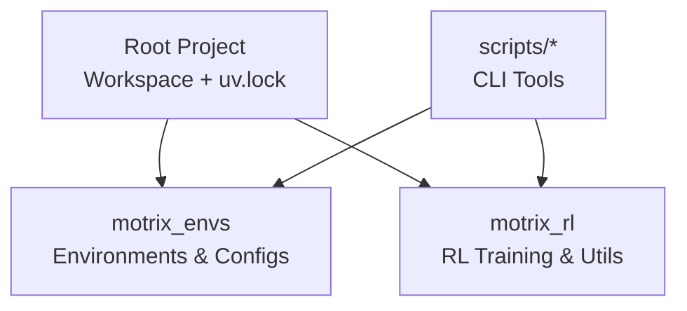
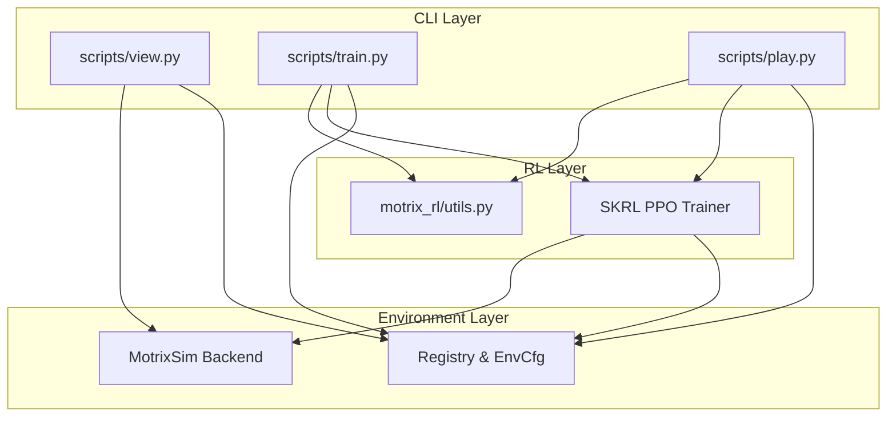
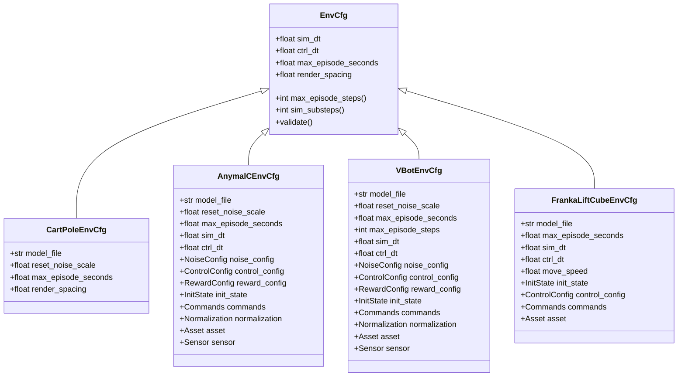
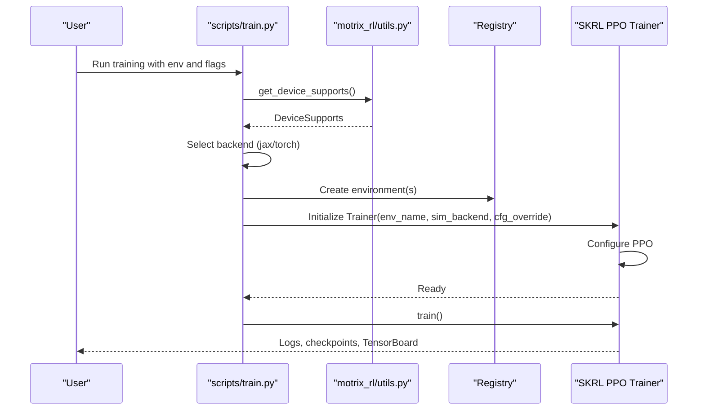
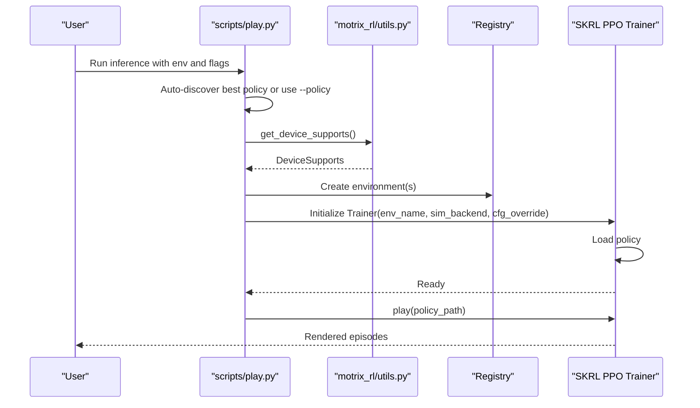
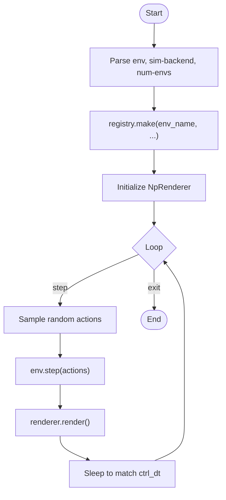
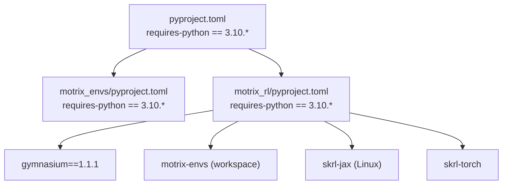

# Getting Started

<cite>
**Referenced Files in This Document**
- [README.md](file://README.md)
- [pyproject.toml](file://pyproject.toml)
- [motrix_envs/pyproject.toml](file://motrix_envs/pyproject.toml)
- [motrix_rl/pyproject.toml](file://motrix_rl/pyproject.toml)
- [installation.md](file://docs/source/en/user_guide/getting_started/installation.md)
- [hello_motrixlab.md](file://docs/source/en/user_guide/getting_started/hello_motrixlab.md)
- [scripts/train.py](file://scripts/train.py)
- [scripts/play.py](file://scripts/play.py)
- [scripts/view.py](file://scripts/view.py)
- [motrix_rl/src/motrix_rl/utils.py](file://motrix_rl/src/motrix_rl/utils.py)
- [motrix_envs/src/motrix_envs/base.py](file://motrix_envs/src/motrix_envs/base.py)
- [motrix_envs/src/motrix_envs/basic/cartpole/cfg.py](file://motrix_envs/src/motrix_envs/basic/cartpole/cfg.py)
- [motrix_envs/src/motrix_envs/locomotion/anymal_c/cfg.py](file://motrix_envs/src/motrix_envs/locomotion/anymal_c/cfg.py)
- [motrix_envs/src/motrix_envs/navigation/vbot/cfg.py](file://motrix_envs/src/motrix_envs/navigation/vbot/cfg.py)
- [motrix_envs/src/motrix_envs/manipulation/franka_lift_cube/cfg.py](file://motrix_envs/src/motrix_envs/manipulation/franka_lift_cube/cfg.py)
</cite>

## Table of Contents
1. [Introduction](#introduction)
2. [Project Structure](#project-structure)
3. [Core Components](#core-components)
4. [Architecture Overview](#architecture-overview)
5. [Detailed Component Analysis](#detailed-component-analysis)
6. [Dependency Analysis](#dependency-analysis)
7. [Performance Considerations](#performance-considerations)
8. [Troubleshooting Guide](#troubleshooting-guide)
9. [Conclusion](#conclusion)
10. [Appendices](#appendices)

## Introduction
MotrixLab-S1 is a reinforcement learning framework built on top of the MotrixSim simulation engine. It provides a unified interface for training and evaluating policies across diverse robotic tasks, including basic control, locomotion, navigation, and manipulation. The project is organized as a workspace with two primary packages:
- motrix_envs: Simulation environments and environment configuration definitions
- motrix_rl: Reinforcement learning training integrations and utilities

Key highlights:
- Unified RL training and evaluation interface
- Multi-backend support (JAX and PyTorch)
- Rich set of environments powered by MotrixSim
- Real-time visualization and TensorBoard integration

## Project Structure
The repository follows a workspace layout managed by uv. The root project metadata declares optional documentation dependencies and includes two member packages:
- motrix_envs: Environment definitions and configuration classes
- motrix_rl: RL training integrations and utilities

**Diagram sources**
- [pyproject.toml](file://pyproject.toml#L21-L22)

**Section sources**
- [pyproject.toml](file://pyproject.toml#L1-L29)

## Core Components
- Environment Registry and Configurations: Environments are registered via decorators and configured through dataclass-based configuration objects. These define model files, timing parameters, noise, controls, rewards, and sensors.
- RL Training Utilities: The RL package integrates with SKRL and supports PPO training across JAX and PyTorch backends. It includes automatic device detection and backend selection.
- CLI Tools: Standalone scripts provide environment preview, training, inference, and visualization workflows.

Prerequisites and package manager:
- Python 3.10.* is required across all packages.
- uv is the recommended package manager for dependency synchronization and environment management.

**Section sources**
- [motrix_envs/pyproject.toml](file://motrix_envs/pyproject.toml#L10-L10)
- [motrix_rl/pyproject.toml](file://motrix_rl/pyproject.toml#L10-L10)
- [pyproject.toml](file://pyproject.toml#L6-L6)
- [installation.md](file://docs/source/en/user_guide/getting_started/installation.md#L5-L11)

## Architecture Overview
The system orchestrates environment creation, simulation stepping, and RL training/inference through a clean separation of concerns:
- Environment layer: Defines physics models, timing, and reward shaping
- RL layer: Provides training and policy execution abstractions
- CLI layer: Exposes commands for preview, training, and evaluation

**Diagram sources**
- [scripts/view.py](file://scripts/view.py#L24-L26)
- [scripts/train.py](file://scripts/train.py#L26-L36)
- [scripts/play.py](file://scripts/play.py#L27-L36)
- [motrix_rl/src/motrix_rl/utils.py](file://motrix_rl/src/motrix_rl/utils.py#L19-L25)
- [motrix_envs/src/motrix_envs/base.py](file://motrix_envs/src/motrix_envs/base.py#L23-L51)

## Detailed Component Analysis

### Environment Configuration System
Environments are defined using dataclass configurations that encapsulate:
- Model file path
- Timing parameters (simulation dt, control dt, episode duration)
- Noise and control parameters
- Reward configuration
- Sensors and termination conditions

**Diagram sources**
- [motrix_envs/src/motrix_envs/base.py](file://motrix_envs/src/motrix_envs/base.py#L23-L51)
- [motrix_envs/src/motrix_envs/basic/cartpole/cfg.py](file://motrix_envs/src/motrix_envs/basic/cartpole/cfg.py#L25-L31)
- [motrix_envs/src/motrix_envs/locomotion/anymal_c/cfg.py](file://motrix_envs/src/motrix_envs/locomotion/anymal_c/cfg.py#L110-L128)
- [motrix_envs/src/motrix_envs/navigation/vbot/cfg.py](file://motrix_envs/src/motrix_envs/navigation/vbot/cfg.py#L118-L137)
- [motrix_envs/src/motrix_envs/manipulation/franka_lift_cube/cfg.py](file://motrix_envs/src/motrix_envs/manipulation/franka_lift_cube/cfg.py#L69-L83)

**Section sources**
- [motrix_envs/src/motrix_envs/base.py](file://motrix_envs/src/motrix_envs/base.py#L23-L51)
- [motrix_envs/src/motrix_envs/basic/cartpole/cfg.py](file://motrix_envs/src/motrix_envs/basic/cartpole/cfg.py#L25-L31)
- [motrix_envs/src/motrix_envs/locomotion/anymal_c/cfg.py](file://motrix_envs/src/motrix_envs/locomotion/anymal_c/cfg.py#L110-L128)
- [motrix_envs/src/motrix_envs/navigation/vbot/cfg.py](file://motrix_envs/src/motrix_envs/navigation/vbot/cfg.py#L118-L137)
- [motrix_envs/src/motrix_envs/manipulation/franka_lift_cube/cfg.py](file://motrix_envs/src/motrix_envs/manipulation/franka_lift_cube/cfg.py#L69-L83)

### Training Workflow
The training pipeline selects a backend (JAX or PyTorch) based on device availability, constructs the environment(s), and executes PPO training.

**Diagram sources**
- [scripts/train.py](file://scripts/train.py#L52-L90)
- [motrix_rl/src/motrix_rl/utils.py](file://motrix_rl/src/motrix_rl/utils.py#L39-L61)

**Section sources**
- [scripts/train.py](file://scripts/train.py#L52-L90)
- [motrix_rl/src/motrix_rl/utils.py](file://motrix_rl/src/motrix_rl/utils.py#L39-L61)

### Inference Workflow
The inference pipeline locates the best policy automatically or loads a specified policy, infers actions, and renders results.

**Diagram sources**
- [scripts/play.py](file://scripts/play.py#L110-L158)
- [motrix_rl/src/motrix_rl/utils.py](file://motrix_rl/src/motrix_rl/utils.py#L39-L61)

**Section sources**
- [scripts/play.py](file://scripts/play.py#L110-L158)
- [motrix_rl/src/motrix_rl/utils.py](file://motrix_rl/src/motrix_rl/utils.py#L39-L61)

### Environment Preview Workflow
The preview script creates an environment and renders a loop with random actions to validate the setup.

**Diagram sources**
- [scripts/view.py](file://scripts/view.py#L71-L78)

**Section sources**
- [scripts/view.py](file://scripts/view.py#L71-L78)

## Dependency Analysis
The project enforces Python 3.10 across all packages and uses uv extras to install either JAX (Linux only) or PyTorch backends. The RL package depends on gymnasium and the environment package.

**Diagram sources**
- [pyproject.toml](file://pyproject.toml#L6-L6)
- [motrix_envs/pyproject.toml](file://motrix_envs/pyproject.toml#L10-L10)
- [motrix_rl/pyproject.toml](file://motrix_rl/pyproject.toml#L10-L10)
- [motrix_rl/pyproject.toml](file://motrix_rl/pyproject.toml#L13-L13)
- [motrix_rl/pyproject.toml](file://motrix_rl/pyproject.toml#L15-L27)

**Section sources**
- [pyproject.toml](file://pyproject.toml#L6-L6)
- [motrix_envs/pyproject.toml](file://motrix_envs/pyproject.toml#L10-L10)
- [motrix_rl/pyproject.toml](file://motrix_rl/pyproject.toml#L10-L10)
- [motrix_rl/pyproject.toml](file://motrix_rl/pyproject.toml#L13-L13)
- [motrix_rl/pyproject.toml](file://motrix_rl/pyproject.toml#L15-L27)

## Performance Considerations
- Rendering during training significantly slows down execution; use the interactive toggle to enable/disable rendering as needed.
- Training backends are selected automatically based on device capabilities; JAX requires Linux with compatible GPU drivers.
- For large-scale experiments, adjust the number of environments and control frequency to balance throughput and fidelity.

[No sources needed since this section provides general guidance]

## Troubleshooting Guide

Common installation issues and resolutions:
- Python version mismatch: Ensure Python 3.10.* is installed and active in your environment.
- Package manager: Use uv for dependency synchronization and extra installations.
- Backend selection: On Linux, JAX can be enabled via the skrl-jax extra; PyTorch is available cross-platform via the skrl-torch extra.
- GPU availability: The system checks for CUDA availability for PyTorch and GPU backend for JAX; missing GPUs will fall back to CPU-only modes.

System requirements verification:
- Confirm Python 3.10.* is active.
- Verify uv installation and workspace sync.
- Validate environment preview runs without errors.

Environment validation steps:
- Use the preview script to visualize a simple environment (e.g., cartpole).
- Run a short training session and confirm logs and checkpoints are generated.
- Launch TensorBoard to inspect metrics.

**Section sources**
- [installation.md](file://docs/source/en/user_guide/getting_started/installation.md#L5-L11)
- [installation.md](file://docs/source/en/user_guide/getting_started/installation.md#L15-L27)
- [installation.md](file://docs/source/en/user_guide/getting_started/installation.md#L38-L55)
- [hello_motrixlab.md](file://docs/source/en/user_guide/getting_started/hello_motrixlab.md#L9-L13)
- [hello_motrixlab.md](file://docs/source/en/user_guide/getting_started/hello_motrixlab.md#L54-L60)
- [motrix_rl/src/motrix_rl/utils.py](file://motrix_rl/src/motrix_rl/utils.py#L39-L61)

## Conclusion
MotrixLab-S1 offers a streamlined path from installation to training and evaluation across a variety of robotic tasks. By adhering to the Python 3.10 requirement, using uv for dependency management, and leveraging the provided CLI tools, you can quickly validate your environment, run baseline training, and explore advanced scenarios.

[No sources needed since this section summarizes without analyzing specific files]

## Appendices

### Quick Start Workflow
- Install prerequisites and uv, then clone and sync dependencies.
- Preview an environment to validate setup.
- Train a model using the cartpole example.
- Visualize training with TensorBoard.
- Evaluate the trained policy automatically or manually.

**Section sources**
- [installation.md](file://docs/source/en/user_guide/getting_started/installation.md#L38-L55)
- [hello_motrixlab.md](file://docs/source/en/user_guide/getting_started/hello_motrixlab.md#L9-L13)
- [hello_motrixlab.md](file://docs/source/en/user_guide/getting_started/hello_motrixlab.md#L17-L28)
- [hello_motrixlab.md](file://docs/source/en/user_guide/getting_started/hello_motrixlab.md#L54-L60)
- [hello_motrixlab.md](file://docs/source/en/user_guide/getting_started/hello_motrixlab.md#L62-L74)

### Available Environments
- Basic control: cartpole
- Locomotion: anymal_c_locomotion_flat
- Navigation: vbot_navigation variants (flat, stairs, section-specific, long course)
- Manipulation: franka-lift-cube

**Section sources**
- [motrix_envs/src/motrix_envs/basic/cartpole/cfg.py](file://motrix_envs/src/motrix_envs/basic/cartpole/cfg.py#L25-L31)
- [motrix_envs/src/motrix_envs/locomotion/anymal_c/cfg.py](file://motrix_envs/src/motrix_envs/locomotion/anymal_c/cfg.py#L110-L128)
- [motrix_envs/src/motrix_envs/navigation/vbot/cfg.py](file://motrix_envs/src/motrix_envs/navigation/vbot/cfg.py#L118-L137)
- [motrix_envs/src/motrix_envs/manipulation/franka_lift_cube/cfg.py](file://motrix_envs/src/motrix_envs/manipulation/franka_lift_cube/cfg.py#L69-L83)