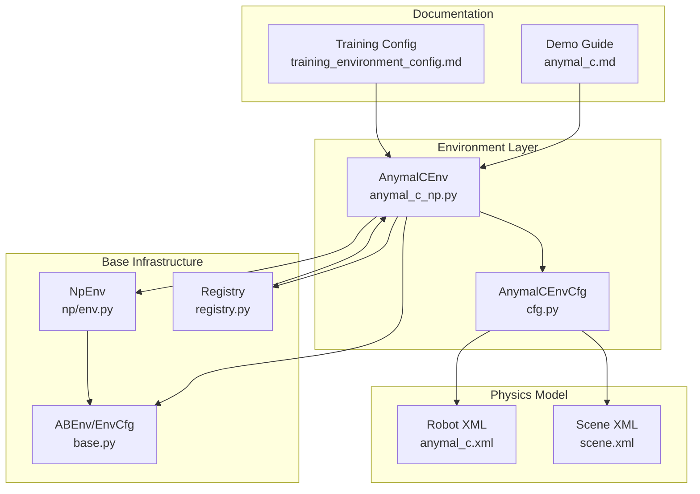
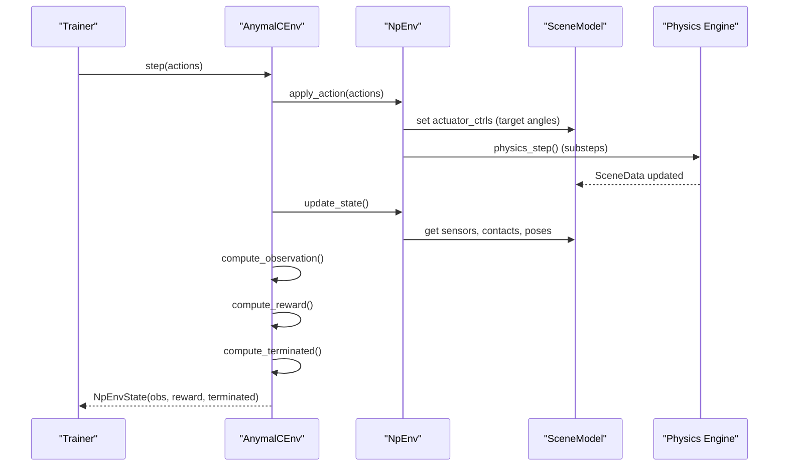
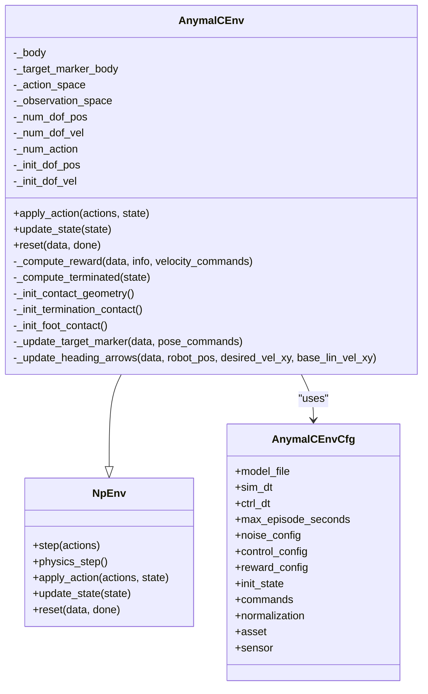
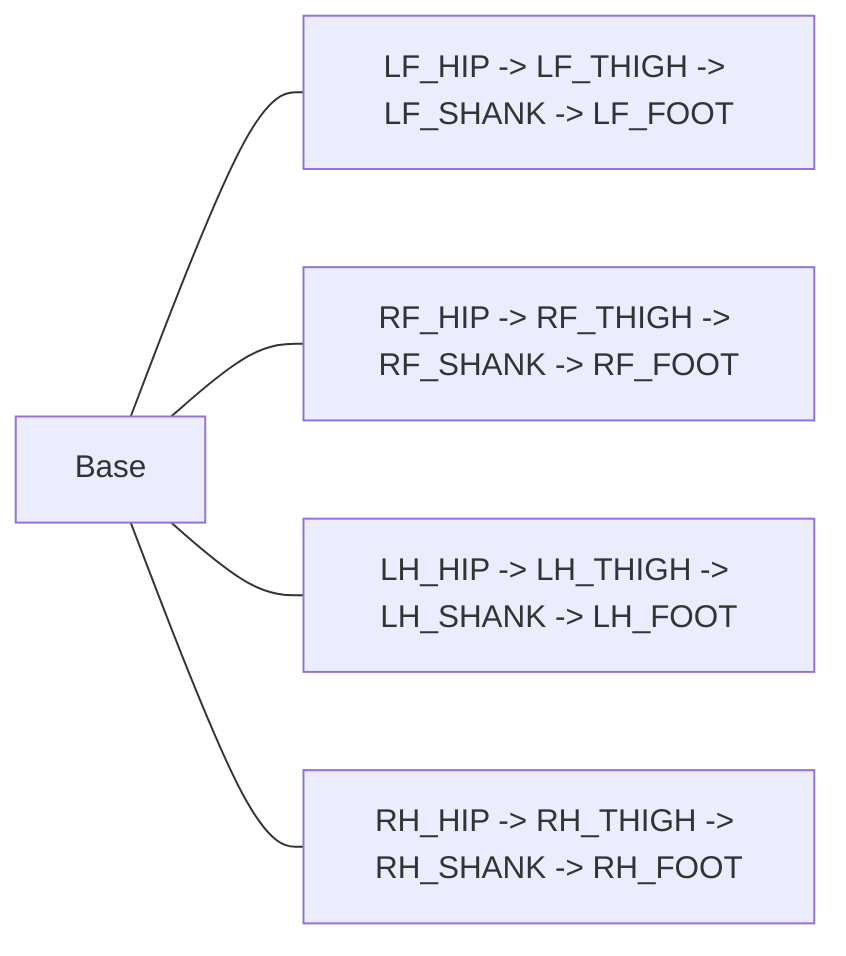
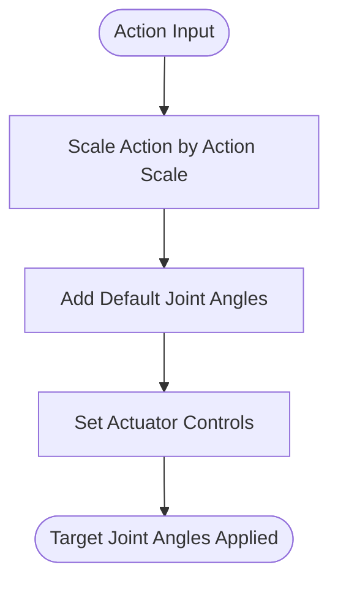
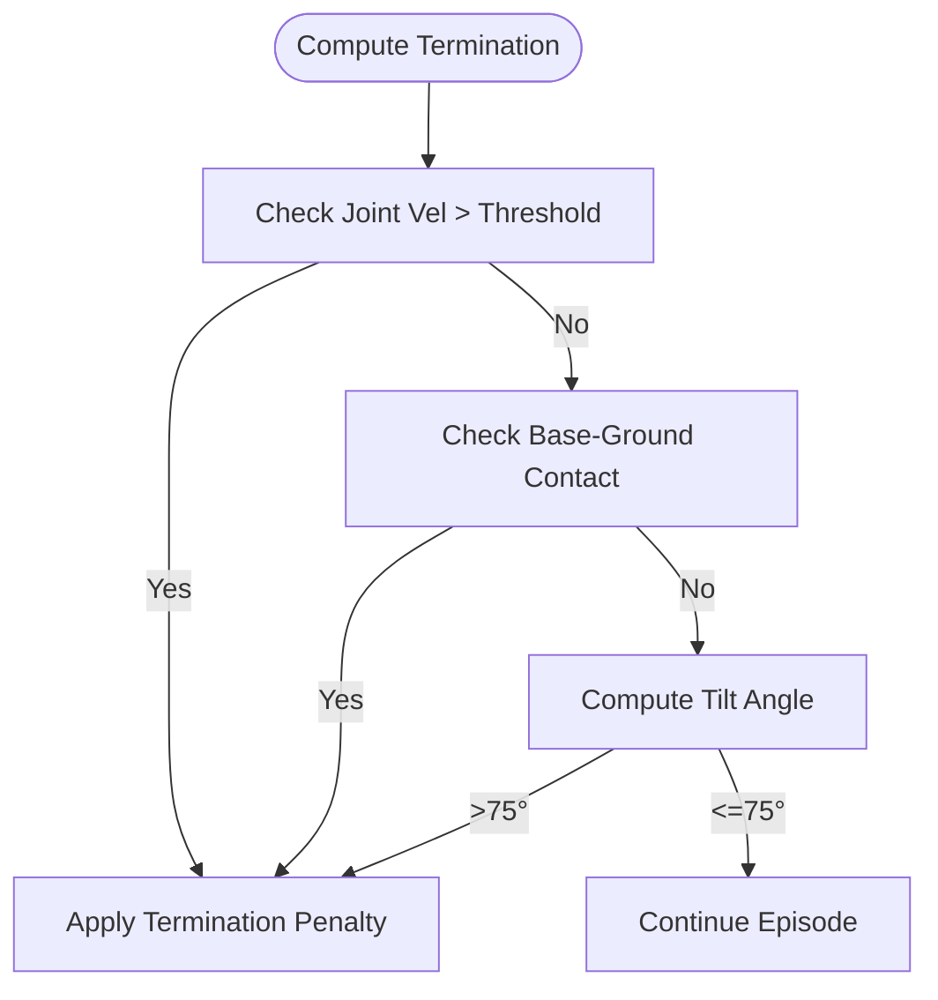
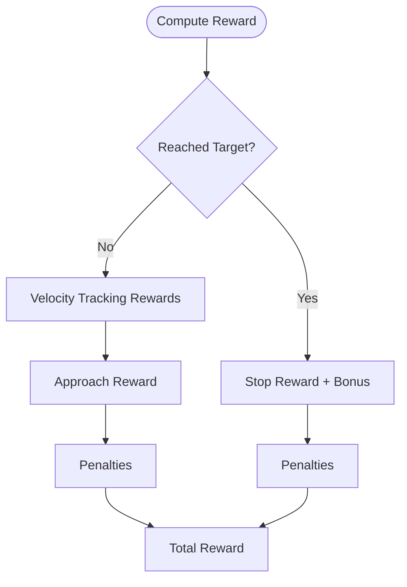
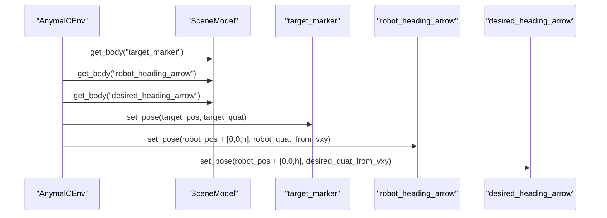
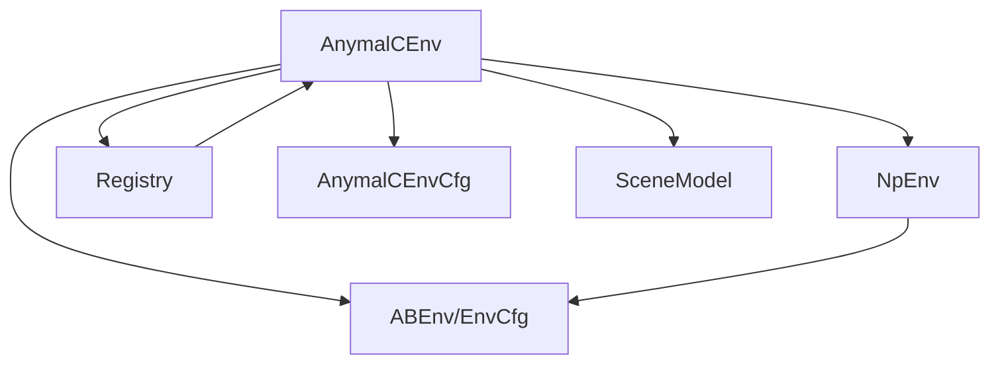

# ANYmal-C Quadruped Environments

<cite>
**Referenced Files in This Document**
- [anymal_c_np.py](file://motrix_envs/src/motrix_envs/locomotion/anymal_c/anymal_c_np.py)
- [cfg.py](file://motrix_envs/src/motrix_envs/locomotion/anymal_c/cfg.py)
- [anymal_c.xml](file://motrix_envs/src/motrix_envs/locomotion/anymal_c/xmls/anymal_c.xml)
- [scene.xml](file://motrix_envs/src/motrix_envs/locomotion/anymal_c/xmls/scene.xml)
- [env.py](file://motrix_envs/src/motrix_envs/np/env.py)
- [base.py](file://motrix_envs/src/motrix_envs/base.py)
- [registry.py](file://motrix_envs/src/motrix_envs/registry.py)
- [anymal_c.md](file://docs/source/en/user_guide/demo/anymal_c.md)
- [training_environment_config.md](file://docs/source/en/user_guide/tutorial/training_environment_config.md)
</cite>

## Table of Contents
1. [Introduction](#introduction)
2. [Project Structure](#project-structure)
3. [Core Components](#core-components)
4. [Architecture Overview](#architecture-overview)
5. [Detailed Component Analysis](#detailed-component-analysis)
6. [Dependency Analysis](#dependency-analysis)
7. [Performance Considerations](#performance-considerations)
8. [Troubleshooting Guide](#troubleshooting-guide)
9. [Conclusion](#conclusion)
10. [Appendices](#appendices)

## Introduction
This document provides a comprehensive technical and practical guide to the ANYmal-C quadruped locomotion environments in MotrixLab. It focuses on the AnymalCEnv class implementation, the underlying quadruped robot mechanics, 12-degree-of-freedom legged locomotion, and the position-based control system. It covers environment configuration (joint initialization, contact detection matrices, termination conditions), observation space composition (54 dimensions), reward function design (velocity tracking, orientation stability, arrival bonuses), visualization systems (target marker and heading arrows), training strategies, and the relationship between simulation parameters and real-world deployment.

## Project Structure
The ANYmal-C environment is organized as a modular component within the MotrixLab ecosystem:
- Environment class and configuration live under locomotion/anymal_c
- Physics model and scene definition are provided via MuJoCo XML files
- Base environment abstractions and registry enable flexible instantiation and backend selection
- Documentation provides detailed usage, configuration, and training guidance

**Diagram sources**
- [anymal_c_np.py](file://motrix_envs/src/motrix_envs/locomotion/anymal_c/anymal_c_np.py#L28-L657)
- [cfg.py](file://motrix_envs/src/motrix_envs/locomotion/anymal_c/cfg.py#L110-L129)
- [anymal_c.xml](file://motrix_envs/src/motrix_envs/locomotion/anymal_c/xmls/anymal_c.xml#L1-L392)
- [scene.xml](file://motrix_envs/src/motrix_envs/locomotion/anymal_c/xmls/scene.xml#L1-L26)
- [env.py](file://motrix_envs/src/motrix_envs/np/env.py#L52-L209)
- [base.py](file://motrix_envs/src/motrix_envs/base.py#L23-L85)
- [registry.py](file://motrix_envs/src/motrix_envs/registry.py#L114-L161)
- [anymal_c.md](file://docs/source/en/user_guide/demo/anymal_c.md#L1-L317)
- [training_environment_config.md](file://docs/source/en/user_guide/tutorial/training_environment_config.md#L1-L232)

**Section sources**
- [anymal_c_np.py](file://motrix_envs/src/motrix_envs/locomotion/anymal_c/anymal_c_np.py#L28-L657)
- [cfg.py](file://motrix_envs/src/motrix_envs/locomotion/anymal_c/cfg.py#L110-L129)
- [anymal_c.xml](file://motrix_envs/src/motrix_envs/locomotion/anymal_c/xmls/anymal_c.xml#L1-L392)
- [scene.xml](file://motrix_envs/src/motrix_envs/locomotion/anymal_c/xmls/scene.xml#L1-L26)
- [env.py](file://motrix_envs/src/motrix_envs/np/env.py#L52-L209)
- [base.py](file://motrix_envs/src/motrix_envs/base.py#L23-L85)
- [registry.py](file://motrix_envs/src/motrix_envs/registry.py#L114-L161)
- [anymal_c.md](file://docs/source/en/user_guide/demo/anymal_c.md#L1-L317)
- [training_environment_config.md](file://docs/source/en/user_guide/tutorial/training_environment_config.md#L1-L232)

## Core Components
- AnymalCEnv: Implements the navigation task environment for ANYmal-C, including position control, observation computation, reward shaping, termination logic, and visualization updates.
- AnymalCEnvCfg: Defines environment configuration including simulation timestep, control timestep, noise, control scaling, reward weights, normalization, asset and sensor names, and termination contact geometry.
- XML model: Defines the ANYmal-C robot structure, actuator types, sensor placement, collision exclusions, and scene visuals.
- Base infrastructure: NpEnv provides the stepping loop, state management, and physics integration; registry enables environment registration and instantiation.

Key implementation highlights:
- Position control mode: actions map to target joint angles via default posture offsets and action scaling.
- Observation space: 54-dimensional vector combining proprioception, joint states, action history, velocity commands, and task-related flags.
- Reward design: composite reward emphasizing velocity tracking, approach progress, orientation stability, and arrival bonuses; penalties for excessive joint velocities, base-ground contacts, rollover, z-velocity, xy angular velocity, torque, joint velocities, and action changes.
- Termination conditions: joint velocity limits, NaN/Inf checks, base-ground contact, and rollover thresholds.

**Section sources**
- [anymal_c_np.py](file://motrix_envs/src/motrix_envs/locomotion/anymal_c/anymal_c_np.py#L28-L657)
- [cfg.py](file://motrix_envs/src/motrix_envs/locomotion/anymal_c/cfg.py#L110-L129)
- [anymal_c.xml](file://motrix_envs/src/motrix_envs/locomotion/anymal_c/xmls/anymal_c.xml#L1-L392)
- [env.py](file://motrix_envs/src/motrix_envs/np/env.py#L52-L209)

## Architecture Overview
The environment integrates a MuJoCo-based physics model with a Python control loop. The control loop applies actions, advances physics, computes observations and rewards, and manages episode termination and resets.

**Diagram sources**
- [anymal_c_np.py](file://motrix_envs/src/motrix_envs/locomotion/anymal_c/anymal_c_np.py#L157-L279)
- [env.py](file://motrix_envs/src/motrix_envs/np/env.py#L186-L209)
- [anymal_c.xml](file://motrix_envs/src/motrix_envs/locomotion/anymal_c/xmls/anymal_c.xml#L373-L391)

## Detailed Component Analysis

### AnymalCEnv Class Implementation
AnymalCEnv inherits from NpEnv and implements the complete lifecycle of the environment:
- Initialization: sets up bodies, contact detection matrices, action and observation spaces, and default joint angles.
- Action application: converts normalized actions to target joint angles using default posture and action scaling.
- State update: extracts root pose/velocity, computes joint states, projects gravity, normalizes observations, calculates velocity commands from position/heading errors, and updates visualization markers.
- Reward computation: combines velocity tracking, approach progress, orientation stability, arrival bonuses, and penalties; applies termination penalties.
- Termination: checks joint velocity limits, NaN/Inf, base-ground contact, and rollover thresholds.
- Reset: randomizes robot initial position, generates target pose commands, initializes sensors and visualization.

**Diagram sources**
- [anymal_c_np.py](file://motrix_envs/src/motrix_envs/locomotion/anymal_c/anymal_c_np.py#L28-L657)
- [env.py](file://motrix_envs/src/motrix_envs/np/env.py#L52-L209)
- [cfg.py](file://motrix_envs/src/motrix_envs/locomotion/anymal_c/cfg.py#L110-L129)

**Section sources**
- [anymal_c_np.py](file://motrix_envs/src/motrix_envs/locomotion/anymal_c/anymal_c_np.py#L28-L657)

### Quadruped Robot Mechanics and 12-DoF Locomotion
- Robot structure: base with four legs, each leg has three joints (HAA, HFE, KFE), and spherical feet for ground contact.
- Actuation: position actuators with PD gains defined in XML; torque limits constrain actuator forces.
- Collision exclusions: prevent self-collision between base and thigh links.
- Sensors: base linear velocity and gyroscope measurements at IMU site.

**Diagram sources**
- [anymal_c.xml](file://motrix_envs/src/motrix_envs/locomotion/anymal_c/xmls/anymal_c.xml#L182-L349)

**Section sources**
- [anymal_c.xml](file://motrix_envs/src/motrix_envs/locomotion/anymal_c/xmls/anymal_c.xml#L1-L392)

### Position-Based Control System
- Control mode: position control with target joint angles computed from actions and default posture.
- Action scaling: configurable scaling factor determines the magnitude of posture deviations.
- Actuator mapping: 12 position actuators correspond to 12 joints (LF/RF/LH/RH pairs).

**Diagram sources**
- [anymal_c_np.py](file://motrix_envs/src/motrix_envs/locomotion/anymal_c/anymal_c_np.py#L157-L167)
- [anymal_c.xml](file://motrix_envs/src/motrix_envs/locomotion/anymal_c/xmls/anymal_c.xml#L378-L391)

**Section sources**
- [anymal_c_np.py](file://motrix_envs/src/motrix_envs/locomotion/anymal_c/anymal_c_np.py#L157-L167)
- [anymal_c.xml](file://motrix_envs/src/motrix_envs/locomotion/anymal_c/xmls/anymal_c.xml#L378-L391)

### Environment Configuration
- Simulation parameters: sim_dt, ctrl_dt, max_episode_seconds define timestep and episode duration.
- Noise configuration: scales for joint angle, joint velocity, gyro, gravity, and linear velocity.
- Control configuration: action_scale for position control.
- Reward configuration: scales for termination, position tracking, fine position tracking, and orientation.
- Initialization: default joint angles, initial position randomization range, and default base height.
- Commands: pose command ranges for target position offsets and absolute yaw.
- Normalization: coefficients for linear velocity, angular velocity, joint positions, and joint velocities.
- Assets and sensors: body name, foot names, termination contact geometry, and sensor names.

**Section sources**
- [cfg.py](file://motrix_envs/src/motrix_envs/locomotion/anymal_c/cfg.py#L25-L129)

### Contact Detection Matrices and Termination Conditions
- Termination contact matrix: detects collisions between base geometries and ground.
- Foot contact matrix: detects foot-ground contacts for gait monitoring.
- Termination conditions: joint velocity exceeding max_dof_vel, NaN/Inf, base-ground contact, and rollover (tilt angle > 75°).

**Diagram sources**
- [anymal_c_np.py](file://motrix_envs/src/motrix_envs/locomotion/anymal_c/anymal_c_np.py#L462-L492)
- [anymal_c_np.py](file://motrix_envs/src/motrix_envs/locomotion/anymal_c/anymal_c_np.py#L84-L131)

**Section sources**
- [anymal_c_np.py](file://motrix_envs/src/motrix_envs/locomotion/anymal_c/anymal_c_np.py#L84-L131)
- [anymal_c_np.py](file://motrix_envs/src/motrix_envs/locomotion/anymal_c/anymal_c_np.py#L462-L492)

### Observation Space Composition (54 Dimensions)
The observation vector includes:
- Proprioceptive state: base linear velocity, angular velocity, projected gravity, joint positions (relative to default), joint velocities.
- Action history: last actions.
- Velocity commands: desired XY linear velocity and desired yaw rate derived from position and heading errors.
- Task state: position error vector, orientation error, distance to target, arrival flag, stop ready flag.

Normalization coefficients and ranges are defined in configuration to stabilize training.

**Section sources**
- [anymal_c_np.py](file://motrix_envs/src/motrix_envs/locomotion/anymal_c/anymal_c_np.py#L42-L44)
- [anymal_c_np.py](file://motrix_envs/src/motrix_envs/locomotion/anymal_c/anymal_c_np.py#L224-L258)
- [anymal_c.md](file://docs/source/en/user_guide/demo/anymal_c.md#L91-L147)

### Reward Function Design
Rewards are computed differently before and after reaching the target:
- Before reaching:
  - Velocity tracking rewards for XY linear and yaw angular velocities.
  - Approach reward based on historical minimum distance improvement.
  - Penalties for z-velocity, xy angular velocity, torque, and action rate.
- After reaching:
  - Stop reward encouraging low velocity and angular velocity.
  - Zero angular velocity bonus when stable.
  - One-time arrival bonus for first-time completion.
  - Continued penalties for excessive velocities and torques.

Termination penalties are applied when joint velocities exceed limits, become invalid, base contacts ground, or rollover occurs.

**Diagram sources**
- [anymal_c_np.py](file://motrix_envs/src/motrix_envs/locomotion/anymal_c/anymal_c_np.py#L310-L448)

**Section sources**
- [anymal_c_np.py](file://motrix_envs/src/motrix_envs/locomotion/anymal_c/anymal_c_np.py#L310-L448)
- [anymal_c.md](file://docs/source/en/user_guide/demo/anymal_c.md#L149-L229)

### Target Marker and Heading Arrow Visualization
- Target marker: green arrow positioned at target pose (x, y, yaw) with adjustable height.
- Heading arrows: two mocap bodies above the robot indicate current (green) and desired (blue) movement directions based on actual and desired XY velocities.

**Diagram sources**
- [anymal_c_np.py](file://motrix_envs/src/motrix_envs/locomotion/anymal_c/anymal_c_np.py#L281-L309)
- [anymal_c_np.py](file://motrix_envs/src/motrix_envs/locomotion/anymal_c/anymal_c_np.py#L450-L461)
- [anymal_c.xml](file://motrix_envs/src/motrix_envs/locomotion/anymal_c/xmls/anymal_c.xml#L113-L121)
- [anymal_c.xml](file://motrix_envs/src/motrix_envs/locomotion/anymal_c/xmls/anymal_c.xml#L351-L363)

**Section sources**
- [anymal_c_np.py](file://motrix_envs/src/motrix_envs/locomotion/anymal_c/anymal_c_np.py#L281-L309)
- [anymal_c_np.py](file://motrix_envs/src/motrix_envs/locomotion/anymal_c/anymal_c_np.py#L450-L461)
- [anymal_c.xml](file://motrix_envs/src/motrix_envs/locomotion/anymal_c/xmls/anymal_c.xml#L113-L121)
- [anymal_c.xml](file://motrix_envs/src/motrix_envs/locomotion/anymal_c/xmls/anymal_c.xml#L351-L363)

### Training Strategies for Stable Quadrupedal Locomotion
- Action space: Box(-1.0, 1.0, (12,)) with position control mapping to target joint angles.
- Observation space: 54 dimensions including proprioception, joint states, action history, and task flags.
- Reward design: emphasizes velocity tracking, approach progress, orientation stability, and arrival bonuses; includes penalties to discourage excessive motion and instability.
- Termination: robust termination prevents numerical divergence and physical failures.
- Configuration: use PPO with backend-specific tuning and environment-specific parameters.

**Section sources**
- [anymal_c.md](file://docs/source/en/user_guide/demo/anymal_c.md#L50-L90)
- [anymal_c.md](file://docs/source/en/user_guide/demo/anymal_c.md#L149-L229)
- [training_environment_config.md](file://docs/source/en/user_guide/tutorial/training_environment_config.md#L1-L232)

### Relationship Between Simulation Parameters and Real-World Deployment
- Simulation timestep and control timestep define fidelity and computational cost trade-offs.
- PD gains and torque limits approximate real actuator characteristics.
- Sensor noise and normalization coefficients help generalize policies to noisy real-world measurements.
- Termination conditions protect against unstable or unsafe behaviors, mirroring safety requirements for real robots.

**Section sources**
- [cfg.py](file://motrix_envs/src/motrix_envs/locomotion/anymal_c/cfg.py#L110-L129)
- [anymal_c.xml](file://motrix_envs/src/motrix_envs/locomotion/anymal_c/xmls/anymal_c.xml#L26-L28)
- [anymal_c.xml](file://motrix_envs/src/motrix_envs/locomotion/anymal_c/xmls/anymal_c.xml#L378-L391)
- [anymal_c.md](file://docs/source/en/user_guide/demo/anymal_c.md#L231-L282)

## Dependency Analysis
The environment depends on:
- MuJoCo scene model for physics simulation and sensor readings.
- NpEnv for stepping, state management, and physics integration.
- Registry for environment registration and instantiation.
- Configuration classes for environment parameters.

**Diagram sources**
- [anymal_c_np.py](file://motrix_envs/src/motrix_envs/locomotion/anymal_c/anymal_c_np.py#L28-L657)
- [env.py](file://motrix_envs/src/motrix_envs/np/env.py#L52-L209)
- [base.py](file://motrix_envs/src/motrix_envs/base.py#L23-L85)
- [registry.py](file://motrix_envs/src/motrix_envs/registry.py#L114-L161)

**Section sources**
- [registry.py](file://motrix_envs/src/motrix_envs/registry.py#L114-L161)
- [env.py](file://motrix_envs/src/motrix_envs/np/env.py#L52-L209)

## Performance Considerations
- Simulation substeps: controlled by sim_dt and ctrl_dt; higher substeps improve accuracy but increase compute cost.
- Observation normalization: reduces training variance and accelerates convergence.
- Reward shaping: balances exploration and exploitation while preventing unstable behaviors.
- Termination safeguards: prevent numerical blow-ups and reduce wasted samples on failed episodes.

[No sources needed since this section provides general guidance]

## Troubleshooting Guide
Common issues and remedies:
- Excessive joint velocities or NaN/Inf: adjust action scaling and ensure safe control limits; review PD gains and torque limits.
- Base-ground contact or rollover: re-evaluate initialization and reward penalties; consider increasing stabilization rewards.
- Poor convergence: tune reward weights, normalization coefficients, and training hyperparameters; verify observation correctness.

**Section sources**
- [anymal_c_np.py](file://motrix_envs/src/motrix_envs/locomotion/anymal_c/anymal_c_np.py#L310-L448)
- [anymal_c_np.py](file://motrix_envs/src/motrix_envs/locomotion/anymal_c/anymal_c_np.py#L462-L492)
- [anymal_c.md](file://docs/source/en/user_guide/demo/anymal_c.md#L284-L317)

## Conclusion
The ANYmal-C environment provides a robust, configurable platform for training quadrupedal navigation policies. Its position-based control, comprehensive observation space, and carefully designed reward and termination mechanisms enable stable learning and transferable skills. Proper configuration of simulation parameters, reward shaping, and training hyperparameters yields efficient and reliable policy development aligned with real-world deployment constraints.

[No sources needed since this section summarizes without analyzing specific files]

## Appendices

### Environment Registration and Instantiation
- Registration decorators bind environment configurations to environment classes and simulation backends.
- make() creates environment instances with validated configurations and selected backends.

**Section sources**
- [registry.py](file://motrix_envs/src/motrix_envs/registry.py#L114-L161)

### Base Environment Abstractions
- ABEnv defines the interface for environments.
- EnvCfg encapsulates environment configuration with validation and derived properties.

**Section sources**
- [base.py](file://motrix_envs/src/motrix_envs/base.py#L23-L85)