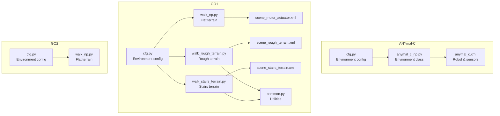
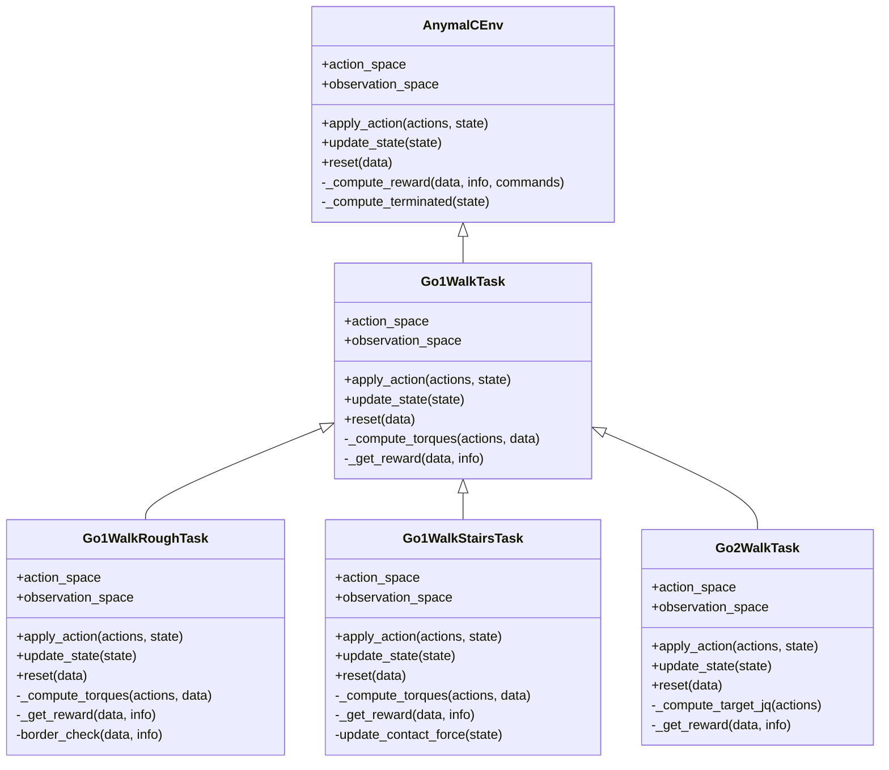
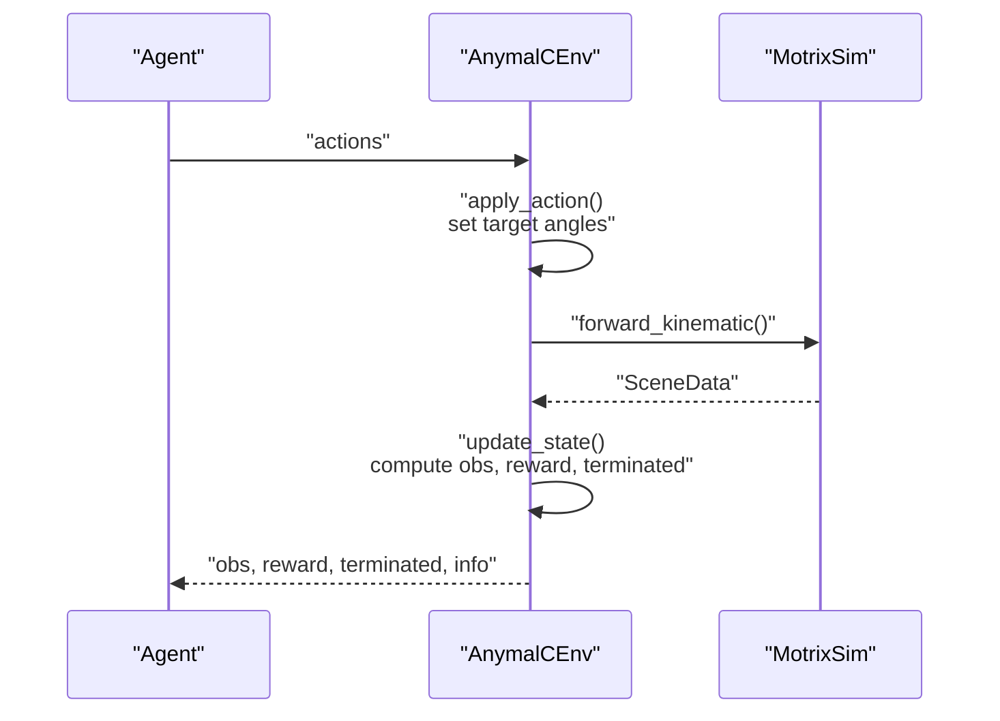
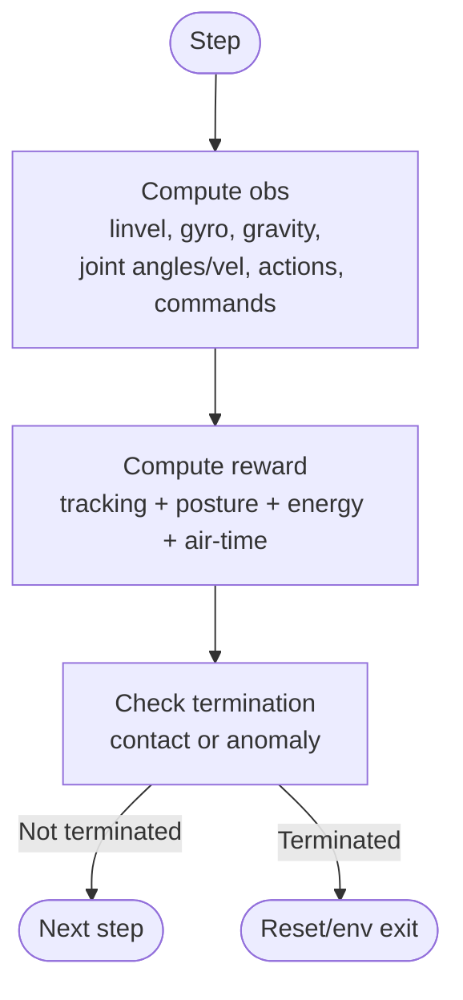
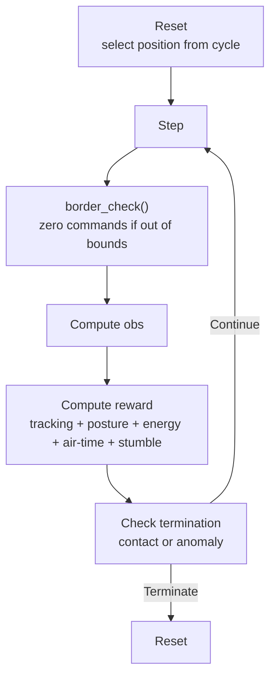
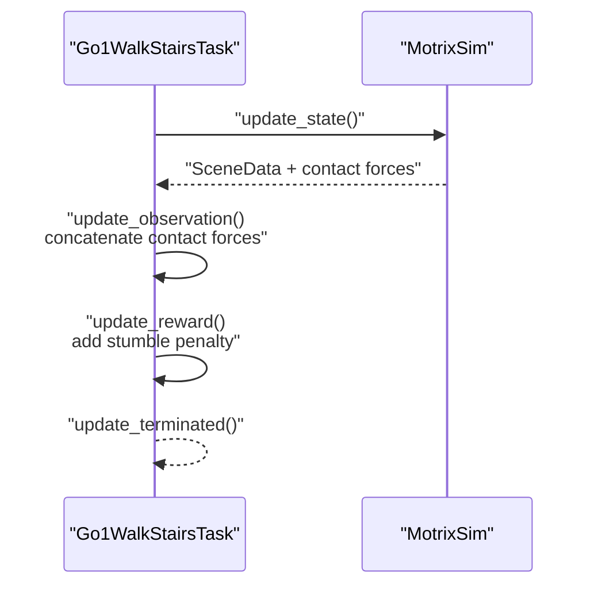
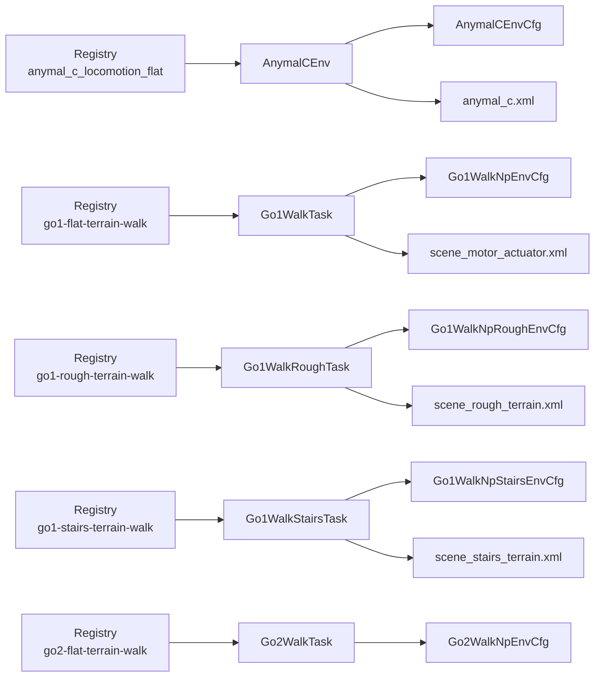

# Locomotion Environments

<cite>
**Referenced Files in This Document**
- [anymal_c/__init__.py](file://motrix_envs/src/motrix_envs/locomotion/anymal_c/__init__.py)
- [anymal_c/cfg.py](file://motrix_envs/src/motrix_envs/locomotion/anymal_c/cfg.py)
- [anymal_c/anymal_c_np.py](file://motrix_envs/src/motrix_envs/locomotion/anymal_c/anymal_c_np.py)
- [go1/__init__.py](file://motrix_envs/src/motrix_envs/locomotion/go1/__init__.py)
- [go1/cfg.py](file://motrix_envs/src/motrix_envs/locomotion/go1/cfg.py)
- [go1/common.py](file://motrix_envs/src/motrix_envs/locomotion/go1/common.py)
- [go1/walk_np.py](file://motrix_envs/src/motrix_envs/locomotion/go1/walk_np.py)
- [go1/walk_rough_terrain.py](file://motrix_envs/src/motrix_envs/locomotion/go1/walk_rough_terrain.py)
- [go1/walk_stairs_terrain.py](file://motrix_envs/src/motrix_envs/locomotion/go1/walk_stairs_terrain.py)
- [go2/walk_np.py](file://motrix_envs/src/motrix_envs/locomotion/go2/walk_np.py)
- [anymal_c.md](file://docs/source/en/user_guide/demo/anymal_c.md)
- [locomotion_unitree_go1.md](file://docs/source/en/user_guide/demo/locomotion_unitree_go1.md)
- [locomotion_unitree_go1_rough_terrain.md](file://docs/source/en/user_guide/demo/locomotion_unitree_go1_rough_terrain.md)
- [anymal_c.xml](file://motrix_envs/src/motrix_envs/locomotion/anymal_c/xmls/anymal_c.xml)
- [scene_motor_actuator.xml](file://motrix_envs/src/motrix_envs/locomotion/go1/xmls/scene_motor_actuator.xml)
- [scene_rough_terrain.xml](file://motrix_envs/src/motrix_envs/locomotion/go1/xmls/scene_rough_terrain.xml)
- [scene_stairs_terrain.xml](file://motrix_envs/src/motrix_envs/locomotion/go1/xmls/scene_stairs_terrain.xml)
</cite>

## Table of Contents
1. [Introduction](#introduction)
2. [Project Structure](#project-structure)
3. [Core Components](#core-components)
4. [Architecture Overview](#architecture-overview)
5. [Detailed Component Analysis](#detailed-component-analysis)
6. [Dependency Analysis](#dependency-analysis)
7. [Performance Considerations](#performance-considerations)
8. [Troubleshooting Guide](#troubleshooting-guide)
9. [Conclusion](#conclusion)
10. [Appendices](#appendices)

## Introduction
This document provides comprehensive coverage of locomotion environments for quadruped and bipedal robots in the MotrixLab-S1 codebase. It focuses on:
- ANYmal-C quadruped walking on flat terrain
- Unitree GO1 quadruped walking on flat, rough, and stairs terrains
- Unitree GO2 bipedal walking on flat terrain

It explains mechanical models, gait patterns, terrain adaptation, configuration parameters for robot dynamics and ground contact, reward shaping for stable locomotion, training strategies, and the relationship between simulation fidelity and real-world deployment with transfer learning considerations.

## Project Structure
The locomotion environments are organized under the motrix_envs package with modular components for configuration, environment classes, and XML scene definitions:
- ANYmal-C: configuration and environment class under locomotion/anymal_c
- GO1: configuration, environment classes, and terrain-specific scenes under locomotion/go1
- GO2: configuration and environment class under locomotion/go2
- Documentation under docs/source/en/user_guide/demo

**Diagram sources**
- [anymal_c/cfg.py](file://motrix_envs/src/motrix_envs/locomotion/anymal_c/cfg.py#L110-L129)
- [anymal_c/anymal_c_np.py](file://motrix_envs/src/motrix_envs/locomotion/anymal_c/anymal_c_np.py#L28-L657)
- [anymal_c/xmls/anymal_c.xml](file://motrix_envs/src/motrix_envs/locomotion/anymal_c/xmls/anymal_c.xml#L1-L392)
- [go1/cfg.py](file://motrix_envs/src/motrix_envs/locomotion/go1/cfg.py#L122-L188)
- [go1/walk_np.py](file://motrix_envs/src/motrix_envs/locomotion/go1/walk_np.py#L26-L387)
- [go1/walk_rough_terrain.py](file://motrix_envs/src/motrix_envs/locomotion/go1/walk_rough_terrain.py#L28-L438)
- [go1/walk_stairs_terrain.py](file://motrix_envs/src/motrix_envs/locomotion/go1/walk_stairs_terrain.py#L28-L445)
- [go1/xmls/scene_motor_actuator.xml](file://motrix_envs/src/motrix_envs/locomotion/go1/xmls/scene_motor_actuator.xml#L1-L60)
- [go1/xmls/scene_rough_terrain.xml](file://motrix_envs/src/motrix_envs/locomotion/go1/xmls/scene_rough_terrain.xml#L1-L26)
- [go1/xmls/scene_stairs_terrain.xml](file://motrix_envs/src/motrix_envs/locomotion/go1/xmls/scene_stairs_terrain.xml#L1-L32)
- [go2/walk_np.py](file://motrix_envs/src/motrix_envs/locomotion/go2/walk_np.py#L57-L410)

**Section sources**
- [anymal_c/__init__.py](file://motrix_envs/src/motrix_envs/locomotion/anymal_c/__init__.py#L16-L19)
- [go1/__init__.py](file://motrix_envs/src/motrix_envs/locomotion/go1/__init__.py#L16-L17)

## Core Components
- ANYmal-C flat terrain environment
  - Position-control action space with PD actuation
  - Observations include base linear/angular velocity, projected gravity, joint angles/velocities, action history, and task state
  - Reward emphasizes velocity tracking, approach progress, orientation stability, and post-reach stopping
  - Termination on joint velocity limits, base-ground contact, or severe rollover
- GO1 flat terrain environment
  - PD torque computation from position targets; 12 DOF
  - Observation includes local linear velocity, gyro, local gravity, joint angles/velocities, actions, and commands
  - Reward balances speed tracking, posture stability, energy efficiency, and air-time reward for strides
- GO1 rough terrain environment
  - Height-field terrain with three discrete height levels; position cycling across 25 presets
  - Reward includes stumble penalty; termination on abnormal velocities
- GO1 stairs terrain environment
  - Height-field stairs with contact-force sensors on feet; 60-dim observation
  - Reward includes stumble penalty; termination on abnormal velocities
- GO2 flat terrain environment
  - Position-control target setting without PD controller inside environment
  - Observation similar to GO1 but simpler actuation mapping

Key configuration parameters:
- NoiseConfig: sensor noise scaling for joint angles, velocities, gyro, gravity, and linear velocity
- ControlConfig: stiffness/damping and action scaling for PD control (GO1/GO2) or action scale for position targets (ANYmal-C)
- InitState: default joint angles and positional randomization ranges
- Commands: velocity/command ranges and pose command ranges
- Normalization: scaling factors for observations
- Asset: body/foot/ground names and termination contact geometry
- Sensor: sensor names for base/local measurements
- RewardConfig: per-reward weights and sigma parameters

**Section sources**
- [anymal_c/cfg.py](file://motrix_envs/src/motrix_envs/locomotion/anymal_c/cfg.py#L25-L129)
- [go1/cfg.py](file://motrix_envs/src/motrix_envs/locomotion/go1/cfg.py#L23-L188)
- [go2/walk_np.py](file://motrix_envs/src/motrix_envs/locomotion/go2/walk_np.py#L115-L186)

## Architecture Overview
The environments follow a consistent design:
- Registry registration for environment names and backends
- Environment classes inherit from a common NpEnv base
- Model loading via XML scene files
- Contact queries for termination and contact sensing
- Reward computation and termination checks

**Diagram sources**
- [anymal_c/anymal_c_np.py](file://motrix_envs/src/motrix_envs/locomotion/anymal_c/anymal_c_np.py#L28-L657)
- [go1/walk_np.py](file://motrix_envs/src/motrix_envs/locomotion/go1/walk_np.py#L26-L387)
- [go1/walk_rough_terrain.py](file://motrix_envs/src/motrix_envs/locomotion/go1/walk_rough_terrain.py#L28-L438)
- [go1/walk_stairs_terrain.py](file://motrix_envs/src/motrix_envs/locomotion/go1/walk_stairs_terrain.py#L28-L445)
- [go2/walk_np.py](file://motrix_envs/src/motrix_envs/locomotion/go2/walk_np.py#L57-L410)

## Detailed Component Analysis

### ANYmal-C Flat Terrain Environment
- Mechanical model
  - Four-legged robot with HAA/HFE/KFE joints per leg and spherical feet
  - PD position actuators with kp/kv and torque limits defined in XML
- Gait pattern
  - Position control mode: actions map to target joint angles relative to default posture
  - PD gains from XML drive the actuators toward targets
- Observations
  - Base linear velocity, gyro, projected gravity, joint angles/velocities, last actions, velocity commands, task state (position error, heading error, distance, arrival flags)
- Reward
  - Pre-arrival: velocity tracking rewards (linear/angular), approach reward, penalties for z-velocity, xy angular velocity, torques, action rate
  - Post-arrival: stop reward, zero-angular reward, first-arrival bonus, penalties retained
  - Termination penalties for excessive DOF velocity, base-ground contact, rollover
- Termination
  - Episode timeout, joint velocity anomaly, base-ground contact, rollover (>75° tilt)

**Diagram sources**
- [anymal_c/anymal_c_np.py](file://motrix_envs/src/motrix_envs/locomotion/anymal_c/anymal_c_np.py#L157-L279)
- [anymal_c/xmls/anymal_c.xml](file://motrix_envs/src/motrix_envs/locomotion/anymal_c/xmls/anymal_c.xml#L26-L28)

**Section sources**
- [anymal_c/cfg.py](file://motrix_envs/src/motrix_envs/locomotion/anymal_c/cfg.py#L110-L129)
- [anymal_c/anymal_c_np.py](file://motrix_envs/src/motrix_envs/locomotion/anymal_c/anymal_c_np.py#L28-L657)
- [anymal_c.md](file://docs/source/en/user_guide/demo/anymal_c.md#L1-L317)
- [anymal_c/xmls/anymal_c.xml](file://motrix_envs/src/motrix_envs/locomotion/anymal_c/xmls/anymal_c.xml#L1-L392)

### GO1 Flat Terrain Environment
- Mechanical model
  - 12 DOF quadruped with hip/thigh/calf joints per leg
  - PD controller computes torques from position targets
- Gait pattern
  - Position control with PD feedback; default joint angles define stance posture
- Observations
  - Local linear velocity, gyro, local gravity, joint angles/velocities, last actions, velocity commands
- Reward
  - Tracking rewards (linear/angular), posture stability, energy efficiency (torques), joint acceleration, action rate, hip/calf position preferences, feet-air-time reward
- Termination
  - Trunk-ground contact or other unstable states

**Diagram sources**
- [go1/walk_np.py](file://motrix_envs/src/motrix_envs/locomotion/go1/walk_np.py#L182-L286)

**Section sources**
- [go1/cfg.py](file://motrix_envs/src/motrix_envs/locomotion/go1/cfg.py#L122-L137)
- [go1/walk_np.py](file://motrix_envs/src/motrix_envs/locomotion/go1/walk_np.py#L26-L387)
- [locomotion_unitree_go1.md](file://docs/source/en/user_guide/demo/locomotion_unitree_go1.md#L1-L120)
- [scene_motor_actuator.xml](file://motrix_envs/src/motrix_envs/locomotion/go1/xmls/scene_motor_actuator.xml#L1-L60)

### GO1 Rough Terrain Environment
- Terrain
  - Height-field with three height levels (-2.5m, 0.5m, 2.0m)
  - Position cycling across 25 preset locations; training level progression based on average reward
- Observations
  - Same as flat terrain (48-dim)
- Reward
  - Same as flat terrain plus stumble penalty (lateral contact forces exceeding normal)
- Termination
  - Trunk-ground contact or extreme velocity anomaly

**Diagram sources**
- [go1/walk_rough_terrain.py](file://motrix_envs/src/motrix_envs/locomotion/go1/walk_rough_terrain.py#L304-L330)
- [go1/walk_rough_terrain.py](file://motrix_envs/src/motrix_envs/locomotion/go1/walk_rough_terrain.py#L432-L438)

**Section sources**
- [go1/cfg.py](file://motrix_envs/src/motrix_envs/locomotion/go1/cfg.py#L139-L144)
- [go1/walk_rough_terrain.py](file://motrix_envs/src/motrix_envs/locomotion/go1/walk_rough_terrain.py#L28-L438)
- [scene_rough_terrain.xml](file://motrix_envs/src/motrix_envs/locomotion/go1/xmls/scene_rough_terrain.xml#L1-L26)
- [locomotion_unitree_go1_rough_terrain.md](file://docs/source/en/user_guide/demo/locomotion_unitree_go1_rough_terrain.md#L1-L203)

### GO1 Stairs Terrain Environment
- Terrain
  - Height-field stairs; floor at variable elevation
- Observations
  - 60-dim: includes 12-dim foot contact force vectors (Fx,Fy,Fz per foot)
- Reward
  - Same as flat terrain plus stumble penalty
- Termination
  - Trunk-ground contact or extreme velocity anomaly

**Diagram sources**
- [go1/walk_stairs_terrain.py](file://motrix_envs/src/motrix_envs/locomotion/go1/walk_stairs_terrain.py#L242-L252)
- [go1/walk_stairs_terrain.py](file://motrix_envs/src/motrix_envs/locomotion/go1/walk_stairs_terrain.py#L273-L282)
- [scene_stairs_terrain.xml](file://motrix_envs/src/motrix_envs/locomotion/go1/xmls/scene_stairs_terrain.xml#L25-L30)

**Section sources**
- [go1/cfg.py](file://motrix_envs/src/motrix_envs/locomotion/go1/cfg.py#L146-L188)
- [go1/walk_stairs_terrain.py](file://motrix_envs/src/motrix_envs/locomotion/go1/walk_stairs_terrain.py#L28-L445)
- [scene_stairs_terrain.xml](file://motrix_envs/src/motrix_envs/locomotion/go1/xmls/scene_stairs_terrain.xml#L1-L32)
- [locomotion_unitree_go1_rough_terrain.md](file://docs/source/en/user_guide/demo/locomotion_unitree_go1_rough_terrain.md#L70-L82)

### GO2 Flat Terrain Environment
- Mechanical model
  - Bipedal robot with 12 DOF (two legs); default posture defined in configuration
- Gait pattern
  - Position-control target setting; no internal PD controller in environment
- Observations
  - Local linear velocity, gyro, local gravity, joint angles/velocities, last actions, velocity commands
- Reward
  - Tracking rewards, posture stability, energy efficiency, joint acceleration, action rate, hip/calf position preferences, feet-air-time reward

**Section sources**
- [go2/walk_np.py](file://motrix_envs/src/motrix_envs/locomotion/go2/walk_np.py#L57-L410)

## Dependency Analysis
- Environment registration
  - ANYmal-C registers under "anymal_c_locomotion_flat"
  - GO1 registers under "go1-flat-terrain-walk", "go1-rough-terrain-walk", "go1-stairs-terrain-walk"
  - GO2 registers under "go2-flat-terrain-walk"
- XML scene dependencies
  - ANYmal-C uses robot definition and sensors
  - GO1 scenes include floor plane, optional height fields, and contact sensors for stairs
- Internal dependencies
  - Environments depend on configuration classes for parameters
  - Contact queries and termination matrices computed from asset/geometry names
  - Reward computation depends on sensor readings and kinematic quantities

**Diagram sources**
- [anymal_c/__init__.py](file://motrix_envs/src/motrix_envs/locomotion/anymal_c/__init__.py#L16-L19)
- [go1/__init__.py](file://motrix_envs/src/motrix_envs/locomotion/go1/__init__.py#L16-L17)
- [anymal_c/cfg.py](file://motrix_envs/src/motrix_envs/locomotion/anymal_c/cfg.py#L110-L129)
- [go1/cfg.py](file://motrix_envs/src/motrix_envs/locomotion/go1/cfg.py#L122-L188)
- [anymal_c/xmls/anymal_c.xml](file://motrix_envs/src/motrix_envs/locomotion/anymal_c/xmls/anymal_c.xml#L1-L392)
- [go1/xmls/scene_motor_actuator.xml](file://motrix_envs/src/motrix_envs/locomotion/go1/xmls/scene_motor_actuator.xml#L1-L60)
- [go1/xmls/scene_rough_terrain.xml](file://motrix_envs/src/motrix_envs/locomotion/go1/xmls/scene_rough_terrain.xml#L1-L26)
- [go1/xmls/scene_stairs_terrain.xml](file://motrix_envs/src/motrix_envs/locomotion/go1/xmls/scene_stairs_terrain.xml#L1-L32)

**Section sources**
- [anymal_c/__init__.py](file://motrix_envs/src/motrix_envs/locomotion/anymal_c/__init__.py#L16-L19)
- [go1/__init__.py](file://motrix_envs/src/motrix_envs/locomotion/go1/__init__.py#L16-L17)

## Performance Considerations
- Simulation fidelity vs. real-world deployment
  - Physics parameters (friction, inertia, contact models) in XML influence stability and realism
  - Sensor noise configuration affects robustness to perception errors
  - PD gains and torque limits impact dynamic response and safety margins
- Training efficiency
  - Reward shaping accelerates learning (e.g., air-time reward encourages stride length)
  - Terrain complexity increases sample efficiency but may require curriculum learning
  - Contact queries and reward computations dominate per-step cost; vectorization via batched environments improves throughput
- Generalization
  - Randomized initial positions and commands improve generalization
  - Curriculum terrains (flat → rough → stairs) facilitate skill acquisition

[No sources needed since this section provides general guidance]

## Troubleshooting Guide
Common issues and remedies:
- Numerical instabilities
  - Symptoms: NaN/Inf velocities, extreme accelerations
  - Checks: DOF velocity thresholds and anomaly detection in termination logic
  - Remedy: Reduce action scale, increase damping, clip actions
- Falls or rollovers
  - Symptoms: Base-ground contact or tilt angle >75°
  - Checks: Termination contact matrices and projected gravity tilt
  - Remedy: Adjust reward weights for posture, reduce command amplitudes, improve initialization
- Poor terrain adaptation
  - Symptoms: Frequent stumbling or loss of contact
  - Checks: Contact sensors and stumble penalties; height-field resolution
  - Remedy: Increase contact force thresholds, adjust stumble penalty, refine terrain generation
- Slow convergence
  - Symptoms: Low reward or stalled metrics
  - Checks: Reward scaling, action smoothing, curriculum progression
  - Remedy: Tune reward weights, reduce action rate penalty, introduce staged difficulty

**Section sources**
- [anymal_c/anymal_c_np.py](file://motrix_envs/src/motrix_envs/locomotion/anymal_c/anymal_c_np.py#L462-L492)
- [go1/walk_rough_terrain.py](file://motrix_envs/src/motrix_envs/locomotion/go1/walk_rough_terrain.py#L251-L262)
- [go1/walk_stairs_terrain.py](file://motrix_envs/src/motrix_envs/locomotion/go1/walk_stairs_terrain.py#L254-L265)

## Conclusion
The MotrixLab-S1 locomotion environments provide a cohesive framework for training quadruped and bipedal robots across varied terrains. By combining realistic mechanical models, carefully tuned reward functions, and progressively challenging environments, agents learn stable gaits and effective terrain adaptation. Configuration parameters enable fine-tuning for simulation fidelity and transfer readiness to real robots.

[No sources needed since this section summarizes without analyzing specific files]

## Appendices

### Configuration Parameters Reference
- NoiseConfig
  - level, scale_joint_angle, scale_joint_vel, scale_gyro, scale_gravity, scale_linvel
- ControlConfig (GO1/GO2)
  - stiffness [N·m/rad], damping [N·m·s/rad], action_scale
- ControlConfig (ANYmal-C)
  - action_scale
- InitState
  - pos, pos_randomization_range, default_joint_angles
- Commands
  - pose_command_range (ANYmal-C), vel_limit (GO1)
- Normalization
  - lin_vel, ang_vel, dof_pos, dof_vel
- Asset
  - body_name, foot_names (ANYmal-C), foot_name, ground_name, penalize_contacts_on, terminate_after_contacts_on
- Sensor
  - base_linvel/base_gyro (ANYmal-C), local_linvel/gyro/feet (GO1)
- RewardConfig
  - scales (weights), tracking_sigma, max_foot_height (ANYmal-C), max_foot_height (GO1 stairs)

**Section sources**
- [anymal_c/cfg.py](file://motrix_envs/src/motrix_envs/locomotion/anymal_c/cfg.py#L25-L129)
- [go1/cfg.py](file://motrix_envs/src/motrix_envs/locomotion/go1/cfg.py#L23-L188)