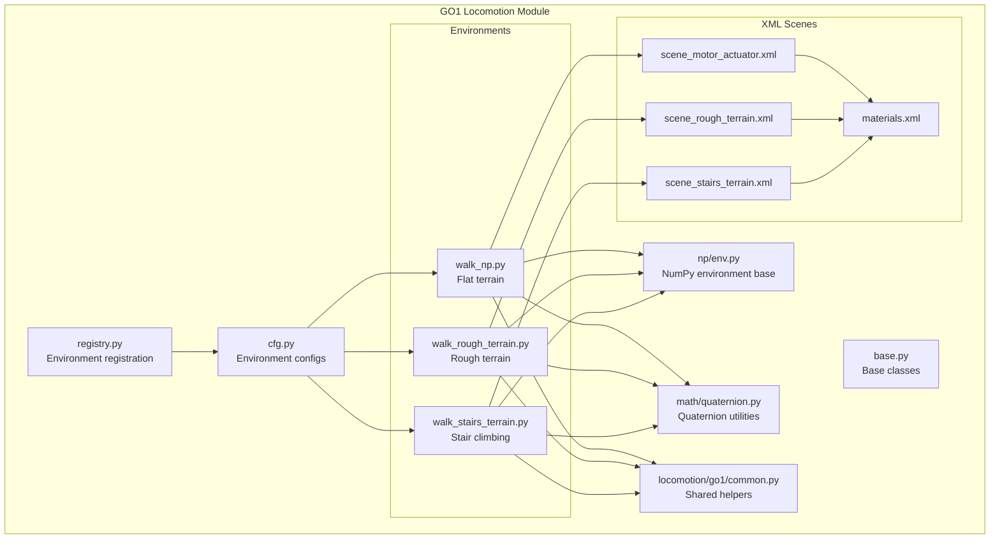
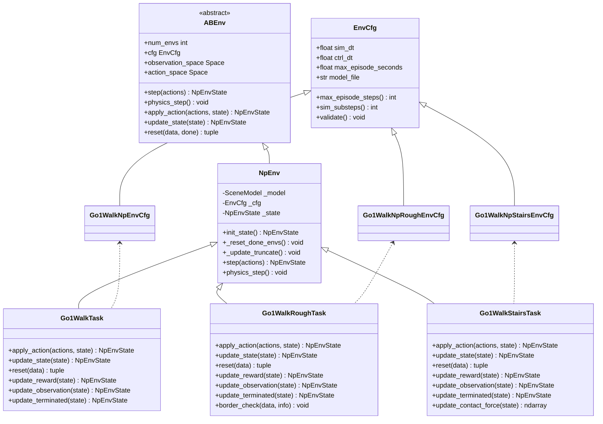
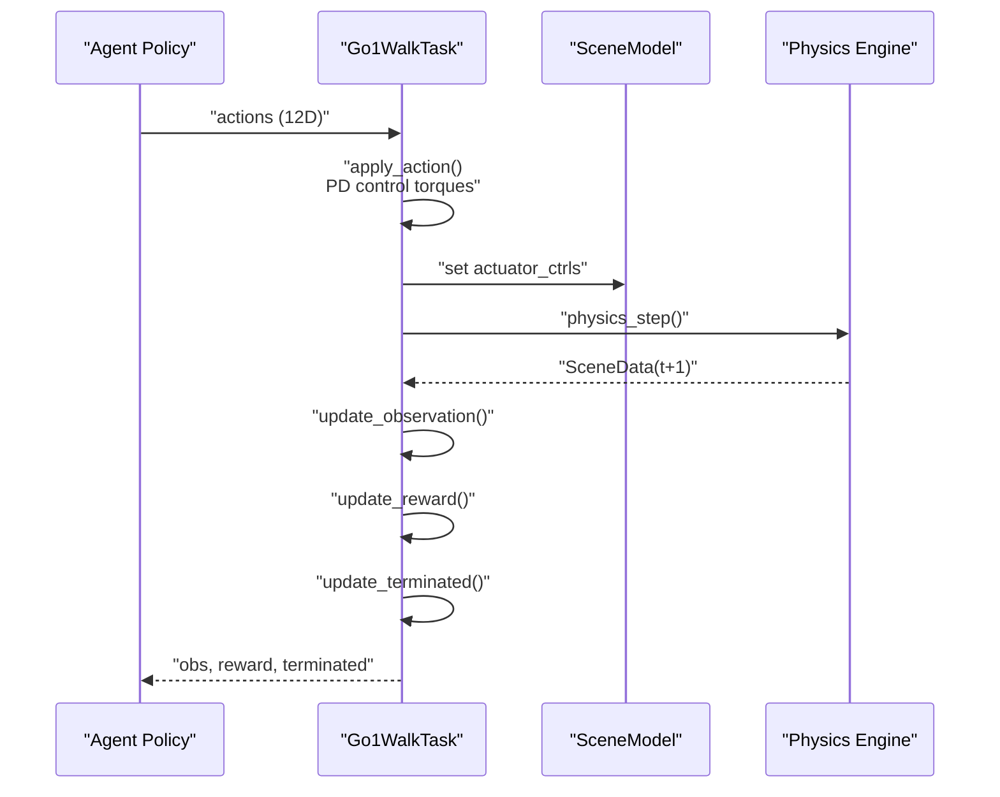
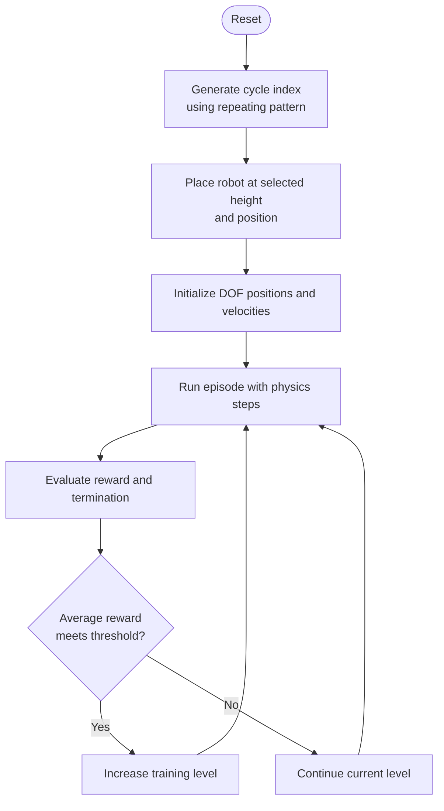
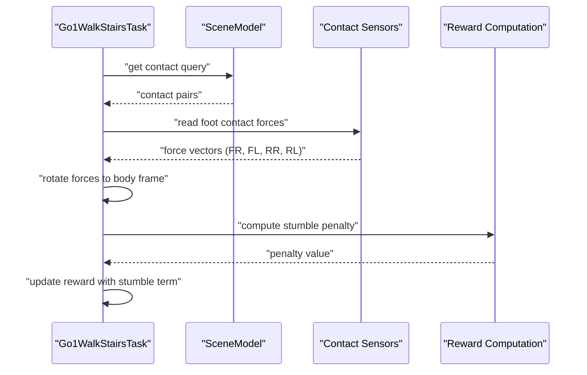
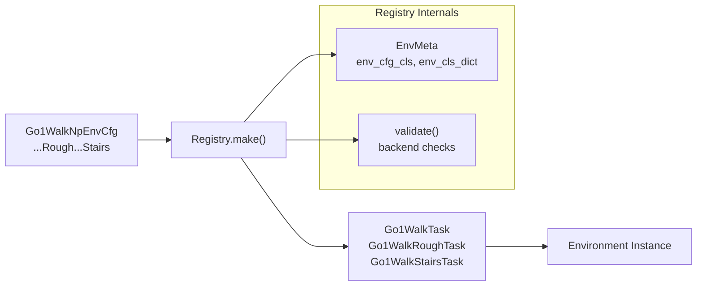
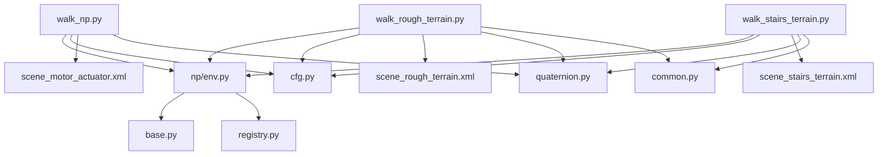

# Unitree GO1 Bipedal Walking Environments

<cite>
**Referenced Files in This Document**
- [__init__.py](file://motrix_envs/src/motrix_envs/locomotion/go1/__init__.py)
- [cfg.py](file://motrix_envs/src/motrix_envs/locomotion/go1/cfg.py)
- [common.py](file://motrix_envs/src/motrix_envs/locomotion/go1/common.py)
- [walk_np.py](file://motrix_envs/src/motrix_envs/locomotion/go1/walk_np.py)
- [walk_rough_terrain.py](file://motrix_envs/src/motrix_envs/locomotion/go1/walk_rough_terrain.py)
- [walk_stairs_terrain.py](file://motrix_envs/src/motrix_envs/locomotion/go1/walk_stairs_terrain.py)
- [scene_motor_actuator.xml](file://motrix_envs/src/motrix_envs/locomotion/go1/xmls/scene_motor_actuator.xml)
- [scene_rough_terrain.xml](file://motrix_envs/src/motrix_envs/locomotion/go1/xmls/scene_rough_terrain.xml)
- [scene_stairs_terrain.xml](file://motrix_envs/src/motrix_envs/locomotion/go1/xmls/scene_stairs_terrain.xml)
- [materials.xml](file://motrix_envs/src/motrix_envs/locomotion/go1/xmls/materials.xml)
- [env.py](file://motrix_envs/src/motrix_envs/np/env.py)
- [base.py](file://motrix_envs/src/motrix_envs/base.py)
- [registry.py](file://motrix_envs/src/motrix_envs/registry.py)
- [quaternion.py](file://motrix_envs/src/motrix_envs/math/quaternion.py)
- [locomotion_unitree_go1.md](file://docs/source/en/user_guide/demo/locomotion_unitree_go1.md)
- [locomotion_unitree_go1_rough_terrain.md](file://docs/source/en/user_guide/demo/locomotion_unitree_go1_rough_terrain.md)
</cite>

## Table of Contents
1. [Introduction](#introduction)
2. [Project Structure](#project-structure)
3. [Core Components](#core-components)
4. [Architecture Overview](#architecture-overview)
5. [Detailed Component Analysis](#detailed-component-analysis)
6. [Dependency Analysis](#dependency-analysis)
7. [Performance Considerations](#performance-considerations)
8. [Troubleshooting Guide](#troubleshooting-guide)
9. [Conclusion](#conclusion)
10. [Appendices](#appendices)

## Introduction
This document provides comprehensive coverage of the Unitree GO1 bipedal walking environments implemented in the repository. It focuses on three terrain variants: flat terrain, rough terrain, and stair climbing. The documentation explains the bipedal locomotion mechanics, the 12-degree-of-freedom leg configuration, dynamic balance control systems, terrain adaptation mechanisms, environment configurations, reward shaping, training methodologies, and performance comparisons. It also outlines generalization strategies for real-world deployment.

## Project Structure
The GO1 locomotion environments are organized under the locomotion module with separate implementations for each terrain variant. The structure integrates configuration classes, environment implementations, XML scene definitions, and shared utilities.

**Diagram sources**
- [__init__.py](file://motrix_envs/src/motrix_envs/locomotion/go1/__init__.py#L16-L16)
- [cfg.py](file://motrix_envs/src/motrix_envs/locomotion/go1/cfg.py#L122-L187)
- [walk_np.py](file://motrix_envs/src/motrix_envs/locomotion/go1/walk_np.py#L26-L387)
- [walk_rough_terrain.py](file://motrix_envs/src/motrix_envs/locomotion/go1/walk_rough_terrain.py#L28-L438)
- [walk_stairs_terrain.py](file://motrix_envs/src/motrix_envs/locomotion/go1/walk_stairs_terrain.py#L28-L445)
- [scene_motor_actuator.xml](file://motrix_envs/src/motrix_envs/locomotion/go1/xmls/scene_motor_actuator.xml#L1-L60)
- [scene_rough_terrain.xml](file://motrix_envs/src/motrix_envs/locomotion/go1/xmls/scene_rough_terrain.xml#L1-L26)
- [scene_stairs_terrain.xml](file://motrix_envs/src/motrix_envs/locomotion/go1/xmls/scene_stairs_terrain.xml#L1-L32)
- [materials.xml](file://motrix_envs/src/motrix_envs/locomotion/go1/xmls/materials.xml#L1-L7)
- [env.py](file://motrix_envs/src/motrix_envs/np/env.py#L52-L209)
- [base.py](file://motrix_envs/src/motrix_envs/base.py#L23-L85)
- [registry.py](file://motrix_envs/src/motrix_envs/registry.py#L24-L172)
- [quaternion.py](file://motrix_envs/src/motrix_envs/math/quaternion.py#L18-L151)
- [common.py](file://motrix_envs/src/motrix_envs/locomotion/go1/common.py#L19-L50)

**Section sources**
- [__init__.py](file://motrix_envs/src/motrix_envs/locomotion/go1/__init__.py#L16-L16)
- [registry.py](file://motrix_envs/src/motrix_envs/registry.py#L114-L161)

## Core Components
- Environment configuration classes define simulation parameters, control gains, reward scales, initialization states, and sensor/asset definitions for each terrain variant.
- Environment implementations encapsulate observation construction, PD control, reward computation, termination logic, and terrain-specific adaptations.
- XML scenes configure physics materials, ground contact models, friction parameters, and terrain geometry for flat, rough, and stair scenarios.
- Shared utilities provide quaternion operations and helper functions for terrain generation.

Key implementation references:
- Flat terrain environment configuration and implementation
- Rough terrain environment configuration and implementation with height-field terrain
- Stair climbing environment configuration and implementation with contact sensors and stumble penalty
- Base environment class and registry for environment creation and validation

**Section sources**
- [cfg.py](file://motrix_envs/src/motrix_envs/locomotion/go1/cfg.py#L23-L187)
- [walk_np.py](file://motrix_envs/src/motrix_envs/locomotion/go1/walk_np.py#L26-L387)
- [walk_rough_terrain.py](file://motrix_envs/src/motrix_envs/locomotion/go1/walk_rough_terrain.py#L28-L438)
- [walk_stairs_terrain.py](file://motrix_envs/src/motrix_envs/locomotion/go1/walk_stairs_terrain.py#L28-L445)
- [env.py](file://motrix_envs/src/motrix_envs/np/env.py#L52-L209)
- [registry.py](file://motrix_envs/src/motrix_envs/registry.py#L114-L161)

## Architecture Overview
The environments follow a layered architecture:
- Registry and base classes manage environment registration, configuration validation, and simulation stepping.
- Environment classes inherit from a NumPy-based environment base, implementing PD control, observation extraction, reward shaping, and termination conditions.
- XML scenes define physics properties, ground contact models, and terrain geometry.
- Utilities provide mathematical operations for orientation and coordinate transformations.

**Diagram sources**
- [base.py](file://motrix_envs/src/motrix_envs/base.py#L23-L85)
- [env.py](file://motrix_envs/src/motrix_envs/np/env.py#L52-L209)
- [walk_np.py](file://motrix_envs/src/motrix_envs/locomotion/go1/walk_np.py#L26-L387)
- [walk_rough_terrain.py](file://motrix_envs/src/motrix_envs/locomotion/go1/walk_rough_terrain.py#L28-L438)
- [walk_stairs_terrain.py](file://motrix_envs/src/motrix_envs/locomotion/go1/walk_stairs_terrain.py#L28-L445)
- [cfg.py](file://motrix_envs/src/motrix_envs/locomotion/go1/cfg.py#L122-L187)

## Detailed Component Analysis

### Flat Terrain Environment
The flat terrain environment provides a baseline bipedal walking scenario with a planar ground surface and standard friction parameters.

- Physics configuration:
  - Ground plane with friction configured in the scene XML.
  - Materials asset defines texture and repeat parameters for visual consistency.
- Environment configuration:
  - Control gains, action scaling, and reward scales tailored for stable bipedal walking.
  - Observation space includes linear velocity, angular velocity, gravity direction, joint angles/velocities, last actions, and velocity commands.
- Implementation highlights:
  - PD controller computes torques from desired joint positions derived from actions.
  - Reward function emphasizes velocity tracking, orientation stability, energy efficiency, and action smoothness.
  - Termination occurs on unintended body-ground contacts.

**Diagram sources**
- [walk_np.py](file://motrix_envs/src/motrix_envs/locomotion/go1/walk_np.py#L160-L186)
- [env.py](file://motrix_envs/src/motrix_envs/np/env.py#L186-L208)

**Section sources**
- [scene_motor_actuator.xml](file://motrix_envs/src/motrix_envs/locomotion/go1/xmls/scene_motor_actuator.xml#L20-L25)
- [materials.xml](file://motrix_envs/src/motrix_envs/locomotion/go1/xmls/materials.xml#L1-L7)
- [cfg.py](file://motrix_envs/src/motrix_envs/locomotion/go1/cfg.py#L122-L137)
- [walk_np.py](file://motrix_envs/src/motrix_envs/locomotion/go1/walk_np.py#L160-L387)

### Rough Terrain Environment
The rough terrain environment introduces height-field terrain with multiple elevation levels and adaptive training difficulty.

- Terrain modeling:
  - Height field asset defines uneven surfaces with configurable size and amplitude.
  - Friction parameters maintained for realistic contact dynamics.
- Environment configuration:
  - Reduced command velocity limits compared to flat terrain.
  - Reward scales emphasize stability and stumble prevention.
- Implementation specifics:
  - Repeating pattern generator creates cyclic position sequences across 25 preset locations.
  - Adaptive training level increases difficulty when performance thresholds are met.
  - Border checking prevents agents from leaving the terrain boundaries.

**Diagram sources**
- [walk_rough_terrain.py](file://motrix_envs/src/motrix_envs/locomotion/go1/walk_rough_terrain.py#L304-L330)
- [common.py](file://motrix_envs/src/motrix_envs/locomotion/go1/common.py#L19-L50)

**Section sources**
- [scene_rough_terrain.xml](file://motrix_envs/src/motrix_envs/locomotion/go1/xmls/scene_rough_terrain.xml#L15-L25)
- [cfg.py](file://motrix_envs/src/motrix_envs/locomotion/go1/cfg.py#L139-L144)
- [walk_rough_terrain.py](file://motrix_envs/src/motrix_envs/locomotion/go1/walk_rough_terrain.py#L28-L438)

### Stair Climbing Environment
The stair climbing environment models step-based terrain with contact sensors to detect footholds and prevent stumbling.

- Terrain modeling:
  - Height field asset representing stair-like structures with varying step heights.
  - Contact sensors for each foot to measure normal forces and detect lateral impacts.
- Environment configuration:
  - Extended observation space to include foot contact forces.
  - Additional reward term penalizes stumbling (lateral contact forces exceeding normal force thresholds).
  - Tightened command velocity limits suitable for stair navigation.
- Implementation specifics:
  - Contact force vectors are rotated into the body frame for consistent reward computation.
  - Periodic position cycling ensures diverse stair configurations across episodes.

**Diagram sources**
- [walk_stairs_terrain.py](file://motrix_envs/src/motrix_envs/locomotion/go1/walk_stairs_terrain.py#L242-L283)
- [quaternion.py](file://motrix_envs/src/motrix_envs/math/quaternion.py#L72-L98)

**Section sources**
- [scene_stairs_terrain.xml](file://motrix_envs/src/motrix_envs/locomotion/go1/xmls/scene_stairs_terrain.xml#L15-L32)
- [cfg.py](file://motrix_envs/src/motrix_envs/locomotion/go1/cfg.py#L146-L187)
- [walk_stairs_terrain.py](file://motrix_envs/src/motrix_envs/locomotion/go1/walk_stairs_terrain.py#L28-L445)

### Environment Configuration and Registration
Environment configurations are defined via dataclass decorators and registered with the registry. The registry validates configurations, selects simulation backends, and instantiates environment instances.

- Configuration classes:
  - Define simulation timestep, control timestep, model file path, noise parameters, control gains, reward scales, initialization states, and normalization constants.
- Registration:
  - Environment classes are decorated with registry entries linking environment names to their implementations.
  - The registry supports multiple simulation backends; currently "np" is supported.

**Diagram sources**
- [cfg.py](file://motrix_envs/src/motrix_envs/locomotion/go1/cfg.py#L122-L187)
- [registry.py](file://motrix_envs/src/motrix_envs/registry.py#L114-L161)

**Section sources**
- [cfg.py](file://motrix_envs/src/motrix_envs/locomotion/go1/cfg.py#L23-L187)
- [registry.py](file://motrix_envs/src/motrix_envs/registry.py#L24-L172)

## Dependency Analysis
The environments depend on shared utilities and base classes, with terrain-specific XML configurations. Dependencies are intentionally decoupled to enable easy extension and modification.

**Diagram sources**
- [walk_np.py](file://motrix_envs/src/motrix_envs/locomotion/go1/walk_np.py#L20-L24)
- [walk_rough_terrain.py](file://motrix_envs/src/motrix_envs/locomotion/go1/walk_rough_terrain.py#L20-L26)
- [walk_stairs_terrain.py](file://motrix_envs/src/motrix_envs/locomotion/go1/walk_stairs_terrain.py#L20-L26)
- [env.py](file://motrix_envs/src/motrix_envs/np/env.py#L20-L24)
- [base.py](file://motrix_envs/src/motrix_envs/base.py#L16-L24)
- [registry.py](file://motrix_envs/src/motrix_envs/registry.py#L16-L20)
- [quaternion.py](file://motrix_envs/src/motrix_envs/math/quaternion.py#L15-L16)
- [common.py](file://motrix_envs/src/motrix_envs/locomotion/go1/common.py#L16-L17)

**Section sources**
- [walk_np.py](file://motrix_envs/src/motrix_envs/locomotion/go1/walk_np.py#L20-L24)
- [walk_rough_terrain.py](file://motrix_envs/src/motrix_envs/locomotion/go1/walk_rough_terrain.py#L20-L26)
- [walk_stairs_terrain.py](file://motrix_envs/src/motrix_envs/locomotion/go1/walk_stairs_terrain.py#L20-L26)
- [env.py](file://motrix_envs/src/motrix_envs/np/env.py#L20-L24)

## Performance Considerations
- Simulation fidelity vs. speed:
  - Simulation timestep and control timestep are configured to balance accuracy and speed.
  - Substepping is computed from the ratio of control to simulation timestep.
- Vectorized environments:
  - Batch processing across multiple environments improves throughput; ensure observation/reward computations remain vectorized.
- Reward shaping:
  - Properly scaled penalties and rewards guide stable learning without excessive oscillation.
- Terrain complexity:
  - Rough and stair terrains increase computational load due to contact queries and potential stumble penalties.

[No sources needed since this section provides general guidance]

## Troubleshooting Guide
Common issues and resolutions:
- Excessive termination due to velocity anomalies:
  - Termination condition includes a velocity threshold check; ensure commands are reasonable and observations are normalized.
- Stumbling on stairs:
  - Verify contact sensors are properly defined and stumble penalty is active; adjust reward scales if needed.
- Training instability:
  - Reduce action scaling or increase damping gains; validate reward clipping and normalization factors.

**Section sources**
- [walk_rough_terrain.py](file://motrix_envs/src/motrix_envs/locomotion/go1/walk_rough_terrain.py#L251-L262)
- [walk_stairs_terrain.py](file://motrix_envs/src/motrix_envs/locomotion/go1/walk_stairs_terrain.py#L254-L265)

## Conclusion
The Unitree GO1 bipedal walking environments provide a robust foundation for training stable locomotion across varied terrains. The modular design enables straightforward extensions and adaptations. By leveraging PD control, carefully crafted reward functions, and terrain-specific configurations, agents can learn efficient and balanced walking behaviors suitable for real-world deployment.

[No sources needed since this section summarizes without analyzing specific files]

## Appendices

### Environment Names and Descriptions
- go1-flat-terrain-walk: Baseline bipedal walking on flat terrain.
- go1-rough-terrain-walk: Walking on uneven height-field terrain with adaptive difficulty.
- go1-stairs-terrain-walk: Stair climbing with contact sensors and stumble penalty.

**Section sources**
- [registry.py](file://motrix_envs/src/motrix_envs/registry.py#L114-L161)
- [cfg.py](file://motrix_envs/src/motrix_envs/locomotion/go1/cfg.py#L122-L187)

### Observation Space Composition
- Flat terrain: 48-dimensional observation combining body-frame linear/angular velocities, gravity direction, joint angles/velocities, last actions, and velocity commands.
- Stairs terrain: Extended to 60 dimensions by adding foot contact force vectors for each foot.

**Section sources**
- [walk_np.py](file://motrix_envs/src/motrix_envs/locomotion/go1/walk_np.py#L48-L71)
- [walk_stairs_terrain.py](file://motrix_envs/src/motrix_envs/locomotion/go1/walk_stairs_terrain.py#L59-L71)

### Reward Shaping Guidelines
- Velocity tracking: Encourage accurate tracking of commanded linear and angular velocities.
- Stability: Penalize excessive base accelerations, torques, and orientation deviations.
- Energy efficiency: Include torque and acceleration penalties.
- Terrain adaptation: Add stumble penalty for stair navigation; adjust scales for rough terrain.

**Section sources**
- [cfg.py](file://motrix_envs/src/motrix_envs/locomotion/go1/cfg.py#L96-L120)
- [walk_rough_terrain.py](file://motrix_envs/src/motrix_envs/locomotion/go1/walk_rough_terrain.py#L332-L352)
- [walk_stairs_terrain.py](file://motrix_envs/src/motrix_envs/locomotion/go1/walk_stairs_terrain.py#L337-L358)

### Training Methodologies
- Speed control:
  - Randomly sample velocity commands within configured limits; adjust limits per terrain difficulty.
- Balance maintenance:
  - Use PD control with tuned stiffness/damping; monitor orientation and contact states.
- Generalization:
  - Train progressively: flat → rough → stairs; vary terrain parameters and initial positions.

**Section sources**
- [walk_np.py](file://motrix_envs/src/motrix_envs/locomotion/go1/walk_np.py#L241-L247)
- [walk_rough_terrain.py](file://motrix_envs/src/motrix_envs/locomotion/go1/walk_rough_terrain.py#L270-L277)
- [walk_stairs_terrain.py](file://motrix_envs/src/motrix_envs/locomotion/go1/walk_stairs_terrain.py#L284-L290)

### Performance Comparisons
- Training backends and hardware configurations are documented in the project documentation; refer to the provided performance references for comparative insights.

**Section sources**
- [locomotion_unitree_go1_rough_terrain.md](file://docs/source/en/user_guide/demo/locomotion_unitree_go1_rough_terrain.md#L186-L203)