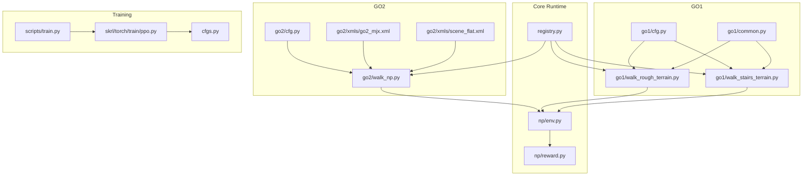
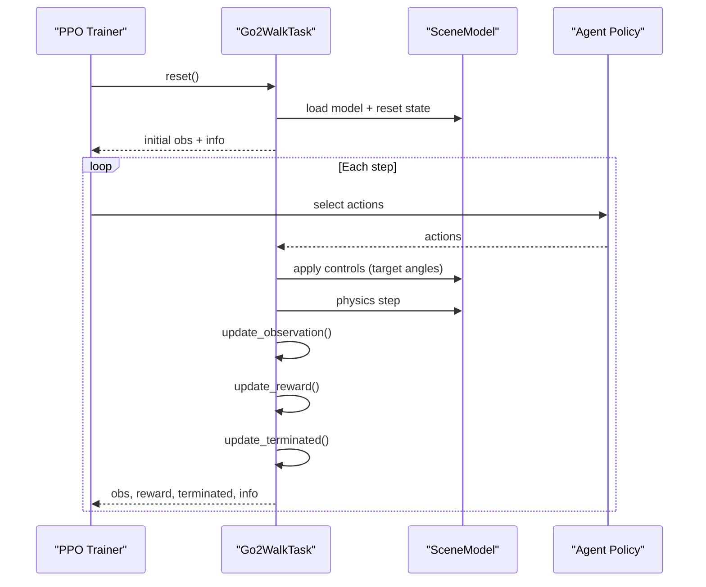
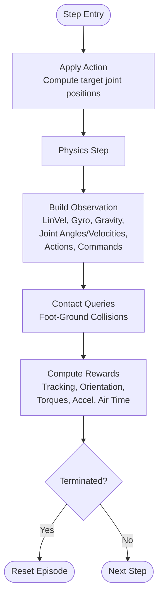
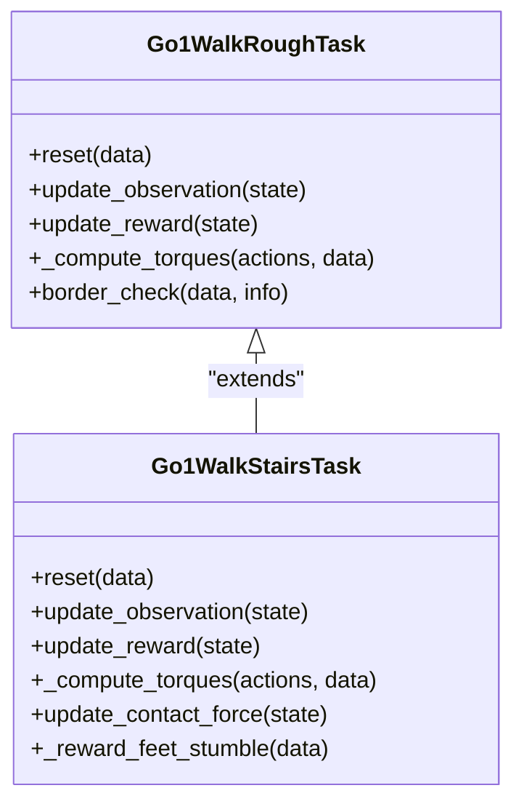
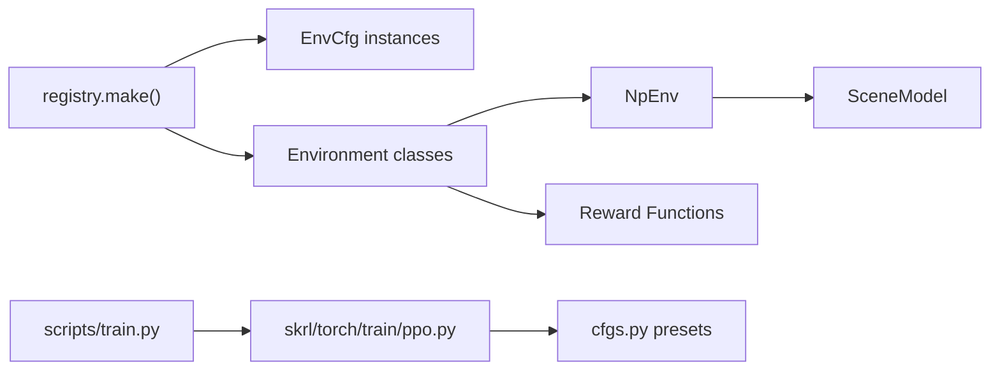

# Unitree GO2 Advanced Bipedal Walking Environments

<cite>
**Referenced Files in This Document**
- [go2/cfg.py](file://motrix_envs/src/motrix_envs/locomotion/go2/cfg.py)
- [go2/walk_np.py](file://motrix_envs/src/motrix_envs/locomotion/go2/walk_np.py)
- [go2/go2_mjx.xml](file://motrix_envs/src/motrix_envs/locomotion/go2/xmls/go2_mjx.xml)
- [go2/scene_flat.xml](file://motrix_envs/src/motrix_envs/locomotion/go2/xmls/scene_flat.xml)
- [go1/cfg.py](file://motrix_envs/src/motrix_envs/locomotion/go1/cfg.py)
- [go1/walk_rough_terrain.py](file://motrix_envs/src/motrix_envs/locomotion/go1/walk_rough_terrain.py)
- [go1/walk_stairs_terrain.py](file://motrix_envs/src/motrix_envs/locomotion/go1/walk_stairs_terrain.py)
- [go1/common.py](file://motrix_envs/src/motrix_envs/locomotion/go1/common.py)
- [np/env.py](file://motrix_envs/src/motrix_envs/np/env.py)
- [np/reward.py](file://motrix_envs/src/motrix_envs/np/reward.py)
- [registry.py](file://motrix_envs/src/motrix_envs/registry.py)
- [skrl/torch/train/ppo.py](file://motrix_rl/src/motrix_rl/skrl/torch/train/ppo.py)
- [cfgs.py](file://motrix_rl/src/motrix_rl/cfgs.py)
- [scripts/train.py](file://scripts/train.py)
</cite>

## Table of Contents
1. [Introduction](#introduction)
2. [Project Structure](#project-structure)
3. [Core Components](#core-components)
4. [Architecture Overview](#architecture-overview)
5. [Detailed Component Analysis](#detailed-component-analysis)
6. [Dependency Analysis](#dependency-analysis)
7. [Performance Considerations](#performance-considerations)
8. [Troubleshooting Guide](#troubleshooting-guide)
9. [Conclusion](#conclusion)
10. [Appendices](#appendices)

## Introduction
This document provides a comprehensive guide to Unitree GO2 advanced bipedal walking environments within the MotrixLab-S1 framework. It explains how GO2 extends locomotion capabilities over GO1 through mechanical design, control architecture, and reward engineering. The document covers environment implementation, configuration parameters, reward function design, training strategies, and practical deployment considerations for advanced robotic applications.

## Project Structure
The locomotion module organizes environments by robot family and scenario. GO2 and GO1 share a common structure: configuration classes define environment parameters, while environment classes implement the runtime behavior and reward computation. XML scene files define the physical model and sensors.

**Diagram sources**
- [go2/cfg.py](file://motrix_envs/src/motrix_envs/locomotion/go2/cfg.py#L125-L140)
- [go2/walk_np.py](file://motrix_envs/src/motrix_envs/locomotion/go2/walk_np.py#L57-L78)
- [go2/go2_mjx.xml](file://motrix_envs/src/motrix_envs/locomotion/go2/xmls/go2_mjx.xml#L1-L279)
- [go2/scene_flat.xml](file://motrix_envs/src/motrix_envs/locomotion/go2/xmls/scene_flat.xml#L1-L200)
- [go1/cfg.py](file://motrix_envs/src/motrix_envs/locomotion/go1/cfg.py#L122-L136)
- [go1/walk_rough_terrain.py](file://motrix_envs/src/motrix_envs/locomotion/go1/walk_rough_terrain.py#L28-L42)
- [go1/walk_stairs_terrain.py](file://motrix_envs/src/motrix_envs/locomotion/go1/walk_stairs_terrain.py#L28-L42)
- [np/env.py](file://motrix_envs/src/motrix_envs/np/env.py#L52-L110)
- [np/reward.py](file://motrix_envs/src/motrix_envs/np/reward.py#L1-L84)
- [registry.py](file://motrix_envs/src/motrix_envs/registry.py#L114-L161)
- [skrl/torch/train/ppo.py](file://motrix_rl/src/motrix_rl/skrl/torch/train/ppo.py#L145-L183)
- [cfgs.py](file://motrix_rl/src/motrix_rl/cfgs.py#L186-L226)
- [scripts/train.py](file://scripts/train.py#L52-L91)

**Section sources**
- [go2/cfg.py](file://motrix_envs/src/motrix_envs/locomotion/go2/cfg.py#L125-L140)
- [go2/walk_np.py](file://motrix_envs/src/motrix_envs/locomotion/go2/walk_np.py#L57-L78)
- [go1/cfg.py](file://motrix_envs/src/motrix_envs/locomotion/go1/cfg.py#L122-L136)
- [np/env.py](file://motrix_envs/src/motrix_envs/np/env.py#L52-L110)
- [registry.py](file://motrix_envs/src/motrix_envs/registry.py#L114-L161)

## Core Components
- GO2 Flat Terrain Walking Environment
  - Configuration defines action scaling, noise, reward weights, command limits, normalization, asset contacts, and sensor mapping.
  - Task implements observation construction, termination detection via contact queries, reward composition, and action application.
  - XML model defines actuator classes, joint ranges, geometry groups, and sensors for IMU, joint positions/velocities, and local linear/angular velocities.

- GO1 Terrain Adaptation Environments
  - Flat terrain configuration mirrors GO2 but with PD control and different reward emphasis.
  - Rough terrain introduces height-field sampling and dynamic command resampling.
  - Stairs terrain adds contact force sensors and stumble penalties.

- Core Runtime
  - Numpy-based environment base class manages scene loading, physics stepping, state transitions, and reset logic.
  - Reward utilities provide configurable sigmoid shaping for smooth tolerances.

- Training Infrastructure
  - PPO agent wrapper logs per-reward metrics and integrates with SKRL trainers.
  - RL configuration presets define hyperparameters for GO2 and GO1 locomotion tasks.

**Section sources**
- [go2/cfg.py](file://motrix_envs/src/motrix_envs/locomotion/go2/cfg.py#L25-L140)
- [go2/walk_np.py](file://motrix_envs/src/motrix_envs/locomotion/go2/walk_np.py#L57-L410)
- [go2/go2_mjx.xml](file://motrix_envs/src/motrix_envs/locomotion/go2/xmls/go2_mjx.xml#L13-L45)
- [go1/cfg.py](file://motrix_envs/src/motrix_envs/locomotion/go1/cfg.py#L23-L188)
- [go1/walk_rough_terrain.py](file://motrix_envs/src/motrix_envs/locomotion/go1/walk_rough_terrain.py#L28-L438)
- [go1/walk_stairs_terrain.py](file://motrix_envs/src/motrix_envs/locomotion/go1/walk_stairs_terrain.py#L28-L445)
- [np/env.py](file://motrix_envs/src/motrix_envs/np/env.py#L52-L209)
- [np/reward.py](file://motrix_envs/src/motrix_envs/np/reward.py#L21-L84)
- [cfgs.py](file://motrix_rl/src/motrix_rl/cfgs.py#L186-L226)
- [skrl/torch/train/ppo.py](file://motrix_rl/src/motrix_rl/skrl/torch/train/ppo.py#L86-L144)

## Architecture Overview
The GO2 environment follows a modular pipeline: configuration-driven initialization, action-to-control mapping, physics simulation, observation computation, reward aggregation, and termination checks. The GO1 environments extend this with terrain-specific logic and PD control.

**Diagram sources**
- [go2/walk_np.py](file://motrix_envs/src/motrix_envs/locomotion/go2/walk_np.py#L187-L209)
- [np/env.py](file://motrix_envs/src/motrix_envs/np/env.py#L196-L209)
- [skrl/torch/train/ppo.py](file://motrix_rl/src/motrix_rl/skrl/torch/train/ppo.py#L167-L183)

## Detailed Component Analysis

### GO2 Flat Terrain Walking Environment
- Configuration highlights
  - Action scaling and default joint angles define the nominal posture and control authority.
  - Command limits and normalization scale desired velocity profiles and observation features.
  - Reward scales emphasize tracking, orientation, torques, acceleration, action rate, and feet air time.
  - Termination conditions monitor collisions between body and ground geometries.

- Observation design
  - Includes local linear velocity, gyroscope readings, local gravity, joint angles relative to defaults, joint velocities, previous actions, and commanded velocities.
  - Contact queries detect foot-ground collisions to compute air time.

- Reward function
  - Tracks linear and angular velocity targets with exponential decays.
  - Penalizes base height oscillations, xy angular velocity, orientation deviations, torque usage, joint velocities, joint accelerations, and excessive action changes.
  - Encourages sustained flight phase (feet air time) when moving.

- Action application
  - Actions are mapped to target joint positions via a linear transform using default angles and action scale.
  - Actuator control limits are enforced by the environment’s action space.

**Diagram sources**
- [go2/walk_np.py](file://motrix_envs/src/motrix_envs/locomotion/go2/walk_np.py#L187-L287)
- [go2/cfg.py](file://motrix_envs/src/motrix_envs/locomotion/go2/cfg.py#L98-L123)

**Section sources**
- [go2/cfg.py](file://motrix_envs/src/motrix_envs/locomotion/go2/cfg.py#L41-L140)
- [go2/walk_np.py](file://motrix_envs/src/motrix_envs/locomotion/go2/walk_np.py#L187-L410)

### GO1 Terrain Adaptation Environments
- GO1 Flat Terrain
  - PD control with stiffness/damping parameters and action scaling to compute torques.
  - Reward structure similar to GO2 with slight scale differences and optional stumble penalty in stairs.

- GO1 Rough Terrain
  - Height-field terrain generation with periodic placement sampled across environments.
  - Dynamic command resampling and border checks to prevent out-of-bounds exploration.

- GO1 Stairs Terrain
  - Adds contact force sensors per foot and stumble penalty when lateral forces exceed vertical thresholds.
  - Extended observation includes per-foot contact force projections.

**Diagram sources**
- [go1/walk_rough_terrain.py](file://motrix_envs/src/motrix_envs/locomotion/go1/walk_rough_terrain.py#L28-L438)
- [go1/walk_stairs_terrain.py](file://motrix_envs/src/motrix_envs/locomotion/go1/walk_stairs_terrain.py#L28-L445)

**Section sources**
- [go1/cfg.py](file://motrix_envs/src/motrix_envs/locomotion/go1/cfg.py#L33-L188)
- [go1/walk_rough_terrain.py](file://motrix_envs/src/motrix_envs/locomotion/go1/walk_rough_terrain.py#L96-L330)
- [go1/walk_stairs_terrain.py](file://motrix_envs/src/motrix_envs/locomotion/go1/walk_stairs_terrain.py#L96-L335)
- [go1/common.py](file://motrix_envs/src/motrix_envs/locomotion/go1/common.py#L19-L50)

### Configuration Parameters Specific to GO2
- Mechanical and Actuator Specifications
  - Joint classes define abduction, hip, and knee ranges and control limits.
  - General actuators specify force/torque ranges and PD-like bias/gain parameters.
  - Foot collision geometry and visual meshes define contact and rendering.

- Control Authority Settings
  - Action scale maps normalized actions to target joint positions around default angles.
  - Control configuration sets action scale and leverages actuator control limits.

- Environment Parameters
  - Noise configuration scales sensor noise.
  - Command limits define allowable velocity profiles.
  - Normalization scales observation features for stable training.
  - Reward scales tune emphasis across stability, tracking, energy, and kinematic terms.

**Section sources**
- [go2/go2_mjx.xml](file://motrix_envs/src/motrix_envs/locomotion/go2/xmls/go2_mjx.xml#L13-L45)
- [go2/go2_mjx.xml](file://motrix_envs/src/motrix_envs/locomotion/go2/xmls/go2_mjx.xml#L207-L232)
- [go2/cfg.py](file://motrix_envs/src/motrix_envs/locomotion/go2/cfg.py#L25-L140)

### Reward Function Modifications for Advanced Bipedal Locomotion
- Stability and Orientation
  - Penalize gravity vector projection deviations in the local frame to maintain flat base orientation.
  - Limit base height oscillations to avoid unstable bouncing.

- Efficiency and Energy
  - Penalize torques and joint accelerations to reduce energetic cost.
  - Encourage sustained feet air time to reward efficient strides.

- Adaptability and Tracking
  - Exponential decays on tracking errors for linear and angular velocities.
  - Action rate penalty discourages rapid oscillations.

- Comparison with GO1
  - GO1 emphasizes PD control and optionally stumble penalties on stairs.
  - GO2 focuses on target-angle control with explicit default posture and action scaling.

**Section sources**
- [go2/walk_np.py](file://motrix_envs/src/motrix_envs/locomotion/go2/walk_np.py#L311-L410)
- [go1/walk_stairs_terrain.py](file://motrix_envs/src/motrix_envs/locomotion/go1/walk_stairs_terrain.py#L337-L445)
- [np/reward.py](file://motrix_envs/src/motrix_envs/np/reward.py#L21-L84)

### Training Strategies for Complex Scenarios
- Hyperparameters
  - PPO rollout length, learning epochs, mini-batches, learning rate, and hidden layer sizes tailored for bipedal locomotion.
  - Seed and environment counts optimized for stable convergence.

- Execution Pipeline
  - Training script selects backend (JAX/Torch) based on device availability.
  - Trainer wraps environments, builds models, configures agent, and runs sequential training.

- Metrics Logging
  - Per-reward instant and total metrics recorded during training for diagnostics.

**Section sources**
- [cfgs.py](file://motrix_rl/src/motrix_rl/cfgs.py#L186-L226)
- [scripts/train.py](file://scripts/train.py#L39-L91)
- [skrl/torch/train/ppo.py](file://motrix_rl/src/motrix_rl/skrl/torch/train/ppo.py#L145-L183)
- [skrl/torch/train/ppo.py](file://motrix_rl/src/motrix_rl/skrl/torch/train/ppo.py#L86-L144)

## Dependency Analysis
The environment classes depend on configuration classes and the NumPy environment base. Registry binds names to configuration and environment classes, enabling creation by name. Training relies on SKRL wrappers and RL presets.

**Diagram sources**
- [registry.py](file://motrix_envs/src/motrix_envs/registry.py#L114-L161)
- [np/env.py](file://motrix_envs/src/motrix_envs/np/env.py#L52-L110)
- [scripts/train.py](file://scripts/train.py#L52-L91)
- [skrl/torch/train/ppo.py](file://motrix_rl/src/motrix_rl/skrl/torch/train/ppo.py#L145-L183)
- [cfgs.py](file://motrix_rl/src/motrix_rl/cfgs.py#L186-L226)

**Section sources**
- [registry.py](file://motrix_envs/src/motrix_envs/registry.py#L114-L161)
- [np/env.py](file://motrix_envs/src/motrix_envs/np/env.py#L52-L110)
- [scripts/train.py](file://scripts/train.py#L52-L91)

## Performance Considerations
- Simulation fidelity vs. speed
  - GO2 model uses Euler integration with small timestep; adjust sim_dt and sim_substeps for latency vs. accuracy trade-offs.
  - Reduce num_envs or mini-batches for constrained hardware.

- Reward shaping
  - Tighten tracking sigma for sharper reward gradients.
  - Increase action rate penalty to stabilize walking patterns.

- Terrain variability
  - For rough/stairs scenarios, increase training epochs and rollout lengths to handle stochasticity.

[No sources needed since this section provides general guidance]

## Troubleshooting Guide
- Environment not found
  - Ensure environment name matches registration and backend is supported.

- Training instability
  - Lower learning rate, increase rollout length, or adjust reward scales.
  - Verify action scaling and control limits align with model actuator ranges.

- Poor locomotion quality
  - Inspect reward weights for tracking, orientation, and air-time balance.
  - Confirm default joint angles and action scale produce feasible initial poses.

**Section sources**
- [registry.py](file://motrix_envs/src/motrix_envs/registry.py#L114-L161)
- [go2/cfg.py](file://motrix_envs/src/motrix_envs/locomotion/go2/cfg.py#L36-L38)
- [go2/walk_np.py](file://motrix_envs/src/motrix_envs/locomotion/go2/walk_np.py#L364-L367)

## Conclusion
GO2 environments leverage a clean separation of concerns: configuration-driven parameters, robust observation and reward design, and scalable training infrastructure. Compared to GO1, GO2 emphasizes target-angle control, posture-aware regularization, and efficient stride promotion. These components enable advanced bipedal locomotion research and deployment-ready training pipelines.

[No sources needed since this section summarizes without analyzing specific files]

## Appendices

### Appendix A: GO2 vs. GO1 Capabilities Overview
- Mechanical design
  - GO2: explicit joint classes (abduction, hip, knee) with precise ranges and control limits; general actuators with PD-like bias/gain.
  - GO1: PD control with stiffness/damping parameters; motor actuators in terrain variants.

- Control algorithms
  - GO2: target-angle mapping from actions to joint positions; direct control of generalized actuators.
  - GO1: PD torque computation; optional contact force feedback on stairs.

- Performance characteristics
  - GO2 reward emphasizes posture and air-time; GO1 terrain variants add stumble penalties and height-field challenges.

**Section sources**
- [go2/go2_mjx.xml](file://motrix_envs/src/motrix_envs/locomotion/go2/xmls/go2_mjx.xml#L13-L45)
- [go2/cfg.py](file://motrix_envs/src/motrix_envs/locomotion/go2/cfg.py#L36-L38)
- [go1/cfg.py](file://motrix_envs/src/motrix_envs/locomotion/go1/cfg.py#L33-L38)
- [go1/walk_stairs_terrain.py](file://motrix_envs/src/motrix_envs/locomotion/go1/walk_stairs_terrain.py#L337-L445)