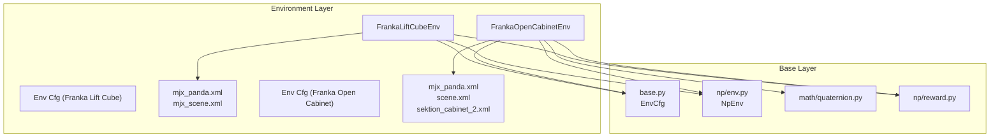
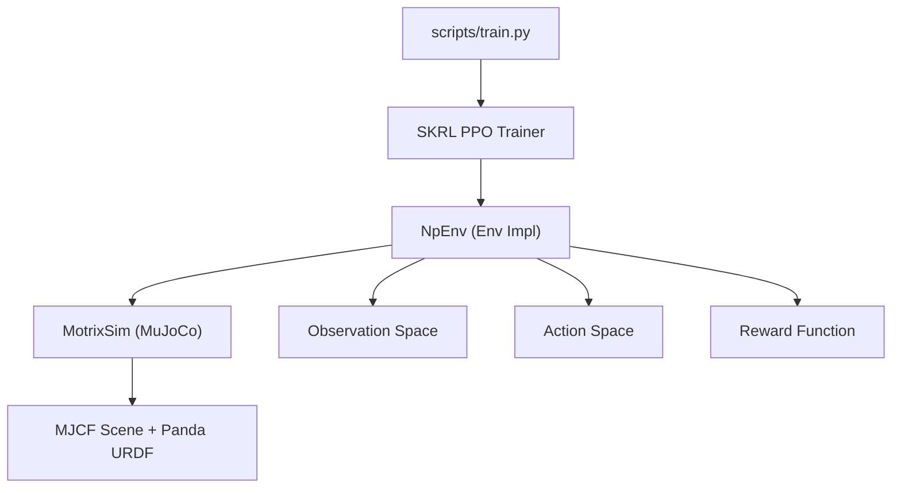
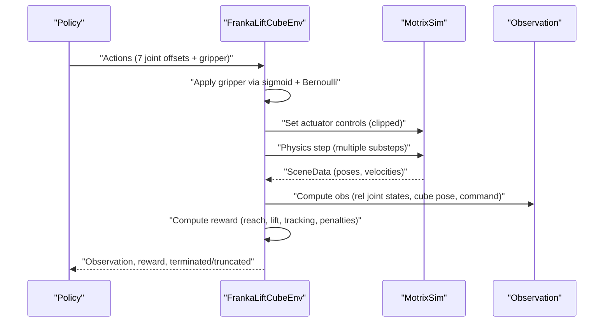
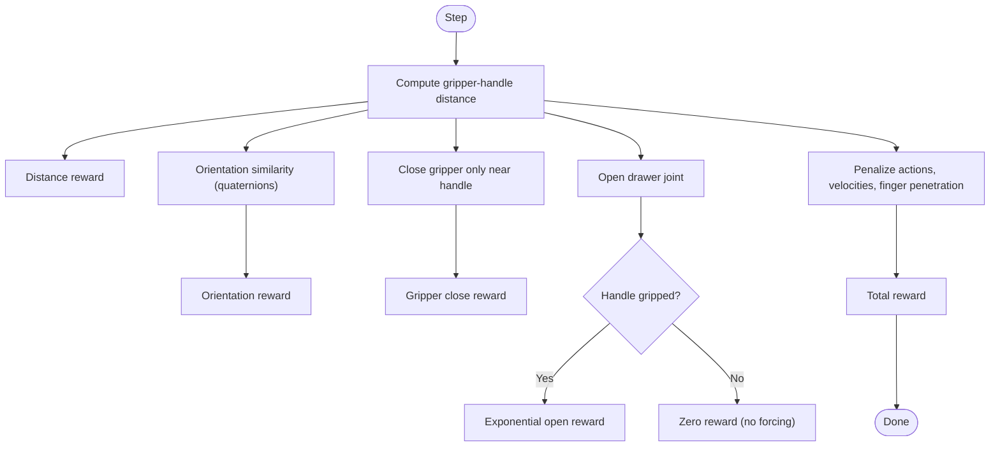
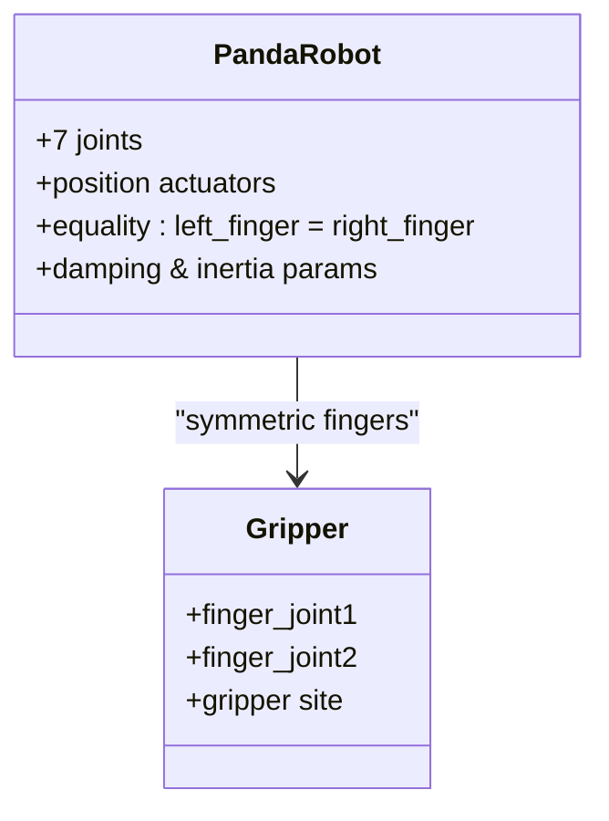
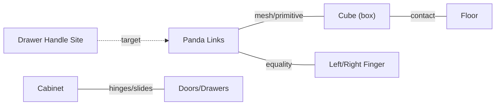
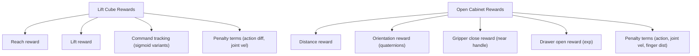
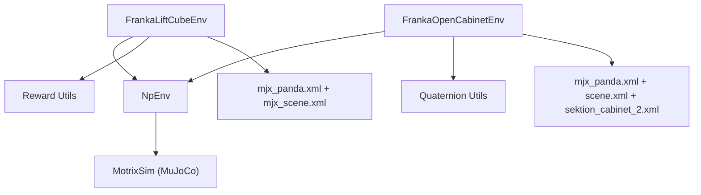
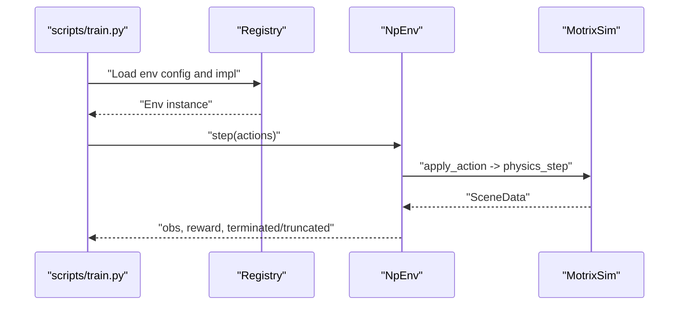

# Manipulation Environments

<cite>
**Referenced Files in This Document**
- [franka_lift_cube_np.py](file://motrix_envs/src/motrix_envs/manipulation/franka_lift_cube/franka_lift_cube_np.py)
- [cfg.py (Franka Lift Cube)](file://motrix_envs/src/motrix_envs/manipulation/franka_lift_cube/cfg.py)
- [mjx_panda.xml (Franka Lift Cube)](file://motrix_envs/src/motrix_envs/manipulation/franka_lift_cube/xmls/mjx_panda.xml)
- [mjx_scene.xml (Franka Lift Cube)](file://motrix_envs/src/motrix_envs/manipulation/franka_lift_cube/xmls/mjx_scene.xml)
- [franka_open_cabinet_np.py](file://motrix_envs/src/motrix_envs/manipulation/franka_open_cabinet/franka_open_cabinet_np.py)
- [cfg.py (Franka Open Cabinet)](file://motrix_envs/src/motrix_envs/manipulation/franka_open_cabinet/cfg.py)
- [mjx_panda.xml (Franka Open Cabinet)](file://motrix_envs/src/motrix_envs/manipulation/franka_open_cabinet/xmls/mjx_panda.xml)
- [scene.xml (Franka Open Cabinet)](file://motrix_envs/src/motrix_envs/manipulation/franka_open_cabinet/xmls/scene.xml)
- [sektion_cabinet_2.xml (Franka Open Cabinet)](file://motrix_envs/src/motrix_envs/manipulation/franka_open_cabinet/xmls/sektion_cabinet_2.xml)
- [env.py (NumPy Environment Base)](file://motrix_envs/src/motrix_envs/np/env.py)
- [base.py (Environment Base Classes)](file://motrix_envs/src/motrix_envs/base.py)
- [quaternion.py](file://motrix_envs/src/motrix_envs/math/quaternion.py)
- [reward.py (NumPy Reward Utilities)](file://motrix_envs/src/motrix_envs/np/reward.py)
- [training_environment_config.md](file://docs/source/en/user_guide/tutorial/training_environment_config.md)
- [basic_frame.md](file://docs/source/en/user_guide/tutorial/basic_frame.md)
</cite>

## Table of Contents
1. [Introduction](#introduction)
2. [Project Structure](#project-structure)
3. [Core Components](#core-components)
4. [Architecture Overview](#architecture-overview)
5. [Detailed Component Analysis](#detailed-component-analysis)
6. [Dependency Analysis](#dependency-analysis)
7. [Performance Considerations](#performance-considerations)
8. [Troubleshooting Guide](#troubleshooting-guide)
9. [Conclusion](#conclusion)
10. [Appendices](#appendices)

## Introduction
This document explains the manipulation environments for robotic arms, focusing on the Franka Panda-based tasks: cube lifting and cabinet opening. It covers kinematics, gripper mechanics, object dynamics, collision handling, and reward designs. It also documents configuration parameters for joint limits, gripper control, and object properties, and outlines training strategies including curriculum learning. The environments integrate with the MuJoCo-based physics engine via MotrixSim to provide accurate rigid body dynamics and contact modeling.

## Project Structure
The manipulation environments are implemented under the environment layer and use a NumPy-based simulation backend. Each task defines:
- An environment class implementing the task logic
- A configuration class defining simulation and task parameters
- MuJoCo XML scenes and robot models
- Observation, action, termination, and reward computations

**Diagram sources**
- [franka_lift_cube_np.py](file://motrix_envs/src/motrix_envs/manipulation/franka_lift_cube/franka_lift_cube_np.py#L32-L292)
- [cfg.py (Franka Lift Cube)](file://motrix_envs/src/motrix_envs/manipulation/franka_lift_cube/cfg.py#L69-L84)
- [mjx_panda.xml (Franka Lift Cube)](file://motrix_envs/src/motrix_envs/manipulation/franka_lift_cube/xmls/mjx_panda.xml#L1-L281)
- [mjx_scene.xml (Franka Lift Cube)](file://motrix_envs/src/motrix_envs/manipulation/franka_lift_cube/xmls/mjx_scene.xml#L1-L65)
- [franka_open_cabinet_np.py](file://motrix_envs/src/motrix_envs/manipulation/franka_open_cabinet/franka_open_cabinet_np.py#L27-L288)
- [cfg.py (Franka Open Cabinet)](file://motrix_envs/src/motrix_envs/manipulation/franka_open_cabinet/cfg.py#L25-L33)
- [mjx_panda.xml (Franka Open Cabinet)](file://motrix_envs/src/motrix_envs/manipulation/franka_open_cabinet/xmls/mjx_panda.xml#L1-L279)
- [scene.xml (Franka Open Cabinet)](file://motrix_envs/src/motrix_envs/manipulation/franka_open_cabinet/xmls/scene.xml#L1-L35)
- [sektion_cabinet_2.xml (Franka Open Cabinet)](file://motrix_envs/src/motrix_envs/manipulation/franka_open_cabinet/xmls/sektion_cabinet_2.xml#L1-L170)
- [env.py (NumPy Environment Base)](file://motrix_envs/src/motrix_envs/np/env.py#L52-L209)
- [base.py (Environment Base Classes)](file://motrix_envs/src/motrix_envs/base.py#L23-L85)
- [quaternion.py](file://motrix_envs/src/motrix_envs/math/quaternion.py#L18-L151)
- [reward.py (NumPy Reward Utilities)](file://motrix_envs/src/motrix_envs/np/reward.py#L21-L84)

**Section sources**
- [franka_lift_cube_np.py](file://motrix_envs/src/motrix_envs/manipulation/franka_lift_cube/franka_lift_cube_np.py#L32-L292)
- [franka_open_cabinet_np.py](file://motrix_envs/src/motrix_envs/manipulation/franka_open_cabinet/franka_open_cabinet_np.py#L27-L288)
- [env.py (NumPy Environment Base)](file://motrix_envs/src/motrix_envs/np/env.py#L52-L209)
- [base.py (Environment Base Classes)](file://motrix_envs/src/motrix_envs/base.py#L23-L85)

## Core Components
- Environment base classes define the configuration contract and the NumPy simulation loop.
- Task-specific environments implement:
  - Action application (joint position control and gripper action)
  - Observation construction (joint states, object poses, commands)
  - Termination checks (joint velocity, cube drop, collisions)
  - Reward computation (reach, lift, command tracking, penalties)
- MuJoCo XMLs define the robot, scene, and objects with collision geometries and actuator controls.

Key implementation references:
- Environment base and step loop: [env.py](file://motrix_envs/src/motrix_envs/np/env.py#L52-L209)
- Configuration base: [base.py](file://motrix_envs/src/motrix_envs/base.py#L23-L85)
- Lift cube environment: [franka_lift_cube_np.py](file://motrix_envs/src/motrix_envs/manipulation/franka_lift_cube/franka_lift_cube_np.py#L32-L292)
- Open cabinet environment: [franka_open_cabinet_np.py](file://motrix_envs/src/motrix_envs/manipulation/franka_open_cabinet/franka_open_cabinet_np.py#L27-L288)
- Robot and scene XMLs: [mjx_panda.xml](file://motrix_envs/src/motrix_envs/manipulation/franka_lift_cube/xmls/mjx_panda.xml#L1-L281), [mjx_scene.xml](file://motrix_envs/src/motrix_envs/manipulation/franka_lift_cube/xmls/mjx_scene.xml#L1-L65), [mjx_panda.xml (Open Cabinet)](file://motrix_envs/src/motrix_envs/manipulation/franka_open_cabinet/xmls/mjx_panda.xml#L1-L279), [scene.xml (Open Cabinet)](file://motrix_envs/src/motrix_envs/manipulation/franka_open_cabinet/xmls/scene.xml#L1-L35), [sektion_cabinet_2.xml (Open Cabinet)](file://motrix_envs/src/motrix_envs/manipulation/franka_open_cabinet/xmls/sektion_cabinet_2.xml#L1-L170)

**Section sources**
- [env.py (NumPy Environment Base)](file://motrix_envs/src/motrix_envs/np/env.py#L52-L209)
- [base.py (Environment Base Classes)](file://motrix_envs/src/motrix_envs/base.py#L23-L85)
- [franka_lift_cube_np.py](file://motrix_envs/src/motrix_envs/manipulation/franka_lift_cube/franka_lift_cube_np.py#L32-L292)
- [franka_open_cabinet_np.py](file://motrix_envs/src/motrix_envs/manipulation/franka_open_cabinet/franka_open_cabinet_np.py#L27-L288)
- [mjx_panda.xml (Franka Lift Cube)](file://motrix_envs/src/motrix_envs/manipulation/franka_lift_cube/xmls/mjx_panda.xml#L1-L281)
- [mjx_scene.xml (Franka Lift Cube)](file://motrix_envs/src/motrix_envs/manipulation/franka_lift_cube/xmls/mjx_scene.xml#L1-L65)
- [mjx_panda.xml (Franka Open Cabinet)](file://motrix_envs/src/motrix_envs/manipulation/franka_open_cabinet/xmls/mjx_panda.xml#L1-L279)
- [scene.xml (Franka Open Cabinet)](file://motrix_envs/src/motrix_envs/manipulation/franka_open_cabinet/xmls/scene.xml#L1-L35)
- [sektion_cabinet_2.xml (Franka Open Cabinet)](file://motrix_envs/src/motrix_envs/manipulation/franka_open_cabinet/xmls/sektion_cabinet_2.xml#L1-L170)

## Architecture Overview
The environments follow a layered architecture:
- Training Algorithm Layer (SKRL) orchestrates policy updates and interacts with environment instances.
- Environment Implementation Layer implements task logic, observations, rewards, and resets.
- Physics Simulation Layer (MotrixSim) executes MuJoCo-based simulations with configured time steps and contact models.

**Diagram sources**
- [basic_frame.md](file://docs/source/en/user_guide/tutorial/basic_frame.md#L27-L52)
- [env.py (NumPy Environment Base)](file://motrix_envs/src/motrix_envs/np/env.py#L52-L209)
- [franka_lift_cube_np.py](file://motrix_envs/src/motrix_envs/manipulation/franka_lift_cube/franka_lift_cube_np.py#L32-L292)
- [franka_open_cabinet_np.py](file://motrix_envs/src/motrix_envs/manipulation/franka_open_cabinet/franka_open_cabinet_np.py#L27-L288)

## Detailed Component Analysis

### Franka Lift Cube Environment
- Kinematics and control:
  - Robot: 7-DoF arm plus a two-finger gripper. Position actuators with explicit ctrlrange define joint limits.
  - Gripper action: Binary decision via probabilistic mapping and Bernoulli sampling; closes to zero, opens to a fixed maximum.
  - Action space: 8-dimensional (7 joint offsets + 1 gripper action).
- Observations:
  - Concatenation of relative joint positions/velocities, object pose, target command pose, and last actions.
- Termination:
  - Cube dropped below a threshold.
  - Excessive joint or cube velocities.
- Rewards:
  - Reach reward based on hand-to-cube distance.
  - Lift reward for exceeding a minimum height threshold.
  - Command tracking reward using sigmoid-shaped shaping; multiple variants for coarse/fine/close-grained targeting.
  - Penalizes action changes and joint velocities with schedule-dependent weights.
- Configuration highlights:
  - Episode duration, simulation/control timesteps, render spacing, reset noise scales.
  - Joint limits and gripper open/close positions.

**Diagram sources**
- [franka_lift_cube_np.py](file://motrix_envs/src/motrix_envs/manipulation/franka_lift_cube/franka_lift_cube_np.py#L72-L119)
- [env.py (NumPy Environment Base)](file://motrix_envs/src/motrix_envs/np/env.py#L186-L209)

**Section sources**
- [franka_lift_cube_np.py](file://motrix_envs/src/motrix_envs/manipulation/franka_lift_cube/franka_lift_cube_np.py#L32-L292)
- [cfg.py (Franka Lift Cube)](file://motrix_envs/src/motrix_envs/manipulation/franka_lift_cube/cfg.py#L69-L84)
- [mjx_panda.xml (Franka Lift Cube)](file://motrix_envs/src/motrix_envs/manipulation/franka_lift_cube/xmls/mjx_panda.xml#L256-L276)
- [mjx_scene.xml (Franka Lift Cube)](file://motrix_envs/src/motrix_envs/manipulation/franka_lift_cube/xmls/mjx_scene.xml#L60-L65)

### Franka Open Cabinet Environment
- Kinematics and control:
  - Robot: Same 7-DoF Panda with position actuators and gripper.
  - Gripper action: Same probabilistic mapping and Bernoulli sampling.
- Observations:
  - Scaled relative joint positions, normalized joint velocities, vector from gripper TCP to drawer handle, drawer joint position and velocity.
- Termination:
  - Robot extending too far forward relative to the handle or excessive joint velocities.
- Rewards:
  - Distance reward between gripper and handle.
  - Orientation similarity reward using quaternions.
  - Gripper close reward only when distance is small; opening gripper yields no reward when far from handle.
  - Drawer open reward using exponential shaping; penalizes opening when not gripping the handle.
  - Penalties for action changes, joint velocities, and finger-penetration violations.
- Configuration highlights:
  - Episode duration, simulation/control timesteps, render spacing.

**Diagram sources**
- [franka_open_cabinet_np.py](file://motrix_envs/src/motrix_envs/manipulation/franka_open_cabinet/franka_open_cabinet_np.py#L197-L264)
- [quaternion.py](file://motrix_envs/src/motrix_envs/math/quaternion.py#L100-L143)

**Section sources**
- [franka_open_cabinet_np.py](file://motrix_envs/src/motrix_envs/manipulation/franka_open_cabinet/franka_open_cabinet_np.py#L27-L288)
- [cfg.py (Franka Open Cabinet)](file://motrix_envs/src/motrix_envs/manipulation/franka_open_cabinet/cfg.py#L25-L33)
- [mjx_panda.xml (Franka Open Cabinet)](file://motrix_envs/src/motrix_envs/manipulation/franka_open_cabinet/xmls/mjx_panda.xml#L257-L274)
- [scene.xml (Franka Open Cabinet)](file://motrix_envs/src/motrix_envs/manipulation/franka_open_cabinet/xmls/scene.xml#L1-L35)
- [sektion_cabinet_2.xml (Franka Open Cabinet)](file://motrix_envs/src/motrix_envs/manipulation/franka_open_cabinet/xmls/sektion_cabinet_2.xml#L112-L137)

### Robot Kinematics and Gripper Mechanics
- Panda robot:
  - 7 revolute joints with joint damping and inertia parameters.
  - Actuators: position-controlled with kp/kv gains and ctrlrange limits.
  - Equality constraint ensures symmetric finger motion.
- Gripper:
  - Two parallel fingers sliding along a common axis; symmetric equality constraint maintains equal finger distances.
  - Probabilistic gripper action mapped via sigmoid and sampled via Bernoulli.

**Diagram sources**
- [mjx_panda.xml (Franka Lift Cube)](file://motrix_envs/src/motrix_envs/manipulation/franka_lift_cube/xmls/mjx_panda.xml#L137-L276)
- [mjx_panda.xml (Franka Open Cabinet)](file://motrix_envs/src/motrix_envs/manipulation/franka_open_cabinet/xmls/mjx_panda.xml#L136-L274)

**Section sources**
- [mjx_panda.xml (Franka Lift Cube)](file://motrix_envs/src/motrix_envs/manipulation/franka_lift_cube/xmls/mjx_panda.xml#L137-L276)
- [mjx_panda.xml (Franka Open Cabinet)](file://motrix_envs/src/motrix_envs/manipulation/franka_open_cabinet/xmls/mjx_panda.xml#L136-L274)

### Object Dynamics, Collision Detection, and Constraints
- Objects:
  - Free-floating cube with box geometry for the lift task.
  - Cabinet with doors and drawers; drawer handle sites used for grasp targets.
- Collisions:
  - Primitive and mesh collision geometries defined for links and gripper pads.
  - Contact exclusions prevent self-collision across connected bodies.
- Constraints:
  - Equality constraint on finger joints to maintain symmetric gripper motion.
  - Joint range limits enforced in both XML and environment action clipping.

**Diagram sources**
- [mjx_scene.xml (Franka Lift Cube)](file://motrix_envs/src/motrix_envs/manipulation/franka_lift_cube/xmls/mjx_scene.xml#L60-L65)
- [sektion_cabinet_2.xml (Franka Open Cabinet)](file://motrix_envs/src/motrix_envs/manipulation/franka_open_cabinet/xmls/sektion_cabinet_2.xml#L84-L137)
- [mjx_panda.xml (Franka Lift Cube)](file://motrix_envs/src/motrix_envs/manipulation/franka_lift_cube/xmls/mjx_panda.xml#L21-L35)
- [mjx_panda.xml (Franka Open Cabinet)](file://motrix_envs/src/motrix_envs/manipulation/franka_open_cabinet/xmls/mjx_panda.xml#L16-L35)

**Section sources**
- [mjx_scene.xml (Franka Lift Cube)](file://motrix_envs/src/motrix_envs/manipulation/franka_lift_cube/xmls/mjx_scene.xml#L60-L65)
- [sektion_cabinet_2.xml (Franka Open Cabinet)](file://motrix_envs/src/motrix_envs/manipulation/franka_open_cabinet/xmls/sektion_cabinet_2.xml#L84-L137)
- [mjx_panda.xml (Franka Lift Cube)](file://motrix_envs/src/motrix_envs/manipulation/franka_lift_cube/xmls/mjx_panda.xml#L21-L35)
- [mjx_panda.xml (Franka Open Cabinet)](file://motrix_envs/src/motrix_envs/manipulation/franka_open_cabinet/xmls/mjx_panda.xml#L16-L35)

### Task-Specific Reward Functions
- Lift Cube:
  - Reach reward: tanh-like shaping of hand-to-cube distance.
  - Lift reward: binary activation above a height threshold.
  - Command tracking: sigmoid-based proximity to target command pose; multiple variants for different granularities.
  - Penalties: L2 norms of action differences and joint velocities with schedule-dependent rates.
- Open Cabinet:
  - Distance reward: tanh-like shaping of gripper-to-handle distance.
  - Orientation reward: cosine of relative quaternion alignment.
  - Gripper close reward: only when near handle; opening far from handle yields no reward.
  - Drawer open reward: exponential shaping of drawer joint position; avoid rewarding unintended opening.
  - Penalties: action changes, joint velocities, and finger-penetration violations.

**Diagram sources**
- [franka_lift_cube_np.py](file://motrix_envs/src/motrix_envs/manipulation/franka_lift_cube/franka_lift_cube_np.py#L198-L265)
- [franka_open_cabinet_np.py](file://motrix_envs/src/motrix_envs/manipulation/franka_open_cabinet/franka_open_cabinet_np.py#L197-L264)
- [quaternion.py](file://motrix_envs/src/motrix_envs/math/quaternion.py#L100-L143)

**Section sources**
- [franka_lift_cube_np.py](file://motrix_envs/src/motrix_envs/manipulation/franka_lift_cube/franka_lift_cube_np.py#L198-L265)
- [franka_open_cabinet_np.py](file://motrix_envs/src/motrix_envs/manipulation/franka_open_cabinet/franka_open_cabinet_np.py#L197-L264)
- [quaternion.py](file://motrix_envs/src/motrix_envs/math/quaternion.py#L100-L143)

### Configuration Parameters
- Simulation and control:
  - sim_dt, ctrl_dt, max_episode_seconds, render_spacing.
  - Derived: max_episode_steps, sim_substeps.
- Robot joint limits and gripper:
  - Joint ctrlrange per actuator; gripper open/close positions.
  - Default joint positions and reset noise scales.
- Task-specific:
  - Target command ranges for lift cube.
  - Termination contacts and asset names for early stopping.

References:
- [base.py](file://motrix_envs/src/motrix_envs/base.py#L23-L85)
- [cfg.py (Franka Lift Cube)](file://motrix_envs/src/motrix_envs/manipulation/franka_lift_cube/cfg.py#L27-L84)
- [cfg.py (Franka Open Cabinet)](file://motrix_envs/src/motrix_envs/manipulation/franka_open_cabinet/cfg.py#L25-L33)
- [mjx_panda.xml (Franka Lift Cube)](file://motrix_envs/src/motrix_envs/manipulation/franka_lift_cube/xmls/mjx_panda.xml#L260-L276)
- [mjx_panda.xml (Franka Open Cabinet)](file://motrix_envs/src/motrix_envs/manipulation/franka_open_cabinet/xmls/mjx_panda.xml#L257-L274)

**Section sources**
- [base.py](file://motrix_envs/src/motrix_envs/base.py#L23-L85)
- [cfg.py (Franka Lift Cube)](file://motrix_envs/src/motrix_envs/manipulation/franka_lift_cube/cfg.py#L27-L84)
- [cfg.py (Franka Open Cabinet)](file://motrix_envs/src/motrix_envs/manipulation/franka_open_cabinet/cfg.py#L25-L33)
- [mjx_panda.xml (Franka Lift Cube)](file://motrix_envs/src/motrix_envs/manipulation/franka_lift_cube/xmls/mjx_panda.xml#L260-L276)
- [mjx_panda.xml (Franka Open Cabinet)](file://motrix_envs/src/motrix_envs/manipulation/franka_open_cabinet/xmls/mjx_panda.xml#L257-L274)

### Training Approaches and Curriculum Learning
- Training framework:
  - PPO with configurable policy/value network sizes, learning rate, epochs, mini-batches, discount factor, and clipping parameters.
  - Support for JAX and PyTorch backends via SKRL integration.
- Curriculum strategies:
  - Lift cube: schedule-dependent action and joint velocity penalties; increase emphasis on command tracking rewards after initial exploration.
  - Open cabinet: staged reward shaping with distance-based orientation reward and exponential drawer reward; avoid rewarding unintended opening.
- Practical tips:
  - Increase num_envs gradually; tune learning_rate_scheduler_kl_threshold for adaptive learning rate.
  - Use rewards_shaper_scale to adjust reward magnitudes; monitor time_limit_bootstrap behavior.

References:
- [training_environment_config.md](file://docs/source/en/user_guide/tutorial/training_environment_config.md#L9-L151)
- [franka_lift_cube_np.py](file://motrix_envs/src/motrix_envs/manipulation/franka_lift_cube/franka_lift_cube_np.py#L247-L265)
- [franka_open_cabinet_np.py](file://motrix_envs/src/motrix_envs/manipulation/franka_open_cabinet/franka_open_cabinet_np.py#L246-L264)

**Section sources**
- [training_environment_config.md](file://docs/source/en/user_guide/tutorial/training_environment_config.md#L9-L151)
- [franka_lift_cube_np.py](file://motrix_envs/src/motrix_envs/manipulation/franka_lift_cube/franka_lift_cube_np.py#L247-L265)
- [franka_open_cabinet_np.py](file://motrix_envs/src/motrix_envs/manipulation/franka_open_cabinet/franka_open_cabinet_np.py#L246-L264)

## Dependency Analysis
- Environment classes depend on:
  - NpEnv base for simulation stepping and state management.
  - MuJoCo XML models for robot and scene definitions.
  - Math utilities for orientation similarity.
  - Reward utilities for shaped tolerances.
- Coupling:
  - Low coupling between environments and physics; high cohesion within each environment’s reward and observation logic.
- External dependencies:
  - MotrixSim for physics simulation.
  - Gymnasium for action/observation spaces.
  - SKRL for training backend integration.

**Diagram sources**
- [env.py (NumPy Environment Base)](file://motrix_envs/src/motrix_envs/np/env.py#L52-L209)
- [franka_lift_cube_np.py](file://motrix_envs/src/motrix_envs/manipulation/franka_lift_cube/franka_lift_cube_np.py#L32-L292)
- [franka_open_cabinet_np.py](file://motrix_envs/src/motrix_envs/manipulation/franka_open_cabinet/franka_open_cabinet_np.py#L27-L288)
- [quaternion.py](file://motrix_envs/src/motrix_envs/math/quaternion.py#L18-L151)
- [reward.py (NumPy Reward Utilities)](file://motrix_envs/src/motrix_envs/np/reward.py#L21-L84)
- [mjx_panda.xml (Franka Lift Cube)](file://motrix_envs/src/motrix_envs/manipulation/franka_lift_cube/xmls/mjx_panda.xml#L1-L281)
- [mjx_scene.xml (Franka Lift Cube)](file://motrix_envs/src/motrix_envs/manipulation/franka_lift_cube/xmls/mjx_scene.xml#L1-L65)
- [mjx_panda.xml (Franka Open Cabinet)](file://motrix_envs/src/motrix_envs/manipulation/franka_open_cabinet/xmls/mjx_panda.xml#L1-L279)
- [scene.xml (Franka Open Cabinet)](file://motrix_envs/src/motrix_envs/manipulation/franka_open_cabinet/xmls/scene.xml#L1-L35)
- [sektion_cabinet_2.xml (Franka Open Cabinet)](file://motrix_envs/src/motrix_envs/manipulation/franka_open_cabinet/xmls/sektion_cabinet_2.xml#L1-L170)

**Section sources**
- [env.py (NumPy Environment Base)](file://motrix_envs/src/motrix_envs/np/env.py#L52-L209)
- [franka_lift_cube_np.py](file://motrix_envs/src/motrix_envs/manipulation/franka_lift_cube/franka_lift_cube_np.py#L32-L292)
- [franka_open_cabinet_np.py](file://motrix_envs/src/motrix_envs/manipulation/franka_open_cabinet/franka_open_cabinet_np.py#L27-L288)
- [quaternion.py](file://motrix_envs/src/motrix_envs/math/quaternion.py#L18-L151)
- [reward.py (NumPy Reward Utilities)](file://motrix_envs/src/motrix_envs/np/reward.py#L21-L84)

## Performance Considerations
- Simulation fidelity vs speed:
  - Adjust sim_dt and ctrl_dt; ensure sim_dt ≤ ctrl_dt.
  - sim_substeps determines physics substeps per control step.
- Observation normalization:
  - Scaled joint positions and clipped observations improve training stability.
- Reward shaping:
  - Use sigmoid-based shaping to smooth gradients; tune thresholds and scales.
- Parallelism:
  - Increase num_envs for better sample efficiency; balance with hardware resources.

[No sources needed since this section provides general guidance]

## Troubleshooting Guide
- NaN observations or actions:
  - Validate inputs and ensure no division by zero or invalid logarithms in reward shaping.
- Excessive joint velocities or collisions:
  - Verify joint limits and actuator ctrlrange; check termination conditions.
- Gripper not closing/opening as expected:
  - Confirm probabilistic mapping and Bernoulli sampling logic; ensure gripper open/close positions are set correctly.
- Reward not increasing:
  - Inspect reward coefficients and scheduling; verify command generation and termination masks.

**Section sources**
- [franka_lift_cube_np.py](file://motrix_envs/src/motrix_envs/manipulation/franka_lift_cube/franka_lift_cube_np.py#L167-L183)
- [franka_open_cabinet_np.py](file://motrix_envs/src/motrix_envs/manipulation/franka_open_cabinet/franka_open_cabinet_np.py#L165-L195)
- [env.py (NumPy Environment Base)](file://motrix_envs/src/motrix_envs/np/env.py#L141-L148)

## Conclusion
The manipulation environments provide robust, physics-backed tasks for robotic arm control with precise kinematics, gripper mechanics, and reward engineering. They leverage MuJoCo through MotrixSim for realistic dynamics and contact modeling, and integrate with SKRL for scalable reinforcement learning training. The modular design enables curriculum-style training and easy extension to new tasks.

[No sources needed since this section summarizes without analyzing specific files]

## Appendices

### Appendix A: Environment Registration and Execution Flow
- Environments are registered via decorators and loaded by the training script through the registry system.
- The NumPy environment base manages the simulation loop, applying actions, stepping physics, computing observations and rewards, and handling resets.

**Diagram sources**
- [basic_frame.md](file://docs/source/en/user_guide/tutorial/basic_frame.md#L27-L52)
- [env.py (NumPy Environment Base)](file://motrix_envs/src/motrix_envs/np/env.py#L196-L209)