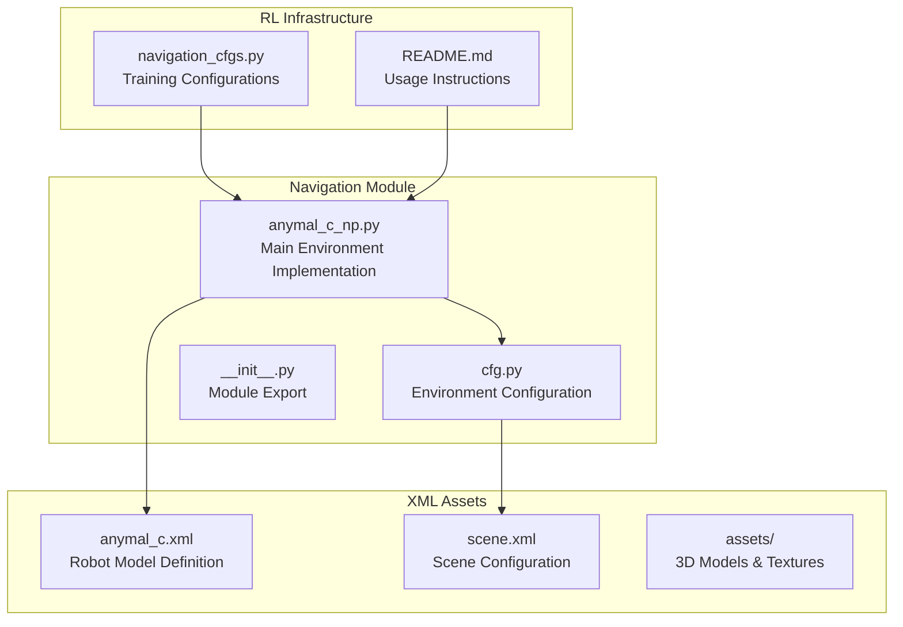
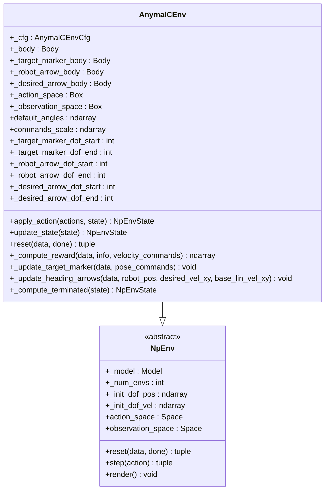
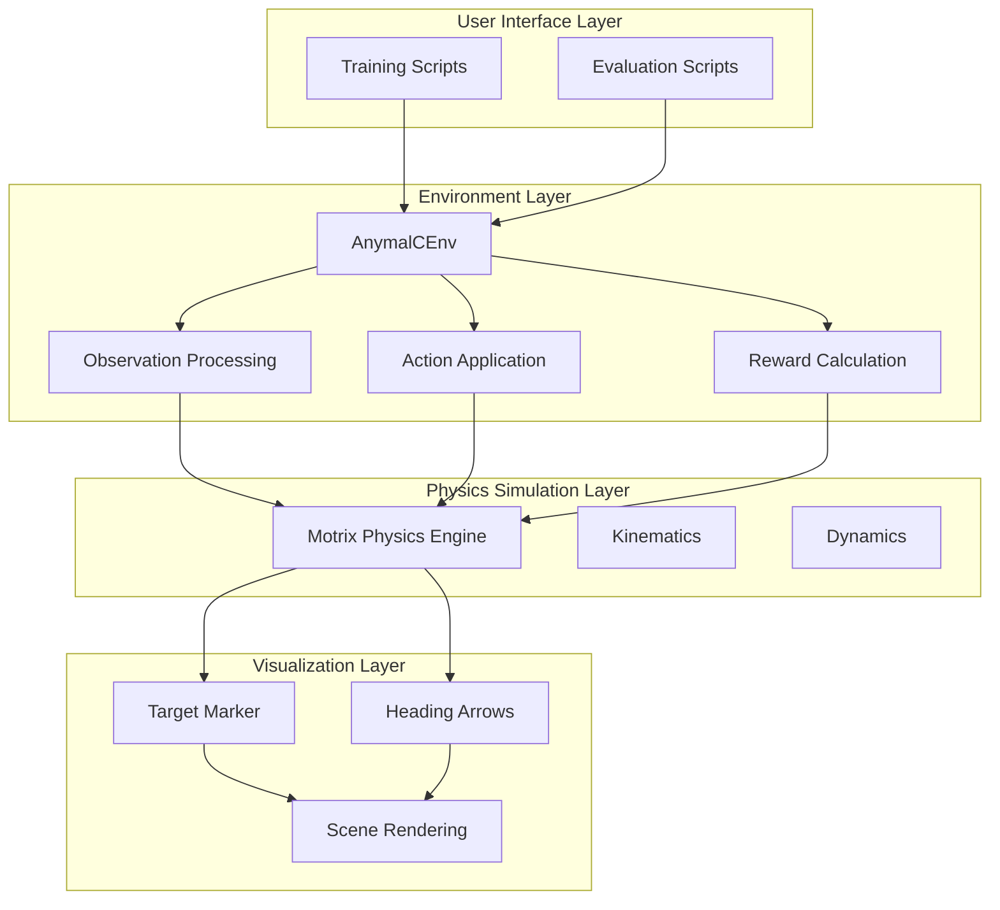
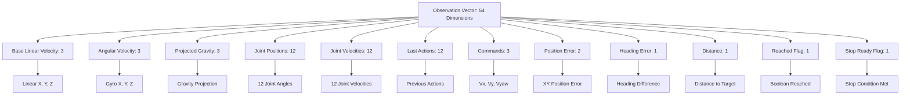
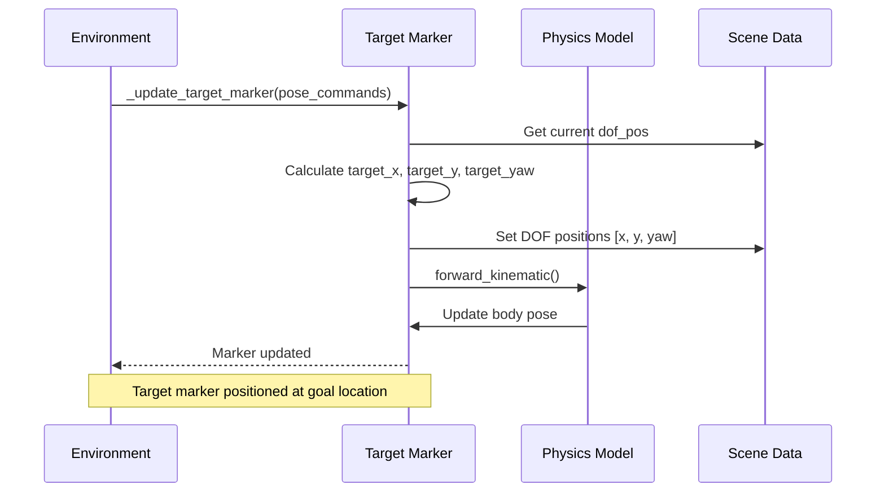
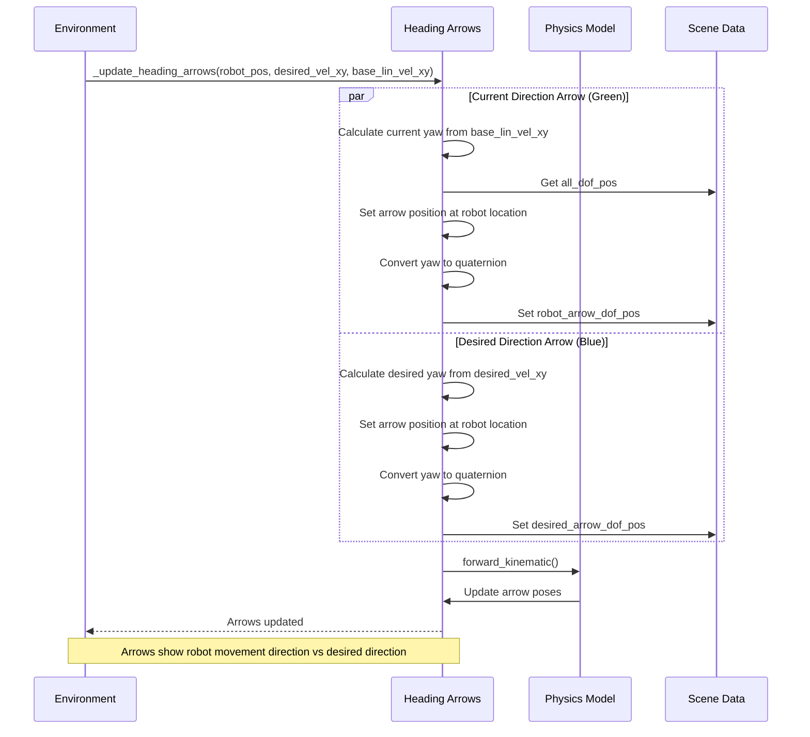
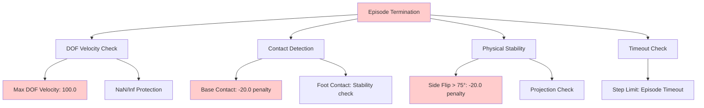

# ANYmal-C Navigation

<cite>
**Referenced Files in This Document**
- [anymal_c_np.py](file://motrix_envs/src/motrix_envs/navigation/anymal_c/anymal_c_np.py)
- [cfg.py](file://motrix_envs/src/motrix_envs/navigation/anymal_c/cfg.py)
- [anymal_c.xml](file://motrix_envs/src/motrix_envs/navigation/anymal_c/xmls/anymal_c.xml)
- [scene.xml](file://motrix_envs/src/motrix_envs/navigation/anymal_c/xmls/scene.xml)
- [README.md](file://motrix_envs/src/motrix_envs/navigation/anymal_c/README.md)
- [__init__.py](file://motrix_envs/src/motrix_envs/navigation/anymal_c/__init__.py)
- [navigation_cfgs.py](file://motrix_rl/src/motrix_rl/cfgs.py)
</cite>

## Table of Contents
1. [Introduction](#introduction)
2. [Project Structure](#project-structure)
3. [Core Components](#core-components)
4. [Architecture Overview](#architecture-overview)
5. [Detailed Component Analysis](#detailed-component-analysis)
6. [Dependency Analysis](#dependency-analysis)
7. [Performance Considerations](#performance-considerations)
8. [Training Strategies](#training-strategies)
9. [Safety Constraints](#safety-constraints)
10. [Troubleshooting Guide](#troubleshooting-guide)
11. [Conclusion](#conclusion)

## Introduction

The ANYmal-C navigation environment provides a comprehensive quadruped robot autonomous navigation system built on the MotrixLab platform. This environment enables training and testing of ANYmal-C robots for autonomous navigation tasks with advanced features including position and heading control, real-time visualization, and sophisticated reward mechanisms.

The environment implements a 12-degree-of-freedom (DoF) quadruped robot navigation system where each leg has three joints (Hip Abduction/Adduction, Hip Flexion/Extension, Knee Flexion/Extension). The robot operates in a flat terrain environment with realistic physics simulation and provides comprehensive feedback for reinforcement learning applications.

## Project Structure

The ANYmal-C navigation environment follows a modular architecture with clear separation between environment configuration, physics simulation, and training infrastructure:



**Diagram sources**
- [anymal_c_np.py](file://motrix_envs/src/motrix_envs/navigation/anymal_c/anymal_c_np.py#L1-L50)
- [cfg.py](file://motrix_envs/src/motrix_envs/navigation/anymal_c/cfg.py#L1-L30)
- [anymal_c.xml](file://motrix_envs/src/motrix_envs/navigation/anymal_c/xmls/anymal_c.xml#L1-L50)

**Section sources**
- [anymal_c_np.py](file://motrix_envs/src/motrix_envs/navigation/anymal_c/anymal_c_np.py#L1-L100)
- [cfg.py](file://motrix_envs/src/motrix_envs/navigation/anymal_c/cfg.py#L1-L50)

## Core Components

### AnymalCEnv Class

The `AnymalCEnv` class serves as the primary interface for the ANYmal-C navigation environment. It inherits from the `NpEnv` base class and implements comprehensive navigation functionality:



**Diagram sources**
- [anymal_c_np.py](file://motrix_envs/src/motrix_envs/navigation/anymal_c/anymal_c_np.py#L27-L70)

### Environment Configuration

The environment configuration system provides comprehensive parameter management through the `AnymalCEnvCfg` dataclass:

| Configuration Category | Parameters | Values |
|----------------------|------------|---------|
| **Model Settings** | `model_file` | `scene.xml` |
| **Timing** | `sim_dt`, `ctrl_dt` | 0.01s each |
| **Episode Limits** | `max_episode_seconds`, `max_episode_steps` | 10s, 1000 steps |
| **Physics** | `max_dof_vel` | 100.0 |
| **Reset** | `reset_noise_scale`, `reset_yaw_scale` | 0.01, 0.1 |

**Section sources**
- [cfg.py](file://motrix_envs/src/motrix_envs/navigation/anymal_c/cfg.py#L95-L115)

## Architecture Overview

The ANYmal-C navigation system implements a sophisticated multi-layered architecture:



**Diagram sources**
- [anymal_c_np.py](file://motrix_envs/src/motrix_envs/navigation/anymal_c/anymal_c_np.py#L28-L50)
- [anymal_c.xml](file://motrix_envs/src/motrix_envs/navigation/anymal_c/xmls/anymal_c.xml#L109-L130)

## Detailed Component Analysis

### Observation Space Structure

The observation space provides comprehensive state information for the ANYmal-C robot with 54 dimensions:



**Diagram sources**
- [anymal_c_np.py](file://motrix_envs/src/motrix_envs/navigation/anymal_c/anymal_c_np.py#L48-L51)

### Reward Function Design

The reward system implements a multi-component reward mechanism designed to encourage efficient navigation:

```mermaid
flowchart TD
A[Reward Calculation] --> B[Velocity Tracking Rewards]
A --> C[Approach Rewards]
A --> D[Stability Penalties]
A --> E[Termination Penalties]
A --> F[Arrival Bonuses]
B --> B1[Linear Velocity Tracking: 1.5 × exp(-error²/σ²)]
B --> B2[Angular Velocity Tracking: 0.3 × exp(-error²/σ²)]
C --> C1[Distance Improvement: 4 × Δdistance]
C --> C2[First-Time Arrival: +10.0]
D --> D1[Z-Axis Velocity Penalty: -2.0 × v_z²]
D --> D2[XY Angular Velocity Penalty: -0.05 × (ω_x² + ω_y²)]
D --> D3[Orientation Deviation Penalty: -0.0 × deviation²]
D --> D4[Torque Penalty: -0.00001 × τ²]
D --> D5[Joint Velocity Penalty: -0.0 × ω_joint²]
D --> D6[Action Rate Penalty: -0.001 × Δaction²]
E --> E1[DOF Velocity Overflow: -20.0]
E --> E2[Base Contact: -20.0]
E --> E3[Side Flip (>75°): -20.0]
F --> F1[Stop Bonus: 2 × (0.8 × exp(-v_xy²/0.2²) + 1.2 × exp(-ω_z⁴/0.1⁴))]
F --> F2[Zero Angular Bonus: +6.0 if ω_z < 0.05]
```

**Diagram sources**
- [anymal_c_np.py](file://motrix_envs/src/motrix_envs/navigation/anymal_c/anymal_c_np.py#L466-L623)

### Target Marker System

The target marker system provides visual feedback for navigation goals:



**Diagram sources**
- [anymal_c_np.py](file://motrix_envs/src/motrix_envs/navigation/anymal_c/anymal_c_np.py#L625-L650)

### Arrow Visualization System

The arrow visualization system provides real-time direction indicators:



**Diagram sources**
- [anymal_c_np.py](file://motrix_envs/src/motrix_envs/navigation/anymal_c/anymal_c_np.py#L377-L434)

**Section sources**
- [anymal_c_np.py](file://motrix_envs/src/motrix_envs/navigation/anymal_c/anymal_c_np.py#L233-L366)
- [anymal_c_np.py](file://motrix_envs/src/motrix_envs/navigation/anymal_c/anymal_c_np.py#L466-L623)

## Dependency Analysis

The ANYmal-C navigation environment has well-defined dependencies and relationships:

```mermaid
graph TB
subgraph "External Dependencies"
A[gymnasium]
B[motrixsim]
C[numpy]
D[quaternion]
end
subgraph "Internal Dependencies"
E[NpEnv (base class)]
F[EnvCfg registry]
G[Quaternion utilities]
H[Registry decorators]
end
subgraph "Environment Components"
I[AnymalCEnv]
J[AnymalCEnvCfg]
K[XML Models]
L[Asset Management]
end
A --> I
B --> I
C --> I
D --> I
E --> I
F --> J
G --> I
H --> I
I --> J
I --> K
J --> L
```

**Diagram sources**
- [anymal_c_np.py](file://motrix_envs/src/motrix_envs/navigation/anymal_c/anymal_c_np.py#L17-L25)
- [cfg.py](file://motrix_envs/src/motrix_envs/navigation/anymal_c/cfg.py#L19-L21)

**Section sources**
- [anymal_c_np.py](file://motrix_envs/src/motrix_envs/navigation/anymal_c/anymal_c_np.py#L1-L30)
- [cfg.py](file://motrix_envs/src/motrix_envs/navigation/anymal_c/cfg.py#L1-L25)

## Performance Considerations

### Computational Optimization

The environment implements several performance optimization strategies:

1. **Vectorized Operations**: All calculations use NumPy vectorization for batch processing
2. **Memory Efficiency**: Single allocation of observation arrays and reuse of intermediate buffers
3. **Early Termination**: Immediate termination checks prevent unnecessary computation
4. **Efficient Contact Detection**: Pre-computed contact matrices reduce collision checking overhead

### Physics Simulation Tuning

The physics simulation parameters are optimized for stable and responsive control:

| Parameter | Value | Purpose |
|-----------|-------|---------|
| `sim_dt` | 0.01s | Simulation time step |
| `ctrl_dt` | 0.01s | Control loop frequency |
| `max_dof_vel` | 100.0 | Velocity safety threshold |
| `reset_noise_scale` | 0.01 | Initial state randomness |
| `reset_yaw_scale` | 0.1 | Initial yaw randomness |

### Training Performance

The RL training configuration supports efficient learning:

- **Parallel Environments**: Up to 2048 environments for rapid exploration
- **Experience Replay**: 48 rollouts per training iteration
- **Mini-batch Size**: 32 for balanced gradient updates
- **Learning Rate**: 3e-4 for stable convergence

**Section sources**
- [navigation_cfgs.py](file://motrix_rl/src/motrix_rl/cfgs.py#L278-L305)

## Training Strategies

### Environment Setup

The training environment requires specific configuration:

1. **Environment Registration**: Add ANYmal-C to navigation module exports
2. **RL Configuration**: Configure PPO hyperparameters for optimal learning
3. **Asset Loading**: Ensure XML models and textures are properly loaded

### Training Hyperparameters

The PPO configuration provides optimal settings for quadruped navigation:

| Parameter | Value | Description |
|-----------|--------|-------------|
| `seed` | 42 | Random seed for reproducibility |
| `num_envs` | 2048 | Parallel training environments |
| `learning_rate` | 3e-4 | Optimizer learning rate |
| `rollouts` | 48 | Experience collection batches |
| `learning_epochs` | 6 | Training epochs per update |
| `mini_batches` | 32 | Mini-batch size for updates |
| `discount_factor` | 0.99 | Reward discounting |
| `lambda_param` | 0.95 | GAE parameter |
| `grad_norm_clip` | 1.0 | Gradient clipping threshold |

### Safety Training Progression

Training should follow a progressive difficulty approach:

1. **Initial Phase**: Large target distances, relaxed thresholds
2. **Intermediate Phase**: Reduced distances, stricter penalties
3. **Final Phase**: Competition scenarios, dynamic obstacles

**Section sources**
- [README.md](file://motrix_envs/src/motrix_envs/navigation/anymal_c/README.md#L45-L53)
- [navigation_cfgs.py](file://motrix_rl/src/motrix_rl/cfgs.py#L278-L305)

## Safety Constraints

### Termination Conditions

The environment implements comprehensive safety mechanisms:



**Diagram sources**
- [anymal_c_np.py](file://motrix_envs/src/motrix_envs/navigation/anymal_c/anymal_c_np.py#L667-L713)

### Action Safety Mechanisms

The action application includes multiple safety layers:

1. **Action Scaling**: Prevents excessive joint movements
2. **Velocity Limits**: Protects against dangerous speeds
3. **Torque Limits**: Respects actuator capabilities
4. **Joint Angle Limits**: Maintains mechanical safety

### Sensor Noise Modeling

The environment includes realistic sensor noise modeling:

| Sensor Type | Noise Level | Impact |
|-------------|-------------|---------|
| Joint Angle | ±0.03 rad | Position accuracy |
| Joint Velocity | ±1.5 rad/s | Velocity measurement |
| Gyroscope | ±0.2 rad/s | Angular rate |
| Accelerometer | ±0.05 m/s² | Linear acceleration |
| Linear Velocity | ±0.1 m/s | Speed measurement |

**Section sources**
- [cfg.py](file://motrix_envs/src/motrix_envs/navigation/anymal_c/cfg.py#L19-L26)
- [anymal_c_np.py](file://motrix_envs/src/motrix_envs/navigation/anymal_c/anymal_c_np.py#L471-L496)

## Troubleshooting Guide

### Common Issues and Solutions

#### Environment Initialization Problems

**Issue**: Robot falls immediately after reset
**Solution**: Check initial position constraints and ensure proper quaternion normalization

#### Training Instability

**Issue**: Reward oscillates or becomes negative
**Solution**: Adjust reward scaling factors and ensure proper termination conditions

#### Visualization Issues

**Problem**: Target markers or arrows not visible
**Solution**: Verify DOF indexing and ensure forward kinematic updates

#### Performance Degradation

**Issue**: Slow training performance
**Solution**: Reduce `num_envs` or adjust `mini_batches` size

### Debugging Tools

The environment provides built-in debugging capabilities:

1. **Metric Logging**: Periodic statistics on position error, heading error, and velocity
2. **Termination Tracking**: Detailed breakdown of termination causes
3. **Reward Component Analysis**: Individual reward contribution tracking

**Section sources**
- [anymal_c_np.py](file://motrix_envs/src/motrix_envs/navigation/anymal_c/anymal_c_np.py#L348-L365)
- [anymal_c_np.py](file://motrix_envs/src/motrix_envs/navigation/anymal_c/anymal_c_np.py#L704-L712)

## Conclusion

The ANYmal-C navigation environment provides a comprehensive platform for quadruped robot autonomous navigation research and development. The environment successfully combines realistic physics simulation with sophisticated control systems, enabling efficient training of complex navigation behaviors.

Key strengths of the implementation include:

- **Realistic Physics**: Accurate simulation of quadruped dynamics and contact mechanics
- **Comprehensive Feedback**: Rich observation space capturing multiple aspects of robot state
- **Safety First Design**: Multiple layers of safety mechanisms preventing dangerous conditions
- **Visual Feedback**: Real-time visualization aids both training and debugging
- **Scalable Architecture**: Modular design supporting various training configurations

The environment serves as an excellent foundation for advancing quadruped navigation research and can be extended to support more complex scenarios including dynamic obstacles, multi-robot coordination, and challenging terrains.

Future enhancements could include support for rough terrain navigation, dynamic obstacle avoidance, and multi-modal sensor integration for more robust navigation capabilities.