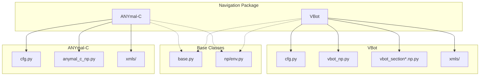
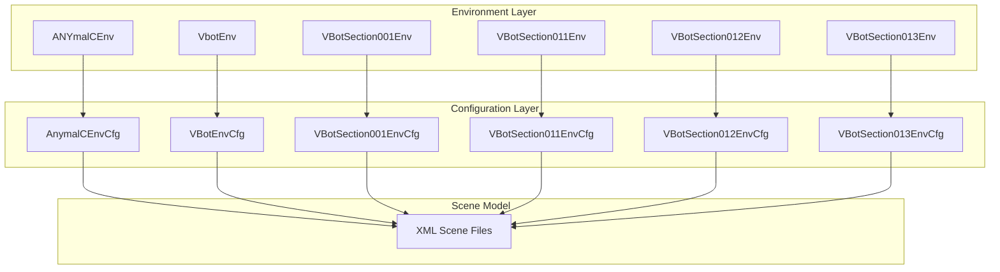
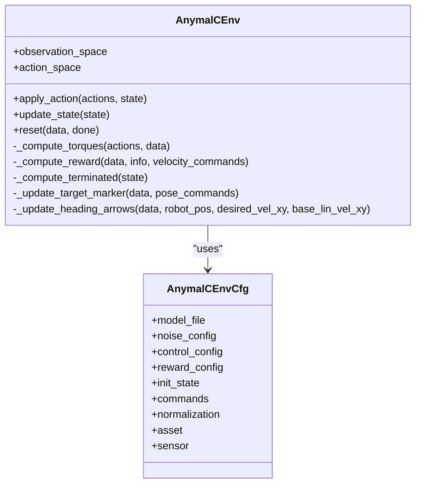
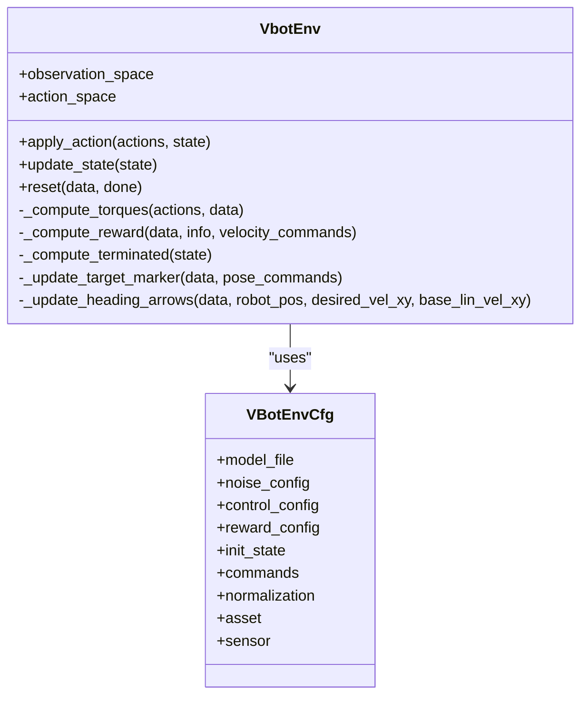
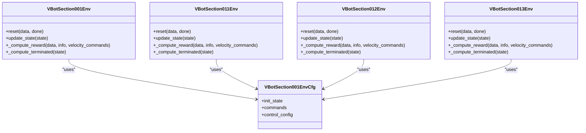
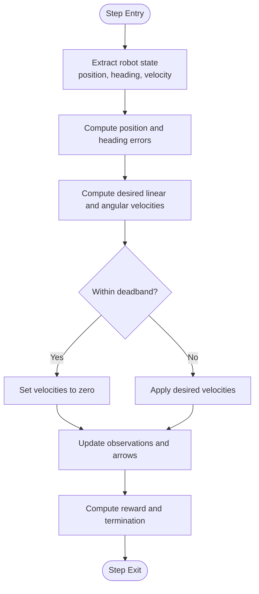
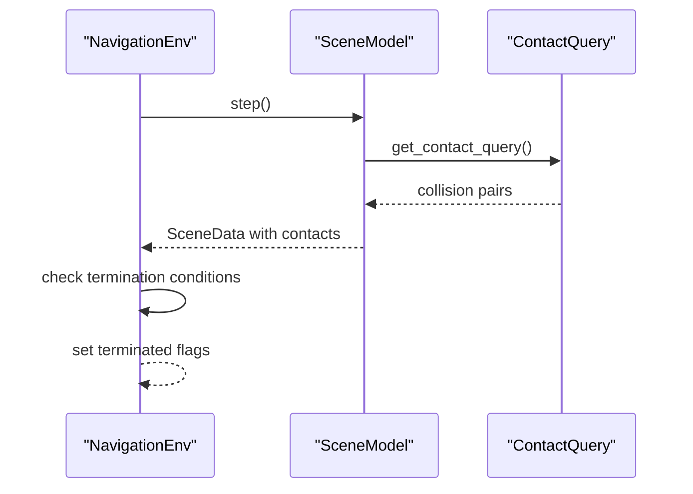
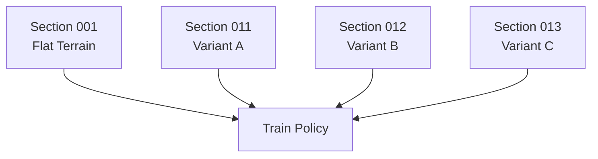
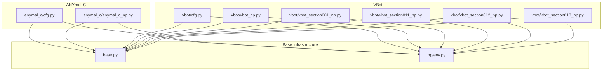

# Navigation Environments

<cite>
**Referenced Files in This Document**
- [anymal_c/__init__.py](file://motrix_envs/src/motrix_envs/navigation/anymal_c/__init__.py)
- [anymal_c/cfg.py](file://motrix_envs/src/motrix_envs/navigation/anymal_c/cfg.py)
- [anymal_c/anymal_c_np.py](file://motrix_envs/src/motrix_envs/navigation/anymal_c/anymal_c_np.py)
- [vbot/__init__.py](file://motrix_envs/src/motrix_envs/navigation/vbot/__init__.py)
- [vbot/cfg.py](file://motrix_envs/src/motrix_envs/navigation/vbot/cfg.py)
- [vbot/vbot_np.py](file://motrix_envs/src/motrix_envs/navigation/vbot/vbot_np.py)
- [vbot/vbot_section001_np.py](file://motrix_envs/src/motrix_envs/navigation/vbot/vbot_section001_np.py)
- [vbot/vbot_section011_np.py](file://motrix_envs/src/motrix_envs/navigation/vbot/vbot_section011_np.py)
- [vbot/vbot_section012_np.py](file://motrix_envs/src/motrix_envs/navigation/vbot/vbot_section012_np.py)
- [vbot/vbot_section013_np.py](file://motrix_envs/src/motrix_envs/navigation/vbot/vbot_section013_np.py)
- [base.py](file://motrix_envs/src/motrix_envs/base.py)
- [np/env.py](file://motrix_envs/src/motrix_envs/np/env.py)
</cite>

## Table of Contents
1. [Introduction](#introduction)
2. [Project Structure](#project-structure)
3. [Core Components](#core-components)
4. [Architecture Overview](#architecture-overview)
5. [Detailed Component Analysis](#detailed-component-analysis)
6. [Dependency Analysis](#dependency-analysis)
7. [Performance Considerations](#performance-considerations)
8. [Troubleshooting Guide](#troubleshooting-guide)
9. [Conclusion](#conclusion)

## Introduction
This document provides comprehensive technical documentation for the navigation environments focused on autonomous robot navigation and path planning within the MotrixLab-S1 project. It covers the ANYmal-C and VBot navigation environments, detailing robot localization, mapping, and navigation capabilities. The document explains the implementation of various navigation scenarios, including waypoint following, obstacle avoidance, and multi-section navigation tracks. It also documents configuration parameters for sensor models, map representation, and navigation policies, along with training strategies for autonomous navigation, including exploration-exploitation trade-offs and reward shaping for safe navigation. Finally, it addresses the integration with SLAM algorithms and path planning modules, highlighting challenges in real-world navigation scenarios.

## Project Structure
The navigation environments are organized under the `motrix_envs/src/motrix_envs/navigation/` directory, with separate packages for ANYmal-C and VBot. Each environment package contains:
- Configuration classes defining environment parameters (sensor models, reward functions, control parameters, normalization factors)
- Environment implementations inheriting from a common NumPy-based environment base class
- XML scene files defining the physical world and robot models
- Optional section-specific environments for multi-section navigation tracks

**Diagram sources**
- [anymal_c/__init__.py](file://motrix_envs/src/motrix_envs/navigation/anymal_c/__init__.py#L16-L19)
- [vbot/__init__.py](file://motrix_envs/src/motrix_envs/navigation/vbot/__init__.py#L16-L32)
- [base.py](file://motrix_envs/src/motrix_envs/base.py#L23-L85)
- [np/env.py](file://motrix_envs/src/motrix_envs/np/env.py#L52-L209)

**Section sources**
- [anymal_c/__init__.py](file://motrix_envs/src/motrix_envs/navigation/anymal_c/__init__.py#L16-L19)
- [vbot/__init__.py](file://motrix_envs/src/motrix_envs/navigation/vbot/__init__.py#L16-L32)
- [base.py](file://motrix_envs/src/motrix_envs/base.py#L23-L85)
- [np/env.py](file://motrix_envs/src/motrix_envs/np/env.py#L52-L209)

## Core Components
This section outlines the core components shared across navigation environments, focusing on configuration, state management, and the environment lifecycle.

- Environment configuration base (`EnvCfg`): Defines simulation parameters such as timestep, episode duration, and rendering spacing. It computes derived quantities like maximum steps and simulation substeps.
- NumPy environment base (`NpEnv`): Provides the environment lifecycle, including initialization, physics stepping, action application, state updates, and reset logic for done environments.
- Registry decorators: Environments are registered via decorators that bind environment names to their implementations and configurations.

Key responsibilities:
- Configuration validation ensures sim_dt ≤ ctrl_dt.
- Simulation substeps compute how many simulation timesteps occur per control step.
- Environment state encapsulates observations, rewards, termination/truncation flags, and auxiliary info.

**Section sources**
- [base.py](file://motrix_envs/src/motrix_envs/base.py#L23-L85)
- [np/env.py](file://motrix_envs/src/motrix_envs/np/env.py#L52-L209)

## Architecture Overview
The navigation environments follow a layered architecture:
- Base configuration and environment abstractions define the interface and lifecycle.
- Environment-specific implementations handle robot dynamics, sensors, reward computation, and termination conditions.
- Scene models loaded from XML define the physical world and robot kinematics.

**Diagram sources**
- [anymal_c/anymal_c_np.py](file://motrix_envs/src/motrix_envs/navigation/anymal_c/anymal_c_np.py#L26-L31)
- [vbot/vbot_np.py](file://motrix_envs/src/motrix_envs/navigation/vbot/vbot_np.py#L39-L46)
- [vbot/vbot_section001_np.py](file://motrix_envs/src/motrix_envs/navigation/vbot/vbot_section001_np.py#L40-L47)
- [vbot/vbot_section011_np.py](file://motrix_envs/src/motrix_envs/navigation/vbot/vbot_section011_np.py#L40-L47)
- [vbot/vbot_section012_np.py](file://motrix_envs/src/motrix_envs/navigation/vbot/vbot_section012_np.py#L40-L47)
- [vbot/vbot_section013_np.py](file://motrix_envs/src/motrix_envs/navigation/vbot/vbot_section013_np.py#L40-L47)
- [anymal_c/cfg.py](file://motrix_envs/src/motrix_envs/navigation/anymal_c/cfg.py#L95-L116)
- [vbot/cfg.py](file://motrix_envs/src/motrix_envs/navigation/vbot/cfg.py#L118-L138)

## Detailed Component Analysis

### ANYmal-C Navigation Environment
The ANYmal-C environment implements a flat-ground navigation scenario with waypoint following and orientation control. It provides:
- Action space: 12-dimensional joint torque commands
- Observation space: 54-dimensional vector combining sensor readings, joint states, previous actions, and task-relevant metrics
- Reward function: Balances linear/angular velocity tracking, approach progress, posture stability, and termination penalties
- Termination conditions: Joint velocity limits, base-ground collisions, and excessive tilts

Key implementation details:
- DOF indexing for target marker, base pose, and arrows for visualization
- PD-like torque computation from desired joint positions
- Velocity commands computed via proportional controllers for position and heading
- Reward shaping emphasizes reaching targets while penalizing excessive accelerations and torques

**Diagram sources**
- [anymal_c/anymal_c_np.py](file://motrix_envs/src/motrix_envs/navigation/anymal_c/anymal_c_np.py#L26-L367)
- [anymal_c/cfg.py](file://motrix_envs/src/motrix_envs/navigation/anymal_c/cfg.py#L95-L116)

**Section sources**
- [anymal_c/anymal_c_np.py](file://motrix_envs/src/motrix_envs/navigation/anymal_c/anymal_c_np.py#L26-L367)
- [anymal_c/cfg.py](file://motrix_envs/src/motrix_envs/navigation/anymal_c/cfg.py#L18-L116)

### VBot Navigation Environment
The VBot environment supports multiple terrains and navigation scenarios:
- Flat navigation: Waypoint following with orientation control
- Stairs navigation: Enhanced termination and reward handling for staircases
- Multi-section tracks: Separate environments for distinct track sections (001, 011, 012, 013)

Core features:
- Action space: 12-dimensional joint torque commands
- Observation space: 54-dimensional vector similar to ANYmal-C
- Reward function: Emphasizes position tracking, fine position tracking, forward velocity, and stability penalties
- Termination: Base-ground contact detection via sensors and collision queries

**Diagram sources**
- [vbot/vbot_np.py](file://motrix_envs/src/motrix_envs/navigation/vbot/vbot_np.py#L39-L504)
- [vbot/cfg.py](file://motrix_envs/src/motrix_envs/navigation/vbot/cfg.py#L118-L138)

**Section sources**
- [vbot/vbot_np.py](file://motrix_envs/src/motrix_envs/navigation/vbot/vbot_np.py#L39-L504)
- [vbot/cfg.py](file://motrix_envs/src/motrix_envs/navigation/vbot/cfg.py#L24-L138)

### VBot Section Environments
The section-specific environments (001, 011, 012, 013) tailor initialization, command ranges, and reward configurations for distinct track layouts. They share the same observation/reward structure but differ in:
- Spawn area and height initialization
- Target command ranges aligned with track geometry
- Termination handling adapted to section-specific constraints

**Diagram sources**
- [vbot/vbot_section001_np.py](file://motrix_envs/src/motrix_envs/navigation/vbot/vbot_section001_np.py#L40-L778)
- [vbot/vbot_section011_np.py](file://motrix_envs/src/motrix_envs/navigation/vbot/vbot_section011_np.py#L40-L678)
- [vbot/vbot_section012_np.py](file://motrix_envs/src/motrix_envs/navigation/vbot/vbot_section012_np.py#L40-L678)
- [vbot/vbot_section013_np.py](file://motrix_envs/src/motrix_envs/navigation/vbot/vbot_section013_np.py#L40-L678)
- [vbot/cfg.py](file://motrix_envs/src/motrix_envs/navigation/vbot/cfg.py#L357-L421)

**Section sources**
- [vbot/vbot_section001_np.py](file://motrix_envs/src/motrix_envs/navigation/vbot/vbot_section001_np.py#L40-L778)
- [vbot/vbot_section011_np.py](file://motrix_envs/src/motrix_envs/navigation/vbot/vbot_section011_np.py#L40-L678)
- [vbot/vbot_section012_np.py](file://motrix_envs/src/motrix_envs/navigation/vbot/vbot_section012_np.py#L40-L678)
- [vbot/vbot_section013_np.py](file://motrix_envs/src/motrix_envs/navigation/vbot/vbot_section013_np.py#L40-L678)
- [vbot/cfg.py](file://motrix_envs/src/motrix_envs/navigation/vbot/cfg.py#L357-L619)

### Navigation Scenarios and Algorithms

#### Waypoint Following
Both ANYmal-C and VBot environments implement waypoint following through:
- Computing desired linear and angular velocities from position and heading errors
- Applying proportional control with deadbands to avoid oscillations
- Updating visualization arrows to reflect desired vs. actual motion

**Diagram sources**
- [anymal_c/anymal_c_np.py](file://motrix_envs/src/motrix_envs/navigation/anymal_c/anymal_c_np.py#L256-L290)
- [vbot/vbot_np.py](file://motrix_envs/src/motrix_envs/navigation/vbot/vbot_np.py#L426-L447)

**Section sources**
- [anymal_c/anymal_c_np.py](file://motrix_envs/src/motrix_envs/navigation/anymal_c/anymal_c_np.py#L256-L290)
- [vbot/vbot_np.py](file://motrix_envs/src/motrix_envs/navigation/vbot/vbot_np.py#L426-L447)

#### Obstacle Avoidance
Obstacle avoidance is implicitly handled through:
- Termination conditions that detect base-ground collisions and excessive tilts
- Reward penalties for large accelerations, torques, and unstable postures
- Contact queries for detecting collisions during simulation steps

**Diagram sources**
- [anymal_c/anymal_c_np.py](file://motrix_envs/src/motrix_envs/navigation/anymal_c/anymal_c_np.py#L482-L486)
- [vbot/vbot_np.py](file://motrix_envs/src/motrix_envs/navigation/vbot/vbot_np.py#L509-L526)

**Section sources**
- [anymal_c/anymal_c_np.py](file://motrix_envs/src/motrix_envs/navigation/anymal_c/anymal_c_np.py#L482-L486)
- [vbot/vbot_np.py](file://motrix_envs/src/motrix_envs/navigation/vbot/vbot_np.py#L509-L526)

#### Multi-Section Navigation Tracks
The VBot section environments enable staged training across distinct track layouts:
- Section 001: Flat terrain with controlled spawn and target ranges
- Section 011/012/013: Variants with specific spawn heights and target regions
- Shared reward and termination logic with environment-specific initialization

**Diagram sources**
- [vbot/vbot_section001_np.py](file://motrix_envs/src/motrix_envs/navigation/vbot/vbot_section001_np.py#L780-L796)
- [vbot/vbot_section011_np.py](file://motrix_envs/src/motrix_envs/navigation/vbot/vbot_section011_np.py#L494-L511)
- [vbot/vbot_section012_np.py](file://motrix_envs/src/motrix_envs/navigation/vbot/vbot_section012_np.py#L494-L511)
- [vbot/vbot_section013_np.py](file://motrix_envs/src/motrix_envs/navigation/vbot/vbot_section013_np.py#L494-L511)

**Section sources**
- [vbot/vbot_section001_np.py](file://motrix_envs/src/motrix_envs/navigation/vbot/vbot_section001_np.py#L780-L796)
- [vbot/vbot_section011_np.py](file://motrix_envs/src/motrix_envs/navigation/vbot/vbot_section011_np.py#L494-L511)
- [vbot/vbot_section012_np.py](file://motrix_envs/src/motrix_envs/navigation/vbot/vbot_section012_np.py#L494-L511)
- [vbot/vbot_section013_np.py](file://motrix_envs/src/motrix_envs/navigation/vbot/vbot_section013_np.py#L494-L511)

## Dependency Analysis
The navigation environments depend on a shared base infrastructure and environment lifecycle:

**Diagram sources**
- [anymal_c/cfg.py](file://motrix_envs/src/motrix_envs/navigation/anymal_c/cfg.py#L13-L14)
- [anymal_c/anymal_c_np.py](file://motrix_envs/src/motrix_envs/navigation/anymal_c/anymal_c_np.py#L21-L24)
- [vbot/cfg.py](file://motrix_envs/src/motrix_envs/navigation/vbot/cfg.py#L19-L20)
- [vbot/vbot_np.py](file://motrix_envs/src/motrix_envs/navigation/vbot/vbot_np.py#L21-L25)
- [vbot/vbot_section001_np.py](file://motrix_envs/src/motrix_envs/navigation/vbot/vbot_section001_np.py#L20-L24)
- [vbot/vbot_section011_np.py](file://motrix_envs/src/motrix_envs/navigation/vbot/vbot_section011_np.py#L20-L23)
- [vbot/vbot_section012_np.py](file://motrix_envs/src/motrix_envs/navigation/vbot/vbot_section012_np.py#L20-L23)
- [vbot/vbot_section013_np.py](file://motrix_envs/src/motrix_envs/navigation/vbot/vbot_section013_np.py#L20-L23)
- [base.py](file://motrix_envs/src/motrix_envs/base.py#L16-L24)
- [np/env.py](file://motrix_envs/src/motrix_envs/np/env.py#L16-L24)

**Section sources**
- [anymal_c/cfg.py](file://motrix_envs/src/motrix_envs/navigation/anymal_c/cfg.py#L13-L14)
- [anymal_c/anymal_c_np.py](file://motrix_envs/src/motrix_envs/navigation/anymal_c/anymal_c_np.py#L21-L24)
- [vbot/cfg.py](file://motrix_envs/src/motrix_envs/navigation/vbot/cfg.py#L19-L20)
- [vbot/vbot_np.py](file://motrix_envs/src/motrix_envs/navigation/vbot/vbot_np.py#L21-L25)
- [vbot/vbot_section001_np.py](file://motrix_envs/src/motrix_envs/navigation/vbot/vbot_section001_np.py#L20-L24)
- [vbot/vbot_section011_np.py](file://motrix_envs/src/motrix_envs/navigation/vbot/vbot_section011_np.py#L20-L23)
- [vbot/vbot_section012_np.py](file://motrix_envs/src/motrix_envs/navigation/vbot/vbot_section012_np.py#L20-L23)
- [vbot/vbot_section013_np.py](file://motrix_envs/src/motrix_envs/navigation/vbot/vbot_section013_np.py#L20-L23)
- [base.py](file://motrix_envs/src/motrix_envs/base.py#L16-L24)
- [np/env.py](file://motrix_envs/src/motrix_envs/np/env.py#L16-L24)

## Performance Considerations
- Simulation fidelity: The base configuration defines sim_dt and ctrl_dt, with sim_substeps computed automatically. Ensure sim_dt ≤ ctrl_dt to maintain stability.
- Episode length: max_episode_steps is derived from max_episode_seconds and ctrl_dt. Adjust for longer or shorter episodes depending on scenario complexity.
- Observation normalization: Normalization factors for linear velocity, angular velocity, joint positions, and joint velocities help stabilize learning by keeping inputs in reasonable ranges.
- Reward shaping: Balancing reward weights prevents overfitting to specific metrics. Excessive penalties for torques or accelerations can hinder exploration.
- Termination thresholds: Properly tuned termination conditions prevent early stops while ensuring safety.

[No sources needed since this section provides general guidance]

## Troubleshooting Guide
Common issues and resolutions:
- Excessive termination: If environments frequently terminate due to collisions or tilts, review termination contact matrices and tilt thresholds. Consider relaxing thresholds during early training.
- Reward instability: Large spikes or NaN values in rewards often stem from unnormalized observations or extreme actions. Verify normalization coefficients and action scaling.
- Visualization artifacts: Arrow orientations rely on DOF indices. Mismatches in DOF indexing can cause incorrect arrow placement. Validate DOF indices for target marker and arrows.
- Sensor availability: Some environments rely on specific sensors (e.g., base_contact). If unavailable, fallback logic may disable certain termination checks. Ensure sensor names match XML definitions.

**Section sources**
- [anymal_c/anymal_c_np.py](file://motrix_envs/src/motrix_envs/navigation/anymal_c/anymal_c_np.py#L667-L713)
- [vbot/vbot_np.py](file://motrix_envs/src/motrix_envs/navigation/vbot/vbot_np.py#L540-L588)
- [vbot/vbot_section001_np.py](file://motrix_envs/src/motrix_envs/navigation/vbot/vbot_section001_np.py#L590-L778)

## Conclusion
The navigation environments provide robust, configurable platforms for autonomous robot navigation research. The ANYmal-C and VBot environments demonstrate practical implementations of waypoint following, orientation control, and multi-section navigation. Their modular design, clear separation of concerns, and extensive configuration options facilitate experimentation with diverse navigation scenarios. By leveraging the provided configuration parameters, reward shaping strategies, and termination logic, researchers can develop and evaluate navigation policies that generalize across terrains and tasks.