# Navigation Environments

<cite>
**Referenced Files in This Document**
- [anymal_c/__init__.py](file://motrix_envs/src/motrix_envs/navigation/anymal_c/__init__.py)
- [anymal_c/cfg.py](file://motrix_envs/src/motrix_envs/navigation/anymal_c/cfg.py)
- [anymal_c/anymal_c_np.py](file://motrix_envs/src/motrix_envs/navigation/anymal_c/anymal_c_np.py)
- [vbot/__init__.py](file://motrix_envs/src/motrix_envs/navigation/vbot/__init__.py)
- [vbot/cfg.py](file://motrix_envs/src/motrix_envs/navigation/vbot/cfg.py)
- [vbot/vbot_np.py](file://motrix_envs/src/motrix_envs/navigation/vbot/vbot_np.py)
- [vbot/vbot_section001_np.py](file://motrix_envs/src/motrix_envs/navigation/vbot/vbot_section001_np.py)
- [vbot/vbot_section011_np.py](file://motrix_envs/src/motrix_envs/navigation/vbot/vbot_section011_np.py)
- [vbot/vbot_section012_np.py](file://motrix_envs/src/motrix_envs/navigation/vbot/vbot_section012_np.py)
- [vbot/vbot_section013_np.py](file://motrix_envs/src/motrix_envs/navigation/vbot/vbot_section013_np.py)
- [vbot/vbot_section002_waypoint_np.py](file://motrix_envs/src/motrix_envs/navigation/vbot/vbot_section002_waypoint_np.py)
- [base.py](file://motrix_envs/src/motrix_envs/base.py)
- [np/env.py](file://motrix_envs/src/motrix_envs/np/env.py)
</cite>

## Update Summary
**Changes Made**
- Enhanced documentation for the new sequential waypoint visiting system with ordered waypoint management
- Updated waypoint detection mechanisms with improved sensor processing logic and dual-mode detection
- Added comprehensive debugging capabilities documentation for waypoint system troubleshooting
- Documented the advanced waypoint configuration system with dynamic difficulty scaling
- Updated navigation scenarios to include sophisticated waypoint-based path following with ordered completion

## Table of Contents
1. [Introduction](#introduction)
2. [Project Structure](#project-structure)
3. [Core Components](#core-components)
4. [Architecture Overview](#architecture-overview)
5. [Detailed Component Analysis](#detailed-component-analysis)
6. [Enhanced Waypoint Navigation System](#enhanced-waypoint-navigation-system)
7. [Dynamic Difficulty Scaling](#dynamic-difficulty-scaling)
8. [Natural Robot Behaviors](#natural-robot-behaviors)
9. [Debugging and Troubleshooting](#debugging-and-troubleshooting)
10. [Dependency Analysis](#dependency-analysis)
11. [Performance Considerations](#performance-considerations)
12. [Conclusion](#conclusion)

## Introduction
This document provides comprehensive technical documentation for the navigation environments focused on autonomous robot navigation and path planning within the MotrixLab-S1 project. It covers the ANYmal-C and VBot navigation environments, detailing robot localization, mapping, and navigation capabilities. The document explains the implementation of various navigation scenarios, including waypoint following, obstacle avoidance, and multi-section navigation tracks. It also documents configuration parameters for sensor models, map representation, and navigation policies, along with training strategies for autonomous navigation, including exploration-exploitation trade-offs and reward shaping for safe navigation. Finally, it addresses the integration with SLAM algorithms and path planning modules, highlighting challenges in real-world navigation scenarios.

**Updated** Added comprehensive documentation for the enhanced waypoint navigation system featuring sequential waypoint visiting, improved sensor processing logic, and advanced debugging capabilities for reliable path following in complex navigation scenarios.

## Project Structure
The navigation environments are organized under the `motrix_envs/src/motrix_envs/navigation/` directory, with separate packages for ANYmal-C and VBot. Each environment package contains:
- Configuration classes defining environment parameters (sensor models, reward functions, control parameters, normalization factors)
- Environment implementations inheriting from a common NumPy-based environment base class
- XML scene files defining the physical world and robot models
- Optional section-specific environments for multi-section navigation tracks
- **Enhanced**: Waypoint-enabled environments with sophisticated path following capabilities and ordered waypoint management

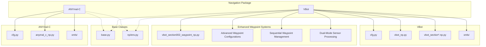
```mermaid
graph TB
subgraph "Navigation Package"
A["ANYmal-C"]
B["VBot"]
end
subgraph "ANYmal-C"
A1["cfg.py"]
A2["anymal_c_np.py"]
A3["xmls/"]
end
subgraph "VBot"
B1["cfg.py"]
B2["vbot_np.py"]
B3["vbot_section*.np.py"]
B4["xmls/"]
end
subgraph "Enhanced Waypoint Systems"
B5["vbot_section002_waypoint_np.py"]
B6["Advanced Waypoint Configurations"]
B7["Sequential Waypoint Management"]
B8["Dual-Mode Sensor Processing"]
end
subgraph "Base Classes"
C["base.py"]
D["np/env.py"]
end
A --> A1
A --> A2
A --> A3
B --> B1
B --> B2
B --> B3
B --> B4
B --> B5
B --> B6
B --> B7
B --> B8
A -.-> C
B -.-> C
A -.-> D
B -.-> D
```

**Diagram sources**
- [anymal_c/__init__.py](file://motrix_envs/src/motrix_envs/navigation/anymal_c/__init__.py#L16-L19)
- [vbot/__init__.py](file://motrix_envs/src/motrix_envs/navigation/vbot/__init__.py#L16-L32)
- [vbot/vbot_section002_waypoint_np.py](file://motrix_envs/src/motrix_envs/navigation/vbot/vbot_section002_waypoint_np.py#L142-L166)
- [base.py](file://motrix_envs/src/motrix_envs/base.py#L23-L85)
- [np/env.py](file://motrix_envs/src/motrix_envs/np/env.py#L52-L209)

**Section sources**
- [anymal_c/__init__.py](file://motrix_envs/src/motrix_envs/navigation/anymal_c/__init__.py#L16-L19)
- [vbot/__init__.py](file://motrix_envs/src/motrix_envs/navigation/vbot/__init__.py#L16-L32)
- [vbot/vbot_section002_waypoint_np.py](file://motrix_envs/src/motrix_envs/navigation/vbot/vbot_section002_waypoint_np.py#L142-L166)
- [base.py](file://motrix_envs/src/motrix_envs/base.py#L23-L85)
- [np/env.py](file://motrix_envs/src/motrix_envs/np/env.py#L52-L209)

## Core Components
This section outlines the core components shared across navigation environments, focusing on configuration, state management, and the environment lifecycle.

- Environment configuration base (`EnvCfg`): Defines simulation parameters such as timestep, episode duration, and rendering spacing. It computes derived quantities like maximum steps and simulation substeps.
- NumPy environment base (`NpEnv`): Provides the environment lifecycle, including initialization, physics stepping, action application, state updates, and reset logic for done environments.
- Registry decorators: Environments are registered via decorators that bind environment names to their implementations and configurations.

Key responsibilities:
- Configuration validation ensures sim_dt ≤ ctrl_dt.
- Simulation substeps compute how many simulation timesteps occur per control step.
- Environment state encapsulates observations, rewards, termination/truncation flags, and auxiliary info.

**Section sources**
- [base.py](file://motrix_envs/src/motrix_envs/base.py#L23-L85)
- [np/env.py](file://motrix_envs/src/motrix_envs/np/env.py#L52-L209)

## Architecture Overview
The navigation environments follow a layered architecture:
- Base configuration and environment abstractions define the interface and lifecycle.
- Environment-specific implementations handle robot dynamics, sensors, reward computation, and termination conditions.
- Scene models loaded from XML define the physical world and robot kinematics.
- **Enhanced**: Waypoint systems provide sophisticated path following with sequential waypoint completion, ordered management, and dual-mode sensor processing.

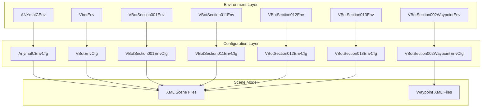
```mermaid
graph TB
subgraph "Environment Layer"
E1["ANYmalCEnv"]
E2["VbotEnv"]
E3["VBotSection001Env"]
E4["VBotSection011Env"]
E5["VBotSection012Env"]
E6["VBotSection013Env"]
E7["VBotSection002WaypointEnv"]
end
subgraph "Configuration Layer"
C1["AnymalCEnvCfg"]
C2["VBotEnvCfg"]
C3["VBotSection001EnvCfg"]
C4["VBotSection011EnvCfg"]
C5["VBotSection012EnvCfg"]
C6["VBotSection013EnvCfg"]
C7["VBotSection002WaypointEnvCfg"]
end
subgraph "Scene Model"
S1["XML Scene Files"]
S2["Waypoint XML Files"]
end
E1 --> C1
E2 --> C2
E3 --> C3
E4 --> C4
E5 --> C5
E6 --> C6
E7 --> C7
C1 --> S1
C2 --> S1
C3 --> S1
C4 --> S1
C5 --> S1
C6 --> S1
C7 --> S2
```

**Diagram sources**
- [anymal_c/anymal_c_np.py](file://motrix_envs/src/motrix_envs/navigation/anymal_c/anymal_c_np.py#L26-L31)
- [vbot/vbot_np.py](file://motrix_envs/src/motrix_envs/navigation/vbot/vbot_np.py#L39-L46)
- [vbot/vbot_section001_np.py](file://motrix_envs/src/motrix_envs/navigation/vbot/vbot_section001_np.py#L40-L47)
- [vbot/vbot_section011_np.py](file://motrix_envs/src/motrix_envs/navigation/vbot/vbot_section011_np.py#L40-L47)
- [vbot/vbot_section012_np.py](file://motrix_envs/src/motrix_envs/navigation/vbot/vbot_section012_np.py#L40-L47)
- [vbot/vbot_section013_np.py](file://motrix_envs/src/motrix_envs/navigation/vbot/vbot_section013_np.py#L40-L47)
- [vbot/vbot_section002_waypoint_np.py](file://motrix_envs/src/motrix_envs/navigation/vbot/vbot_section002_waypoint_np.py#L27-L34)
- [anymal_c/cfg.py](file://motrix_envs/src/motrix_envs/navigation/anymal_c/cfg.py#L95-L116)
- [vbot/cfg.py](file://motrix_envs/src/motrix_envs/navigation/vbot/cfg.py#L118-L138)
- [vbot/cfg.py](file://motrix_envs/src/motrix_envs/navigation/vbot/cfg.py#L752-L867)

## Detailed Component Analysis

### ANYmal-C Navigation Environment
The ANYmal-C environment implements a flat-ground navigation scenario with waypoint following and orientation control. It provides:
- Action space: 12-dimensional joint torque commands
- Observation space: 54-dimensional vector combining sensor readings, joint states, previous actions, and task-relevant metrics
- Reward function: Balances linear/angular velocity tracking, approach progress, posture stability, and termination penalties
- Termination conditions: Joint velocity limits, base-ground collisions, and excessive tilts

Key implementation details:
- DOF indexing for target marker, base pose, and arrows for visualization
- PD-like torque computation from desired joint positions
- Velocity commands computed via proportional controllers for position and heading
- Reward shaping emphasizes reaching targets while penalizing excessive accelerations and torques

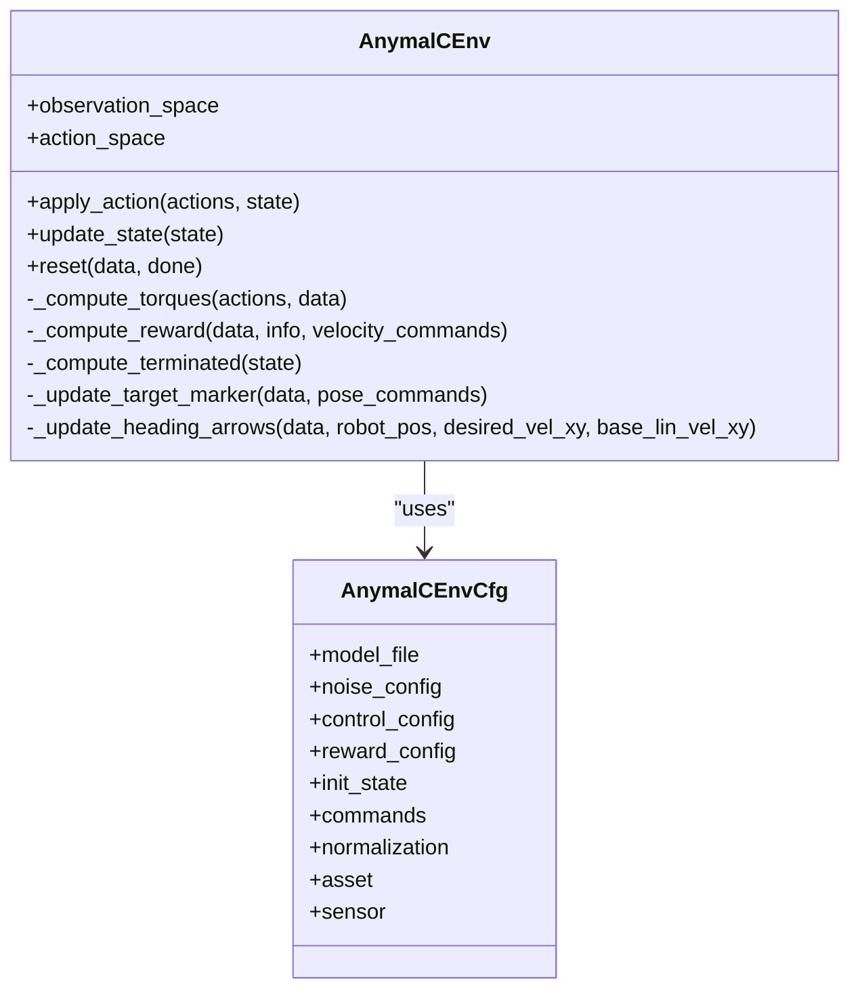
```mermaid
classDiagram
class AnymalCEnv {
+observation_space
+action_space
+apply_action(actions, state)
+update_state(state)
+reset(data, done)
-_compute_torques(actions, data)
-_compute_reward(data, info, velocity_commands)
-_compute_terminated(state)
-_update_target_marker(data, pose_commands)
-_update_heading_arrows(data, robot_pos, desired_vel_xy, base_lin_vel_xy)
}
class AnymalCEnvCfg {
+model_file
+noise_config
+control_config
+reward_config
+init_state
+commands
+normalization
+asset
+sensor
}
AnymalCEnv --> AnymalCEnvCfg : "uses"
```

**Diagram sources**
- [anymal_c/anymal_c_np.py](file://motrix_envs/src/motrix_envs/navigation/anymal_c/anymal_c_np.py#L26-L367)
- [anymal_c/cfg.py](file://motrix_envs/src/motrix_envs/navigation/anymal_c/cfg.py#L95-L116)

**Section sources**
- [anymal_c/anymal_c_np.py](file://motrix_envs/src/motrix_envs/navigation/anymal_c/anymal_c_np.py#L26-L367)
- [anymal_c/cfg.py](file://motrix_envs/src/motrix_envs/navigation/anymal_c/cfg.py#L18-L116)

### VBot Navigation Environment
The VBot environment supports multiple terrains and navigation scenarios:
- Flat navigation: Waypoint following with orientation control
- Stairs navigation: Enhanced termination and reward handling for staircases
- Multi-section tracks: Separate environments for distinct track sections (001, 011, 012, 013)
- **Enhanced**: Waypoint-enabled navigation: Sequential path following with ordered waypoint management and dual-mode sensor processing

Core features:
- Action space: 12-dimensional joint torque commands
- Observation space: 54-dimensional vector similar to ANYmal-C
- Reward function: Emphasizes position tracking, fine position tracking, forward velocity, and stability penalties
- Termination: Base-ground contact detection via sensors and collision queries
- **Enhanced**: Waypoint system with contact-based detection, position fallback, and ordered waypoint completion

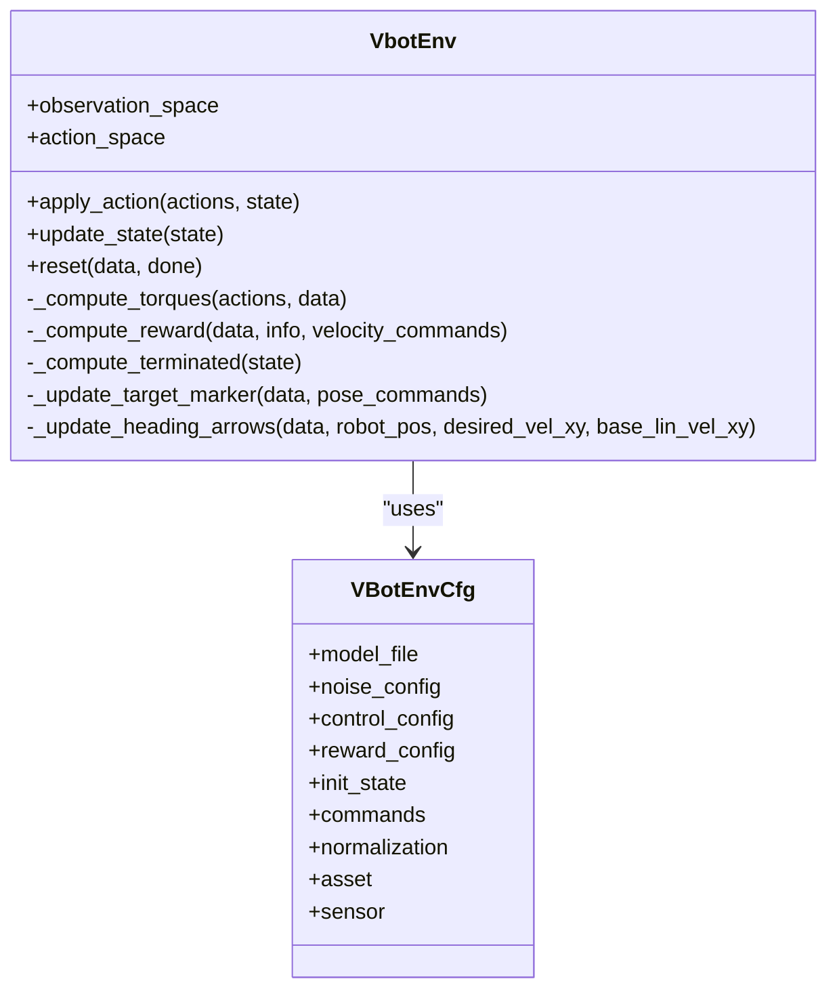
```mermaid
classDiagram
class VbotEnv {
+observation_space
+action_space
+apply_action(actions, state)
+update_state(state)
+reset(data, done)
-_compute_torques(actions, data)
-_compute_reward(data, info, velocity_commands)
-_compute_terminated(state)
-_update_target_marker(data, pose_commands)
-_update_heading_arrows(data, robot_pos, desired_vel_xy, base_lin_vel_xy)
}
class VBotEnvCfg {
+model_file
+noise_config
+control_config
+reward_config
+init_state
+commands
+normalization
+asset
+sensor
}
VbotEnv --> VBotEnvCfg : "uses"
```

**Diagram sources**
- [vbot/vbot_np.py](file://motrix_envs/src/motrix_envs/navigation/vbot/vbot_np.py#L39-L504)
- [vbot/cfg.py](file://motrix_envs/src/motrix_envs/navigation/vbot/cfg.py#L118-L138)

**Section sources**
- [vbot/vbot_np.py](file://motrix_envs/src/motrix_envs/navigation/vbot/vbot_np.py#L39-L504)
- [vbot/cfg.py](file://motrix_envs/src/motrix_envs/navigation/vbot/cfg.py#L24-L138)

### VBot Section Environments
The section-specific environments (001, 011, 012, 013) tailor initialization, command ranges, and reward configurations for distinct track layouts. They share the same observation/reward structure but differ in:
- Spawn area and height initialization
- Target command ranges aligned with track geometry
- Termination handling adapted to section-specific constraints

**Updated** The VBot Section002 environment now includes enhanced waypoint navigation capabilities with sophisticated path following algorithms, ordered waypoint management, and dual-mode sensor processing.

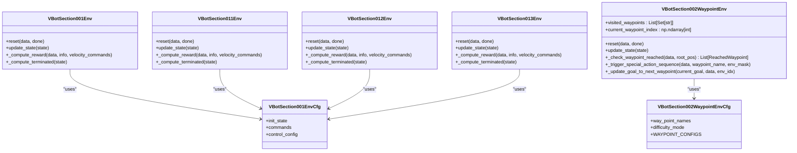
```mermaid
classDiagram
class VBotSection001Env {
+reset(data, done)
+update_state(state)
+_compute_reward(data, info, velocity_commands)
+_compute_terminated(state)
}
class VBotSection011Env {
+reset(data, done)
+update_state(state)
+_compute_reward(data, info, velocity_commands)
+_compute_terminated(state)
}
class VBotSection012Env {
+reset(data, done)
+update_state(state)
+_compute_reward(data, info, velocity_commands)
+_compute_terminated(state)
}
class VBotSection013Env {
+reset(data, done)
+update_state(state)
+_compute_reward(data, info, velocity_commands)
+_compute_terminated(state)
}
class VBotSection002WaypointEnv {
+reset(data, done)
+update_state(state)
+_check_waypoint_reached(data, root_pos) List[ReachedWaypoint]
+_trigger_special_action_sequence(data, waypoint_name, env_mask)
+_update_goal_to_next_waypoint(current_goal, data, env_idx)
+visited_waypoints : List[Set[str]]
+current_waypoint_index : np.ndarray[int]
}
class VBotSection001EnvCfg {
+init_state
+commands
+control_config
}
class VBotSection002WaypointEnvCfg {
+way_point_names
+difficulty_mode
+WAYPOINT_CONFIGS
}
VBotSection001Env --> VBotSection001EnvCfg : "uses"
VBotSection011Env --> VBotSection001EnvCfg : "uses"
VBotSection012Env --> VBotSection001EnvCfg : "uses"
VBotSection013Env --> VBotSection001EnvCfg : "uses"
VBotSection002WaypointEnv --> VBotSection002WaypointEnvCfg : "uses"
```

**Diagram sources**
- [vbot/vbot_section001_np.py](file://motrix_envs/src/motrix_envs/navigation/vbot/vbot_section001_np.py#L40-L778)
- [vbot/vbot_section011_np.py](file://motrix_envs/src/motrix_envs/navigation/vbot/vbot_section011_np.py#L40-L678)
- [vbot/vbot_section012_np.py](file://motrix_envs/src/motrix_envs/navigation/vbot/vbot_section012_np.py#L40-L678)
- [vbot/vbot_section013_np.py](file://motrix_envs/src/motrix_envs/navigation/vbot/vbot_section013_np.py#L40-L678)
- [vbot/vbot_section002_waypoint_np.py](file://motrix_envs/src/motrix_envs/navigation/vbot/vbot_section002_waypoint_np.py#L27-L34)
- [vbot/cfg.py](file://motrix_envs/src/motrix_envs/navigation/vbot/cfg.py#L357-L421)
- [vbot/cfg.py](file://motrix_envs/src/motrix_envs/navigation/vbot/cfg.py#L752-L867)

**Section sources**
- [vbot/vbot_section001_np.py](file://motrix_envs/src/motrix_envs/navigation/vbot/vbot_section001_np.py#L40-L778)
- [vbot/vbot_section011_np.py](file://motrix_envs/src/motrix_envs/navigation/vbot/vbot_section011_np.py#L40-L678)
- [vbot/vbot_section012_np.py](file://motrix_envs/src/motrix_envs/navigation/vbot/vbot_section012_np.py#L40-L678)
- [vbot/vbot_section013_np.py](file://motrix_envs/src/motrix_envs/navigation/vbot/vbot_section013_np.py#L40-L678)
- [vbot/vbot_section002_waypoint_np.py](file://motrix_envs/src/motrix_envs/navigation/vbot/vbot_section002_waypoint_np.py#L27-L34)
- [vbot/cfg.py](file://motrix_envs/src/motrix_envs/navigation/vbot/cfg.py#L357-L619)
- [vbot/cfg.py](file://motrix_envs/src/motrix_envs/navigation/vbot/cfg.py#L752-L867)

### Navigation Scenarios and Algorithms

#### Enhanced Waypoint Following
Both ANYmal-C and VBot environments implement waypoint following through:
- Computing desired linear and angular velocities from position and heading errors
- Applying proportional control with deadbands to avoid oscillations
- Updating visualization arrows to reflect desired vs. actual motion

**Updated** The VBot Section002 Waypoint environment introduces sophisticated waypoint navigation with:
- Sequential waypoint completion with automatic goal progression
- Contact-based waypoint detection with fallback position-based detection
- Dynamic difficulty scaling through configurable waypoint sets
- Natural robot behaviors during waypoint interactions
- **Enhanced**: Ordered waypoint management ensuring sequential completion
- **Enhanced**: Dual-mode sensor processing with debugging capabilities

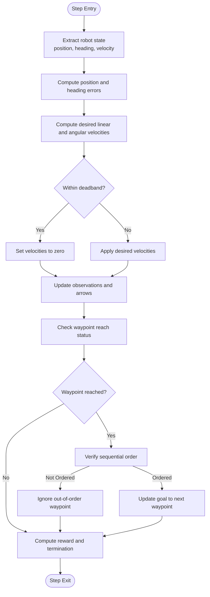
```mermaid
flowchart TD
Start(["Step Entry"]) --> Extract["Extract robot state<br/>position, heading, velocity"]
Extract --> ComputeError["Compute position and heading errors"]
ComputeError --> DesiredVel["Compute desired linear and angular velocities"]
DesiredVel --> Deadband{"Within deadband?"}
Deadband --> |Yes| ZeroCmd["Set velocities to zero"]
Deadband --> |No| ApplyCmd["Apply desired velocities"]
ZeroCmd --> UpdateObs["Update observations and arrows"]
ApplyCmd --> UpdateObs
UpdateObs --> CheckWaypoints["Check waypoint reach status"]
CheckWaypoints --> Reached{"Waypoint reached?"}
Reached --> |Yes| CheckOrder["Verify sequential order"]
CheckOrder --> |Ordered| NextGoal["Update goal to next waypoint"]
Reached --> |No| ComputeReward["Compute reward and termination"]
CheckOrder --> |Not Ordered| Ignore["Ignore out-of-order waypoint"]
Ignore --> ComputeReward
NextGoal --> ComputeReward
ComputeReward --> End(["Step Exit"])
```

**Diagram sources**
- [anymal_c/anymal_c_np.py](file://motrix_envs/src/motrix_envs/navigation/anymal_c/anymal_c_np.py#L256-L290)
- [vbot/vbot_np.py](file://motrix_envs/src/motrix_envs/navigation/vbot/vbot_np.py#L426-L447)
- [vbot/vbot_section002_waypoint_np.py](file://motrix_envs/src/motrix_envs/navigation/vbot/vbot_section002_waypoint_np.py#L765-L796)

**Section sources**
- [anymal_c/anymal_c_np.py](file://motrix_envs/src/motrix_envs/navigation/anymal_c/anymal_c_np.py#L256-L290)
- [vbot/vbot_np.py](file://motrix_envs/src/motrix_envs/navigation/vbot/vbot_np.py#L426-L447)
- [vbot/vbot_section002_waypoint_np.py](file://motrix_envs/src/motrix_envs/navigation/vbot/vbot_section002_waypoint_np.py#L765-L796)

#### Obstacle Avoidance
Obstacle avoidance is implicitly handled through:
- Termination conditions that detect base-ground collisions and excessive tilts
- Reward penalties for large accelerations, torques, and unstable postures
- Contact queries for detecting collisions during simulation steps

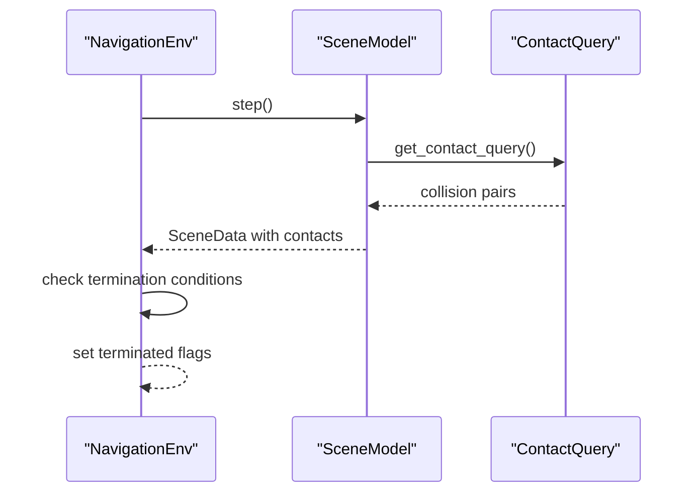
```mermaid
sequenceDiagram
participant Env as "NavigationEnv"
participant Model as "SceneModel"
participant CQ as "ContactQuery"
Env->>Model : step()
Model->>CQ : get_contact_query()
CQ-->>Model : collision pairs
Model-->>Env : SceneData with contacts
Env->>Env : check termination conditions
Env-->>Env : set terminated flags
```

**Diagram sources**
- [anymal_c/anymal_c_np.py](file://motrix_envs/src/motrix_envs/navigation/anymal_c/anymal_c_np.py#L482-L486)
- [vbot/vbot_np.py](file://motrix_envs/src/motrix_envs/navigation/vbot/vbot_np.py#L509-L526)

**Section sources**
- [anymal_c/anymal_c_np.py](file://motrix_envs/src/motrix_envs/navigation/anymal_c/anymal_c_np.py#L482-L486)
- [vbot/vbot_np.py](file://motrix_envs/src/motrix_envs/navigation/vbot/vbot_np.py#L509-L526)

#### Multi-Section Navigation Tracks
The VBot section environments enable staged training across distinct track layouts:
- Section 001: Flat terrain with controlled spawn and target ranges
- Section 011/012/013: Variants with specific spawn heights and target regions
- **Enhanced**: Section 002 with waypoint navigation for complex path following
- Shared reward and termination logic with environment-specific initialization

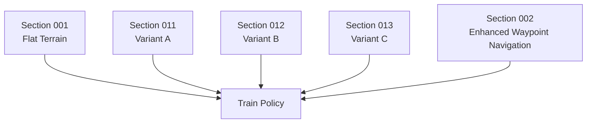
```mermaid
graph TB
S001["Section 001<br/>Flat Terrain"]
S011["Section 011<br/>Variant A"]
S012["Section 012<br/>Variant B"]
S013["Section 013<br/>Variant C"]
S002["Section 002<br/>Enhanced Waypoint Navigation"]
S001 --> Train["Train Policy"]
S011 --> Train
S012 --> Train
S013 --> Train
S002 --> Train
```

**Diagram sources**
- [vbot/vbot_section001_np.py](file://motrix_envs/src/motrix_envs/navigation/vbot/vbot_section001_np.py#L780-L796)
- [vbot/vbot_section011_np.py](file://motrix_envs/src/motrix_envs/navigation/vbot/vbot_section011_np.py#L494-L511)
- [vbot/vbot_section012_np.py](file://motrix_envs/src/motrix_envs/navigation/vbot/vbot_section012_np.py#L494-L511)
- [vbot/vbot_section013_np.py](file://motrix_envs/src/motrix_envs/navigation/vbot/vbot_section013_np.py#L494-L511)
- [vbot/vbot_section002_waypoint_np.py](file://motrix_envs/src/motrix_envs/navigation/vbot/vbot_section002_waypoint_np.py#L142-L166)

**Section sources**
- [vbot/vbot_section001_np.py](file://motrix_envs/src/motrix_envs/navigation/vbot/vbot_section001_np.py#L780-L796)
- [vbot/vbot_section011_np.py](file://motrix_envs/src/motrix_envs/navigation/vbot/vbot_section011_np.py#L494-L511)
- [vbot/vbot_section012_np.py](file://motrix_envs/src/motrix_envs/navigation/vbot/vbot_section012_np.py#L494-L511)
- [vbot/vbot_section013_np.py](file://motrix_envs/src/motrix_envs/navigation/vbot/vbot_section013_np.py#L494-L511)
- [vbot/vbot_section002_waypoint_np.py](file://motrix_envs/src/motrix_envs/navigation/vbot/vbot_section002_waypoint_np.py#L142-L166)

## Enhanced Waypoint Navigation System

### Advanced Path Point Detection and Management
The enhanced waypoint navigation system provides sophisticated path following capabilities with ordered waypoint management:

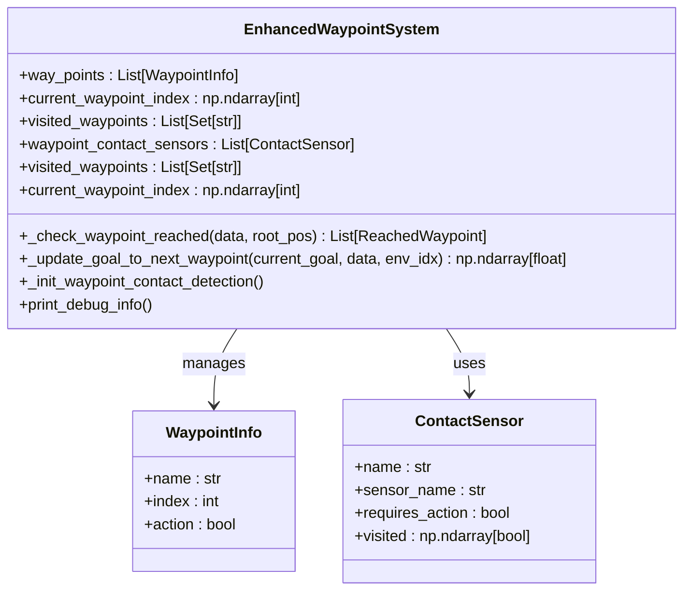
```mermaid
classDiagram
class EnhancedWaypointSystem {
+way_points : List[WaypointInfo]
+current_waypoint_index : np.ndarray[int]
+visited_waypoints : List[Set[str]]
+waypoint_contact_sensors : List[ContactSensor]
+visited_waypoints : List[Set[str]]
+current_waypoint_index : np.ndarray[int]
+_check_waypoint_reached(data, root_pos) List[ReachedWaypoint]
+_update_goal_to_next_waypoint(current_goal, data, env_idx) np.ndarray[float]
+_init_waypoint_contact_detection()
+print_debug_info()
}
class WaypointInfo {
+name : str
+index : int
+action : bool
}
class ContactSensor {
+name : str
+sensor_name : str
+requires_action : bool
+visited : np.ndarray[bool]
}
EnhancedWaypointSystem --> WaypointInfo : manages
EnhancedWaypointSystem --> ContactSensor : uses
```

**Diagram sources**
- [vbot/vbot_section002_waypoint_np.py](file://motrix_envs/src/motrix_envs/navigation/vbot/vbot_section002_waypoint_np.py#L142-L166)
- [vbot/vbot_section002_waypoint_np.py](file://motrix_envs/src/motrix_envs/navigation/vbot/vbot_section002_waypoint_np.py#L198-L253)
- [vbot/vbot_section002_waypoint_np.py](file://motrix_envs/src/motrix_envs/navigation/vbot/vbot_section002_waypoint_np.py#L384-L421)

### Enhanced Waypoint Reach Detection
The system implements dual-mode waypoint detection with ordered management for robust operation:

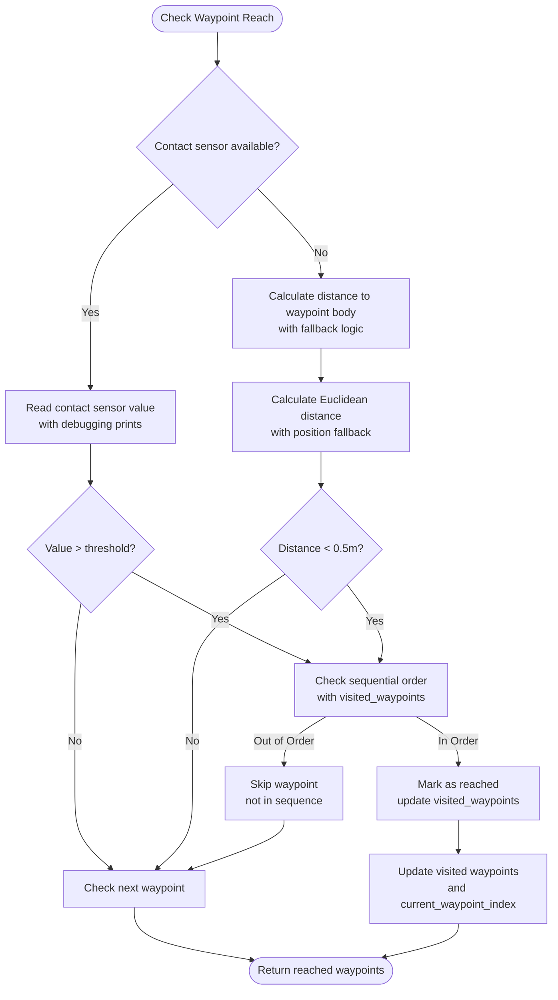
```mermaid
flowchart TD
Start(["Check Waypoint Reach"]) --> ContactSensor{"Contact sensor available?"}
ContactSensor --> |Yes| ContactDetect["Read contact sensor value<br/>with debugging prints"]
ContactSensor --> |No| PositionDetect["Calculate distance to waypoint body<br/>with fallback logic"]
ContactDetect --> Threshold{"Value > threshold?"}
PositionDetect --> DistanceCalc["Calculate Euclidean distance<br/>with position fallback"]
DistanceCalc --> DistanceThreshold{"Distance < 0.5m?"}
Threshold --> |Yes| CheckOrder["Check sequential order<br/>with visited_waypoints"]
Threshold --> |No| CheckNext["Check next waypoint"]
DistanceThreshold --> |Yes| CheckOrder
DistanceThreshold --> |No| CheckNext
CheckOrder --> |In Order| MarkReached["Mark as reached<br/>update visited_waypoints"]
CheckOrder --> |Out of Order| Skip["Skip waypoint<br/>not in sequence"]
MarkReached --> UpdateVisited["Update visited waypoints<br/>and current_waypoint_index"]
Skip --> CheckNext
CheckNext --> End(["Return reached waypoints"])
UpdateVisited --> End
```

**Diagram sources**
- [vbot/vbot_section002_waypoint_np.py](file://motrix_envs/src/motrix_envs/navigation/vbot/vbot_section002_waypoint_np.py#L213-L242)

**Section sources**
- [vbot/vbot_section002_waypoint_np.py](file://motrix_envs/src/motrix_envs/navigation/vbot/vbot_section002_waypoint_np.py#L142-L166)
- [vbot/vbot_section002_waypoint_np.py](file://motrix_envs/src/motrix_envs/navigation/vbot/vbot_section002_waypoint_np.py#L198-L253)
- [vbot/vbot_section002_waypoint_np.py](file://motrix_envs/src/motrix_envs/navigation/vbot/vbot_section002_waypoint_np.py#L384-L421)

### Ordered Waypoint Management
The system maintains strict sequential order for waypoint completion:

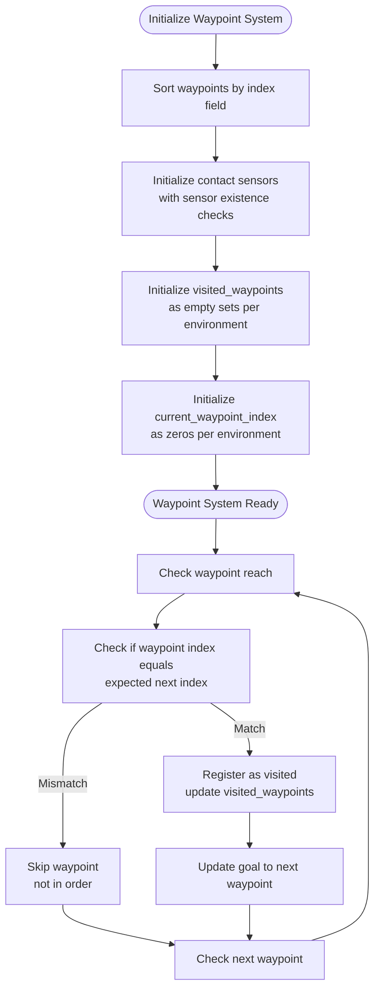
```mermaid
flowchart TD
Init(["Initialize Waypoint System"]) --> SortWaypoints["Sort waypoints by index field"]
SortWaypoints --> InitSensors["Initialize contact sensors<br/>with sensor existence checks"]
InitSensors --> InitVisited["Initialize visited_waypoints<br/>as empty sets per environment"]
InitVisited --> InitIndex["Initialize current_waypoint_index<br/>as zeros per environment"]
InitIndex --> Ready(["Waypoint System Ready"])
Ready --> CheckReach["Check waypoint reach"]
CheckReach --> CheckOrder["Check if waypoint index equals<br/>expected next index"]
CheckOrder --> |Match| RegisterVisit["Register as visited<br/>update visited_waypoints"]
CheckOrder --> |Mismatch| SkipVisit["Skip waypoint<br/>not in order"]
RegisterVisit --> UpdateGoal["Update goal to next waypoint"]
SkipVisit --> NextWaypoint["Check next waypoint"]
UpdateGoal --> NextWaypoint
NextWaypoint --> CheckReach
```

**Diagram sources**
- [vbot/vbot_section002_waypoint_np.py](file://motrix_envs/src/motrix_envs/navigation/vbot/vbot_section002_waypoint_np.py#L416-L456)

**Section sources**
- [vbot/vbot_section002_waypoint_np.py](file://motrix_envs/src/motrix_envs/navigation/vbot/vbot_section002_waypoint_np.py#L416-L456)

## Dynamic Difficulty Scaling

### Advanced Waypoint Configuration Modes
The enhanced waypoint system supports four difficulty modes with progressively complex path structures and ordered waypoint management:

| Mode | Description | Waypoints | Celebration Actions | Ordered Completion |
|------|-------------|-----------|-------------------|-------------------|
| Simple | Basic path following | 3 waypoints | None | Required |
| Easy | Basic with celebrations | 3 waypoints | Victory poses | Required |
| Normal | Complex path with rewards | 6 waypoints | None | Required |
| Hard | Most complex with rewards | 6 waypoints | Victory poses | Required |

**Section sources**
- [vbot/cfg.py](file://motrix_envs/src/motrix_envs/navigation/vbot/cfg.py#L775-L804)
- [vbot/cfg.py](file://motrix_envs/src/motrix_envs/navigation/vbot/cfg.py#L807-L810)

### Automatic Waypoint Configuration
The system automatically selects waypoint configurations based on difficulty mode with ordered management:

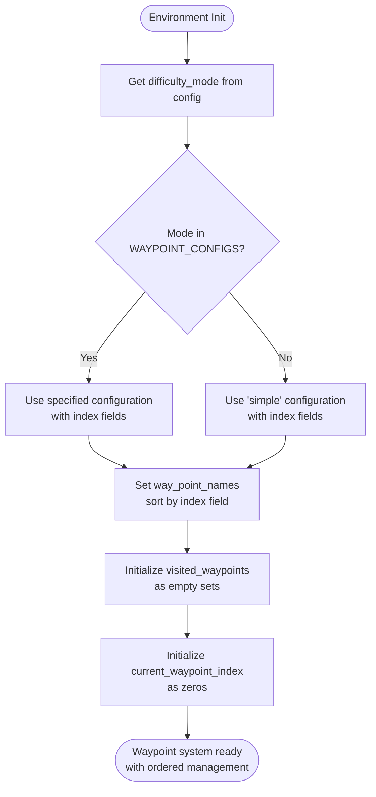
```mermaid
flowchart TD
Start(["Environment Init"]) --> GetMode["Get difficulty_mode from config"]
GetMode --> CheckMode{"Mode in WAYPOINT_CONFIGS?"}
CheckMode --> |Yes| UseConfig["Use specified configuration<br/>with index fields"]
CheckMode --> |No| DefaultConfig["Use 'simple' configuration<br/>with index fields"]
UseConfig --> SetWaypoints["Set way_point_names<br/>sort by index field"]
DefaultConfig --> SetWaypoints
SetWaypoints --> InitVisited["Initialize visited_waypoints<br/>as empty sets"]
InitVisited --> InitIndex["Initialize current_waypoint_index<br/>as zeros"]
InitIndex --> End(["Waypoint system ready<br/>with ordered management"])
```

**Diagram sources**
- [vbot/cfg.py](file://motrix_envs/src/motrix_envs/navigation/vbot/cfg.py#L807-L810)

**Section sources**
- [vbot/cfg.py](file://motrix_envs/src/motrix_envs/navigation/vbot/cfg.py#L775-L804)
- [vbot/cfg.py](file://motrix_envs/src/motrix_envs/navigation/vbot/cfg.py#L807-L810)

## Natural Robot Behaviors

### Enhanced Special Action Sequences
The waypoint system triggers natural robot behaviors through non-blocking special actions with ordered waypoint management:

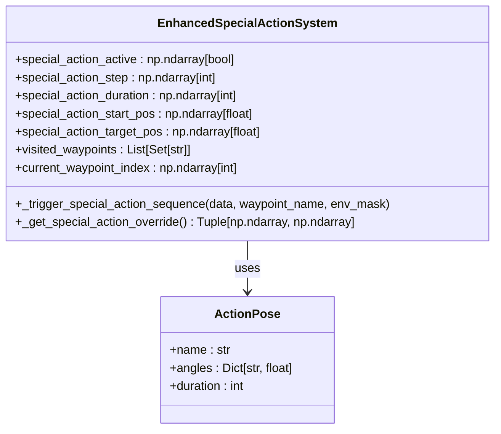
```mermaid
classDiagram
class EnhancedSpecialActionSystem {
+special_action_active : np.ndarray[bool]
+special_action_step : np.ndarray[int]
+special_action_duration : np.ndarray[int]
+special_action_start_pos : np.ndarray[float]
+special_action_target_pos : np.ndarray[float]
+_trigger_special_action_sequence(data, waypoint_name, env_mask)
+_get_special_action_override() Tuple[np.ndarray, np.ndarray]
+visited_waypoints : List[Set[str]]
+current_waypoint_index : np.ndarray[int]
}
class ActionPose {
+name : str
+angles : Dict[str, float]
+duration : int
}
EnhancedSpecialActionSystem --> ActionPose : uses
```

**Diagram sources**
- [vbot/vbot_section002_waypoint_np.py](file://motrix_envs/src/motrix_envs/navigation/vbot/vbot_section002_waypoint_np.py#L278-L351)
- [vbot/vbot_section002_waypoint_np.py](file://motrix_envs/src/motrix_envs/navigation/vbot/vbot_section002_waypoint_np.py#L255-L277)

### Enhanced Victory Pose and Crouch Behaviors
The system implements two primary robot behaviors with waypoint-specific triggers:

**Victory Pose**: Demonstrates successful waypoint completion with elevated front legs and crouched rear legs, triggered at specific waypoints
**Crouch Pose**: Standard celebration pose with moderate leg positioning, triggered at default waypoints

**Section sources**
- [vbot/vbot_section002_waypoint_np.py](file://motrix_envs/src/motrix_envs/navigation/vbot/vbot_section002_waypoint_np.py#L255-L277)
- [vbot/vbot_section002_waypoint_np.py](file://motrix_envs/src/motrix_envs/navigation/vbot/vbot_section002_waypoint_np.py#L278-L351)

## Debugging and Troubleshooting

### Enhanced Debugging Capabilities
The waypoint system provides comprehensive debugging information for troubleshooting:

**Initialization Debugging**:
- Waypoint count and sorting verification
- Contact sensor registration status
- Sensor existence validation with fallback logic

**Runtime Debugging**:
- Waypoint reach detection with per-environment masks
- Sequential order verification with visited waypoints
- Special action triggering with waypoint-specific behaviors

**Sensor Processing Debugging**:
- Contact sensor value monitoring
- Position-based detection fallback
- Waypoint body position extraction

**Section sources**
- [vbot/vbot_section002_waypoint_np.py](file://motrix_envs/src/motrix_envs/navigation/vbot/vbot_section002_waypoint_np.py#L163-L166)
- [vbot/vbot_section002_waypoint_np.py](file://motrix_envs/src/motrix_envs/navigation/vbot/vbot_section002_waypoint_np.py#L175-L196)
- [vbot/vbot_section002_waypoint_np.py](file://motrix_envs/src/motrix_envs/navigation/vbot/vbot_section002_waypoint_np.py#L271-L274)

### Common Issues and Resolutions
Enhanced troubleshooting for the waypoint system:

**Waypoint Detection Failures**:
- Verify contact sensor names match waypoint body names
- Check waypoint trigger geometries and sensor placements
- Ensure waypoint bodies are properly defined in XML files
- Validate sensor existence with fallback position-based detection

**Sequential Order Issues**:
- Verify waypoint index fields are correctly assigned
- Check visited_waypoints tracking per environment
- Monitor current_waypoint_index progression
- Review waypoint sorting by index field

**Special Action Timing**:
- Verify waypoint action flags and joint angle configurations
- Check special action duration and interpolation
- Validate joint name matching with actuator names
- Monitor special action completion with per-environment masks

**Section sources**
- [vbot/vbot_section002_waypoint_np.py](file://motrix_envs/src/motrix_envs/navigation/vbot/vbot_section002_waypoint_np.py#L167-L197)
- [vbot/vbot_section002_waypoint_np.py](file://motrix_envs/src/motrix_envs/navigation/vbot/vbot_section002_waypoint_np.py#L245-L275)
- [vbot/vbot_section002_waypoint_np.py](file://motrix_envs/src/motrix_envs/navigation/vbot/vbot_section002_waypoint_np.py#L310-L351)

## Dependency Analysis
The navigation environments depend on a shared base infrastructure and environment lifecycle:

```mermaid
graph TB
subgraph "Base Infrastructure"
Base["base.py"]
NpEnvBase["np/env.py"]
End
subgraph "ANYmal-C"
AC_CFG["anymal_c/cfg.py"]
AC_ENV["anymal_c/anymal_c_np.py"]
end
subgraph "VBot"
VB_CFG["vbot/cfg.py"]
VB_ENV["vbot/vbot_np.py"]
VB_SEC001["vbot/vbot_section001_np.py"]
VB_SEC011["vbot/vbot_section011_np.py"]
VB_SEC012["vbot/vbot_section012_np.py"]
VB_SEC013["vbot/vbot_section013_np.py"]
VB_WP["vbot/vbot_section002_waypoint_np.py"]
end
AC_CFG --> Base
AC_ENV --> Base
VB_CFG --> Base
VB_ENV --> Base
VB_SEC001 --> Base
VB_SEC011 --> Base
VB_SEC012 --> Base
VB_SEC013 --> Base
VB_WP --> Base
AC_CFG --> NpEnvBase
AC_ENV --> NpEnvBase
VB_CFG --> NpEnvBase
VB_ENV --> NpEnvBase
VB_SEC001 --> NpEnvBase
VB_SEC011 --> NpEnvBase
VB_SEC012 --> NpEnvBase
VB_SEC013 --> NpEnvBase
VB_WP --> NpEnvBase
```

**Diagram sources**
- [anymal_c/cfg.py](file://motrix_envs/src/motrix_envs/navigation/anymal_c/cfg.py#L13-L14)
- [anymal_c/anymal_c_np.py](file://motrix_envs/src/motrix_envs/navigation/anymal_c/anymal_c_np.py#L21-L24)
- [vbot/cfg.py](file://motrix_envs/src/motrix_envs/navigation/vbot/cfg.py#L19-L20)
- [vbot/vbot_np.py](file://motrix_envs/src/motrix_envs/navigation/vbot/vbot_np.py#L21-L25)
- [vbot/vbot_section001_np.py](file://motrix_envs/src/motrix_envs/navigation/vbot/vbot_section001_np.py#L20-L24)
- [vbot/vbot_section011_np.py](file://motrix_envs/src/motrix_envs/navigation/vbot/vbot_section011_np.py#L20-L23)
- [vbot/vbot_section012_np.py](file://motrix_envs/src/motrix_envs/navigation/vbot/vbot_section012_np.py#L20-L23)
- [vbot/vbot_section013_np.py](file://motrix_envs/src/motrix_envs/navigation/vbot/vbot_section013_np.py#L20-L23)
- [vbot/vbot_section002_waypoint_np.py](file://motrix_envs/src/motrix_envs/navigation/vbot/vbot_section002_waypoint_np.py#L24-L34)
- [base.py](file://motrix_envs/src/motrix_envs/base.py#L16-L24)
- [np/env.py](file://motrix_envs/src/motrix_envs/np/env.py#L16-L24)

**Section sources**
- [anymal_c/cfg.py](file://motrix_envs/src/motrix_envs/navigation/anymal_c/cfg.py#L13-L14)
- [anymal_c/anymal_c_np.py](file://motrix_envs/src/motrix_envs/navigation/anymal_c/anymal_c_np.py#L21-L24)
- [vbot/cfg.py](file://motrix_envs/src/motrix_envs/navigation/vbot/cfg.py#L19-L20)
- [vbot/vbot_np.py](file://motrix_envs/src/motrix_envs/navigation/vbot/vbot_np.py#L21-L25)
- [vbot/vbot_section001_np.py](file://motrix_envs/src/motrix_envs/navigation/vbot/vbot_section001_np.py#L20-L24)
- [vbot/vbot_section011_np.py](file://motrix_envs/src/motrix_envs/navigation/vbot/vbot_section011_np.py#L20-L23)
- [vbot/vbot_section012_np.py](file://motrix_envs/src/motrix_envs/navigation/vbot/vbot_section012_np.py#L20-L23)
- [vbot/vbot_section013_np.py](file://motrix_envs/src/motrix_envs/navigation/vbot/vbot_section013_np.py#L20-L23)
- [vbot/vbot_section002_waypoint_np.py](file://motrix_envs/src/motrix_envs/navigation/vbot/vbot_section002_waypoint_np.py#L24-L34)
- [base.py](file://motrix_envs/src/motrix_envs/base.py#L16-L24)
- [np/env.py](file://motrix_envs/src/motrix_envs/np/env.py#L16-L24)

## Performance Considerations
- Simulation fidelity: The base configuration defines sim_dt and ctrl_dt, with sim_substeps computed automatically. Ensure sim_dt ≤ ctrl_dt to maintain stability.
- Episode length: max_episode_steps is derived from max_episode_seconds and ctrl_dt. Adjust for longer or shorter episodes depending on scenario complexity.
- Observation normalization: Normalization factors for linear velocity, angular velocity, joint positions, and joint velocities help stabilize learning by keeping inputs in reasonable ranges.
- Reward shaping: Balancing reward weights prevents overfitting to specific metrics. Excessive penalties for torques or accelerations can hinder exploration.
- Termination thresholds: Properly tuned termination conditions prevent early stops while ensuring safety.
- **Enhanced**: Waypoint system performance: Contact sensor detection is prioritized over position-based detection for reliability, with fallback mechanisms to ensure robust waypoint following. Ordered waypoint management adds computational overhead but ensures sequential completion.
- **Enhanced**: Debugging overhead: Extensive print statements and logging provide valuable insights but may impact performance in production environments.

## Conclusion
The navigation environments provide robust, configurable platforms for autonomous robot navigation research. The ANYmal-C and VBot environments demonstrate practical implementations of waypoint following, orientation control, and multi-section navigation. Their modular design, clear separation of concerns, and extensive configuration options facilitate experimentation with diverse navigation scenarios.

**Updated** The addition of the enhanced waypoint navigation system significantly improves the platform's capabilities by introducing sophisticated path following with sequential waypoint completion, ordered management, dual-mode sensor processing, and comprehensive debugging capabilities. The system supports four difficulty modes with progressively complex path structures, enabling staged training from basic waypoint following to complex multi-section navigation with celebratory robot behaviors. The enhanced debugging features provide valuable insights for troubleshooting and optimizing waypoint-based navigation performance.

By leveraging the provided configuration parameters, reward shaping strategies, and termination logic, researchers can develop and evaluate navigation policies that generalize across terrains and tasks. The waypoint system's contact-based detection, fallback mechanisms, non-blocking special actions, and ordered management provide a robust foundation for advanced autonomous navigation research with reliable sequential path following capabilities.