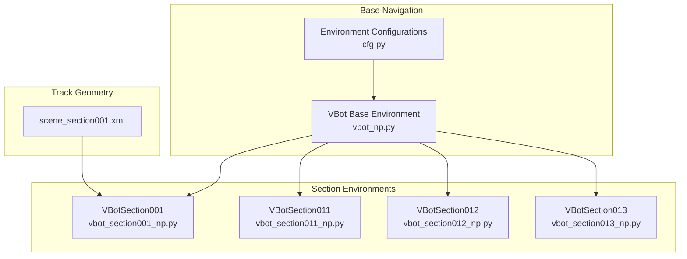
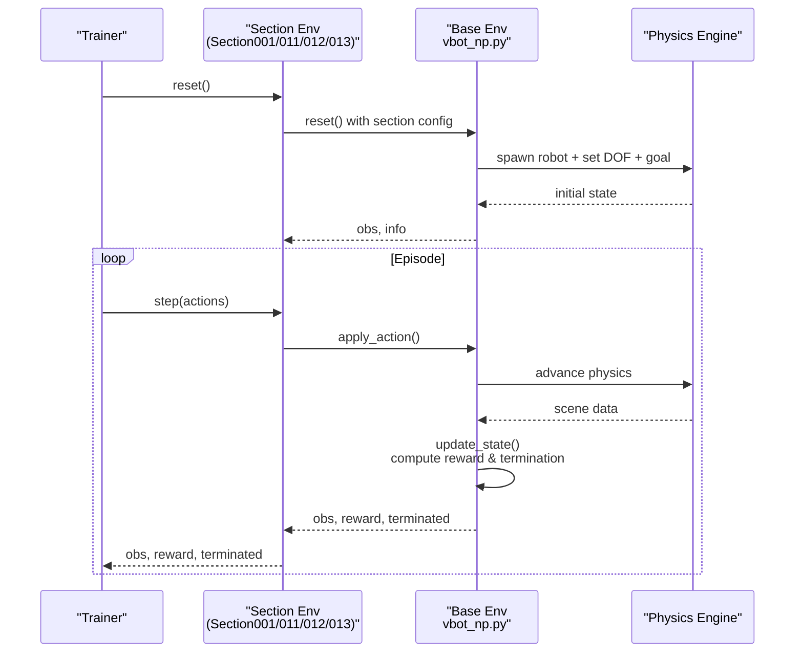
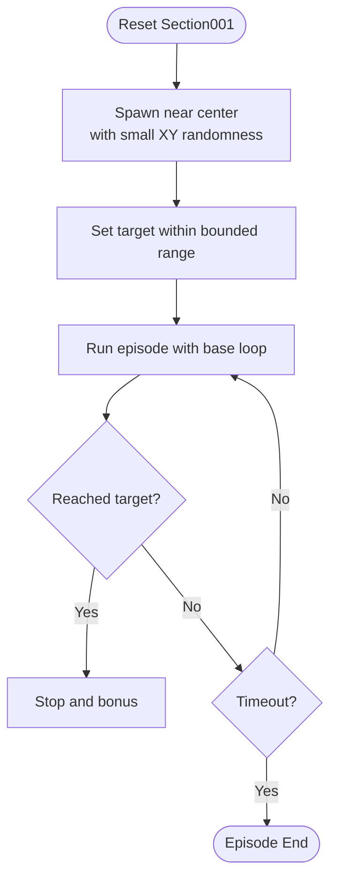
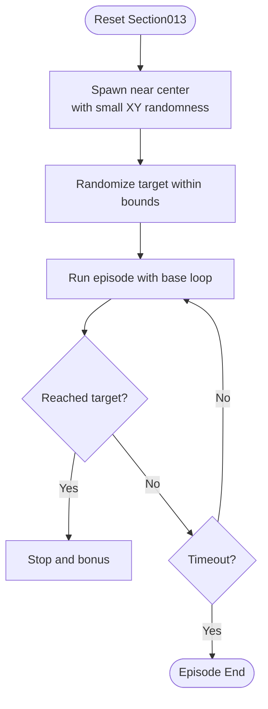
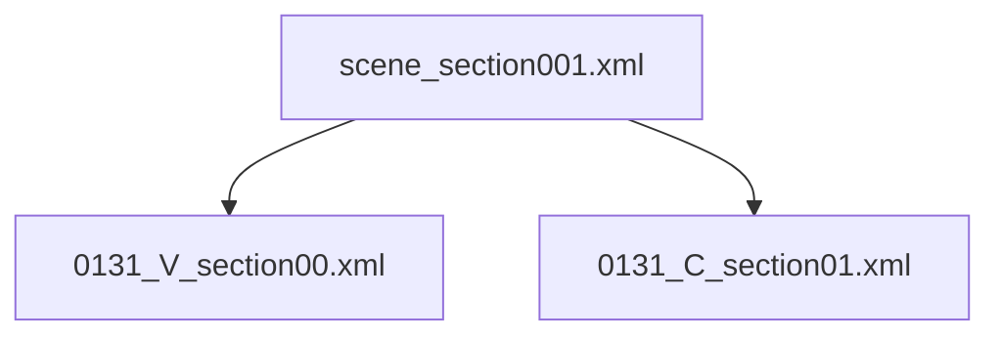
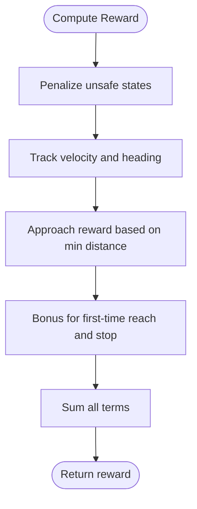
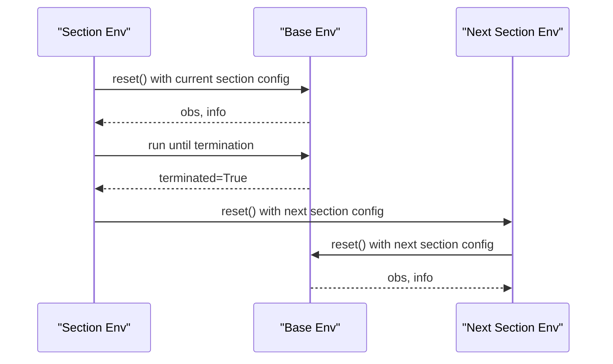
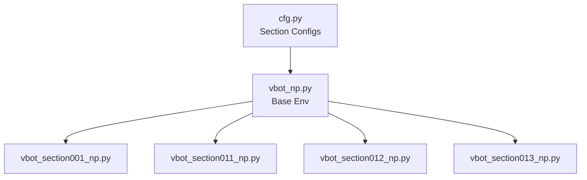

# Track Sections

<cite>
**Referenced Files in This Document**
- [cfg.py](file://motrix_envs/src/motrix_envs/navigation/vbot/cfg.py)
- [vbot_np.py](file://motrix_envs/src/motrix_envs/navigation/vbot/vbot_np.py)
- [vbot_section001_np.py](file://motrix_envs/src/motrix_envs/navigation/vbot/vbot_section001_np.py)
- [vbot_section011_np.py](file://motrix_envs/src/motrix_envs/navigation/vbot/vbot_section011_np.py)
- [vbot_section012_np.py](file://motrix_envs/src/motrix_envs/navigation/vbot/vbot_section012_np.py)
- [vbot_section013_np.py](file://motrix_envs/src/motrix_envs/navigation/vbot/vbot_section013_np.py)
- [scene_section001.xml](file://motrix_envs/src/motrix_envs/navigation/vbot/xmls/scene_section001.xml)
</cite>

## Table of Contents
1. [Introduction](#introduction)
2. [Project Structure](#project-structure)
3. [Core Components](#core-components)
4. [Architecture Overview](#architecture-overview)
5. [Detailed Component Analysis](#detailed-component-analysis)
6. [Dependency Analysis](#dependency-analysis)
7. [Performance Considerations](#performance-considerations)
8. [Troubleshooting Guide](#troubleshooting-guide)
9. [Conclusion](#conclusion)
10. [Appendices](#appendices)

## Introduction
This document explains the modular navigation system for VBot track sections, focusing on four distinct flat terrain configurations: VBotSection001, VBotSection011, VBotSection012, and VBotSection013. These environments share a common navigation framework while introducing section-specific geometry, goals, waypoints, and difficulty parameters. The document covers track geometry variations, reward shaping, termination conditions, and transition mechanisms across sections. It also provides training strategies, curriculum learning approaches, and transfer learning guidance for navigating multi-section tracks.

## Project Structure
The VBot navigation system is organized around a shared base environment and section-specific configurations. The base environment defines the robot dynamics, sensors, reward computation, and termination logic. Section-specific environments inherit and override initialization, command ranges, and episode limits to reflect unique track layouts.

**Diagram sources**
- [vbot_np.py](file://motrix_envs/src/motrix_envs/navigation/vbot/vbot_np.py#L39-L872)
- [cfg.py](file://motrix_envs/src/motrix_envs/navigation/vbot/cfg.py#L357-L619)
- [vbot_section001_np.py](file://motrix_envs/src/motrix_envs/navigation/vbot/vbot_section001_np.py#L40-L1005)
- [vbot_section011_np.py](file://motrix_envs/src/motrix_envs/navigation/vbot/vbot_section011_np.py#L40-L679)
- [vbot_section012_np.py](file://motrix_envs/src/motrix_envs/navigation/vbot/vbot_section012_np.py#L40-L679)
- [vbot_section013_np.py](file://motrix_envs/src/motrix_envs/navigation/vbot/vbot_section013_np.py#L40-L679)
- [scene_section001.xml](file://motrix_envs/src/motrix_envs/navigation/vbot/xmls/scene_section001.xml#L1-L46)

**Section sources**
- [cfg.py](file://motrix_envs/src/motrix_envs/navigation/vbot/cfg.py#L357-L619)
- [vbot_np.py](file://motrix_envs/src/motrix_envs/navigation/vbot/vbot_np.py#L39-L872)
- [vbot_section001_np.py](file://motrix_envs/src/motrix_envs/navigation/vbot/vbot_section001_np.py#L40-L1005)
- [vbot_section011_np.py](file://motrix_envs/src/motrix_envs/navigation/vbot/vbot_section011_np.py#L40-L679)
- [vbot_section012_np.py](file://motrix_envs/src/motrix_envs/navigation/vbot/vbot_section012_np.py#L40-L679)
- [vbot_section013_np.py](file://motrix_envs/src/motrix_envs/navigation/vbot/vbot_section013_np.py#L40-L679)
- [scene_section001.xml](file://motrix_envs/src/motrix_envs/navigation/vbot/xmls/scene_section001.xml#L1-L46)

## Core Components
- Base navigation environment: Implements robot dynamics, PD control, observations, reward computation, and termination logic. See [vbot_np.py](file://motrix_envs/src/motrix_envs/navigation/vbot/vbot_np.py#L39-L872).
- Section-specific environments: Override initialization, pose command ranges, and episode durations to match track geometry. See [vbot_section001_np.py](file://motrix_envs/src/motrix_envs/navigation/vbot/vbot_section001_np.py#L40-L1005), [vbot_section011_np.py](file://motrix_envs/src/motrix_envs/navigation/vbot/vbot_section011_np.py#L40-L679), [vbot_section012_np.py](file://motrix_envs/src/motrix_envs/navigation/vbot/vbot_section012_np.py#L40-L679), [vbot_section013_np.py](file://motrix_envs/src/motrix_envs/navigation/vbot/vbot_section013_np.py#L40-L679).
- Environment configurations: Define simulation parameters, noise, control scaling, normalization, assets, sensors, and reward scales per section. See [cfg.py](file://motrix_envs/src/motrix_envs/navigation/vbot/cfg.py#L357-L619).

Key capabilities:
- Observations: 54-dimensional vector combining base linear velocity, angular velocity, projected gravity, joint positions/velocities, last actions, normalized commands, position/heading errors, distance-to-target, reached flag, and stop-ready flag.
- Actions: 12-dimensional PD control commands mapped to joint torque limits.
- Termination: Base contact sensor, side-fall detection, DOF velocity overflow, and timeout.

**Section sources**
- [vbot_np.py](file://motrix_envs/src/motrix_envs/navigation/vbot/vbot_np.py#L63-L872)
- [cfg.py](file://motrix_envs/src/motrix_envs/navigation/vbot/cfg.py#L95-L137)

## Architecture Overview
The modular architecture separates common navigation logic from section-specific parameters. Each section environment inherits the base update loop, reward computation, and termination logic, while overriding initialization and command generation to reflect the layout of its track.

**Diagram sources**
- [vbot_section001_np.py](file://motrix_envs/src/motrix_envs/navigation/vbot/vbot_section001_np.py#L782-L1005)
- [vbot_np.py](file://motrix_envs/src/motrix_envs/navigation/vbot/vbot_np.py#L388-L503)

**Section sources**
- [vbot_section001_np.py](file://motrix_envs/src/motrix_envs/navigation/vbot/vbot_section001_np.py#L782-L1005)
- [vbot_np.py](file://motrix_envs/src/motrix_envs/navigation/vbot/vbot_np.py#L388-L503)

## Detailed Component Analysis

### VBotSection001
- Purpose: Flat terrain section with a central goal area and bounded target region.
- Initialization:
  - Spawn center near the center of the section with small positional randomness.
  - Pose command range fixed to a single target offset to emphasize reaching accuracy.
- Difficulty: Moderate; designed for stable navigation and reaching tasks.
- Reward and termination: Inherits base reward shaping and termination logic.
- Transition: Can be chained after Section011/012/013 to form a longer course.

**Diagram sources**
- [vbot_section001_np.py](file://motrix_envs/src/motrix_envs/navigation/vbot/vbot_section001_np.py#L782-L1005)
- [vbot_np.py](file://motrix_envs/src/motrix_envs/navigation/vbot/vbot_np.py#L388-L503)

**Section sources**
- [vbot_section001_np.py](file://motrix_envs/src/motrix_envs/navigation/vbot/vbot_section001_np.py#L782-L1005)
- [cfg.py](file://motrix_envs/src/motrix_envs/navigation/vbot/cfg.py#L357-L422)
- [scene_section001.xml](file://motrix_envs/src/motrix_envs/navigation/vbot/xmls/scene_section001.xml#L23-L34)

### VBotSection011
- Purpose: Flat terrain variant with a central goal area and randomized target offsets.
- Initialization:
  - Spawn center near the center of the section with small positional randomness.
  - Pose command range allows targets within a bounded region around the robot.
- Difficulty: Similar to Section001; emphasizes robustness to target variability.
- Reward and termination: Inherits base reward shaping and termination logic.

**Diagram sources**
- [vbot_section011_np.py](file://motrix_envs/src/motrix_envs/navigation/vbot/vbot_section011_np.py#L494-L679)
- [vbot_np.py](file://motrix_envs/src/motrix_envs/navigation/vbot/vbot_np.py#L388-L503)

**Section sources**
- [vbot_section011_np.py](file://motrix_envs/src/motrix_envs/navigation/vbot/vbot_section011_np.py#L494-L679)
- [cfg.py](file://motrix_envs/src/motrix_envs/navigation/vbot/cfg.py#L423-L487)

### VBotSection012
- Purpose: Flat terrain variant with a central goal area and randomized target offsets.
- Initialization:
  - Spawn center near the center of the section with small positional randomness.
  - Pose command range allows targets within a bounded region around the robot.
- Difficulty: Similar to Section011; emphasizes robustness to target variability.
- Reward and termination: Inherits base reward shaping and termination logic.

**Diagram sources**
- [vbot_section012_np.py](file://motrix_envs/src/motrix_envs/navigation/vbot/vbot_section012_np.py#L494-L679)
- [vbot_np.py](file://motrix_envs/src/motrix_envs/navigation/vbot/vbot_np.py#L388-L503)

**Section sources**
- [vbot_section012_np.py](file://motrix_envs/src/motrix_envs/navigation/vbot/vbot_section012_np.py#L494-L679)
- [cfg.py](file://motrix_envs/src/motrix_envs/navigation/vbot/cfg.py#L489-L553)

### VBotSection013
- Purpose: Flat terrain variant with a central goal area and randomized target offsets.
- Initialization:
  - Spawn center near the center of the section with small positional randomness.
  - Pose command range allows targets within a bounded region around the robot.
- Difficulty: Similar to Section011/012; emphasizes robustness to target variability.
- Reward and termination: Inherits base reward shaping and termination logic.

**Diagram sources**
- [vbot_section013_np.py](file://motrix_envs/src/motrix_envs/navigation/vbot/vbot_section013_np.py#L494-L679)
- [vbot_np.py](file://motrix_envs/src/motrix_envs/navigation/vbot/vbot_np.py#L388-L503)

**Section sources**
- [vbot_section013_np.py](file://motrix_envs/src/motrix_envs/navigation/vbot/vbot_section013_np.py#L494-L679)
- [cfg.py](file://motrix_envs/src/motrix_envs/navigation/vbot/cfg.py#L555-L619)

### Track Geometry Variations
- Scene composition: Each section loads a dedicated visual and collision model via MuJoCo include statements. For example, Section001 attaches a visual model and a collision model under prefixes V_ and C_. See [scene_section001.xml](file://motrix_envs/src/motrix_envs/navigation/vbot/xmls/scene_section001.xml#L23-L34).
- Obstacles and waypoints: Section-specific XMLs define static geometry, goals, and markers. The base environment reads a goal body name from configuration and updates target markers accordingly during reset/update cycles.

**Diagram sources**
- [scene_section001.xml](file://motrix_envs/src/motrix_envs/navigation/vbot/xmls/scene_section001.xml#L23-L34)

**Section sources**
- [scene_section001.xml](file://motrix_envs/src/motrix_envs/navigation/vbot/xmls/scene_section001.xml#L1-L46)
- [cfg.py](file://motrix_envs/src/motrix_envs/navigation/vbot/cfg.py#L86-L87)

### Reward Modifications and Termination Conditions
- Reward components:
  - Position tracking, fine position tracking, heading tracking, forward velocity.
  - Stability penalties (orientation, vertical velocity, angular velocity, torques, joint velocities, action rate).
  - Termination penalty for unsafe states.
- Termination:
  - Base contact sensor triggers termination.
  - Side-fall detection via projected gravity threshold.
  - DOF velocity overflow checks.
  - Episode timeout based on max steps.

**Diagram sources**
- [vbot_np.py](file://motrix_envs/src/motrix_envs/navigation/vbot/vbot_np.py#L528-L685)

**Section sources**
- [vbot_np.py](file://motrix_envs/src/motrix_envs/navigation/vbot/vbot_np.py#L528-L685)
- [cfg.py](file://motrix_envs/src/motrix_envs/navigation/vbot/cfg.py#L95-L116)

### Transition Mechanisms Across Sections
- Continuous navigation: Sections can be chained by resetting the environment to the next section’s configuration while preserving relevant state information (e.g., last actions, history buffers).
- Waypoint consistency: The base environment updates a target marker body and arrow visuals to reflect the new goal position, ensuring consistent behavior across resets.
- Curriculum progression: Start with Section001 (stable reaching), progress to Section011/012/013 (randomized targets), and finally combine into a long-course environment.

**Diagram sources**
- [vbot_section001_np.py](file://motrix_envs/src/motrix_envs/navigation/vbot/vbot_section001_np.py#L782-L1005)
- [vbot_np.py](file://motrix_envs/src/motrix_envs/navigation/vbot/vbot_np.py#L687-L872)

**Section sources**
- [vbot_section001_np.py](file://motrix_envs/src/motrix_envs/navigation/vbot/vbot_section001_np.py#L782-L1005)
- [vbot_np.py](file://motrix_envs/src/motrix_envs/navigation/vbot/vbot_np.py#L687-L872)

## Dependency Analysis
- Configuration inheritance: Each section environment inherits base configuration parameters and overrides specific fields (initialization, command ranges, episode duration).
- Environment registration: Sections are registered via decorators that bind environment names to their implementations.
- Physics coupling: The base environment relies on the MuJoCo scene to compute contacts, kinematics, and sensor readings.

**Diagram sources**
- [cfg.py](file://motrix_envs/src/motrix_envs/navigation/vbot/cfg.py#L357-L619)
- [vbot_np.py](file://motrix_envs/src/motrix_envs/navigation/vbot/vbot_np.py#L39-L872)
- [vbot_section001_np.py](file://motrix_envs/src/motrix_envs/navigation/vbot/vbot_section001_np.py#L40-L1005)
- [vbot_section011_np.py](file://motrix_envs/src/motrix_envs/navigation/vbot/vbot_section011_np.py#L40-L679)
- [vbot_section012_np.py](file://motrix_envs/src/motrix_envs/navigation/vbot/vbot_section012_np.py#L40-L679)
- [vbot_section013_np.py](file://motrix_envs/src/motrix_envs/navigation/vbot/vbot_section013_np.py#L40-L679)

**Section sources**
- [cfg.py](file://motrix_envs/src/motrix_envs/navigation/vbot/cfg.py#L357-L619)
- [vbot_np.py](file://motrix_envs/src/motrix_envs/navigation/vbot/vbot_np.py#L39-L872)

## Performance Considerations
- Action filtering: A simple exponential filter smooths actions to reduce jitter and improve stability.
- Observation normalization: Normalization coefficients stabilize learning across sections with varying scales.
- Episode length tuning: Longer episodes allow more exploration in complex sections; shorter episodes enable rapid iteration in simpler sections.
- Contact and termination thresholds: Tuned to balance safety and training efficiency.

[No sources needed since this section provides general guidance]

## Troubleshooting Guide
Common issues and resolutions:
- NaN or extreme values in reward/observations: The base environment includes safeguards to replace NaNs and clip extreme values to prevent training instability.
- Termination misidentification: Verify base contact sensor availability and thresholds; ensure ground geometry is properly prefixed for termination checks.
- Orientation drift: Confirm quaternion normalization for base and arrow bodies during target marker updates.

**Section sources**
- [vbot_np.py](file://motrix_envs/src/motrix_envs/navigation/vbot/vbot_np.py#L592-L780)
- [vbot_section001_np.py](file://motrix_envs/src/motrix_envs/navigation/vbot/vbot_section001_np.py#L592-L780)

## Conclusion
The VBot track sections provide a modular, scalable navigation platform. By inheriting a robust base environment and overriding minimal section-specific parameters, the system supports diverse track layouts, varied difficulty levels, and seamless curriculum progression. The shared reward and termination logic ensures consistent behavior, while section-specific goals and waypoint distributions enable targeted training objectives.

## Appendices

### Configuration Differences Summary
- Section001: Central spawn, fixed target offset; moderate episode duration.
- Section011/012/013: Central spawn, randomized target within bounds; similar episode duration.
- All sections: Shared reward scales, normalization, and termination logic.

**Section sources**
- [cfg.py](file://motrix_envs/src/motrix_envs/navigation/vbot/cfg.py#L357-L619)

### Training Strategies and Curriculum Learning
- Curriculum order: Section001 → Section011 → Section012 → Section013 → Long Course.
- Transfer learning: Pre-train on Section001; fine-tune on randomized sections; evaluate on combined course.
- Multi-section navigation: Use environment resets to switch scenes; maintain continuity in action history and distance tracking.

**Section sources**
- [vbot_section001_np.py](file://motrix_envs/src/motrix_envs/navigation/vbot/vbot_section001_np.py#L782-L1005)
- [vbot_section011_np.py](file://motrix_envs/src/motrix_envs/navigation/vbot/vbot_section011_np.py#L494-L679)
- [vbot_section012_np.py](file://motrix_envs/src/motrix_envs/navigation/vbot/vbot_section012_np.py#L494-L679)
- [vbot_section013_np.py](file://motrix_envs/src/motrix_envs/navigation/vbot/vbot_section013_np.py#L494-L679)