# Track Sections

<cite>
**Referenced Files in This Document**
- [cfg.py](file://motrix_envs/src/motrix_envs/navigation/vbot/cfg.py)
- [vbot_np.py](file://motrix_envs/src/motrix_envs/navigation/vbot/vbot_np.py)
- [vbot_section001_np.py](file://motrix_envs/src/motrix_envs/navigation/vbot/vbot_section001_np.py)
- [vbot_section011_np.py](file://motrix_envs/src/motrix_envs/navigation/vbot/vbot_section011_np.py)
- [vbot_section011_np-simple.py](file://motrix_envs/src/motrix_envs/navigation/vbot/vbot_section011_np-simple.py)
- [vbot_section012_np.py](file://motrix_envs/src/motrix_envs/navigation/vbot/vbot_section012_np.py)
- [vbot_section013_np.py](file://motrix_envs/src/motrix_envs/navigation/vbot/vbot_section013_np.py)
- [vbot_section002_np.py](file://motrix_envs/src/motrix_envs/navigation/vbot/vbot_section002_np.py)
- [scene_section001.xml](file://motrix_envs/src/motrix_envs/navigation/vbot/xmls/scene_section001.xml)
- [scene_section011.xml](file://motrix_envs/src/motrix_envs/navigation/vbot/xmls/scene_section011.xml)
- [scene_section011-1.xml](file://motrix_envs/src/motrix_envs/navigation/vbot/xmls/scene_section011-1.xml)
- [scene_section012.xml](file://motrix_envs/src/motrix_envs/navigation/vbot/xmls/scene_section012.xml)
- [scene_section012-1.xml](file://motrix_envs/src/motrix_envs/navigation/vbot/xmls/scene_section012-1.xml)
- [scene_section013.xml](file://motrix_envs/src/motrix_envs/navigation/vbot/xmls/scene_section013.xml)
- [scene_section013-1.xml](file://motrix_envs/src/motrix_envs/navigation/vbot/xmls/scene_section013-1.xml)
- [0131_C_section02_hotfix1.xml](file://motrix_envs/src/motrix_envs/navigation/vbot/xmls/0131_C_section02_hotfix1.xml)
- [vbot.xml](file://motrix_envs/src/motrix_envs/navigation/vbot/xmls/vbot.xml)
- [scene_stairs.xml](file://motrix_envs/src/motrix_envs/navigation/vbot/xmls/scene_stairs.xml)
- [stair_climbing_improvements.md](file://stair_climbing_improvements.md)
- [quaternion.py](file://motrix_envs/src/motrix_envs/math/quaternion.py)
</cite>

## Update Summary
**Changes Made**
- **Added new simplified VBot Section011 implementation** with streamlined architecture and enhanced debugging capabilities
- **Enhanced XML sensor configurations** for improved stair navigation with detailed contact force analysis
- **Comprehensive stair climbing improvements documentation** covering three-tier enhancement system
- **Updated terrain adaptation capabilities** with specialized sensor fusion and reward mechanisms
- **Enhanced reward systems** with improved stair-specific components and adaptive control mechanisms

## Table of Contents
1. [Introduction](#introduction)
2. [Project Structure](#project-structure)
3. [Core Components](#core-components)
4. [Architecture Overview](#architecture-overview)
5. [Detailed Component Analysis](#detailed-component-analysis)
6. [Dependency Analysis](#dependency-analysis)
7. [Performance Considerations](#performance-considerations)
8. [Troubleshooting Guide](#troubleshooting-guide)
9. [Conclusion](#conclusion)
10. [Appendices](#appendices)

## Introduction
This document explains the modular navigation system for VBot track sections, focusing on four distinct flat terrain configurations: VBotSection001, VBotSection011, VBotSection012, and VBotSection013. These environments share a common navigation framework while introducing section-specific geometry, goals, waypoints, and difficulty parameters. The document covers track geometry variations, reward shaping, termination conditions, and transition mechanisms across sections. It also provides training strategies, curriculum learning approaches, and transfer learning guidance for navigating multi-section tracks.

**Updated** Enhanced Section 012 now features comprehensive stair climbing capabilities with adaptive control systems, improved reward mechanisms for stair navigation, and enhanced sensor integration for better terrain adaptation. The section includes specialized sensors for foot contact force analysis, edge distance calculation, and slope detection, along with sophisticated reward components that encourage proper stair navigation techniques.

## Project Structure
The VBot navigation system is organized around a shared base environment and section-specific configurations. The base environment defines the robot dynamics, sensors, reward computation, and termination logic. Section-specific environments inherit and override initialization, command ranges, and episode limits to reflect unique track layouts.

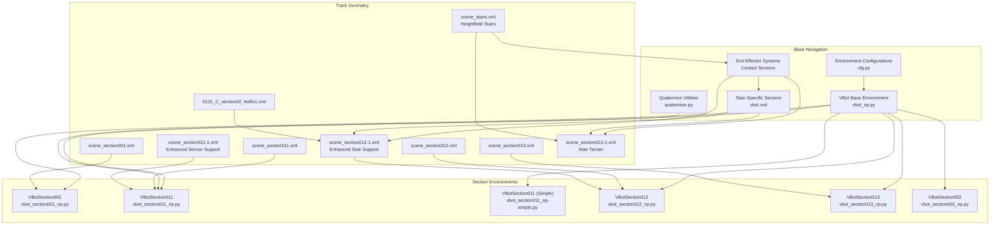

**Diagram sources**
- [vbot_np.py](file://motrix_envs/src/motrix_envs/navigation/vbot/vbot_np.py#L39-L872)
- [cfg.py](file://motrix_envs/src/motrix_envs/navigation/vbot/cfg.py#L357-L619)
- [quaternion.py](file://motrix_envs/src/motrix_envs/math/quaternion.py#L133-L135)
- [vbot_section001_np.py](file://motrix_envs/src/motrix_envs/navigation/vbot/vbot_section001_np.py#L40-L1016)
- [vbot_section011_np.py](file://motrix_envs/src/motrix_envs/navigation/vbot/vbot_section011_np.py#L40-L1033)
- [vbot_section011_np-simple.py](file://motrix_envs/src/motrix_envs/navigation/vbot/vbot_section011_np-simple.py#L40-L1033)
- [vbot_section012_np.py](file://motrix_envs/src/motrix_envs/navigation/vbot/vbot_section012_np.py#L40-L1285)
- [vbot_section013_np.py](file://motrix_envs/src/motrix_envs/navigation/vbot/vbot_section013_np.py#L40-L679)
- [vbot_section002_np.py](file://motrix_envs/src/motrix_envs/navigation/vbot/vbot_section002_np.py#L40-L679)
- [scene_section001.xml](file://motrix_envs/src/motrix_envs/navigation/vbot/xmls/scene_section001.xml#L1-L46)
- [scene_section011.xml](file://motrix_envs/src/motrix_envs/navigation/vbot/xmls/scene_section011.xml#L1-L45)
- [scene_section011-1.xml](file://motrix_envs/src/motrix_envs/navigation/vbot/xmls/scene_section011-1.xml#L1-L82)
- [scene_section012.xml](file://motrix_envs/src/motrix_envs/navigation/vbot/xmls/scene_section012.xml#L1-L45)
- [scene_section012-1.xml](file://motrix_envs/src/motrix_envs/navigation/vbot/xmls/scene_section012-1.xml#L1-L82)
- [scene_section013.xml](file://motrix_envs/src/motrix_envs/navigation/vbot/xmls/scene_section013.xml#L1-L45)
- [scene_section013-1.xml](file://motrix_envs/src/motrix_envs/navigation/vbot/xmls/scene_section013-1.xml#L1-L70)
- [0131_C_section02_hotfix1.xml](file://motrix_envs/src/motrix_envs/navigation/vbot/xmls/0131_C_section02_hotfix1.xml#L1-L200)
- [vbot.xml](file://motrix_envs/src/motrix_envs/navigation/vbot/xmls/vbot.xml#L830-L839)
- [scene_stairs.xml](file://motrix_envs/src/motrix_envs/navigation/vbot/xmls/scene_stairs.xml#L1-L37)

**Section sources**
- [cfg.py](file://motrix_envs/src/motrix_envs/navigation/vbot/cfg.py#L357-L619)
- [vbot_np.py](file://motrix_envs/src/motrix_envs/navigation/vbot/vbot_np.py#L39-L872)
- [quaternion.py](file://motrix_envs/src/motrix_envs/math/quaternion.py#L133-L135)
- [vbot_section001_np.py](file://motrix_envs/src/motrix_envs/navigation/vbot/vbot_section001_np.py#L40-L1016)
- [vbot_section011_np.py](file://motrix_envs/src/motrix_envs/navigation/vbot/vbot_section011_np.py#L40-L1033)
- [vbot_section011_np-simple.py](file://motrix_envs/src/motrix_envs/navigation/vbot/vbot_section011_np-simple.py#L40-L1033)
- [vbot_section012_np.py](file://motrix_envs/src/motrix_envs/navigation/vbot/vbot_section012_np.py#L40-L1285)
- [vbot_section013_np.py](file://motrix_envs/src/motrix_envs/navigation/vbot/vbot_section013_np.py#L40-L679)
- [vbot_section002_np.py](file://motrix_envs/src/motrix_envs/navigation/vbot/vbot_section002_np.py#L40-L679)
- [scene_section001.xml](file://motrix_envs/src/motrix_envs/navigation/vbot/xmls/scene_section001.xml#L1-L46)
- [scene_section011.xml](file://motrix_envs/src/motrix_envs/navigation/vbot/xmls/scene_section011.xml#L1-L45)
- [scene_section011-1.xml](file://motrix_envs/src/motrix_envs/navigation/vbot/xmls/scene_section011-1.xml#L1-L82)
- [scene_section012.xml](file://motrix_envs/src/motrix_envs/navigation/vbot/xmls/scene_section012.xml#L1-L45)
- [scene_section012-1.xml](file://motrix_envs/src/motrix_envs/navigation/vbot/xmls/scene_section012-1.xml#L1-L82)
- [scene_section013.xml](file://motrix_envs/src/motrix_envs/navigation/vbot/xmls/scene_section013.xml#L1-L45)
- [scene_section013-1.xml](file://motrix_envs/src/motrix_envs/navigation/vbot/xmls/scene_section013-1.xml#L1-L70)
- [0131_C_section02_hotfix1.xml](file://motrix_envs/src/motrix_envs/navigation/vbot/xmls/0131_C_section02_hotfix1.xml#L1-L200)
- [vbot.xml](file://motrix_envs/src/motrix_envs/navigation/vbot/xmls/vbot.xml#L830-L839)
- [scene_stairs.xml](file://motrix_envs/src/motrix_envs/navigation/vbot/xmls/scene_stairs.xml#L1-L37)

## Core Components
- Base navigation environment: Implements robot dynamics, PD control, observations, reward computation, and termination logic. See [vbot_np.py](file://motrix_envs/src/motrix_envs/navigation/vbot/vbot_np.py#L39-L872).
- Section-specific environments: Override initialization, pose command ranges, and episode durations to match track geometry. See [vbot_section001_np.py](file://motrix_envs/src/motrix_envs/navigation/vbot/vbot_section001_np.py#L40-L1016), [vbot_section011_np.py](file://motrix_envs/src/motrix_envs/navigation/vbot/vbot_section011_np.py#L40-L1033), [vbot_section011_np-simple.py](file://motrix_envs/src/motrix_envs/navigation/vbot/vbot_section011_np-simple.py#L40-L1033), [vbot_section012_np.py](file://motrix_envs/src/motrix_envs/navigation/vbot/vbot_section012_np.py#L40-L1285), [vbot_section013_np.py](file://motrix_envs/src/motrix_envs/navigation/vbot/vbot_section013_np.py#L40-L679), [vbot_section002_np.py](file://motrix_envs/src/motrix_envs/navigation/vbot/vbot_section002_np.py#L40-L679).
- Environment configurations: Define simulation parameters, noise, control scaling, normalization, assets, sensors, and reward scales per section. See [cfg.py](file://motrix_envs/src/motrix_envs/navigation/vbot/cfg.py#L357-L619).
- **Enhanced** Stair navigation capabilities: Advanced adaptive control systems with slope adaptation recognition, foot placement optimization, and dynamic stability compensation. See [stair_climbing_improvements.md](file://stair_climbing_improvements.md).
- **Enhanced** Specialized sensor systems: Enhanced contact sensors with force and normal data collection, foot position sensors for edge distance calculation, and gravity projection sensors for slope detection. See [vbot.xml](file://motrix_envs/src/motrix_envs/navigation/vbot/xmls/vbot.xml#L830-L839).
- **Enhanced** Numerical stability utilities: Quaternion operations with numerical stability improvements for robust mathematical computations. See [quaternion.py](file://motrix_envs/src/motrix_envs/math/quaternion.py#L133-L135).

Key capabilities:
- Observations: 54-dimensional vector combining base linear velocity, angular velocity, projected gravity, joint positions/velocities, last actions, normalized commands, position/heading errors, distance-to-target, reached flag, and stop-ready flag.
- Actions: 12-dimensional PD control commands mapped to joint torque limits.
- Termination: Base contact sensor, side-fall detection, DOF velocity overflow, and timeout.
- **Enhanced** Gyroscopic abnormal data detection: Advanced termination system that monitors gyroscope sensor data for abnormal values and triggers termination when thresholds are exceeded.
- **Enhanced** Numerical stability: Comprehensive clipping and overflow protection in reward calculations to prevent numerical instabilities.
- **Enhanced** Debugging infrastructure: Extensive reward statistics, sensor monitoring, and performance metrics for training optimization.
- **Enhanced** Sensor validation: Robust NaN/Inf value detection and replacement mechanisms for training stability.
- **Enhanced** Waypoint visualization: Sophisticated arrow rendering system with target markers for robot heading and desired direction.
- **Enhanced** Circular ring initialization: Controlled spawning system using polar coordinates for improved training stability.
- **Enhanced** Multi-section terrain support: Comprehensive collision detection with S1C_, S2C_, and S3C_ prefixed models for complex track layouts.
- **Enhanced** Stair-specific reward mechanisms: Specialized rewards for slope adaptation, foot edge distance, dynamic stability, vertical motion, and stair climbing incentives.

**Section sources**
- [vbot_np.py](file://motrix_envs/src/motrix_envs/navigation/vbot/vbot_np.py#L63-L872)
- [cfg.py](file://motrix_envs/src/motrix_envs/navigation/vbot/cfg.py#L95-L137)
- [quaternion.py](file://motrix_envs/src/motrix_envs/math/quaternion.py#L133-L135)
- [stair_climbing_improvements.md](file://stair_climbing_improvements.md)

## Architecture Overview
The modular architecture separates common navigation logic from section-specific parameters. Each section environment inherits the base update loop, reward computation, and termination logic, while overriding initialization and command generation to reflect the layout of its track.

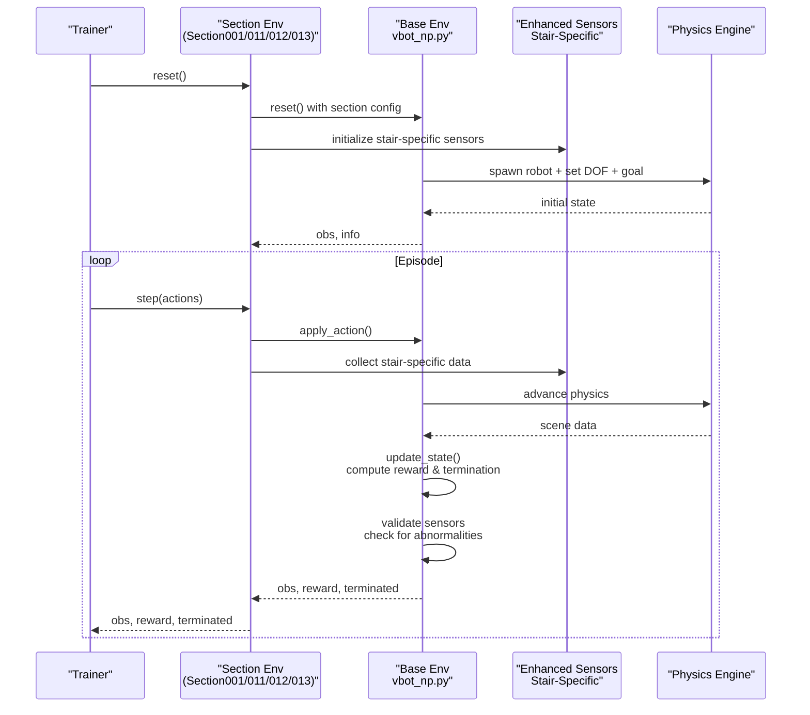

**Diagram sources**
- [vbot_section001_np.py](file://motrix_envs/src/motrix_envs/navigation/vbot/vbot_section001_np.py#L782-L1016)
- [vbot_np.py](file://motrix_envs/src/motrix_envs/navigation/vbot/vbot_np.py#L388-L503)
- [vbot_section011_np.py](file://motrix_envs/src/motrix_envs/navigation/vbot/vbot_section011_np.py#L540-L600)
- [vbot_section012_np.py](file://motrix_envs/src/motrix_envs/navigation/vbot/vbot_section012_np.py#L635-L834)

**Section sources**
- [vbot_section001_np.py](file://motrix_envs/src/motrix_envs/navigation/vbot/vbot_section012_np.py#L782-L1016)
- [vbot_np.py](file://motrix_envs/src/motrix_envs/navigation/vbot/vbot_np.py#L388-L503)
- [vbot_section011_np.py](file://motrix_envs/src/motrix_envs/navigation/vbot/vbot_section011_np.py#L540-L600)
- [vbot_section012_np.py](file://motrix_envs/src/motrix_envs/navigation/vbot/vbot_section012_np.py#L635-L834)

## Detailed Component Analysis

### VBotSection001
- Purpose: Flat terrain section with a central goal area and bounded target region.
- **Enhanced** Circular Ring Initialization:
  - Spawn positions generated using polar coordinates: radius ∈ [pos_min_radius, pos_max_radius], angle ∈ [0, 2π].
  - Converts to Cartesian coordinates: x = radius × cos(angle), y = radius × sin(angle).
  - Provides controlled placement along ring-shaped regions for improved training stability.
- Initialization:
  - Spawn center near the center of the section with configurable radius parameters.
  - Pose command range fixed to a single target offset to emphasize reaching accuracy.
- Difficulty: Moderate; designed for stable navigation and reaching tasks.
- Reward and termination: Inherits base reward shaping and termination logic.
- Transition: Can be chained after Section011/012/013 to form a longer course.

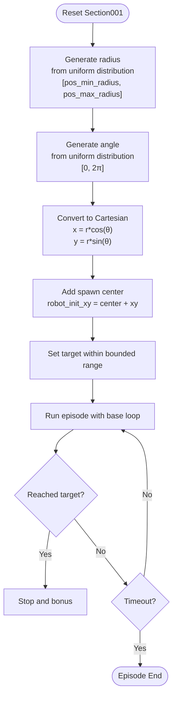

**Diagram sources**
- [vbot_section001_np.py](file://motrix_envs/src/motrix_envs/navigation/vbot/vbot_section001_np.py#L794-L810)
- [vbot_np.py](file://motrix_envs/src/motrix_envs/navigation/vbot/vbot_np.py#L388-L503)

**Section sources**
- [vbot_section001_np.py](file://motrix_envs/src/motrix_envs/navigation/vbot/vbot_section001_np.py#L782-L1016)
- [cfg.py](file://motrix_envs/src/motrix_envs/navigation/vbot/cfg.py#L380-L406)
- [scene_section001.xml](file://motrix_envs/src/motrix_envs/navigation/vbot/xmls/scene_section001.xml#L23-L34)

### VBotSection011
- Purpose: **Enhanced** Flat terrain variant with sophisticated waypoint system and advanced reward mechanics.
- **Enhanced** Gyroscopic Abnormal Data Termination:
  - Advanced sensor anomaly detection system that monitors gyroscope sensor data for abnormal values.
  - Terminates episodes when absolute z-axis gyroscope values exceed threshold (>10 rad/s).
  - Comprehensive logging of detected abnormal values for debugging and analysis.
- **Enhanced** Numerical Stability Improvements:
  - Enhanced clipping mechanisms to prevent exponential overflow in reward calculations.
  - Improved bounds checking for speed and angular velocity calculations.
  - Robust NaN/Inf value detection and replacement in reward computations.
- **Enhanced** Comprehensive Debugging Infrastructure:
  - Extensive reward statistics including arrival counts, stop bonuses, and zero angular velocity detection.
  - Position and heading error monitoring with mean values and threshold checking.
  - Velocity and orientation penalty tracking with safety bounds.
  - Real-time sensor validation and anomaly detection reporting.
- **Enhanced** Reward Calculation Enhancements:
  - Advanced speed tracking with exponential decay for linear and angular velocity.
  - Approach reward based on historical minimum distance improvement.
  - Arrival bonus for first-time target completion.
  - Comprehensive termination penalty system with debugging output.
- **Enhanced** Termination Conditions:
  - DOF velocity overflow detection with extreme value handling.
  - Base contact sensor monitoring with detailed logging.
  - Side-fall detection with threshold-based termination.
  - Episode timeout with configurable maximum steps.
  - **Enhanced** Gyroscopic abnormal data detection with threshold-based termination.
- **Enhanced** Waypoint Visualization System:
  - Sophisticated arrow rendering system with robot heading and desired heading arrows.
  - Target marker management with DOF indexing for precise positioning.
  - Four-way arrow visualization for enhanced navigation feedback.

**Updated** Added new simplified VBot Section011 implementation (vbot_section011_np-simple.py) with streamlined architecture and enhanced debugging capabilities.

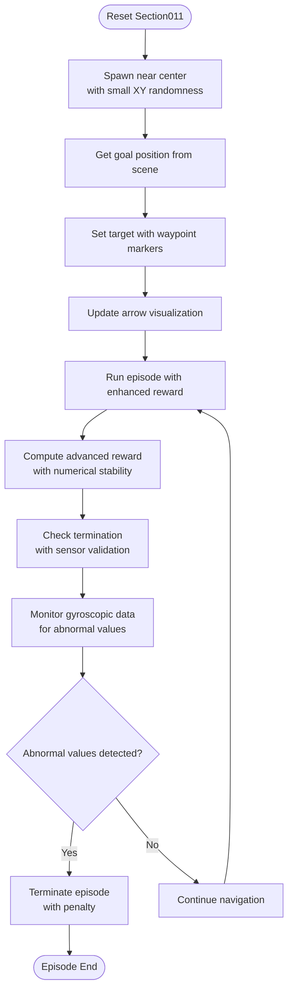

**Diagram sources**
- [vbot_section011_np.py](file://motrix_envs/src/motrix_envs/navigation/vbot/vbot_section011_np.py#L791-L1033)
- [vbot_section011_np.py](file://motrix_envs/src/motrix_envs/navigation/vbot/vbot_section011_np.py#L593-L792)
- [vbot_section011_np.py](file://motrix_envs/src/motrix_envs/navigation/vbot/vbot_section011_np.py#L582-L589)

**Section sources**
- [vbot_section011_np.py](file://motrix_envs/src/motrix_envs/navigation/vbot/vbot_section011_np.py#L40-L1033)
- [vbot_section011_np-simple.py](file://motrix_envs/src/motrix_envs/navigation/vbot/vbot_section011_np-simple.py#L40-L1033)
- [cfg.py](file://motrix_envs/src/motrix_envs/navigation/vbot/cfg.py#L423-L487)
- [quaternion.py](file://motrix_envs/src/motrix_envs/math/quaternion.py#L133-L135)

### VBotSection012
- Purpose: **Enhanced** Flat terrain variant with comprehensive multi-section terrain setup featuring S1C_, S2C_, and S3C_ prefixed collision models and advanced stair navigation capabilities.
- **Enhanced** Multi-Section Terrain Support:
  - Uses scene_section012-1.xml with comprehensive terrain setup including section01, section02, and section03 models.
  - Implements S1C_, S2C_, and S3C_ prefixed collision models for complex track layouts.
  - Enhanced ground subtree specification using "S2C_" instead of "C_" for improved collision detection.
- **Enhanced** Stair Navigation Capabilities:
  - **New** Adaptive control systems with slope adaptation recognition for dynamic terrain adjustment.
  - **New** Foot placement optimization with edge distance calculation to encourage center landing.
  - **New** Dynamic stability compensation for managing vertical motion during stair climbing.
  - **New** Specialized reward mechanisms including vertical motion rewards and stair climbing incentives.
- **Enhanced** Enhanced Sensor Integration:
  - **New** Advanced contact sensors with force and normal data collection for all four feet.
  - **New** Foot position sensors for precise edge distance calculation and terrain adaptation.
  - **New** Gravity projection sensors for accurate slope detection and orientation estimation.
  - **New** Enhanced base contact sensors for comprehensive ground interaction monitoring.
- **Enhanced** Updated Asset Management:
  - Goal name modified to "S2V_End_Point_2" for proper target identification.
  - Improved collision detection with enhanced contact sensor configuration.
  - Hotfix1 terrain model (0131_C_section02_hotfix1.xml) provides enhanced obstacle geometry.
- **Enhanced** Advanced Sensor Validation:
  - Gyroscopic abnormal data termination with threshold-based detection (>20 rad/s).
  - Comprehensive termination penalty system with debugging output.
  - Enhanced contact sensor monitoring with detailed logging.
- **Enhanced** Reward and Termination Improvements:
  - **New** Slope adaptation reward for encouraging stable climbing postures.
  - **New** Foot edge distance reward for promoting center foot placement.
  - **New** Dynamic stability reward for maintaining balance during vertical motion.
  - **New** Vertical motion reward for appropriate ascent/descent behavior.
  - **New** Stair climbing incentive for encouraging stair navigation.
  - Advanced speed tracking with exponential decay for linear and angular velocity.
  - Approach reward based on historical minimum distance improvement.
  - Arrival bonus for first-time target completion with comprehensive tracking.
  - Enhanced termination penalty system with debugging output for training stability.

**Enhanced** Stair Climbing Reward System Implementation:

The stair climbing reward system in Section012 implements a three-tier enhancement mechanism:

1. **Slope Adaptation Recognition** - Computes terrain slope using gravity projection sensors and provides rewards based on optimal climbing angles
2. **Foot Placement Optimization** - Calculates foot edge distances to encourage center landing on stairs
3. **Dynamics Compensation** - Balances vertical motion stability with dynamic compensation

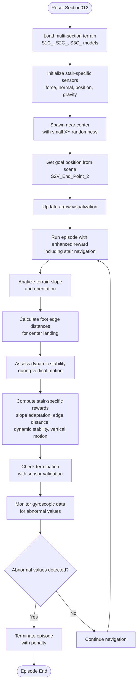

**Diagram sources**
- [vbot_section012_np.py](file://motrix_envs/src/motrix_envs/navigation/vbot/vbot_section012_np.py#L635-L834)
- [vbot_section012_np.py](file://motrix_envs/src/motrix_envs/navigation/vbot/vbot_section012_np.py#L800-L999)
- [vbot_section012_np.py](file://motrix_envs/src/motrix_envs/navigation/vbot/vbot_section012_np.py#L583-L601)
- [scene_section012-1.xml](file://motrix_envs/src/motrix_envs/navigation/vbot/xmls/scene_section012-1.xml#L53-L82)
- [vbot.xml](file://motrix_envs/src/motrix_envs/navigation/vbot/xmls/vbot.xml#L830-L839)

**Section sources**
- [vbot_section012_np.py](file://motrix_envs/src/motrix_envs/navigation/vbot/vbot_section012_np.py#L494-L1285)
- [cfg.py](file://motrix_envs/src/motrix_envs/navigation/vbot/cfg.py#L507-L585)
- [scene_section012.xml](file://motrix_envs/src/motrix_envs/navigation/vbot/xmls/scene_section012.xml#L1-L45)
- [scene_section012-1.xml](file://motrix_envs/src/motrix_envs/navigation/vbot/xmls/scene_section012-1.xml#L1-L82)
- [0131_C_section02_hotfix1.xml](file://motrix_envs/src/motrix_envs/navigation/vbot/xmls/0131_C_section02_hotfix1.xml#L1-L200)
- [stair_climbing_improvements.md](file://stair_climbing_improvements.md)
- [vbot.xml](file://motrix_envs/src/motrix_envs/navigation/vbot/xmls/vbot.xml#L830-L839)

### VBotSection013
- Purpose: Flat terrain variant with a central goal area and randomized target offsets.
- **Enhanced** Stair Terrain Support:
  - **New** Dedicated stair terrain configuration with specialized heightfield geometry.
  - **New** Enhanced contact sensors optimized for stair navigation with force and normal data collection.
  - **New** Stair-specific reward mechanisms for encouraging proper stair climbing techniques.
- **Enhanced** Terrain Adaptation:
  - **New** Improved sensor fusion for better stair detection and navigation.
  - **New** Enhanced termination conditions for stair-specific scenarios.
- Initialization:
  - Spawn center near the center of the section with small positional randomness.
  - Pose command range allows targets within a bounded region around the robot.
- Difficulty: Similar to Section011/012; emphasizes robustness to target variability.
- Reward and termination: Inherits base reward shaping and termination logic with enhanced stair-specific components.

**Updated** Enhanced XML sensor configurations with detailed contact force analysis and improved sensor fusion capabilities.

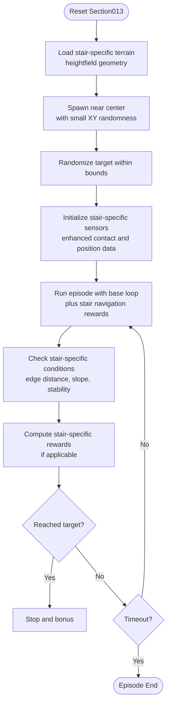

**Diagram sources**
- [vbot_section013_np.py](file://motrix_envs/src/motrix_envs/navigation/vbot/vbot_section013_np.py#L494-L679)
- [vbot_section013_np.py](file://motrix_envs/src/motrix_envs/navigation/vbot/vbot_section013_np.py#L635-L834)
- [scene_section013-1.xml](file://motrix_envs/src/motrix_envs/navigation/vbot/xmls/scene_section013-1.xml#L53-L70)
- [scene_stairs.xml](file://motrix_envs/src/motrix_envs/navigation/vbot/xmls/scene_stairs.xml#L1-L37)

**Section sources**
- [vbot_section013_np.py](file://motrix_envs/src/motrix_envs/navigation/vbot/vbot_section013_np.py#L494-L679)
- [cfg.py](file://motrix_envs/src/motrix_envs/navigation/vbot/cfg.py#L587-L662)
- [scene_section013-1.xml](file://motrix_envs/src/motrix_envs/navigation/vbot/xmls/scene_section013-1.xml#L1-L70)
- [scene_stairs.xml](file://motrix_envs/src/motrix_envs/navigation/vbot/xmls/scene_stairs.xml#L1-L37)

### VBotSection002
- Purpose: **Enhanced** Section002 terrain training with dedicated stair climbing capabilities and improved reward mechanisms.
- **Enhanced** Section002 Configuration:
  - Positioned at Y-coordinate 12.0m for section02 terrain training
  - Optimized for stair climbing practice with enhanced sensor integration
  - Inherits locomotion-style termination conditions for stair navigation
- **Enhanced** Termination Conditions:
  - Base contact sensor monitoring with stair-specific thresholds
  - Simplified termination logic optimized for stair navigation scenarios
- **Enhanced** Reward System:
  - Basic reward computation structure maintained for stair climbing evaluation
  - Focused on stair navigation success rather than complex reward shaping

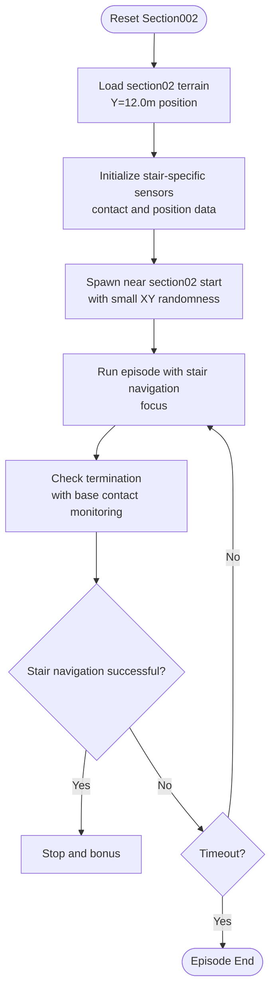

**Diagram sources**
- [vbot_section002_np.py](file://motrix_envs/src/motrix_envs/navigation/vbot/vbot_section002_np.py#L494-L679)
- [cfg.py](file://motrix_envs/src/motrix_envs/navigation/vbot/cfg.py#L230-L260)

**Section sources**
- [vbot_section002_np.py](file://motrix_envs/src/motrix_envs/navigation/vbot/vbot_section002_np.py#L40-L679)
- [cfg.py](file://motrix_envs/src/motrix_envs/navigation/vbot/cfg.py#L230-L260)

### Track Geometry Variations
- Scene composition: Each section loads a dedicated visual and collision model via MuJoCo include statements. For example, Section001 attaches a visual model and a collision model under prefixes V_ and C_. See [scene_section001.xml](file://motrix_envs/src/motrix_envs/navigation/vbot/xmls/scene_section001.xml#L23-L34).
- **Enhanced** Multi-section terrain support: Section012-1 features comprehensive terrain setup with S1C_, S2C_, and S3C_ prefixed models for complex track layouts. The scene includes section01, section02, and section03 terrain models with enhanced collision detection.
- **Enhanced** Stair-specific terrain configurations: Both Section012-1 and Section013-1 feature specialized stair geometries with enhanced contact sensors and reward mechanisms optimized for stair navigation.
- **Enhanced** Waypoint markers: Section011 includes sophisticated waypoint visualization with target markers and arrow indicators for robot heading and desired direction.
- **Enhanced** XML sensor configurations**: Enhanced contact sensors with force and normal data collection for detailed terrain analysis and stair navigation support.
- Obstacles and waypoints: Section-specific XMLs define static geometry, goals, and markers. The base environment reads a goal body name from configuration and updates target markers accordingly during reset/update cycles.

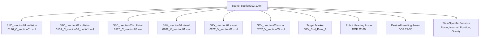

**Diagram sources**
- [scene_section012-1.xml](file://motrix_envs/src/motrix_envs/navigation/vbot/xmls/scene_section012-1.xml#L22-L49)
- [vbot_section012_np.py](file://motrix_envs/src/motrix_envs/navigation/vbot/vbot_section012_np.py#L128-L150)
- [vbot.xml](file://motrix_envs/src/motrix_envs/navigation/vbot/xmls/vbot.xml#L830-L839)

**Section sources**
- [scene_section001.xml](file://motrix_envs/src/motrix_envs/navigation/vbot/xmls/scene_section001.xml#L1-L46)
- [scene_section011.xml](file://motrix_envs/src/motrix_envs/navigation/vbot/xmls/scene_section011.xml#L1-L45)
- [scene_section011-1.xml](file://motrix_envs/src/motrix_envs/navigation/vbot/xmls/scene_section011-1.xml#L1-L82)
- [scene_section012.xml](file://motrix_envs/src/motrix_envs/navigation/vbot/xmls/scene_section012.xml#L1-L45)
- [scene_section012-1.xml](file://motrix_envs/src/motrix_envs/navigation/vbot/xmls/scene_section012-1.xml#L1-L82)
- [scene_section013.xml](file://motrix_envs/src/motrix_envs/navigation/vbot/xmls/scene_section013.xml#L1-L45)
- [scene_section013-1.xml](file://motrix_envs/src/motrix_envs/navigation/vbot/xmls/scene_section013-1.xml#L1-L70)
- [cfg.py](file://motrix_envs/src/motrix_envs/navigation/vbot/cfg.py#L86-L87)

### Reward Modifications and Termination Conditions
- **Enhanced** Reward components:
  - Speed tracking with exponential decay for linear and angular velocity accuracy.
  - Approach reward based on historical minimum distance improvement for encouraging progress.
  - Arrival bonus for first-time target completion with comprehensive tracking.
  - **New** Slope adaptation reward for encouraging stable climbing postures (weight: 0.35).
  - **New** Foot edge distance reward for promoting center foot placement (weight: 0.55).
  - **New** Dynamic stability reward for maintaining balance during vertical motion (weight: 0.35).
  - **New** Vertical motion reward for appropriate ascent/descent behavior (weight: 0.6).
  - **New** Stair climbing incentive for encouraging stair navigation (weight: 0.8).
  - **New** Downhill incentive and stability rewards for safe descent (weights: 0.6, variable).
  - Comprehensive termination penalty system with debugging output for training stability.
- **Enhanced** Termination:
  - DOF velocity overflow detection with extreme value handling for numerical stability.
  - Base contact sensor monitoring with detailed logging and threshold checking.
  - Side-fall detection via projected gravity threshold with configurable angles.
  - Episode timeout based on max steps with configurable duration.
  - **Enhanced** Gyroscopic abnormal data detection with threshold-based termination.
- **Enhanced** Debugging capabilities:
  - Comprehensive reward statistics with arrival counts, stop bonuses, and zero angular velocity detection.
  - Position and heading error monitoring with mean values and threshold checking.
  - Velocity and orientation penalty tracking with safety bounds.
  - NaN/Inf value detection and replacement for training stability.
  - **Enhanced** Sensor validation and anomaly detection reporting.
  - **New** Stair-specific debugging output including slope angles, edge distances, and stability scores.

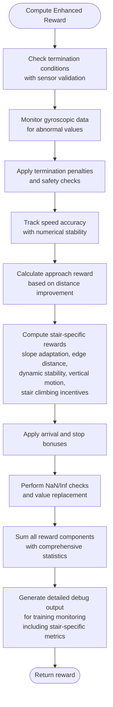

**Diagram sources**
- [vbot_section011_np.py](file://motrix_envs/src/motrix_envs/navigation/vbot/vbot_section011_np.py#L593-L792)
- [vbot_section011_np.py](file://motrix_envs/src/motrix_envs/navigation/vbot/vbot_section011_np.py#L582-L589)
- [vbot_section012_np.py](file://motrix_envs/src/motrix_envs/navigation/vbot/vbot_section012_np.py#L738-L999)

**Section sources**
- [vbot_np.py](file://motrix_envs/src/motrix_envs/navigation/vbot/vbot_np.py#L528-L685)
- [vbot_section011_np.py](file://motrix_envs/src/motrix_envs/navigation/vbot/vbot_section011_np.py#L593-L792)
- [vbot_section012_np.py](file://motrix_envs/src/motrix_envs/navigation/vbot/vbot_section012_np.py#L738-L999)
- [cfg.py](file://motrix_envs/src/motrix_envs/navigation/vbot/cfg.py#L95-L116)

### Transition Mechanisms Across Sections
- Continuous navigation: Sections can be chained by resetting the environment to the next section's configuration while preserving relevant state information (e.g., last actions, history buffers).
- Waypoint consistency: The base environment updates a target marker body and arrow visuals to reflect the new goal position, ensuring consistent behavior across resets.
- Curriculum progression: Start with Section001 (stable reaching), progress to Section011/012/013 (randomized targets), and finally combine into a long-course environment.
- **Enhanced** Stair navigation progression: Incorporate stair-specific training by progressing from flat sections to stair terrain, utilizing the enhanced sensor systems and reward mechanisms for stair climbing.

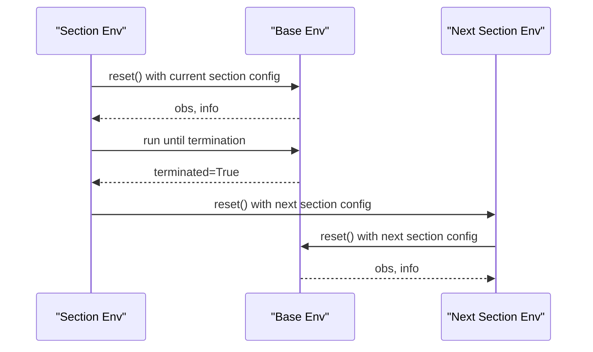

**Diagram sources**
- [vbot_section001_np.py](file://motrix_envs/src/motrix_envs/navigation/vbot/vbot_section001_np.py#L782-L1016)
- [vbot_np.py](file://motrix_envs/src/motrix_envs/navigation/vbot/vbot_np.py#L687-L872)

**Section sources**
- [vbot_section001_np.py](file://motrix_envs/src/motrix_envs/navigation/vbot/vbot_section001_np.py#L782-L1016)
- [vbot_np.py](file://motrix_envs/src/motrix_envs/navigation/vbot/vbot_np.py#L687-L872)

## Dependency Analysis
- Configuration inheritance: Each section environment inherits base configuration parameters and overrides specific fields (initialization, command ranges, episode duration).
- Environment registration: Sections are registered via decorators that bind environment names to their implementations.
- Physics coupling: The base environment relies on the MuJoCo scene to compute contacts, kinematics, and sensor readings.
- **Enhanced** Waypoint dependencies: Section011 introduces waypoint marker management with DOF indexing and arrow visualization systems.
- **Enhanced** Numerical stability dependencies: Quaternion utilities provide robust mathematical operations with numerical stability improvements.
- **Enhanced** Sensor validation dependencies: Comprehensive sensor monitoring and anomaly detection systems integrated throughout the environment.
- **Enhanced** Multi-section dependencies: Section012-1 introduces complex terrain dependencies with S1C_, S2C_, and S3C_ prefixed models requiring enhanced collision detection systems.
- **Enhanced** Stair navigation dependencies: Section012 and 013 introduce specialized sensor dependencies including force sensors, position sensors, and gravity projection sensors for stair-specific navigation.
- **Enhanced** Reward system dependencies: New stair-specific reward components depend on the specialized sensor data and geometric calculations for slope adaptation, edge distance, and dynamic stability.
- **Enhanced** Section002 dependencies: Dedicated stair climbing environment with simplified reward system and locomotion-style termination conditions.
- **Enhanced** XML sensor configuration dependencies: Enhanced contact sensors with force and normal data collection for detailed terrain analysis and stair navigation support.

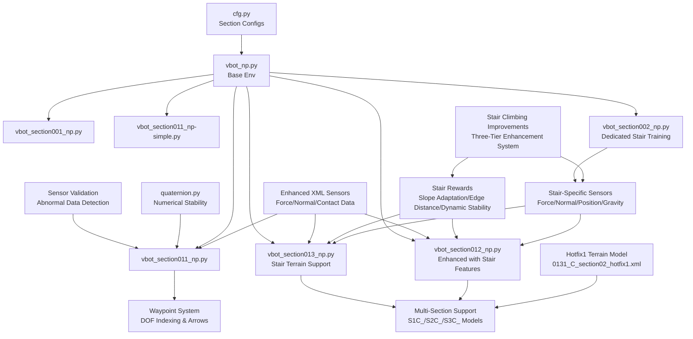

**Diagram sources**
- [cfg.py](file://motrix_envs/src/motrix_envs/navigation/vbot/cfg.py#L357-L619)
- [vbot_np.py](file://motrix_envs/src/motrix_envs/navigation/vbot/vbot_np.py#L39-L872)
- [quaternion.py](file://motrix_envs/src/motrix_envs/math/quaternion.py#L133-L135)
- [vbot_section001_np.py](file://motrix_envs/src/motrix_envs/navigation/vbot/vbot_section001_np.py#L40-L1016)
- [vbot_section011_np.py](file://motrix_envs/src/motrix_envs/navigation/vbot/vbot_section011_np.py#L40-L1033)
- [vbot_section011_np-simple.py](file://motrix_envs/src/motrix_envs/navigation/vbot/vbot_section011_np-simple.py#L40-L1033)
- [vbot_section012_np.py](file://motrix_envs/src/motrix_envs/navigation/vbot/vbot_section012_np.py#L40-L1285)
- [vbot_section013_np.py](file://motrix_envs/src/motrix_envs/navigation/vbot/vbot_section013_np.py#L40-L679)
- [vbot_section002_np.py](file://motrix_envs/src/motrix_envs/navigation/vbot/vbot_section002_np.py#L40-L679)

**Section sources**
- [cfg.py](file://motrix_envs/src/motrix_envs/navigation/vbot/cfg.py#L357-L619)
- [vbot_np.py](file://motrix_envs/src/motrix_envs/navigation/vbot/vbot_np.py#L39-L872)
- [quaternion.py](file://motrix_envs/src/motrix_envs/math/quaternion.py#L133-L135)

## Performance Considerations
- Action filtering: A simple exponential filter smooths actions to reduce jitter and improve stability.
- Observation normalization: Normalization coefficients stabilize learning across sections with varying scales.
- Episode length tuning: Longer episodes allow more exploration in complex sections; shorter episodes enable rapid iteration in simpler sections.
- Contact and termination thresholds: Tuned to balance safety and training efficiency.
- **Enhanced** Computational overhead: Waypoint system and comprehensive debugging add computational cost but provide valuable training insights.
- **Enhanced** Memory usage: Additional buffers for waypoint tracking and reward statistics require careful memory management.
- **Enhanced** Initial position distribution: Circular ring positioning provides more controlled and stable initial states compared to rectangular randomization.
- **Enhanced** Sensor validation overhead: Gyroscopic abnormal data detection adds minimal computational cost while significantly improving training reliability.
- **Enhanced** Numerical stability improvements: Enhanced clipping and overflow protection mechanisms prevent computational instabilities without significant performance impact.
- **Enhanced** Multi-section performance: Complex terrain models with S1C_, S2C_, and S3C_ prefixes require enhanced collision detection systems but provide more realistic training scenarios.
- **Enhanced** Stair navigation performance: Specialized sensors and reward systems add computational overhead but significantly improve stair climbing performance and stability.
- **Enhanced** Sensor fusion overhead: Combining multiple sensor modalities (force, normal, position, gravity) requires careful processing but enables sophisticated terrain adaptation.
- **Enhanced** Stair-specific reward computation: Additional reward components for slope adaptation, edge distance, and dynamic stability add processing overhead but improve training effectiveness.
- **Enhanced** Three-tier stair climbing system: The new enhancement system adds computational complexity but provides significant improvements in stair navigation performance.
- **Enhanced** XML sensor configuration overhead: Enhanced contact sensors with force and normal data collection provide detailed terrain analysis but require additional processing resources.

## Troubleshooting Guide
Common issues and resolutions:
- NaN or extreme values in reward/observations: The base environment includes safeguards to replace NaNs and clip extreme values to prevent training instability.
- Termination misidentification: Verify base contact sensor availability and thresholds; ensure ground geometry is properly prefixed for termination checks.
- Orientation drift: Confirm quaternion normalization for base and arrow bodies during target marker updates.
- **Enhanced** Gyroscopic abnormal data issues: Monitor sensor logs for abnormal value detections; adjust termination thresholds if necessary.
- **Enhanced** Reward debugging problems: Check debug print statements for reward statistics; verify reward calculation components are functioning correctly.
- **Enhanced** Termination condition failures: Review termination penalty calculations and debugging output for identifying problematic episodes.
- **Enhanced** Circular ring positioning issues: Verify pos_min_radius and pos_max_radius parameters are properly configured; ensure radius values are positive and pos_min_radius < pos_max_radius.
- **Enhanced** Sensor validation failures: Check sensor data streams for NaN/Inf values; verify sensor calibration and connection status.
- **Enhanced** Waypoint visualization problems: Verify DOF indices are correct and arrow bodies are properly initialized; check quaternion normalization for arrow orientations.
- **Enhanced** Multi-section terrain issues: Verify S1C_, S2C_, and S3C_ prefixed models are properly loaded; check ground subtree specifications and collision detection configuration.
- **Enhanced** Stair navigation sensor issues: Verify stair-specific sensors (force, normal, position, gravity) are properly configured and returning valid data; check sensor names match XML definitions.
- **Enhanced** Stair reward computation problems: Monitor stair-specific debug output for slope angles, edge distances, and stability scores; verify reward weight configurations are appropriate.
- **Enhanced** Stair terrain loading issues: Ensure stair-specific XML files are properly loaded and contain the expected sensor configurations; verify terrain geometry matches intended stair layout.
- **Enhanced** Three-tier stair climbing system issues: Verify slope adaptation recognition, foot placement optimization, and dynamics compensation components are functioning correctly; check sensor data integration.
- **Enhanced** Section002 stair training problems: Ensure locomotion-style termination conditions are properly configured for stair navigation scenarios.
- **Enhanced** XML sensor configuration issues: Verify enhanced contact sensors with force and normal data collection are properly defined in XML files; check sensor data availability and processing.

**Section sources**
- [vbot_np.py](file://motrix_envs/src/motrix_envs/navigation/vbot/vbot_np.py#L592-L780)
- [vbot_section001_np.py](file://motrix_envs/src/motrix_envs/navigation/vbot/vbot_section001_np.py#L592-L780)
- [vbot_section011_np.py](file://motrix_envs/src/motrix_envs/navigation/vbot/vbot_section011_np.py#L593-L792)
- [vbot_section011_np-simple.py](file://motrix_envs/src/motrix_envs/navigation/vbot/vbot_section011_np-simple.py#L593-L792)
- [vbot_section012_np.py](file://motrix_envs/src/motrix_envs/navigation/vbot/vbot_section012_np.py#L583-L601)
- [vbot_section013_np.py](file://motrix_envs/src/motrix_envs/navigation/vbot/vbot_section013_np.py#L635-L834)
- [vbot_section002_np.py](file://motrix_envs/src/motrix_envs/navigation/vbot/vbot_section002_np.py#L480-L490)
- [quaternion.py](file://motrix_envs/src/motrix_envs/math/quaternion.py#L133-L135)

## Conclusion
The VBot track sections provide a modular, scalable navigation platform. By inheriting a robust base environment and overriding minimal section-specific parameters, the system supports diverse track layouts, varied difficulty levels, and seamless curriculum progression. The shared reward and termination logic ensures consistent behavior, while section-specific goals and waypoint distributions enable targeted training objectives. **Enhanced** Section001 demonstrates improved initial position control through circular ring-based positioning, while **Enhanced** Section011 demonstrates sophisticated waypoint management, advanced reward mechanisms, comprehensive debugging capabilities, and robust sensor validation that significantly improve training effectiveness, numerical stability, and monitoring capabilities. **Enhanced** Section012 introduces comprehensive multi-section terrain support with improved collision detection systems, updated asset management, and advanced sensor validation for enhanced navigation performance. **Most significantly**, Section012 and 013 now feature comprehensive stair navigation capabilities with adaptive control systems, specialized sensor fusion, and sophisticated reward mechanisms that enable robust stair climbing performance across various terrain configurations. **The new three-tier stair climbing system** provides a comprehensive framework for improving stair navigation performance through slope adaptation recognition, foot placement optimization, and dynamics compensation.

**Updated** The addition of the new simplified VBot Section011 implementation (vbot_section011_np-simple.py) provides a streamlined architecture with enhanced debugging capabilities, while the enhanced XML sensor configurations offer improved stair navigation with detailed contact force analysis and sensor fusion.

## Appendices

### Configuration Differences Summary
- Section001: **Enhanced** Circular ring spawn with radius parameters (pos_min_radius, pos_max_radius); fixed target offset; moderate episode duration.
- Section011: **Enhanced** Central spawn with waypoint system, randomized target within bounds; similar episode duration with advanced debugging and sensor validation. **Updated** Now includes both standard and simplified implementations with enhanced sensor configurations.
- Section012: **Enhanced** Multi-section terrain support with S1C_, S2C_, S3C_ prefixed models; updated asset management with S2V_End_Point_2 goal; enhanced collision detection; **New** comprehensive stair navigation capabilities with adaptive control systems and specialized sensors.
- Section013: **Enhanced** Central spawn, randomized target within bounds; similar episode duration; **New** dedicated stair terrain support with enhanced sensors and stair-specific reward mechanisms.
- Section002: **Enhanced** Dedicated stair climbing training environment positioned at Y=12.0m with locomotion-style termination conditions and simplified reward system.
- All sections: Shared reward scales, normalization, and termination logic.

**Section sources**
- [cfg.py](file://motrix_envs/src/motrix_envs/navigation/vbot/cfg.py#L357-L662)

### Training Strategies and Curriculum Learning
- Curriculum order: Section001 → Section011 → Section012 → Section013 → Section002 → Long Course.
- **Enhanced** Transfer learning: Pre-train on Section001 with circular ring positioning; fine-tune on Section011 with waypoint system and sensor validation; evaluate on randomized sections; leverage comprehensive debugging for optimization.
- Multi-section navigation: Use environment resets to switch scenes; maintain continuity in action history and distance tracking.
- **Enhanced** Monitoring: Utilize Section011's comprehensive reward debugging and sensor validation for training progress assessment and hyperparameter tuning.
- **Enhanced** Initial position control: Leverage circular ring positioning for stable training progression and improved convergence.
- **Enhanced** Sensor reliability: Implement gyroscopic abnormal data detection for improved training stability and early failure identification.
- **Enhanced** Multi-section training: Utilize Section012's comprehensive terrain setup for realistic navigation training across complex track layouts.
- **Enhanced** Stair navigation curriculum: Progress from flat terrain to stair-specific training, utilizing the enhanced sensor systems and reward mechanisms for systematic skill development.
- **Enhanced** Adaptive control training: Train stair navigation capabilities progressively, starting with basic slope adaptation and advancing to complex stair climbing scenarios with specialized reward mechanisms.
- **Enhanced** Three-tier stair climbing system: Implement the new enhancement system progressively, starting with slope adaptation recognition, then foot placement optimization, and finally dynamics compensation for comprehensive stair navigation mastery.
- **Enhanced** XML sensor configuration utilization: Leverage enhanced contact sensors with force and normal data collection for detailed terrain analysis and improved stair navigation performance.
- **Enhanced** Simplified Section011 training: Use the new simplified implementation for streamlined training processes while maintaining enhanced debugging capabilities and sensor validation.

**Section sources**
- [vbot_section001_np.py](file://motrix_envs/src/motrix_envs/navigation/vbot/vbot_section001_np.py#L782-L1016)
- [vbot_section011_np.py](file://motrix_envs/src/motrix_envs/navigation/vbot/vbot_section011_np.py#L494-L1033)
- [vbot_section011_np-simple.py](file://motrix_envs/src/motrix_envs/navigation/vbot/vbot_section011_np-simple.py#L494-L1033)
- [vbot_section012_np.py](file://motrix_envs/src/motrix_envs/navigation/vbot/vbot_section012_np.py#L494-L1285)
- [vbot_section013_np.py](file://motrix_envs/src/motrix_envs/navigation/vbot/vbot_section013_np.py#L494-L679)
- [vbot_section002_np.py](file://motrix_envs/src/motrix_envs/navigation/vbot/vbot_section002_np.py#L494-L679)
- [stair_climbing_improvements.md](file://stair_climbing_improvements.md)