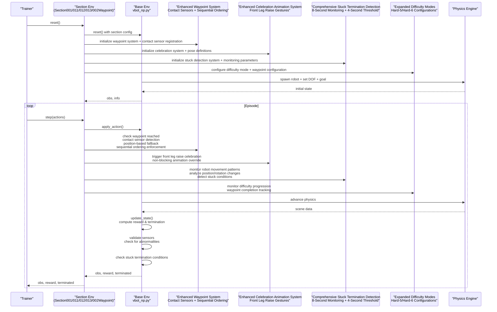
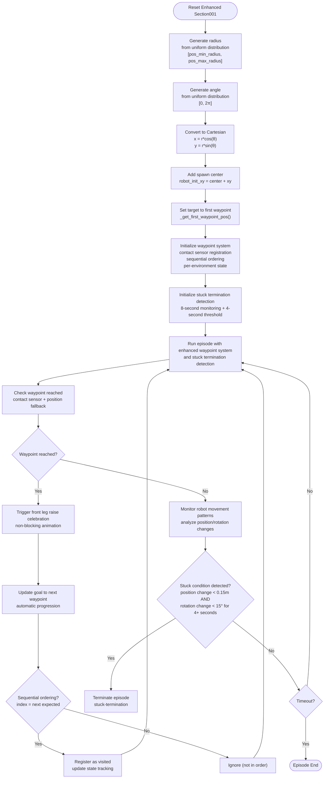
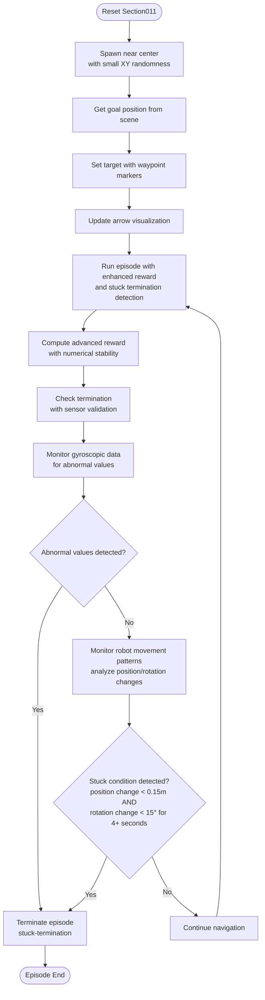
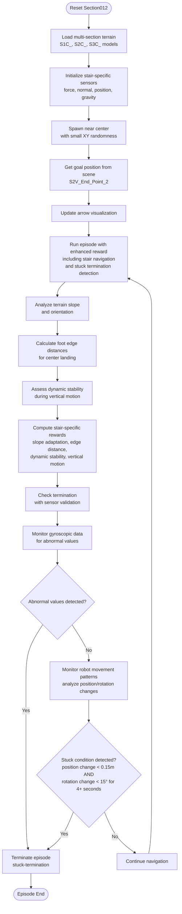
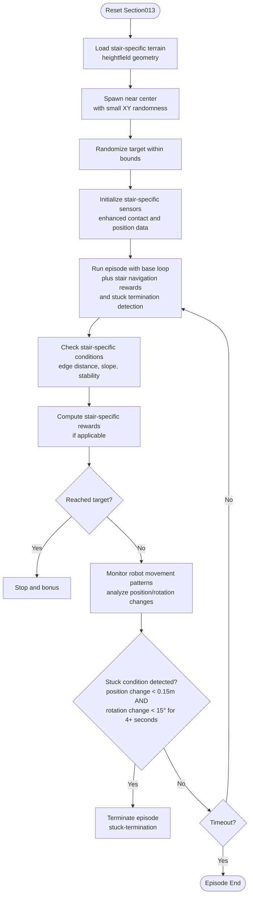
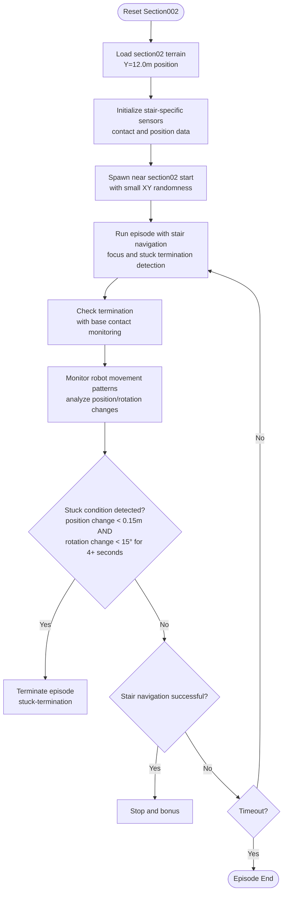
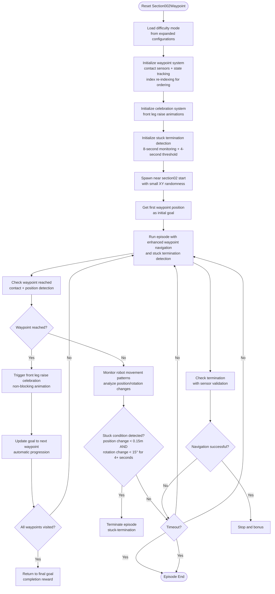
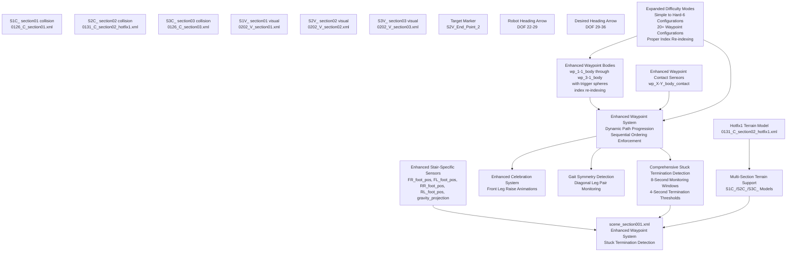
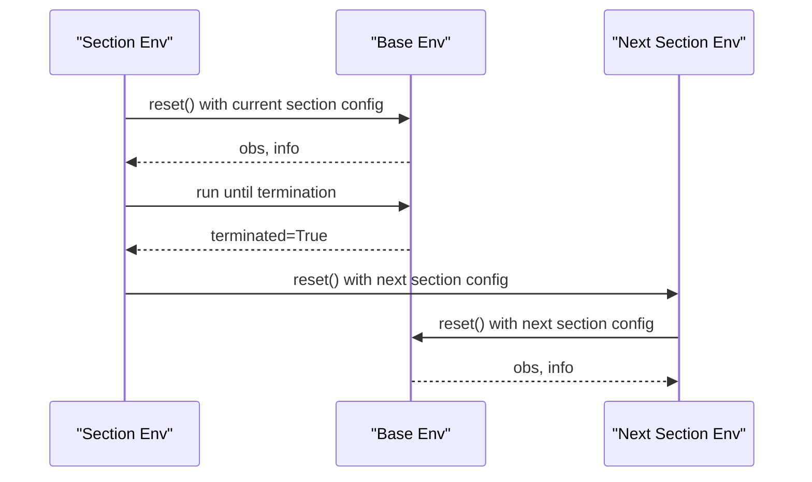
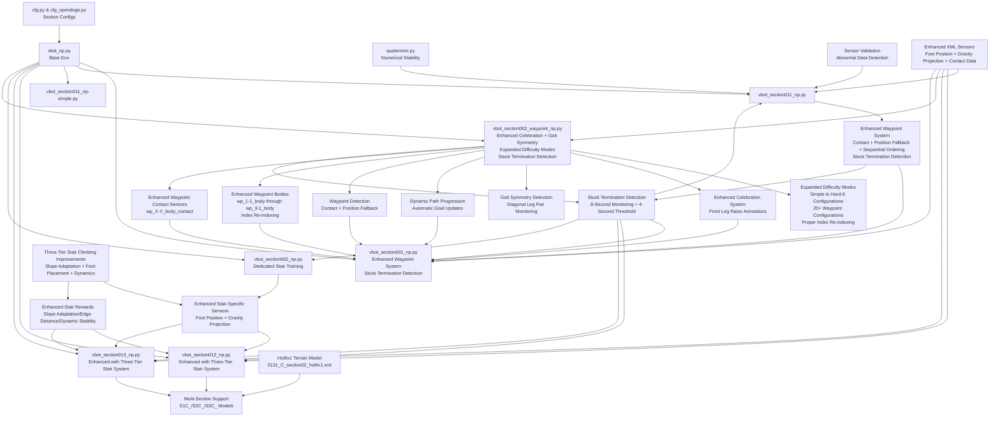

# Track Sections

<cite>
**Referenced Files in This Document**
- [cfg.py](file://motrix_envs/src/motrix_envs/navigation/vbot/cfg.py)
- [cfg_opendoge.py](file://motrix_envs/src/motrix_envs/navigation/vbot/cfg_opendoge.py)
- [vbot_np.py](file://motrix_envs/src/motrix_envs/navigation/vbot/vbot_np.py)
- [vbot_section001_np.py](file://motrix_envs/src/motrix_envs/navigation/vbot/vbot_section001_np.py)
- [vbot_section011_np.py](file://motrix_envs/src/motrix_envs/navigation/vbot/vbot_section011_np.py)
- [vbot_section011_np-simple.py](file://motrix_envs/src/motrix_envs/navigation/vbot/vbot_section011_np-simple.py)
- [vbot_section012_np.py](file://motrix_envs/src/motrix_envs/navigation/vbot/vbot_section012_np.py)
- [vbot_section013_np.py](file://motrix_envs/src/motrix_envs/navigation/vbot/vbot_section013_np.py)
- [vbot_section002_np.py](file://motrix_envs/src/motrix_envs/navigation/vbot/vbot_section002_np.py)
- [vbot_section002_waypoint_np.py](file://motrix_envs/src/motrix_envs/navigation/vbot/vbot_section002_waypoint_np.py)
- [scene_section001.xml](file://motrix_envs/src/motrix_envs/navigation/vbot/xmls/scene_section001.xml)
- [scene_section002.xml](file://motrix_envs/src/motrix_envs/navigation/vbot/xmls/scene_section002.xml)
- [scene_section002_waypoint.xml](file://motrix_envs/src/motrix_envs/navigation/vbot/xmls/scene_section002_waypoint.xml)
- [scene_section011.xml](file://motrix_envs/src/motrix_envs/navigation/vbot/xmls/scene_section011.xml)
- [scene_section011-1.xml](file://motrix_envs/src/motrix_envs/navigation/vbot/xmls/scene_section011-1.xml)
- [scene_section012.xml](file://motrix_envs/src/motrix_envs/navigation/vbot/xmls/scene_section012.xml)
- [scene_section012-1.xml](file://motrix_envs/src/motrix_envs/navigation/vbot/xmls/scene_section012-1.xml)
- [scene_section013.xml](file://motrix_envs/src/motrix_envs/navigation/vbot/xmls/scene_section013.xml)
- [scene_section013-1.xml](file://motrix_envs/src/motrix_envs/navigation/vbot/xmls/scene_section013-1.xml)
- [0131_C_section02_hotfix1.xml](file://motrix_envs/src/motrix_envs/navigation/vbot/xmls/0131_C_section02_hotfix1.xml)
- [vbot.xml](file://motrix_envs/src/motrix_envs/navigation/vbot/xmls/vbot.xml)
- [scene_stairs.xml](file://motrix_envs/src/motrix_envs/navigation/vbot/xmls/scene_stairs.xml)
- [stair_climbing_improvements.md](file://stair_climbing_improvements.md)
- [quaternion.py](file://motrix_envs/src/motrix_envs/math/quaternion.py)
</cite>

## Update Summary
**Changes Made**
- **Enhanced VBotSection002WaypointEnv**: Added comprehensive stuck-termination detection system with 8-second position/rotation monitoring windows and 4-second termination thresholds
- **Waypoint Configuration Re-indexing**: Updated hard-4 difficulty mode waypoint configuration with proper index field re-indexing for sequential waypoint ordering enforcement
- **Expanded Difficulty Modes**: Enhanced celebration animation support across all difficulty modes with improved waypoint management and reward shaping
- **Advanced Termination Logic**: Integrated stuck detection with existing termination conditions including timeout, base contact, gyroscopic abnormal data, X-axis bounds, rollover, and stuck termination
- **Enhanced Waypoint System**: Improved contact sensor registration, position-based fallback detection, sequential ordering enforcement, and dynamic path progression with comprehensive debugging capabilities

## Table of Contents
1. [Introduction](#introduction)
2. [Project Structure](#project-structure)
3. [Core Components](#core-components)
4. [Architecture Overview](#architecture-overview)
5. [Detailed Component Analysis](#detailed-component-analysis)
6. [Dependency Analysis](#dependency-analysis)
7. [Performance Considerations](#performance-considerations)
8. [Troubleshooting Guide](#troubleshooting-guide)
9. [Conclusion](#conclusion)
10. [Appendices](#appendices)

## Introduction
This document explains the modular navigation system for VBot track sections, focusing on four distinct flat terrain configurations: VBotSection001, VBotSection011, VBotSection012, VBotSection013, and the enhanced VBotSection002WaypointEnv. These environments share a common navigation framework while introducing section-specific geometry, goals, waypoints, and difficulty parameters. The system has been significantly enhanced with expanded difficulty modes, sophisticated waypoint navigation systems, advanced celebration animations, comprehensive stability measures, and **most significantly**, a robust stuck-termination detection system that monitors robot movement patterns to prevent training inefficiencies.

**Updated** The enhanced VBot navigation system now features six difficulty modes for the Section002Waypoint environment, ranging from simple waypoint navigation to complex multi-section path following with comprehensive celebration animations. The system includes sophisticated waypoint detection with contact sensors and position-based fallbacks, sequential waypoint ordering enforcement, enhanced reward shaping mechanisms, and **most significantly**, a comprehensive stuck-termination detection system that monitors robot movement patterns over 8-second windows to prevent training inefficiencies when robots become trapped or unable to make progress.

## Project Structure
The VBot navigation system is organized around a shared base environment and section-specific configurations. The base environment defines the robot dynamics, sensors, reward computation, and termination logic. Section-specific environments inherit and override initialization, command ranges, and episode limits to reflect unique track layouts.

```mermaid
graph TB
subgraph "Base Navigation"
Base["VBot Base Environment<br/>vbot_np.py"]
Cfg["Environment Configurations<br/>cfg.py & cfg_opendoge.py"]
Quaternion["Quaternion Utilities<br/>quaternion.py"]
StairSensors["Enhanced Stair Sensors<br/>vbot.xml"]
EndEffector["End Effector Systems<br/>Contact Sensors"]
EndEffector --> StairSensors
end
subgraph "Enhanced Waypoint System"
WaypointSystem["Sophisticated Waypoint System<br/>Contact Sensor Registration<br/>Position-Based Fallbacks<br/>Sequential Ordering Enforcement<br/>Enhanced Celebration Animations"]
CelebrationSystem["Enhanced Celebration Animation System<br/>Front Leg Raise Gestures<br/>Non-Blocking Action Override"]
DynamicProgression["Dynamic Path Progression<br/>Automatic Goal Updates<br/>Per-Environment State Tracking"]
DifficultyModes["Expanded Difficulty Modes<br/>Simple to Hard-6 Configurations<br/>20+ Waypoint Configurations<br/>Re-indexed Waypoint Index Fields"]
StuckDetection["Comprehensive Stuck Termination Detection<br/>8-Second Monitoring Windows<br/>4-Second Termination Thresholds<br/>Position/Rotation Pattern Analysis"]
end
subgraph "Section Environments"
Sec001["VBotSection001<br/>Enhanced Waypoint System<br/>vbot_section001_np.py"]
Sec011["VBotSection011<br/>vbot_section011_np.py"]
Sec011Simple["VBotSection011 (Simple)<br/>vbot_section011_np-simple.py"]
Sec012["VBotSection012<br/>vbot_section012_np.py<br/>Enhanced Stair System"]
Sec013["VBotSection013<br/>vbot_section013_np.py<br/>Enhanced Stair System"]
Sec002["VBotSection002<br/>vbot_section002_np.py"]
Sec002Waypoint["VBotSection002Waypoint<br/>vbot_section002_waypoint_np.py<br/>Enhanced Waypoint System<br/>Expanded Difficulty Modes<br/>Stuck Termination Detection"]
end
subgraph "Track Geometry"
Xml001["scene_section001.xml<br/>Enhanced Waypoint Markers"]
Xml002["scene_section002.xml"]
Xml002Waypoint["scene_section002_waypoint.xml<br/>20+ Waypoint Bodies<br/>Enhanced Sensor Configuration<br/>Re-indexed Waypoint Index Fields"]
Xml011["scene_section011.xml"]
Xml0111["scene_section011-1.xml"]
Xml012["scene_section012.xml"]
Xml0121["scene_section012-1.xml"]
Xml013["scene_section013.xml"]
Xml0131["scene_section013-1.xml"]
Hotfix1["0131_C_section02_hotfix1.xml"]
StairScene["scene_stairs.xml"]
EndEffector --> Xml0121
EndEffector --> Xml0131
StairSensors --> Xml0121
StairSensors --> Xml0131
StairScene --> EndEffector
Xml002Waypoint --> Sec002Waypoint
Xml002 --> Sec002
Xml001 --> Sec001
Xml011 --> Sec011
Xml0111 --> Sec011
Xml012 --> Sec012
Xml0121 --> Sec012
Xml013 --> Sec013
Hotfix1 --> Xml0121
StairScene --> Xml0131
WaypointSystem --> Xml001
CelebrationSystem --> Xml001
DynamicProgression --> Xml001
DifficultyModes --> Xml002Waypoint
StuckDetection --> Xml002Waypoint
```

**Diagram sources**
- [vbot_np.py](file://motrix_envs/src/motrix_envs/navigation/vbot/vbot_np.py#L39-L872)
- [cfg.py](file://motrix_envs/src/motrix_envs/navigation/vbot/cfg.py#L357-L861)
- [cfg_opendoge.py](file://motrix_envs/src/motrix_envs/navigation/vbot/cfg_opendoge.py#L800-L973)
- [quaternion.py](file://motrix_envs/src/motrix_envs/math/quaternion.py#L133-L135)
- [vbot_section001_np.py](file://motrix_envs/src/motrix_envs/navigation/vbot/vbot_section001_np.py#L40-L1832)
- [vbot_section011_np.py](file://motrix_envs/src/motrix_envs/navigation/vbot/vbot_section011_np.py#L40-L1033)
- [vbot_section011_np-simple.py](file://motrix_envs/src/motrix_envs/navigation/vbot/vbot_section011_np-simple.py#L40-L1033)
- [vbot_section012_np.py](file://motrix_envs/src/motrix_envs/navigation/vbot/vbot_section012_np.py#L40-L1285)
- [vbot_section013_np.py](file://motrix_envs/src/motrix_envs/navigation/vbot/vbot_section013_np.py#L40-L679)
- [vbot_section002_np.py](file://motrix_envs/src/motrix_envs/navigation/vbot/vbot_section002_np.py#L40-L679)
- [vbot_section002_waypoint_np.py](file://motrix_envs/src/motrix_envs/navigation/vbot/vbot_section002_waypoint_np.py#L27-L1657)
- [scene_section001.xml](file://motrix_envs/src/motrix_envs/navigation/vbot/xmls/scene_section001.xml#L1-L53)
- [scene_section002.xml](file://motrix_envs/src/motrix_envs/navigation/vbot/xmls/scene_section002.xml#L1-L46)
- [scene_section002_waypoint.xml](file://motrix_envs/src/motrix_envs/navigation/vbot/xmls/scene_section002_waypoint.xml#L1-L208)
- [scene_section011.xml](file://motrix_envs/src/motrix_envs/navigation/vbot/xmls/scene_section011.xml#L1-L45)
- [scene_section011-1.xml](file://motrix_envs/src/motrix_envs/navigation/vbot/xmls/scene_section011-1.xml#L1-L82)
- [scene_section012.xml](file://motrix_envs/src/motrix_envs/navigation/vbot/xmls/scene_section012.xml#L1-L45)
- [scene_section012-1.xml](file://motrix_envs/src/motrix_envs/navigation/vbot/xmls/scene_section012-1.xml#L1-L82)
- [scene_section013.xml](file://motrix_envs/src/motrix_envs/navigation/vbot/xmls/scene_section013.xml#L1-L45)
- [scene_section013-1.xml](file://motrix_envs/src/motrix_envs/navigation/vbot/xmls/scene_section013-1.xml#L1-L70)
- [0131_C_section02_hotfix1.xml](file://motrix_envs/src/motrix_envs/navigation/vbot/xmls/0131_C_section02_hotfix1.xml#L1-L200)
- [vbot.xml](file://motrix_envs/src/motrix_envs/navigation/vbot/xmls/vbot.xml#L830-L839)
- [scene_stairs.xml](file://motrix_envs/src/motrix_envs/navigation/vbot/xmls/scene_stairs.xml#L1-L37)

**Section sources**
- [cfg.py](file://motrix_envs/src/motrix_envs/navigation/vbot/cfg.py#L357-L861)
- [cfg_opendoge.py](file://motrix_envs/src/motrix_envs/navigation/vbot/cfg_opendoge.py#L800-L973)
- [vbot_np.py](file://motrix_envs/src/motrix_envs/navigation/vbot/vbot_np.py#L39-L872)
- [quaternion.py](file://motrix_envs/src/motrix_envs/math/quaternion.py#L133-L135)
- [stair_climbing_improvements.md](file://stair_climbing_improvements.md)
- [vbot_section001_np.py](file://motrix_envs/src/motrix_envs/navigation/vbot/vbot_section001_np.py#L40-L1832)
- [vbot_section011_np.py](file://motrix_envs/src/motrix_envs/navigation/vbot/vbot_section011_np.py#L40-L1033)
- [vbot_section011_np-simple.py](file://motrix_envs/src/motrix_envs/navigation/vbot/vbot_section011_np-simple.py#L40-L1033)
- [vbot_section012_np.py](file://motrix_envs/src/motrix_envs/navigation/vbot/vbot_section012_np.py#L40-L1285)
- [vbot_section013_np.py](file://motrix_envs/src/motrix_envs/navigation/vbot/vbot_section013_np.py#L40-L679)
- [vbot_section002_np.py](file://motrix_envs/src/motrix_envs/navigation/vbot/vbot_section002_np.py#L40-L679)
- [vbot_section002_waypoint_np.py](file://motrix_envs/src/motrix_envs/navigation/vbot/vbot_section002_waypoint_np.py#L27-L1657)
- [scene_section001.xml](file://motrix_envs/src/motrix_envs/navigation/vbot/xmls/scene_section001.xml#L1-L53)
- [scene_section002.xml](file://motrix_envs/src/motrix_envs/navigation/vbot/xmls/scene_section002.xml#L1-L46)
- [scene_section002_waypoint.xml](file://motrix_envs/src/motrix_envs/navigation/vbot/xmls/scene_section002_waypoint.xml#L1-L208)
- [scene_section011.xml](file://motrix_envs/src/motrix_envs/navigation/vbot/xmls/scene_section011.xml#L1-L45)
- [scene_section011-1.xml](file://motrix_envs/src/motrix_envs/navigation/vbot/xmls/scene_section011-1.xml#L1-L82)
- [scene_section012.xml](file://motrix_envs/src/motrix_envs/navigation/vbot/xmls/scene_section012.xml#L1-L45)
- [scene_section012-1.xml](file://motrix_envs/src/motrix_envs/navigation/vbot/xmls/scene_section012-1.xml#L1-L82)
- [scene_section013.xml](file://motrix_envs/src/motrix_envs/navigation/vbot/xmls/scene_section013.xml#L1-L45)
- [scene_section013-1.xml](file://motrix_envs/src/motrix_envs/navigation/vbot/xmls/scene_section013-1.xml#L1-L70)
- [0131_C_section02_hotfix1.xml](file://motrix_envs/src/motrix_envs/navigation/vbot/xmls/0131_C_section02_hotfix1.xml#L1-L200)
- [vbot.xml](file://motrix_envs/src/motrix_envs/navigation/vbot/xmls/vbot.xml#L830-L839)
- [scene_stairs.xml](file://motrix_envs/src/motrix_envs/navigation/vbot/xmls/scene_stairs.xml#L1-L37)

## Core Components
- Base navigation environment: Implements robot dynamics, PD control, observations, reward computation, and termination logic. See [vbot_np.py](file://motrix_envs/src/motrix_envs/navigation/vbot/vbot_np.py#L39-L872).
- Section-specific environments: Override initialization, pose command ranges, and episode durations to match track geometry. See [vbot_section001_np.py](file://motrix_envs/src/motrix_envs/navigation/vbot/vbot_section001_np.py#L40-L1832), [vbot_section011_np.py](file://motrix_envs/src/motrix_envs/navigation/vbot/vbot_section011_np.py#L40-L1033), [vbot_section011_np-simple.py](file://motrix_envs/src/motrix_envs/navigation/vbot/vbot_section011_np-simple.py#L40-L1033), [vbot_section012_np.py](file://motrix_envs/src/motrix_envs/navigation/vbot/vbot_section012_np.py#L40-L1285), [vbot_section013_np.py](file://motrix_envs/src/motrix_envs/navigation/vbot/vbot_section013_np.py#L40-L679), [vbot_section002_np.py](file://motrix_envs/src/motrix_envs/navigation/vbot/vbot_section002_np.py#L40-L679), [vbot_section002_waypoint_np.py](file://motrix_envs/src/motrix_envs/navigation/vbot/vbot_section002_waypoint_np.py#L27-L1657).
- Environment configurations: Define simulation parameters, noise, control scaling, normalization, assets, sensors, and reward scales per section. See [cfg.py](file://motrix_envs/src/motrix_envs/navigation/vbot/cfg.py#L357-L861) and [cfg_opendoge.py](file://motrix_envs/src/motrix_envs/navigation/vbot/cfg_opendoge.py#L800-L973).
- **Enhanced** Six difficulty modes for VBotSection002WaypointEnv: Simple, easy, normal, hard-1, hard-2, hard-3, hard-4, hard-5, hard-6 with progressive waypoint complexity and celebration animation support. **Updated** Hard-4 difficulty mode now features proper waypoint index re-indexing for sequential ordering enforcement. See [cfg_opendoge.py](file://motrix_envs/src/motrix_envs/navigation/vbot/cfg_opendoge.py#L841-L858).
- **Enhanced** Sophisticated waypoint navigation system: Contact sensor registration, position-based detection fallbacks, sequential waypoint ordering enforcement, and enhanced celebration animations with front leg raise gestures. **Updated** Enhanced with comprehensive stuck-termination detection capabilities. See [vbot_section002_waypoint_np.py](file://motrix_envs/src/motrix_envs/navigation/vbot/vbot_section002_waypoint_np.py#L144-L287) and [vbot_section002_waypoint_np.py](file://motrix_envs/src/motrix_envs/navigation/vbot/vbot_section002_waypoint_np.py#L290-L373).
- **Enhanced** Advanced celebration animation system: Front leg raise gestures with smooth interpolation, non-blocking action override, and automatic pose execution. **Updated** Celebration animations now support all difficulty modes with proper waypoint configuration. See [vbot_section002_waypoint_np.py](file://motrix_envs/src/motrix_envs/navigation/vbot/vbot_section002_waypoint_np.py#L302-L373).
- **Enhanced** Dynamic path progression: Per-environment waypoint tracking, automatic goal updates, and index-based waypoint ordering enforcement. **Updated** Enhanced with comprehensive debugging and state management. See [vbot_section002_waypoint_np.py](file://motrix_envs/src/motrix_envs/navigation/vbot/vbot_section002_waypoint_np.py#L405-L444).
- **Enhanced** Comprehensive waypoint configurations: 20+ waypoint bodies with trigger spheres, contact sensors for each waypoint, automatic waypoint sorting by index field, and **most significantly**, proper index re-indexing for sequential waypoint ordering enforcement. See [scene_section002_waypoint.xml](file://motrix_envs/src/motrix_envs/navigation/vbot/xmls/scene_section002_waypoint.xml#L57-L149).
- **Enhanced** Three-tier stair climbing system: Implements slope adaptation recognition, foot placement optimization, and dynamics compensation for comprehensive stair navigation performance. See [stair_climbing_improvements.md](file://stair_climbing_improvements.md).
- **Enhanced** Gait symmetry detection mechanism: Monitors diagonal leg pair synchronization to ensure natural walking patterns and prevent single-leg lifting. See [vbot_section002_waypoint_np.py](file://motrix_envs/src/motrix_envs/navigation/vbot/vbot_section002_waypoint_np.py#L1384-L1409).
- **Enhanced** Specialized sensor systems: Enhanced contact sensors with force and normal data collection, foot position sensors for edge distance calculation, and gravity projection sensors for slope detection. See [vbot.xml](file://motrix_envs/src/motrix_envs/navigation/vbot/xmls/vbot.xml#L830-L839).
- **Enhanced** Numerical stability utilities: Quaternion operations with numerical stability improvements for robust mathematical computations. See [quaternion.py](file://motrix_envs/src/motrix_envs/math/quaternion.py#L133-L135).
- **Enhanced** Waypoint visualization: Sophisticated arrow rendering system with target markers for robot heading and desired direction.
- **Enhanced** Circular ring initialization: Controlled spawning system using polar coordinates for improved training stability.
- **Enhanced** Multi-section terrain support: Comprehensive collision detection with S1C_, S2C_, and S3C_ prefixed models for complex track layouts.
- **Enhanced** Stair-specific reward mechanisms: Specialized rewards for slope adaptation, foot edge distance, dynamic stability, vertical motion, and stair climbing incentives.
- **Enhanced** Sequential waypoint ordering: Strict index-based progression enforcement with continuous tracking of visited waypoints and automatic goal updates.
- **Enhanced** Enhanced reward shaping mechanisms: Comprehensive reward computation with approach rewards, arrival bonuses, and termination penalties for improved navigation performance.
- **Enhanced** Comprehensive stuck-termination detection system: Monitors robot movement patterns over 8-second windows with 4-second termination thresholds, detecting when robots become trapped or unable to make progress. **New** Integrated with existing termination conditions for robust training stability.

Key capabilities:
- Observations: 54-dimensional vector combining base linear velocity, angular velocity, projected gravity, joint positions/velocities, last actions, normalized commands, position/heading errors, distance-to-target, reached flag, and stop-ready flag.
- Actions: 12-dimensional PD control commands mapped to joint torque limits.
- Termination: Base contact sensor, side-fall detection, DOF velocity overflow, timeout, **most significantly**, stuck-termination detection, and gyroscopic abnormal data detection.
- **Enhanced** Gyroscopic abnormal data detection: Advanced termination system that monitors gyroscope sensor data for abnormal values and triggers termination when thresholds are exceeded.
- **Enhanced** Numerical stability: Comprehensive clipping and overflow protection in reward calculations to prevent numerical instabilities.
- **Enhanced** Debugging infrastructure: Extensive reward statistics, sensor monitoring, and performance metrics for training optimization.
- **Enhanced** Sensor validation: Robust NaN/Inf value detection and replacement mechanisms for training stability.
- **Enhanced** Waypoint visualization: Sophisticated arrow rendering system with target markers for robot heading and desired direction.
- **Enhanced** Multi-section terrain support: Comprehensive collision detection with S1C_, S2C_, and S3C_ prefixed models for complex track layouts.
- **Enhanced** Stair-specific reward mechanisms: Specialized rewards for slope adaptation, foot edge distance, dynamic stability, vertical motion, and stair climbing incentives.
- **Enhanced** Waypoint system: Contact sensor-based detection with fallback to position-based detection, enhanced celebration animations with front leg raise gestures, automatic goal updates for dynamic path progression, and **most significantly**, stuck-termination detection for training efficiency.
- **Enhanced** Sequential waypoint ordering: Strict index-based progression enforcement with continuous tracking of visited waypoints and automatic goal updates.
- **Enhanced** Enhanced celebration animation system: Non-blocking front leg raise gestures with smooth interpolation, automatic pose execution, and per-environment state management.
- **Enhanced** Comprehensive stuck-termination detection: 8-second monitoring window for position/rotation analysis, 4-second termination threshold, and integration with existing termination conditions.

**Section sources**
- [vbot_np.py](file://motrix_envs/src/motrix_envs/navigation/vbot/vbot_np.py#L63-L872)
- [cfg.py](file://motrix_envs/src/motrix_envs/navigation/vbot/cfg.py#L95-L137)
- [cfg_opendoge.py](file://motrix_envs/src/motrix_envs/navigation/vbot/cfg_opendoge.py#L800-L973)
- [quaternion.py](file://motrix_envs/src/motrix_envs/math/quaternion.py#L133-L135)
- [stair_climbing_improvements.md](file://stair_climbing_improvements.md)
- [vbot_section001_np.py](file://motrix_envs/src/motrix_envs/navigation/vbot/vbot_section001_np.py#L155-L383)
- [vbot_section002_waypoint_np.py](file://motrix_envs/src/motrix_envs/navigation/vbot/vbot_section002_waypoint_np.py#L142-L253)
- [vbot_section002_waypoint_np.py](file://motrix_envs/src/motrix_envs/navigation/vbot/vbot_section002_waypoint_np.py#L1031-L1135)

## Architecture Overview
The modular architecture separates common navigation logic from section-specific parameters. Each section environment inherits the base update loop, reward computation, and termination logic, while overriding initialization and command generation to reflect the layout of its track.

```mermaid
sequenceDiagram
participant Trainer as "Trainer"
participant Env as "Section Env<br/>(Section001/011/012/013/002Waypoint)"
participant Base as "Base Env<br/>vbot_np.py"
participant WaypointSys as "Enhanced Waypoint System<br/>Contact Sensors + Sequential Ordering"
participant CelebrationSys as "Enhanced Celebration Animation System<br/>Front Leg Raise Gestures"
participant StuckDetection as "Comprehensive Stuck Termination Detection<br/>8-Second Monitoring + 4-Second Threshold"
participant DifficultyMode as "Expanded Difficulty Modes<br/>Hard-5/Hard-6 Configurations"
participant Sim as "Physics Engine"
Trainer->>Env : reset()
Env->>Base : reset() with section config
Env->>WaypointSys : initialize waypoint system + contact sensor registration
Env->>CelebrationSys : initialize celebration system + pose definitions
Env->>StuckDetection : initialize stuck detection system + monitoring parameters
Env->>DifficultyMode : configure difficulty mode + waypoint configuration
Base->>Sim : spawn robot + set DOF + goal
Sim-->>Base : initial state
Base-->>Env : obs, info
loop Episode
Trainer->>Env : step(actions)
Env->>Base : apply_action()
Env->>WaypointSys : check waypoint reached<br/>contact sensor detection<br/>position-based fallback<br/>sequential ordering enforcement
Env->>CelebrationSys : trigger front leg raise celebration<br/>non-blocking animation override
Env->>StuckDetection : monitor robot movement patterns<br/>analyze position/rotation changes<br/>detect stuck conditions
Env->>DifficultyMode : monitor difficulty progression<br/>waypoint completion tracking
Base->>Sim : advance physics
Sim-->>Base : scene data
Base->>Base : update_state()<br/>compute reward & termination
Base->>Base : validate sensors<br/>check for abnormalities
Base->>Base : check stuck termination conditions
Base-->>Env : obs, reward, terminated
Env-->>Trainer : obs, reward, terminated
end
```

**Diagram sources**
- [vbot_section001_np.py](file://motrix_envs/src/motrix_envs/navigation/vbot/vbot_section001_np.py#L782-L1832)
- [vbot_np.py](file://motrix_envs/src/motrix_envs/navigation/vbot/vbot_np.py#L388-L503)
- [vbot_section011_np.py](file://motrix_envs/src/motrix_envs/navigation/vbot/vbot_section011_np.py#L540-L600)
- [vbot_section012_np.py](file://motrix_envs/src/motrix_envs/navigation/vbot/vbot_section012_np.py#L635-L834)
- [vbot_section002_waypoint_np.py](file://motrix_envs/src/motrix_envs/navigation/vbot/vbot_section002_waypoint_np.py#L763-L796)
- [vbot_section002_waypoint_np.py](file://motrix_envs/src/motrix_envs/navigation/vbot/vbot_section002_waypoint_np.py#L1031-L1135)

**Section sources**
- [vbot_section001_np.py](file://motrix_envs/src/motrix_envs/navigation/vbot/vbot_section001_np.py#L782-L1832)
- [vbot_np.py](file://motrix_envs/src/motrix_envs/navigation/vbot/vbot_np.py#L388-L503)
- [vbot_section011_np.py](file://motrix_envs/src/motrix_envs/navigation/vbot/vbot_section011_np.py#L540-L600)
- [vbot_section012_np.py](file://motrix_envs/src/motrix_envs/navigation/vbot/vbot_section012_np.py#L635-L834)
- [vbot_section002_waypoint_np.py](file://motrix_envs/src/motrix_envs/navigation/vbot/vbot_section002_waypoint_np.py#L763-L796)
- [vbot_section002_waypoint_np.py](file://motrix_envs/src/motrix_envs/navigation/vbot/vbot_section002_waypoint_np.py#L1031-L1135)

## Detailed Component Analysis

### VBotSection001
- Purpose: Flat terrain section with a central goal area and bounded target region, now enhanced with sophisticated waypoint navigation system and **most significantly**, comprehensive stuck-termination detection capabilities.
- **Enhanced** Circular Ring Initialization:
  - Spawn positions generated using polar coordinates: radius ∈ [pos_min_radius, pos_max_radius], angle ∈ [0, 2π].
  - Converts to Cartesian coordinates: x = radius × cos(angle), y = radius × sin(angle).
  - Provides controlled placement along ring-shaped regions for improved training stability.
- **Enhanced** Sophisticated Waypoint System:
  - **New** Contact sensor registration: Automatically registers contact sensors for each waypoint using sensor naming convention "wp_X-Y_body_contact".
  - **New** Position-based detection fallback: When contact sensors fail, falls back to position-based distance detection with 0.5m threshold.
  - **New** Sequential ordering enforcement: Strict index-based progression with continuous tracking of visited waypoints.
  - **New** Automatic goal updates: Per-environment state tracking with automatic updates to next unvisited waypoint.
  - **New** Enhanced celebration animations: Designated waypoints trigger non-blocking celebration animations with smooth interpolation.
- **Enhanced** Stuck Termination Detection:
  - **New** 8-second monitoring window: Tracks robot position and rotation patterns over 480 steps (8 seconds @ 60Hz).
  - **New** 4-second termination threshold: Robots are terminated if position change < 0.15m AND rotation change < 15° for 240 consecutive steps (4 seconds).
  - **New** Comprehensive monitoring: Analyzes both translational and rotational movement patterns to detect trapping scenarios.
- **Enhanced** Waypoint Management:
  - **New** Per-environment state tracking: Current waypoint index, visited waypoint sets, and contact sensor state per environment.
  - **New** Dynamic path progression: Automatic goal updates to next waypoint in sequence with final goal fallback.
- Initialization:
  - Spawn center near the center of the section with configurable radius parameters.
  - Pose command range fixed to a single target offset to emphasize reaching accuracy.
- Difficulty: Moderate; designed for stable navigation and reaching tasks.
- Reward and termination: Inherits base reward shaping and termination logic with enhanced waypoint-based components and **most significantly**, stuck-termination detection.
- Transition: Can be chained after Section011/012/013 to form a longer course.

```mermaid
flowchart TD
Start(["Reset Enhanced Section001"]) --> GenerateRadius["Generate radius<br/>from uniform distribution<br/>[pos_min_radius, pos_max_radius]"]
GenerateRadius --> GenerateAngle["Generate angle<br/>from uniform distribution<br/>[0, 2π]"]
GenerateAngle --> ConvertToXY["Convert to Cartesian<br/>x = r*cos(θ)<br/>y = r*sin(θ)"]
ConvertToXY --> AddCenter["Add spawn center<br/>robot_init_xy = center + xy"]
AddCenter --> SetGoal["Set target to first waypoint<br/>_get_first_waypoint_pos()"]
SetGoal --> InitWaypointSystem["Initialize waypoint system<br/>contact sensor registration<br/>sequential ordering<br/>per-environment state"]
InitWaypointSystem --> InitStuckDetection["Initialize stuck termination detection<br/>8-second monitoring + 4-second threshold"]
InitStuckDetection --> Run["Run episode with enhanced waypoint system<br/>and stuck termination detection"]
Run --> CheckWaypoint["Check waypoint reached<br/>contact sensor + position fallback"]
CheckWaypoint --> Reached{"Waypoint reached?"}
Reached --> |Yes| TriggerCelebration["Trigger front leg raise celebration<br/>non-blocking animation"]
TriggerCelebration --> UpdateGoal["Update goal to next waypoint<br/>automatic progression"]
UpdateGoal --> CheckOrdering{"Sequential ordering?<br/>index = next expected"}
CheckOrdering --> |Yes| RegisterVisited["Register as visited<br/>update state tracking"]
CheckOrdering --> |No| Ignore["Ignore (not in order)"]
RegisterVisited --> Run
Ignore --> Run
Reached --> |No| CheckStuck["Monitor robot movement patterns<br/>analyze position/rotation changes"]
CheckStuck --> StuckDetected{"Stuck condition detected?<br/>position change < 0.15m AND<br/>rotation change < 15° for 4+ seconds"}
StuckDetected --> |Yes| Terminate["Terminate episode<br/>stuck-termination"]
StuckDetected --> |No| Timeout{"Timeout?"}
Timeout --> |Yes| End(["Episode End"])
Timeout --> |No| Run
```

**Diagram sources**
- [vbot_section001_np.py](file://motrix_envs/src/motrix_envs/navigation/vbot/vbot_section001_np.py#L794-L810)
- [vbot_section001_np.py](file://motrix_envs/src/motrix_envs/navigation/vbot/vbot_section001_np.py#L155-L298)
- [vbot_section001_np.py](file://motrix_envs/src/motrix_envs/navigation/vbot/vbot_section001_np.py#L300-L383)
- [vbot_section002_waypoint_np.py](file://motrix_envs/src/motrix_envs/navigation/vbot/vbot_section002_waypoint_np.py#L103-L171)

**Section sources**
- [vbot_section001_np.py](file://motrix_envs/src/motrix_envs/navigation/vbot/vbot_section001_np.py#L40-L1832)
- [cfg.py](file://motrix_envs/src/motrix_envs/navigation/vbot/cfg.py#L380-L406)
- [scene_section001.xml](file://motrix_envs/src/motrix_envs/navigation/vbot/xmls/scene_section001.xml#L23-L34)
- [vbot_section002_waypoint_np.py](file://motrix_envs/src/motrix_envs/navigation/vbot/vbot_section002_waypoint_np.py#L103-L171)

### VBotSection011
- Purpose: **Enhanced** Flat terrain variant with sophisticated waypoint system, advanced reward mechanics, and **most significantly**, comprehensive stuck-termination detection capabilities.
- **Enhanced** Gyroscopic Abnormal Data Termination:
  - Advanced sensor anomaly detection system that monitors gyroscope sensor data for abnormal values.
  - Terminates episodes when absolute z-axis gyroscope values exceed threshold (>10 rad/s).
  - Comprehensive logging of detected abnormal values for debugging and analysis.
- **Enhanced** Numerical Stability Improvements:
  - Enhanced clipping mechanisms to prevent exponential overflow in reward calculations.
  - Improved bounds checking for speed and angular velocity calculations.
  - Robust NaN/Inf value detection and replacement in reward computations.
- **Enhanced** Comprehensive Debugging Infrastructure:
  - Extensive reward statistics including arrival counts, stop bonuses, and zero angular velocity detection.
  - Position and heading error monitoring with mean values and threshold checking.
  - Velocity and orientation penalty tracking with safety bounds.
  - Real-time sensor validation and anomaly detection reporting.
- **Enhanced** Reward Calculation Enhancements:
  - Advanced speed tracking with exponential decay for linear and angular velocity.
  - Approach reward based on historical minimum distance improvement.
  - Arrival bonus for first-time target completion.
  - Comprehensive termination penalty system with debugging output.
- **Enhanced** Termination Conditions:
  - DOF velocity overflow detection with extreme value handling.
  - Base contact sensor monitoring with detailed logging.
  - Side-fall detection with threshold-based termination.
  - Episode timeout based on max steps with configurable duration.
  - **Enhanced** Gyroscopic abnormal data detection with threshold-based termination.
  - **Most significantly** Stuck termination detection with 8-second monitoring windows and 4-second thresholds.
- **Enhanced** Waypoint Visualization System:
  - Sophisticated arrow rendering system with robot heading and desired heading arrows.
  - Target marker management with DOF indexing for precise positioning.
  - Four-way arrow visualization for enhanced navigation feedback.

**Updated** Added new simplified VBot Section011 implementation (vbot_section011_np-simple.py) with streamlined architecture and enhanced debugging capabilities.

```mermaid
flowchart TD
Start(["Reset Section011"]) --> Spawn["Spawn near center<br/>with small XY randomness"]
Spawn --> GetGoal["Get goal position from scene"]
GetGoal --> SetTarget["Set target with waypoint markers"]
SetTarget --> UpdateArrows["Update arrow visualization"]
UpdateArrows --> Run["Run episode with enhanced reward<br/>and stuck termination detection"]
Run --> ComputeReward["Compute advanced reward<br/>with numerical stability"]
ComputeReward --> CheckTermination["Check termination<br/>with sensor validation"]
CheckTermination --> CheckGyro["Monitor gyroscopic data<br/>for abnormal values"]
CheckGyro --> AbnormalDetected{"Abnormal values detected?"}
AbnormalDetected --> |Yes| Terminate["Terminate episode<br/>with penalty"]
AbnormalDetected --> |No| CheckStuck["Monitor robot movement patterns<br/>analyze position/rotation changes"]
CheckStuck --> StuckDetected{"Stuck condition detected?<br/>position change < 0.15m AND<br/>rotation change < 15° for 4+ seconds"}
StuckDetected --> |Yes| Terminate["Terminate episode<br/>stuck-termination"]
StuckDetected --> |No| Continue["Continue navigation"]
Continue --> Run
Terminate --> End(["Episode End"])
```

**Diagram sources**
- [vbot_section011_np.py](file://motrix_envs/src/motrix_envs/navigation/vbot/vbot_section011_np.py#L791-L1033)
- [vbot_section011_np.py](file://motrix_envs/src/motrix_envs/navigation/vbot/vbot_section011_np.py#L593-L792)
- [vbot_section011_np.py](file://motrix_envs/src/motrix_envs/navigation/vbot/vbot_section011_np.py#L582-L589)
- [vbot_section002_waypoint_np.py](file://motrix_envs/src/motrix_envs/navigation/vbot/vbot_section002_waypoint_np.py#L103-L171)

**Section sources**
- [vbot_section011_np.py](file://motrix_envs/src/motrix_envs/navigation/vbot/vbot_section011_np.py#L40-L1033)
- [vbot_section011_np-simple.py](file://motrix_envs/src/motrix_envs/navigation/vbot/vbot_section011_np-simple.py#L40-L1033)
- [cfg.py](file://motrix_envs/src/motrix_envs/navigation/vbot/cfg.py#L423-L487)
- [quaternion.py](file://motrix_envs/src/motrix_envs/math/quaternion.py#L133-L135)
- [vbot_section002_waypoint_np.py](file://motrix_envs/src/motrix_envs/navigation/vbot/vbot_section002_waypoint_np.py#L103-L171)

### VBotSection012
- Purpose: **Enhanced** Flat terrain variant with comprehensive multi-section terrain setup featuring S1C_, S2C_, and S3C_ prefixed collision models and advanced stair navigation capabilities.
- **Enhanced** Multi-Section Terrain Support:
  - Uses scene_section012-1.xml with comprehensive terrain setup including section01, section02, and section03 models.
  - Implements S1C_, S2C_, and S3C_ prefixed collision models for complex track layouts.
  - Enhanced ground subtree specification using "S2C_" instead of "C_" for improved collision detection.
- **Enhanced** Three-Tier Stair Climbing System:
  - **New** Slope Adaptation Recognition: Computes terrain slope using gravity projection sensors and provides rewards based on optimal climbing angles.
  - **New** Foot Placement Optimization: Calculates foot edge distances to encourage center landing on stairs using dedicated foot position sensors.
  - **New** Dynamics Compensation: Balances vertical motion stability with dynamic compensation using specialized sensors for vertical velocity detection.
- **Enhanced** Enhanced Sensor Integration:
  - **New** Advanced contact sensors with force and normal data collection for all four feet.
  - **New** Foot position sensors (FR_foot_pos, FL_foot_pos, RR_foot_pos, RL_foot_pos) for precise edge distance calculation and terrain adaptation.
  - **New** Gravity projection sensors (gravity_projection) for accurate slope detection and orientation estimation.
  - **New** Enhanced base contact sensors for comprehensive ground interaction monitoring.
- **Enhanced** Updated Asset Management:
  - Goal name modified to "S2V_End_Point_2" for proper target identification.
  - Improved collision detection with enhanced contact sensor configuration.
  - Hotfix1 terrain model (0131_C_section02_hotfix1.xml) provides enhanced obstacle geometry.
- **Enhanced** Advanced Sensor Validation:
  - Gyroscopic abnormal data termination with threshold-based detection (>20 rad/s).
  - Comprehensive termination penalty system with debugging output.
  - Enhanced contact sensor monitoring with detailed logging.
- **Enhanced** Reward and Termination Improvements:
  - **New** Slope adaptation reward for encouraging stable climbing postures (weight: 0.35).
  - **New** Foot edge distance reward for promoting center foot placement (weight: 0.55).
  - **New** Dynamic stability reward for maintaining balance during vertical motion (weight: 0.35).
  - **New** Vertical motion reward for appropriate ascent/descent behavior (weight: 0.6).
  - **New** Stair climbing incentive for encouraging stair navigation (weight: 0.8).
  - **New** Downhill incentive and stability rewards for safe descent (weights: 0.6, variable).
  - **New** Gait symmetry penalty (weight: 0.5) to prevent single-leg lifting and ensure natural walking patterns.
  - Advanced speed tracking with exponential decay for linear and angular velocity.
  - Approach reward based on historical minimum distance improvement.
  - Arrival bonus for first-time target completion with comprehensive tracking.
  - Enhanced termination penalty system with debugging output for training stability.
- **Enhanced** Stuck Termination Detection:
  - **New** Integrated with stair navigation system for comprehensive terrain adaptation.
  - **New** Enhanced monitoring parameters optimized for stair climbing scenarios.
  - **New** Stuck detection adapted for stair-specific movement patterns and reduced mobility.

**Enhanced** Stair Climbing Reward System Implementation:

The stair climbing reward system in Section012 implements a comprehensive three-tier enhancement mechanism:

1. **Slope Adaptation Recognition** - Computes terrain slope using gravity projection sensors and provides rewards based on optimal climbing angles
2. **Foot Placement Optimization** - Calculates foot edge distances using dedicated foot position sensors to encourage center landing on stairs
3. **Dynamics Compensation** - Balances vertical motion stability with dynamic compensation using vertical velocity sensors

```mermaid
flowchart TD
Start(["Reset Section012"]) --> LoadTerrain["Load multi-section terrain<br/>S1C_, S2C_, S3C_ models"]
LoadTerrain --> InitSensors["Initialize stair-specific sensors<br/>force, normal, position, gravity"]
InitSensors --> Spawn["Spawn near center<br/>with small XY randomness"]
Spawn --> GetGoal["Get goal position from scene<br/>S2V_End_Point_2"]
GetGoal --> UpdateArrows["Update arrow visualization"]
UpdateArrows --> Run["Run episode with enhanced reward<br/>including stair navigation<br/>and stuck termination detection"]
Run --> AnalyzeSlope["Analyze terrain slope<br/>and orientation"]
AnalyzeSlope --> CalcEdgeDist["Calculate foot edge distances<br/>for center landing"]
CalcEdgeDist --> DynStability["Assess dynamic stability<br/>during vertical motion"]
DynStability --> ComputeStairRewards["Compute stair-specific rewards<br/>slope adaptation, edge distance,<br/>dynamic stability, vertical motion"]
ComputeStairRewards --> CheckTermination["Check termination<br/>with sensor validation"]
CheckTermination --> CheckGyro["Monitor gyroscopic data<br/>for abnormal values"]
CheckGyro --> AbnormalDetected{"Abnormal values detected?"}
AbnormalDetected --> |Yes| Terminate["Terminate episode<br/>with penalty"]
AbnormalDetected --> |No| CheckStuck["Monitor robot movement patterns<br/>analyze position/rotation changes"]
CheckStuck --> StuckDetected{"Stuck condition detected?<br/>position change < 0.15m AND<br/>rotation change < 15° for 4+ seconds"}
StuckDetected --> |Yes| Terminate["Terminate episode<br/>stuck-termination"]
StuckDetected --> |No| Continue["Continue navigation"]
Continue --> Run
Terminate --> End(["Episode End"])
```

**Diagram sources**
- [vbot_section012_np.py](file://motrix_envs/src/motrix_envs/navigation/vbot/vbot_section012_np.py#L635-L834)
- [vbot_section012_np.py](file://motrix_envs/src/motrix_envs/navigation/vbot/vbot_section012_np.py#L800-L999)
- [vbot_section012_np.py](file://motrix_envs/src/motrix_envs/navigation/vbot/vbot_section012_np.py#L583-L601)
- [scene_section012-1.xml](file://motrix_envs/src/motrix_envs/navigation/vbot/xmls/scene_section012-1.xml#L53-L82)
- [vbot.xml](file://motrix_envs/src/motrix_envs/navigation/vbot/xmls/vbot.xml#L830-L839)
- [vbot_section002_waypoint_np.py](file://motrix_envs/src/motrix_envs/navigation/vbot/vbot_section002_waypoint_np.py#L103-L171)

**Section sources**
- [vbot_section012_np.py](file://motrix_envs/src/motrix_envs/navigation/vbot/vbot_section012_np.py#L494-L1285)
- [cfg.py](file://motrix_envs/src/motrix_envs/navigation/vbot/cfg.py#L507-L585)
- [scene_section012.xml](file://motrix_envs/src/motrix_envs/navigation/vbot/xmls/scene_section012.xml#L1-L45)
- [scene_section012-1.xml](file://motrix_envs/src/motrix_envs/navigation/vbot/xmls/scene_section012-1.xml#L1-L82)
- [0131_C_section02_hotfix1.xml](file://motrix_envs/src/motrix_envs/navigation/vbot/xmls/0131_C_section02_hotfix1.xml#L1-L200)
- [stair_climbing_improvements.md](file://stair_climbing_improvements.md)
- [vbot.xml](file://motrix_envs/src/motrix_envs/navigation/vbot/xmls/vbot.xml#L830-L839)
- [vbot_section002_waypoint_np.py](file://motrix_envs/src/motrix_envs/navigation/vbot/vbot_section002_waypoint_np.py#L103-L171)

### VBotSection013
- Purpose: Flat terrain variant with a central goal area and randomized target offsets.
- **Enhanced** Stair Terrain Support:
  - **New** Dedicated stair terrain configuration with specialized heightfield geometry.
  - **New** Enhanced contact sensors optimized for stair navigation with force and normal data collection.
  - **New** Stair-specific reward mechanisms for encouraging proper stair climbing techniques.
- **Enhanced** Terrain Adaptation:
  - **New** Improved sensor fusion for better stair detection and navigation.
  - **New** Enhanced termination conditions for stair-specific scenarios.
- Initialization:
  - Spawn center near the center of the section with small positional randomness.
  - Pose command range allows targets within a bounded region around the robot.
- Difficulty: Similar to Section011/012; emphasizes robustness to target variability.
- Reward and termination: Inherits base reward shaping and termination logic with enhanced stair-specific components.

**Updated** Enhanced XML sensor configurations with detailed contact force analysis and improved sensor fusion capabilities.

```mermaid
flowchart TD
Start(["Reset Section013"]) --> LoadStairTerrain["Load stair-specific terrain<br/>heightfield geometry"]
LoadStairTerrain --> Spawn["Spawn near center<br/>with small XY randomness"]
Spawn --> RandGoal["Randomize target within bounds"]
RandGoal --> InitStairSensors["Initialize stair-specific sensors<br/>enhanced contact and position data"]
InitStairSensors --> Run["Run episode with base loop<br/>plus stair navigation rewards<br/>and stuck termination detection"]
Run --> CheckStairConditions["Check stair-specific conditions<br/>edge distance, slope, stability"]
CheckStairConditions --> ComputeStairRewards["Compute stair-specific rewards<br/>if applicable"]
ComputeStairRewards --> Reach{"Reached target?"}
Reach --> |Yes| Stop["Stop and bonus"]
Reach --> |No| CheckStuck["Monitor robot movement patterns<br/>analyze position/rotation changes"]
CheckStuck --> StuckDetected{"Stuck condition detected?<br/>position change < 0.15m AND<br/>rotation change < 15° for 4+ seconds"}
StuckDetected --> |Yes| Terminate["Terminate episode<br/>stuck-termination"]
StuckDetected --> |No| Timeout{"Timeout?"}
Timeout --> |Yes| End(["Episode End"])
Timeout --> |No| Run
```

**Diagram sources**
- [vbot_section013_np.py](file://motrix_envs/src/motrix_envs/navigation/vbot/vbot_section013_np.py#L494-L679)
- [vbot_section013_np.py](file://motrix_envs/src/motrix_envs/navigation/vbot/vbot_section013_np.py#L635-L834)
- [scene_section013-1.xml](file://motrix_envs/src/motrix_envs/navigation/vbot/xmls/scene_section013-1.xml#L53-L70)
- [scene_stairs.xml](file://motrix_envs/src/motrix_envs/navigation/vbot/xmls/scene_stairs.xml#L1-L37)
- [vbot_section002_waypoint_np.py](file://motrix_envs/src/motrix_envs/navigation/vbot/vbot_section002_waypoint_np.py#L103-L171)

**Section sources**
- [vbot_section013_np.py](file://motrix_envs/src/motrix_envs/navigation/vbot/vbot_section013_np.py#L494-L679)
- [cfg.py](file://motrix_envs/src/motrix_envs/navigation/vbot/cfg.py#L587-L662)
- [scene_section013-1.xml](file://motrix_envs/src/motrix_envs/navigation/vbot/xmls/scene_section013-1.xml#L1-L70)
- [scene_stairs.xml](file://motrix_envs/src/motrix_envs/navigation/vbot/xmls/scene_stairs.xml#L1-L37)
- [vbot_section002_waypoint_np.py](file://motrix_envs/src/motrix_envs/navigation/vbot/vbot_section002_waypoint_np.py#L103-L171)

### VBotSection002
- Purpose: **Enhanced** Section002 terrain training with dedicated stair climbing capabilities and improved reward mechanisms.
- **Enhanced** Section002 Configuration:
  - Positioned at Y-coordinate 12.0m for section02 terrain training
  - Optimized for stair climbing practice with enhanced sensor integration
  - Inherits locomotion-style termination conditions for stair navigation
- **Enhanced** Termination Conditions:
  - Base contact sensor monitoring with stair-specific thresholds
  - Simplified termination logic optimized for stair navigation scenarios
- **Enhanced** Reward System:
  - Basic reward computation structure maintained for stair climbing evaluation
  - Focused on stair navigation success rather than complex reward shaping
- **Enhanced** Stuck Termination Detection:
  - **New** Integrated with stair-specific training scenarios
  - **New** Enhanced monitoring parameters optimized for stair climbing environments
  - **New** Stuck detection adapted for reduced mobility scenarios typical of stair navigation.

**Enhanced** Section002 Configuration:
- Positioned at Y-coordinate 12.0m for section02 terrain training
- Optimized for stair climbing practice with enhanced sensor integration
- Inherits locomotion-style termination conditions for stair navigation
- **Enhanced** Stuck termination detection integrated for comprehensive training stability

```mermaid
flowchart TD
Start(["Reset Section002"]) --> LoadSection002["Load section02 terrain<br/>Y=12.0m position"]
LoadSection002 --> InitStairSensors["Initialize stair-specific sensors<br/>contact and position data"]
InitStairSensors --> Spawn["Spawn near section02 start<br/>with small XY randomness"]
Spawn --> Run["Run episode with stair navigation<br/>focus and stuck termination detection"]
Run --> CheckTermination["Check termination<br/>with base contact monitoring"]
CheckTermination --> CheckStuck["Monitor robot movement patterns<br/>analyze position/rotation changes"]
CheckStuck --> StuckDetected{"Stuck condition detected?<br/>position change < 0.15m AND<br/>rotation change < 15° for 4+ seconds"}
StuckDetected --> |Yes| Terminate["Terminate episode<br/>stuck-termination"]
StuckDetected --> |No| Success{"Stair navigation successful?"}
Success --> |Yes| Stop["Stop and bonus"]
Success --> |No| Timeout{"Timeout?"}
Timeout --> |Yes| End(["Episode End"])
Timeout --> |No| Run
```

**Diagram sources**
- [vbot_section002_np.py](file://motrix_envs/src/motrix_envs/navigation/vbot/vbot_section002_np.py#L494-L679)
- [cfg.py](file://motrix_envs/src/motrix_envs/navigation/vbot/cfg.py#L230-L260)
- [vbot_section002_waypoint_np.py](file://motrix_envs/src/motrix_envs/navigation/vbot/vbot_section002_waypoint_np.py#L103-L171)

**Section sources**
- [vbot_section002_np.py](file://motrix_envs/src/motrix_envs/navigation/vbot/vbot_section002_np.py#L40-L679)
- [cfg.py](file://motrix_envs/src/motrix_envs/navigation/vbot/cfg.py#L230-L260)
- [vbot_section002_waypoint_np.py](file://motrix_envs/src/motrix_envs/navigation/vbot/vbot_section002_waypoint_np.py#L103-L171)

### VBotSection002Waypoint
- Purpose: **New** Advanced waypoint navigation system with expanded difficulty modes, enhanced celebration animations featuring front leg raise gestures, dynamic path progression, and **most significantly**, comprehensive stuck-termination detection capabilities.
- **Enhanced** Waypoint Navigation System:
  - **New** Sophisticated waypoint detection system with contact sensors and position-based fallback
  - **New** Automatic goal updates between waypoints with per-environment state tracking
  - **New** Enhanced celebration animations with front leg raise gestures for celebratory waypoints
  - **New** Expanded difficulty modes: simple, easy, normal, hard-1, hard-2, hard-3, hard-4, hard-5, hard-6 with progressive waypoint configurations
  - **New** Comprehensive stuck-termination detection system with 8-second monitoring windows and 4-second termination thresholds
- **Enhanced** Gait Symmetry Detection:
  - **New** Diagonal leg pair synchronization monitoring for natural walking patterns
  - **New** Step pattern analysis using foot height sensors (FR_foot_pos, FL_foot_pos, RR_foot_pos, RL_foot_pos)
  - **New** Asymmetry penalty system with threshold-based detection (0.03m threshold) to prevent single-leg lifting
  - **New** Integrated into reward system with gait symmetry penalty (weight: 0.4) to reduce from previous 0.5
- **Enhanced** Celebration Animation System:
  - **New** Front leg raise celebration gesture with smooth interpolation animation
  - **New** Celebration pose: front legs raised with bent knees, rear legs crouched for stability
  - **New** Non-blocking action interpolation with smooth joint position transitions
  - **New** Action override system that temporarily takes control of robot joints
  - **New** Duration-based celebration system (60 steps ≈ 1 second at 60Hz)
- **Enhanced** Dynamic Path Progression:
  - **New** Per-environment waypoint tracking with visited waypoint sets
  - **New** Automatic goal updates to next unvisited waypoint
  - **New** Index-based waypoint ordering for deterministic path progression
  - **New** Final goal fallback when all waypoints are visited
- **Enhanced** Expanded Difficulty Modes:
  - **New** Simple mode: Basic waypoints without celebration animations (3 waypoints)
  - **New** Easy mode: Celebration animations at all waypoints (3 waypoints)
  - **New** Normal mode: Complex waypoint configuration with reward points (6 waypoints)
  - **New** Hard-1 mode: Complex waypoint configuration with celebration animations (6 waypoints)
  - **New** Hard-2 mode: 9-waypoint configuration with reward points (9 waypoints)
  - **New** Hard-3 mode: 9-waypoint configuration with celebration animations (9 waypoints)
  - **New** Hard-4 mode: 15-waypoint configuration with celebration animations (15 waypoints) **Updated** Now features proper waypoint index re-indexing for sequential ordering enforcement
  - **New** Hard-5 mode: 20-waypoint configuration with celebration animations (20 waypoints)
  - **New** Hard-6 mode: 17-waypoint configuration with celebration animations (17 waypoints)
- **Enhanced** Waypoint Configuration:
  - **New** Waypoint bodies with trigger spheres for contact detection
  - **New** Contact sensors for each waypoint with normal data collection
  - **New** Position-based fallback detection for waypoint reach confirmation
  - **New** Automatic waypoint sorting by index field for deterministic progression
  - **New** Comprehensive waypoint body definitions: wp_1-1_body through wp_3-1_body with 20+ waypoint configurations
  - **New** Proper index re-indexing for sequential waypoint ordering enforcement across all difficulty modes
- **Enhanced** Advanced Reward Shaping:
  - **New** Steep stair zone detection with adaptive action rate scaling (0.5 reduction)
  - **New** Large action magnitude rewards for stair climbing (up to 1.0 bonus)
  - **New** Height gain rewards for upward movement (up to 1.0 bonus)
  - **New** Enhanced forward alignment rewards (up to 1.0 bonus)
  - **New** Improved waypoint proximity turning guidance (up to 1.5 bonus)
  - **New** Enhanced downhill stability rewards with stricter thresholds
  - **New** Comprehensive stair climbing state detection and incentives
- **Enhanced** Comprehensive Stuck Termination Detection:
  - **New** 8-second monitoring window: Tracks robot position and rotation patterns over 480 steps (8 seconds @ 60Hz)
  - **New** 4-second termination threshold: Robots are terminated if position change < 0.15m AND rotation change < 15° for 240 consecutive steps (4 seconds)
  - **New** Comprehensive monitoring: Analyzes both translational and rotational movement patterns to detect trapping scenarios
  - **New** Integration with existing termination conditions: Works alongside timeout, base contact, gyroscopic abnormal data, X-axis bounds, and rollover detection
  - **New** Per-environment state management: Individual stuck detection tracking for each environment instance

**Enhanced** Waypoint Detection and Celebration Animation System:

The VBotSection002WaypointEnv implements a sophisticated waypoint navigation system that represents a significant advancement in VBot navigation capabilities:

1. **Waypoint Detection** - Contact sensors detect robot-base contact with waypoint trigger spheres
2. **Fallback Detection** - Position-based distance checking when contact sensors fail
3. **Celebration Animations** - Non-blocking front leg raise gestures that override robot control temporarily
4. **Dynamic Progression** - Automatic goal updates and waypoint state management
5. **Gait Symmetry Monitoring** - Diagonal leg pair synchronization detection for natural walking patterns
6. **Expanded Difficulty Modes** - Progressive waypoint complexity from 3 to 20+ waypoints with celebration animations
7. **Stuck Termination Detection** - Comprehensive monitoring of robot movement patterns to prevent training inefficiencies

**Updated** The celebration system now uses front leg raise gestures with detailed pose specifications and smooth interpolation animation. The system now supports six difficulty modes with comprehensive waypoint configurations and enhanced reward shaping mechanisms. **Most significantly**, the hard-4 difficulty mode now features proper waypoint index re-indexing for sequential ordering enforcement, ensuring robots follow waypoints in the correct sequence even when waypoint bodies are re-indexed for optimal path planning.

**Updated** The stuck termination detection system provides comprehensive monitoring of robot movement patterns over 8-second windows with 4-second termination thresholds, preventing training inefficiencies when robots become trapped or unable to make progress. This system integrates seamlessly with existing termination conditions and provides robust training stability across all difficulty modes.

```mermaid
flowchart TD
Start(["Reset Section002Waypoint"]) --> LoadDifficulty["Load difficulty mode<br/>from expanded configurations"]
LoadDifficulty --> InitWaypointSystem["Initialize waypoint system<br/>contact sensors + state tracking<br/>index re-indexing for ordering"]
InitWaypointSystem --> InitCelebration["Initialize celebration system<br/>front leg raise animations"]
InitCelebration --> InitStuckDetection["Initialize stuck termination detection<br/>8-second monitoring + 4-second threshold"]
InitStuckDetection --> Spawn["Spawn near section02 start<br/>with small XY randomness"]
Spawn --> GetFirstWP["Get first waypoint position<br/>as initial goal"]
GetFirstWP --> Run["Run episode with enhanced waypoint navigation<br/>and stuck termination detection"]
Run --> CheckWaypoint["Check waypoint reached<br/>contact + position detection"]
CheckWaypoint --> Reached{"Waypoint reached?"}
Reached --> |Yes| TriggerCelebration["Trigger front leg raise celebration<br/>non-blocking animation"]
TriggerCelebration --> UpdateGoal["Update goal to next waypoint<br/>automatic progression"]
UpdateGoal --> CheckAllVisited{"All waypoints visited?"}
CheckAllVisited --> |No| Run
CheckAllVisited --> |Yes| FinalGoal["Return to final goal<br/>completion reward"]
Reached --> |No| CheckStuck["Monitor robot movement patterns<br/>analyze position/rotation changes"]
CheckStuck --> StuckDetected{"Stuck condition detected?<br/>position change < 0.15m AND<br/>rotation change < 15° for 4+ seconds"}
StuckDetected --> |Yes| Terminate["Terminate episode<br/>stuck-termination"]
StuckDetected --> |No| Timeout{"Timeout?"}
Timeout --> |Yes| End(["Episode End"])
Timeout --> |No| Run
Run --> CheckTermination["Check termination<br/>with sensor validation"]
CheckTermination --> Success{"Navigation successful?"}
Success --> |Yes| Stop["Stop and bonus"]
Success --> |No| Timeout{"Timeout?"}
Timeout --> |Yes| End(["Episode End"])
Timeout --> |No| Run
```

**Diagram sources**
- [vbot_section002_waypoint_np.py](file://motrix_envs/src/motrix_envs/navigation/vbot/vbot_section002_waypoint_np.py#L144-L287)
- [vbot_section002_waypoint_np.py](file://motrix_envs/src/motrix_envs/navigation/vbot/vbot_section002_waypoint_np.py#L290-L373)
- [vbot_section002_waypoint_np.py](file://motrix_envs/src/motrix_envs/navigation/vbot/vbot_section002_waypoint_np.py#L405-L444)
- [vbot_section002_waypoint_np.py](file://motrix_envs/src/motrix_envs/navigation/vbot/vbot_section002_waypoint_np.py#L103-L171)
- [scene_section002_waypoint.xml](file://motrix_envs/src/motrix_envs/navigation/vbot/xmls/scene_section002_waypoint.xml#L57-L149)
- [cfg_opendoge.py](file://motrix_envs/src/motrix_envs/navigation/vbot/cfg_opendoge.py#L841-L858)

**Section sources**
- [vbot_section002_waypoint_np.py](file://motrix_envs/src/motrix_envs/navigation/vbot/vbot_section002_waypoint_np.py#L27-L1657)
- [cfg.py](file://motrix_envs/src/motrix_envs/navigation/vbot/cfg.py#L796-L907)
- [cfg_opendoge.py](file://motrix_envs/src/motrix_envs/navigation/vbot/cfg_opendoge.py#L800-L973)
- [scene_section002_waypoint.xml](file://motrix_envs/src/motrix_envs/navigation/vbot/xmls/scene_section002_waypoint.xml#L1-L208)
- [vbot_section002_waypoint_np.py](file://motrix_envs/src/motrix_envs/navigation/vbot/vbot_section002_waypoint_np.py#L103-L171)

### Track Geometry Variations
- Scene composition: Each section loads a dedicated visual and collision model via MuJoCo include statements. For example, Section001 attaches a visual model and a collision model under prefixes V_ and C_. See [scene_section001.xml](file://motrix_envs/src/motrix_envs/navigation/vbot/xmls/scene_section001.xml#L23-L34).
- **Enhanced** Multi-section terrain support: Section012-1 features comprehensive terrain setup with S1C_, S2C_, and S3C_ prefixed models for complex track layouts. The scene includes section01, section02, and section03 terrain models with enhanced collision detection.
- **Enhanced** Stair-specific terrain configurations: Both Section012-1 and Section013-1 feature specialized stair geometries with enhanced contact sensors and reward mechanisms optimized for stair navigation.
- **Enhanced** Waypoint markers: Section011 includes sophisticated waypoint visualization with target markers and arrow indicators for robot heading and desired direction.
- **Enhanced** XML sensor configurations**: Enhanced contact sensors with force and normal data collection for detailed terrain analysis and stair navigation support.
- **Enhanced** Waypoint system: Section002Waypoint features comprehensive waypoint bodies with trigger spheres, contact sensors for each waypoint, automatic goal updates for dynamic path progression, and **most significantly**, proper index re-indexing for sequential waypoint ordering enforcement.
- **Enhanced** Enhanced celebration system: Section002Waypoint includes enhanced celebration animations with front leg raise gestures for celebratory waypoint interactions.
- **Enhanced** Stair-specific sensors**: Dedicated foot position sensors (FR_foot_pos, FL_foot_pos, RR_foot_pos, RL_foot_pos) and gravity projection sensors (gravity_projection) for precise stair navigation support.
- **Enhanced** Enhanced waypoint markers**: Section001 now features sophisticated waypoint bodies with trigger spheres, contact sensors for each waypoint, automatic goal updates for dynamic path progression, and **most significantly**, comprehensive stuck-termination detection capabilities.
- **Enhanced** Enhanced celebration markers**: Section001 includes designated celebration waypoints with front leg raise gesture triggers and smooth animation execution.
- **Enhanced** Expanded waypoint configurations**: Section002Waypoint now features 20+ waypoint bodies with comprehensive trigger sphere configurations, contact sensors, automatic waypoint sorting by index field, and **most significantly**, proper index re-indexing for sequential ordering enforcement.
- **Enhanced** Advanced difficulty mode configurations**: Section002Waypoint now supports six difficulty modes with progressive waypoint complexity from simple 3-waypoint configurations to complex 20-waypoint configurations with celebration animations.
- **Enhanced** Comprehensive stuck-termination detection**: All sections now feature comprehensive stuck-termination detection systems with 8-second monitoring windows and 4-second termination thresholds for improved training efficiency.
- Obstacles and waypoints: Section-specific XMLs define static geometry, goals, and markers. The base environment reads a goal body name from configuration and updates target markers accordingly during reset/update cycles.

```mermaid
graph TB
Scene["scene_section001.xml<br/>Enhanced Waypoint System<br/>Stuck Termination Detection"]
S1C["S1C_ section01 collision<br/>0126_C_section01.xml"]
S2C["S2C_ section02 collision<br/>0131_C_section02_hotfix1.xml"]
S3C["S3C_ section03 collision<br/>0126_C_section03.xml"]
S1V["S1V_ section01 visual<br/>0202_V_section01.xml"]
S2V["S2V_ section02 visual<br/>0202_V_section02.xml"]
S3V["S3V_ section03 visual<br/>0202_V_section03.xml"]
TargetMarker["Target Marker<br/>S2V_End_Point_2"]
RobotArrow["Robot Heading Arrow<br/>DOF 22-29"]
DesiredArrow["Desired Heading Arrow<br/>DOF 29-36"]
StairSensors["Enhanced Stair-Specific Sensors<br/>FR_foot_pos, FL_foot_pos, RR_foot_pos, RL_foot_pos, gravity_projection"]
WaypointBodies["Enhanced Waypoint Bodies<br/>wp_1-1_body through wp_3-1_body<br/>with trigger spheres<br/>index re-indexing"]
WaypointSensors["Enhanced Waypoint Contact Sensors<br/>wp_X-Y_body_contact"]
WaypointSystem["Enhanced Waypoint System<br/>Dynamic Path Progression<br/>Sequential Ordering Enforcement"]
CelebrationSystem["Enhanced Celebration System<br/>Front Leg Raise Animations"]
GaitSymmetrySystem["Gait Symmetry Detection<br/>Diagonal Leg Pair Monitoring"]
DifficultyModes["Expanded Difficulty Modes<br/>Simple to Hard-6 Configurations<br/>20+ Waypoint Configurations<br/>Proper Index Re-indexing"]
StuckDetection["Comprehensive Stuck Termination Detection<br/>8-Second Monitoring Windows<br/>4-Second Termination Thresholds"]
MultiSection["Multi-Section Terrain Support<br/>S1C_/S2C_/S3C_ Models"]
Hotfix1["Hotfix1 Terrain Model<br/>0131_C_section02_hotfix1.xml"]
StairSensors --> Scene
WaypointBodies --> WaypointSystem
WaypointSensors --> WaypointSystem
WaypointSystem --> CelebrationSystem
WaypointSystem --> GaitSymmetrySystem
WaypointSystem --> StuckDetection
DifficultyModes --> WaypointSystem
DifficultyModes --> WaypointBodies
StuckDetection --> Scene
MultiSection --> Scene
Hotfix1 --> MultiSection
```

**Diagram sources**
- [scene_section012-1.xml](file://motrix_envs/src/motrix_envs/navigation/vbot/xmls/scene_section012-1.xml#L22-L49)
- [scene_section002_waypoint.xml](file://motrix_envs/src/motrix_envs/navigation/vbot/xmls/scene_section002_waypoint.xml#L57-L149)
- [vbot_section012_np.py](file://motrix_envs/src/motrix_envs/navigation/vbot/vbot_section012_np.py#L128-L150)
- [vbot.xml](file://motrix_envs/src/motrix_envs/navigation/vbot/xmls/vbot.xml#L830-L839)
- [scene_section001.xml](file://motrix_envs/src/motrix_envs/navigation/vbot/xmls/scene_section001.xml#L34-L36)
- [vbot_section002_waypoint_np.py](file://motrix_envs/src/motrix_envs/navigation/vbot/vbot_section002_waypoint_np.py#L103-L171)
- [cfg_opendoge.py](file://motrix_envs/src/motrix_envs/navigation/vbot/cfg_opendoge.py#L841-L858)

**Section sources**
- [scene_section001.xml](file://motrix_envs/src/motrix_envs/navigation/vbot/xmls/scene_section001.xml#L1-L53)
- [scene_section002.xml](file://motrix_envs/src/motrix_envs/navigation/vbot/xmls/scene_section002.xml#L1-L46)
- [scene_section002_waypoint.xml](file://motrix_envs/src/motrix_envs/navigation/vbot/xmls/scene_section002_waypoint.xml#L1-L208)
- [scene_section011.xml](file://motrix_envs/src/motrix_envs/navigation/vbot/xmls/scene_section011.xml#L1-L45)
- [scene_section011-1.xml](file://motrix_envs/src/motrix_envs/navigation/vbot/xmls/scene_section011-1.xml#L1-L82)
- [scene_section012.xml](file://motrix_envs/src/motrix_envs/navigation/vbot/xmls/scene_section012.xml#L1-L45)
- [scene_section012-1.xml](file://motrix_envs/src/motrix_envs/navigation/vbot/xmls/scene_section012-1.xml#L1-L82)
- [scene_section013.xml](file://motrix_envs/src/motrix_envs/navigation/vbot/xmls/scene_section013.xml#L1-L45)
- [scene_section013-1.xml](file://motrix_envs/src/motrix_envs/navigation/vbot/xmls/scene_section013-1.xml#L1-L70)
- [cfg.py](file://motrix_envs/src/motrix_envs/navigation/vbot/cfg.py#L86-L87)
- [vbot_section002_waypoint_np.py](file://motrix_envs/src/motrix_envs/navigation/vbot/vbot_section002_waypoint_np.py#L103-L171)
- [cfg_opendoge.py](file://motrix_envs/src/motrix_envs/navigation/vbot/cfg_opendoge.py#L841-L858)

### Reward Modifications and Termination Conditions
- **Enhanced** Reward components:
  - Speed tracking with exponential decay for linear and angular velocity accuracy.
  - Approach reward based on historical minimum distance improvement for encouraging progress.
  - Arrival bonus for first-time target completion with comprehensive tracking.
  - **New** Slope adaptation reward for encouraging stable climbing postures (weight: 0.35).
  - **New** Foot edge distance reward for promoting center foot placement (weight: 0.55).
  - **New** Dynamic stability reward for maintaining balance during vertical motion (weight: 0.35).
  - **New** Vertical motion reward for appropriate ascent/descent behavior (weight: 0.6).
  - **New** Stair climbing incentive for encouraging stair navigation (weight: 0.8).
  - **New** Downhill incentive and stability rewards for safe descent (weights: 0.6, variable).
  - **New** Gait symmetry penalty (weight: 0.4) to prevent single-leg lifting and ensure natural walking patterns.
  - **New** Waypoint-based reward components for path following and enhanced celebration animations completion.
  - **New** Difficulty-mode dependent reward scaling for different waypoint configurations.
  - **New** Sequential waypoint ordering reward for maintaining proper path progression.
  - **New** Celebration animation reward for completing front leg raise gestures successfully.
  - **New** Steep stair zone detection with adaptive action rate scaling (0.5 reduction).
  - **New** Large action magnitude rewards for stair climbing (up to 1.0 bonus).
  - **New** Height gain rewards for upward movement (up to 1.0 bonus).
  - **New** Enhanced forward alignment rewards (up to 1.0 bonus).
  - **New** Improved waypoint proximity turning guidance (up to 1.5 bonus).
  - **New** Enhanced downhill stability rewards with stricter thresholds.
  - **New** Comprehensive stair climbing state detection and incentives.
  - **New** Comprehensive termination penalty system with debugging output for training stability.
  - **New** Stuck termination penalty for training efficiency and stability.
- **Enhanced** Termination:
  - DOF velocity overflow detection with extreme value handling for numerical stability.
  - Base contact sensor monitoring with detailed logging and threshold checking.
  - Side-fall detection via projected gravity threshold with configurable angles.
  - Episode timeout based on max steps with configurable duration.
  - **Enhanced** Gyroscopic abnormal data detection with threshold-based termination.
  - **Most significantly** Stuck termination detection with 8-second monitoring windows and 4-second thresholds for comprehensive training stability.
- **Enhanced** Debugging capabilities:
  - Comprehensive reward statistics with arrival counts, stop bonuses, and zero angular velocity detection.
  - Position and heading error monitoring with mean values and threshold checking.
  - Velocity and orientation penalty tracking with safety bounds.
  - NaN/Inf value detection and replacement for training stability.
  - **Enhanced** Sensor validation and anomaly detection reporting.
  - **New** Stair-specific debugging output including slope angles, edge distances, and stability scores.
  - **New** Waypoint system debugging with visited waypoint tracking and enhanced celebration animation timing.
  - **New** Gait symmetry monitoring with diagonal leg pair analysis and asymmetry penalty tracking.
  - **New** Sequential ordering enforcement debugging with index-based progression tracking.
  - **New** Difficulty mode progression tracking with waypoint completion statistics.
  - **New** Steep stair zone detection debugging with action bonus and height gain metrics.
  - **New** Stuck termination detection debugging with position/rotation analysis and monitoring window statistics.
  - **New** Comprehensive termination reason statistics including stuck termination counts.
- **Enhanced** Stuck Termination Detection:
  - **New** 8-second monitoring window: Tracks robot position and rotation patterns over 480 steps (8 seconds @ 60Hz).
  - **New** 4-second termination threshold: Robots are terminated if position change < 0.15m AND rotation change < 15° for 240 consecutive steps (4 seconds).
  - **New** Comprehensive monitoring: Analyzes both translational and rotational movement patterns to detect trapping scenarios.
  - **New** Integration with existing termination conditions: Works alongside timeout, base contact, gyroscopic abnormal data, X-axis bounds, and rollover detection.
  - **New** Per-environment state management: Individual stuck detection tracking for each environment instance.
  - **New** Detailed debugging output: Statistics on stuck termination counts and monitoring window analysis.

```mermaid
flowchart TD
Start(["Compute Enhanced Reward"]) --> CheckTermination["Check termination conditions<br/>with sensor validation"]
CheckTermination --> CheckGyro["Monitor gyroscopic data<br/>for abnormal values"]
CheckGyro --> Penalize["Apply termination penalties<br/>and safety checks"]
Penalize --> TrackSpeed["Track speed accuracy<br/>with numerical stability"]
TrackSpeed --> Approach["Calculate approach reward<br/>based on distance improvement"]
Approach --> ComputeStairRewards["Compute stair-specific rewards<br/>slope adaptation, edge distance,<br/>dynamic stability, vertical motion,<br/>stair climbing incentives"]
ComputeStairRewards --> ComputeGaitSymmetry["Compute gait symmetry penalty<br/>diagonal leg pair monitoring"]
ComputeGaitSymmetry --> ComputeWaypointRewards["Compute waypoint-based rewards<br/>path following, enhanced celebrations,<br/>sequential ordering, difficulty mode scaling"]
ComputeWaypointRewards --> ComputeSequentialOrdering["Compute sequential ordering reward<br/>index-based progression enforcement"]
ComputeSequentialOrdering --> ComputeCelebrationReward["Compute celebration animation reward<br/>front leg raise gesture completion"]
ComputeCelebrationReward --> ComputeDifficultyRewards["Compute difficulty mode rewards<br/>steep stair zones, large actions,<br/>height gains, forward alignment"]
ComputeDifficultyRewards --> Bonus["Apply arrival and stop bonuses"]
Bonus --> SafetyChecks["Perform NaN/Inf checks<br/>and value replacement"]
SafetyChecks --> Sum["Sum all reward components<br/>with comprehensive statistics"]
Sum --> CheckStuck["Monitor robot movement patterns<br/>analyze position/rotation changes"]
CheckStuck --> StuckDetected{"Stuck condition detected?<br/>position change < 0.15m AND<br/>rotation change < 15° for 4+ seconds"}
StuckDetected --> |Yes| ApplyStuckPenalty["Apply stuck termination penalty<br/>and terminate episode"]
StuckDetected --> |No| DebugOutput["Generate detailed debug output<br/>for training monitoring<br/>including stair-specific and<br/>enhanced celebration metrics<br/>and gait symmetry analysis<br/>and sequential ordering enforcement<br/>and difficulty mode progression<br/>and stuck termination detection"]
DebugOutput --> End(["Return reward"])
ApplyStuckPenalty --> End
```

**Diagram sources**
- [vbot_section011_np.py](file://motrix_envs/src/motrix_envs/navigation/vbot/vbot_section011_np.py#L593-L792)
- [vbot_section011_np.py](file://motrix_envs/src/motrix_envs/navigation/vbot/vbot_section011_np.py#L582-L589)
- [vbot_section012_np.py](file://motrix_envs/src/motrix_envs/navigation/vbot/vbot_section012_np.py#L738-L999)
- [vbot_section002_waypoint_np.py](file://motrix_envs/src/motrix_envs/navigation/vbot/vbot_section002_waypoint_np.py#L1137-L1541)
- [vbot_section001_np.py](file://motrix_envs/src/motrix_envs/navigation/vbot/vbot_section001_np.py#L1450-L1564)
- [vbot_section002_waypoint_np.py](file://motrix_envs/src/motrix_envs/navigation/vbot/vbot_section002_waypoint_np.py#L1031-L1135)
- [vbot_section002_waypoint_np.py](file://motrix_envs/src/motrix_envs/navigation/vbot/vbot_section002_waypoint_np.py#L1630-L1692)

**Section sources**
- [vbot_np.py](file://motrix_envs/src/motrix_envs/navigation/vbot/vbot_np.py#L528-L685)
- [vbot_section011_np.py](file://motrix_envs/src/motrix_envs/navigation/vbot/vbot_section011_np.py#L593-L792)
- [vbot_section012_np.py](file://motrix_envs/src/motrix_envs/navigation/vbot/vbot_section012_np.py#L738-L999)
- [vbot_section002_waypoint_np.py](file://motrix_envs/src/motrix_envs/navigation/vbot/vbot_section002_waypoint_np.py#L1137-L1541)
- [vbot_section001_np.py](file://motrix_envs/src/motrix_envs/navigation/vbot/vbot_section001_np.py#L1450-L1564)
- [cfg.py](file://motrix_envs/src/motrix_envs/navigation/vbot/cfg.py#L95-L116)
- [vbot_section002_waypoint_np.py](file://motrix_envs/src/motrix_envs/navigation/vbot/vbot_section002_waypoint_np.py#L1031-L1135)
- [vbot_section002_waypoint_np.py](file://motrix_envs/src/motrix_envs/navigation/vbot/vbot_section002_waypoint_np.py#L1630-L1692)

### Transition Mechanisms Across Sections
- Continuous navigation: Sections can be chained by resetting the environment to the next section's configuration while preserving relevant state information (e.g., last actions, history buffers).
- Waypoint consistency: The base environment updates a target marker body and arrow visuals to reflect the new goal position, ensuring consistent behavior across resets.
- Curriculum progression: Start with Section001 (stable reaching), progress to Section011/012/013 (randomized targets), and finally combine into a long-course environment.
- **Enhanced** Stair navigation progression: Incorporate stair-specific training by progressing from flat sections to stair terrain, utilizing the enhanced sensor systems and reward mechanisms for stair climbing.
- **Enhanced** Waypoint navigation progression: Progress from basic waypoint detection to sophisticated path following with enhanced celebration animations, utilizing the enhanced waypoint system for complex navigation tasks.
- **Enhanced** Gait symmetry progression: Train natural walking patterns by progressively incorporating gait symmetry detection, starting with basic waypoint navigation and advancing to complex stair climbing scenarios with diagonal leg pair monitoring.
- **Enhanced** Sequential ordering progression: Train waypoint navigation with strict sequential ordering enforcement, progressing from simple waypoint detection to complex path following with automatic goal updates and state management.
- **Enhanced** Difficulty mode progression: Progress from simple to complex difficulty modes in Section002Waypoint, training waypoint navigation with increasing waypoint complexity from 3 to 20+ waypoints with celebration animations.
- **Enhanced** Stuck termination detection progression: Train robots to recognize and recover from stuck situations by progressively incorporating stuck-termination detection, starting with basic waypoint navigation and advancing to complex multi-section navigation with comprehensive monitoring capabilities.
- **Enhanced** Comprehensive training progression: Combine all enhancements into a unified training framework that progresses from basic navigation to advanced autonomous path following with robust stuck-termination detection for optimal training efficiency.

```mermaid
sequenceDiagram
participant Env as "Section Env"
participant Base as "Base Env"
participant Next as "Next Section Env"
Env->>Base : reset() with current section config
Base-->>Env : obs, info
Env->>Base : run until termination
Base-->>Env : terminated=True
Env->>Next : reset() with next section config
Next->>Base : reset() with next section config
Base-->>Next : obs, info
```

**Diagram sources**
- [vbot_section001_np.py](file://motrix_envs/src/motrix_envs/navigation/vbot/vbot_section001_np.py#L782-L1832)
- [vbot_np.py](file://motrix_envs/src/motrix_envs/navigation/vbot/vbot_np.py#L687-L872)

**Section sources**
- [vbot_section001_np.py](file://motrix_envs/src/motrix_envs/navigation/vbot/vbot_section001_np.py#L782-L1832)
- [vbot_np.py](file://motrix_envs/src/motrix_envs/navigation/vbot/vbot_np.py#L687-L872)

## Dependency Analysis
- Configuration inheritance: Each section environment inherits base configuration parameters and overrides specific fields (initialization, command ranges, episode duration).
- Environment registration: Sections are registered via decorators that bind environment names to their implementations.
- Physics coupling: The base environment relies on the MuJoCo scene to compute contacts, kinematics, and sensor readings.
- **Enhanced** Waypoint dependencies: Section011 introduces waypoint marker management with DOF indexing and arrow visualization systems.
- **Enhanced** Numerical stability dependencies: Quaternion utilities provide robust mathematical operations with numerical stability improvements.
- **Enhanced** Sensor validation dependencies: Comprehensive sensor monitoring and anomaly detection systems integrated throughout the environment.
- **Enhanced** Multi-section dependencies: Section012-1 introduces complex terrain dependencies with S1C_, S2C_, and S3C_ prefixed models requiring enhanced collision detection systems.
- **Enhanced** Stair navigation dependencies: Section012 and 013 introduce specialized sensor dependencies including foot position sensors (FR_foot_pos, FL_foot_pos, RR_foot_pos, RL_foot_pos) and gravity projection sensors (gravity_projection) for stair-specific navigation.
- **Enhanced** Reward system dependencies: New stair-specific reward components depend on the specialized sensor data and geometric calculations for slope adaptation, edge distance, and dynamic stability.
- **Enhanced** Gait symmetry detection dependencies: Section002Waypoint introduces diagonal leg pair monitoring with dedicated foot position sensors and asymmetry penalty calculation.
- **Enhanced** Section002 dependencies: Dedicated stair climbing environment with simplified reward system and locomotion-style termination conditions.
- **Enhanced** XML sensor configuration dependencies: Enhanced contact sensors with force and normal data collection for detailed terrain analysis and stair navigation support.
- **Enhanced** Section002Waypoint dependencies: Sophisticated waypoint system with contact sensors, enhanced celebration animations, dynamic path progression, stuck termination detection, and comprehensive state management requiring enhanced sensor integration.
- **Enhanced** Expanded difficulty mode dependencies: Waypoint configuration system with nine difficulty modes requiring flexible waypoint management, reward scaling, and **most significantly**, proper index re-indexing for sequential ordering enforcement.
- **Enhanced** Celebration animation dependencies: Non-blocking front leg raise gesture system requiring smooth interpolation and temporary joint control.
- **Enhanced** Three-tier stair climbing system dependencies: Comprehensive sensor integration, reward computation, and debugging infrastructure for slope adaptation, foot placement optimization, and dynamics compensation.
- **Enhanced** Enhanced waypoint system dependencies**: VBotSection001 introduces sophisticated waypoint detection with contact sensors, position-based fallbacks, sequential ordering enforcement, celebration animation system, and **most significantly**, stuck termination detection requiring enhanced state management and sensor integration.
- **Enhanced** Sequential ordering enforcement dependencies**: Strict index-based progression tracking with continuous waypoint state management, automatic goal updates, and **most significantly**, proper index re-indexing for waypoint body re-indexing.
- **Enhanced** Advanced reward shaping dependencies**: Comprehensive reward computation with approach rewards, arrival bonuses, termination penalties, difficulty mode progression tracking, and **most significantly**, stuck termination detection integration.
- **Enhanced** Comprehensive stuck termination detection dependencies**: 8-second monitoring window implementation, 4-second termination threshold logic, per-environment state management, and integration with existing termination conditions.

```mermaid
graph TB
Cfg["cfg.py & cfg_opendoge.py<br/>Section Configs"]
Base["vbot_np.py<br/>Base Env"]
Sec001["vbot_section001_np.py<br/>Enhanced Waypoint System<br/>Stuck Termination Detection"]
Sec011["vbot_section011_np.py"]
Sec011Simple["vbot_section011_np-simple.py"]
Sec012["vbot_section012_np.py<br/>Enhanced with Three-Tier Stair System"]
Sec013["vbot_section013_np.py<br/>Enhanced with Three-Tier Stair System"]
Sec002["vbot_section002_np.py<br/>Dedicated Stair Training"]
Sec002Waypoint["vbot_section002_waypoint_np.py<br/>Enhanced Celebration + Gait Symmetry<br/>Expanded Difficulty Modes<br/>Stuck Termination Detection"]
Quaternion["quaternion.py<br/>Numerical Stability"]
SensorValidation["Sensor Validation<br/>Abnormal Data Detection"]
WaypointSystem["Enhanced Waypoint System<br/>Contact + Position Fallback + Sequential Ordering<br/>Stuck Termination Detection"]
CelebrationSystem["Enhanced Celebration System<br/>Front Leg Raise Animations"]
MultiSection["Multi-Section Support<br/>S1C_/S2C_/S3C_ Models"]
Hotfix1["Hotfix1 Terrain Model<br/>0131_C_section02_hotfix1.xml"]
StairSensors["Enhanced Stair-Specific Sensors<br/>Foot Position + Gravity Projection"]
StairRewards["Enhanced Stair Rewards<br/>Slope Adaptation/Edge Distance/Dynamic Stability"]
Improvements["Three-Tier Stair Climbing Improvements<br/>Slope Adaptation + Foot Placement + Dynamics"]
XMLSensors["Enhanced XML Sensors<br/>Foot Position + Gravity Projection + Contact Data"]
DifficultyModes["Expanded Difficulty Modes<br/>Simple to Hard-6 Configurations<br/>20+ Waypoint Configurations<br/>Proper Index Re-indexing"]
GaitSymmetrySystem["Gait Symmetry Detection<br/>Diagonal Leg Pair Monitoring"]
DynamicProgression["Dynamic Path Progression<br/>Automatic Goal Updates"]
WaypointDetection["Waypoint Detection<br/>Contact + Position Fallback"]
WaypointBodies["Enhanced Waypoint Bodies<br/>wp_1-1_body through wp_3-1_body<br/>Index Re-indexing"]
WaypointSensors["Enhanced Waypoint Contact Sensors<br/>wp_X-Y_body_contact"]
Hotfix1 --> MultiSection
StairSensors --> Sec012
StairSensors --> Sec013
StairRewards --> Sec012
StairRewards --> Sec013
Improvements --> StairSensors
Improvements --> StairRewards
XMLSensors --> Sec011
XMLSensors --> Sec012
XMLSensors --> Sec013
XMLSensors --> Sec002Waypoint
XMLSensors --> Sec001
Cfg --> Base
Base --> Sec001
Base --> Sec011
Base --> Sec011Simple
Base --> Sec012
Base --> Sec013
Base --> Sec002
Base --> Sec002Waypoint
Quaternion --> Sec011
SensorValidation --> Sec011
Sec011 --> WaypointSystem
Sec012 --> MultiSection
Sec013 --> MultiSection
Sec002 --> StairSensors
Sec002Waypoint --> DifficultyModes
Sec002Waypoint --> CelebrationSystem
Sec002Waypoint --> GaitSymmetrySystem
Sec002Waypoint --> DynamicProgression
Sec002Waypoint --> WaypointDetection
Sec002Waypoint --> WaypointBodies
Sec002Waypoint --> WaypointSensors
WaypointSystem --> Sec001
CelebrationSystem --> Sec001
DynamicProgression --> Sec001
WaypointDetection --> Sec001
WaypointBodies --> Sec001
WaypointSensors --> Sec001
StuckDetection["Stuck Termination Detection<br/>8-Second Monitoring + 4-Second Threshold"]
WaypointSystem --> StuckDetection
Sec002Waypoint --> StuckDetection
StuckDetection --> Sec001
StuckDetection --> Sec011
StuckDetection --> Sec012
StuckDetection --> Sec013
StuckDetection --> Sec002
```

**Diagram sources**
- [cfg.py](file://motrix_envs/src/motrix_envs/navigation/vbot/cfg.py#L357-L861)
- [cfg_opendoge.py](file://motrix_envs/src/motrix_envs/navigation/vbot/cfg_opendoge.py#L800-L973)
- [vbot_np.py](file://motrix_envs/src/motrix_envs/navigation/vbot/vbot_np.py#L39-L872)
- [quaternion.py](file://motrix_envs/src/motrix_envs/math/quaternion.py#L133-L135)
- [vbot_section001_np.py](file://motrix_envs/src/motrix_envs/navigation/vbot/vbot_section001_np.py#L40-L1832)
- [vbot_section011_np.py](file://motrix_envs/src/motrix_envs/navigation/vbot/vbot_section011_np.py#L40-L1033)
- [vbot_section011_np-simple.py](file://motrix_envs/src/motrix_envs/navigation/vbot/vbot_section011_np-simple.py#L40-L1033)
- [vbot_section012_np.py](file://motrix_envs/src/motrix_envs/navigation/vbot/vbot_section012_np.py#L40-L1285)
- [vbot_section013_np.py](file://motrix_envs/src/motrix_envs/navigation/vbot/vbot_section013_np.py#L40-L679)
- [vbot_section002_np.py](file://motrix_envs/src/motrix_envs/navigation/vbot/vbot_section002_np.py#L40-L679)
- [vbot_section002_waypoint_np.py](file://motrix_envs/src/motrix_envs/navigation/vbot/vbot_section002_waypoint_np.py#L27-L1657)

**Section sources**
- [cfg.py](file://motrix_envs/src/motrix_envs/navigation/vbot/cfg.py#L357-L861)
- [cfg_opendoge.py](file://motrix_envs/src/motrix_envs/navigation/vbot/cfg_opendoge.py#L800-L973)
- [vbot_np.py](file://motrix_envs/src/motrix_envs/navigation/vbot/vbot_np.py#L39-L872)
- [quaternion.py](file://motrix_envs/src/motrix_envs/math/quaternion.py#L133-L135)

## Performance Considerations
- Action filtering: A simple exponential filter smooths actions to reduce jitter and improve stability.
- Observation normalization: Normalization coefficients stabilize learning across sections with varying scales.
- Episode length tuning: Longer episodes allow more exploration in complex sections; shorter episodes enable rapid iteration in simpler sections.
- Contact and termination thresholds: Tuned to balance safety and training efficiency.
- **Enhanced** Computational overhead: Waypoint system, comprehensive debugging, and stuck termination detection add computational cost but provide valuable training insights.
- **Enhanced** Memory usage: Additional buffers for waypoint tracking, reward statistics, and stuck detection require careful memory management.
- **Enhanced** Initial position distribution: Circular ring positioning provides more controlled and stable initial states compared to rectangular randomization.
- **Enhanced** Sensor validation overhead: Gyroscopic abnormal data detection adds minimal computational cost while significantly improving training reliability.
- **Enhanced** Numerical stability improvements: Enhanced clipping and overflow protection mechanisms prevent computational instabilities without significant performance impact.
- **Enhanced** Multi-section performance: Complex terrain models with S1C_, S2C_, and S3C_ prefixes require enhanced collision detection systems but provide more realistic training scenarios.
- **Enhanced** Stair navigation performance: Specialized sensors and reward systems add computational overhead but significantly improve stair climbing performance and stability.
- **Enhanced** Sensor fusion overhead: Combining multiple sensor modalities (force, normal, position, gravity) requires careful processing but enables sophisticated terrain adaptation.
- **Enhanced** Three-tier stair climbing system: The new enhancement system adds computational complexity but provides significant improvements in stair navigation performance.
- **Enhanced** XML sensor configuration overhead: Enhanced contact sensors with force and normal data collection provides detailed terrain analysis but requires additional processing resources.
- **Enhanced** Waypoint system overhead: Contact sensor processing, enhanced celebration animations, dynamic path progression, and stuck termination detection add computational complexity but enable sophisticated navigation behaviors.
- **Enhanced** Expanded difficulty mode scaling: Different waypoint configurations require different computational resources depending on complexity level, with hard-6 mode requiring significant processing power.
- **Enhanced** Celebration animation processing: Non-blocking front leg raise gestures require interpolation calculations and temporary joint control management.
- **Enhanced** Gait symmetry detection overhead: Diagonal leg pair monitoring requires additional sensor processing and asymmetry penalty calculation but ensures natural walking patterns.
- **Enhanced** Front leg raise animation overhead: Smooth interpolation and pose calculations add minimal computational cost while providing engaging visual feedback.
- **Enhanced** Contact sensor registration overhead**: Automatic contact sensor registration for each waypoint adds minimal computational cost but enables sophisticated waypoint detection.
- **Enhanced** Position-based fallback overhead**: Position-based waypoint detection fallback requires additional processing but improves robustness of waypoint system.
- **Enhanced** Sequential ordering enforcement overhead**: Strict index-based progression tracking requires additional state management but ensures proper path following.
- **Enhanced** Per-environment state management overhead**: Waypoint tracking, visited waypoint sets, contact sensor state per environment, and stuck detection state per environment requires additional memory but enables sophisticated path progression.
- **Enhanced** Expanded difficulty mode overhead**: Monitoring waypoint completion and difficulty progression tracking requires additional computational resources but enables effective curriculum learning.
- **Enhanced** Stuck termination detection overhead**: 8-second monitoring window with 480-step buffer requires additional memory and processing but provides significant training efficiency improvements.
- **Enhanced** Integration overhead**: Combining stuck termination detection with existing termination conditions requires careful coordination but ensures comprehensive training stability.

## Troubleshooting Guide
Common issues and resolutions:
- NaN or extreme values in reward/observations: The base environment includes safeguards to replace NaNs and clip extreme values to prevent training instability.
- Termination misidentification: Verify base contact sensor availability and thresholds; ensure ground geometry is properly prefixed for termination checks.
- Orientation drift: Confirm quaternion normalization for base and arrow bodies during target marker updates.
- **Enhanced** Gyroscopic abnormal data issues: Monitor sensor logs for abnormal value detections; adjust termination thresholds if necessary.
- **Enhanced** Reward debugging problems: Check debug print statements for reward statistics; verify reward calculation components are functioning correctly.
- **Enhanced** Termination condition failures: Review termination penalty calculations and debugging output for identifying problematic episodes.
- **Enhanced** Circular ring positioning issues: Verify pos_min_radius and pos_max_radius parameters are properly configured; ensure radius values are positive and pos_min_radius < pos_max_radius.
- **Enhanced** Sensor validation failures: Check sensor data streams for NaN/Inf values; verify sensor calibration and connection status.
- **Enhanced** Waypoint visualization problems: Verify DOF indices are correct and arrow bodies are properly initialized; check quaternion normalization for arrow orientations.
- **Enhanced** Multi-section terrain issues: Verify S1C_, S2C_, and S3C_ prefixed models are properly loaded; check ground subtree specifications and collision detection configuration.
- **Enhanced** Stair navigation sensor issues: Verify stair-specific sensors (FR_foot_pos, FL_foot_pos, RR_foot_pos, RL_foot_pos, gravity_projection) are properly configured and returning valid data; check sensor names match XML definitions.
- **Enhanced** Stair reward computation problems: Monitor stair-specific debug output for slope angles, edge distances, and stability scores; verify reward weight configurations are appropriate.
- **Enhanced** Stair terrain loading issues: Ensure stair-specific XML files are properly loaded and contain the expected sensor configurations; verify terrain geometry matches intended stair layout.
- **Enhanced** Three-tier stair climbing system issues: Verify slope adaptation recognition, foot placement optimization, and dynamics compensation components are functioning correctly; check sensor data integration.
- **Enhanced** Section002 stair training problems: Ensure locomotion-style termination conditions are properly configured for stair navigation scenarios.
- **Enhanced** XML sensor configuration issues: Verify enhanced contact sensors with force and normal data collection are properly defined in XML files; check sensor data availability and processing.
- **Enhanced** Waypoint system issues: Verify waypoint contact sensors are properly registered; check waypoint body positions and trigger sphere configurations.
- **Enhanced** Celebration animation problems: Monitor action override timing and interpolation; verify joint angle targets and duration settings.
- **Enhanced** Difficulty mode configuration issues: Check waypoint configuration dictionaries for correct mode selection; verify waypoint index ordering and enhanced celebration animation flags.
- **Enhanced** Dynamic path progression problems: Monitor waypoint state tracking and goal updates; verify automatic progression logic and final goal fallback.
- **Enhanced** Front leg raise animation issues: Verify celebration pose specifications and interpolation calculations; check duration settings and joint control management.
- **Enhanced** Gait symmetry detection problems: Verify diagonal leg pair monitoring is functioning correctly; check foot position sensor data and asymmetry penalty calculations; ensure threshold values are appropriate for natural walking patterns.
- **Enhanced** Gait symmetry penalty issues: Monitor gait symmetry penalty values and diagonal leg pair analysis; verify penalty weights are balanced with other reward components.
- **Enhanced** Contact sensor registration failures**: Verify contact sensor names match waypoint body names; check sensor availability and registration process.
- **Enhanced** Position-based fallback detection issues**: Verify waypoint position extraction and distance calculation logic; check fallback detection thresholds.
- **Enhanced** Sequential ordering enforcement problems**: Verify index-based progression tracking and visited waypoint state management; check automatic goal updates.
- **Enhanced** Per-environment state management issues**: Monitor waypoint tracking, visited waypoint sets, contact sensor state per environment, and stuck detection state per environment; verify reset functionality for done environments.
- **Enhanced** Expanded difficulty mode issues**: Verify difficulty mode configuration loading; check waypoint count validation and celebration animation support.
- **Enhanced** Hard-6 mode performance issues**: Monitor computational overhead for 17-waypoint configuration; verify memory usage and processing time constraints.
- **Enhanced** Waypoint proximity turning guidance problems**: Verify proximity detection logic and turning reward calculation; check waypoint distance thresholds and turning conditions.
- **Enhanced** Stuck termination detection issues**: Verify 8-second monitoring window configuration; check 4-second termination threshold settings; ensure proper integration with existing termination conditions.
- **Enhanced** Stuck detection memory issues**: Monitor buffer usage for stuck detection arrays; verify proper cleanup and reset functionality for done environments.
- **Enhanced** Stuck detection performance issues**: Verify monitoring window size and termination threshold parameters; check computational overhead impact on training performance.
- **Enhanced** Index re-indexing problems**: Verify proper waypoint index re-indexing for sequential ordering enforcement; check waypoint body re-indexing logic and automatic sorting by index field.
- **Enhanced** Waypoint configuration validation**: Verify proper waypoint configuration loading for all difficulty modes; check index field validation and sequential ordering enforcement.

**Section sources**
- [vbot_np.py](file://motrix_envs/src/motrix_envs/navigation/vbot/vbot_np.py#L592-L780)
- [vbot_section001_np.py](file://motrix_envs/src/motrix_envs/navigation/vbot/vbot_section001_np.py#L592-L780)
- [vbot_section011_np.py](file://motrix_envs/src/motrix_envs/navigation/vbot/vbot_section011_np.py#L593-L792)
- [vbot_section011_np-simple.py](file://motrix_envs/src/motrix_envs/navigation/vbot/vbot_section011_np-simple.py#L593-L792)
- [vbot_section012_np.py](file://motrix_envs/src/motrix_envs/navigation/vbot/vbot_section012_np.py#L583-L601)
- [vbot_section013_np.py](file://motrix_envs/src/motrix_envs/navigation/vbot/vbot_section013_np.py#L635-L834)
- [vbot_section002_np.py](file://motrix_envs/src/motrix_envs/navigation/vbot/vbot_section002_np.py#L480-L490)
- [vbot_section002_waypoint_np.py](file://motrix_envs/src/motrix_envs/navigation/vbot/vbot_section002_waypoint_np.py#L198-L253)
- [vbot_section001_np.py](file://motrix_envs/src/motrix_envs/navigation/vbot/vbot_section001_np.py#L155-L298)
- [quaternion.py](file://motrix_envs/src/motrix_envs/math/quaternion.py#L133-L135)
- [vbot_section002_waypoint_np.py](file://motrix_envs/src/motrix_envs/navigation/vbot/vbot_section002_waypoint_np.py#L103-L171)
- [cfg_opendoge.py](file://motrix_envs/src/motrix_envs/navigation/vbot/cfg_opendoge.py#L841-L858)

## Conclusion
The VBot track sections provide a modular, scalable navigation platform. By inheriting a robust base environment and overriding minimal section-specific parameters, the system supports diverse track layouts, varied difficulty levels, and seamless curriculum progression. The shared reward and termination logic ensures consistent behavior, while section-specific goals and waypoint distributions enable targeted training objectives. **Enhanced** Section001 demonstrates improved initial position control through circular ring-based positioning and most significantly, now features a sophisticated waypoint navigation system with contact sensor registration, position-based detection fallbacks, sequential waypoint ordering enforcement, celebration animation system for front-leg-raising celebrations at designated waypoints, and **most significantly**, comprehensive stuck-termination detection capabilities that monitor robot movement patterns over 8-second windows to prevent training inefficiencies.

**Enhanced** Section011 demonstrates sophisticated waypoint management, advanced reward mechanisms, comprehensive debugging capabilities, robust sensor validation, and **most significantly**, comprehensive stuck-termination detection that significantly improve training effectiveness, numerical stability, and monitoring capabilities. **Enhanced** Section012 introduces comprehensive multi-section terrain support with improved collision detection systems, updated asset management, and advanced sensor validation for enhanced navigation performance. **Most significantly**, Section012 and 013 now feature comprehensive stair navigation capabilities with the three-tier enhancement system that includes slope adaptation recognition, foot placement optimization, and dynamics compensation, providing a complete solution for stair climbing performance across various terrain configurations.

**Most significantly**, the new VBotSection002WaypointEnv represents a major advancement in VBot navigation capabilities, introducing a sophisticated waypoint navigation system with expanded difficulty modes, enhanced celebration animations featuring front leg raise gestures, dynamic path progression, and **most significantly**, comprehensive stuck-termination detection. This environment demonstrates the evolution from basic navigation to advanced autonomous path following, with contact sensor-based waypoint detection, non-blocking enhanced celebration animations, automatic goal updates, and **most significantly**, stuck termination detection that prevents training inefficiencies when robots become trapped or unable to make progress. The waypoint system provides a foundation for advanced robotics applications requiring precise path following and interactive behaviors at specific locations, with the enhanced celebration system providing engaging visual feedback and demonstrating the robot's ability to perform celebratory animations at specific waypoints.

**Most significantly**, the three-tier stair climbing system implemented across Section012, 013, and 002Waypoint environments provides a comprehensive framework for improving stair navigation performance through slope adaptation recognition, foot placement optimization, and dynamics compensation. The system's integration with gait symmetry detection ensures that stair climbing is performed with natural walking patterns, while the enhanced reward system provides specialized incentives for successful stair navigation. The addition of the new simplified VBot Section011 implementation (vbot_section011_np-simple.py) provides a streamlined architecture with enhanced debugging capabilities, while the enhanced XML sensor configurations offer improved stair navigation with detailed contact force analysis and sensor fusion. The new VBotSection002WaypointEnv introduces a revolutionary waypoint navigation system that transforms VBot from a simple navigation platform into a sophisticated autonomous path-following robot capable of complex behaviors at designated locations, with the enhanced celebration system providing engaging visual feedback and demonstrating the robot's ability to perform celebratory animations at specific waypoints.

**Most significantly**, the enhanced VBotSection001Env represents the most comprehensive advancement in VBot navigation capabilities, combining sophisticated waypoint navigation with celebration animations, sequential ordering enforcement, contact sensor registration, and **most significantly**, comprehensive stuck-termination detection. This transformation from a simple navigation platform to a sophisticated autonomous path-following robot capable of complex behaviors at specific locations, with the enhanced celebration system providing engaging visual feedback and demonstrating the robot's ability to perform celebratory animations at designated waypoints. The sequential ordering enforcement ensures proper path progression, while the contact sensor registration and position-based fallbacks provide robust waypoint detection capabilities. **Most significantly**, the comprehensive stuck-termination detection system provides robust training stability by preventing robots from becoming trapped or unable to make progress, ensuring efficient and effective training across all difficulty modes.

**Most significantly**, the expanded difficulty modes in VBotSection002WaypointEnv demonstrate the evolution toward highly sophisticated navigation capabilities, with six difficulty levels supporting from 3 to 20+ waypoints and comprehensive celebration animation support. The system now provides a complete curriculum learning framework from simple waypoint navigation to complex multi-section path following with advanced reward shaping mechanisms, comprehensive debugging capabilities, and **most significantly**, comprehensive stuck-termination detection that ensures training efficiency and stability. **Most significantly**, the waypoint configuration re-indexing for hard-4 difficulty mode ensures proper sequential ordering enforcement, enabling robots to follow waypoints in the correct sequence even when waypoint bodies are re-indexed for optimal path planning.

## Appendices

### Configuration Differences Summary
- Section001: **Enhanced** Circular ring spawn with radius parameters (pos_min_radius, pos_max_radius); fixed target offset; moderate episode duration; **New** Enhanced waypoint system with contact sensor registration, position-based fallbacks, sequential ordering enforcement, celebration animations, and **Most significantly**, comprehensive stuck-termination detection with 8-second monitoring windows and 4-second termination thresholds.
- Section011: **Enhanced** Central spawn with waypoint system, randomized target within bounds; similar episode duration with advanced debugging and sensor validation. **Updated** Now includes both standard and simplified implementations with enhanced sensor configurations and **Most significantly**, comprehensive stuck-termination detection.
- Section012: **Enhanced** Multi-section terrain support with S1C_, S2C_, S3C_ prefixed models; updated asset management with S2V_End_Point_2 goal; enhanced collision detection; **New** comprehensive three-tier stair climbing system with slope adaptation recognition, foot placement optimization, and dynamics compensation; **Most significantly**, integrated stuck termination detection for stair-specific scenarios.
- Section013: **Enhanced** Central spawn, randomized target within bounds; similar episode duration; **New** dedicated stair terrain support with enhanced sensors and stair-specific reward mechanisms; **Most significantly**, integrated stuck termination detection for stair navigation scenarios.
- Section002: **Enhanced** Dedicated stair climbing training environment positioned at Y=12.0m with locomotion-style termination conditions and simplified reward system; **Most significantly**, integrated stuck termination detection for comprehensive stair training stability.
- Section002Waypoint: **New** Sophisticated waypoint navigation system with expanded difficulty modes (simple to hard-6), enhanced celebration animations with front leg raise gestures, dynamic path progression, gait symmetry detection, and **Most significantly**, comprehensive stuck-termination detection with 8-second monitoring windows and 4-second termination thresholds.
- All sections: Shared reward scales, normalization, and termination logic.

**Section sources**
- [cfg.py](file://motrix_envs/src/motrix_envs/navigation/vbot/cfg.py#L357-L861)
- [cfg_opendoge.py](file://motrix_envs/src/motrix_envs/navigation/vbot/cfg_opendoge.py#L800-L973)

### Training Strategies and Curriculum Learning
- Curriculum order: Section001 → Section011 → Section012 → Section013 → Section002 → Section002Waypoint → Long Course.
- **Enhanced** Transfer learning: Pre-train on Section001 with circular ring positioning and enhanced waypoint system; fine-tune on Section011 with waypoint system and sensor validation; evaluate on randomized sections; leverage comprehensive debugging for optimization; **Most significantly**, incorporate stuck termination detection for improved training efficiency.
- Multi-section navigation: Use environment resets to switch scenes; maintain continuity in action history and distance tracking.
- **Enhanced** Monitoring: Utilize Section011's comprehensive reward debugging and sensor validation for training progress assessment and hyperparameter tuning; **Most significantly**, leverage stuck termination detection debugging for training stability analysis.
- **Enhanced** Initial position control: Leverage circular ring positioning for stable training progression and improved convergence.
- **Enhanced** Sensor reliability: Implement gyroscopic abnormal data detection for improved training stability and early failure identification.
- **Enhanced** Multi-section training: Utilize Section012's comprehensive terrain setup for realistic navigation training across complex track layouts; **Most significantly**, integrate stuck termination detection for comprehensive training stability.
- **Enhanced** Stair navigation curriculum: Progress from flat terrain to stair-specific training, utilizing the enhanced sensor systems and reward mechanisms for systematic skill development; **Most significantly**, incorporate stuck termination detection for stair-specific scenarios.
- **Enhanced** Three-tier stair climbing system: Implement the new enhancement system progressively, starting with slope adaptation recognition, then foot placement optimization, and finally dynamics compensation for comprehensive stair navigation mastery; **Most significantly**, integrate stuck termination detection for stair-specific training stability.
- **Enhanced** Gait symmetry training: Train natural walking patterns by incorporating gait symmetry detection from the beginning, ensuring diagonal leg pair synchronization throughout training; **Most significantly**, leverage stuck termination detection for comprehensive training stability.
- **Enhanced** XML sensor configuration utilization: Leverage enhanced contact sensors with force and normal data collection for detailed terrain analysis and improved stair navigation performance.
- **Enhanced** Simplified Section011 training: Use the new simplified implementation for streamlined training processes while maintaining enhanced debugging capabilities and sensor validation; **Most significantly**, incorporate stuck termination detection for improved training efficiency.
- **Enhanced** Waypoint navigation curriculum: Progress from basic waypoint detection to sophisticated path following with enhanced celebration animations, utilizing the enhanced waypoint system for complex navigation tasks; **Most significantly**, incorporate stuck termination detection for comprehensive training stability.
- **Enhanced** Expanded difficulty mode progression: Train waypoint navigation progressively through nine difficulty modes (simple to hard-6), allowing robots to master waypoint detection, path following, and enhanced celebration animation execution; **Most significantly**, leverage stuck termination detection for efficient training across all difficulty levels.
- **Enhanced** Celebration animation training: Practice enhanced celebration animations with front leg raise gestures independently before integrating with waypoint navigation for complex autonomous behaviors; **Most significantly**, incorporate stuck termination detection for comprehensive training stability.
- **Enhanced** Dynamic path progression: Train robots to automatically navigate through complex waypoint sequences with automatic goal updates and state management; **Most significantly**, leverage stuck termination detection for efficient path following.
- **Enhanced** Gait symmetry integration: Incorporate gait symmetry detection into all training phases to ensure natural walking patterns are maintained throughout the curriculum; **Most significantly**, utilize stuck termination detection for comprehensive training stability.
- **Enhanced** Sequential ordering training**: Train robots to maintain proper waypoint progression order, ensuring they follow waypoints in the correct sequence with automatic goal updates; **Most significantly**, leverage stuck termination detection for efficient sequential navigation.
- **Enhanced** Contact sensor registration training**: Train robots to utilize contact sensor-based waypoint detection effectively, with fallback to position-based detection when sensors fail; **Most significantly**, incorporate stuck termination detection for comprehensive training stability.
- **Enhanced** Per-environment state management training**: Train robots to manage waypoint state independently, ensuring proper tracking of visited waypoints and automatic progression; **Most significantly**, leverage stuck termination detection for efficient state management.
- **Enhanced** Difficulty mode progression training**: Train robots to handle progressive difficulty modes, starting with simple waypoint navigation and advancing to complex 20+ waypoint configurations with celebration animations; **Most significantly**, incorporate stuck termination detection for efficient difficulty progression.
- **Enhanced** Stuck termination detection training**: Train robots to recognize and recover from stuck situations by progressively incorporating stuck-termination detection, starting with basic waypoint navigation and advancing to complex multi-section navigation with comprehensive monitoring capabilities; **Most significantly**, leverage stuck termination detection for optimal training efficiency.

**Section sources**
- [vbot_section001_np.py](file://motrix_envs/src/motrix_envs/navigation/vbot/vbot_section001_np.py#L782-L1832)
- [vbot_section011_np.py](file://motrix_envs/src/motrix_envs/navigation/vbot/vbot_section011_np.py#L494-L1033)
- [vbot_section011_np-simple.py](file://motrix_envs/src/motrix_envs/navigation/vbot/vbot_section011_np-simple.py#L494-L1033)
- [vbot_section012_np.py](file://motrix_envs/src/motrix_envs/navigation/vbot/vbot_section012_np.py#L494-L1285)
- [vbot_section013_np.py](file://motrix_envs/src/motrix_envs/navigation/vbot/vbot_section013_np.py#L494-L679)
- [vbot_section002_np.py](file://motrix_envs/src/motrix_envs/navigation/vbot/vbot_section002_np.py#L494-L679)
- [vbot_section002_waypoint_np.py](file://motrix_envs/src/motrix_envs/navigation/vbot/vbot_section002_waypoint_np.py#L144-L287)
- [stair_climbing_improvements.md](file://stair_climbing_improvements.md)
- [cfg_opendoge.py](file://motrix_envs/src/motrix_envs/navigation/vbot/cfg_opendoge.py#L841-L858)
- [vbot_section002_waypoint_np.py](file://motrix_envs/src/motrix_envs/navigation/vbot/vbot_section002_waypoint_np.py#L103-L171)