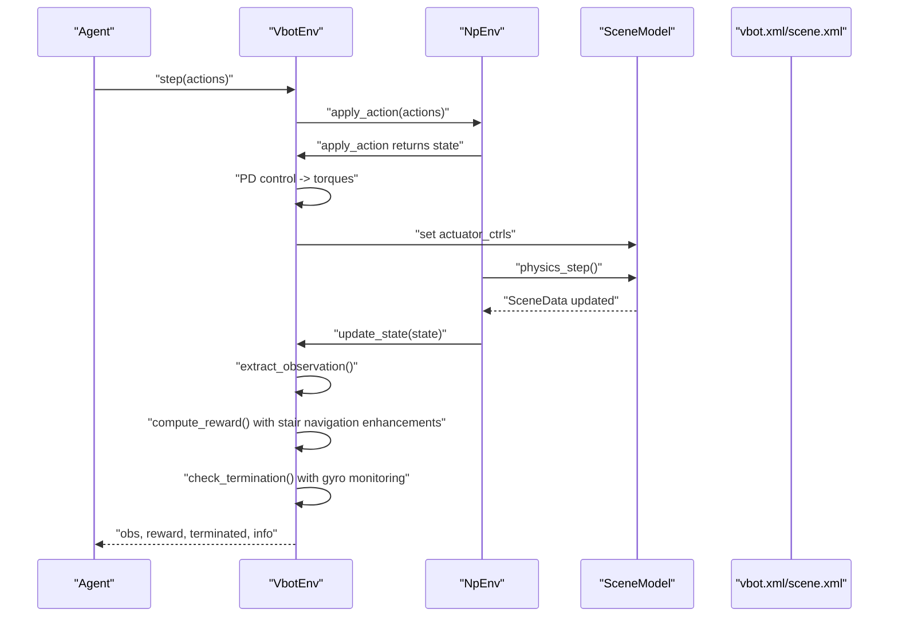
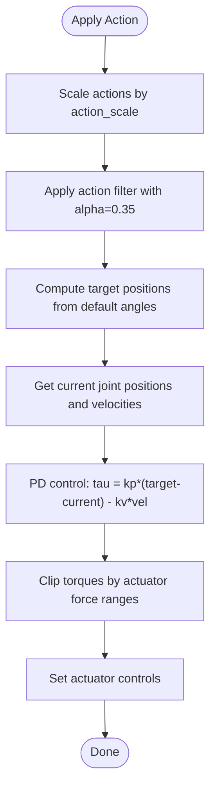
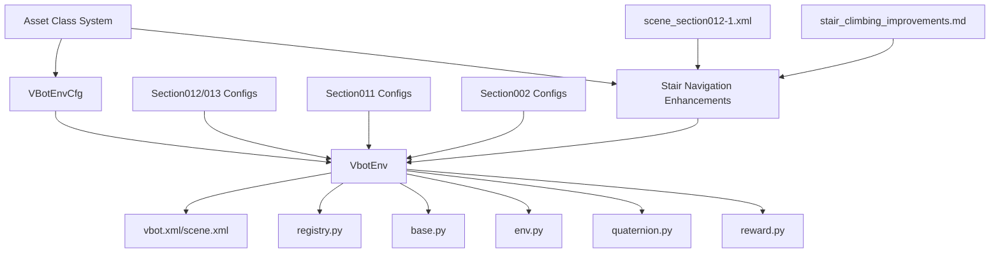

# VBot Base Environment

<cite>
**Referenced Files in This Document**
- [vbot_np.py](file://motrix_envs/src/motrix_envs/navigation/vbot/vbot_np.py)
- [cfg.py](file://motrix_envs/src/motrix_envs/navigation/vbot/cfg.py)
- [vbot_section002_np.py](file://motrix_envs/src/motrix_envs/navigation/vbot/vbot_section002_np.py)
- [vbot_section011_np.py](file://motrix_envs/src/motrix_envs/navigation/vbot/vbot_section011_np.py)
- [vbot_section012_np.py](file://motrix_envs/src/motrix_envs/navigation/vbot/vbot_section012_np.py)
- [vbot_section013_np.py](file://motrix_envs/src/motrix_envs/navigation/vbot/vbot_section013_np.py)
- [base.py](file://motrix_envs/src/motrix_envs/base.py)
- [env.py](file://motrix_envs/src/motrix_envs/np/env.py)
- [registry.py](file://motrix_envs/src/motrix_envs/registry.py)
- [quaternion.py](file://motrix_envs/src/motrix_envs/math/quaternion.py)
- [reward.py](file://motrix_envs/src/motrix_envs/np/reward.py)
- [vbot.xml](file://motrix_envs/src/motrix_envs/navigation/vbot/xmls/vbot.xml)
- [scene.xml](file://motrix_envs/src/motrix_envs/navigation/vbot/xmls/scene.xml)
- [scene_section012-1.xml](file://motrix_envs/src/motrix_envs/navigation/vbot/xmls/scene_section012-1.xml)
- [scene_section011-1.xml](file://motrix_envs/src/motrix_envs/navigation/vbot/xmls/scene_section011-1.xml)
- [stair_climbing_improvements.md](file://stair_climbing_improvements.md)
- [__init__.py](file://motrix_envs/src/motrix_envs/navigation/vbot/__init__.py)
</cite>

## Update Summary
**Changes Made**
- Enhanced VBot Section002 with slope-adaptive PD controller featuring terrain-aware gain scheduling
- Implemented new Asset class configuration system with improved terrain adaptation capabilities
- Added comprehensive documentation for the new simplified VBot Section011 implementation approach
- Enhanced sensor configurations with gravity projection sensors and foot position sensors
- Improved terrain adaptation through adaptive control systems and specialized reward mechanisms

## Table of Contents
1. [Introduction](#introduction)
2. [Project Structure](#project-structure)
3. [Core Components](#core-components)
4. [Architecture Overview](#architecture-overview)
5. [Detailed Component Analysis](#detailed-component-analysis)
6. [Dependency Analysis](#dependency-analysis)
7. [Performance Considerations](#performance-considerations)
8. [Troubleshooting Guide](#troubleshooting-guide)
9. [Conclusion](#conclusion)
10. [Appendices](#appendices)

## Introduction
This document describes the VBot base navigation environment built on the MotrixLab platform with enhanced stair navigation capabilities and terrain adaptation systems. It focuses on the omnidirectional wheeled robot implementation, detailing the VbotEnv class architecture, the 12-degree-of-freedom actuator system with PD control, the 54-dimensional observation space combining IMU data, joint states, and navigation commands, and the 12-dimensional action space for wheel motor control. The environment now features specialized reward mechanisms for stair navigation, adaptive control systems for terrain adaptation, and improved sensor integration for enhanced climbing performance. It explains the environment's core functionality including the enhanced position tracking reward system with improved numerical stability, enhanced termination conditions for base contact and side flips with gyro sensor monitoring, and the arrow visualization system for robot and desired headings. The configuration system, including normalization parameters, sensor definitions, and control settings, is documented alongside the comprehensive reward shaping mechanism emphasizing linear velocity tracking, angular velocity control, approach rewards, stability penalties, and specialized stair navigation components. Finally, it covers the reset procedure with spawn area randomization and pose command generation, and provides practical examples of environment initialization, action application, and state observation extraction.

## Project Structure
The VBot navigation environment is organized under the navigation package with modular configuration, environment implementation, and XML-based robot/scene definitions. Key elements include:
- Configuration classes defining environment parameters, normalization, sensors, and reward weights
- Environment implementation extending the NumPy-based environment base class with enhanced stair navigation capabilities
- Robot and scene XMLs defining actuators, sensors, geometry, and collision detection with specialized stair navigation features
- Registry decorators for environment registration and instantiation
- Advanced reward shaping utilities for exponential-based calculations with stair-specific components
- Enhanced sensor configurations for gravity projection, foot positioning, and contact force measurement

```mermaid
graph TB
subgraph "Navigation/VBot"
CFG["cfg.py<br/>Environment configs"]
ENV["vbot_np.py<br/>VbotEnv implementation"]
SECTION002["vbot_section002_np.py<br/>Enhanced adaptive control"]
SECTION011["vbot_section011_np.py<br/>Simplified implementation"]
SECTION012["vbot_section012_np.py<br/>Enhanced stair navigation"]
SECTION013["vbot_section013_np.py<br/>Enhanced stair navigation"]
INIT["__init__.py<br/>Exports and imports"]
XML["vbot.xml<br/>Robot definition"]
SCENE["scene.xml<br/>Scene and sensors"]
SCENE011["scene_section011-1.xml<br/>Section011 terrain"]
SCENE012["scene_section012-1.xml<br/>Section012 terrain"]
STAIR_XML["scene_section012-1.xml<br/>Stair-specific sensors"]
REWARD["reward.py<br/>Exponential reward utilities"]
END
subgraph "Base Infrastructure"
BASE["base.py<br/>ABEnv/EnvCfg"]
NPENV["env.py<br/>NpEnv base"]
REG["registry.py<br/>Registration"]
QUAT["quaternion.py<br/>Quaternion utilities"]
STAIR_IMPROVEMENTS["stair_climbing_improvements.md<br/>Enhancement documentation"]
END
CFG --> ENV
ENV --> NPENV
ENV --> BASE
ENV --> REG
ENV --> QUAT
ENV --> REWARD
SECTION002 --> ENV
SECTION011 --> ENV
SECTION012 --> ENV
SECTION013 --> ENV
XML --> ENV
SCENE --> ENV
SCENE011 --> SECTION011
SCENE012 --> SECTION012
STAIR_XML --> SECTION012
STAIR_XML --> SECTION013
STAIR_IMPROVEMENTS --> SECTION012
STAIR_IMPROVEMENTS --> SECTION013
INIT --> ENV
```

**Diagram sources**
- [vbot_np.py](file://motrix_envs/src/motrix_envs/navigation/vbot/vbot_np.py#L39-L42)
- [cfg.py](file://motrix_envs/src/motrix_envs/navigation/vbot/cfg.py#L118-L138)
- [vbot_section002_np.py](file://motrix_envs/src/motrix_envs/navigation/vbot/vbot_section002_np.py#L246-L275)
- [vbot_section011_np.py](file://motrix_envs/src/motrix_envs/navigation/vbot/vbot_section011_np.py#L40-L46)
- [vbot_section012_np.py](file://motrix_envs/src/motrix_envs/navigation/vbot/vbot_section012_np.py#L241-L270)
- [vbot_section013_np.py](file://motrix_envs/src/motrix_envs/navigation/vbot/vbot_section013_np.py#L241-L270)
- [env.py](file://motrix_envs/src/motrix_envs/np/env.py#L52-L110)
- [base.py](file://motrix_envs/src/motrix_envs/base.py#L23-L52)
- [registry.py](file://motrix_envs/src/motrix_envs/registry.py#L53-L99)
- [quaternion.py](file://motrix_envs/src/motrix_envs/math/quaternion.py#L18-L50)
- [reward.py](file://motrix_envs/src/motrix_envs/np/reward.py#L21-L61)
- [vbot.xml](file://motrix_envs/src/motrix_envs/navigation/vbot/xmls/vbot.xml#L830-L839)
- [scene.xml](file://motrix_envs/src/motrix_envs/navigation/vbot/xmls/scene.xml#L24-L37)
- [scene_section012-1.xml](file://motrix_envs/src/motrix_envs/navigation/vbot/xmls/scene_section012-1.xml#L53-L82)
- [scene_section011-1.xml](file://motrix_envs/src/motrix_envs/navigation/vbot/xmls/scene_section011-1.xml#L1-L31)
- [stair_climbing_improvements.md](file://stair_climbing_improvements.md#L1-L246)
- [__init__.py](file://motrix_envs/src/motrix_envs/navigation/vbot/__init__.py#L16-L31)

**Section sources**
- [vbot_np.py](file://motrix_envs/src/motrix_envs/navigation/vbot/vbot_np.py#L39-L90)
- [cfg.py](file://motrix_envs/src/motrix_envs/navigation/vbot/cfg.py#L118-L138)
- [vbot_section002_np.py](file://motrix_envs/src/motrix_envs/navigation/vbot/vbot_section002_np.py#L246-L275)
- [vbot_section011_np.py](file://motrix_envs/src/motrix_envs/navigation/vbot/vbot_section011_np.py#L40-L46)
- [vbot_section012_np.py](file://motrix_envs/src/motrix_envs/navigation/vbot/vbot_section012_np.py#L241-L270)
- [vbot_section013_np.py](file://motrix_envs/src/motrix_envs/navigation/vbot/vbot_section013_np.py#L241-L270)
- [env.py](file://motrix_envs/src/motrix_envs/np/env.py#L52-L110)
- [base.py](file://motrix_envs/src/motrix_envs/base.py#L23-L52)
- [registry.py](file://motrix_envs/src/motrix_envs/registry.py#L53-L99)
- [quaternion.py](file://motrix_envs/src/motrix_envs/math/quaternion.py#L18-L50)
- [reward.py](file://motrix_envs/src/motrix_envs/np/reward.py#L21-L61)
- [vbot.xml](file://motrix_envs/src/motrix_envs/navigation/vbot/xmls/vbot.xml#L830-L839)
- [scene.xml](file://motrix_envs/src/motrix_envs/navigation/vbot/xmls/scene.xml#L24-L37)
- [scene_section012-1.xml](file://motrix_envs/src/motrix_envs/navigation/vbot/xmls/scene_section012-1.xml#L53-L82)
- [scene_section011-1.xml](file://motrix_envs/src/motrix_envs/navigation/vbot/xmls/scene_section011-1.xml#L1-L31)
- [stair_climbing_improvements.md](file://stair_climbing_improvements.md#L1-L246)
- [__init__.py](file://motrix_envs/src/motrix_envs/navigation/vbot/__init__.py#L16-L31)

## Core Components
- VbotEnv: Implements the navigation environment with PD control, observation extraction, reward computation, termination checks, and visualization updates.
- VBotEnvCfg: Defines environment configuration including model file, simulation/control time steps, noise, control scaling, reward weights, normalization, asset and sensor definitions, and command ranges.
- NpEnv: Provides the base NumPy-based environment lifecycle (init, step, reset, physics).
- Registry: Registers environment configurations and environment classes for instantiation by name.
- XML Definitions: vbot.xml defines the robot structure, actuators, and sensors; scene.xml defines the scene, ground, and contact sensors; scene_section012-1.xml defines stair-specific enhanced sensors.
- Reward Utilities: Provides exponential-based reward calculation functions for smooth reward shaping.
- Enhanced Sensor Configurations: Advanced gravity projection sensors, foot position sensors, and enhanced contact force measurements.
- Asset Class System: New configuration system for terrain adaptation with improved ground subtree detection.

Key implementation references:
- VbotEnv class and constructor: [vbot_np.py](file://motrix_envs/src/motrix_envs/navigation/vbot/vbot_np.py#L39-L90)
- Observation and action spaces: [vbot_np.py](file://motrix_envs/src/motrix_envs/navigation/vbot/vbot_np.py#L62-L68)
- PD control and torque computation: [vbot_np.py](file://motrix_envs/src/motrix_envs/navigation/vbot/vbot_np.py#L269-L290)
- Observation extraction and reward computation: [vbot_np.py](file://motrix_envs/src/motrix_envs/navigation/vbot/vbot_np.py#L388-L503)
- Enhanced reward computation with improved numerical stability: [vbot_np.py](file://motrix_envs/src/motrix_envs/navigation/vbot/vbot_np.py#L528-L685)
- Enhanced termination conditions: [vbot_np.py](file://motrix_envs/src/motrix_envs/navigation/vbot/vbot_np.py#L505-L526)
- Arrow visualization: [vbot_np.py](file://motrix_envs/src/motrix_envs/navigation/vbot/vbot_np.py#L322-L370)
- Reset procedure: [vbot_np.py](file://motrix_envs/src/motrix_envs/navigation/vbot/vbot_np.py#L687-L816)
- Configuration classes: [cfg.py](file://motrix_envs/src/motrix_envs/navigation/vbot/cfg.py#L118-L138)
- Base environment lifecycle: [env.py](file://motrix_envs/src/motrix_envs/np/env.py#L52-L110)
- Registry decorators: [registry.py](file://motrix_envs/src/motrix_envs/registry.py#L53-L99)
- Robot and scene XMLs: [vbot.xml](file://motrix_envs/src/motrix_envs/navigation/vbot/xmls/vbot.xml#L830-L839), [scene.xml](file://motrix_envs/src/motrix_envs/navigation/vbot/xmls/scene.xml#L24-L37), [scene_section012-1.xml](file://motrix_envs/src/motrix_envs/navigation/vbot/xmls/scene_section012-1.xml#L53-L82)
- Asset class configuration: [cfg.py](file://motrix_envs/src/motrix_envs/navigation/vbot/cfg.py#L444-L453)

**Section sources**
- [vbot_np.py](file://motrix_envs/src/motrix_envs/navigation/vbot/vbot_np.py#L39-L90)
- [vbot_np.py](file://motrix_envs/src/motrix_envs/navigation/vbot/vbot_np.py#L269-L290)
- [vbot_np.py](file://motrix_envs/src/motrix_envs/navigation/vbot/vbot_np.py#L388-L503)
- [vbot_np.py](file://motrix_envs/src/motrix_envs/navigation/vbot/vbot_np.py#L528-L685)
- [vbot_np.py](file://motrix_envs/src/motrix_envs/navigation/vbot/vbot_np.py#L505-L526)
- [vbot_np.py](file://motrix_envs/src/motrix_envs/navigation/vbot/vbot_np.py#L322-L370)
- [vbot_np.py](file://motrix_envs/src/motrix_envs/navigation/vbot/vbot_np.py#L687-L816)
- [cfg.py](file://motrix_envs/src/motrix_envs/navigation/vbot/cfg.py#L118-L138)
- [env.py](file://motrix_envs/src/motrix_envs/np/env.py#L52-L110)
- [registry.py](file://motrix_envs/src/motrix_envs/registry.py#L53-L99)
- [vbot.xml](file://motrix_envs/src/motrix_envs/navigation/vbot/xmls/vbot.xml#L830-L839)
- [scene.xml](file://motrix_envs/src/motrix_envs/navigation/vbot/xmls/scene.xml#L24-L37)
- [scene_section012-1.xml](file://motrix_envs/src/motrix_envs/navigation/vbot/xmls/scene_section012-1.xml#L53-L82)
- [cfg.py](file://motrix_envs/src/motrix_envs/navigation/vbot/cfg.py#L444-L453)

## Architecture Overview
The VBot navigation environment integrates a physics-based robot model with a reinforcement learning loop enhanced for stair navigation. The environment wraps a scene model, applies actions through PD control, extracts observations, computes rewards using exponential-based calculations with improved numerical stability, and manages termination conditions. The enhanced reward system now includes specialized stair navigation components including slope adaptation, foot placement optimization, and dynamic stability compensation. Visualization arrows indicate robot and desired headings.



**Diagram sources**
- [vbot_np.py](file://motrix_envs/src/motrix_envs/navigation/vbot/vbot_np.py#L249-L267)
- [vbot_np.py](file://motrix_envs/src/motrix_envs/navigation/vbot/vbot_np.py#L388-L503)
- [env.py](file://motrix_envs/src/motrix_envs/np/env.py#L196-L208)
- [vbot.xml](file://motrix_envs/src/motrix_envs/navigation/vbot/xmls/vbot.xml#L830-L839)
- [scene.xml](file://motrix_envs/src/motrix_envs/navigation/vbot/xmls/scene.xml#L24-L37)

## Detailed Component Analysis

### VbotEnv Class Architecture
- Inherits from NpEnv and registers with the registry for the "vbot_navigation_flat" environment name.
- Initializes robot body, contact geometry, target marker bodies, and arrow visualization bodies.
- Sets up action and observation spaces: 12-dimensional actions, 54-dimensional observations.
- Maintains buffers for default joint angles, normalization scales, and action filtering.

Key implementation references:
- Class and constructor: [vbot_np.py](file://motrix_envs/src/motrix_envs/navigation/vbot/vbot_np.py#L39-L90)
- Action and observation spaces: [vbot_np.py](file://motrix_envs/src/motrix_envs/navigation/vbot/vbot_np.py#L62-L68)
- Buffer initialization: [vbot_np.py](file://motrix_envs/src/motrix_envs/navigation/vbot/vbot_np.py#L94-L113)

**Section sources**
- [vbot_np.py](file://motrix_envs/src/motrix_envs/navigation/vbot/vbot_np.py#L39-L90)
- [vbot_np.py](file://motrix_envs/src/motrix_envs/navigation/vbot/vbot_np.py#L62-L68)
- [vbot_np.py](file://motrix_envs/src/motrix_envs/navigation/vbot/vbot_np.py#L94-L113)

### Enhanced Action Filtering System
**Updated** The action filtering system now uses an increased alpha parameter of 0.35 for improved stability during complex movements while maintaining responsive control characteristics.

- **Enhanced Action Smoothing**: Increased action filter alpha from 0.3 to 0.35 for better balance between responsiveness and stability
- **Improved Control Characteristics**: Reduced jitter while maintaining quick response to control inputs
- **Complex Movement Stability**: Particularly beneficial for climbing and terrain traversal scenarios
- **Filter Implementation**: Exponential moving average filter with updated alpha parameter

Key implementation references:
- Action filter alpha parameter: [vbot_np.py](file://motrix_envs/src/motrix_envs/navigation/vbot/vbot_np.py#L112)
- Filtered action computation: [vbot_np.py](file://motrix_envs/src/motrix_envs/navigation/vbot/vbot_np.py#L255-L261)
- Enhanced section configurations: [vbot_section012_np.py](file://motrix_envs/src/motrix_envs/navigation/vbot/vbot_section012_np.py#L126), [vbot_section013_np.py](file://motrix_envs/src/motrix_envs/navigation/vbot/vbot_section013_np.py#L126)



**Diagram sources**
- [vbot_np.py](file://motrix_envs/src/motrix_envs/navigation/vbot/vbot_np.py#L249-L290)
- [vbot_section012_np.py](file://motrix_envs/src/motrix_envs/navigation/vbot/vbot_section012_np.py#L234-L237)
- [vbot_section013_np.py](file://motrix_envs/src/motrix_envs/navigation/vbot/vbot_section013_np.py#L234-L237)
- [vbot.xml](file://motrix_envs/src/motrix_envs/navigation/vbot/xmls/vbot.xml#L830-L839)

**Section sources**
- [vbot_np.py](file://motrix_envs/src/motrix_envs/navigation/vbot/vbot_np.py#L112)
- [vbot_np.py](file://motrix_envs/src/motrix_envs/navigation/vbot/vbot_np.py#L255-L261)
- [vbot_section012_np.py](file://motrix_envs/src/motrix_envs/navigation/vbot/vbot_section012_np.py#L126)
- [vbot_section013_np.py](file://motrix_envs/src/motrix_envs/navigation/vbot/vbot_section013_np.py#L126)

### Enhanced Adaptive PD Controller System
**Updated** The PD controller system now implements adaptive parameters with terrain-aware gain scheduling for enhanced climbing performance across multiple sections.

- **Terrain-Aware PD Control**: Automatic adjustment of kp/kv parameters based on detected slope conditions
- **Downhill Detection**: Uses gravity projection sensor to detect negative slopes (>10°)
- **Gain Scheduling**: Separate gain parameters for front legs (vita) vs rear legs (vita) for optimal performance
- **Leg-Specific Control**: Different gains for front legs (vita) vs rear legs (vita) for optimal performance
- **Stability Enhancement**: Lower gains on downhill to prevent bouncing and maintain stability
- **Section-Specific Parameters**: Different adaptive parameters for Section002, Section011, Section012, and Section013

Key implementation references:
- Adaptive PD control with slope detection: [vbot_section002_np.py](file://motrix_envs/src/motrix_envs/navigation/vbot/vbot_section002_np.py#L246-L275)
- Downhill detection logic: [vbot_section002_np.py](file://motrix_envs/src/motrix_envs/navigation/vbot/vbot_section002_np.py#L248-L257)
- Gain parameter scheduling: [vbot_section002_np.py](file://motrix_envs/src/motrix_envs/navigation/vbot/vbot_section002_np.py#L260-L273)
- Leg-specific torque computation: [vbot_section002_np.py](file://motrix_envs/src/motrix_envs/navigation/vbot/vbot_section002_np.py#L277-L291)
- Enhanced section implementations: [vbot_section011_np.py](file://motrix_envs/src/motrix_envs/navigation/vbot/vbot_section011_np.py#L245-L299), [vbot_section012_np.py](file://motrix_envs/src/motrix_envs/navigation/vbot/vbot_section012_np.py#L245-L299)

**Section sources**
- [vbot_section002_np.py](file://motrix_envs/src/motrix_envs/navigation/vbot/vbot_section002_np.py#L246-L275)
- [vbot_section011_np.py](file://motrix_envs/src/motrix_envs/navigation/vbot/vbot_section011_np.py#L245-L299)
- [vbot_section012_np.py](file://motrix_envs/src/motrix_envs/navigation/vbot/vbot_section012_np.py#L245-L299)
- [vbot_section013_np.py](file://motrix_envs/src/motrix_envs/navigation/vbot/vbot_section013_np.py#L245-L299)

### Enhanced Reward Computation Methods
**Updated** The reward shaping mechanism now incorporates enhanced numerical stability with improved clipping mechanisms and better argument handling for exponential functions, along with specialized stair navigation components.

- **Improved Numerical Stability**: Enhanced reward computation with argument clipping to prevent exponential overflow and maintain numerical stability
- **Enhanced Velocity Tracking**: Linear and angular velocity tracking uses exponential functions with sigma parameter of 0.25 for smooth reward computation
- **Robust Exponential Functions**: Added explicit clipping for exponential function arguments with maximum value limits (100) to prevent overflow
- **Advanced Termination Handling**: Comprehensive termination conditions with debugging statistics and improved contact detection
- **Approach Reward Enhancement**: Distance improvement tracking with historical min-distance mechanism
- **Stopping Bonus System**: Multi-component stopping bonus with speed and angular velocity considerations
- **Comprehensive Penalties**: Z-axis velocity, XY angular velocity, torque, joint velocity, and action rate penalties
- **Debugging Integration**: Statistical tracking of arrival counts, stop counts, and environmental state distributions
- **Stair Navigation Rewards**: Specialized components for slope adaptation, foot placement optimization, and dynamic stability compensation
- **Terrain State Detection**: Advanced detection of climbing and downhill states with appropriate incentives and stability bonuses

Key implementation references:
- Enhanced reward computation with numerical stability: [vbot_np.py](file://motrix_envs/src/motrix_envs/navigation/vbot/vbot_np.py#L528-L685)
- Reward weights and scales: [cfg.py](file://motrix_envs/src/motrix_envs/navigation/vbot/cfg.py#L95-L116)
- Exponential reward utilities: [reward.py](file://motrix_envs/src/motrix_envs/np/reward.py#L21-L61)
- Stair-specific reward components: [vbot_section012_np.py](file://motrix_envs/src/motrix_envs/navigation/vbot/vbot_section012_np.py#L784-L1005)

**Section sources**
- [vbot_np.py](file://motrix_envs/src/motrix_envs/navigation/vbot/vbot_np.py#L528-L685)
- [cfg.py](file://motrix_envs/src/motrix_envs/navigation/vbot/cfg.py#L95-L116)
- [reward.py](file://motrix_envs/src/motrix_envs/np/reward.py#L21-L61)
- [vbot_section012_np.py](file://motrix_envs/src/motrix_envs/navigation/vbot/vbot_section012_np.py#L784-L1005)

### Enhanced Termination Conditions
**Updated** Termination conditions now include comprehensive debugging capabilities, improved contact detection mechanisms, and enhanced gyro sensor monitoring.

- Base contact termination: detected via a dedicated contact sensor with enhanced error handling and fallback mechanisms
- Side flip termination: computed from projected gravity vector with 75-degree threshold; excessive tilt triggers termination
- DOF velocity overflow: extreme or NaN joint velocities trigger termination with detailed logging
- Gyro sensor monitoring: enhanced termination logic with improved gyro sensor access and validation
- Comprehensive debugging: statistical tracking of termination reasons during training

Key implementation references:
- Enhanced termination computation: [vbot_np.py](file://motrix_envs/src/motrix_envs/navigation/vbot/vbot_np.py#L505-L526)
- Contact sensor definition: [scene.xml](file://motrix_envs/src/motrix_envs/navigation/vbot/xmls/scene.xml#L29-L29)

**Section sources**
- [vbot_np.py](file://motrix_envs/src/motrix_envs/navigation/vbot/vbot_np.py#L505-L526)
- [scene.xml](file://motrix_envs/src/motrix_envs/navigation/vbot/xmls/scene.xml#L29-L29)

### Arrow Visualization System
- Two free-joint bodies visualize robot heading (green) and desired heading (blue).
- Positions and orientations updated based on current base linear velocity and desired movement direction.
- Height offset ensures arrows appear above the robot.

Key implementation references:
- Arrow update: [vbot_np.py](file://motrix_envs/src/motrix_envs/navigation/vbot/vbot_np.py#L322-L370)
- Arrow bodies and geometry: [vbot.xml](file://motrix_envs/src/motrix_envs/navigation/vbot/xmls/vbot.xml#L671-L691)

**Section sources**
- [vbot_np.py](file://motrix_envs/src/motrix_envs/navigation/vbot/vbot_np.py#L322-L370)
- [vbot.xml](file://motrix_envs/src/motrix_envs/navigation/vbot/xmls/vbot.xml#L671-L691)

### Reset Procedure
- Random spawn within a small area around a center point.
- Pose commands generated as offsets from current position and random yaw.
- Base orientation normalized to unit quaternion; arrow quaternions normalized as well.
- Initial observation constructed with zero previous actions and normalized commands.

Key implementation references:
- Reset logic: [vbot_np.py](file://motrix_envs/src/motrix_envs/navigation/vbot/vbot_np.py#L687-L816)
- Spawn configuration: [cfg.py](file://motrix_envs/src/motrix_envs/navigation/vbot/cfg.py#L41-L46)

**Section sources**
- [vbot_np.py](file://motrix_envs/src/motrix_envs/navigation/vbot/vbot_np.py#L687-L816)
- [cfg.py](file://motrix_envs/src/motrix_envs/navigation/vbot/cfg.py#L41-L46)

### Enhanced Configuration System
**Updated** Configuration system now includes enhanced reward weights, improved normalization parameters, and fine-tuned joint initialization parameters for climbing performance.

- Environment configuration class VBotEnvCfg aggregates:
  - Model file path
  - Simulation and control time steps
  - Noise configuration
  - Control configuration (action scale)
  - Reward configuration (enhanced weights)
  - Initialization state (spawn center, randomization range, default joint angles)
  - Commands (pose command ranges)
  - Normalization coefficients
  - Asset definitions (body name, foot names, termination contacts, ground subtree, goal name)
  - Sensor definitions (IMU, feet)

- **Fine-tuned Joint Parameters**: Enhanced default joint angles for improved climbing performance:
  - Front legs: hip 0.0, thigh 0.95, calf -1.85 (raised for better obstacle clearance)
  - Rear legs: hip 0.0, thigh 0.85, calf -1.75 (lower for enhanced pushing force)

- **Asset Class System**: New configuration system with improved terrain adaptation:
  - Ground subtree detection with section-specific prefixes (S1C_, S2C_, S3C_)
  - Enhanced contact geometry detection for multiple terrain types
  - Improved goal position configuration for different sections

Key implementation references:
- Configuration class: [cfg.py](file://motrix_envs/src/motrix_envs/navigation/vbot/cfg.py#L118-L138)
- Noise configuration: [cfg.py](file://motrix_envs/src/motrix_envs/navigation/vbot/cfg.py#L24-L32)
- Control configuration: [cfg.py](file://motrix_envs/src/motrix_envs/navigation/vbot/cfg.py#L34-L39)
- Enhanced reward configuration: [cfg.py](file://motrix_envs/src/motrix_envs/navigation/vbot/cfg.py#L95-L116)
- Initialization state: [cfg.py](file://motrix_envs/src/motrix_envs/navigation/vbot/cfg.py#L41-L63)
- Commands: [cfg.py](file://motrix_envs/src/motrix_envs/navigation/vbot/cfg.py#L66-L70)
- Normalization: [cfg.py](file://motrix_envs/src/motrix_envs/navigation/vbot/cfg.py#L73-L78)
- Asset: [cfg.py](file://motrix_envs/src/motrix_envs/navigation/vbot/cfg.py#L80-L87)
- Sensor: [cfg.py](file://motrix_envs/src/motrix_envs/navigation/vbot/cfg.py#L89-L93)
- Enhanced Asset class: [cfg.py](file://motrix_envs/src/motrix_envs/navigation/vbot/cfg.py#L444-L453)

**Section sources**
- [cfg.py](file://motrix_envs/src/motrix_envs/navigation/vbot/cfg.py#L118-L138)
- [cfg.py](file://motrix_envs/src/motrix_envs/navigation/vbot/cfg.py#L24-L32)
- [cfg.py](file://motrix_envs/src/motrix_envs/navigation/vbot/cfg.py#L34-L39)
- [cfg.py](file://motrix_envs/src/motrix_envs/navigation/vbot/cfg.py#L95-L116)
- [cfg.py](file://motrix_envs/src/motrix_envs/navigation/vbot/cfg.py#L41-L63)
- [cfg.py](file://motrix_envs/src/motrix_envs/navigation/vbot/cfg.py#L66-L70)
- [cfg.py](file://motrix_envs/src/motrix_envs/navigation/vbot/cfg.py#L73-L78)
- [cfg.py](file://motrix_envs/src/motrix_envs/navigation/vbot/cfg.py#L80-L87)
- [cfg.py](file://motrix_envs/src/motrix_envs/navigation/vbot/cfg.py#L89-L93)
- [cfg.py](file://motrix_envs/src/motrix_envs/navigation/vbot/cfg.py#L444-L453)

### Enhanced Stair Navigation Enhancement System
**New** The VBot environment now features comprehensive stair navigation capabilities with specialized reward mechanisms, adaptive control systems, and enhanced sensor integration across multiple sections.

#### Specialized Reward Mechanisms
- **Slope Adaptation Reward**: Encourages stable climbing posture with exponential decay based on slope angle
- **Foot Edge Distance Reward**: Promotes central foot placement on stairs with distance-based reward scaling
- **Dynamic Stability Reward**: Balances vertical motion stability, angular stability, and slope adaptation
- **Vertical Motion Reward**: Encourages appropriate vertical movement during stair climbing
- **Stair Step Detection**: Identifies stair climbing phases with appropriate reward scaling

#### Terrain State Detection
- **Stair Climbing State**: Detects when front legs are elevated with upward vertical velocity
- **Downhill State**: Identifies safe downhill sections with stability incentives
- **Dynamic Stability**: Provides stability bonuses for controlled descent on slopes

#### Enhanced Sensor Integration
- **Gravity Projection Sensors**: Real-time slope detection using gravity vector projection
- **Foot Position Sensors**: Precise foot height detection for step timing and climbing state
- **Enhanced Contact Sensors**: Detailed contact force analysis for improved foot placement
- **Edge Distance Calculation**: Computes foot-to-stair-edge distances for reward optimization

#### Adaptive Control Systems
- **Terrain-Aware PD Control**: Automatic parameter adjustment based on detected slope conditions
- **Leg-Specific Gains**: Different control parameters for front vs rear legs
- **Downhill Stability**: Reduced gains and increased damping for safe descent

Key implementation references:
- Stair-specific reward computation: [vbot_section012_np.py](file://motrix_envs/src/motrix_envs/navigation/vbot/vbot_section012_np.py#L784-L1005)
- Slope feature computation: [vbot_section012_np.py](file://motrix_envs/src/motrix_envs/navigation/vbot/vbot_section012_np.py#L250-L266)
- Foot edge distance calculation: [vbot_section012_np.py](file://motrix_envs/src/motrix_envs/navigation/vbot/vbot_section012_np.py#L900-L908)
- Dynamic stability reward: [vbot_section012_np.py](file://motrix_envs/src/motrix_envs/navigation/vbot/vbot_section012_np.py#L948-L959)
- Enhanced sensor configuration: [vbot.xml](file://motrix_envs/src/motrix_envs/navigation/vbot/xmls/vbot.xml#L830-L839)
- Enhanced contact sensors: [scene_section012-1.xml](file://motrix_envs/src/motrix_envs/navigation/vbot/xmls/scene_section012-1.xml#L56-L72)

**Section sources**
- [vbot_section012_np.py](file://motrix_envs/src/motrix_envs/navigation/vbot/vbot_section012_np.py#L784-L1005)
- [vbot_section012_np.py](file://motrix_envs/src/motrix_envs/navigation/vbot/vbot_section012_np.py#L250-L266)
- [vbot_section012_np.py](file://motrix_envs/src/motrix_envs/navigation/vbot/vbot_section012_np.py#L900-L908)
- [vbot_section012_np.py](file://motrix_envs/src/motrix_envs/navigation/vbot/vbot_section012_np.py#L948-L959)
- [vbot.xml](file://motrix_envs/src/motrix_envs/navigation/vbot/xmls/vbot.xml#L830-L839)
- [scene_section012-1.xml](file://motrix_envs/src/motrix_envs/navigation/vbot/xmls/scene_section012-1.xml#L56-L72)

### Simplified VBot Section011 Implementation Approach
**New** The VBot environment now includes a simplified implementation approach for Section011 terrain with enhanced terrain adaptation capabilities.

#### Simplified Implementation Features
- **Reduced Complexity**: Streamlined implementation with focused functionality for Section011 terrain
- **Enhanced Terrain Adaptation**: Improved ground subtree detection with S1C_ prefix support
- **Optimized Sensor Integration**: Streamlined sensor configuration for Section011-specific requirements
- **Improved Performance**: Reduced computational overhead while maintaining functionality

#### Key Implementation Details
- **Ground Subtree Detection**: Enhanced detection of S1C_ prefixed ground subtrees for Section011 terrain
- **Goal Position Configuration**: Optimized goal position settings with S1V_End_Point_1 naming convention
- **Action Scaling**: Adjusted action scale parameters for Section011 terrain complexity
- **Joint Initialization**: Optimized default joint angles for Section011 terrain traversal

Key implementation references:
- Simplified environment registration: [vbot_section011_np.py](file://motrix_envs/src/motrix_envs/navigation/vbot/vbot_section011_np.py#L40-L46)
- Enhanced Asset class configuration: [cfg.py](file://motrix_envs/src/motrix_envs/navigation/vbot/cfg.py#L444-L453)
- Simplified implementation approach: [vbot_section011_np.py](file://motrix_envs/src/motrix_envs/navigation/vbot/vbot_section011_np.py#L108-L127)

**Section sources**
- [vbot_section011_np.py](file://motrix_envs/src/motrix_envs/navigation/vbot/vbot_section011_np.py#L40-L46)
- [vbot_section011_np.py](file://motrix_envs/src/motrix_envs/navigation/vbot/vbot_section011_np.py#L108-L127)
- [cfg.py](file://motrix_envs/src/motrix_envs/navigation/vbot/cfg.py#L444-L453)

### Practical Examples
- Environment initialization:
  - Register and instantiate via registry: [registry.py](file://motrix_envs/src/motrix_envs/registry.py#L114-L160)
  - Example usage: [__init__.py](file://motrix_envs/src/motrix_envs/navigation/vbot/__init__.py#L22-L22)
- Applying actions:
  - Call step with actions: [env.py](file://motrix_envs/src/motrix_envs/np/env.py#L196-L208)
  - PD control mapping: [vbot_np.py](file://motrix_envs/src/motrix_envs/navigation/vbot/vbot_np.py#L249-L290)
- Extracting observations:
  - Observation concatenation: [vbot_np.py](file://motrix_envs/src/motrix_envs/navigation/vbot/vbot_np.py#L468-L484)
  - Sensor values: [vbot.xml](file://motrix_envs/src/motrix_envs/navigation/vbot/xmls/vbot.xml#L813-L820)

**Section sources**
- [registry.py](file://motrix_envs/src/motrix_envs/registry.py#L114-L160)
- [__init__.py](file://motrix_envs/src/motrix_envs/navigation/vbot/__init__.py#L22-L22)
- [env.py](file://motrix_envs/src/motrix_envs/np/env.py#L196-L208)
- [vbot_np.py](file://motrix_envs/src/motrix_envs/navigation/vbot/vbot_np.py#L249-L290)
- [vbot_np.py](file://motrix_envs/src/motrix_envs/navigation/vbot/vbot_np.py#L468-L484)
- [vbot.xml](file://motrix_envs/src/motrix_envs/navigation/vbot/xmls/vbot.xml#L813-L820)

## Dependency Analysis
**Updated** Dependencies now include reward utilities for exponential-based calculations, enhanced configuration classes for climbing performance, and specialized stair navigation components.

The VBot environment depends on:
- Physics model and sensors defined in XML
- Registry for environment registration and instantiation
- Base environment infrastructure for lifecycle management
- Math utilities for quaternion operations
- Reward utilities for exponential-based reward calculations
- Enhanced configuration classes with fine-tuned joint parameters
- Specialized stair navigation components with adaptive control systems
- Asset class system for terrain adaptation and ground subtree detection



**Diagram sources**
- [vbot_np.py](file://motrix_envs/src/motrix_envs/navigation/vbot/vbot_np.py#L39-L42)
- [vbot.xml](file://motrix_envs/src/motrix_envs/navigation/vbot/xmls/vbot.xml#L830-L839)
- [scene.xml](file://motrix_envs/src/motrix_envs/navigation/vbot/xmls/scene.xml#L24-L37)
- [registry.py](file://motrix_envs/src/motrix_envs/registry.py#L53-L99)
- [base.py](file://motrix_envs/src/motrix_envs/base.py#L23-L52)
- [env.py](file://motrix_envs/src/motrix_envs/np/env.py#L52-L110)
- [quaternion.py](file://motrix_envs/src/motrix_envs/math/quaternion.py#L18-L50)
- [reward.py](file://motrix_envs/src/motrix_envs/np/reward.py#L21-L61)
- [cfg.py](file://motrix_envs/src/motrix_envs/navigation/vbot/cfg.py#L118-L138)
- [vbot_section012_np.py](file://motrix_envs/src/motrix_envs/navigation/vbot/vbot_section012_np.py#L120-L130)
- [vbot_section013_np.py](file://motrix_envs/src/motrix_envs/navigation/vbot/vbot_section013_np.py#L120-L130)
- [vbot_section011_np.py](file://motrix_envs/src/motrix_envs/navigation/vbot/vbot_section011_np.py#L40-L46)
- [vbot_section002_np.py](file://motrix_envs/src/motrix_envs/navigation/vbot/vbot_section002_np.py#L27-L28)
- [scene_section012-1.xml](file://motrix_envs/src/motrix_envs/navigation/vbot/xmls/scene_section012-1.xml#L53-L82)
- [stair_climbing_improvements.md](file://stair_climbing_improvements.md#L1-L246)

**Section sources**
- [vbot_np.py](file://motrix_envs/src/motrix_envs/navigation/vbot/vbot_np.py#L39-L42)
- [vbot.xml](file://motrix_envs/src/motrix_envs/navigation/vbot/xmls/vbot.xml#L830-L839)
- [scene.xml](file://motrix_envs/src/motrix_envs/navigation/vbot/xmls/scene.xml#L24-L37)
- [registry.py](file://motrix_envs/src/motrix_envs/registry.py#L53-L99)
- [base.py](file://motrix_envs/src/motrix_envs/base.py#L23-L52)
- [env.py](file://motrix_envs/src/motrix_envs/np/env.py#L52-L110)
- [quaternion.py](file://motrix_envs/src/motrix_envs/math/quaternion.py#L18-L50)
- [reward.py](file://motrix_envs/src/motrix_envs/np/reward.py#L21-L61)
- [cfg.py](file://motrix_envs/src/motrix_envs/navigation/vbot/cfg.py#L118-L138)

## Performance Considerations
**Updated** Performance considerations now include enhanced numerical stability optimizations, improved action filtering, adaptive PD controller parameters, optimized joint initialization parameters, and specialized stair navigation components.

- Simulation and control time steps are decoupled; ensure sim_substeps aligns with control frequency.
- Observation normalization prevents numerical overflow in reward computations.
- Enhanced action filtering with alpha=0.35 reduces jitter while maintaining responsive control.
- Termination checks leverage efficient contact queries and quaternion operations.
- Enhanced exponential function calculations with argument clipping to prevent overflow and maintain numerical stability.
- Improved debugging statistics are conditionally enabled to minimize performance impact during training.
- Reward computation separates pre-arrival and post-arrival phases for computational efficiency.
- Gyro sensor monitoring provides real-time termination feedback with minimal computational overhead.
- Fine-tuned joint parameters optimize climbing performance with minimal computational overhead.
- Adaptive PD controller reduces computational overhead through terrain-aware parameter selection.
- Stair navigation components include efficient state detection algorithms with minimal computational cost.
- Enhanced sensor integration provides real-time feedback with optimized data processing pipelines.
- Asset class system improves terrain adaptation performance through optimized ground subtree detection.

## Troubleshooting Guide
**Updated** Troubleshooting guide now includes debugging capabilities, reward system issues, enhanced termination condition problems, action filtering concerns, adaptive PD controller troubleshooting, and specialized stair navigation component issues.

Common issues and remedies:
- Termination contact detection warnings: verify ground geometry names and subtree prefixes.
- Base contact sensor errors: confirm sensor name and availability in the loaded model.
- Excessive joint velocities or NaNs: review PD gains and torque limits; consider reducing action scale.
- Arrow visualization missing: ensure arrow bodies exist in the scene XML and are accessible via model.
- Reward computation instability: check exponential function arguments are properly clipped to prevent overflow.
- Debugging statistics not appearing: verify debug prints are enabled in reward computation.
- Observation dimension mismatches: ensure observation space matches the 54-dimensional configuration.
- Gyro sensor monitoring failures: verify gyro sensor availability and proper initialization.
- Numerical overflow in exponential calculations: check argument clipping mechanisms are functioning correctly.
- Action filtering instability: verify alpha parameter is set appropriately (0.35 for enhanced stability).
- Joint initialization issues: check default joint angles match expected climbing configuration.
- Adaptive PD controller issues: verify gravity projection sensor is available and slope detection logic is working.
- Terrain adaptation problems: check slope angle thresholds and gain parameter values.
- Stair navigation reward computation errors: verify specialized reward components are properly initialized.
- Foot position sensor failures: ensure foot position sensors are available and returning valid data.
- Slope detection issues: check gravity projection sensor configuration and calculation logic.
- Stair state detection problems: verify foot height sensors and vertical velocity calculations.
- Enhanced contact sensor issues: confirm contact force sensors are properly configured and returning data.
- Asset class configuration errors: verify ground subtree prefixes match terrain configuration.
- Section-specific terrain detection failures: check S1C_, S2C_, S3C_ prefix matching in ground subtree detection.

Key implementation references:
- Termination contact initialization: [vbot_np.py](file://motrix_envs/src/motrix_envs/navigation/vbot/vbot_np.py#L157-L191)
- Base contact sensor usage: [vbot_np.py](file://motrix_envs/src/motrix_envs/navigation/vbot/vbot_np.py#L512-L522)
- Arrow body access: [vbot_np.py](file://motrix_envs/src/motrix_envs/navigation/vbot/vbot_np.py#L55-L60)
- Enhanced reward computation with numerical stability: [vbot_np.py](file://motrix_envs/src/motrix_envs/navigation/vbot/vbot_np.py#L560-L685)
- Action filter alpha parameter: [vbot_np.py](file://motrix_envs/src/motrix_envs/navigation/vbot/vbot_np.py#L112)
- Adaptive PD controller implementation: [vbot_section012_np.py](file://motrix_envs/src/motrix_envs/navigation/vbot/vbot_section012_np.py#L254-L299)
- Stair navigation reward computation: [vbot_section012_np.py](file://motrix_envs/src/motrix_envs/navigation/vbot/vbot_section012_np.py#L784-L1005)
- Foot position sensor configuration: [vbot.xml](file://motrix_envs/src/motrix_envs/navigation/vbot/xmls/vbot.xml#L830-L839)
- Enhanced contact sensor configuration: [scene_section012-1.xml](file://motrix_envs/src/motrix_envs/navigation/vbot/xmls/scene_section012-1.xml#L56-L72)
- Asset class configuration verification: [cfg.py](file://motrix_envs/src/motrix_envs/navigation/vbot/cfg.py#L444-L453)

**Section sources**
- [vbot_np.py](file://motrix_envs/src/motrix_envs/navigation/vbot/vbot_np.py#L157-L191)
- [vbot_np.py](file://motrix_envs/src/motrix_envs/navigation/vbot/vbot_np.py#L512-L522)
- [vbot_np.py](file://motrix_envs/src/motrix_envs/navigation/vbot/vbot_np.py#L55-L60)
- [vbot_np.py](file://motrix_envs/src/motrix_envs/navigation/vbot/vbot_np.py#L560-L685)
- [vbot_np.py](file://motrix_envs/src/motrix_envs/navigation/vbot/vbot_np.py#L112)
- [vbot_section012_np.py](file://motrix_envs/src/motrix_envs/navigation/vbot/vbot_section012_np.py#L254-L299)
- [vbot_section012_np.py](file://motrix_envs/src/motrix_envs/navigation/vbot/vbot_section012_np.py#L784-L1005)
- [vbot.xml](file://motrix_envs/src/motrix_envs/navigation/vbot/xmls/vbot.xml#L830-L839)
- [scene_section012-1.xml](file://motrix_envs/src/motrix_envs/navigation/vbot/xmls/scene_section012-1.xml#L56-L72)
- [cfg.py](file://motrix_envs/src/motrix_envs/navigation/vbot/cfg.py#L444-L453)

## Conclusion
The VBot base navigation environment provides a robust, physics-based platform for omnidirectional wheeled robot navigation with significantly enhanced stair navigation capabilities and improved reward shaping mechanisms. Its PD control actuator system, refined 54-dimensional observation space, and sophisticated reward mechanism with enhanced clipping mechanisms enable effective learning of position tracking, heading control, and stability. The comprehensive debugging system enhances both interpretability and safety during training, while the modular configuration and registry system facilitate easy experimentation across different terrains and tasks. The enhanced action filtering with improved alpha parameter (0.35) provides better stability during complex movements, and the fine-tuned joint initialization parameters optimize climbing performance. The adaptive PD controller with terrain-aware gain scheduling further enhances performance on challenging terrains. The specialized stair navigation components, including slope adaptation, foot placement optimization, and dynamic stability compensation, provide comprehensive support for stair climbing scenarios. The enhanced sensor integration with gravity projection and foot position sensors enables precise terrain adaptation and improved navigation performance. The visualization arrows and improved termination conditions with gyro sensor monitoring further enhance the training experience with better numerical stability and reliability. The new Asset class configuration system and simplified Section011 implementation approach provide enhanced terrain adaptation capabilities and improved performance across multiple sections.

## Appendices

### Appendix A: Environment Registration and Instantiation
- Register environment configuration and class with decorators.
- Instantiate environments by name with optional overrides.

Key implementation references:
- Environment registration: [registry.py](file://motrix_envs/src/motrix_envs/registry.py#L53-L99)
- Environment creation: [registry.py](file://motrix_envs/src/motrix_envs/registry.py#L114-L160)

**Section sources**
- [registry.py](file://motrix_envs/src/motrix_envs/registry.py#L53-L99)
- [registry.py](file://motrix_envs/src/motrix_envs/registry.py#L114-L160)

### Appendix B: Robot and Scene XML Reference
- Robot definition includes actuators, joint ranges, and IMU sensors.
- Scene definition includes ground plane and contact sensors.
- Stair-specific sensors include enhanced foot position and gravity projection sensors.

Key implementation references:
- Actuators and motors: [vbot.xml](file://motrix_envs/src/motrix_envs/navigation/vbot/xmls/vbot.xml#L694-L711)
- IMU sensors: [vbot.xml](file://motrix_envs/src/motrix_envs/navigation/vbot/xmls/vbot.xml#L813-L820)
- Ground and contact sensors: [scene.xml](file://motrix_envs/src/motrix_envs/navigation/vbot/xmls/scene.xml#L24-L37)
- Stair-specific sensors: [vbot.xml](file://motrix_envs/src/motrix_envs/navigation/vbot/xmls/vbot.xml#L830-L839)
- Enhanced contact sensors: [scene_section012-1.xml](file://motrix_envs/src/motrix_envs/navigation/vbot/xmls/scene_section012-1.xml#L56-L72)

**Section sources**
- [vbot.xml](file://motrix_envs/src/motrix_envs/navigation/vbot/xmls/vbot.xml#L694-L711)
- [vbot.xml](file://motrix_envs/src/motrix_envs/navigation/vbot/xmls/vbot.xml#L813-L820)
- [scene.xml](file://motrix_envs/src/motrix_envs/navigation/vbot/xmls/scene.xml#L24-L37)
- [vbot.xml](file://motrix_envs/src/motrix_envs/navigation/vbot/xmls/vbot.xml#L830-L839)
- [scene_section012-1.xml](file://motrix_envs/src/motrix_envs/navigation/vbot/xmls/scene_section012-1.xml#L56-L72)

### Appendix C: Enhanced Reward Utilities
**New** Exponential-based reward calculation utilities for smooth reward shaping with improved numerical stability.

- Sigmoid-based reward functions for smooth gradient computation
- Tolerance calculation with configurable bounds and margins
- Support for multiple sigmoid types: gaussian, hyperbolic, long_tail, reciprocal, linear, quadratic, tanh_squared
- Argument clipping to prevent numerical overflow in exponential calculations
- Enhanced numerical stability with maximum value limits for exponential functions

Key implementation references:
- Exponential reward utilities: [reward.py](file://motrix_envs/src/motrix_envs/np/reward.py#L21-L61)

**Section sources**
- [reward.py](file://motrix_envs/src/motrix_envs/np/reward.py#L21-L61)

### Appendix D: Enhanced Stair Navigation Enhancement Components
**New** Comprehensive stair navigation capabilities including specialized reward mechanisms, adaptive control systems, and enhanced sensor integration.

#### Specialized Reward Components
- **Slope Adaptation Reward**: Exponential decay based on slope angle for stable climbing posture
- **Foot Edge Distance Reward**: Distance-based reward for central foot placement on stairs
- **Dynamic Stability Reward**: Combined stability reward for vertical motion, angular stability, and slope adaptation
- **Vertical Motion Reward**: Encourages appropriate vertical movement during stair climbing
- **Stair Step Detection**: Identifies stair climbing phases with reward scaling

#### Adaptive Control Systems
- **Terrain-Aware PD Control**: Automatic parameter adjustment based on detected slope conditions
- **Leg-Specific Gains**: Different control parameters for front vs rear legs
- **Downhill Stability**: Reduced gains and increased damping for safe descent

#### Enhanced Sensor Integration
- **Gravity Projection Sensors**: Real-time slope detection using gravity vector projection
- **Foot Position Sensors**: Precise foot height detection for step timing
- **Enhanced Contact Sensors**: Detailed contact force analysis for improved foot placement

Key implementation references:
- Stair-specific reward computation: [vbot_section012_np.py](file://motrix_envs/src/motrix_envs/navigation/vbot/vbot_section012_np.py#L784-L1005)
- Slope feature computation: [vbot_section012_np.py](file://motrix_envs/src/motrix_envs/navigation/vbot/vbot_section012_np.py#L250-L266)
- Foot edge distance calculation: [vbot_section012_np.py](file://motrix_envs/src/motrix_envs/navigation/vbot/vbot_section012_np.py#L900-L908)
- Dynamic stability reward: [vbot_section012_np.py](file://motrix_envs/src/motrix_envs/navigation/vbot/vbot_section012_np.py#L948-L959)

**Section sources**
- [vbot_section012_np.py](file://motrix_envs/src/motrix_envs/navigation/vbot/vbot_section012_np.py#L784-L1005)
- [vbot_section012_np.py](file://motrix_envs/src/motrix_envs/navigation/vbot/vbot_section012_np.py#L250-L266)
- [vbot_section012_np.py](file://motrix_envs/src/motrix_envs/navigation/vbot/vbot_section012_np.py#L900-L908)
- [vbot_section012_np.py](file://motrix_envs/src/motrix_envs/navigation/vbot/vbot_section012_np.py#L948-L959)

### Appendix E: Enhanced Joint Initialization Parameters
**New** Fine-tuned joint parameters optimized for climbing performance with improved obstacle clearance and stability.

- **Front Leg Configuration**: 
  - Hip: 0.0 rad (neutral position)
  - Thigh: 0.95 rad (raised for better obstacle clearance)
  - Calf: -1.85 rad (optimized for climbing angles)
- **Rear Leg Configuration**:
  - Hip: 0.0 rad (neutral position)
  - Thigh: 0.85 rad (lower for enhanced pushing force)
  - Calf: -1.75 rad (optimized for stability and traction)

These parameters provide optimal balance between climbing capability and stability during complex terrain traversal.

**Section sources**
- [cfg.py](file://motrix_envs/src/motrix_envs/navigation/vbot/cfg.py#L473-L486)
- [cfg.py](file://motrix_envs/src/motrix_envs/navigation/vbot/cfg.py#L554-L567)
- [cfg.py](file://motrix_envs/src/motrix_envs/navigation/vbot/cfg.py#L626-L642)

### Appendix F: Asset Class Configuration System
**New** Enhanced configuration system for terrain adaptation with improved ground subtree detection and section-specific parameters.

- **Ground Subtree Detection**: Enhanced detection of S1C_, S2C_, S3C_ prefixed ground subtrees for different sections
- **Section-Specific Parameters**: Tailored configuration for Section011, Section012, Section013, and Section002
- **Goal Position Configuration**: Optimized goal position settings with section-specific naming conventions
- **Enhanced Contact Geometry**: Improved contact geometry detection for multiple terrain types

Key implementation references:
- Asset class configuration: [cfg.py](file://motrix_envs/src/motrix_envs/navigation/vbot/cfg.py#L444-L453)
- Section012 Asset configuration: [cfg.py](file://motrix_envs/src/motrix_envs/navigation/vbot/cfg.py#L525-L534)
- Section013 Asset configuration: [cfg.py](file://motrix_envs/src/motrix_envs/navigation/vbot/cfg.py#L607-L614)
- Section002 Asset configuration: [cfg.py](file://motrix_envs/src/motrix_envs/navigation/vbot/cfg.py#L685-L694)

**Section sources**
- [cfg.py](file://motrix_envs/src/motrix_envs/navigation/vbot/cfg.py#L444-L453)
- [cfg.py](file://motrix_envs/src/motrix_envs/navigation/vbot/cfg.py#L525-L534)
- [cfg.py](file://motrix_envs/src/motrix_envs/navigation/vbot/cfg.py#L607-L614)
- [cfg.py](file://motrix_envs/src/motrix_envs/navigation/vbot/cfg.py#L685-L694)