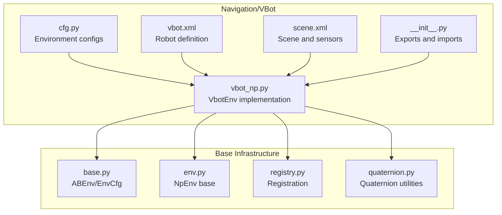
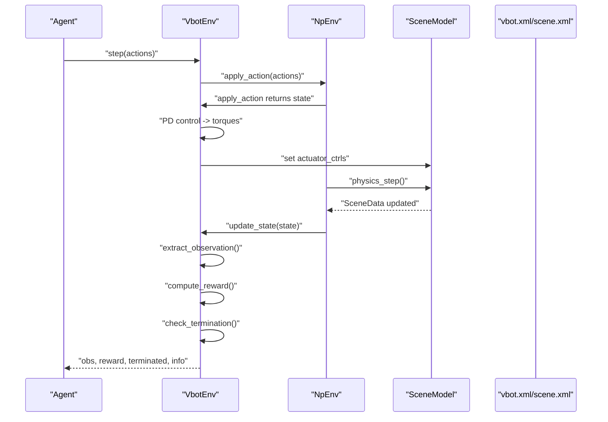
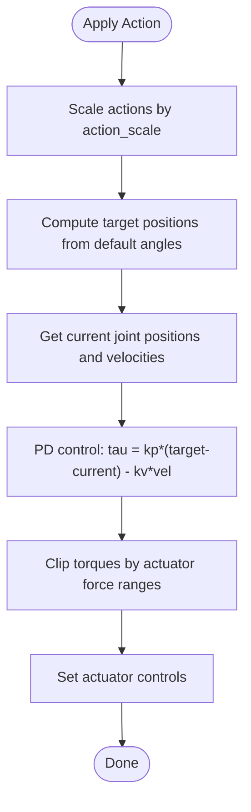
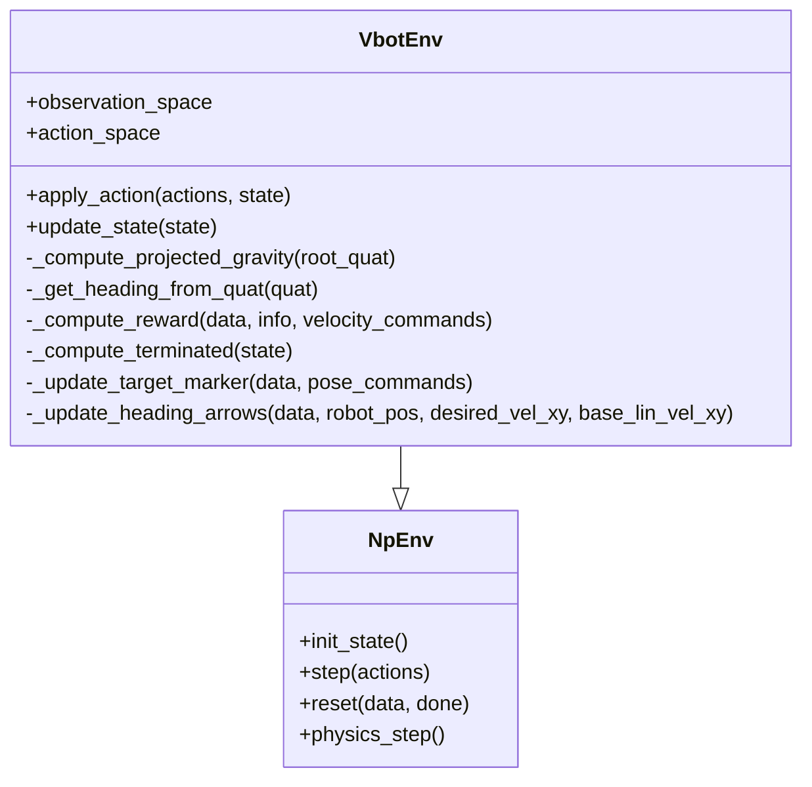
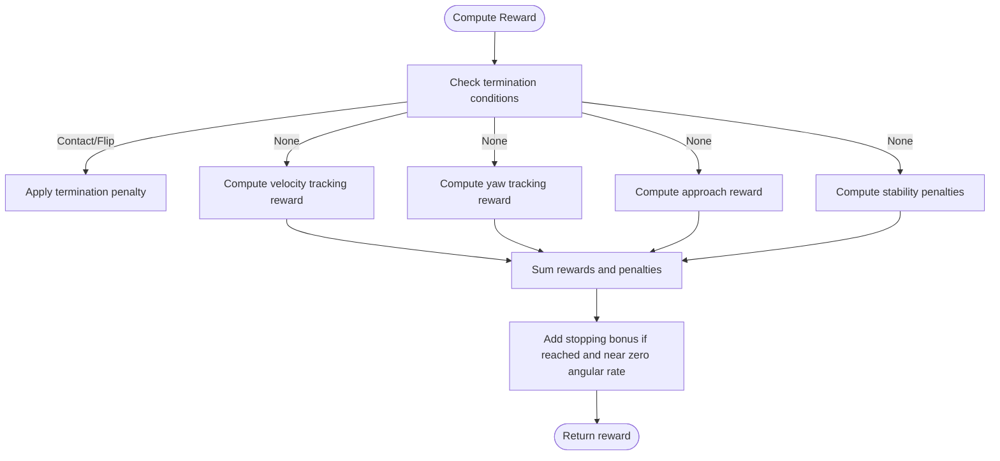
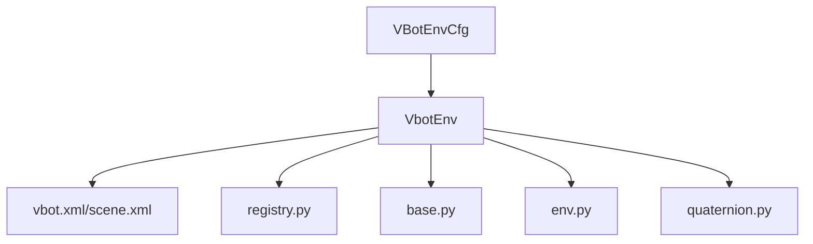

# VBot Base Environment

<cite>
**Referenced Files in This Document**
- [vbot_np.py](file://motrix_envs/src/motrix_envs/navigation/vbot/vbot_np.py)
- [cfg.py](file://motrix_envs/src/motrix_envs/navigation/vbot/cfg.py)
- [base.py](file://motrix_envs/src/motrix_envs/base.py)
- [env.py](file://motrix_envs/src/motrix_envs/np/env.py)
- [registry.py](file://motrix_envs/src/motrix_envs/registry.py)
- [quaternion.py](file://motrix_envs/src/motrix_envs/math/quaternion.py)
- [vbot.xml](file://motrix_envs/src/motrix_envs/navigation/vbot/xmls/vbot.xml)
- [scene.xml](file://motrix_envs/src/motrix_envs/navigation/vbot/xmls/scene.xml)
- [__init__.py](file://motrix_envs/src/motrix_envs/navigation/vbot/__init__.py)
</cite>

## Table of Contents
1. [Introduction](#introduction)
2. [Project Structure](#project-structure)
3. [Core Components](#core-components)
4. [Architecture Overview](#architecture-overview)
5. [Detailed Component Analysis](#detailed-component-analysis)
6. [Dependency Analysis](#dependency-analysis)
7. [Performance Considerations](#performance-considerations)
8. [Troubleshooting Guide](#troubleshooting-guide)
9. [Conclusion](#conclusion)
10. [Appendices](#appendices)

## Introduction
This document describes the VBot base navigation environment built on the MotrixLab platform. It focuses on the omnidirectional wheeled robot implementation, detailing the VbotEnv class architecture, the 12-degree-of-freedom actuator system with PD control, the 54-dimensional observation space combining IMU data, joint states, and navigation commands, and the 12-dimensional action space for wheel motor control. It explains the environment’s core functionality including the position tracking reward system, termination conditions for base contact and side flips, and the arrow visualization system for robot and desired headings. The configuration system, including normalization parameters, sensor definitions, and control settings, is documented alongside the reward shaping mechanism emphasizing linear velocity tracking, angular velocity control, approach rewards, and stability penalties. Finally, it covers the reset procedure with spawn area randomization and pose command generation, and provides practical examples of environment initialization, action application, and state observation extraction.

## Project Structure
The VBot navigation environment is organized under the navigation package with modular configuration, environment implementation, and XML-based robot/scene definitions. Key elements include:
- Configuration classes defining environment parameters, normalization, sensors, and reward weights
- Environment implementation extending the NumPy-based environment base class
- Robot and scene XMLs defining actuators, sensors, geometry, and collision detection
- Registry decorators for environment registration and instantiation

**Diagram sources**
- [vbot_np.py](file://motrix_envs/src/motrix_envs/navigation/vbot/vbot_np.py#L39-L42)
- [cfg.py](file://motrix_envs/src/motrix_envs/navigation/vbot/cfg.py#L118-L138)
- [env.py](file://motrix_envs/src/motrix_envs/np/env.py#L52-L110)
- [base.py](file://motrix_envs/src/motrix_envs/base.py#L23-L52)
- [registry.py](file://motrix_envs/src/motrix_envs/registry.py#L53-L99)
- [quaternion.py](file://motrix_envs/src/motrix_envs/math/quaternion.py#L18-L50)
- [vbot.xml](file://motrix_envs/src/motrix_envs/navigation/vbot/xmls/vbot.xml#L694-L711)
- [scene.xml](file://motrix_envs/src/motrix_envs/navigation/vbot/xmls/scene.xml#L24-L37)
- [__init__.py](file://motrix_envs/src/motrix_envs/navigation/vbot/__init__.py#L16-L31)

**Section sources**
- [vbot_np.py](file://motrix_envs/src/motrix_envs/navigation/vbot/vbot_np.py#L39-L90)
- [cfg.py](file://motrix_envs/src/motrix_envs/navigation/vbot/cfg.py#L118-L138)
- [env.py](file://motrix_envs/src/motrix_envs/np/env.py#L52-L110)
- [base.py](file://motrix_envs/src/motrix_envs/base.py#L23-L52)
- [registry.py](file://motrix_envs/src/motrix_envs/registry.py#L53-L99)
- [quaternion.py](file://motrix_envs/src/motrix_envs/math/quaternion.py#L18-L50)
- [vbot.xml](file://motrix_envs/src/motrix_envs/navigation/vbot/xmls/vbot.xml#L694-L711)
- [scene.xml](file://motrix_envs/src/motrix_envs/navigation/vbot/xmls/scene.xml#L24-L37)
- [__init__.py](file://motrix_envs/src/motrix_envs/navigation/vbot/__init__.py#L16-L31)

## Core Components
- VbotEnv: Implements the navigation environment with PD control, observation extraction, reward computation, termination checks, and visualization updates.
- VBotEnvCfg: Defines environment configuration including model file, simulation/control time steps, noise, control scaling, reward weights, normalization, asset and sensor definitions, and command ranges.
- NpEnv: Provides the base NumPy-based environment lifecycle (init, step, reset, physics).
- Registry: Registers environment configurations and environment classes for instantiation by name.
- XML Definitions: vbot.xml defines the robot structure, actuators, and sensors; scene.xml defines the scene, ground, and contact sensors.

Key implementation references:
- VbotEnv class and constructor: [vbot_np.py](file://motrix_envs/src/motrix_envs/navigation/vbot/vbot_np.py#L39-L90)
- Observation and action spaces: [vbot_np.py](file://motrix_envs/src/motrix_envs/navigation/vbot/vbot_np.py#L62-L68)
- PD control and torque computation: [vbot_np.py](file://motrix_envs/src/motrix_envs/navigation/vbot/vbot_np.py#L269-L290)
- Observation extraction and reward computation: [vbot_np.py](file://motrix_envs/src/motrix_envs/navigation/vbot/vbot_np.py#L388-L503)
- Termination conditions: [vbot_np.py](file://motrix_envs/src/motrix_envs/navigation/vbot/vbot_np.py#L505-L526)
- Arrow visualization: [vbot_np.py](file://motrix_envs/src/motrix_envs/navigation/vbot/vbot_np.py#L322-L370)
- Reset procedure: [vbot_np.py](file://motrix_envs/src/motrix_envs/navigation/vbot/vbot_np.py#L687-L816)
- Configuration classes: [cfg.py](file://motrix_envs/src/motrix_envs/navigation/vbot/cfg.py#L118-L138)
- Base environment lifecycle: [env.py](file://motrix_envs/src/motrix_envs/np/env.py#L52-L110)
- Registry decorators: [registry.py](file://motrix_envs/src/motrix_envs/registry.py#L53-L99)
- Robot and scene XMLs: [vbot.xml](file://motrix_envs/src/motrix_envs/navigation/vbot/xmls/vbot.xml#L694-L711), [scene.xml](file://motrix_envs/src/motrix_envs/navigation/vbot/xmls/scene.xml#L24-L37)

**Section sources**
- [vbot_np.py](file://motrix_envs/src/motrix_envs/navigation/vbot/vbot_np.py#L39-L90)
- [vbot_np.py](file://motrix_envs/src/motrix_envs/navigation/vbot/vbot_np.py#L269-L290)
- [vbot_np.py](file://motrix_envs/src/motrix_envs/navigation/vbot/vbot_np.py#L388-L503)
- [vbot_np.py](file://motrix_envs/src/motrix_envs/navigation/vbot/vbot_np.py#L505-L526)
- [vbot_np.py](file://motrix_envs/src/motrix_envs/navigation/vbot/vbot_np.py#L322-L370)
- [vbot_np.py](file://motrix_envs/src/motrix_envs/navigation/vbot/vbot_np.py#L687-L816)
- [cfg.py](file://motrix_envs/src/motrix_envs/navigation/vbot/cfg.py#L118-L138)
- [env.py](file://motrix_envs/src/motrix_envs/np/env.py#L52-L110)
- [registry.py](file://motrix_envs/src/motrix_envs/registry.py#L53-L99)
- [vbot.xml](file://motrix_envs/src/motrix_envs/navigation/vbot/xmls/vbot.xml#L694-L711)
- [scene.xml](file://motrix_envs/src/motrix_envs/navigation/vbot/xmls/scene.xml#L24-L37)

## Architecture Overview
The VBot navigation environment integrates a physics-based robot model with a reinforcement learning loop. The environment wraps a scene model, applies actions through PD control, extracts observations, computes rewards, and manages termination conditions. Visualization arrows indicate robot and desired headings.

**Diagram sources**
- [vbot_np.py](file://motrix_envs/src/motrix_envs/navigation/vbot/vbot_np.py#L249-L267)
- [vbot_np.py](file://motrix_envs/src/motrix_envs/navigation/vbot/vbot_np.py#L388-L503)
- [env.py](file://motrix_envs/src/motrix_envs/np/env.py#L196-L208)
- [vbot.xml](file://motrix_envs/src/motrix_envs/navigation/vbot/xmls/vbot.xml#L694-L711)
- [scene.xml](file://motrix_envs/src/motrix_envs/navigation/vbot/xmls/scene.xml#L24-L37)

## Detailed Component Analysis

### VbotEnv Class Architecture
- Inherits from NpEnv and registers with the registry for the "vbot_navigation_flat" environment name.
- Initializes robot body, contact geometry, target marker bodies, and arrow visualization bodies.
- Sets up action and observation spaces: 12-dimensional actions, 54-dimensional observations.
- Maintains buffers for default joint angles, normalization scales, and action filtering.

Key implementation references:
- Class and constructor: [vbot_np.py](file://motrix_envs/src/motrix_envs/navigation/vbot/vbot_np.py#L39-L90)
- Action and observation spaces: [vbot_np.py](file://motrix_envs/src/motrix_envs/navigation/vbot/vbot_np.py#L62-L68)
- Buffer initialization: [vbot_np.py](file://motrix_envs/src/motrix_envs/navigation/vbot/vbot_np.py#L94-L113)

**Section sources**
- [vbot_np.py](file://motrix_envs/src/motrix_envs/navigation/vbot/vbot_np.py#L39-L90)
- [vbot_np.py](file://motrix_envs/src/motrix_envs/navigation/vbot/vbot_np.py#L62-L68)
- [vbot_np.py](file://motrix_envs/src/motrix_envs/navigation/vbot/vbot_np.py#L94-L113)

### Actuator System and PD Control
- 12 actuators correspond to 12 joints (3 per leg: hip, thigh, calf).
- Actions are mapped to target positions using default joint angles and a configurable action scale.
- PD control computes torques as tau = kp * (target - current) - kv * current velocity.
- Torque limits are enforced according to actuator force ranges defined in the XML.

Key implementation references:
- Action application and filtered actions: [vbot_np.py](file://motrix_envs/src/motrix_envs/navigation/vbot/vbot_np.py#L249-L267)
- PD torque computation: [vbot_np.py](file://motrix_envs/src/motrix_envs/navigation/vbot/vbot_np.py#L269-L290)
- Actuator definitions and force ranges: [vbot.xml](file://motrix_envs/src/motrix_envs/navigation/vbot/xmls/vbot.xml#L694-L711)

**Diagram sources**
- [vbot_np.py](file://motrix_envs/src/motrix_envs/navigation/vbot/vbot_np.py#L249-L290)
- [vbot.xml](file://motrix_envs/src/motrix_envs/navigation/vbot/xmls/vbot.xml#L694-L711)

**Section sources**
- [vbot_np.py](file://motrix_envs/src/motrix_envs/navigation/vbot/vbot_np.py#L249-L290)
- [vbot.xml](file://motrix_envs/src/motrix_envs/navigation/vbot/xmls/vbot.xml#L694-L711)

### Observation Space and State Extraction
- Observation vector concatenates:
  - IMU: base linear velocity (3), gyroscope (3), projected gravity (3)
  - Joint states: joint positions (12), joint velocities (12)
  - Previous actions (12)
  - Commands: normalized desired vx, vy, vyaw (3)
  - Task metrics: position error (2), heading error (1), distance to target (1), reached flag (1), stop-ready flag (1)
- Observations are normalized using configuration-defined scales.

Key implementation references:
- Observation construction: [vbot_np.py](file://motrix_envs/src/motrix_envs/navigation/vbot/vbot_np.py#L468-L484)
- Normalization scales: [vbot_np.py](file://motrix_envs/src/motrix_envs/navigation/vbot/vbot_np.py#L99-L103)
- Sensor names and indices: [cfg.py](file://motrix_envs/src/motrix_envs/navigation/vbot/cfg.py#L89-L93)
- IMU and joint sensors: [vbot.xml](file://motrix_envs/src/motrix_envs/navigation/vbot/xmls/vbot.xml#L813-L820)

**Diagram sources**
- [vbot_np.py](file://motrix_envs/src/motrix_envs/navigation/vbot/vbot_np.py#L241-L503)
- [env.py](file://motrix_envs/src/motrix_envs/np/env.py#L52-L110)

**Section sources**
- [vbot_np.py](file://motrix_envs/src/motrix_envs/navigation/vbot/vbot_np.py#L468-L484)
- [vbot_np.py](file://motrix_envs/src/motrix_envs/navigation/vbot/vbot_np.py#L99-L103)
- [cfg.py](file://motrix_envs/src/motrix_envs/navigation/vbot/cfg.py#L89-L93)
- [vbot.xml](file://motrix_envs/src/motrix_envs/navigation/vbot/xmls/vbot.xml#L813-L820)

### Reward Shaping Mechanism
- Position tracking reward: exponential of negative squared error in xy velocity.
- Heading tracking reward: exponential of negative squared error in yaw rate.
- Approach reward: difference in minimal distance to target over time.
- Termination penalty: applied when base contacts ground or robot tilts excessively.
- Stopping bonus: small bonus when reaching and maintaining low angular velocity.
- Penalities: vertical velocity, xy angular velocity, torques, joint velocities, action rate.

Key implementation references:
- Reward computation: [vbot_np.py](file://motrix_envs/src/motrix_envs/navigation/vbot/vbot_np.py#L528-L685)
- Reward weights and scales: [cfg.py](file://motrix_envs/src/motrix_envs/navigation/vbot/cfg.py#L95-L116)

**Diagram sources**
- [vbot_np.py](file://motrix_envs/src/motrix_envs/navigation/vbot/vbot_np.py#L528-L685)
- [cfg.py](file://motrix_envs/src/motrix_envs/navigation/vbot/cfg.py#L95-L116)

**Section sources**
- [vbot_np.py](file://motrix_envs/src/motrix_envs/navigation/vbot/vbot_np.py#L528-L685)
- [cfg.py](file://motrix_envs/src/motrix_envs/navigation/vbot/cfg.py#L95-L116)

### Termination Conditions
- Base contact termination: detected via a dedicated contact sensor.
- Side flip termination: computed from projected gravity vector; excessive tilt triggers termination.
- DOF velocity overflow: extreme or NaN joint velocities trigger termination.

Key implementation references:
- Termination computation: [vbot_np.py](file://motrix_envs/src/motrix_envs/navigation/vbot/vbot_np.py#L505-L526)
- Contact sensor definition: [scene.xml](file://motrix_envs/src/motrix_envs/navigation/vbot/xmls/scene.xml#L29-L29)

**Section sources**
- [vbot_np.py](file://motrix_envs/src/motrix_envs/navigation/vbot/vbot_np.py#L505-L526)
- [scene.xml](file://motrix_envs/src/motrix_envs/navigation/vbot/xmls/scene.xml#L29-L29)

### Arrow Visualization System
- Two free-joint bodies visualize robot heading (green) and desired heading (blue).
- Positions and orientations updated based on current base linear velocity and desired movement direction.
- Height offset ensures arrows appear above the robot.

Key implementation references:
- Arrow update: [vbot_np.py](file://motrix_envs/src/motrix_envs/navigation/vbot/vbot_np.py#L322-L370)
- Arrow bodies and geometry: [vbot.xml](file://motrix_envs/src/motrix_envs/navigation/vbot/xmls/vbot.xml#L671-L691)

**Section sources**
- [vbot_np.py](file://motrix_envs/src/motrix_envs/navigation/vbot/vbot_np.py#L322-L370)
- [vbot.xml](file://motrix_envs/src/motrix_envs/navigation/vbot/xmls/vbot.xml#L671-L691)

### Reset Procedure
- Random spawn within a small area around a center point.
- Pose commands generated as offsets from current position and random yaw.
- Base orientation normalized to unit quaternion; arrow quaternions normalized as well.
- Initial observation constructed with zero previous actions and normalized commands.

Key implementation references:
- Reset logic: [vbot_np.py](file://motrix_envs/src/motrix_envs/navigation/vbot/vbot_np.py#L687-L816)
- Spawn configuration: [cfg.py](file://motrix_envs/src/motrix_envs/navigation/vbot/cfg.py#L41-L46)

**Section sources**
- [vbot_np.py](file://motrix_envs/src/motrix_envs/navigation/vbot/vbot_np.py#L687-L816)
- [cfg.py](file://motrix_envs/src/motrix_envs/navigation/vbot/cfg.py#L41-L46)

### Configuration System
- Environment configuration class VBotEnvCfg aggregates:
  - Model file path
  - Simulation and control time steps
  - Noise configuration
  - Control configuration (action scale)
  - Reward configuration (weights)
  - Initialization state (spawn center, randomization range, default joint angles)
  - Commands (pose command ranges)
  - Normalization coefficients
  - Asset definitions (body name, foot names, termination contacts, ground subtree, goal name)
  - Sensor definitions (IMU, feet)

Key implementation references:
- Configuration class: [cfg.py](file://motrix_envs/src/motrix_envs/navigation/vbot/cfg.py#L118-L138)
- Noise configuration: [cfg.py](file://motrix_envs/src/motrix_envs/navigation/vbot/cfg.py#L24-L32)
- Control configuration: [cfg.py](file://motrix_envs/src/motrix_envs/navigation/vbot/cfg.py#L34-L39)
- Reward configuration: [cfg.py](file://motrix_envs/src/motrix_envs/navigation/vbot/cfg.py#L95-L116)
- Initialization state: [cfg.py](file://motrix_envs/src/motrix_envs/navigation/vbot/cfg.py#L41-L63)
- Commands: [cfg.py](file://motrix_envs/src/motrix_envs/navigation/vbot/cfg.py#L66-L70)
- Normalization: [cfg.py](file://motrix_envs/src/motrix_envs/navigation/vbot/cfg.py#L73-L78)
- Asset: [cfg.py](file://motrix_envs/src/motrix_envs/navigation/vbot/cfg.py#L80-L87)
- Sensor: [cfg.py](file://motrix_envs/src/motrix_envs/navigation/vbot/cfg.py#L89-L93)

**Section sources**
- [cfg.py](file://motrix_envs/src/motrix_envs/navigation/vbot/cfg.py#L118-L138)
- [cfg.py](file://motrix_envs/src/motrix_envs/navigation/vbot/cfg.py#L24-L32)
- [cfg.py](file://motrix_envs/src/motrix_envs/navigation/vbot/cfg.py#L34-L39)
- [cfg.py](file://motrix_envs/src/motrix_envs/navigation/vbot/cfg.py#L95-L116)
- [cfg.py](file://motrix_envs/src/motrix_envs/navigation/vbot/cfg.py#L41-L63)
- [cfg.py](file://motrix_envs/src/motrix_envs/navigation/vbot/cfg.py#L66-L70)
- [cfg.py](file://motrix_envs/src/motrix_envs/navigation/vbot/cfg.py#L73-L78)
- [cfg.py](file://motrix_envs/src/motrix_envs/navigation/vbot/cfg.py#L80-L87)
- [cfg.py](file://motrix_envs/src/motrix_envs/navigation/vbot/cfg.py#L89-L93)

### Practical Examples
- Environment initialization:
  - Register and instantiate via registry: [registry.py](file://motrix_envs/src/motrix_envs/registry.py#L114-L160)
  - Example usage: [__init__.py](file://motrix_envs/src/motrix_envs/navigation/vbot/__init__.py#L22-L22)
- Applying actions:
  - Call step with actions: [env.py](file://motrix_envs/src/motrix_envs/np/env.py#L196-L208)
  - PD control mapping: [vbot_np.py](file://motrix_envs/src/motrix_envs/navigation/vbot/vbot_np.py#L249-L290)
- Extracting observations:
  - Observation concatenation: [vbot_np.py](file://motrix_envs/src/motrix_envs/navigation/vbot/vbot_np.py#L468-L484)
  - Sensor values: [vbot.xml](file://motrix_envs/src/motrix_envs/navigation/vbot/xmls/vbot.xml#L813-L820)

**Section sources**
- [registry.py](file://motrix_envs/src/motrix_envs/registry.py#L114-L160)
- [__init__.py](file://motrix_envs/src/motrix_envs/navigation/vbot/__init__.py#L22-L22)
- [env.py](file://motrix_envs/src/motrix_envs/np/env.py#L196-L208)
- [vbot_np.py](file://motrix_envs/src/motrix_envs/navigation/vbot/vbot_np.py#L249-L290)
- [vbot_np.py](file://motrix_envs/src/motrix_envs/navigation/vbot/vbot_np.py#L468-L484)
- [vbot.xml](file://motrix_envs/src/motrix_envs/navigation/vbot/xmls/vbot.xml#L813-L820)

## Dependency Analysis
The VBot environment depends on:
- Physics model and sensors defined in XML
- Registry for environment registration and instantiation
- Base environment infrastructure for lifecycle management
- Math utilities for quaternion operations

**Diagram sources**
- [vbot_np.py](file://motrix_envs/src/motrix_envs/navigation/vbot/vbot_np.py#L39-L42)
- [vbot.xml](file://motrix_envs/src/motrix_envs/navigation/vbot/xmls/vbot.xml#L694-L711)
- [scene.xml](file://motrix_envs/src/motrix_envs/navigation/vbot/xmls/scene.xml#L24-L37)
- [registry.py](file://motrix_envs/src/motrix_envs/registry.py#L53-L99)
- [base.py](file://motrix_envs/src/motrix_envs/base.py#L23-L52)
- [env.py](file://motrix_envs/src/motrix_envs/np/env.py#L52-L110)
- [quaternion.py](file://motrix_envs/src/motrix_envs/math/quaternion.py#L18-L50)
- [cfg.py](file://motrix_envs/src/motrix_envs/navigation/vbot/cfg.py#L118-L138)

**Section sources**
- [vbot_np.py](file://motrix_envs/src/motrix_envs/navigation/vbot/vbot_np.py#L39-L42)
- [vbot.xml](file://motrix_envs/src/motrix_envs/navigation/vbot/xmls/vbot.xml#L694-L711)
- [scene.xml](file://motrix_envs/src/motrix_envs/navigation/vbot/xmls/scene.xml#L24-L37)
- [registry.py](file://motrix_envs/src/motrix_envs/registry.py#L53-L99)
- [base.py](file://motrix_envs/src/motrix_envs/base.py#L23-L52)
- [env.py](file://motrix_envs/src/motrix_envs/np/env.py#L52-L110)
- [quaternion.py](file://motrix_envs/src/motrix_envs/math/quaternion.py#L18-L50)
- [cfg.py](file://motrix_envs/src/motrix_envs/navigation/vbot/cfg.py#L118-L138)

## Performance Considerations
- Simulation and control time steps are decoupled; ensure sim_substeps aligns with control frequency.
- Observation normalization prevents numerical overflow in reward computations.
- Action filtering smooths control signals to reduce jitter.
- Termination checks leverage efficient contact queries and quaternion operations.

[No sources needed since this section provides general guidance]

## Troubleshooting Guide
Common issues and remedies:
- Termination contact detection warnings: verify ground geometry names and subtree prefixes.
- Base contact sensor errors: confirm sensor name and availability in the loaded model.
- Excessive joint velocities or NaNs: review PD gains and torque limits; consider reducing action scale.
- Arrow visualization missing: ensure arrow bodies exist in the scene XML and are accessible via model.

Key implementation references:
- Termination contact initialization: [vbot_np.py](file://motrix_envs/src/motrix_envs/navigation/vbot/vbot_np.py#L157-L191)
- Base contact sensor usage: [vbot_np.py](file://motrix_envs/src/motrix_envs/navigation/vbot/vbot_np.py#L512-L522)
- Arrow body access: [vbot_np.py](file://motrix_envs/src/motrix_envs/navigation/vbot/vbot_np.py#L55-L60)

**Section sources**
- [vbot_np.py](file://motrix_envs/src/motrix_envs/navigation/vbot/vbot_np.py#L157-L191)
- [vbot_np.py](file://motrix_envs/src/motrix_envs/navigation/vbot/vbot_np.py#L512-L522)
- [vbot_np.py](file://motrix_envs/src/motrix_envs/navigation/vbot/vbot_np.py#L55-L60)

## Conclusion
The VBot base navigation environment provides a robust, physics-based platform for omnidirectional wheeled robot navigation. Its PD control actuator system, rich 54-dimensional observation space, and carefully designed reward shaping enable effective learning of position tracking, heading control, and stability. The modular configuration and registry system facilitate easy experimentation across different terrains and tasks. The visualization arrows and termination conditions enhance both interpretability and safety during training.

[No sources needed since this section summarizes without analyzing specific files]

## Appendices

### Appendix A: Environment Registration and Instantiation
- Register environment configuration and class with decorators.
- Instantiate environments by name with optional overrides.

Key implementation references:
- Environment registration: [registry.py](file://motrix_envs/src/motrix_envs/registry.py#L53-L99)
- Environment creation: [registry.py](file://motrix_envs/src/motrix_envs/registry.py#L114-L160)

**Section sources**
- [registry.py](file://motrix_envs/src/motrix_envs/registry.py#L53-L99)
- [registry.py](file://motrix_envs/src/motrix_envs/registry.py#L114-L160)

### Appendix B: Robot and Scene XML Reference
- Robot definition includes actuators, joint ranges, and IMU sensors.
- Scene definition includes ground plane and contact sensors.

Key implementation references:
- Actuators and motors: [vbot.xml](file://motrix_envs/src/motrix_envs/navigation/vbot/xmls/vbot.xml#L694-L711)
- IMU sensors: [vbot.xml](file://motrix_envs/src/motrix_envs/navigation/vbot/xmls/vbot.xml#L813-L820)
- Ground and contact sensors: [scene.xml](file://motrix_envs/src/motrix_envs/navigation/vbot/xmls/scene.xml#L24-L37)

**Section sources**
- [vbot.xml](file://motrix_envs/src/motrix_envs/navigation/vbot/xmls/vbot.xml#L694-L711)
- [vbot.xml](file://motrix_envs/src/motrix_envs/navigation/vbot/xmls/vbot.xml#L813-L820)
- [scene.xml](file://motrix_envs/src/motrix_envs/navigation/vbot/xmls/scene.xml#L24-L37)