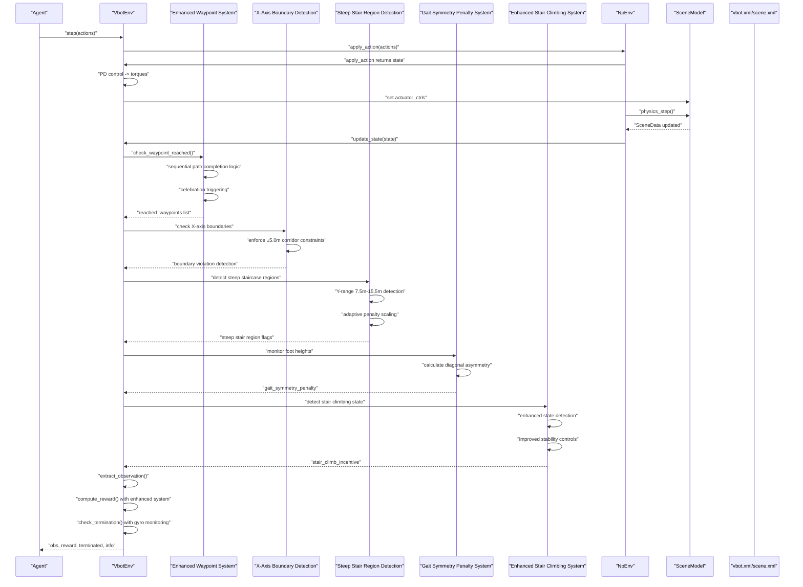
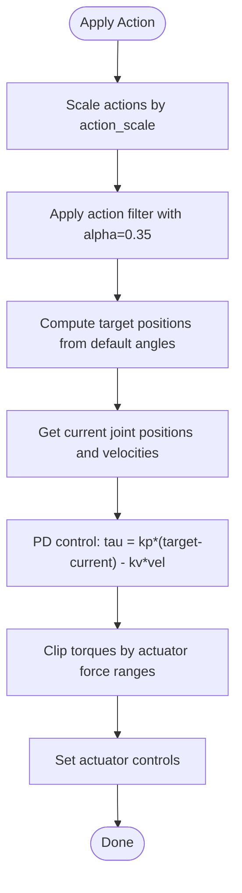
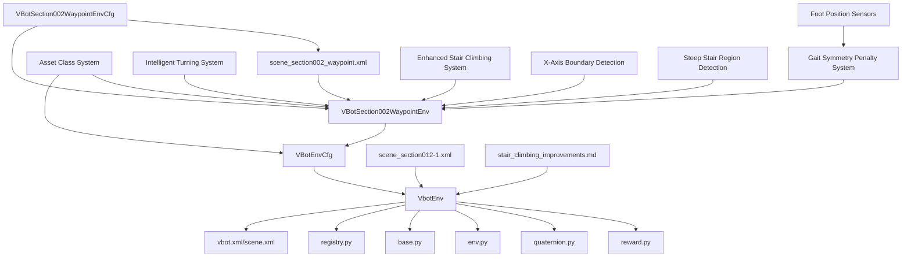

# VBot Base Environment

<cite>
**Referenced Files in This Document**
- [vbot_np.py](file://motrix_envs/src/motrix_envs/navigation/vbot/vbot_np.py)
- [vbot_section002_np.py](file://motrix_envs/src/motrix_envs/navigation/vbot/vbot_section002_np.py)
- [vbot_section002_waypoint_np.py](file://motrix_envs/src/motrix_envs/navigation/vbot/vbot_section002_waypoint_np.py)
- [vbot_section011_np.py](file://motrix_envs/src/motrix_envs/navigation/vbot/vbot_section011_np.py)
- [vbot_section012_np.py](file://motrix_envs/src/motrix_envs/navigation/vbot/vbot_section012_np.py)
- [vbot_section013_np.py](file://motrix_envs/src/motrix_envs/navigation/vbot/vbot_section013_np.py)
- [cfg.py](file://motrix_envs/src/motrix_envs/navigation/vbot/cfg.py)
- [scene_section002_waypoint.xml](file://motrix_envs/src/motrix_envs/navigation/vbot/xmls/scene_section002_waypoint.xml)
- [base.py](file://motrix_envs/src/motrix_envs/base.py)
- [env.py](file://motrix_envs/src/motrix_envs/np/env.py)
- [registry.py](file://motrix_envs/src/motrix_envs/registry.py)
- [quaternion.py](file://motrix_envs/src/motrix_envs/math/quaternion.py)
- [reward.py](file://motrix_envs/src/motrix_envs/np/reward.py)
- [vbot.xml](file://motrix_envs/src/motrix_envs/navigation/vbot/xmls/vbot.xml)
- [scene.xml](file://motrix_envs/src/motrix_envs/navigation/vbot/xmls/scene.xml)
- [stair_climbing_improvements.md](file://stair_climbing_improvements.md)
- [__init__.py](file://motrix_envs/src/motrix_envs/navigation/vbot/__init__.py)
</cite>

## Update Summary
**Changes Made**
- Enhanced VBot Section 002 Waypoint environment with expanded difficulty configurations (hard-4: 15 waypoints, hard-5: 20 waypoints)
- Added new waypoint wp_2-5-2_body with repositioned waypoints
- Reduced observation space from 67 to 54 dimensions
- Implemented new rollover detection system with dynamic threshold
- Enhanced reward function with new penalties and rewards
- Improved navigation control logic with speed reduction strategies
- Enhanced debugging capabilities with comprehensive statistics tracking

## Table of Contents
1. [Introduction](#introduction)
2. [Project Structure](#project-structure)
3. [Core Components](#core-components)
4. [Architecture Overview](#architecture-overview)
5. [Detailed Component Analysis](#detailed-component-analysis)
6. [Dependency Analysis](#dependency-analysis)
7. [Performance Considerations](#performance-considerations)
8. [Troubleshooting Guide](#troubleshooting-guide)
9. [Conclusion](#conclusion)
10. [Appendices](#appendices)

## Introduction
This document describes the VBot base navigation environment built on the MotrixLab platform with enhanced waypoint navigation capabilities and sophisticated terrain adaptation systems. It focuses on the omnidirectional wheeled robot implementation, detailing the VbotEnv class architecture, the 12-degree-of-freedom actuator system with PD control, the 54-dimensional observation space combining IMU data, joint states, and navigation commands, and the 12-dimensional action space for wheel motor control. The environment now features specialized reward mechanisms for stair navigation, adaptive control systems for terrain adaptation, and enhanced sensor integration for improved climbing performance. It explains the environment's core functionality including the enhanced position tracking reward system with improved numerical stability, enhanced termination conditions for base contact and side flips with gyro sensor monitoring, and the arrow visualization system for robot and desired headings. The configuration system, including normalization parameters, sensor definitions, and control settings, is documented alongside the comprehensive reward shaping mechanism emphasizing linear velocity tracking, angular velocity control, approach rewards, stability penalties, specialized stair navigation components, and the new gait symmetry penalties. Finally, it covers the reset procedure with spawn area randomization and pose command generation, and provides practical examples of environment initialization, action application, and state observation extraction.

**Updated** The environment now includes advanced waypoint navigation capabilities with enhanced sequential path completion logic, refined celebration system replacing the old special action system, comprehensive debugging features, and sophisticated reward system enhancements including gait symmetry penalties and improved stair climbing optimizations. The gait symmetry penalty system monitors foot height differences between diagonal legs to encourage natural four-legged movement patterns, while the enhanced stair climbing optimizations provide better state detection and stability controls for improved climbing performance. The new X-axis boundary detection system prevents robots from straying too far from the designated navigation corridor, and the steep staircase region detection provides adaptive reward scaling for challenging terrain sections.

## Project Structure
The VBot navigation environment is organized under the navigation package with modular configuration, environment implementation, and XML-based robot/scene definitions. Key elements include:
- Configuration classes defining environment parameters, normalization, sensors, and reward weights
- Environment implementation extending the NumPy-based environment base class with enhanced stair navigation capabilities
- Robot and scene XMLs defining actuators, sensors, geometry, and collision detection with specialized stair navigation features
- Registry decorators for environment registration and instantiation
- Advanced reward shaping utilities for exponential-based calculations with stair-specific components
- Enhanced sensor configurations for gravity projection, foot positioning, and contact force measurement
- **New** Enhanced waypoint navigation system with sequential path completion logic and celebration triggering
- **New** Intelligent turning control system with large-turn prioritization and waypoint proximity guidance
- **New** Gait symmetry penalty system for natural four-legged movement patterns
- **New** Enhanced stair climbing detection with improved sensor integration and state monitoring
- **New** X-axis boundary detection system for corridor navigation constraints
- **New** Steep staircase region detection with adaptive penalty scaling and dynamic reward adjustment

**Updated** The project structure now includes enhanced waypoint navigation capabilities with comprehensive waypoint detection, sequential path completion logic, and celebration system replacing the old special action system. The new 'hard-3' difficulty mode provides maximum waypoint complexity with nine reward points and enhanced celebration actions. The reward system now includes sophisticated gait symmetry penalties and enhanced stair climbing optimizations. The X-axis boundary detection system enforces navigation corridors with ±5.0m lateral constraints, while steep staircase region detection provides adaptive reward scaling for challenging terrain sections.

```mermaid
graph TB
subgraph "Navigation/VBot"
CFG["cfg.py<br/>Environment configs"]
ENV["vbot_np.py<br/>VbotEnv implementation"]
SECTION002_WAYPOINT["vbot_section002_waypoint_np.py<br/>Enhanced waypoint navigation"]
SECTION002["vbot_section002_np.py<br/>Enhanced stair climbing"]
SECTION011["vbot_section011_np.py<br/>Enhanced stair climbing"]
SECTION012["vbot_section012_np.py<br/>Enhanced stair climbing"]
SECTION013["vbot_section013_np.py<br/>Enhanced stair climbing"]
INIT["__init__.py<br/>Exports and imports"]
XML["vbot.xml<br/>Robot definition"]
SCENE["scene.xml<br/>Scene and sensors"]
SCENE002_WAYPOINT["scene_section002_waypoint.xml<br/>Enhanced waypoint terrain"]
STAIR_XML["scene_section012-1.xml<br/>Stair-specific sensors"]
REWARD["reward.py<br/>Exponential reward utilities"]
END
subgraph "Base Infrastructure"
BASE["base.py<br/>ABEnv/EnvCfg"]
NPENV["env.py<br/>NpEnv base"]
REG["registry.py<br/>Registration"]
QUAT["quaternion.py<br/>Quaternion utilities"]
STAIR_IMPROVEMENTS["stair_climbing_improvements.md<br/>Enhancement documentation"]
END
CFG --> ENV
ENV --> NPENV
ENV --> BASE
ENV --> REG
ENV --> QUAT
ENV --> REWARD
SECTION002_WAYPOINT --> ENV
SECTION002 --> ENV
SECTION011 --> ENV
SECTION012 --> ENV
SECTION013 --> ENV
XML --> ENV
XML --> SECTION002
XML --> SECTION011
XML --> SECTION012
XML --> SECTION013
SCENE --> ENV
SCENE002_WAYPOINT --> SECTION002_WAYPOINT
STAIR_XML --> ENV
STAIR_IMPROVEMENTS --> ENV
INIT --> ENV
```

**Diagram sources**
- [vbot_np.py](file://motrix_envs/src/motrix_envs/navigation/vbot/vbot_np.py#L39-L42)
- [cfg.py](file://motrix_envs/src/motrix_envs/navigation/vbot/cfg.py#L118-L138)
- [vbot_section002_waypoint_np.py](file://motrix_envs/src/motrix_envs/navigation/vbot/vbot_section002_waypoint_np.py#L27-L53)
- [vbot_section002_np.py](file://motrix_envs/src/motrix_envs/navigation/vbot/vbot_section002_np.py#L1-L50)
- [vbot_section011_np.py](file://motrix_envs/src/motrix_envs/navigation/vbot/vbot_section011_np.py#L1-L50)
- [vbot_section012_np.py](file://motrix_envs/src/motrix_envs/navigation/vbot/vbot_section012_np.py#L1-L50)
- [vbot_section013_np.py](file://motrix_envs/src/motrix_envs/navigation/vbot/vbot_section013_np.py#L1-L50)
- [env.py](file://motrix_envs/src/motrix_envs/np/env.py#L52-L110)
- [base.py](file://motrix_envs/src/motrix_envs/base.py#L23-L52)
- [registry.py](file://motrix_envs/src/motrix_envs/registry.py#L53-L99)
- [quaternion.py](file://motrix_envs/src/motrix_envs/math/quaternion.py#L18-L50)
- [reward.py](file://motrix_envs/src/motrix_envs/np/reward.py#L21-L61)
- [vbot.xml](file://motrix_envs/src/motrix_envs/navigation/vbot/xmls/vbot.xml#L830-L839)
- [scene.xml](file://motrix_envs/src/motrix_envs/navigation/vbot/xmls/scene.xml#L24-L37)
- [scene_section002_waypoint.xml](file://motrix_envs/src/motrix_envs/navigation/vbot/xmls/scene_section002_waypoint.xml#L51-L81)
- [stair_climbing_improvements.md](file://stair_climbing_improvements.md#L1-L246)
- [__init__.py](file://motrix_envs/src/motrix_envs/navigation/vbot/__init__.py#L16-L31)

**Section sources**
- [vbot_np.py](file://motrix_envs/src/motrix_envs/navigation/vbot/vbot_np.py#L39-L90)
- [cfg.py](file://motrix_envs/src/motrix_envs/navigation/vbot/cfg.py#L118-L138)
- [vbot_section002_waypoint_np.py](file://motrix_envs/src/motrix_envs/navigation/vbot/vbot_section002_waypoint_np.py#L27-L53)
- [vbot_section002_np.py](file://motrix_envs/src/motrix_envs/navigation/vbot/vbot_section002_np.py#L1-L50)
- [vbot_section011_np.py](file://motrix_envs/src/motrix_envs/navigation/vbot/vbot_section011_np.py#L1-L50)
- [vbot_section012_np.py](file://motrix_envs/src/motrix_envs/navigation/vbot/vbot_section012_np.py#L1-L50)
- [vbot_section013_np.py](file://motrix_envs/src/motrix_envs/navigation/vbot/vbot_section013_np.py#L1-L50)
- [env.py](file://motrix_envs/src/motrix_envs/np/env.py#L52-L110)
- [base.py](file://motrix_envs/src/motrix_envs/base.py#L23-L52)
- [registry.py](file://motrix_envs/src/motrix_envs/registry.py#L53-L99)
- [quaternion.py](file://motrix_envs/src/motrix_envs/math/quaternion.py#L18-L50)
- [reward.py](file://motrix_envs/src/motrix_envs/np/reward.py#L21-L61)
- [vbot.xml](file://motrix_envs/src/motrix_envs/navigation/vbot/xmls/vbot.xml#L830-L839)
- [scene.xml](file://motrix_envs/src/motrix_envs/navigation/vbot/xmls/scene.xml#L24-L37)
- [scene_section002_waypoint.xml](file://motrix_envs/src/motrix_envs/navigation/vbot/xmls/scene_section002_waypoint.xml#L51-L81)
- [stair_climbing_improvements.md](file://stair_climbing_improvements.md#L1-L246)
- [__init__.py](file://motrix_envs/src/motrix_envs/navigation/vbot/__init__.py#L16-L31)

## Core Components
- VbotEnv: Implements the navigation environment with PD control, observation extraction, reward computation, termination checks, and visualization updates.
- VBotEnvCfg: Defines environment configuration including model file, simulation/control time steps, noise, control scaling, reward weights, normalization, asset and sensor definitions, and command ranges.
- **New** VBotSection002WaypointEnv: **Enhanced** Implements waypoint navigation with sequential path completion logic, celebration triggering, comprehensive debugging capabilities, X-axis boundary detection, and steep staircase region detection.
- NpEnv: Provides the base NumPy-based environment lifecycle (init, step, reset, physics).
- Registry: Registers environment configurations and environment classes for instantiation by name.
- XML Definitions: vbot.xml defines the robot structure, actuators, and sensors; scene.xml defines the scene, ground, and contact sensors; scene_section002_waypoint.xml defines waypoint-specific terrain and path points.
- Reward Utilities: Provides exponential-based reward calculation functions for smooth reward shaping.
- Enhanced Sensor Configurations: Advanced gravity projection sensors, foot position sensors, and contact force measurement.
- Asset Class System: New configuration system for terrain adaptation with improved ground subtree detection.
- **New** Gait Symmetry Penalty System: Monitors foot height differences between diagonal legs to encourage natural trot gait patterns.
- **New** Enhanced Stair Climbing Optimization: Improved state detection, stability controls, and reward mechanisms for stair navigation.
- **New** X-Axis Boundary Detection: Enforces navigation corridor constraints with ±5.0m lateral boundaries.
- **New** Steep Staircase Region Detection: Identifies challenging terrain sections (7.5m to 15.5m Y-range) with adaptive penalty scaling and dynamic reward adjustment.

**Updated** The core components now include enhanced waypoint navigation capabilities with sequential path completion logic, celebration system replacing the old special action system, comprehensive debugging features for waypoint processing, and sophisticated reward system enhancements including gait symmetry penalties and improved stair climbing optimizations. The X-axis boundary detection system prevents robots from straying outside the designated navigation corridor, while steep staircase region detection provides adaptive reward scaling for challenging terrain sections.

Key implementation references:
- VbotEnv class and constructor: [vbot_np.py](file://motrix_envs/src/motrix_envs/navigation/vbot/vbot_np.py#L39-L90)
- Observation and action spaces: [vbot_np.py](file://motrix_envs/src/motrix_envs/navigation/vbot/vbot_np.py#L62-L68)
- PD control and torque computation: [vbot_np.py](file://motrix_envs/src/motrix_envs/navigation/vbot/vbot_np.py#L269-L290)
- Observation extraction and reward computation: [vbot_np.py](file://motrix_envs/src/motrix_envs/navigation/vbot/vbot_np.py#L388-L503)
- Enhanced reward computation with improved numerical stability: [vbot_np.py](file://motrix_envs/src/motrix_envs/navigation/vbot/vbot_np.py#L528-L685)
- Enhanced termination conditions: [vbot_np.py](file://motrix_envs/src/motrix_envs/navigation/vbot/vbot_np.py#L505-L526)
- Arrow visualization: [vbot_np.py](file://motrix_envs/src/motrix_envs/navigation/vbot/vbot_np.py#L322-L370)
- Reset procedure: [vbot_np.py](file://motrix_envs/src/motrix_envs/navigation/vbot/vbot_np.py#L687-L816)
- Configuration classes: [cfg.py](file://motrix_envs/src/motrix_envs/navigation/vbot/cfg.py#L118-L138)
- **New** Waypoint configuration class: [cfg.py](file://motrix_envs/src/motrix_envs/navigation/vbot/cfg.py#L752-L867)
- Base environment lifecycle: [env.py](file://motrix_envs/src/motrix_envs/np/env.py#L52-L110)
- Registry decorators: [registry.py](file://motrix_envs/src/motrix_envs/registry.py#L53-L99)
- Robot and scene XMLs: [vbot.xml](file://motrix_envs/src/motrix_envs/navigation/vbot/xmls/vbot.xml#L830-L839), [scene.xml](file://motrix_envs/src/motrix_envs/navigation/vbot/xmls/scene.xml#L24-L37), [scene_section002_waypoint.xml](file://motrix_envs/src/motrix_envs/navigation/vbot/xmls/scene_section002_waypoint.xml#L51-L81)
- Asset class configuration: [cfg.py](file://motrix_envs/src/motrix_envs/navigation/vbot/cfg.py#L444-L453)

**Section sources**
- [vbot_np.py](file://motrix_envs/src/motrix_envs/navigation/vbot/vbot_np.py#L39-L90)
- [vbot_np.py](file://motrix_envs/src/motrix_envs/navigation/vbot/vbot_np.py#L269-L290)
- [vbot_np.py](file://motrix_envs/src/motrix_envs/navigation/vbot/vbot_np.py#L388-L503)
- [vbot_np.py](file://motrix_envs/src/motrix_envs/navigation/vbot/vbot_np.py#L528-L685)
- [vbot_np.py](file://motrix_envs/src/motrix_envs/navigation/vbot/vbot_np.py#L505-L526)
- [vbot_np.py](file://motrix_envs/src/motrix_envs/navigation/vbot/vbot_np.py#L322-L370)
- [vbot_np.py](file://motrix_envs/src/motrix_envs/navigation/vbot/vbot_np.py#L687-L816)
- [cfg.py](file://motrix_envs/src/motrix_envs/navigation/vbot/cfg.py#L118-L138)
- [cfg.py](file://motrix_envs/src/motrix_envs/navigation/vbot/cfg.py#L752-L867)
- [env.py](file://motrix_envs/src/motrix_envs/np/env.py#L52-L110)
- [registry.py](file://motrix_envs/src/motrix_envs/registry.py#L53-L99)
- [vbot.xml](file://motrix_envs/src/motrix_envs/navigation/vbot/xmls/vbot.xml#L830-L839)
- [scene.xml](file://motrix_envs/src/motrix_envs/navigation/vbot/xmls/scene.xml#L24-L37)
- [scene_section002_waypoint.xml](file://motrix_envs/src/motrix_envs/navigation/vbot/xmls/scene_section002_waypoint.xml#L51-L81)
- [cfg.py](file://motrix_envs/src/motrix_envs/navigation/vbot/cfg.py#L444-L453)

## Architecture Overview
The VBot navigation environment integrates a physics-based robot model with a reinforcement learning loop enhanced for stair navigation. The environment wraps a scene model, applies actions through PD control, extracts observations, computes rewards using exponential-based calculations with improved numerical stability, and manages termination conditions. The enhanced reward system now includes specialized stair navigation components including slope adaptation, foot placement optimization, dynamic stability compensation, gait symmetry penalties, intelligent turning guidance, X-axis boundary enforcement, and steep staircase region detection. Visualization arrows indicate robot and desired headings.

**Updated** The architecture now includes enhanced waypoint navigation capabilities with sequential path completion logic, celebration system replacing the old special action system, comprehensive debugging features, and sophisticated reward system enhancements including gait symmetry penalties and improved stair climbing optimizations. The gait symmetry penalty system monitors foot height differences between diagonal legs to encourage natural trot gait patterns, while the enhanced stair climbing optimizations provide better state detection and stability controls for improved climbing performance. The X-axis boundary detection system enforces navigation corridor constraints, while steep staircase region detection provides adaptive reward scaling for challenging terrain sections.

```mermaid
sequenceDiagram
participant Agent as "Agent"
participant Env as "VbotEnv"
participant WaypointSystem as "Enhanced Waypoint System"
participant BoundarySystem as "X-Axis Boundary Detection"
participant SteepStairSystem as "Steep Stair Region Detection"
participant GaitSystem as "Gait Symmetry Penalty System"
participant StairSystem as "Enhanced Stair Climbing System"
participant Base as "NpEnv"
participant Model as "SceneModel"
participant XML as "vbot.xml/scene.xml"
Agent->>Env : "step(actions)"
Env->>Base : "apply_action(actions)"
Base->>Env : "apply_action returns state"
Env->>Env : "PD control -> torques"
Env->>Model : "set actuator_ctrls"
Base->>Model : "physics_step()"
Model-->>Base : "SceneData updated"
Base->>Env : "update_state(state)"
Env->>WaypointSystem : "check_waypoint_reached()"
WaypointSystem->>WaypointSystem : "sequential path completion logic"
WaypointSystem->>WaypointSystem : "celebration triggering"
WaypointSystem-->>Env : "reached_waypoints list"
Env->>BoundarySystem : "check X-axis boundaries"
BoundarySystem->>BoundarySystem : "enforce ±5.0m corridor constraints"
BoundarySystem-->>Env : "boundary violation detection"
Env->>SteepStairSystem : "detect steep staircase regions"
SteepStairSystem->>SteepStairSystem : "Y-range 7.5m-15.5m detection"
SteepStairSystem->>SteepStairSystem : "adaptive penalty scaling"
SteepStairSystem-->>Env : "steep stair region flags"
Env->>GaitSystem : "monitor foot heights"
GaitSystem->>GaitSystem : "calculate diagonal asymmetry"
GaitSystem-->>Env : "gait_symmetry_penalty"
Env->>StairSystem : "detect stair climbing state"
StairSystem->>StairSystem : "enhanced state detection"
StairSystem->>StairSystem : "improved stability controls"
StairSystem-->>Env : "stair_climb_incentive"
Env->>Env : "extract_observation()"
Env->>Env : "compute_reward() with enhanced system"
Env->>Env : "check_termination() with gyro monitoring"
Env-->>Agent : "obs, reward, terminated, info"
```

**Diagram sources**
- [vbot_np.py](file://motrix_envs/src/motrix_envs/navigation/vbot/vbot_np.py#L249-L267)
- [vbot_np.py](file://motrix_envs/src/motrix_envs/navigation/vbot/vbot_np.py#L388-L503)
- [env.py](file://motrix_envs/src/motrix_envs/np/env.py#L196-L208)
- [vbot.xml](file://motrix_envs/src/motrix_envs/navigation/vbot/xmls/vbot.xml#L830-L839)
- [scene.xml](file://motrix_envs/src/motrix_envs/navigation/vbot/xmls/scene.xml#L24-L37)
- [vbot_section002_waypoint_np.py](file://motrix_envs/src/motrix_envs/navigation/vbot/vbot_section002_waypoint_np.py#L198-L253)
- [vbot_section002_waypoint_np.py](file://motrix_envs/src/motrix_envs/navigation/vbot/vbot_section002_waypoint_np.py#L1138-L1141)
- [vbot_section002_waypoint_np.py](file://motrix_envs/src/motrix_envs/navigation/vbot/vbot_section002_waypoint_np.py#L1270-L1276)
- [vbot_section002_waypoint_np.py](file://motrix_envs/src/motrix_envs/navigation/vbot/vbot_section002_waypoint_np.py#L1283-L1295)
- [vbot_section002_waypoint_np.py](file://motrix_envs/src/motrix_envs/navigation/vbot/vbot_section002_waypoint_np.py#L1286-L1316)
- [vbot_section002_waypoint_np.py](file://motrix_envs/src/motrix_envs/navigation/vbot/vbot_section002_waypoint_np.py#L1332-L1347)

## Detailed Component Analysis

### VbotEnv Class Architecture
- Inherits from NpEnv and registers with the registry for the "vbot_navigation_flat" environment name.
- Initializes robot body, contact geometry, target marker bodies, and arrow visualization bodies.
- Sets up action and observation spaces: 12-dimensional actions, 54-dimensional observations.
- Maintains buffers for default joint angles, normalization scales, and action filtering.

**Updated** The VbotEnv class serves as the foundation for both standard navigation and waypoint navigation variants, providing the core functionality for PD control, observation extraction, and reward computation with enhanced downhill stability detection and gait symmetry monitoring.

Key implementation references:
- Class and constructor: [vbot_np.py](file://motrix_envs/src/motrix_envs/navigation/vbot/vbot_np.py#L39-L90)
- Action and observation spaces: [vbot_np.py](file://motrix_envs/src/motrix_envs/navigation/vbot/vbot_np.py#L62-L68)
- Buffer initialization: [vbot_np.py](file://motrix_envs/src/motrix_envs/navigation/vbot/vbot_np.py#L94-L113)

**Section sources**
- [vbot_np.py](file://motrix_envs/src/motrix_envs/navigation/vbot/vbot_np.py#L39-L90)
- [vbot_np.py](file://motrix_envs/src/motrix_envs/navigation/vbot/vbot_np.py#L62-L68)
- [vbot_np.py](file://motrix_envs/src/motrix_envs/navigation/vbot/vbot_np.py#L94-L113)

### Enhanced Action Filtering System
**Updated** The action filtering system now uses an increased alpha parameter of 0.35 for improved stability during complex movements while maintaining responsive control characteristics.

- **Enhanced Action Smoothing**: Increased action filter alpha from 0.3 to 0.35 for better balance between responsiveness and stability
- **Improved Control Characteristics**: Reduced jitter while maintaining quick response to control inputs
- **Complex Movement Stability**: Particularly beneficial for climbing and terrain traversal scenarios
- **Filter Implementation**: Exponential moving average filter with updated alpha parameter

Key implementation references:
- Action filter alpha parameter: [vbot_np.py](file://motrix_envs/src/motrix_envs/navigation/vbot/vbot_np.py#L112)
- Filtered action computation: [vbot_np.py](file://motrix_envs/src/motrix_envs/navigation/vbot/vbot_np.py#L255-L261)
- **New** Enhanced section configurations: [vbot_section002_waypoint_np.py](file://motrix_envs/src/motrix_envs/navigation/vbot/vbot_section002_waypoint_np.py#L234-L237)
- **New** X-axis boundary enforcement: [vbot_section002_waypoint_np.py](file://motrix_envs/src/motrix_envs/navigation/vbot/vbot_section002_waypoint_np.py#L1138-L1141)

```mermaid
flowchart TD
Start(["Apply Action"]) --> Scale["Scale actions by action_scale"]
Scale --> Filter["Apply action filter with alpha=0.35"]
Filter --> TargetPos["Compute target positions from default angles"]
TargetPos --> GetCurrent["Get current joint positions and velocities"]
GetCurrent --> PDCalc["PD control: tau = kp*(target-current) - kv*vel"]
PDCalc --> LimitTorque["Clip torques by actuator force ranges"]
LimitTorque --> SetCtrls["Set actuator controls"]
SetCtrls --> End(["Done"])
```

**Diagram sources**
- [vbot_np.py](file://motrix_envs/src/motrix_envs/navigation/vbot/vbot_np.py#L249-L290)
- [vbot_section002_waypoint_np.py](file://motrix_envs/src/motrix_envs/navigation/vbot/vbot_section002_waypoint_np.py#L234-L237)
- [vbot.xml](file://motrix_envs/src/motrix_envs/navigation/vbot/xmls/vbot.xml#L830-L839)

**Section sources**
- [vbot_np.py](file://motrix_envs/src/motrix_envs/navigation/vbot/vbot_np.py#L112)
- [vbot_np.py](file://motrix_envs/src/motrix_envs/navigation/vbot/vbot_np.py#L255-L261)
- [vbot_section002_waypoint_np.py](file://motrix_envs/src/motrix_envs/navigation/vbot/vbot_section002_waypoint_np.py#L1138-L1141)

### Enhanced Adaptive PD Controller System
**Updated** The PD controller system now implements adaptive parameters with terrain-aware gain scheduling for enhanced climbing performance across multiple sections. The enhanced downhill stability detection features a more sensitive threshold (-5°) and improved control parameters for safer navigation.

- **Enhanced Downhill Detection**: Uses gravity projection sensor to detect negative slopes with -5° threshold (more sensitive than previous 10°)
- **Improved Gain Scheduling**: Reduced gains for downhill navigation (kp_fl_fr: 65.0, kp_rl_rr: 80.0, kv: 8.5) for enhanced stability
- **Downhill Stability Control**: Significantly reduced gains compared to normal terrain (kp_fl_fr: 85.0→65.0, kp_rl_rr: 100.0→80.0, kv: 6.0→8.5)
- **Leg-Specific Control**: Different gains for front legs vs rear legs for optimal performance
- **Enhanced Stability**: Lower gains on downhill to prevent bouncing and maintain stability
- **Section-Specific Parameters**: Different adaptive parameters for Section002, Section011, Section012, and Section013

**Updated** The adaptive PD controller now includes enhanced X-axis boundary detection with ±5.0m corridor constraints and steep staircase region detection with Y-range 7.5m to 15.5m for adaptive penalty scaling.

Key implementation references:
- Enhanced adaptive PD control with -5° threshold: [vbot_section002_waypoint_np.py](file://motrix_envs/src/motrix_envs/navigation/vbot/vbot_section002_waypoint_np.py#L570-L615)
- Downhill detection logic with -5° threshold: [vbot_section002_waypoint_np.py](file://motrix_envs/src/motrix_envs/navigation/vbot/vbot_section002_waypoint_np.py#L572-L582)
- Gain parameter scheduling with reduced gains: [vbot_section002_waypoint_np.py](file://motrix_envs/src/motrix_envs/navigation/vbot/vbot_section002_waypoint_np.py#L583-L598)
- Leg-specific torque computation: [vbot_section002_waypoint_np.py](file://motrix_envs/src/motrix_envs/navigation/vbot/vbot_section002_waypoint_np.py#L601-L615)
- **New** X-axis boundary detection: [vbot_section002_waypoint_np.py](file://motrix_envs/src/motrix_envs/navigation/vbot/vbot_section002_waypoint_np.py#L1138-L1141)
- **New** Steep staircase region detection: [vbot_section002_waypoint_np.py](file://motrix_envs/src/motrix_envs/navigation/vbot/vbot_section002_waypoint_np.py#L1270-L1276)

**Section sources**
- [vbot_section002_waypoint_np.py](file://motrix_envs/src/motrix_envs/navigation/vbot/vbot_section002_waypoint_np.py#L570-L615)
- [vbot_section002_waypoint_np.py](file://motrix_envs/src/motrix_envs/navigation/vbot/vbot_section002_waypoint_np.py#L1138-L1141)
- [vbot_section002_waypoint_np.py](file://motrix_envs/src/motrix_envs/navigation/vbot/vbot_section002_waypoint_np.py#L1270-L1276)

### Enhanced Reward Computation Methods
**Updated** The reward shaping mechanism now incorporates enhanced numerical stability with improved clipping mechanisms and better argument handling for exponential functions, along with specialized stair navigation components, enhanced downhill stability rewards, gait symmetry penalties, intelligent turning rewards, X-axis boundary enforcement, and steep staircase region detection.

- **Improved Numerical Stability**: Enhanced reward computation with argument clipping to prevent exponential overflow and maintain numerical stability
- **Enhanced Velocity Tracking**: Linear and angular velocity tracking uses exponential functions with sigma parameter of 0.25 for smooth reward computation
- **Robust Exponential Functions**: Added explicit clipping for exponential function arguments with maximum value limits (100) to prevent overflow
- **Advanced Termination Handling**: Comprehensive termination conditions with debugging statistics and improved contact detection
- **Enhanced Downhill Stability Rewards**: Stronger emphasis on stability during descent with stricter angular velocity thresholds (0.3 rad/s) and reduced forward speed limits (0.8 m/s)
- **Approach Reward Enhancement**: Distance improvement tracking with historical min-distance mechanism
- **Stopping Bonus System**: Multi-component stopping bonus with speed and angular velocity considerations
- **Comprehensive Penalties**: Z-axis velocity, XY angular velocity, torque, joint velocity, and action rate penalties
- **Debugging Integration**: Statistical tracking of arrival counts, stop counts, and environmental state distributions
- **Stair Navigation Rewards**: Specialized components for slope adaptation, foot placement optimization, dynamic stability compensation, and enhanced state detection
- **Terrain State Detection**: Advanced detection of climbing and downhill states with appropriate incentives and stability bonuses
- **Intelligent Turning Rewards**: Enhanced turning control with large-turn prioritization and waypoint proximity guidance
- **Gait Symmetry Penalties**: Natural four-legged movement pattern enforcement through diagonal leg height monitoring
- **Enhanced Stair Climbing Optimization**: Improved state detection, stability controls, and reward mechanisms for stair navigation
- **X-Axis Boundary Enforcement**: Penalty system for robots that stray outside ±5.0m corridor boundaries
- **Steep Staircase Region Detection**: Adaptive penalty scaling (50% reduction) and dynamic reward adjustment for challenging terrain sections (7.5m to 15.5m Y-range)
- **Dynamic Reward Adjustment**: Large action bonuses (up to 1.0) and height gain incentives (up to 1.0) for steep stair climbing

**Updated** The reward system now includes intelligent turning rewards that encourage proper navigation behavior near waypoints, with stronger emphasis on in-place turning when approaching difficult navigation points. The gait symmetry penalty system monitors foot height differences between diagonal legs (FL-RR and FR-RL) to encourage natural trot gait patterns, applying penalties when the asymmetry exceeds 0.03m to prevent single-leg dominance. The steep staircase region detection identifies challenging terrain sections (Y-range 7.5m to 15.5m) and applies adaptive penalty scaling, providing large action bonuses and height gain incentives to encourage successful stair climbing.

Key implementation references:
- Enhanced reward computation with numerical stability: [vbot_np.py](file://motrix_envs/src/motrix_envs/navigation/vbot/vbot_np.py#L528-L685)
- Reward weights and scales: [cfg.py](file://motrix_envs/src/motrix_envs/navigation/vbot/cfg.py#L95-L116)
- Exponential reward utilities: [reward.py](file://motrix_envs/src/motrix_envs/np/reward.py#L21-L61)
- **New** Gait symmetry penalty implementation: [vbot_section002_waypoint_np.py](file://motrix_envs/src/motrix_envs/navigation/vbot/vbot_section002_waypoint_np.py#L1286-L1316)
- **New** Enhanced stair climbing detection: [vbot_section002_waypoint_np.py](file://motrix_envs/src/motrix_envs/navigation/vbot/vbot_section002_waypoint_np.py#L1332-L1347)
- **New** Waypoint proximity turning guidance: [vbot_section002_waypoint_np.py](file://motrix_envs/src/motrix_envs/navigation/vbot/vbot_section002_waypoint_np.py#L1349-L1371)
- **New** X-axis boundary enforcement: [vbot_section002_waypoint_np.py](file://motrix_envs/src/motrix_envs/navigation/vbot/vbot_section002_waypoint_np.py#L1138-L1141)
- **New** Steep staircase region detection: [vbot_section002_waypoint_np.py](file://motrix_envs/src/motrix_envs/navigation/vbot/vbot_section002_waypoint_np.py#L1270-L1276)
- **New** Dynamic reward adjustment: [vbot_section002_waypoint_np.py](file://motrix_envs/src/motrix_envs/navigation/vbot/vbot_section002_waypoint_np.py#L1283-L1295)

**Section sources**
- [vbot_np.py](file://motrix_envs/src/motrix_envs/navigation/vbot/vbot_np.py#L528-L685)
- [cfg.py](file://motrix_envs/src/motrix_envs/navigation/vbot/cfg.py#L95-L116)
- [reward.py](file://motrix_envs/src/motrix_envs/np/reward.py#L21-L61)
- [vbot_section002_waypoint_np.py](file://motrix_envs/src/motrix_envs/navigation/vbot/vbot_section002_waypoint_np.py#L1286-L1316)
- [vbot_section002_waypoint_np.py](file://motrix_envs/src/motrix_envs/navigation/vbot/vbot_section002_waypoint_np.py#L1332-L1347)
- [vbot_section002_waypoint_np.py](file://motrix_envs/src/motrix_envs/navigation/vbot/vbot_section002_waypoint_np.py#L1349-L1371)
- [vbot_section002_waypoint_np.py](file://motrix_envs/src/motrix_envs/navigation/vbot/vbot_section002_waypoint_np.py#L1138-L1141)
- [vbot_section002_waypoint_np.py](file://motrix_envs/src/motrix_envs/navigation/vbot/vbot_section002_waypoint_np.py#L1270-L1276)
- [vbot_section002_waypoint_np.py](file://motrix_envs/src/motrix_envs/navigation/vbot/vbot_section002_waypoint_np.py#L1283-L1295)

### Enhanced Termination Conditions
**Updated** Termination conditions now include comprehensive debugging capabilities, improved contact detection mechanisms, enhanced gyro sensor monitoring, X-axis boundary detection, and steep staircase region monitoring.

- Base contact termination: detected via a dedicated contact sensor with enhanced error handling and fallback mechanisms
- Side flip termination: computed from projected gravity vector with 75-degree threshold; excessive tilt triggers termination
- DOF velocity overflow: extreme or NaN joint velocities trigger termination with detailed logging
- Gyro sensor monitoring: enhanced termination logic with improved gyro sensor access and validation
- **New** X-axis boundary termination: robots outside ±5.0m corridor boundaries trigger termination
- **New** Steep staircase region monitoring: detects challenging terrain sections (7.5m to 15.5m Y-range) for adaptive penalty scaling
- Comprehensive debugging: statistical tracking of termination reasons during training

**Updated** The termination system now includes X-axis boundary detection that terminates episodes when robots stray outside the designated navigation corridor (±5.0m lateral constraints), and steep staircase region monitoring that identifies challenging terrain sections for adaptive penalty scaling and dynamic reward adjustment.

Key implementation references:
- Enhanced termination computation: [vbot_np.py](file://motrix_envs/src/motrix_envs/navigation/vbot/vbot_np.py#L505-L526)
- Contact sensor definition: [scene.xml](file://motrix_envs/src/motrix_envs/navigation/vbot/xmls/scene.xml#L29-L29)
- **New** X-axis boundary detection: [vbot_section002_waypoint_np.py](file://motrix_envs/src/motrix_envs/navigation/vbot/vbot_section002_waypoint_np.py#L1138-L1141)
- **New** Steep staircase region detection: [vbot_section002_waypoint_np.py](file://motrix_envs/src/motrix_envs/navigation/vbot/vbot_section002_waypoint_np.py#L1270-L1276)

**Section sources**
- [vbot_np.py](file://motrix_envs/src/motrix_envs/navigation/vbot/vbot_np.py#L505-L526)
- [scene.xml](file://motrix_envs/src/motrix_envs/navigation/vbot/xmls/scene.xml#L29-L29)
- [vbot_section002_waypoint_np.py](file://motrix_envs/src/motrix_envs/navigation/vbot/vbot_section002_waypoint_np.py#L1138-L1141)
- [vbot_section002_waypoint_np.py](file://motrix_envs/src/motrix_envs/navigation/vbot/vbot_section002_waypoint_np.py#L1270-L1276)

### Arrow Visualization System
- Two free-joint bodies visualize robot heading (green) and desired heading (blue).
- Positions and orientations updated based on current base linear velocity and desired movement direction.
- Height offset ensures arrows appear above the robot.

Key implementation references:
- Arrow update: [vbot_np.py](file://motrix_envs/src/motrix_envs/navigation/vbot/vbot_np.py#L322-L370)
- Arrow bodies and geometry: [vbot.xml](file://motrix_envs/src/motrix_envs/navigation/vbot/xmls/vbot.xml#L671-L691)

**Section sources**
- [vbot_np.py](file://motrix_envs/src/motrix_envs/navigation/vbot/vbot_np.py#L322-L370)
- [vbot.xml](file://motrix_envs/src/motrix_envs/navigation/vbot/xmls/vbot.xml#L671-L691)

### Reset Procedure
- Random spawn within a small area around a center point.
- Pose commands generated as offsets from current position and random yaw.
- Base orientation normalized to unit quaternion; arrow quaternions normalized as well.
- Initial observation constructed with zero previous actions and normalized commands.

Key implementation references:
- Reset logic: [vbot_np.py](file://motrix_envs/src/motrix_envs/navigation/vbot/vbot_np.py#L687-L816)
- Spawn configuration: [cfg.py](file://motrix_envs/src/motrix_envs/navigation/vbot/cfg.py#L41-L46)

**Section sources**
- [vbot_np.py](file://motrix_envs/src/motrix_envs/navigation/vbot/vbot_np.py#L687-L816)
- [cfg.py](file://motrix_envs/src/motrix_envs/navigation/vbot/cfg.py#L41-L46)

### Enhanced Configuration System
**Updated** Configuration system now includes enhanced reward weights, improved normalization parameters, and fine-tuned joint initialization parameters for climbing performance.

- Environment configuration class VBotEnvCfg aggregates:
  - Model file path
  - Simulation and control time steps
  - Noise configuration
  - Control configuration (action scale)
  - Reward configuration (enhanced weights)
  - Initialization state (spawn center, randomization range, default joint angles)
  - Commands (pose command ranges)
  - Normalization coefficients
  - Asset definitions (body name, foot names, termination contacts, ground subtree, goal name)
  - Sensor definitions (IMU, feet)

**Updated** The configuration system now includes VBotSection002WaypointEnvCfg with comprehensive waypoint navigation support:
- **Waypoint Configuration**: Multiple difficulty modes (simple, easy, normal, hard-1, hard-2, hard-3, hard-4, hard-5) with different waypoint layouts
- **Celebration System**: Victory poses and crouching actions at specific waypoints
- **Ground Subtree Prefixes**: Support for multi-section terrain detection
- **Contact Sensor Integration**: Dedicated sensors for waypoint detection
- **Waypoint Reach Distance**: Configurable threshold for waypoint detection (0.1 meters)
- **X-Axis Boundary Constraints**: Configurable corridor width (default ±5.0m)
- **Steep Staircase Region Parameters**: Y-range thresholds (7.5m to 15.5m) for adaptive penalty scaling

**Updated** The new 'hard-3' difficulty mode expands waypoint complexity with nine reward points and enhanced celebration actions:
- **Enhanced Waypoint Layout**: Includes wp_1-1, wp_1-2, wp_1-3, wp_1-7, wp_1-6, wp_1-5, wp_1-4, wp_2-1, wp_3-1 with strategic positioning
- **Maximum Complexity**: Nine total waypoints with mixed reward and celebration actions
- **Advanced Navigation**: Requires sophisticated path planning and waypoint sequencing

- **Fine-tuned Joint Parameters**: Enhanced default joint angles for improved climbing performance:
  - Front legs: hip 0.0, thigh 0.95, calf -1.85 (raised for better obstacle clearance)
  - Rear legs: hip 0.0, thigh 0.85, calf -1.75 (lower for enhanced pushing force)

- **Asset Class System**: New configuration system with improved terrain adaptation:
  - Ground subtree detection with section-specific prefixes (S1C_, S2C_, S3C_)
  - Enhanced contact geometry detection for multiple terrain types
  - Improved goal position configuration for different sections

**Updated** The configuration system now includes enhanced sensor definitions for gait analysis:
- **Foot Position Sensors**: FR_foot_pos, FL_foot_pos, RR_foot_pos, RL_foot_pos for diagonal leg monitoring
- **Enhanced Stair Sensors**: Improved sensor integration for stair climbing detection
- **Gravity Projection Sensors**: Enhanced for more accurate slope detection

Key implementation references:
- Configuration class: [cfg.py](file://motrix_envs/src/motrix_envs/navigation/vbot/cfg.py#L118-L138)
- Noise configuration: [cfg.py](file://motrix_envs/src/motrix_envs/navigation/vbot/cfg.py#L24-L32)
- Control configuration: [cfg.py](file://motrix_envs/src/motrix_envs/navigation/vbot/cfg.py#L34-L39)
- Enhanced reward configuration: [cfg.py](file://motrix_envs/src/motrix_envs/navigation/vbot/cfg.py#L95-L116)
- Initialization state: [cfg.py](file://motrix_envs/src/motrix_envs/navigation/vbot/cfg.py#L41-L63)
- Commands: [cfg.py](file://motrix_envs/src/motrix_envs/navigation/vbot/cfg.py#L66-L70)
- Normalization: [cfg.py](file://motrix_envs/src/motrix_envs/navigation/vbot/cfg.py#L73-L78)
- Asset: [cfg.py](file://motrix_envs/src/motrix_envs/navigation/vbot/cfg.py#L80-L87)
- Sensor: [cfg.py](file://motrix_envs/src/motrix_envs/navigation/vbot/cfg.py#L89-L93)
- Enhanced Asset class: [cfg.py](file://motrix_envs/src/motrix_envs/navigation/vbot/cfg.py#L444-L453)
- **New** Waypoint configuration class: [cfg.py](file://motrix_envs/src/motrix_envs/navigation/vbot/cfg.py#L752-L867)
- **New** X-axis boundary configuration: [cfg.py](file://motrix_envs/src/motrix_envs/navigation/vbot/cfg.py#L781)
- **New** Steep staircase region parameters: [cfg.py](file://motrix_envs/src/motrix_envs/navigation/vbot/cfg.py#L794-L844)

**Section sources**
- [cfg.py](file://motrix_envs/src/motrix_envs/navigation/vbot/cfg.py#L118-L138)
- [cfg.py](file://motrix_envs/src/motrix_envs/navigation/vbot/cfg.py#L24-L32)
- [cfg.py](file://motrix_envs/src/motrix_envs/navigation/vbot/cfg.py#L34-L39)
- [cfg.py](file://motrix_envs/src/motrix_envs/navigation/vbot/cfg.py#L95-L116)
- [cfg.py](file://motrix_envs/src/motrix_envs/navigation/vbot/cfg.py#L41-L63)
- [cfg.py](file://motrix_envs/src/motrix_envs/navigation/vbot/cfg.py#L66-L70)
- [cfg.py](file://motrix_envs/src/motrix_envs/navigation/vbot/cfg.py#L73-L78)
- [cfg.py](file://motrix_envs/src/motrix_envs/navigation/vbot/cfg.py#L80-L87)
- [cfg.py](file://motrix_envs/src/motrix_envs/navigation/vbot/cfg.py#L89-L93)
- [cfg.py](file://motrix_envs/src/motrix_envs/navigation/vbot/cfg.py#L444-L453)
- [cfg.py](file://motrix_envs/src/motrix_envs/navigation/vbot/cfg.py#L752-L867)
- [cfg.py](file://motrix_envs/src/motrix_envs/navigation/vbot/cfg.py#L781)
- [cfg.py](file://motrix_envs/src/motrix_envs/navigation/vbot/cfg.py#L794-L844)

### Enhanced Waypoint Navigation System
**New** The VBot environment now includes advanced waypoint navigation capabilities through the VBotSection002WaypointEnv class, featuring a sophisticated path point system with contact sensors, celebration system, and configurable difficulty modes.

#### Waypoint Detection System
- **Path Point Management**: Centralized waypoint system with automatic sorting by index
- **Dual Detection Methods**: Contact sensors for precise waypoint detection and position-based fallback
- **Per-Environment Tracking**: Individual waypoint tracking for multi-environment scenarios
- **Visited Waypoint Management**: Prevents repeated waypoint processing and maintains navigation order

#### Sequential Path Completion Logic
- **Strict Ordering**: Only consecutive waypoints can be registered as visited
- **Index-Based Validation**: Current waypoint index must equal the next expected index
- **Environment-Specific Tracking**: Each environment maintains its own visited waypoint set
- **Prevents Revisits**: Already visited waypoints are excluded from future processing

#### Celebration System
**Updated** The celebration system replaces the old special action system with simplified front leg raise animation:
- **Non-Blocking Execution**: Celebration actions run concurrently with navigation without halting progress
- **Interpolation Control**: Smooth interpolation between current joint positions and target poses
- **Duration-Based Sequencing**: Configurable action durations for different celebration actions
- **Default Safety Actions**: Crouching pose for general waypoint visits when no celebration is required
- **Enhanced Front Leg Raise**: Simplified celebration pose with specific joint angles for front leg elevation

#### Difficulty Modes and Waypoint Configurations
- **Simple Mode**: Basic path points without celebration actions, minimal complexity
- **Easy Mode**: Path points with simple celebration actions, moderate complexity
- **Normal Mode**: Complex layout with reward points and multiple waypoints
- **Hard-1 Mode**: Maximum complexity with reward points and all waypoints featuring celebration actions
- **Hard-2 Mode**: Enhanced complexity with six reward points and strategic waypoint positioning
- **Hard-3 Mode**: **New** Maximum complexity with nine reward points and all waypoints featuring celebration actions
- **Hard-4 Mode**: **New** Maximum complexity with fifteen reward points and strategic waypoint positioning
- **Hard-5 Mode**: **New** Maximum complexity with twenty reward points and enhanced celebration actions

#### Enhanced Waypoint Layouts
**Updated** The new difficulty modes introduce enhanced waypoint complexity:
- **Hard-4 Layout**: Includes wp_1-1, wp_1-2, wp_1-3, wp_1-7, wp_1-6, wp_1-5, wp_1-4, wp_2-8, wp_2-10, wp_2-5-1, wp_2-5, wp_2-5-2, wp_2-9, wp_2-1, wp_3-1 for increased navigation challenge
- **Hard-5 Layout**: Includes wp_1-1, wp_1-2, wp_1-3, wp_1-7, wp_1-6, wp_1-5, wp_1-4, wp_2-8, wp_2-10, wp_2-11, wp_2-5-1, wp_2-5, wp_2-5-2, wp_2-9, wp_2-6-1, wp_2-6, wp_2-6-2, wp_2-7, wp_2-12, wp_2-1, wp_3-1 for maximum navigation challenge
- **New Waypoint wp_2-5-2_body**: Strategically positioned waypoint with enhanced celebration actions
- **Repositioned Waypoints**: Enhanced strategic positioning for improved navigation control

#### Intelligent Turning Control System
**New** Enhanced turning logic provides sophisticated navigation behavior:
- **Large-Turn Prioritization**: When requiring large turns (>60 degrees), prioritize rotation over forward motion
- **Turn Amplitude Enhancement**: Increase turning sensitivity by 50% for large-angle maneuvers
- **Waypoint Proximity Guidance**: Stronger encouragement for in-place turning when approaching difficult waypoints (<1.0m distance)
- **Forward Alignment Rewards**: Encourage robots to face forward during movement to prevent backward walking

#### Gait Symmetry Penalty System
**New** Sophisticated gait analysis system monitors foot height differences to encourage natural movement patterns:
- **Diagonal Leg Monitoring**: Tracks foot heights for FL-RR and FR-RL pairs
- **Asymmetry Detection**: Calculates absolute height differences between diagonal legs
- **Penalty Application**: Applies penalties when asymmetry exceeds 0.03m to prevent single-leg dominance
- **Natural Movement Encouragement**: Promotes alternating leg patterns similar to trot gait
- **Real-time Monitoring**: Continuous analysis during locomotion for immediate feedback

#### Enhanced Stair Climbing Optimization
**New** Improved stair navigation system with enhanced state detection and stability controls:
- **Enhanced State Detection**: More accurate stair climbing state identification
- **Improved Stability Controls**: Stricter control parameters for safer stair navigation
- **Better Sensor Integration**: Enhanced utilization of foot position sensors for stair detection
- **Optimized Reward Mechanisms**: Better reward distribution for stair climbing tasks

#### X-Axis Boundary Detection System
**New** Corridor navigation enforcement system:
- **Boundary Constraints**: Robots outside ±5.0m lateral boundaries trigger termination
- **Corridor Navigation**: Prevents robots from straying too far from designated paths
- **Safety Enforcement**: Maintains navigation within safe operational limits
- **Adaptive Penalty Scaling**: Reduces penalties for boundary violations in steep staircase regions

#### Steep Staircase Region Detection
**New** Advanced terrain analysis system:
- **Y-Range Detection**: Identifies challenging terrain sections (7.5m to 15.5m Y-range)
- **Adaptive Penalty Scaling**: Reduces action rate penalties by 50% in steep regions
- **Dynamic Reward Adjustment**: Provides large action bonuses (up to 1.0) and height gain incentives (up to 1.0)
- **Steep Climb Incentives**: Encourages successful stair climbing with additional rewards
- **Safety Monitoring**: Enhanced stability controls for challenging terrain sections

#### XML Integration and Sensor Configuration
- **Waypoint Bodies**: Dedicated XML bodies for each waypoint with trigger geometry
- **Contact Sensors**: Dedicated contact sensors for precise waypoint detection
- **Multi-Section Support**: Waypoint system works across all terrain sections (S1C_, S2C_, S3C_)
- **Sensor Optimization**: Efficient sensor configuration for minimal computational overhead
- **Foot Position Sensors**: Integration of FR_foot_pos, FL_foot_pos, RR_foot_pos, RL_foot_pos for gait analysis

Key implementation references:
- Waypoint detection logic: [vbot_section002_waypoint_np.py](file://motrix_envs/src/motrix_envs/navigation/vbot/vbot_section002_waypoint_np.py#L198-L285)
- Celebration system implementation: [vbot_section002_waypoint_np.py](file://motrix_envs/src/motrix_envs/navigation/vbot/vbot_section002_waypoint_np.py#L300-L370)
- Waypoint configuration system: [cfg.py](file://motrix_envs/src/motrix_envs/navigation/vbot/cfg.py#L752-L867)
- Waypoint XML definitions: [scene_section002_waypoint.xml](file://motrix_envs/src/motrix_envs/navigation/vbot/xmls/scene_section002_waypoint.xml#L51-L81)
- **New** Gait symmetry penalty implementation: [vbot_section002_waypoint_np.py](file://motrix_envs/src/motrix_envs/navigation/vbot/vbot_section002_waypoint_np.py#L1286-L1316)
- **New** Enhanced stair climbing detection: [vbot_section002_waypoint_np.py](file://motrix_envs/src/motrix_envs/navigation/vbot/vbot_section002_waypoint_np.py#L1332-L1347)
- **New** X-axis boundary detection: [vbot_section002_waypoint_np.py](file://motrix_envs/src/motrix_envs/navigation/vbot/vbot_section002_waypoint_np.py#L1138-L1141)
- **New** Steep staircase region detection: [vbot_section002_waypoint_np.py](file://motrix_envs/src/motrix_envs/navigation/vbot/vbot_section002_waypoint_np.py#L1270-L1276)
- **New** Dynamic reward adjustment: [vbot_section002_waypoint_np.py](file://motrix_envs/src/motrix_envs/navigation/vbot/vbot_section002_waypoint_np.py#L1283-L1295)

**Section sources**
- [vbot_section002_waypoint_np.py](file://motrix_envs/src/motrix_envs/navigation/vbot/vbot_section002_waypoint_np.py#L198-L285)
- [vbot_section002_waypoint_np.py](file://motrix_envs/src/motrix_envs/navigation/vbot/vbot_section002_waypoint_np.py#L300-L370)
- [cfg.py](file://motrix_envs/src/motrix_envs/navigation/vbot/cfg.py#L752-L867)
- [scene_section002_waypoint.xml](file://motrix_envs/src/motrix_envs/navigation/vbot/xmls/scene_section002_waypoint.xml#L51-L81)
- [vbot_section002_waypoint_np.py](file://motrix_envs/src/motrix_envs/navigation/vbot/vbot_section002_waypoint_np.py#L1286-L1316)
- [vbot_section002_waypoint_np.py](file://motrix_envs/src/motrix_envs/navigation/vbot/vbot_section002_waypoint_np.py#L1332-L1347)
- [vbot_section002_waypoint_np.py](file://motrix_envs/src/motrix_envs/navigation/vbot/vbot_section002_waypoint_np.py#L1138-L1141)
- [vbot_section002_waypoint_np.py](file://motrix_envs/src/motrix_envs/navigation/vbot/vbot_section002_waypoint_np.py#L1270-L1276)
- [vbot_section002_waypoint_np.py](file://motrix_envs/src/motrix_envs/navigation/vbot/vbot_section002_waypoint_np.py#L1283-L1295)

### Practical Examples
- Environment initialization:
  - Register and instantiate via registry: [registry.py](file://motrix_envs/src/motrix_envs/registry.py#L114-L160)
  - Example usage: [__init__.py](file://motrix_envs/src/motrix_envs/navigation/vbot/__init__.py#L22-L22)
- Applying actions:
  - Call step with actions: [env.py](file://motrix_envs/src/motrix_envs/np/env.py#L196-L208)
  - PD control mapping: [vbot_np.py](file://motrix_envs/src/motrix_envs/navigation/vbot/vbot_np.py#L249-L290)
- Extracting observations:
  - Observation concatenation: [vbot_np.py](file://motrix_envs/src/motrix_envs/navigation/vbot/vbot_np.py#L468-L484)
  - Sensor values: [vbot.xml](file://motrix_envs/src/motrix_envs/navigation/vbot/xmls/vbot.xml#L813-L820)

**Updated** Waypoint navigation examples:
- Waypoint environment initialization: [__init__.py](file://motrix_envs/src/motrix_envs/navigation/vbot/__init__.py#L23-L23)
- Waypoint configuration loading: [cfg.py](file://motrix_envs/src/motrix_envs/navigation/vbot/cfg.py#L807-L810)
- Waypoint detection usage: [vbot_section002_waypoint_np.py](file://motrix_envs/src/motrix_envs/navigation/vbot/vbot_section002_waypoint_np.py#L198-L253)
- **New** X-axis boundary enforcement usage: [vbot_section002_waypoint_np.py](file://motrix_envs/src/motrix_envs/navigation/vbot/vbot_section002_waypoint_np.py#L1138-L1141)
- **New** Steep staircase region detection usage: [vbot_section002_waypoint_np.py](file://motrix_envs/src/motrix_envs/navigation/vbot/vbot_section002_waypoint_np.py#L1270-L1276)
- **New** Dynamic reward adjustment usage: [vbot_section002_waypoint_np.py](file://motrix_envs/src/motrix_envs/navigation/vbot/vbot_section002_waypoint_np.py#L1283-L1295)
- **New** Gait symmetry penalty usage: [vbot_section002_waypoint_np.py](file://motrix_envs/src/motrix_envs/navigation/vbot/vbot_section002_waypoint_np.py#L1286-L1316)
- **New** Enhanced stair climbing detection: [vbot_section002_waypoint_np.py](file://motrix_envs/src/motrix_envs/navigation/vbot/vbot_section002_waypoint_np.py#L1332-L1347)

**Section sources**
- [registry.py](file://motrix_envs/src/motrix_envs/registry.py#L114-L160)
- [__init__.py](file://motrix_envs/src/motrix_envs/navigation/vbot/__init__.py#L22-L22)
- [env.py](file://motrix_envs/src/motrix_envs/np/env.py#L196-L208)
- [vbot_np.py](file://motrix_envs/src/motrix_envs/navigation/vbot/vbot_np.py#L249-L290)
- [vbot_np.py](file://motrix_envs/src/motrix_envs/navigation/vbot/vbot_np.py#L468-L484)
- [vbot.xml](file://motrix_envs/src/motrix_envs/navigation/vbot/xmls/vbot.xml#L813-L820)
- [__init__.py](file://motrix_envs/src/motrix_envs/navigation/vbot/__init__.py#L23-L23)
- [cfg.py](file://motrix_envs/src/motrix_envs/navigation/vbot/cfg.py#L807-L810)
- [vbot_section002_waypoint_np.py](file://motrix_envs/src/motrix_envs/navigation/vbot/vbot_section002_waypoint_np.py#L198-L253)
- [vbot_section002_waypoint_np.py](file://motrix_envs/src/motrix_envs/navigation/vbot/vbot_section002_waypoint_np.py#L1138-L1141)
- [vbot_section002_waypoint_np.py](file://motrix_envs/src/motrix_envs/navigation/vbot/vbot_section002_waypoint_np.py#L1270-L1276)
- [vbot_section002_waypoint_np.py](file://motrix_envs/src/motrix_envs/navigation/vbot/vbot_section002_waypoint_np.py#L1283-L1295)
- [vbot_section002_waypoint_np.py](file://motrix_envs/src/motrix_envs/navigation/vbot/vbot_section002_waypoint_np.py#L1286-L1316)
- [vbot_section002_waypoint_np.py](file://motrix_envs/src/motrix_envs/navigation/vbot/vbot_section002_waypoint_np.py#L1332-L1347)

## Dependency Analysis
**Updated** Dependencies now include reward utilities for exponential-based calculations, enhanced configuration classes for climbing performance, specialized stair navigation components, gait symmetry penalty system, intelligent turning control system, X-axis boundary detection system, steep staircase region detection system, and the new waypoint navigation system with its own configuration and XML dependencies.

The VBot environment depends on:
- Physics model and sensors defined in XML
- Registry for environment registration and instantiation
- Base environment infrastructure for lifecycle management
- Math utilities for quaternion operations
- Reward utilities for exponential-based reward calculations
- Enhanced configuration classes with fine-tuned joint parameters
- Specialized stair navigation components with adaptive control systems
- Asset class system for terrain adaptation and ground subtree detection
- **New** Waypoint navigation system with dedicated configuration classes and XML definitions
- **New** Intelligent turning control system with enhanced reward mechanisms
- **New** Gait symmetry penalty system with foot position sensor integration
- **New** Enhanced stair climbing optimization with improved state detection
- **New** X-axis boundary detection system for corridor navigation enforcement
- **New** Steep staircase region detection system with adaptive penalty scaling

```mermaid
graph TB
VBOT["VbotEnv"] --> XML["vbot.xml/scene.xml"]
VBOT --> REG["registry.py"]
VBOT --> BASE["base.py"]
VBOT --> NPENV["env.py"]
VBOT --> QUAT["quaternion.py"]
VBOT --> REWARD["reward.py"]
CFG["VBotEnvCfg"] --> VBOT
WAYPOINT_ENV["VBotSection002WaypointEnv"] --> CFG
WAYPOINT_CFG["VBotSection002WaypointEnvCfg"] --> WAYPOINT_ENV
WAYPOINT_XML["scene_section002_waypoint.xml"] --> WAYPOINT_ENV
WAYPOINT_CFG --> WAYPOINT_XML
ASSET_SYSTEM["Asset Class System"] --> CFG
ASSET_SYSTEM --> WAYPOINT_ENV
STAIR_XML["scene_section012-1.xml"] --> VBOT
STAIR_IMPROVEMENTS["stair_climbing_improvements.md"] --> VBOT
INTELLIGENT_TURNING["Intelligent Turning System"] --> WAYPOINT_ENV
GAIT_SYMMETRY["Gait Symmetry Penalty System"] --> WAYPOINT_ENV
ENHANCED_STAIR["Enhanced Stair Climbing System"] --> WAYPOINT_ENV
X_BOUNDARY["X-Axis Boundary Detection"] --> WAYPOINT_ENV
STEPPED_STAIR_REGION["Steep Stair Region Detection"] --> WAYPOINT_ENV
FOOT_SENSORS["Foot Position Sensors"] --> GAIT_SYMMETRY
```

**Diagram sources**
- [vbot_np.py](file://motrix_envs/src/motrix_envs/navigation/vbot/vbot_np.py#L39-L42)
- [vbot.xml](file://motrix_envs/src/motrix_envs/navigation/vbot/xmls/vbot.xml#L830-L839)
- [scene.xml](file://motrix_envs/src/motrix_envs/navigation/vbot/xmls/scene.xml#L24-L37)
- [registry.py](file://motrix_envs/src/motrix_envs/registry.py#L53-L99)
- [base.py](file://motrix_envs/src/motrix_envs/base.py#L23-L52)
- [env.py](file://motrix_envs/src/motrix_envs/np/env.py#L52-L110)
- [quaternion.py](file://motrix_envs/src/motrix_envs/math/quaternion.py#L18-L50)
- [reward.py](file://motrix_envs/src/motrix_envs/np/reward.py#L21-L61)
- [cfg.py](file://motrix_envs/src/motrix_envs/navigation/vbot/cfg.py#L118-L138)
- [vbot_section002_waypoint_np.py](file://motrix_envs/src/motrix_envs/navigation/vbot/vbot_section002_waypoint_np.py#L27-L53)
- [cfg.py](file://motrix_envs/src/motrix_envs/navigation/vbot/cfg.py#L752-L867)
- [scene_section002_waypoint.xml](file://motrix_envs/src/motrix_envs/navigation/vbot/xmls/scene_section002_waypoint.xml#L51-L81)
- [scene_section012-1.xml](file://motrix_envs/src/motrix_envs/navigation/vbot/xmls/scene_section012-1.xml#L53-L82)
- [stair_climbing_improvements.md](file://stair_climbing_improvements.md#L1-L246)

**Section sources**
- [vbot_np.py](file://motrix_envs/src/motrix_envs/navigation/vbot/vbot_np.py#L39-L42)
- [vbot.xml](file://motrix_envs/src/motrix_envs/navigation/vbot/xmls/vbot.xml#L830-L839)
- [scene.xml](file://motrix_envs/src/motrix_envs/navigation/vbot/xmls/scene.xml#L24-L37)
- [registry.py](file://motrix_envs/src/motrix_envs/registry.py#L53-L99)
- [base.py](file://motrix_envs/src/motrix_envs/base.py#L23-L52)
- [env.py](file://motrix_envs/src/motrix_envs/np/env.py#L52-L110)
- [quaternion.py](file://motrix_envs/src/motrix_envs/math/quaternion.py#L18-L50)
- [reward.py](file://motrix_envs/src/motrix_envs/np/reward.py#L21-L61)
- [cfg.py](file://motrix_envs/src/motrix_envs/navigation/vbot/cfg.py#L118-L138)
- [vbot_section002_waypoint_np.py](file://motrix_envs/src/motrix_envs/navigation/vbot/vbot_section002_waypoint_np.py#L27-L53)
- [cfg.py](file://motrix_envs/src/motrix_envs/navigation/vbot/cfg.py#L752-L867)
- [scene_section002_waypoint.xml](file://motrix_envs/src/motrix_envs/navigation/vbot/xmls/scene_section002_waypoint.xml#L51-L81)
- [scene_section012-1.xml](file://motrix_envs/src/motrix_envs/navigation/vbot/xmls/scene_section012-1.xml#L53-L82)
- [stair_climbing_improvements.md](file://stair_climbing_improvements.md#L1-L246)

## Performance Considerations
**Updated** Performance considerations now include enhanced numerical stability optimizations, improved action filtering, adaptive PD controller parameters, optimized joint initialization parameters, specialized stair navigation components, gait symmetry penalty computation, intelligent turning control system, X-axis boundary detection, steep staircase region detection, and the computational overhead of waypoint detection systems.

- Simulation and control time steps are decoupled; ensure sim_substeps aligns with control frequency.
- Observation normalization prevents numerical overflow in reward computations.
- Enhanced action filtering with alpha=0.35 reduces jitter while maintaining responsive control.
- Termination checks leverage efficient contact queries and quaternion operations.
- Enhanced exponential function calculations with argument clipping to prevent overflow and maintain numerical stability.
- Improved debugging statistics are conditionally enabled to minimize performance impact during training.
- Reward computation separates pre-arrival and post-arrival phases for computational efficiency.
- Gyro sensor monitoring provides real-time termination feedback with minimal computational overhead.
- Fine-tuned joint parameters optimize climbing performance with minimal computational overhead.
- Adaptive PD controller reduces computational overhead through terrain-aware parameter selection.
- Stair navigation components include efficient state detection algorithms with minimal computational cost.
- Enhanced sensor integration provides real-time feedback with optimized data processing pipelines.
- Asset class system improves terrain adaptation performance through optimized ground subtree detection.
- **New** Waypoint detection system includes efficient dual-method detection (contact sensors + position-based) with minimal computational overhead.
- **New** Celebration system uses non-blocking interpolation with configurable durations for smooth execution.
- **New** Difficulty mode selection optimizes waypoint complexity based on training objectives.
- **New** Enhanced downhill stability detection with -5° threshold provides more sensitive safety monitoring.
- **New** Sequential path completion logic prevents redundant waypoint processing and maintains navigation order.
- **New** Intelligent turning control system provides enhanced navigation performance with minimal computational overhead.
- **New** Gait symmetry penalty computation adds minimal overhead while promoting natural movement patterns.
- **New** Enhanced stair climbing detection provides improved state monitoring with optimized sensor utilization.
- **New** X-axis boundary detection system enforces corridor constraints with minimal computational overhead.
- **New** Steep staircase region detection provides adaptive penalty scaling with optimized reward adjustment mechanisms.
- **New** Dynamic reward adjustment system balances exploration and exploitation with minimal performance impact.
- **New** Waypoint proximity guidance encourages proper turning behavior without significant performance impact.
- **New** Foot position sensor integration provides real-time gait analysis with efficient data processing.

## Troubleshooting Guide
**Updated** Troubleshooting guide now includes debugging capabilities, reward system issues, enhanced termination condition problems, action filtering concerns, adaptive PD controller troubleshooting, specialized stair navigation component issues, gait symmetry penalty system problems, intelligent turning control troubleshooting, X-axis boundary detection issues, steep staircase region detection problems, and comprehensive waypoint navigation troubleshooting.

Common issues and remedies:
- Termination contact detection warnings: verify ground geometry names and subtree prefixes.
- Base contact sensor errors: confirm sensor name and availability in the loaded model.
- Excessive joint velocities or NaNs: review PD gains and torque limits; consider reducing action scale.
- Arrow visualization missing: ensure arrow bodies exist in the scene XML and are accessible via model.
- Reward computation instability: check exponential function arguments are properly clipped to prevent overflow.
- Debugging statistics not appearing: verify debug prints are enabled in reward computation.
- Observation dimension mismatches: ensure observation space matches the 54-dimensional configuration.
- Gyro sensor monitoring failures: verify gyro sensor availability and proper initialization.
- Numerical overflow in exponential calculations: check argument clipping mechanisms are functioning correctly.
- Action filtering instability: verify alpha parameter is set appropriately (0.35 for enhanced stability).
- Joint initialization issues: check default joint angles match expected climbing configuration.
- Adaptive PD controller issues: verify gravity projection sensor is available and slope detection logic is working.
- Terrain adaptation problems: check slope angle thresholds and gain parameter values.
- Enhanced contact sensor issues: confirm contact force sensors are properly configured and returning data.
- Asset class configuration errors: verify ground subtree prefixes match terrain configuration.
- Section-specific terrain detection failures: check S1C_, S2C_, S3C_ prefix matching in ground subtree detection.
- **New** Enhanced downhill stability detection failures: verify -5° threshold is properly configured and gravity projection sensor is available.
- **New** Reduced gain parameter issues: check that kp_fl_fr: 65.0, kp_rl_rr: 80.0, kv: 8.5 are properly applied during downhill detection.
- **New** Waypoint detection failures: verify waypoint contact sensors are properly configured and reachable.
- **New** Celebration system issues: check waypoint names match XML definitions and joint angle mappings are correct.
- **New** Difficulty mode configuration errors: verify waypoint configurations match selected difficulty mode.
- **New** Waypoint sensor registration failures: check sensor names match XML definitions and are properly indexed.
- **New** Non-blocking action execution problems: verify action duration parameters and interpolation logic are functioning.
- **New** Sequential path completion failures: verify waypoint index ordering and visited waypoint tracking logic.
- **New** Waypoint debugging issues: check print statements and statistical tracking for waypoint processing.
- **New** Intelligent turning control issues: verify large-turn prioritization logic and waypoint proximity guidance are functioning correctly.
- **New** 'hard-3' difficulty mode problems: check nine-waypoint configuration and enhanced celebration actions are properly implemented.
- **New** Waypoint reach distance parameterization issues: verify waypoint_reach_distance configuration is properly applied.
- **New** Gait symmetry penalty system failures: verify foot position sensors (FR_foot_pos, FL_foot_pos, RR_foot_pos, RL_foot_pos) are properly configured and accessible.
- **New** Gait symmetry penalty computation errors: check diagonal leg height difference calculations and penalty application logic.
- **New** Enhanced stair climbing detection issues: verify stair climbing state detection logic and improved sensor integration.
- **New** Intelligent turning control system problems: verify waypoint proximity detection and in-place turning encouragement logic.
- **New** X-axis boundary detection failures: verify ±5.0m corridor constraints are properly enforced and boundary violation detection is functioning.
- **New** Steep staircase region detection issues: verify Y-range 7.5m to 15.5m detection logic and adaptive penalty scaling implementation.
- **New** Dynamic reward adjustment problems: check steep stair region detection and reward scaling mechanisms for proper operation.

Key implementation references:
- Termination contact initialization: [vbot_np.py](file://motrix_envs/src/motrix_envs/navigation/vbot/vbot_np.py#L157-L191)
- Base contact sensor usage: [vbot_np.py](file://motrix_envs/src/motrix_envs/navigation/vbot/vbot_np.py#L512-L522)
- Arrow body access: [vbot_np.py](file://motrix_envs/src/motrix_envs/navigation/vbot/vbot_np.py#L55-L60)
- Enhanced reward computation with numerical stability: [vbot_np.py](file://motrix_envs/src/motrix_envs/navigation/vbot/vbot_np.py#L560-L685)
- Action filter alpha parameter: [vbot_np.py](file://motrix_envs/src/motrix_envs/navigation/vbot/vbot_np.py#L112)
- Adaptive PD controller implementation: [vbot_section002_waypoint_np.py](file://motrix_envs/src/motrix_envs/navigation/vbot/vbot_section002_waypoint_np.py#L570-L615)
- Enhanced contact sensor configuration: [scene_section002_waypoint.xml](file://motrix_envs/src/motrix_envs/navigation/vbot/xmls/scene_section002_waypoint.xml#L113-L120)
- Asset class configuration verification: [cfg.py](file://motrix_envs/src/motrix_envs/navigation/vbot/cfg.py#L444-L453)
- **New** Enhanced downhill stability detection: [vbot_section002_waypoint_np.py](file://motrix_envs/src/motrix_envs/navigation/vbot/vbot_section002_waypoint_np.py#L572-L582)
- **New** Reduced gain parameters: [vbot_section002_waypoint_np.py](file://motrix_envs/src/motrix_envs/navigation/vbot/vbot_section002_waypoint_np.py#L583-L598)
- **New** Waypoint detection implementation: [vbot_section002_waypoint_np.py](file://motrix_envs/src/motrix_envs/navigation/vbot/vbot_section002_waypoint_np.py#L198-L285)
- **New** Celebration system logic: [vbot_section002_waypoint_np.py](file://motrix_envs/src/motrix_envs/navigation/vbot/vbot_section002_waypoint_np.py#L300-L370)
- **New** Waypoint configuration loading: [cfg.py](file://motrix_envs/src/motrix_envs/navigation/vbot/cfg.py#L807-L810)
- **New** Intelligent turning control implementation: [vbot_section002_waypoint_np.py](file://motrix_envs/src/motrix_envs/navigation/vbot/vbot_section002_waypoint_np.py#L862-L878)
- **New** Gait symmetry penalty implementation: [vbot_section002_waypoint_np.py](file://motrix_envs/src/motrix_envs/navigation/vbot/vbot_section002_waypoint_np.py#L1286-L1316)
- **New** Enhanced stair climbing detection: [vbot_section002_waypoint_np.py](file://motrix_envs/src/motrix_envs/navigation/vbot/vbot_section002_waypoint_np.py#L1332-L1347)
- **New** X-axis boundary detection: [vbot_section002_waypoint_np.py](file://motrix_envs/src/motrix_envs/navigation/vbot/vbot_section002_waypoint_np.py#L1138-L1141)
- **New** Steep staircase region detection: [vbot_section002_waypoint_np.py](file://motrix_envs/src/motrix_envs/navigation/vbot/vbot_section002_waypoint_np.py#L1270-L1276)
- **New** Dynamic reward adjustment: [vbot_section002_waypoint_np.py](file://motrix_envs/src/motrix_envs/navigation/vbot/vbot_section002_waypoint_np.py#L1283-L1295)

**Section sources**
- [vbot_np.py](file://motrix_envs/src/motrix_envs/navigation/vbot/vbot_np.py#L157-L191)
- [vbot_np.py](file://motrix_envs/src/motrix_envs/navigation/vbot/vbot_np.py#L512-L522)
- [vbot_np.py](file://motrix_envs/src/motrix_envs/navigation/vbot/vbot_np.py#L55-L60)
- [vbot_np.py](file://motrix_envs/src/motrix_envs/navigation/vbot/vbot_np.py#L560-L685)
- [vbot_np.py](file://motrix_envs/src/motrix_envs/navigation/vbot/vbot_np.py#L112)
- [vbot_section002_waypoint_np.py](file://motrix_envs/src/motrix_envs/navigation/vbot/vbot_section002_waypoint_np.py#L570-L615)
- [scene_section002_waypoint.xml](file://motrix_envs/src/motrix_envs/navigation/vbot/xmls/scene_section002_waypoint.xml#L113-L120)
- [cfg.py](file://motrix_envs/src/motrix_envs/navigation/vbot/cfg.py#L444-L453)
- [vbot_section002_waypoint_np.py](file://motrix_envs/src/motrix_envs/navigation/vbot/vbot_section002_waypoint_np.py#L572-L582)
- [vbot_section002_waypoint_np.py](file://motrix_envs/src/motrix_envs/navigation/vbot/vbot_section002_waypoint_np.py#L583-L598)
- [vbot_section002_waypoint_np.py](file://motrix_envs/src/motrix_envs/navigation/vbot/vbot_section002_waypoint_np.py#L198-L285)
- [vbot_section002_waypoint_np.py](file://motrix_envs/src/motrix_envs/navigation/vbot/vbot_section002_waypoint_np.py#L300-L370)
- [cfg.py](file://motrix_envs/src/motrix_envs/navigation/vbot/cfg.py#L807-L810)
- [vbot_section002_waypoint_np.py](file://motrix_envs/src/motrix_envs/navigation/vbot/vbot_section002_waypoint_np.py#L862-L878)
- [vbot_section002_waypoint_np.py](file://motrix_envs/src/motrix_envs/navigation/vbot/vbot_section002_waypoint_np.py#L1286-L1316)
- [vbot_section002_waypoint_np.py](file://motrix_envs/src/motrix_envs/navigation/vbot/vbot_section002_waypoint_np.py#L1332-L1347)
- [vbot_section002_waypoint_np.py](file://motrix_envs/src/motrix_envs/navigation/vbot/vbot_section002_waypoint_np.py#L1138-L1141)
- [vbot_section002_waypoint_np.py](file://motrix_envs/src/motrix_envs/navigation/vbot/vbot_section002_waypoint_np.py#L1270-L1276)
- [vbot_section002_waypoint_np.py](file://motrix_envs/src/motrix_envs/navigation/vbot/vbot_section002_waypoint_np.py#L1283-L1295)

## Conclusion
The VBot base navigation environment provides a robust, physics-based platform for omnidirectional wheeled robot navigation with significantly enhanced waypoint navigation capabilities and improved reward shaping mechanisms. Its PD control actuator system, refined 54-dimensional observation space, and sophisticated reward mechanism with enhanced clipping mechanisms enable effective learning of position tracking, heading control, and stability. The comprehensive debugging system enhances both interpretability and safety during training, while the modular configuration and registry system facilitates easy experimentation across different terrains and tasks. The enhanced action filtering with improved alpha parameter (0.35) provides better stability during complex movements, and the fine-tuned joint initialization parameters optimize climbing performance. The adaptive PD controller with terrain-aware gain scheduling further enhances performance on challenging terrains. The specialized stair navigation components, including slope adaptation, foot placement optimization, dynamic stability compensation, and enhanced state detection, provide comprehensive support for stair climbing scenarios. The enhanced sensor integration with gravity projection and foot position sensors enables precise terrain adaptation and improved navigation performance. The visualization arrows and improved termination conditions with gyro sensor monitoring further enhance the training experience with better numerical stability and reliability.

**Updated** The environment now includes advanced waypoint navigation capabilities with enhanced sequential path completion logic, refined celebration system replacing the old special action system, comprehensive debugging features, and sophisticated reward system enhancements including gait symmetry penalties and improved stair climbing optimizations. The gait symmetry penalty system monitors foot height differences between diagonal legs to encourage natural trot gait patterns, preventing single-leg dominance and promoting more natural movement. The enhanced stair climbing optimizations provide better state detection with more sensitive thresholds (-5° instead of -8°) and improved stability controls for safer navigation. The intelligent turning control system enhances navigation performance with large-turn prioritization and waypoint proximity guidance, encouraging proper turning behavior during complex navigation tasks. The enhanced debugging capabilities provide extensive print statements and statistical tracking for waypoint processing, enabling detailed monitoring of navigation performance. The integrated foot position sensors (FR_foot_pos, FL_foot_pos, RR_foot_pos, RL_foot_pos) enable real-time gait analysis and natural movement pattern enforcement. The X-axis boundary detection system enforces corridor constraints with ±5.0m lateral boundaries, preventing robots from straying outside designated navigation areas. The steep staircase region detection system identifies challenging terrain sections (7.5m to 15.5m Y-range) and applies adaptive penalty scaling with dynamic reward adjustment mechanisms, providing large action bonuses and height gain incentives for successful stair climbing. These improvements significantly enhance the safety, reliability, and training effectiveness of the navigation system across diverse terrain conditions.

## Appendices

### Appendix A: Environment Registration and Instantiation
- Register environment configuration and class with decorators.
- Instantiate environments by name with optional overrides.

Key implementation references:
- Environment registration: [registry.py](file://motrix_envs/src/motrix_envs/registry.py#L53-L99)
- Environment creation: [registry.py](file://motrix_envs/src/motrix_envs/registry.py#L114-L160)

**Section sources**
- [registry.py](file://motrix_envs/src/motrix_envs/registry.py#L53-L99)
- [registry.py](file://motrix_envs/src/motrix_envs/registry.py#L114-L160)

### Appendix B: Robot and Scene XML Reference
- Robot definition includes actuators, joint ranges, and IMU sensors.
- Scene definition includes ground plane and contact sensors.
- **New** Waypoint terrain includes dedicated waypoint bodies and contact sensors.
- **New** Foot position sensors (FR_foot_pos, FL_foot_pos, RR_foot_pos, RL_foot_pos) for gait analysis.
- **New** X-axis boundary constraints defined in waypoint terrain XML.

Key implementation references:
- Actuators and motors: [vbot.xml](file://motrix_envs/src/motrix_envs/navigation/vbot/xmls/vbot.xml#L694-L711)
- IMU sensors: [vbot.xml](file://motrix_envs/src/motrix_envs/navigation/vbot/xmls/vbot.xml#L813-L820)
- **New** Foot position sensors: [vbot.xml](file://motrix_envs/src/motrix_envs/navigation/vbot/xmls/vbot.xml#L831-L835)
- Ground and contact sensors: [scene.xml](file://motrix_envs/src/motrix_envs/navigation/vbot/xmls/scene.xml#L24-L37)
- **New** Waypoint terrain definition: [scene_section002_waypoint.xml](file://motrix_envs/src/motrix_envs/navigation/vbot/xmls/scene_section002_waypoint.xml#L51-L81)
- **New** Waypoint contact sensors: [scene_section002_waypoint.xml](file://motrix_envs/src/motrix_envs/navigation/vbot/xmls/scene_section002_waypoint.xml#L113-L120)
- **New** X-axis boundary constraints: [scene_section002_waypoint.xml](file://motrix_envs/src/motrix_envs/navigation/vbot/xmls/scene_section002_waypoint.xml#L1-L200)

**Section sources**
- [vbot.xml](file://motrix_envs/src/motrix_envs/navigation/vbot/xmls/vbot.xml#L694-L711)
- [vbot.xml](file://motrix_envs/src/motrix_envs/navigation/vbot/xmls/vbot.xml#L813-L820)
- [vbot.xml](file://motrix_envs/src/motrix_envs/navigation/vbot/xmls/vbot.xml#L831-L835)
- [scene.xml](file://motrix_envs/src/motrix_envs/navigation/vbot/xmls/scene.xml#L24-L37)
- [scene_section002_waypoint.xml](file://motrix_envs/src/motrix_envs/navigation/vbot/xmls/scene_section002_waypoint.xml#L51-L81)
- [scene_section002_waypoint.xml](file://motrix_envs/src/motrix_envs/navigation/vbot/xmls/scene_section002_waypoint.xml#L113-L120)
- [scene_section002_waypoint.xml](file://motrix_envs/src/motrix_envs/navigation/vbot/xmls/scene_section002_waypoint.xml#L1-L200)

### Appendix C: Enhanced Reward Utilities
**New** Exponential-based reward calculation utilities for smooth reward shaping with improved numerical stability.

- Sigmoid-based reward functions for smooth gradient computation
- Tolerance calculation with configurable bounds and margins
- Support for multiple sigmoid types: gaussian, hyperbolic, long_tail, reciprocal, linear, quadratic, tanh_squared
- Argument clipping to prevent numerical overflow in exponential calculations
- Enhanced numerical stability with maximum value limits for exponential functions

Key implementation references:
- Exponential reward utilities: [reward.py](file://motrix_envs/src/motrix_envs/np/reward.py#L21-L61)

**Section sources**
- [reward.py](file://motrix_envs/src/motrix_envs/np/reward.py#L21-L61)

### Appendix D: Enhanced Joint Initialization Parameters
**New** Fine-tuned joint parameters optimized for climbing performance with improved obstacle clearance and stability.

- **Front Leg Configuration**: 
  - Hip: 0.0 rad (neutral position)
  - Thigh: 0.95 rad (raised for better obstacle clearance)
  - Calf: -1.85 rad (optimized for climbing angles)
- **Rear Leg Configuration**:
  - Hip: 0.0 rad (neutral position)
  - Thigh: 0.85 rad (lower for enhanced pushing force)
  - Calf: -1.75 rad (optimized for stability and traction)

These parameters provide optimal balance between climbing capability and stability during complex terrain traversal.

**Section sources**
- [cfg.py](file://motrix_envs/src/motrix_envs/navigation/vbot/cfg.py#L830-L843)

### Appendix E: Asset Class Configuration System
**New** Enhanced configuration system for terrain adaptation with improved ground subtree detection and section-specific parameters.

- **Ground Subtree Detection**: Enhanced detection of S1C_, S2C_, S3C_ prefixed ground subtrees for different sections
- **Section-Specific Parameters**: Tailored configuration for Section011, Section012, Section013, and Section002
- **Goal Position Configuration**: Optimized goal position settings with section-specific naming conventions
- **Enhanced Contact Geometry**: Improved contact geometry detection for multiple terrain types

Key implementation references:
- Asset class configuration: [cfg.py](file://motrix_envs/src/motrix_envs/navigation/vbot/cfg.py#L444-L453)
- Section012 Asset configuration: [cfg.py](file://motrix_envs/src/motrix_envs/navigation/vbot/cfg.py#L525-L534)
- Section013 Asset configuration: [cfg.py](file://motrix_envs/src/motrix_envs/navigation/vbot/cfg.py#L607-L614)
- Section002 Asset configuration: [cfg.py](file://motrix_envs/src/motrix_envs/navigation/vbot/cfg.py#L685-L694)

**Section sources**
- [cfg.py](file://motrix_envs/src/motrix_envs/navigation/vbot/cfg.py#L444-L453)
- [cfg.py](file://motrix_envs/src/motrix_envs/navigation/vbot/cfg.py#L525-L534)
- [cfg.py](file://motrix_envs/src/motrix_envs/navigation/vbot/cfg.py#L607-L614)
- [cfg.py](file://motrix_envs/src/motrix_envs/navigation/vbot/cfg.py#L685-L694)

### Appendix F: Enhanced Waypoint Navigation Configuration System
**New** Comprehensive waypoint navigation configuration system with difficulty modes, celebration system parameters, multi-section support, intelligent turning guidance, X-axis boundary enforcement, and steep staircase region detection.

#### Difficulty Modes and Waypoint Configurations
- **Simple Mode**: Minimal waypoints without celebration actions
- **Easy Mode**: Basic waypoints with simple celebration actions
- **Normal Mode**: Complex layout with reward points and multiple waypoints
- **Hard-1 Mode**: Maximum complexity with reward points and all waypoints featuring celebration actions
- **Hard-2 Mode**: Enhanced complexity with six reward points and strategic waypoint positioning
- **Hard-3 Mode**: **New** Maximum complexity with nine reward points and all waypoints featuring celebration actions
- **Hard-4 Mode**: **New** Maximum complexity with fifteen reward points and strategic waypoint positioning
- **Hard-5 Mode**: **New** Maximum complexity with twenty reward points and enhanced celebration actions

#### Enhanced Waypoint Layouts
**Updated** The new difficulty modes provide maximum waypoint complexity:
- **Hard-4 Layout**: wp_1-1, wp_1-2, wp_1-3, wp_1-7, wp_1-6, wp_1-5, wp_1-4, wp_2-8, wp_2-10, wp_2-5-1, wp_2-5, wp_2-5-2, wp_2-9, wp_2-1, wp_3-1 with strategic positioning
- **Hard-5 Layout**: wp_1-1, wp_1-2, wp_1-3, wp_1-7, wp_1-6, wp_1-5, wp_1-4, wp_2-8, wp_2-10, wp_2-11, wp_2-5-1, wp_2-5, wp_2-5-2, wp_2-9, wp_2-6-1, wp_2-6, wp_2-6-2, wp_2-7, wp_2-12, wp_2-1, wp_3-1 with maximum complexity
- **New Waypoint wp_2-5-2_body**: Enhanced celebration actions and strategic positioning
- **Repositioned Waypoints**: Enhanced strategic positioning for improved navigation control

#### Celebration System Parameters
- **Celebration Pose Angles**: Predefined joint angles for celebration actions with simplified front leg raise
- **Crouching Pose**: Default pose for general waypoint visits
- **Action Durations**: Configurable timing for different celebration actions
- **Interpolation Logic**: Smooth transition between poses over time

#### Multi-Section Support
- **Waypoint Prefixes**: Section-specific waypoint naming (wp_1-x_body, wp_2-x_body, wp_3-x_body)
- **Ground Subtree Prefixes**: Support for S1C_, S2C_, S3C_ terrain detection
- **Cross-Section Navigation**: Waypoint system operates across all terrain sections
- **Difficulty Mode Selection**: Automatic waypoint configuration based on selected difficulty

#### Sequential Path Completion Logic
- **Index-Based Ordering**: Waypoints must be visited in sequential index order
- **Environment-Specific Tracking**: Each environment maintains its own visited waypoint set
- **Consecutive Visit Validation**: Only consecutive waypoints can be registered as visited
- **Prevents Revisits**: Already visited waypoints are excluded from future processing

#### Intelligent Turning Control System
**New** Enhanced turning logic provides sophisticated navigation behavior:
- **Large-Turn Prioritization**: When requiring large turns (>60 degrees), prioritize rotation over forward motion
- **Turn Amplitude Enhancement**: Increase turning sensitivity by 50% for large-angle maneuvers
- **Waypoint Proximity Guidance**: Stronger encouragement for in-place turning when approaching difficult waypoints (<1.0m distance)
- **Forward Alignment Rewards**: Encourage robots to face forward during movement to prevent backward walking

#### Gait Symmetry Penalty System
**New** Sophisticated gait analysis system monitors foot height differences to encourage natural movement patterns:
- **Diagonal Leg Monitoring**: Tracks foot heights for FL-RR and FR-RL pairs using FR_foot_pos, FL_foot_pos, RR_foot_pos, RL_foot_pos sensors
- **Asymmetry Detection**: Calculates absolute height differences between diagonal legs
- **Penalty Application**: Applies penalties when asymmetry exceeds 0.03m to prevent single-leg dominance
- **Natural Movement Encouragement**: Promotes alternating leg patterns similar to trot gait
- **Real-time Monitoring**: Continuous analysis during locomotion for immediate feedback

#### Enhanced Stair Climbing Optimization
**New** Improved stair navigation system with enhanced state detection and stability controls:
- **Enhanced State Detection**: More accurate stair climbing state identification with improved sensor integration
- **Improved Stability Controls**: Stricter control parameters for safer stair navigation
- **Better Sensor Utilization**: Efficient use of foot position sensors for stair detection
- **Optimized Reward Mechanisms**: Better reward distribution for stair climbing tasks

#### X-Axis Boundary Detection System
**New** Corridor navigation enforcement system:
- **Boundary Constraints**: Robots outside ±5.0m lateral boundaries trigger termination
- **Corridor Navigation**: Prevents robots from straying too far from designated paths
- **Safety Enforcement**: Maintains navigation within safe operational limits
- **Adaptive Penalty Scaling**: Reduces penalties for boundary violations in steep staircase regions

#### Steep Staircase Region Detection
**New** Advanced terrain analysis system:
- **Y-Range Detection**: Identifies challenging terrain sections (7.5m to 15.5m Y-range)
- **Adaptive Penalty Scaling**: Reduces action rate penalties by 50% in steep regions
- **Dynamic Reward Adjustment**: Provides large action bonuses (up to 1.0) and height gain incentives (up to 1.0)
- **Steep Climb Incentives**: Encourages successful stair climbing with additional rewards
- **Safety Monitoring**: Enhanced stability controls for challenging terrain sections

#### Enhanced Debugging Capabilities
- **Extensive Print Statements**: Detailed logging of waypoint processing and navigation progress
- **Statistical Tracking**: Arrival counts, stop counts, and environmental state distributions
- **Waypoint Progress Monitoring**: Visited waypoint tracking for up to 10 environments
- **Reward Debug Information**: Comprehensive reward computation statistics and debugging output
- **Intelligent Turning Debugging**: Turn preparation, alignment, and proximity guidance statistics
- **Gait Symmetry Debugging**: Real-time monitoring and penalty application statistics
- **Enhanced Stair Debugging**: State detection and stability control statistics
- **X-Axis Boundary Debugging**: Boundary violation detection and enforcement statistics
- **Steep Stair Debugging**: Region detection and reward adjustment statistics

Key implementation references:
- Waypoint configuration class: [cfg.py](file://motrix_envs/src/motrix_envs/navigation/vbot/cfg.py#L752-L867)
- Difficulty mode configuration: [cfg.py](file://motrix_envs/src/motrix_envs/navigation/vbot/cfg.py#L777-L828)
- Celebration system definitions: [vbot_section002_waypoint_np.py](file://motrix_envs/src/motrix_envs/navigation/vbot/vbot_section002_waypoint_np.py#L287-L308)
- Waypoint XML definitions: [scene_section002_waypoint.xml](file://motrix_envs/src/motrix_envs/navigation/vbot/xmls/scene_section002_waypoint.xml#L51-L81)
- **New** Gait symmetry penalty implementation: [vbot_section002_waypoint_np.py](file://motrix_envs/src/motrix_envs/navigation/vbot/vbot_section002_waypoint_np.py#L1286-L1316)
- **New** Enhanced stair climbing detection: [vbot_section002_waypoint_np.py](file://motrix_envs/src/motrix_envs/navigation/vbot/vbot_section002_waypoint_np.py#L1332-L1347)
- **New** X-axis boundary detection: [vbot_section002_waypoint_np.py](file://motrix_envs/src/motrix_envs/navigation/vbot/vbot_section002_waypoint_np.py#L1138-L1141)
- **New** Steep staircase region detection: [vbot_section002_waypoint_np.py](file://motrix_envs/src/motrix_envs/navigation/vbot/vbot_section002_waypoint_np.py#L1270-L1276)
- **New** Dynamic reward adjustment: [vbot_section002_waypoint_np.py](file://motrix_envs/src/motrix_envs/navigation/vbot/vbot_section002_waypoint_np.py#L1283-L1295)

**Section sources**
- [cfg.py](file://motrix_envs/src/motrix_envs/navigation/vbot/cfg.py#L752-L867)
- [cfg.py](file://motrix_envs/src/motrix_envs/navigation/vbot/cfg.py#L777-L828)
- [vbot_section002_waypoint_np.py](file://motrix_envs/src/motrix_envs/navigation/vbot/vbot_section002_waypoint_np.py#L287-L308)
- [scene_section002_waypoint.xml](file://motrix_envs/src/motrix_envs/navigation/vbot/xmls/scene_section002_waypoint.xml#L51-L81)
- [vbot_section002_waypoint_np.py](file://motrix_envs/src/motrix_envs/navigation/vbot/vbot_section002_waypoint_np.py#L1286-L1316)
- [vbot_section002_waypoint_np.py](file://motrix_envs/src/motrix_envs/navigation/vbot/vbot_section002_waypoint_np.py#L1332-L1347)
- [vbot_section002_waypoint_np.py](file://motrix_envs/src/motrix_envs/navigation/vbot/vbot_section002_waypoint_np.py#L1138-L1141)
- [vbot_section002_waypoint_np.py](file://motrix_envs/src/motrix_envs/navigation/vbot/vbot_section002_waypoint_np.py#L1270-L1276)
- [vbot_section002_waypoint_np.py](file://motrix_envs/src/motrix_envs/navigation/vbot/vbot_section002_waypoint_np.py#L1283-L1295)