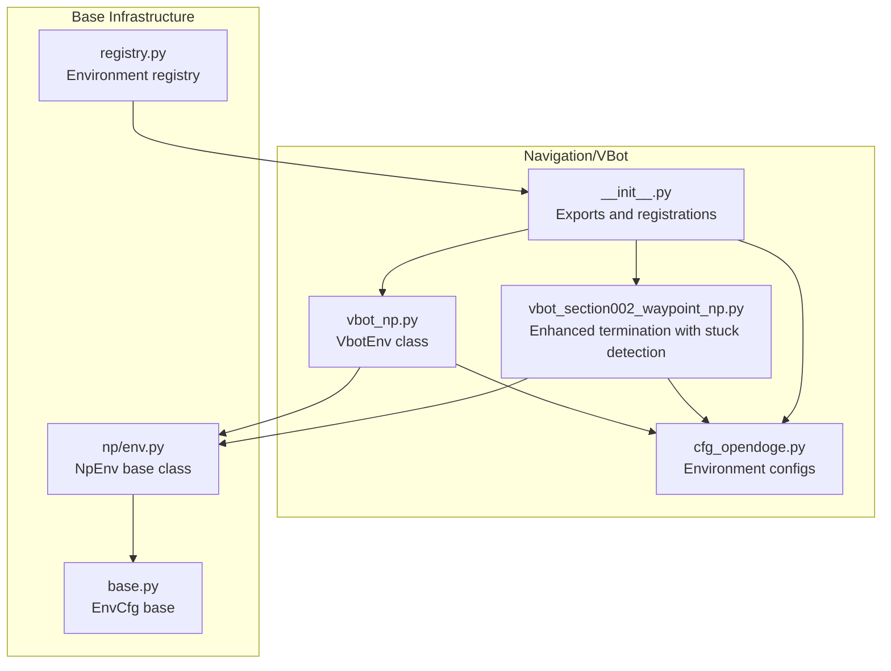
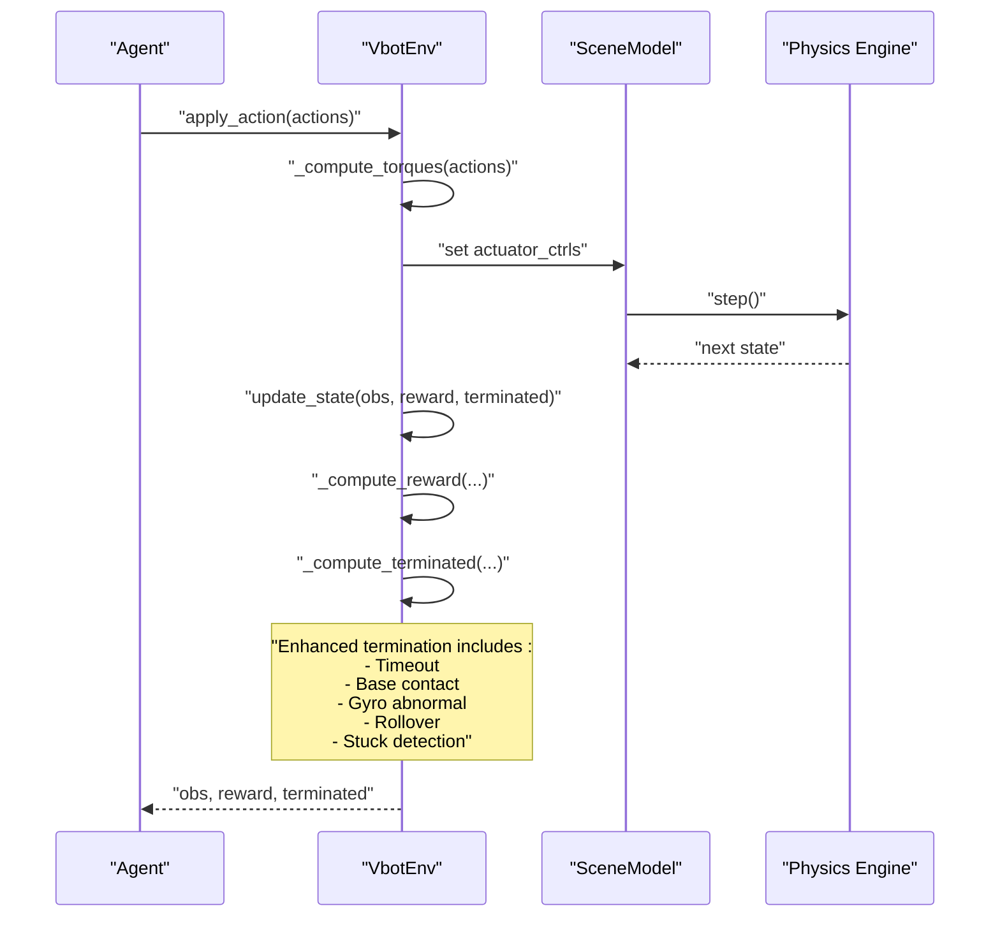
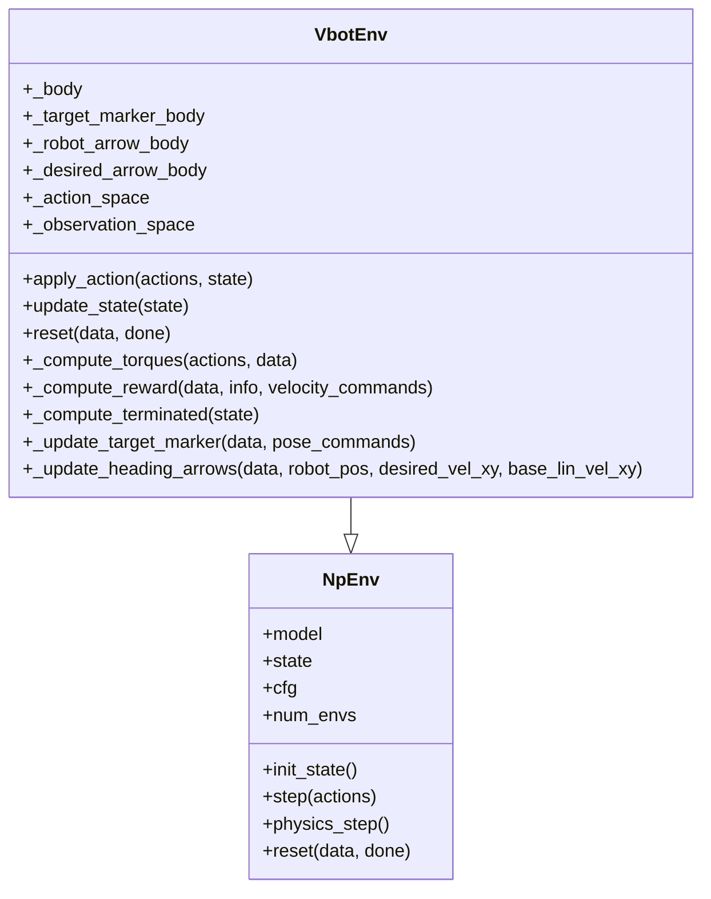
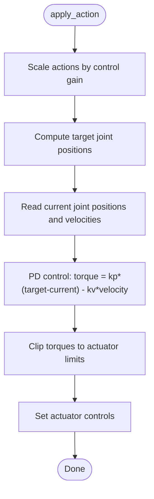
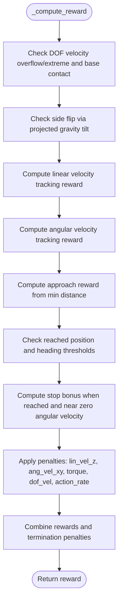
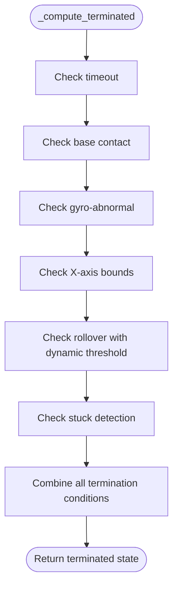
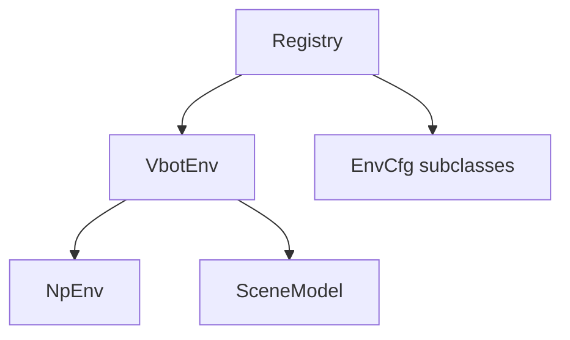

# VBot Base Environment

<cite>
**Referenced Files in This Document**
- [vbot_np.py](file://motrix_envs/src/motrix_envs/navigation/vbot/vbot_np.py)
- [cfg_opendoge.py](file://motrix_envs/src/motrix_envs/navigation/vbot/cfg_opendoge.py)
- [vbot_section002_waypoint_np.py](file://motrix_envs/src/motrix_envs/navigation/vbot/vbot_section002_waypoint_np.py)
- [__init__.py](file://motrix_envs/src/motrix_envs/navigation/vbot/__init__.py)
- [env.py](file://motrix_envs/src/motrix_envs/np/env.py)
- [base.py](file://motrix_envs/src/motrix_envs/base.py)
- [registry.py](file://motrix_envs/src/motrix_envs/registry.py)
</cite>

## Update Summary
**Changes Made**
- Enhanced termination conditions documentation to include the new stuck-termination detection system
- Added comprehensive debugging capabilities documentation for termination condition monitoring
- Updated contact detection mechanisms to include stuck detection alongside existing timeout, contact, gyro-abnormal, and rollover conditions
- Added detailed explanation of the stuck detection algorithm and its parameters

## Table of Contents
1. [Introduction](#introduction)
2. [Project Structure](#project-structure)
3. [Core Components](#core-components)
4. [Architecture Overview](#architecture-overview)
5. [Detailed Component Analysis](#detailed-component-analysis)
6. [Dependency Analysis](#dependency-analysis)
7. [Performance Considerations](#performance-considerations)
8. [Troubleshooting Guide](#troubleshooting-guide)
9. [Conclusion](#conclusion)
10. [Appendices](#appendices)

## Introduction
This document describes the VBot base navigation environment focused on an omnidirectional wheeled robot implementation. It covers the VbotEnv class architecture, the 12-degree-of-freedom actuator system with PD control, the 54-dimensional observation space combining inertial measurement unit (IMU) data, joint states, and navigation commands, and the 12-dimensional action space for wheel motor control. It explains the environment's core functionality including a position-tracking reward system, termination conditions for base contact, side flips, and the newly enhanced stuck-termination detection system, and an arrow visualization system for robot and desired headings. It also documents the configuration system including normalization parameters, sensor definitions, and control settings, details the reward shaping mechanism emphasizing linear velocity tracking, angular velocity control, approach rewards, and stability penalties, and outlines the reset procedure with spawn area randomization and pose command generation. Practical examples of environment initialization, action application, and state observation extraction are included.

## Project Structure
The VBot navigation environment is implemented as part of the MotrixLab S1 project under the navigation package. The primary implementation resides in the VBot module, with configuration classes and environment registration handled centrally.

```mermaid
graph TB
subgraph "Navigation/VBot"
VNP["vbot_np.py<br/>VbotEnv class"]
CFG["cfg_opendoge.py<br/>Environment configs"]
WP["vbot_section002_waypoint_np.py<br/>Enhanced termination with stuck detection"]
INIT["__init__.py<br/>Exports and registrations"]
end
subgraph "Base Infrastructure"
ENVBASE["np/env.py<br/>NpEnv base class"]
BASECFG["base.py<br/>EnvCfg base"]
REG["registry.py<br/>Environment registry"]
end
VNP --> ENVBASE
VNP --> CFG
WP --> ENVBASE
WP --> CFG
INIT --> VNP
INIT --> WP
INIT --> CFG
REG --> INIT
ENVBASE --> BASECFG
```

**Diagram sources**
- [vbot_np.py](file://motrix_envs/src/motrix_envs/navigation/vbot/vbot_np.py#L39-L872)
- [cfg_opendoge.py](file://motrix_envs/src/motrix_envs/navigation/vbot/cfg_opendoge.py#L118-L138)
- [vbot_section002_waypoint_np.py](file://motrix_envs/src/motrix_envs/navigation/vbot/vbot_section002_waypoint_np.py#L1030-L1135)
- [__init__.py](file://motrix_envs/src/motrix_envs/navigation/vbot/__init__.py#L16-L35)
- [env.py](file://motrix_envs/src/motrix_envs/np/env.py#L52-L200)
- [base.py](file://motrix_envs/src/motrix_envs/base.py#L23-L85)
- [registry.py](file://motrix_envs/src/motrix_envs/registry.py#L46-L100)

**Section sources**
- [vbot_np.py](file://motrix_envs/src/motrix_envs/navigation/vbot/vbot_np.py#L39-L872)
- [cfg_opendoge.py](file://motrix_envs/src/motrix_envs/navigation/vbot/cfg_opendoge.py#L118-L138)
- [vbot_section002_waypoint_np.py](file://motrix_envs/src/motrix_envs/navigation/vbot/vbot_section002_waypoint_np.py#L1030-L1135)
- [__init__.py](file://motrix_envs/src/motrix_envs/navigation/vbot/__init__.py#L16-L35)

## Core Components
- VbotEnv: The primary environment class inheriting from NpEnv, implementing the navigation task for the omnidirectional wheeled robot. It defines action and observation spaces, applies PD control to actuators, computes observations, rewards, and termination conditions, and manages visualization arrows.
- Enhanced termination system: Comprehensive termination detection including timeout, base contact, gyro-abnormal readings, rollover detection, and the new stuck-termination detection system that monitors robot movement patterns to detect when the robot becomes trapped or unable to make progress.
- Configuration system: Centralized configuration classes define normalization parameters, control settings, sensors, assets, and reward weights. These are registered via decorators and instantiated by the environment factory.
- Base infrastructure: NpEnv provides the NumPy-based environment lifecycle (step, reset, physics updates), while EnvCfg defines common simulation timing and validation.

Key implementation references:
- VbotEnv class definition and methods: [vbot_np.py](file://motrix_envs/src/motrix_envs/navigation/vbot/vbot_np.py#L39-L872)
- Enhanced termination with stuck detection: [vbot_section002_waypoint_np.py](file://motrix_envs/src/motrix_envs/navigation/vbot/vbot_section002_waypoint_np.py#L1030-L1135)
- Configuration classes and environment registration: [cfg_opendoge.py](file://motrix_envs/src/motrix_envs/navigation/vbot/cfg_opendoge.py#L118-L138), [registry.py](file://motrix_envs/src/motrix_envs/registry.py#L46-L100)
- Base environment lifecycle: [env.py](file://motrix_envs/src/motrix_envs/np/env.py#L52-L200), [base.py](file://motrix_envs/src/motrix_envs/base.py#L23-L85)

**Section sources**
- [vbot_np.py](file://motrix_envs/src/motrix_envs/navigation/vbot/vbot_np.py#L39-L872)
- [vbot_section002_waypoint_np.py](file://motrix_envs/src/motrix_envs/navigation/vbot/vbot_section002_waypoint_np.py#L1030-L1135)
- [cfg_opendoge.py](file://motrix_envs/src/motrix_envs/navigation/vbot/cfg_opendoge.py#L118-L138)
- [env.py](file://motrix_envs/src/motrix_envs/np/env.py#L52-L200)
- [base.py](file://motrix_envs/src/motrix_envs/base.py#L23-L85)
- [registry.py](file://motrix_envs/src/motrix_envs/registry.py#L46-L100)

## Architecture Overview
The VBot environment integrates a physics model with a reinforcement learning loop. The environment initializes the scene model, sets up DOF indices for target markers and visualization arrows, and maintains buffers for normalized commands and default joint angles. Actions are transformed into PD targets and applied as torques to actuators. Observations combine IMU-like sensors, joint states, last actions, and navigation commands. Rewards are computed based on tracking performance, approach progress, stability, and termination conditions. Termination is triggered by base contact with ground, excessive tilt, timeout, gyro-abnormal readings, X-axis bounds, rollover detection, and the new stuck-termination detection system.

```mermaid
sequenceDiagram
participant Agent as "Agent"
participant Env as "VbotEnv"
participant Model as "SceneModel"
participant Sim as "Physics Engine"
Agent->>Env : "apply_action(actions)"
Env->>Env : "_compute_torques(actions)"
Env->>Model : "set actuator_ctrls"
Model->>Sim : "step()"
Sim-->>Model : "next state"
Env->>Env : "update_state(obs, reward, terminated)"
Env->>Env : "_compute_reward(...)"
Env->>Env : "_compute_terminated(...)"
Note over Env : "Enhanced termination includes : <br/>- Timeout<br/>- Base contact<br/>- Gyro abnormal<br/>- Rollover<br/>- Stuck detection"
Env-->>Agent : "obs, reward, terminated"
```

**Diagram sources**
- [vbot_np.py](file://motrix_envs/src/motrix_envs/navigation/vbot/vbot_np.py#L249-L291)
- [vbot_np.py](file://motrix_envs/src/motrix_envs/navigation/vbot/vbot_np.py#L388-L503)
- [vbot_section002_waypoint_np.py](file://motrix_envs/src/motrix_envs/navigation/vbot/vbot_section002_waypoint_np.py#L1030-L1135)
- [env.py](file://motrix_envs/src/motrix_envs/np/env.py#L186-L200)

## Detailed Component Analysis

### VbotEnv Class
VbotEnv inherits from NpEnv and encapsulates the navigation task for the omnidirectional wheeled robot. It defines:
- Action space: 12-dimensional continuous actions in [-1, 1].
- Observation space: 54-dimensional vector composed of normalized IMU data, joint positions/velocities, last actions, normalized commands, position/heading errors, distance to target, reached flag, and stop-ready flag.
- Actuator system: 12 actuators modeled as motors controlled via PD control. The PD controller computes torques from target joint positions derived from actions and current joint states.
- Enhanced termination conditions: Base contact with ground detected via sensors and geometric collision checks; side flip detection via projected gravity tilt; timeout detection based on episode steps; gyro-abnormal detection for sensor anomalies; X-axis bounds checking; rollover detection with dynamic threshold based on forward velocity and pitch angle; and the new stuck-termination detection system that monitors robot movement patterns.
- Visualization: Arrow bodies for robot heading and desired heading are updated via DOF control to visualize motion direction and target orientation.

Key methods and responsibilities:
- Initialization and buffer setup: [vbot_np.py](file://motrix_envs/src/motrix_envs/navigation/vbot/vbot_np.py#L43-L113)
- DOF indexing for target marker and arrows: [vbot_np.py](file://motrix_envs/src/motrix_envs/navigation/vbot/vbot_np.py#L114-L151)
- Contact geometry initialization: [vbot_np.py](file://motrix_envs/src/motrix_envs/navigation/vbot/vbot_np.py#L152-L226)
- Action application and PD control: [vbot_np.py](file://motrix_envs/src/motrix_envs/navigation/vbot/vbot_np.py#L249-L291)
- Observation extraction and arrow updates: [vbot_np.py](file://motrix_envs/src/motrix_envs/navigation/vbot/vbot_np.py#L388-L491)
- Enhanced termination computation: [vbot_np.py](file://motrix_envs/src/motrix_envs/navigation/vbot/vbot_np.py#L505-L527)
- Reward computation: [vbot_np.py](file://motrix_envs/src/motrix_envs/navigation/vbot/vbot_np.py#L528-L685)
- Reset procedure: [vbot_np.py](file://motrix_envs/src/motrix_envs/navigation/vbot/vbot_np.py#L687-L872)

```mermaid
classDiagram
class NpEnv {
+model
+state
+cfg
+num_envs
+init_state()
+step(actions)
+physics_step()
+reset(data, done)
}
class VbotEnv {
+_body
+_target_marker_body
+_robot_arrow_body
+_desired_arrow_body
+_action_space
+_observation_space
+apply_action(actions, state)
+update_state(state)
+reset(data, done)
+_compute_torques(actions, data)
+_compute_reward(data, info, velocity_commands)
+_compute_terminated(state)
+_update_target_marker(data, pose_commands)
+_update_heading_arrows(data, robot_pos, desired_vel_xy, base_lin_vel_xy)
}
VbotEnv --|> NpEnv
```

**Diagram sources**
- [vbot_np.py](file://motrix_envs/src/motrix_envs/navigation/vbot/vbot_np.py#L39-L872)
- [env.py](file://motrix_envs/src/motrix_envs/np/env.py#L52-L200)

**Section sources**
- [vbot_np.py](file://motrix_envs/src/motrix_envs/navigation/vbot/vbot_np.py#L39-L872)
- [env.py](file://motrix_envs/src/motrix_envs/np/env.py#L52-L200)

### Observation Space Composition
The 54-dimensional observation vector is constructed as follows:
- Normalized IMU-like sensors: base linear velocity, gyroscope, and projected gravity.
- Joint states: normalized joint positions and velocities.
- Last actions: previous actions fed into the observation.
- Navigation commands: normalized desired velocity commands (XY) and yaw rate.
- Task-related metrics: position error, heading error, distance to target, reached flag, stop-ready flag.

This composition enables the agent to track position and orientation while accounting for sensor noise and control history.

**Section sources**
- [vbot_np.py](file://motrix_envs/src/motrix_envs/navigation/vbot/vbot_np.py#L468-L485)

### Action Application and PD Control
Actions are mapped to joint targets and PD control is used to compute torques:
- Action scaling: actions are multiplied by a control gain from configuration.
- Target positions: default joint angles plus scaled actions yield target joint positions.
- PD control: torques are computed as proportional minus derivative gains times position and velocity errors, clipped to actuator force limits.

```mermaid
flowchart TD
Start(["apply_action"]) --> Scale["Scale actions by control gain"]
Scale --> Targets["Compute target joint positions"]
Targets --> Current["Read current joint positions and velocities"]
Current --> PD["PD control: torque = kp*(target-current) - kv*velocity"]
PD --> Clip["Clip torques to actuator limits"]
Clip --> SetCtrl["Set actuator controls"]
SetCtrl --> End(["Done"])
```

**Diagram sources**
- [vbot_np.py](file://motrix_envs/src/motrix_envs/navigation/vbot/vbot_np.py#L269-L291)

**Section sources**
- [vbot_np.py](file://motrix_envs/src/motrix_envs/navigation/vbot/vbot_np.py#L249-L291)

### Reward Shaping Mechanism
Rewards balance tracking performance, approach progress, stability, and termination penalties:
- Tracking rewards: exponential decays of squared linear and angular velocity errors.
- Approach reward: difference in minimal distance to target over time.
- Stability and penalties: vertical acceleration, XY angular velocity, torque, joint velocity, and action rate penalties; side flip and base contact termination penalties.
- Reached-and-stop bonus: small bonus when reaching the target and stopping with low angular velocity.

```mermaid
flowchart TD
Start(["_compute_reward"]) --> Terminate["Check DOF velocity overflow/extreme and base contact"]
Terminate --> SideFlip["Check side flip via projected gravity tilt"]
SideFlip --> LinVel["Compute linear velocity tracking reward"]
LinVel --> AngVel["Compute angular velocity tracking reward"]
AngVel --> Approach["Compute approach reward from min distance"]
Approach --> Reached["Check reached position and heading thresholds"]
Reached --> StopBonus["Compute stop bonus when reached and near zero angular velocity"]
StopBonus --> Penalize["Apply penalties: lin_vel_z, ang_vel_xy, torque, dof_vel, action_rate"]
Penalize --> Combine["Combine rewards and termination penalties"]
Combine --> End(["Return reward"])
```

**Diagram sources**
- [vbot_np.py](file://motrix_envs/src/motrix_envs/navigation/vbot/vbot_np.py#L528-L685)

**Section sources**
- [vbot_np.py](file://motrix_envs/src/motrix_envs/navigation/vbot/vbot_np.py#L528-L685)

### Enhanced Termination Conditions
The termination system now includes comprehensive detection mechanisms:

#### Traditional Termination Conditions
- Base contact with ground: detected via a dedicated sensor and geometric collision pairs.
- Side flip: detected when the tilt angle from projected gravity exceeds a threshold.
- DOF velocity overflow or extreme values: prevents numerical instabilities.
- Timeout: episode steps exceeding maximum configured steps.
- Gyro-abnormal: sensor readings exceeding abnormal thresholds.
- X-axis bounds: robot moving outside designated horizontal boundaries.
- Rollover detection: dynamic threshold based on forward velocity and pitch angle.

#### New Stuck-Termination Detection System
**Updated** Added comprehensive stuck-termination detection system that monitors robot movement patterns to detect when the robot becomes trapped or unable to make progress.

The stuck detection system operates through the following components:

- **Stuck Detection Parameters**: 
  - Position threshold: 0.15 meters for 480-step window
  - Rotation threshold: 15 degrees for 480-step window
  - Termination threshold: 240 consecutive steps (4 seconds)

- **Detection Algorithm**: Uses a sliding window approach with circular buffering to monitor robot position and orientation changes over time.

- **State Management**: Tracks stuck status, consecutive detection counts, and maintains history buffers for position and yaw angles.

- **Integration**: Automatically adds stuck termination to the combined termination condition.

```mermaid
flowchart TD
Start(["_compute_terminated"]) --> Timeout["Check timeout"]
Timeout --> Contact["Check base contact"]
Contact --> Gyro["Check gyro-abnormal"]
Gyro --> Bounds["Check X-axis bounds"]
Bounds --> Rollover["Check rollover with dynamic threshold"]
Rollover --> Stuck["Check stuck detection"]
Stuck --> Combine["Combine all termination conditions"]
Combine --> End(["Return terminated state"])
```

**Diagram sources**
- [vbot_section002_waypoint_np.py](file://motrix_envs/src/motrix_envs/navigation/vbot/vbot_section002_waypoint_np.py#L1030-L1135)

**Section sources**
- [vbot_np.py](file://motrix_envs/src/motrix_envs/navigation/vbot/vbot_np.py#L505-L527)
- [vbot_np.py](file://motrix_envs/src/motrix_envs/navigation/vbot/vbot_np.py#L550-L559)
- [vbot_section002_waypoint_np.py](file://motrix_envs/src/motrix_envs/navigation/vbot/vbot_section002_waypoint_np.py#L1030-L1135)
- [vbot_section002_waypoint_np.py](file://motrix_envs/src/motrix_envs/navigation/vbot/vbot_section002_waypoint_np.py#L1119-L1121)

### Arrow Visualization System
The environment updates two visualization arrows:
- Robot heading arrow: aligned with the robot's XY linear velocity direction.
- Desired heading arrow: aligned with the desired XY velocity direction.

Arrows are positioned at the robot's height plus a fixed offset and updated via DOF control of free-joint bodies.

**Section sources**
- [vbot_np.py](file://motrix_envs/src/motrix_envs/navigation/vbot/vbot_np.py#L322-L371)

### Reset Procedure
Reset randomizes the robot's initial position within a small spawn area around a center point, sets base orientation to a unit quaternion, and generates pose commands (target position and yaw) within configured ranges. It normalizes quaternions for base and arrow bodies and initializes internal buffers.

**Section sources**
- [vbot_np.py](file://motrix_envs/src/motrix_envs/navigation/vbot/vbot_np.py#L687-L872)

## Dependency Analysis
The VBot environment depends on:
- NpEnv for environment lifecycle and physics stepping.
- Scene model for kinematics and sensors.
- Registry for environment configuration and instantiation.
- Configuration classes for normalization, control, sensors, assets, and reward weights.

```mermaid
graph TB
VbotEnv["VbotEnv"]
NpEnv["NpEnv"]
SceneModel["SceneModel"]
Registry["Registry"]
Cfg["EnvCfg subclasses"]
VbotEnv --> NpEnv
VbotEnv --> SceneModel
Registry --> VbotEnv
Registry --> Cfg
```

**Diagram sources**
- [vbot_np.py](file://motrix_envs/src/motrix_envs/navigation/vbot/vbot_np.py#L39-L872)
- [env.py](file://motrix_envs/src/motrix_envs/np/env.py#L52-L200)
- [registry.py](file://motrix_envs/src/motrix_envs/registry.py#L114-L161)
- [cfg_opendoge.py](file://motrix_envs/src/motrix_envs/navigation/vbot/cfg_opendoge.py#L118-L138)

**Section sources**
- [vbot_np.py](file://motrix_envs/src/motrix_envs/navigation/vbot/vbot_np.py#L39-L872)
- [env.py](file://motrix_envs/src/motrix_envs/np/env.py#L52-L200)
- [registry.py](file://motrix_envs/src/motrix_envs/registry.py#L114-L161)
- [cfg_opendoge.py](file://motrix_envs/src/motrix_envs/navigation/vbot/cfg_opendoge.py#L118-L138)

## Performance Considerations
- Action filtering: Exponential smoothing of actions reduces jitter and improves control stability.
- Observation normalization: Normalization constants for linear velocity, angular velocity, joint positions, and joint velocities improve training stability.
- Reward shaping: Balancing tracking rewards against penalties prevents overfitting to trivial solutions.
- Enhanced termination safety: Comprehensive termination conditions including stuck detection prevent numerical instabilities and improve training robustness.
- Stuck detection efficiency: Circular buffer implementation minimizes computational overhead while maintaining accurate detection.

## Troubleshooting Guide
Common issues and remedies:
- NaN or inf joint velocities: The environment detects and penalizes extreme DOF velocities to prevent instability.
- Base contact false positives: Verify sensor names and collision pairs in asset configuration.
- Side flip detection sensitivity: Adjust tilt threshold and ensure correct gravity projection.
- Arrow visualization not updating: Confirm arrow DOF indices and that arrow bodies exist in the model.
- Stuck detection false positives: Adjust stuck detection thresholds (position threshold, rotation threshold, termination threshold) based on terrain complexity.
- Termination condition debugging: Monitor termination statistics to identify which termination condition is triggering frequently.

**Section sources**
- [vbot_np.py](file://motrix_envs/src/motrix_envs/navigation/vbot/vbot_np.py#L536-L542)
- [vbot_np.py](file://motrix_envs/src/motrix_envs/navigation/vbot/vbot_np.py#L550-L559)
- [vbot_np.py](file://motrix_envs/src/motrix_envs/navigation/vbot/vbot_np.py#L322-L371)
- [vbot_section002_waypoint_np.py](file://motrix_envs/src/motrix_envs/navigation/vbot/vbot_section002_waypoint_np.py#L1124-L1133)

## Conclusion
The VBot base navigation environment provides a robust, configurable platform for training omnidirectional wheeled robots. Its 12-degree-of-freedom actuator system with PD control, rich 54-dimensional observation space, and carefully designed reward shaping enable stable and efficient learning. The enhanced termination system now includes comprehensive detection mechanisms including the new stuck-termination detection system, improving safety and interpretability. The modular configuration system and environment registry facilitate easy extension and deployment across different terrains and tasks.

## Appendices

### Configuration System Overview
- NoiseConfig: Sensor noise scaling factors for joint angles, velocities, gyroscopes, gravity, and linear velocity.
- ControlConfig: Action scaling factor for mapping actions to joint targets.
- InitState: Initial robot position and default joint angles.
- Commands: Pose command ranges for target positions and yaw.
- Normalization: Scaling factors for observation normalization.
- Asset: Body names, foot names, termination contact geometries, ground subtree prefix, and goal name.
- Sensor: Names for base linear velocity, base gyroscope, and feet contact sensors.
- RewardConfig: Weighted components for position tracking, fine position tracking, heading tracking, forward velocity, orientation, linear velocity in Z, XY angular velocity, torques, DOF velocity, DOF acceleration, action rate, and termination penalty.

**Section sources**
- [cfg_opendoge.py](file://motrix_envs/src/motrix_envs/navigation/vbot/cfg_opendoge.py#L24-L138)

### Enhanced Termination System Details
**Updated** The stuck-termination detection system provides comprehensive monitoring of robot movement patterns:

- **Detection Window**: 480 steps (8 seconds at 60Hz) sliding window for position and orientation analysis
- **Position Threshold**: 0.15 meters maximum displacement within detection window
- **Rotation Threshold**: 15 degrees maximum orientation change within detection window  
- **Termination Threshold**: 240 consecutive steps (4 seconds) of stuck detection triggers termination
- **Circular Buffer**: Efficient ring buffer implementation for historical position and yaw tracking
- **Consecutive Counting**: Tracks continuous stuck detections to prevent false positives
- **State Management**: Maintains detection flags, counters, and history buffers for each environment

**Section sources**
- [vbot_section002_waypoint_np.py](file://motrix_envs/src/motrix_envs/navigation/vbot/vbot_section002_waypoint_np.py#L103-L184)

### Environment Registration and Instantiation
- Environment configurations are decorated and registered with the registry.
- Environments are instantiated by name with optional configuration overrides and backend selection.

**Section sources**
- [cfg_opendoge.py](file://motrix_envs/src/motrix_envs/navigation/vbot/cfg_opendoge.py#L118-L138)
- [registry.py](file://motrix_envs/src/motrix_envs/registry.py#L46-L100)
- [registry.py](file://motrix_envs/src/motrix_envs/registry.py#L114-L161)

### Practical Usage Examples
- Environment initialization: Instantiate VbotEnv with a configuration class and number of environments.
- Action application: Call apply_action with a batched action array; the environment applies PD control and updates the simulation.
- State observation extraction: After step, access obs from the environment state; the observation includes normalized IMU data, joint states, last actions, and navigation commands.
- Termination monitoring: Use the enhanced termination system to debug training issues and optimize hyperparameters.

**Section sources**
- [env.py](file://motrix_envs/src/motrix_envs/np/env.py#L196-L200)
- [vbot_np.py](file://motrix_envs/src/motrix_envs/navigation/vbot/vbot_np.py#L249-L291)
- [vbot_np.py](file://motrix_envs/src/motrix_envs/navigation/vbot/vbot_np.py#L468-L485)
- [vbot_section002_waypoint_np.py](file://motrix_envs/src/motrix_envs/navigation/vbot/vbot_section002_waypoint_np.py#L1124-L1133)