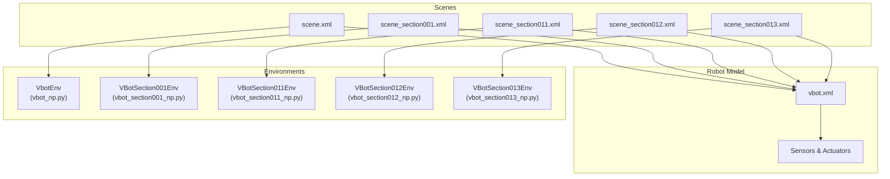
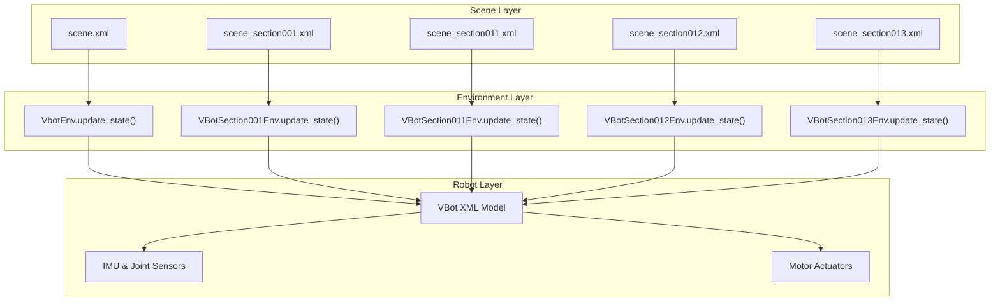
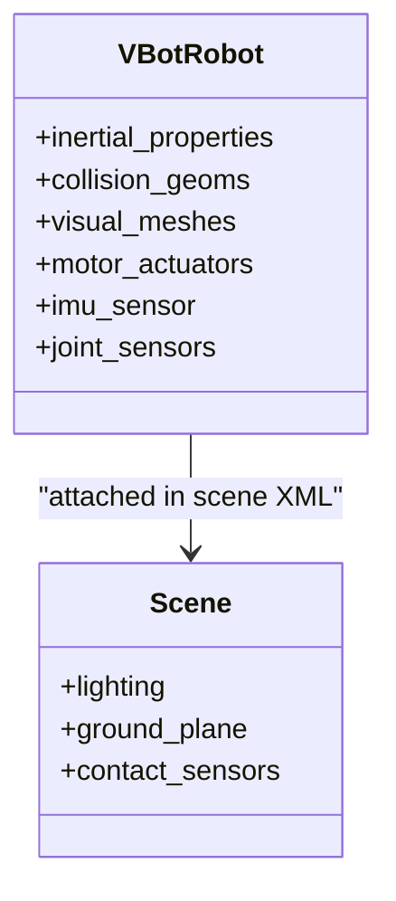
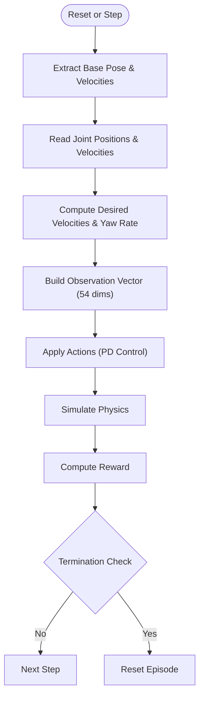
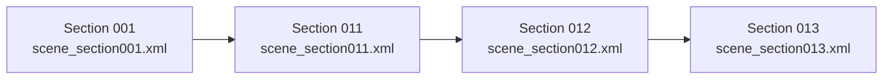
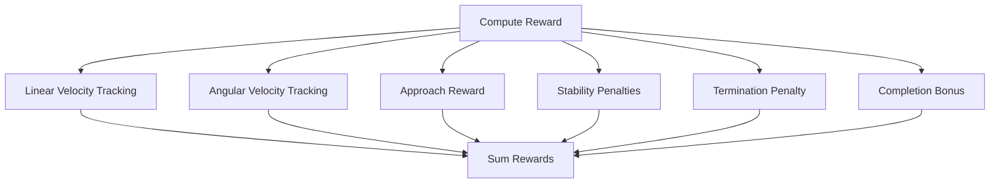
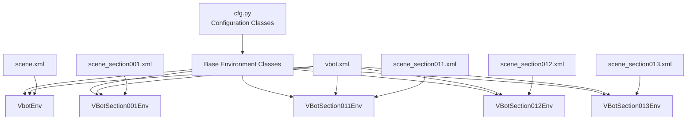

# VBot Navigation

<cite>
**Referenced Files in This Document**
- [__init__.py](file://motrix_envs/src/motrix_envs/navigation/vbot/__init__.py)
- [cfg.py](file://motrix_envs/src/motrix_envs/navigation/vbot/cfg.py)
- [vbot_np.py](file://motrix_envs/src/motrix_envs/navigation/vbot/vbot_np.py)
- [vbot_section001_np.py](file://motrix_envs/src/motrix_envs/navigation/vbot/vbot_section001_np.py)
- [vbot_section011_np.py](file://motrix_envs/src/motrix_envs/navigation/vbot/vbot_section011_np.py)
- [vbot_section012_np.py](file://motrix_envs/src/motrix_envs/navigation/vbot/vbot_section012_np.py)
- [vbot_section013_np.py](file://motrix_envs/src/motrix_envs/navigation/vbot/vbot_section013_np.py)
- [vbot.xml](file://motrix_envs/src/motrix_envs/navigation/vbot/xmls/vbot.xml)
- [scene.xml](file://motrix_envs/src/motrix_envs/navigation/vbot/xmls/scene.xml)
- [scene_section001.xml](file://motrix_envs/src/motrix_envs/navigation/vbot/xmls/scene_section001.xml)
- [scene_section011.xml](file://motrix_envs/src/motrix_envs/navigation/vbot/xmls/scene_section011.xml)
- [scene_section012.xml](file://motrix_envs/src/motrix_envs/navigation/vbot/xmls/scene_section012.xml)
- [scene_section013.xml](file://motrix_envs/src/motrix_envs/navigation/vbot/xmls/scene_section013.xml)
</cite>

## Table of Contents
1. [Introduction](#introduction)
2. [Project Structure](#project-structure)
3. [Core Components](#core-components)
4. [Architecture Overview](#architecture-overview)
5. [Detailed Component Analysis](#detailed-component-analysis)
6. [Dependency Analysis](#dependency-analysis)
7. [Performance Considerations](#performance-considerations)
8. [Troubleshooting Guide](#troubleshooting-guide)
9. [Conclusion](#conclusion)

## Introduction
This document describes the VBot navigation environments designed for wheeled robot navigation across multiple track sections. It covers the VBot robot implementation with omnidirectional movement capabilities, the modular track system comprising four distinct sections (001, 011, 012, 013), and the environment architecture supporting multi-section navigation scenarios. The documentation explains the configuration system for different track layouts, obstacle placement, and navigation objectives; details the observation space design incorporating wheel odometry, IMU data, and section-specific navigation cues; documents the reward shaping for track navigation including section completion bonuses, obstacle avoidance penalties, and path efficiency rewards; and outlines the training methodology for multi-section navigation, including curriculum learning approaches and transfer learning between different track configurations.

## Project Structure
The VBot navigation module is organized around a shared robot model and per-section scene configurations. The core structure includes:
- Robot model definition and sensors in the VBot XML
- Environment classes for flat navigation and individual track sections
- Configuration classes defining simulation parameters, noise, controls, commands, normalization, assets, sensors, and rewards
- Scene XMLs that attach section-specific visual and collision models

**Diagram sources**
- [vbot.xml](file://motrix_envs/src/motrix_envs/navigation/vbot/xmls/vbot.xml#L1-L822)
- [scene.xml](file://motrix_envs/src/motrix_envs/navigation/vbot/xmls/scene.xml#L1-L39)
- [scene_section001.xml](file://motrix_envs/src/motrix_envs/navigation/vbot/xmls/scene_section001.xml#L1-L46)
- [scene_section011.xml](file://motrix_envs/src/motrix_envs/navigation/vbot/xmls/scene_section011.xml#L1-L45)
- [scene_section012.xml](file://motrix_envs/src/motrix_envs/navigation/vbot/xmls/scene_section012.xml#L1-L45)
- [scene_section013.xml](file://motrix_envs/src/motrix_envs/navigation/vbot/xmls/scene_section013.xml#L1-L45)
- [vbot_np.py](file://motrix_envs/src/motrix_envs/navigation/vbot/vbot_np.py#L39-L800)
- [vbot_section001_np.py](file://motrix_envs/src/motrix_envs/navigation/vbot/vbot_section001_np.py#L40-L800)
- [vbot_section011_np.py](file://motrix_envs/src/motrix_envs/navigation/vbot/vbot_section011_np.py#L40-L679)
- [vbot_section012_np.py](file://motrix_envs/src/motrix_envs/navigation/vbot/vbot_section012_np.py#L40-L679)
- [vbot_section013_np.py](file://motrix_envs/src/motrix_envs/navigation/vbot/vbot_section013_np.py#L40-L679)

**Section sources**
- [__init__.py](file://motrix_envs/src/motrix_envs/navigation/vbot/__init__.py#L17-L31)
- [vbot.xml](file://motrix_envs/src/motrix_envs/navigation/vbot/xmls/vbot.xml#L1-L822)
- [scene.xml](file://motrix_envs/src/motrix_envs/navigation/vbot/xmls/scene.xml#L1-L39)
- [scene_section001.xml](file://motrix_envs/src/motrix_envs/navigation/vbot/xmls/scene_section001.xml#L1-L46)
- [scene_section011.xml](file://motrix_envs/src/motrix_envs/navigation/vbot/xmls/scene_section011.xml#L1-L45)
- [scene_section012.xml](file://motrix_envs/src/motrix_envs/navigation/vbot/xmls/scene_section012.xml#L1-L45)
- [scene_section013.xml](file://motrix_envs/src/motrix_envs/navigation/vbot/xmls/scene_section013.xml#L1-L45)

## Core Components
- VBot robot model: Defined in vbot.xml with articulated legs, collision geometry, visual assets, actuators, and sensors. The robot uses motorized joints with force limits and PD control via actuator targets.
- Environment classes: Implement navigation tasks across flat and sectioned terrains. They define action spaces, observation spaces, reward computation, termination conditions, and state updates.
- Configuration system: Centralized in cfg.py with dataclasses for noise, control, initialization, commands, normalization, assets, sensors, and reward scales. Each environment registers its own configuration class.
- Scene configurations: Each section uses a dedicated scene XML that attaches section-specific visual and collision models while reusing the VBot robot definition.

Key implementation highlights:
- Action space: 12-dimensional control for leg joints
- Observation space: 54-dimensional vector combining IMU, joint states, last actions, commands, and navigation cues
- Reward shaping: Position tracking, fine position tracking, heading tracking, forward velocity bonus, stability penalties, termination penalties, and approach rewards
- Termination: Base contact sensors, DOF velocity limits, side flip detection

**Section sources**
- [vbot.xml](file://motrix_envs/src/motrix_envs/navigation/vbot/xmls/vbot.xml#L1-L822)
- [vbot_np.py](file://motrix_envs/src/motrix_envs/navigation/vbot/vbot_np.py#L40-L800)
- [vbot_section001_np.py](file://motrix_envs/src/motrix_envs/navigation/vbot/vbot_section001_np.py#L41-L800)
- [vbot_section011_np.py](file://motrix_envs/src/motrix_envs/navigation/vbot/vbot_section011_np.py#L41-L679)
- [vbot_section012_np.py](file://motrix_envs/src/motrix_envs/navigation/vbot/vbot_section012_np.py#L41-L679)
- [vbot_section013_np.py](file://motrix_envs/src/motrix_envs/navigation/vbot/vbot_section013_np.py#L41-L679)
- [cfg.py](file://motrix_envs/src/motrix_envs/navigation/vbot/cfg.py#L24-L138)

## Architecture Overview
The VBot navigation architecture integrates a reusable robot model with modular track scenes. Environments inherit common logic for state extraction, action application, reward computation, and termination checks, while each section configures terrain geometry and goals.

**Diagram sources**
- [vbot_np.py](file://motrix_envs/src/motrix_envs/navigation/vbot/vbot_np.py#L388-L503)
- [vbot_section001_np.py](file://motrix_envs/src/motrix_envs/navigation/vbot/vbot_section001_np.py#L423-L538)
- [vbot_section011_np.py](file://motrix_envs/src/motrix_envs/navigation/vbot/vbot_section011_np.py#L343-L458)
- [vbot_section012_np.py](file://motrix_envs/src/motrix_envs/navigation/vbot/vbot_section012_np.py#L343-L458)
- [vbot_section013_np.py](file://motrix_envs/src/motrix_envs/navigation/vbot/vbot_section013_np.py#L343-L458)
- [vbot.xml](file://motrix_envs/src/motrix_envs/navigation/vbot/xmls/vbot.xml#L110-L692)
- [scene.xml](file://motrix_envs/src/motrix_envs/navigation/vbot/xmls/scene.xml#L19-L38)
- [scene_section001.xml](file://motrix_envs/src/motrix_envs/navigation/vbot/xmls/scene_section001.xml#L27-L44)
- [scene_section011.xml](file://motrix_envs/src/motrix_envs/navigation/vbot/xmls/scene_section011.xml#L27-L44)
- [scene_section012.xml](file://motrix_envs/src/motrix_envs/navigation/vbot/xmls/scene_section012.xml#L28-L44)
- [scene_section013.xml](file://motrix_envs/src/motrix_envs/navigation/vbot/xmls/scene_section013.xml#L28-L44)

## Detailed Component Analysis

### VBot Robot Implementation
The VBot robot is defined in vbot.xml with:
- Articulated legs (hip, thigh, calf) for omnidirectional movement
- Collision geometry for base and feet
- Visual assets and materials
- Motorized actuators with force limits
- Sensors for IMU and joint positions/velocities

**Diagram sources**
- [vbot.xml](file://motrix_envs/src/motrix_envs/navigation/vbot/xmls/vbot.xml#L110-L692)
- [scene.xml](file://motrix_envs/src/motrix_envs/navigation/vbot/xmls/scene.xml#L19-L38)

**Section sources**
- [vbot.xml](file://motrix_envs/src/motrix_envs/navigation/vbot/xmls/vbot.xml#L1-L822)
- [scene.xml](file://motrix_envs/src/motrix_envs/navigation/vbot/xmls/scene.xml#L1-L39)

### Environment Classes and Observation Space
Each environment class implements:
- Action application with PD control and torque limiting
- State extraction for base pose, velocities, and joint states
- Observation construction combining IMU, joint states, last actions, and navigation cues
- Reward computation with position tracking, approach rewards, stability penalties, and termination penalties
- Termination detection via contact sensors and geometric checks

Observation space composition (54 dimensions):
- IMU linear acceleration and angular velocity
- Projected gravity vector
- Joint positions and velocities
- Last actions
- Command velocities and heading
- Position error, heading error, distance to target
- Reached flag and stop-ready flag

**Diagram sources**
- [vbot_np.py](file://motrix_envs/src/motrix_envs/navigation/vbot/vbot_np.py#L388-L503)
- [vbot_section001_np.py](file://motrix_envs/src/motrix_envs/navigation/vbot/vbot_section001_np.py#L423-L538)

**Section sources**
- [vbot_np.py](file://motrix_envs/src/motrix_envs/navigation/vbot/vbot_np.py#L40-L800)
- [vbot_section001_np.py](file://motrix_envs/src/motrix_envs/navigation/vbot/vbot_section001_np.py#L41-L800)

### Track Sections and Transition Challenges
The modular track system comprises four sections:
- Section 001: Flat terrain with goal marker
- Section 011: Flat terrain variant with different visual/collision models
- Section 012: Intermediate terrain with specific obstacles and geometry
- Section 013: Terminal terrain with distinct layout

Each section scene attaches section-specific visual and collision models while sharing the VBot robot definition. Transitions between sections require careful handling of goal positioning and terrain geometry.

**Diagram sources**
- [scene_section001.xml](file://motrix_envs/src/motrix_envs/navigation/vbot/xmls/scene_section001.xml#L27-L44)
- [scene_section011.xml](file://motrix_envs/src/motrix_envs/navigation/vbot/xmls/scene_section011.xml#L27-L44)
- [scene_section012.xml](file://motrix_envs/src/motrix_envs/navigation/vbot/xmls/scene_section012.xml#L28-L44)
- [scene_section013.xml](file://motrix_envs/src/motrix_envs/navigation/vbot/xmls/scene_section013.xml#L28-L44)

**Section sources**
- [scene_section001.xml](file://motrix_envs/src/motrix_envs/navigation/vbot/xmls/scene_section001.xml#L1-L46)
- [scene_section011.xml](file://motrix_envs/src/motrix_envs/navigation/vbot/xmls/scene_section011.xml#L1-L45)
- [scene_section012.xml](file://motrix_envs/src/motrix_envs/navigation/vbot/xmls/scene_section012.xml#L1-L45)
- [scene_section013.xml](file://motrix_envs/src/motrix_envs/navigation/vbot/xmls/scene_section013.xml#L1-L45)

### Reward Shaping for Navigation
Rewards are composed of:
- Position tracking and fine position tracking bonuses
- Heading tracking component
- Forward velocity bonus encouraging motion toward the target
- Stability penalties for orientation deviation, vertical velocity, angular velocity, torques, joint velocities, and action rate
- Termination penalty for unsafe states
- Approach reward based on progress toward the target
- Completion bonus upon reaching the target and stopping with minimal angular velocity

**Diagram sources**
- [vbot_np.py](file://motrix_envs/src/motrix_envs/navigation/vbot/vbot_np.py#L528-L685)
- [vbot_section001_np.py](file://motrix_envs/src/motrix_envs/navigation/vbot/vbot_section001_np.py#L592-L780)

**Section sources**
- [vbot_np.py](file://motrix_envs/src/motrix_envs/navigation/vbot/vbot_np.py#L528-L685)
- [vbot_section001_np.py](file://motrix_envs/src/motrix_envs/navigation/vbot/vbot_section001_np.py#L592-L780)

### Training Methodology and Curriculum Learning
Training methodology:
- Flat navigation environment (VbotEnv) establishes baseline navigation skills
- Section-specific environments (001, 011, 012, 013) introduce increasing complexity
- Curriculum learning progression:
  - Start with 001/011 (flat sections) to learn basic navigation
  - Progress to 012 (intermediate terrain) to handle complexity
  - End with 013 (terminal terrain) for final challenge
- Transfer learning:
  - Pre-train on simpler sections before training on harder ones
  - Use learned policies as initialization for subsequent sections
  - Share configuration parameters (noise, normalization, control scaling) across sections

**Section sources**
- [cfg.py](file://motrix_envs/src/motrix_envs/navigation/vbot/cfg.py#L357-L619)
- [vbot_section001_np.py](file://motrix_envs/src/motrix_envs/navigation/vbot/vbot_section001_np.py#L494-L678)
- [vbot_section011_np.py](file://motrix_envs/src/motrix_envs/navigation/vbot/vbot_section011_np.py#L494-L678)
- [vbot_section012_np.py](file://motrix_envs/src/motrix_envs/navigation/vbot/vbot_section012_np.py#L494-L678)
- [vbot_section013_np.py](file://motrix_envs/src/motrix_envs/navigation/vbot/vbot_section013_np.py#L494-L678)

## Dependency Analysis
The environment classes depend on the VBot robot model and scene configurations. Each environment registers its configuration class and inherits common functionality from the base environment class.

**Diagram sources**
- [cfg.py](file://motrix_envs/src/motrix_envs/navigation/vbot/cfg.py#L118-L619)
- [vbot_np.py](file://motrix_envs/src/motrix_envs/navigation/vbot/vbot_np.py#L39-L800)
- [vbot_section001_np.py](file://motrix_envs/src/motrix_envs/navigation/vbot/vbot_section001_np.py#L40-L800)
- [vbot_section011_np.py](file://motrix_envs/src/motrix_envs/navigation/vbot/vbot_section011_np.py#L40-L679)
- [vbot_section012_np.py](file://motrix_envs/src/motrix_envs/navigation/vbot/vbot_section012_np.py#L40-L679)
- [vbot_section013_np.py](file://motrix_envs/src/motrix_envs/navigation/vbot/vbot_section013_np.py#L40-L679)
- [vbot.xml](file://motrix_envs/src/motrix_envs/navigation/vbot/xmls/vbot.xml#L1-L822)
- [scene.xml](file://motrix_envs/src/motrix_envs/navigation/vbot/xmls/scene.xml#L1-L39)
- [scene_section001.xml](file://motrix_envs/src/motrix_envs/navigation/vbot/xmls/scene_section001.xml#L1-L46)
- [scene_section011.xml](file://motrix_envs/src/motrix_envs/navigation/vbot/xmls/scene_section011.xml#L1-L45)
- [scene_section012.xml](file://motrix_envs/src/motrix_envs/navigation/vbot/xmls/scene_section012.xml#L1-L45)
- [scene_section013.xml](file://motrix_envs/src/motrix_envs/navigation/vbot/xmls/scene_section013.xml#L1-L45)

**Section sources**
- [__init__.py](file://motrix_envs/src/motrix_envs/navigation/vbot/__init__.py#L17-L31)
- [cfg.py](file://motrix_envs/src/motrix_envs/navigation/vbot/cfg.py#L118-L619)

## Performance Considerations
- Simulation step size and control frequency: The environments specify sim_dt and ctrl_dt to balance fidelity and speed.
- Action filtering: A simple exponential filter smooths actions to reduce jitter.
- Torque limiting: PD control applies torque limits matching motor force ranges.
- Observation normalization: Normalization factors stabilize learning across different scales.
- Termination safety: DOF velocity thresholds and side-flip detection prevent unstable episodes.

[No sources needed since this section provides general guidance]

## Troubleshooting Guide
Common issues and resolutions:
- Contact sensor availability: Some environments rely on base contact sensors; missing sensors can cause termination logic to fail silently. Verify sensor names and availability in the scene XML.
- Numerical stability: Observations and rewards include clipping and exponential terms; NaN handling is implemented to maintain training stability.
- Termination detection: Termination contact pairs are constructed from base and ground geometries; ensure geometry names match between model and environment configuration.
- Observation dimensionality: Ensure observation concatenation matches the declared 54-dimension space.

**Section sources**
- [vbot_np.py](file://motrix_envs/src/motrix_envs/navigation/vbot/vbot_np.py#L505-L526)
- [vbot_section001_np.py](file://motrix_envs/src/motrix_envs/navigation/vbot/vbot_section001_np.py#L540-L590)
- [scene.xml](file://motrix_envs/src/motrix_envs/navigation/vbot/xmls/scene.xml#L24-L37)

## Conclusion
The VBot navigation environments provide a robust framework for training wheeled robots across multiple track sections. The modular design enables curriculum learning and transfer between sections, while the configuration system offers flexibility for noise, control, and reward shaping. The observation space and reward design emphasize navigation accuracy, stability, and efficient path completion, enabling effective policy learning across diverse terrains.