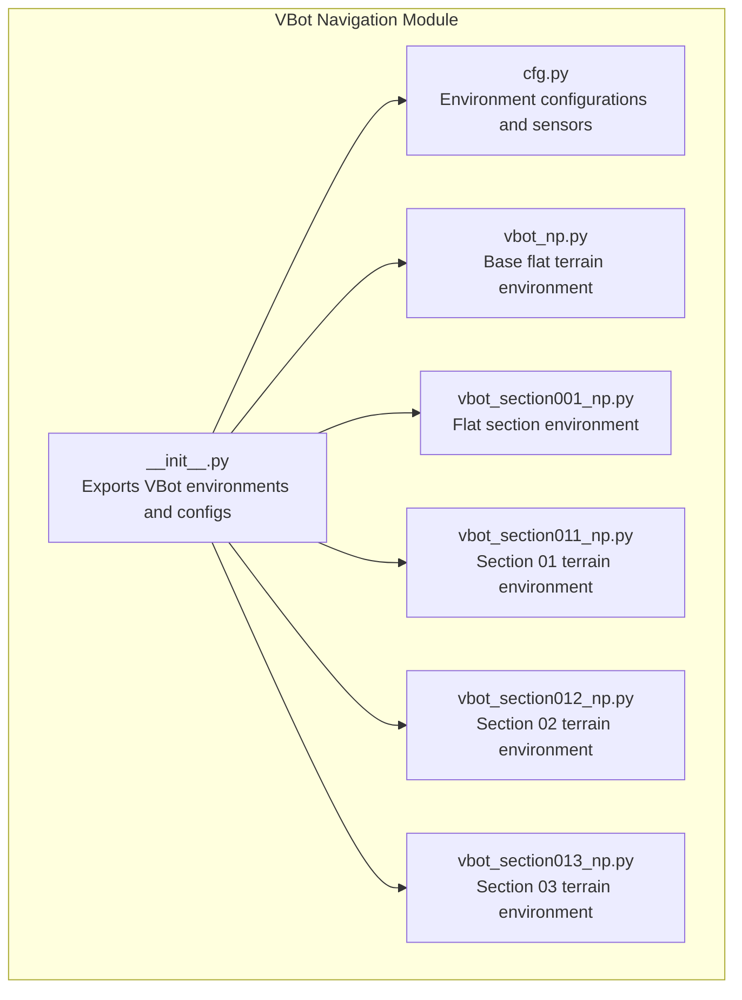
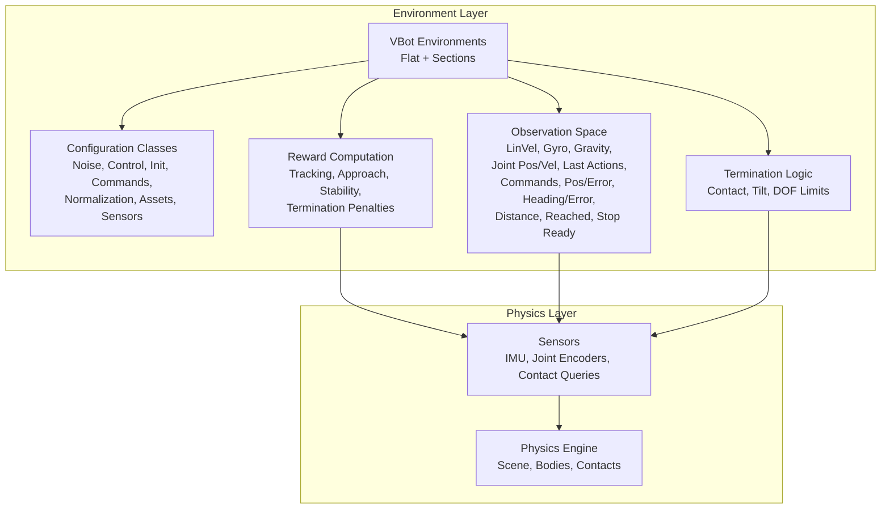
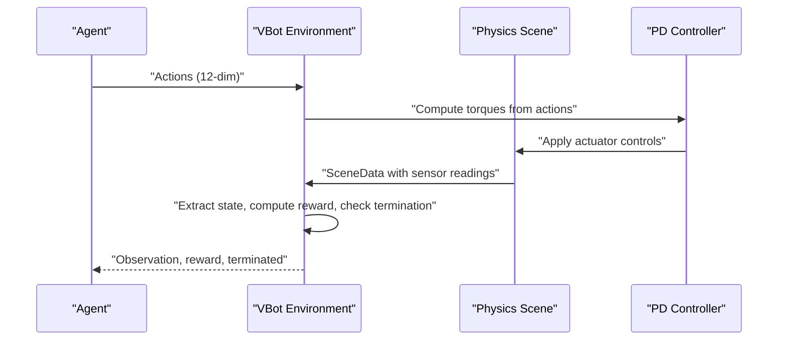
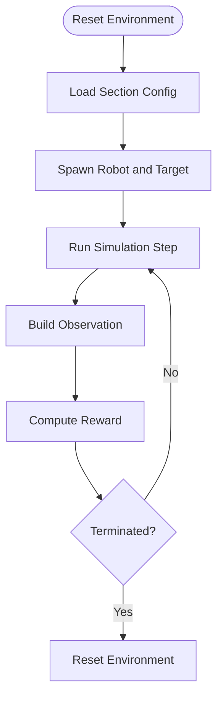
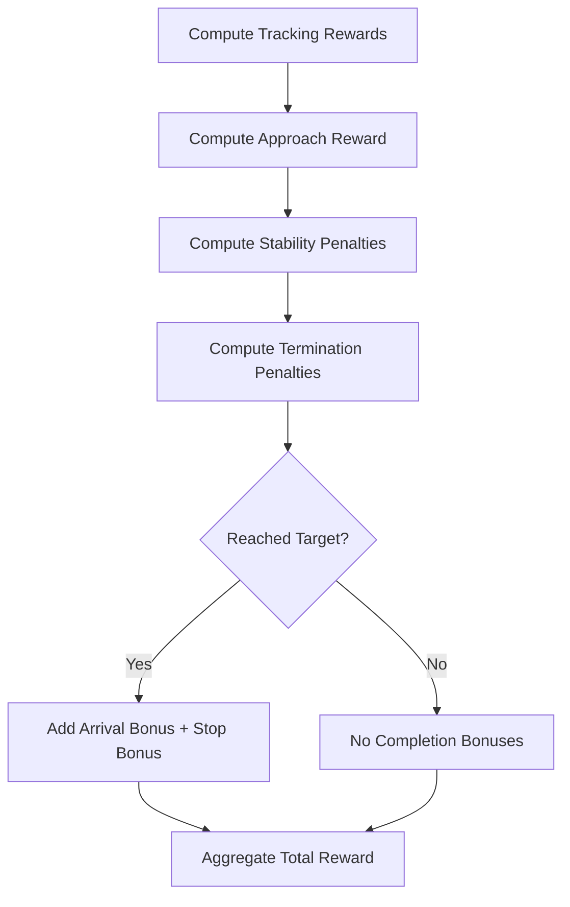
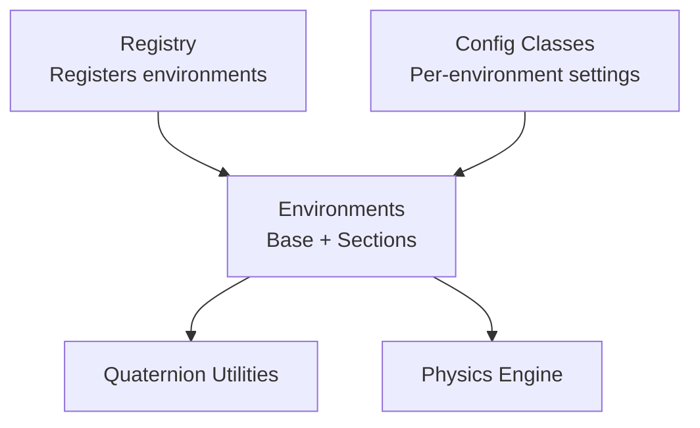

# VBot Navigation

<cite>
**Referenced Files in This Document**
- [__init__.py](file://motrix_envs/src/motrix_envs/navigation/vbot/__init__.py)
- [cfg.py](file://motrix_envs/src/motrix_envs/navigation/vbot/cfg.py)
- [vbot_np.py](file://motrix_envs/src/motrix_envs/navigation/vbot/vbot_np.py)
- [vbot_section001_np.py](file://motrix_envs/src/motrix_envs/navigation/vbot/vbot_section001_np.py)
- [vbot_section011_np.py](file://motrix_envs/src/motrix_envs/navigation/vbot/vbot_section011_np.py)
- [vbot_section012_np.py](file://motrix_envs/src/motrix_envs/navigation/vbot/vbot_section012_np.py)
- [vbot_section013_np.py](file://motrix_envs/src/motrix_envs/navigation/vbot/vbot_section013_np.py)
</cite>

## Table of Contents
1. [Introduction](#introduction)
2. [Project Structure](#project-structure)
3. [Core Components](#core-components)
4. [Architecture Overview](#architecture-overview)
5. [Detailed Component Analysis](#detailed-component-analysis)
6. [Dependency Analysis](#dependency-analysis)
7. [Performance Considerations](#performance-considerations)
8. [Training Methodology](#training-methodology)
9. [Curriculum Learning and Transfer Learning](#curriculum-learning-and-transfer-learning)
10. [Troubleshooting Guide](#troubleshooting-guide)
11. [Conclusion](#conclusion)

## Introduction
This document describes the VBot navigation environments designed for wheeled robot navigation across multiple track sections. It covers the VBot robot implementation with omnidirectional movement capabilities, the modular track system featuring four distinct sections (001, 011, 012, 013), environment architecture for multi-section navigation, configuration systems for layouts and obstacles, observation space design incorporating wheel odometry, IMU data, and section-specific cues, reward shaping for navigation, and training methodologies including curriculum learning and transfer learning.

## Project Structure
The VBot navigation module resides under navigation/vbot and exposes multiple environment variants via a central registry. Each variant encapsulates a specific track layout and associated configuration.

**Diagram sources**
- [__init__.py](file://motrix_envs/src/motrix_envs/navigation/vbot/__init__.py#L17-L32)
- [cfg.py](file://motrix_envs/src/motrix_envs/navigation/vbot/cfg.py#L118-L138)
- [vbot_np.py](file://motrix_envs/src/motrix_envs/navigation/vbot/vbot_np.py#L39-L40)
- [vbot_section001_np.py](file://motrix_envs/src/motrix_envs/navigation/vbot/vbot_section001_np.py#L40-L41)
- [vbot_section011_np.py](file://motrix_envs/src/motrix_envs/navigation/vbot/vbot_section011_np.py#L40-L41)
- [vbot_section012_np.py](file://motrix_envs/src/motrix_envs/navigation/vbot/vbot_section012_np.py#L40-L41)
- [vbot_section013_np.py](file://motrix_envs/src/motrix_envs/navigation/vbot/vbot_section013_np.py#L40-L41)

**Section sources**
- [__init__.py](file://motrix_envs/src/motrix_envs/navigation/vbot/__init__.py#L17-L32)

## Core Components
- Environment Registry and Registration: Environments are registered under names such as "vbot_navigation_flat", "vbot_navigation_section001", "vbot_navigation_section011", "vbot_navigation_section012", and "vbot_navigation_section013". These names are used to instantiate specific environment variants.
- Configuration Classes: Centralized configuration classes define simulation parameters, noise models, control scaling, initialization states, command ranges, normalization factors, asset definitions, and sensor specifications for each environment variant.
- Base Environment (Flat Terrain): Implements a base navigation loop with PD control, observation construction, reward computation, and termination logic suitable for flat terrains.
- Section-Specific Environments: Specialized variants adapt control strategies, termination conditions, and reward shaping for different track sections, including slope-aware PD control and dynamic stability rewards.

Key responsibilities:
- Action application and PD torque computation
- Observation extraction from sensors (IMU, joint states, commands)
- Termination detection (contact, tilt, DOF limits)
- Reward computation balancing tracking, stability, and completion

**Section sources**
- [cfg.py](file://motrix_envs/src/motrix_envs/navigation/vbot/cfg.py#L118-L138)
- [vbot_np.py](file://motrix_envs/src/motrix_envs/navigation/vbot/vbot_np.py#L249-L291)
- [vbot_section011_np.py](file://motrix_envs/src/motrix_envs/navigation/vbot/vbot_section011_np.py#L245-L299)
- [vbot_section012_np.py](file://motrix_envs/src/motrix_envs/navigation/vbot/vbot_section012_np.py#L245-L299)
- [vbot_section013_np.py](file://motrix_envs/src/motrix_envs/navigation/vbot/vbot_section013_np.py#L245-L299)

## Architecture Overview
The VBot navigation architecture integrates a physics-based simulator with configurable environments. Each environment variant inherits common functionality while overriding section-specific aspects such as terrain geometry, asset definitions, and reward shaping.

**Diagram sources**
- [cfg.py](file://motrix_envs/src/motrix_envs/navigation/vbot/cfg.py#L24-L138)
- [vbot_np.py](file://motrix_envs/src/motrix_envs/navigation/vbot/vbot_np.py#L423-L538)
- [vbot_section011_np.py](file://motrix_envs/src/motrix_envs/navigation/vbot/vbot_section011_np.py#L456-L571)

## Detailed Component Analysis

### VBot Robot Implementation and Control
- Action Space: 12-dimensional motor control actions corresponding to joint targets.
- PD Control: Torques computed using position and velocity errors with configurable gains and torque limits.
- Actuation Model: Motor execution with force/torque limits matching XML specifications.
- State Extraction: Root position/rotation, base linear velocity, and sensor readings (IMU, joint positions/velocities).
- Observation Construction: Concatenation of normalized sensor data, last actions, commands, and task-related signals (position/heading errors, distance, reached flags).

**Diagram sources**
- [vbot_np.py](file://motrix_envs/src/motrix_envs/navigation/vbot/vbot_np.py#L249-L291)
- [vbot_np.py](file://motrix_envs/src/motrix_envs/navigation/vbot/vbot_np.py#L388-L503)

**Section sources**
- [vbot_np.py](file://motrix_envs/src/motrix_envs/navigation/vbot/vbot_np.py#L62-L69)
- [vbot_np.py](file://motrix_envs/src/motrix_envs/navigation/vbot/vbot_np.py#L249-L291)
- [vbot_np.py](file://motrix_envs/src/motrix_envs/navigation/vbot/vbot_np.py#L388-L503)

### Modular Track System and Section-Specific Challenges
- Section 001 (Flat): Designed for basic navigation tasks with controlled spawn regions and simplified termination logic.
- Section 011 (Terrain 01): Introduces slope-aware PD control with adaptive gains and dynamic stability rewards.
- Section 012 (Terrain 02): Similar to 011 with terrain-specific adaptations.
- Section 013 (Terrain 03): Final section with specialized control and reward shaping.

**Diagram sources**
- [vbot_section001_np.py](file://motrix_envs/src/motrix_envs/navigation/vbot/vbot_section001_np.py#L782-L800)
- [vbot_section011_np.py](file://motrix_envs/src/motrix_envs/navigation/vbot/vbot_section011_np.py#L573-L634)

**Section sources**
- [vbot_section001_np.py](file://motrix_envs/src/motrix_envs/navigation/vbot/vbot_section001_np.py#L40-L106)
- [vbot_section011_np.py](file://motrix_envs/src/motrix_envs/navigation/vbot/vbot_section011_np.py#L40-L106)
- [vbot_section012_np.py](file://motrix_envs/src/motrix_envs/navigation/vbot/vbot_section012_np.py#L40-L106)
- [vbot_section013_np.py](file://motrix_envs/src/motrix_envs/navigation/vbot/vbot_section013_np.py#L40-L106)

### Observation Space Design
The observation vector aggregates:
- IMU-derived signals: base linear velocity, angular velocity, projected gravity
- Joint-level signals: joint positions (relative to default), joint velocities
- Control history: last actions
- Task commands: normalized desired velocity and yaw rate
- Task metrics: position error, heading error, distance-to-target, reached flag, stop-ready flag

Dimensions and composition are standardized across environments to support transfer learning and consistent policy design.

**Section sources**
- [vbot_np.py](file://motrix_envs/src/motrix_envs/navigation/vbot/vbot_np.py#L423-L538)

### Reward Shaping for Navigation
Rewards balance multiple objectives:
- Tracking rewards: exponential penalties on linear and angular velocity tracking errors
- Approach reward: incentive for reducing distance to target
- Stability penalties: Z-axis velocity, XY angular velocity, torque, joint velocity, action rate
- Termination penalties: contact, tilt, excessive DOF velocity
- Completion bonus: one-time arrival bonus and stopping bonus when stationary near target

**Diagram sources**
- [vbot_np.py](file://motrix_envs/src/motrix_envs/navigation/vbot/vbot_np.py#L528-L685)

**Section sources**
- [vbot_np.py](file://motrix_envs/src/motrix_envs/navigation/vbot/vbot_np.py#L528-L685)

### Termination Conditions
Termination is triggered by:
- Base contact sensor exceeding threshold
- Side flip detection via projected gravity tilt
- Excessive DOF velocities or numerical instability
- Timeouts based on episode steps

These conditions ensure safe and meaningful episodes for training.

**Section sources**
- [vbot_np.py](file://motrix_envs/src/motrix_envs/navigation/vbot/vbot_np.py#L505-L526)
- [vbot_section011_np.py](file://motrix_envs/src/motrix_envs/navigation/vbot/vbot_section011_np.py#L573-L634)

## Dependency Analysis
The VBot navigation module depends on:
- Registry for environment registration and lookup
- Configuration classes for environment-specific parameters
- Physics engine for scene simulation and sensor queries
- Math utilities for quaternion operations

**Diagram sources**
- [__init__.py](file://motrix_envs/src/motrix_envs/navigation/vbot/__init__.py#L17-L32)
- [cfg.py](file://motrix_envs/src/motrix_envs/navigation/vbot/cfg.py#L19-L20)
- [vbot_np.py](file://motrix_envs/src/motrix_envs/navigation/vbot/vbot_np.py#L21-L23)

**Section sources**
- [__init__.py](file://motrix_envs/src/motrix_envs/navigation/vbot/__init__.py#L17-L32)
- [cfg.py](file://motrix_envs/src/motrix_envs/navigation/vbot/cfg.py#L19-L20)
- [vbot_np.py](file://motrix_envs/src/motrix_envs/navigation/vbot/vbot_np.py#L21-L23)

## Performance Considerations
- Action filtering: Exponential smoothing of actions reduces jitter and improves control stability.
- Normalization: Observations and commands are normalized to stabilize training dynamics.
- PD gains: Tuned gains balance responsiveness and stability; adaptive gains in sloped sections improve robustness.
- Termination thresholds: Carefully tuned thresholds prevent premature termination while ensuring safety.

[No sources needed since this section provides general guidance]

## Training Methodology
- Flat Base Training: Start with the flat terrain environment to learn basic navigation skills (position/heading tracking, obstacle avoidance).
- Section-wise Pretraining: Train on individual sections to learn section-specific behaviors (slopes, transitions).
- Curriculum Scaling: Gradually increase difficulty by expanding target ranges, increasing episode durations, and introducing more complex layouts.
- Multi-Section Training: Combine sections into longer courses to practice continuous navigation across transitions.

[No sources needed since this section provides general guidance]

## Curriculum Learning and Transfer Learning
- Curriculum Learning: Progress from simple flat navigation to complex sections, adjusting action scales, noise levels, and episode durations.
- Transfer Learning: Use pre-trained policies from simpler sections as initialization for harder sections. Shared observation/action spaces facilitate cross-task adaptation.
- Section Interleaving: Alternate between sections during training to improve generalization across diverse track layouts.

[No sources needed since this section provides general guidance]

## Troubleshooting Guide
Common issues and remedies:
- Excessive termination due to contact sensors: Adjust contact thresholds and ensure proper sensor calibration.
- Instability on slopes: Reduce action scale and enable adaptive PD gains in sloped environments.
- Poor convergence: Verify normalization parameters and reward shaping balances; consider curriculum progression.
- Numerical instabilities: Monitor DOF velocity limits and apply appropriate penalties to prevent extreme states.

**Section sources**
- [vbot_section011_np.py](file://motrix_envs/src/motrix_envs/navigation/vbot/vbot_section011_np.py#L573-L634)
- [vbot_section012_np.py](file://motrix_envs/src/motrix_envs/navigation/vbot/vbot_section012_np.py#L573-L634)
- [vbot_section013_np.py](file://motrix_envs/src/motrix_envs/navigation/vbot/vbot_section013_np.py#L573-L634)

## Conclusion
The VBot navigation environments provide a flexible, modular framework for training wheeled robots across diverse track sections. With carefully designed observation spaces, reward shaping, and section-specific adaptations, the system supports effective curriculum learning and transfer learning strategies. The centralized configuration system and environment registry simplify experimentation and deployment across multiple track layouts.