# VBot Navigation

<cite>
**Referenced Files in This Document**
- [__init__.py](file://motrix_envs/src/motrix_envs/navigation/vbot/__init__.py)
- [cfg.py](file://motrix_envs/src/motrix_envs/navigation/vbot/cfg.py)
- [vbot_np.py](file://motrix_envs/src/motrix_envs/navigation/vbot/vbot_np.py)
- [vbot_section001_np.py](file://motrix_envs/src/motrix_envs/navigation/vbot/vbot_section001_np.py)
- [vbot_section011_np.py](file://motrix_envs/src/motrix_envs/navigation/vbot/vbot_section011_np.py)
- [vbot_section012_np.py](file://motrix_envs/src/motrix_envs/navigation/vbot/vbot_section012_np.py)
- [vbot_section013_np.py](file://motrix_envs/src/motrix_envs/navigation/vbot/vbot_section013_np.py)
- [vbot_section002_np.py](file://motrix_envs/src/motrix_envs/navigation/vbot/vbot_section002_np.py)
- [vbot_section002_waypoint_np.py](file://motrix_envs/src/motrix_envs/navigation/vbot/vbot_section002_waypoint_np.py)
- [vbot_section01_np.py](file://motrix_envs/src/motrix_envs/navigation/vbot/vbot_section01_np.py)
- [scene_section002_waypoint.xml](file://motrix_envs/src/motrix_envs/navigation/vbot/xmls/scene_section002_waypoint.xml)
- [flags/__init__.py](file://pip-uninstall-uy98kyog/flags/__init__.py)
- [app.py](file://pip-uninstall-uy98kyog/app.py)
- [flags/_argument_parser.py](file://pip-uninstall-uy98kyog/flags/_argument_parser.py)
- [testing/flagsaver.py](file://pip-uninstall-uy98kyog/testing/flagsaver.py)
- [cfg_opendoge.py](file://motrix_envs/src/motrix_envs/navigation/vbot/cfg_opendoge.py)
</cite>

## Update Summary
**Changes Made**
- Added comprehensive documentation for the new stuck-termination detection system in VBotSection002WaypointEnv
- Documented the 480-step detection window with 0.15m positional and 15-degree rotational thresholds
- Added circular buffer tracking implementation details and automatic termination after 240 consecutive detections
- Updated waypoint configuration documentation for hard-4 difficulty mode with optimized waypoint placement
- Documented terrain model loading order improvements in scene XML configuration
- Enhanced termination condition documentation with stuck detection integration

## Table of Contents
1. [Introduction](#introduction)
2. [Project Structure](#project-structure)
3. [Core Components](#core-components)
4. [Architecture Overview](#architecture-overview)
5. [Detailed Component Analysis](#detailed-component-analysis)
6. [Enhanced Turning Logic System](#enhanced-turning-logic-system)
7. [Waypoint-Based Navigation System](#waypoint-based-navigation-system)
8. [Stuck Termination Detection System](#stuck-termination-detection-system)
9. [Difficulty Modes and Configuration](#difficulty-modes-and-configuration)
10. [Celebration System](#celebration-system)
11. [Advanced Reward Components](#advanced-reward-components)
12. [Python Package Infrastructure](#python-package-infrastructure)
13. [Dependency Analysis](#dependency-analysis)
14. [Performance Considerations](#performance-considerations)
15. [Training Methodology](#training-methodology)
16. [Curriculum Learning and Transfer Learning](#curriculum-learning-and-transfer-learning)
17. [Troubleshooting Guide](#troubleshooting-guide)
18. [Conclusion](#conclusion)

## Introduction
This document describes the VBot navigation environments designed for wheeled robot navigation across multiple track sections. It covers the VBot robot implementation with omnidirectional movement capabilities, the modular track system featuring five distinct sections (001, 011, 012, 013, 01), environment architecture for multi-section navigation, configuration systems for layouts and obstacles, observation space design incorporating wheel odometry, IMU data, and section-specific cues, reward shaping for navigation, and training methodologies including curriculum learning and transfer learning.

**Updated** Enhanced documentation for the new VBotSection01Env for elevated platform terrain navigation, comprehensive waypoint systems with six difficulty modes, stuck termination detection system, and integrated Python package infrastructure for flag parsing and testing utilities. The system now supports advanced navigation scenarios across multiple track sections with sophisticated reward shaping, termination detection, and training methodologies.

## Project Structure
The VBot navigation module resides under navigation/vbot and exposes multiple environment variants via a central registry. Each variant encapsulates a specific track layout and associated configuration, including the new elevated platform terrain environment and enhanced stuck detection system.

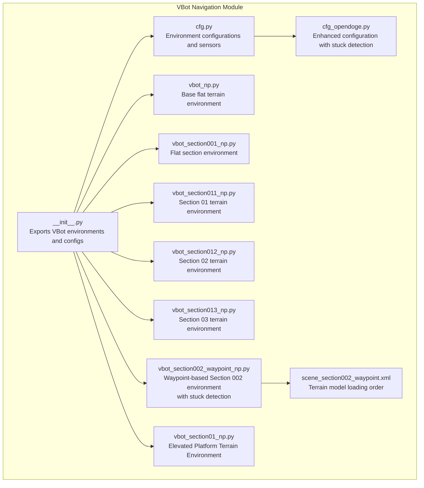
```mermaid
graph TB
subgraph "VBot Navigation Module"
A["__init__.py<br/>Exports VBot environments and configs"]
B["cfg.py<br/>Environment configurations and sensors"]
C["vbot_np.py<br/>Base flat terrain environment"]
D["vbot_section001_np.py<br/>Flat section environment"]
E["vbot_section011_np.py<br/>Section 01 terrain environment"]
F["vbot_section012_np.py<br/>Section 02 terrain environment"]
G["vbot_section013_np.py<br/>Section 03 terrain environment"]
H["vbot_section002_waypoint_np.py<br/>Waypoint-based Section 002 environment<br/>with stuck detection"]
I["vbot_section01_np.py<br/>Elevated Platform Terrain Environment"]
J["cfg_opendoge.py<br/>Enhanced configuration with stuck detection"]
K["scene_section002_waypoint.xml<br/>Terrain model loading order"]
end
A --> B
A --> C
A --> D
A --> E
A --> F
A --> G
A --> H
A --> I
B --> J
H --> K
```

**Diagram sources**
- [__init__.py](file://motrix_envs/src/motrix_envs/navigation/vbot/__init__.py#L17-L35)
- [cfg.py](file://motrix_envs/src/motrix_envs/navigation/vbot/cfg.py#L118-L138)
- [vbot_np.py](file://motrix_envs/src/motrix_envs/navigation/vbot/vbot_np.py#L39-L40)
- [vbot_section001_np.py](file://motrix_envs/src/motrix_envs/navigation/vbot/vbot_section001_np.py#L40-L41)
- [vbot_section011_np.py](file://motrix_envs/src/motrix_envs/navigation/vbot/vbot_section011_np.py#L40-L41)
- [vbot_section012_np.py](file://motrix_envs/src/motrix_envs/navigation/vbot/vbot_section012_np.py#L40-L41)
- [vbot_section013_np.py](file://motrix_envs/src/motrix_envs/navigation/vbot/vbot_section013_np.py#L40-L41)
- [vbot_section002_waypoint_np.py](file://motrix_envs/src/motrix_envs/navigation/vbot/vbot_section002_waypoint_np.py#L27-L33)
- [vbot_section01_np.py](file://motrix_envs/src/motrix_envs/navigation/vbot/vbot_section01_np.py#L40-L41)
- [cfg_opendoge.py](file://motrix_envs/src/motrix_envs/navigation/vbot/cfg_opendoge.py#L780-L973)
- [scene_section002_waypoint.xml](file://motrix_envs/src/motrix_envs/navigation/vbot/xmls/scene_section002_waypoint.xml#L38-L65)

**Section sources**
- [__init__.py](file://motrix_envs/src/motrix_envs/navigation/vbot/__init__.py#L17-L35)

## Core Components
- Environment Registry and Registration: Environments are registered under names such as "vbot_navigation_flat", "vbot_navigation_section001", "vbot_navigation_section011", "vbot_navigation_section012", "vbot_navigation_section013", "vbot_navigation_section01", and "vbot_navigation_section002_waypoint". These names are used to instantiate specific environment variants.
- Configuration Classes: Centralized configuration classes define simulation parameters, noise models, control scaling, initialization states, command ranges, normalization factors, asset definitions, and sensor specifications for each environment variant.
- Base Environment (Flat Terrain): Implements a base navigation loop with PD control, observation construction, reward computation, and termination logic suitable for flat terrains.
- Section-Specific Environments: Specialized variants adapt control strategies, termination conditions, and reward shaping for different track sections, including slope-aware PD control and dynamic stability rewards.
- **Enhanced Waypoint Navigation**: Advanced waypoint system with ordered path traversal, visited waypoints tracking, automatic goal updates, and intelligent turning prioritization.
- **Elevated Platform Terrain**: New dedicated environment for elevated platform navigation with specialized configuration and control parameters.
- **Stuck Termination Detection**: New system that monitors robot motion over extended periods to detect and terminate stuck situations automatically.

Key responsibilities:
- Action application and PD torque computation
- Observation extraction from sensors (IMU, joint states, commands)
- Termination detection (contact, tilt, DOF limits, stuck detection)
- Reward computation balancing tracking, stability, and completion
- **Waypoint detection and ordered path following with dynamic goal updates**
- **Enhanced downhill state detection and adaptive control parameter adjustment**
- **Intelligent turning logic with arctan2-based heading calculations and large turn prioritization**
- **Elevated platform terrain navigation with specialized control parameters**
- **Stuck detection system monitoring position and rotation changes over 480-step windows**

**Section sources**
- [cfg.py](file://motrix_envs/src/motrix_envs/navigation/vbot/cfg.py#L118-L138)
- [vbot_np.py](file://motrix_envs/src/motrix_envs/navigation/vbot/vbot_np.py#L249-L291)
- [vbot_section011_np.py](file://motrix_envs/src/motrix_envs/navigation/vbot/vbot_section011_np.py#L245-L299)
- [vbot_section012_np.py](file://motrix_envs/src/motrix_envs/navigation/vbot/vbot_section012_np.py#L245-L299)
- [vbot_section013_np.py](file://motrix_envs/src/motrix_envs/navigation/vbot/vbot_section013_np.py#L245-L299)
- [vbot_section002_waypoint_np.py](file://motrix_envs/src/motrix_envs/navigation/vbot/vbot_section002_waypoint_np.py#L27-L33)
- [vbot_section01_np.py](file://motrix_envs/src/motrix_envs/navigation/vbot/vbot_section01_np.py#L40-L41)

## Architecture Overview
The VBot navigation architecture integrates a physics-based simulator with configurable environments. Each environment variant inherits common functionality while overriding section-specific aspects such as terrain geometry, asset definitions, and reward shaping.

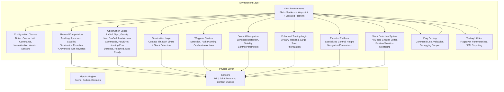
```mermaid
graph TB
subgraph "Environment Layer"
EV["VBot Environments<br/>Flat + Sections + Waypoint + Elevated Platform"]
CFG["Configuration Classes<br/>Noise, Control, Init, Commands,<br/>Normalization, Assets, Sensors"]
OBS["Observation Space<br/>LinVel, Gyro, Gravity,<br/>Joint Pos/Vel, Last Actions,<br/>Commands, Pos/Error, Heading/Error,<br/>Distance, Reached, Stop Ready"]
RWD["Reward Computation<br/>Tracking, Approach, Stability,<br/>Termination Penalties<br/>+ Advanced Turn Rewards"]
TERM["Termination Logic<br/>Contact, Tilt, DOF Limits<br/>+ Stuck Detection"]
WP["Waypoint System<br/>Detection, Path Planning,<br/>Celebration Actions"]
DH["Downhill Navigation<br/>Enhanced Detection, Stability<br/>Control Parameters"]
TURN["Enhanced Turning Logic<br/>Arctan2 Heading, Large Turn<br/>Prioritization"]
EP["Elevated Platform<br/>Specialized Control, Height<br/>Navigation Parameters"]
STUCK["Stuck Detection System<br/>480-step Circular Buffer,<br/>Position/Rotation Monitoring"]
FLAG["Flag Parsing<br/>Command Line, Validation,<br/>Debugging Support"]
TEST["Testing Utilities<br/>Flagsaver, Parameterized,<br/>XML Reporting"]
end
subgraph "Physics Layer"
SIM["Physics Engine<br/>Scene, Bodies, Contacts"]
SENS["Sensors<br/>IMU, Joint Encoders, Contact Queries"]
end
EV --> CFG
EV --> OBS
EV --> RWD
EV --> TERM
EV --> WP
EV --> DH
EV --> TURN
EV --> EP
EV --> STUCK
EV --> FLAG
EV --> TEST
RWD --> SENS
OBS --> SENS
TERM --> SENS
WP --> SENS
DH --> SENS
TURN --> SENS
EP --> SENS
STUCK --> SENS
FLAG --> EV
TEST --> EV
```

**Diagram sources**
- [cfg.py](file://motrix_envs/src/motrix_envs/navigation/vbot/cfg.py#L24-L138)
- [vbot_np.py](file://motrix_envs/src/motrix_envs/navigation/vbot/vbot_np.py#L423-L538)
- [vbot_section011_np.py](file://motrix_envs/src/motrix_envs/navigation/vbot/vbot_section011_np.py#L456-L571)
- [vbot_section002_waypoint_np.py](file://motrix_envs/src/motrix_envs/navigation/vbot/vbot_section002_waypoint_np.py#L142-L166)
- [vbot_section01_np.py](file://motrix_envs/src/motrix_envs/navigation/vbot/vbot_section01_np.py#L40-L41)
- [flags/__init__.py](file://pip-uninstall-uy98kyog/flags/__init__.py#L14-L221)
- [app.py](file://pip-uninstall-uy98kyog/app.py#L15-L540)

## Detailed Component Analysis

### VBot Robot Implementation and Control
- Action Space: 12-dimensional motor control actions corresponding to joint targets.
- PD Control: Torques computed using position and velocity errors with configurable gains and torque limits.
- Actuation Model: Motor execution with force/torque limits matching XML specifications.
- State Extraction: Root position/rotation, base linear velocity, and sensor readings (IMU, joint positions/velocities).
- Observation Construction: Concatenation of normalized sensor data, last actions, commands, and task-related signals (position/heading errors, distance, reached flags).

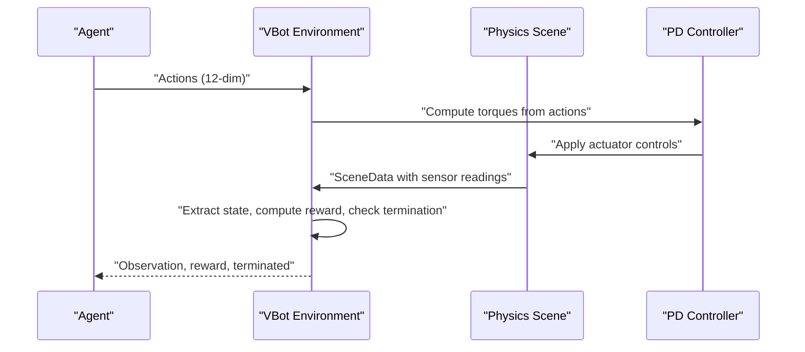
```mermaid
sequenceDiagram
participant Agent as "Agent"
participant Env as "VBot Environment"
participant Sim as "Physics Scene"
participant Ctrl as "PD Controller"
Agent->>Env : "Actions (12-dim)"
Env->>Ctrl : "Compute torques from actions"
Ctrl->>Sim : "Apply actuator controls"
Sim->>Env : "SceneData with sensor readings"
Env->>Env : "Extract state, compute reward, check termination"
Env-->>Agent : "Observation, reward, terminated"
```

**Diagram sources**
- [vbot_np.py](file://motrix_envs/src/motrix_envs/navigation/vbot/vbot_np.py#L249-L291)
- [vbot_np.py](file://motrix_envs/src/motrix_envs/navigation/vbot/vbot_np.py#L388-L503)

**Section sources**
- [vbot_np.py](file://motrix_envs/src/motrix_envs/navigation/vbot/vbot_np.py#L62-L69)
- [vbot_np.py](file://motrix_envs/src/motrix_envs/navigation/vbot/vbot_np.py#L249-L291)
- [vbot_np.py](file://motrix_envs/src/motrix_envs/navigation/vbot/vbot_np.py#L388-L503)

### Modular Track System and Section-Specific Challenges
- Section 001 (Flat): Designed for basic navigation tasks with controlled spawn regions and simplified termination logic.
- Section 011 (Terrain 01): Introduces slope-aware PD control with adaptive gains and dynamic stability rewards.
- Section 012 (Terrain 02): Similar to 011 with terrain-specific adaptations.
- Section 013 (Terrain 03): Final section with specialized control and reward shaping.
- **Section 01 (Elevated Platform)**: New dedicated environment for elevated platform navigation with specialized control parameters and height management.
- **Section 002 Waypoint**: Enhanced Section 002 with dynamic waypoint following, path planning, and ordered traversal capabilities with intelligent turning logic and stuck detection system.

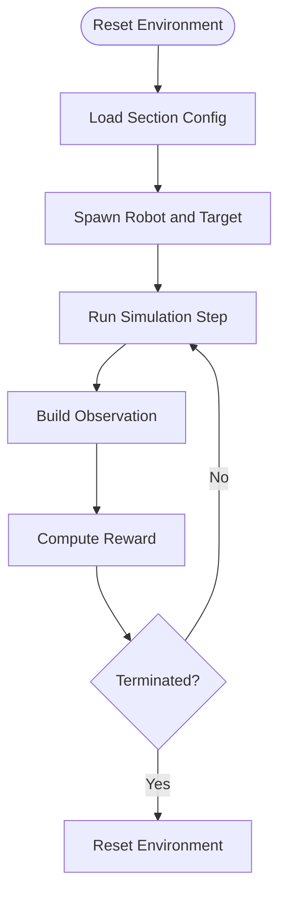
```mermaid
flowchart TD
Start(["Reset Environment"]) --> LoadCfg["Load Section Config"]
LoadCfg --> Spawn["Spawn Robot and Target"]
Spawn --> RunStep["Run Simulation Step"]
RunStep --> Observe["Build Observation"]
Observe --> ComputeReward["Compute Reward"]
ComputeReward --> Terminate{"Terminated?"}
Terminate --> |No| RunStep
Terminate --> |Yes| Reset["Reset Environment"]
```

**Diagram sources**
- [vbot_section001_np.py](file://motrix_envs/src/motrix_envs/navigation/vbot/vbot_section001_np.py#L782-L800)
- [vbot_section011_np.py](file://motrix_envs/src/motrix_envs/navigation/vbot/vbot_section011_np.py#L573-L634)
- [vbot_section01_np.py](file://motrix_envs/src/motrix_envs/navigation/vbot/vbot_section01_np.py#L495-L680)

**Section sources**
- [vbot_section001_np.py](file://motrix_envs/src/motrix_envs/navigation/vbot/vbot_section001_np.py#L40-L106)
- [vbot_section011_np.py](file://motrix_envs/src/motrix_envs/navigation/vbot/vbot_section011_np.py#L40-L106)
- [vbot_section012_np.py](file://motrix_envs/src/motrix_envs/navigation/vbot/vbot_section012_np.py#L40-L106)
- [vbot_section013_np.py](file://motrix_envs/src/motrix_envs/navigation/vbot/vbot_section013_np.py#L40-L106)
- [vbot_section002_waypoint_np.py](file://motrix_envs/src/motrix_envs/navigation/vbot/vbot_section002_waypoint_np.py#L142-L166)
- [vbot_section01_np.py](file://motrix_envs/src/motrix_envs/navigation/vbot/vbot_section01_np.py#L40-L41)

### Observation Space Design
The observation vector aggregates:
- IMU-derived signals: base linear velocity, angular velocity, projected gravity
- Joint-level signals: joint positions (relative to default), joint velocities
- Control history: last actions
- Task commands: normalized desired velocity and yaw rate
- Task metrics: position error, heading error, distance-to-target, reached flag, stop-ready flag

Dimensions and composition are standardized across environments to support transfer learning and consistent policy design.

**Section sources**
- [vbot_np.py](file://motrix_envs/src/motrix_envs/navigation/vbot/vbot_np.py#L423-L538)

### Reward Shaping for Navigation
Rewards balance multiple objectives:
- Tracking rewards: exponential penalties on linear and angular velocity tracking errors
- Approach reward: incentive for reducing distance to target
- Stability penalties: Z-axis velocity, XY angular velocity, torque, joint velocity, action rate
- Termination penalties: contact, tilt, excessive DOF velocity
- Completion bonus: one-time arrival bonus and stopping bonus when stationary near target
- **Enhanced turning rewards**: turn preparation, heading alignment, and waypoint proximity turning rewards

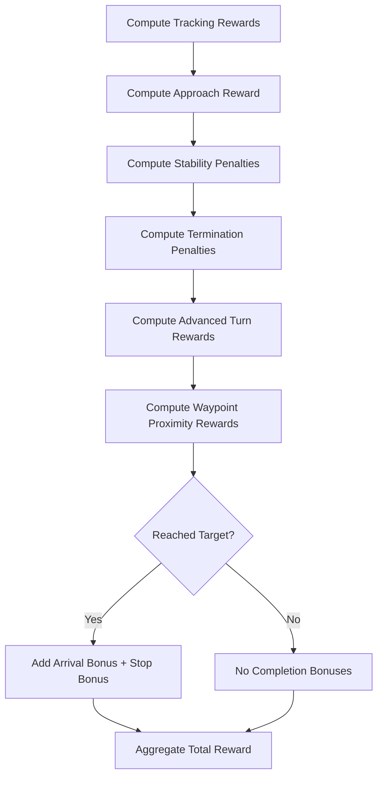
```mermaid
flowchart TD
A["Compute Tracking Rewards"] --> B["Compute Approach Reward"]
B --> C["Compute Stability Penalties"]
C --> D["Compute Termination Penalties"]
D --> E["Compute Advanced Turn Rewards"]
E --> F["Compute Waypoint Proximity Rewards"]
F --> G{"Reached Target?"}
G --> |Yes| H["Add Arrival Bonus + Stop Bonus"]
G --> |No| I["No Completion Bonuses"]
H --> J["Aggregate Total Reward"]
I --> J["Aggregate Total Reward"]
```

**Diagram sources**
- [vbot_np.py](file://motrix_envs/src/motrix_envs/navigation/vbot/vbot_np.py#L528-L685)

**Section sources**
- [vbot_np.py](file://motrix_envs/src/motrix_envs/navigation/vbot/vbot_np.py#L528-L685)

### Termination Conditions
Termination is triggered by:
- Base contact sensor exceeding threshold
- Side flip detection via projected gravity tilt
- Excessive DOF velocities or numerical instability
- Timeouts based on episode steps
- **Stuck detection**: prolonged lack of significant position or rotation changes

These conditions ensure safe and meaningful episodes for training.

**Section sources**
- [vbot_np.py](file://motrix_envs/src/motrix_envs/navigation/vbot/vbot_np.py#L505-L526)
- [vbot_section011_np.py](file://motrix_envs/src/motrix_envs/navigation/vbot/vbot_section011_np.py#L573-L634)
- [vbot_section002_waypoint_np.py](file://motrix_envs/src/motrix_envs/navigation/vbot/vbot_section002_waypoint_np.py#L1119-L1121)

### Elevated Platform Terrain Environment
**Updated** The new VBotSection01Env provides specialized navigation capabilities for elevated platform terrain with dedicated configuration and control parameters.

#### Environment Features
- **Specialized Configuration**: VBotSection01EnvCfg tailored for elevated platform navigation
- **Height Management**: Dedicated spawn heights and terrain elevation handling
- **Enhanced Control**: Optimized PD gains and control parameters for platform navigation
- **Target Marker Visualization**: Arrow visualization for robot and desired heading
- **Contact Detection**: Enhanced termination contact detection for platform boundaries

#### Key Parameters
- **Spawn Center**: [0.0, -2.4, 0.5] with ±0.5m X/Y randomization
- **Episode Duration**: Extended to 40 seconds (4000 steps) for platform navigation
- **Action Scale**: 0.25 for stable platform traversal
- **Default Joint Angles**: Optimized for elevated platform stability

**Section sources**
- [vbot_section01_np.py](file://motrix_envs/src/motrix_envs/navigation/vbot/vbot_section01_np.py#L40-L41)
- [vbot_section01_np.py](file://motrix_envs/src/motrix_envs/navigation/vbot/vbot_section01_np.py#L48-L92)
- [vbot_section01_np.py](file://motrix_envs/src/motrix_envs/navigation/vbot/vbot_section01_np.py#L247-L259)
- [vbot_section01_np.py](file://motrix_envs/src/motrix_envs/navigation/vbot/vbot_section01_np.py#L343-L458)

## Enhanced Turning Logic System

**Updated** The VBot navigation system now features an advanced turning logic system with arctan2-based heading calculations, large turn detection (60-degree threshold), and adaptive turn prioritization for enhanced navigation performance.

### Arctan2-Based Heading Calculations
The system implements precise heading calculations using arctan2 for improved directional accuracy:

#### Heading Calculation Process
- **Desired Heading**: `desired_heading = np.arctan2(position_error[:, 1], position_error[:, 0])`
- **Heading to Movement**: `heading_to_movement = desired_heading - robot_heading`
- **Angle Normalization**: Wraps angles to [-π, π] range for consistent behavior

#### Large Turn Detection Threshold
The system detects large turns requiring priority handling:
- **Threshold**: `np.abs(heading_to_movement) > np.deg2rad(60)` (60-degree threshold)
- **Adaptive Response**: Reduces forward speed to 30% and increases turn amplification to 150%

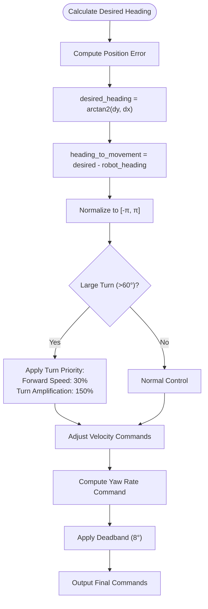
```mermaid
flowchart TD
Start(["Calculate Desired Heading"]) --> ComputeError["Compute Position Error"]
ComputeError --> CalcDesired["desired_heading = arctan2(dy, dx)"]
CalcDesired --> CalcMovement["heading_to_movement = desired - robot_heading"]
CalcMovement --> Normalize["Normalize to [-π, π]"]
Normalize --> CheckLargeTurn{"Large Turn (>60°)?"}
CheckLargeTurn --> |Yes| ApplyPriority["Apply Turn Priority:<br/>Forward Speed: 30%<br/>Turn Amplification: 150%"]
CheckLargeTurn --> |No| NormalControl["Normal Control"]
ApplyPriority --> AdjustCommands["Adjust Velocity Commands"]
NormalControl --> AdjustCommands
AdjustCommands --> ComputeYaw["Compute Yaw Rate Command"]
ComputeYaw --> Deadband["Apply Deadband (8°)"]
Deadband --> Output["Output Final Commands"]
```

**Diagram sources**
- [vbot_section002_waypoint_np.py](file://motrix_envs/src/motrix_envs/navigation/vbot/vbot_section002_waypoint_np.py#L857-L877)

### Adaptive Turn Prioritization
The system intelligently prioritizes turns over forward movement when large directional changes are required:

#### Turn Priority Factors
- **Large Turn Required**: `large_turn_required = np.abs(heading_to_movement) > 60°`
- **Forward Speed Reduction**: `turn_priority_factor = np.where(large_turn_required, 0.3, 1.0)`
- **Turn Amplification**: `turn_amplification = np.where(large_turn_required, 1.5, 1.0)`

#### Command Adjustment Strategy
- **Forward Velocity**: Reduced to 30% during large turns
- **Yaw Rate**: Increased by 50% for faster direction changes
- **Deadband Application**: Prevents oscillation with 8-degree deadband

**Section sources**
- [vbot_section002_waypoint_np.py](file://motrix_envs/src/motrix_envs/navigation/vbot/vbot_section002_waypoint_np.py#L862-L877)

## Waypoint-Based Navigation System

**Updated** The VBotSection002WaypointEnv introduces a sophisticated waypoint-based navigation system that enables dynamic path following across multiple track sections with ordered traversal and automatic goal updates.

### Enhanced Waypoint Detection Mechanisms
The system implements dual-path waypoint detection for robust operation with ordered traversal:

#### Contact-Based Detection
- Uses dedicated contact sensors for each waypoint (wp_X-Y_body_contact)
- Provides precise detection when robot base contacts waypoint geometries
- Handles sensor failures gracefully with position-based fallback

#### Ordered Path Traversal System
- **Visited Waypoints Tracking**: Maintains set of already visited waypoints per environment
- **Sequential Index Checking**: Ensures waypoints are visited in correct order (0, 1, 2, ...)
- **Automatic Goal Updates**: Updates navigation goal to next unvisited waypoint in index order

#### Position-Based Fallback Detection
- Calculates Euclidean distance between robot and waypoint bodies
- Activates when contact sensors are unavailable or fail
- **Corrected Distance Threshold**: 0.1 meters for reliable detection

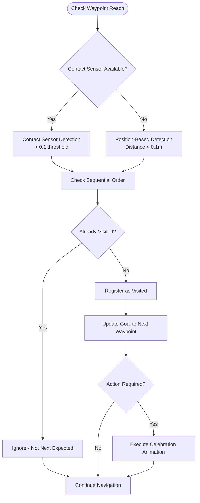
```mermaid
flowchart TD
Start(["Check Waypoint Reach"]) --> ContactCheck{"Contact Sensor Available?"}
ContactCheck --> |Yes| ContactDetect["Contact Sensor Detection<br/>> 0.1 threshold"]
ContactCheck --> |No| PositionDetect["Position-Based Detection<br/>Distance < 0.1m"]
ContactDetect --> CheckOrder["Check Sequential Order"]
PositionDetect --> CheckOrder
CheckOrder --> CheckVisited{"Already Visited?"}
CheckVisited --> |Yes| Ignore["Ignore - Not Next Expected"]
CheckVisited --> |No| Register["Register as Visited"]
Register --> UpdateGoal["Update Goal to Next Waypoint"]
Ignore --> Continue["Continue Navigation"]
UpdateGoal --> TriggerAction{"Action Required?"}
TriggerAction --> |Yes| Celebration["Execute Celebration Animation"]
TriggerAction --> |No| Continue
Celebration --> Continue
```

**Diagram sources**
- [vbot_section002_waypoint_np.py](file://motrix_envs/src/motrix_envs/navigation/vbot/vbot_section002_waypoint_np.py#L198-L253)

### Dynamic Path Planning
The system maintains a persistent waypoint path that guides robot navigation:

#### Waypoint Management
- **Current Waypoint Index**: Tracks which waypoint is currently active per environment
- **Visited Waypoints**: Maintains set of already visited waypoints per environment
- **Path Sorting**: Waypoints are automatically sorted by index field for sequential navigation

#### Goal Update Strategy
When a waypoint is reached, the system automatically updates the navigation goal to the next unvisited waypoint in index order. This creates a continuous path that spans multiple track sections.

**Section sources**
- [vbot_section002_waypoint_np.py](file://motrix_envs/src/motrix_envs/navigation/vbot/vbot_section002_waypoint_np.py#L142-L166)
- [vbot_section002_waypoint_np.py](file://motrix_envs/src/motrix_envs/navigation/vbot/vbot_section002_waypoint_np.py#L384-L421)

## Stuck Termination Detection System

**Updated** The VBotSection002WaypointEnv now includes a comprehensive stuck termination detection system designed to automatically identify and terminate episodes where the robot becomes immobilized or makes minimal progress.

### Detection Algorithm Overview
The stuck detection system monitors robot motion over extended time windows to identify situations where the robot fails to make meaningful progress:

#### Detection Window Configuration
- **Window Size**: 480 simulation steps (8 seconds at 60Hz)
- **Position Threshold**: 0.15 meters maximum displacement within the window
- **Rotation Threshold**: 15 degrees maximum angular change within the window
- **Consecutive Detection**: Requires 240 consecutive detections (4 seconds) before termination

#### Circular Buffer Implementation
The system uses a circular buffer architecture to efficiently track robot state over the detection window:

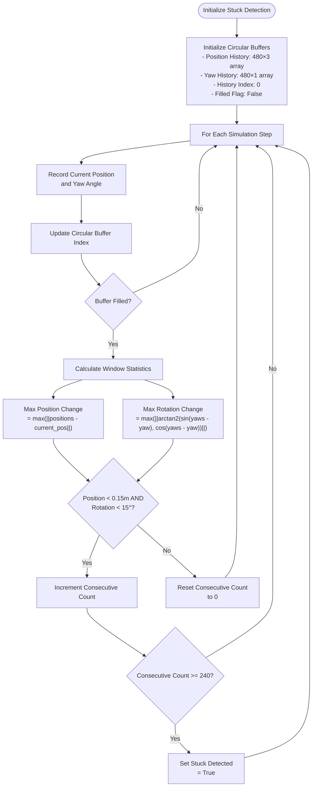
```mermaid
flowchart TD
Start(["Initialize Stuck Detection"]) --> BufferInit["Initialize Circular Buffers<br/>- Position History: 480×3 array<br/>- Yaw History: 480×1 array<br/>- History Index: 0<br/>- Filled Flag: False"]
BufferInit --> StepLoop["For Each Simulation Step"]
StepLoop --> RecordPos["Record Current Position<br/>and Yaw Angle"]
RecordPos --> UpdateIndex["Update Circular Buffer Index"]
UpdateIndex --> CheckFill{"Buffer Filled?"}
CheckFill --> |No| StepLoop
CheckFill --> |Yes| CalcDiff["Calculate Window Statistics"]
CalcDiff --> CalcPos["Max Position Change<br/>= max(||positions - current_pos||)"]
CalcDiff --> CalcRot["Max Rotation Change<br/>= max(||arctan2(sin(yaws - yaw), cos(yaws - yaw))||)"]
CalcPos --> CheckStuck{"Position < 0.15m AND<br/>Rotation < 15°?"}
CalcRot --> CheckStuck
CheckStuck --> |Yes| IncCount["Increment Consecutive Count"]
CheckStuck --> |No| ResetCount["Reset Consecutive Count<br/>to 0"]
IncCount --> CheckTerminate{"Consecutive Count >= 240?"}
ResetCount --> StepLoop
CheckTerminate --> |Yes| SetDetected["Set Stuck Detected<br/>= True"]
CheckTerminate --> |No| StepLoop
SetDetected --> StepLoop
```

**Diagram sources**
- [vbot_section002_waypoint_np.py](file://motrix_envs/src/motrix_envs/navigation/vbot/vbot_section002_waypoint_np.py#L103-L120)
- [vbot_section002_waypoint_np.py](file://motrix_envs/src/motrix_envs/navigation/vbot/vbot_section002_waypoint_np.py#L121-L171)

### Detection Logic Implementation
The stuck detection algorithm operates on a per-environment basis with the following key components:

#### State Variables
- `_stuck_pos_history`: Circular buffer storing position history for each environment
- `_stuck_yaw_history`: Circular buffer storing yaw angle history for each environment
- `_stuck_history_idx`: Current write position in circular buffers
- `_stuck_history_filled`: Boolean flag indicating when buffers are ready for detection
- `_stuck_consecutive_count`: Counter for consecutive stuck detections
- `_stuck_detected`: Boolean flag indicating stuck state for each environment

#### Detection Criteria
The system evaluates two primary criteria simultaneously:
1. **Position Stability**: Robot must not move more than 0.15 meters in any direction during the 480-step window
2. **Orientation Stability**: Robot must not rotate more than 15 degrees during the 480-step window

#### Termination Trigger
Once both criteria are met for 240 consecutive steps (4 seconds), the system sets the stuck detection flag, which is then incorporated into the termination logic.

### Integration with Termination System
The stuck detection integrates seamlessly with the existing termination system:

#### Termination Enhancement
The stuck detection adds an additional termination condition alongside existing criteria:
- Timeout-based termination
- Contact-based termination  
- Tilt-based termination
- Gyroscope anomaly detection
- X-axis boundary detection
- **Stuck detection termination**

#### Detection Timing
The stuck detection is evaluated continuously during episode execution and only becomes active after the circular buffer is filled (after 480 steps). This prevents false positives during initial episode setup.

#### Reset Mechanism
The stuck detection state is reset when:
- A waypoint is successfully reached
- The robot makes significant progress (exceeds detection thresholds)
- Episode resets occur

**Section sources**
- [vbot_section002_waypoint_np.py](file://motrix_envs/src/motrix_envs/navigation/vbot/vbot_section002_waypoint_np.py#L103-L120)
- [vbot_section002_waypoint_np.py](file://motrix_envs/src/motrix_envs/navigation/vbot/vbot_section002_waypoint_np.py#L121-L171)
- [vbot_section002_waypoint_np.py](file://motrix_envs/src/motrix_envs/navigation/vbot/vbot_section002_waypoint_np.py#L1119-L1121)

## Difficulty Modes and Configuration

**Updated** The waypoint system supports six difficulty modes, each with different waypoint configurations and complexity levels. The system now includes modes up to hard-5 with maximum complexity, including optimized waypoint placement for hard-4 difficulty mode.

### Difficulty Mode Configuration
Each mode defines a unique set of waypoints with varying complexity:

#### Simple Mode
- **Waypoints**: 3 basic waypoints (wp_1-4_body, wp_2-1_body, wp_3-1_body)
- **Action Requirement**: No celebration actions at waypoints
- **Complexity**: Minimal path complexity, focused on basic navigation

#### Easy Mode  
- **Waypoints**: Same 3 waypoints as simple mode
- **Action Requirement**: Celebration actions (front leg raises) at all waypoints
- **Complexity**: Basic path with celebratory animations

#### Normal Mode
- **Waypoints**: 6 waypoints including intermediate points (wp_1-1_body, wp_1-3_body, wp_1-2_body, wp_1-4_body, wp_2-1_body, wp_3-1_body)
- **Action Requirement**: No celebration actions at waypoints
- **Complexity**: Moderate path complexity with intermediate checkpoints

#### Hard Mode
- **Waypoints**: Same 6 waypoints as normal mode
- **Action Requirement**: Celebration actions at all waypoints
- **Complexity**: Highest path complexity with celebratory animations at every waypoint

#### Hard-2 Mode (New)
- **Waypoints**: 9 waypoints including 6 reward points and 3 celebration points (wp_1-1_body, wp_1-2_body, wp_1-3_body, wp_1-7_body, wp_1-6_body, wp_1-5_body, wp_1-4_body, wp_2-1_body, wp_3-1_body)
- **Action Requirement**: No celebration actions at waypoints
- **Complexity**: Maximum path complexity with extensive reward points and celebratory actions

#### Hard-3 Mode (New)
- **Waypoints**: 9 waypoints including 6 reward points and 3 celebration points (wp_1-1_body, wp_1-2_body, wp_1-3_body, wp_1-7_body, wp_1-6_body, wp_1-5_body, wp_1-4_body, wp_2-1_body, wp_3-1_body)
- **Action Requirement**: Celebration actions at all waypoints
- **Complexity**: Maximum path complexity with celebratory animations at every waypoint

#### Hard-4 Mode (New)
- **Waypoints**: 19 waypoints including 15 reward points and 4 celebration points
- **Action Requirement**: Celebration actions at all waypoints
- **Complexity**: Maximum path complexity with extensive reward points and celebratory actions
- **Optimized Placement**: Strategic waypoint positioning for challenging terrain sections

#### Hard-5 Mode (New)
- **Waypoints**: 20 waypoints including 17 reward points and 3 celebration points
- **Action Requirement**: Celebration actions at all waypoints
- **Complexity**: Maximum path complexity with extensive reward points and celebratory actions

### Automatic Configuration Selection
The system uses Python's `__post_init__` method to automatically select the appropriate waypoint configuration based on the `difficulty_mode` setting, ensuring seamless mode switching. The default difficulty mode is now 'hard-4'.

**Section sources**
- [cfg_opendoge.py](file://motrix_envs/src/motrix_envs/navigation/vbot/cfg_opendoge.py#L790-L905)
- [cfg_opendoge.py](file://motrix_envs/src/motrix_envs/navigation/vbot/cfg_opendoge.py#L907-L911)
- [scene_section002_waypoint.xml](file://motrix_envs/src/motrix_envs/navigation/vbot/xmls/scene_section002_waypoint.xml#L51-L80)

## Celebration System

**Updated** The waypoint system includes a sophisticated celebration system that triggers brief, visually appealing animations at specific waypoints, replacing the previous 'special action' terminology with a more descriptive 'celebration' system.

### Celebration Animation System
The system defines a comprehensive celebration animation that provides visual feedback and enhances the navigation experience:

#### Celebration Pose Configuration
- **Duration**: 60 simulation steps (approximately 1 second at 60Hz)
- **Animation Type**: Smooth interpolation between current pose and target celebration pose
- **Trigger Points**: Specific waypoints designated for celebration (wp_1-4_body, wp_2-1_body, wp_3-1_body)

#### Celebration Pose Details
The celebration pose consists of precisely defined joint angles for optimal visual appeal:

##### Front Legs (Raised)
- **Hip Joints**: FR: -0.1 rad, FL: 0.1 rad (opposite directions for balance)
- **Thigh Joints**: 0.3 rad (moderate knee bend)
- **Calf Joints**: -0.8 rad (raised position)

##### Rear Legs (Crouched)
- **Hip Joints**: RR: -0.1 rad, RL: 0.1 rad (opposite directions for stability)
- **Thigh Joints**: 1.2 rad (crouched position)
- **Calf Joints**: -2.0 rad (stabilizing position)

#### Animation Mechanics
The system implements smooth interpolation for natural-looking animations:

##### Phase-Based Animation
- **First Half (Raise)**: Alpha goes from 0 to 1 (raising front legs)
- **Second Half (Lower)**: Alpha goes from 1 to 0 (lowering front legs)
- **Half Duration**: 30 steps for each phase

##### Action Override Mechanism
During celebration execution, the system temporarily overrides agent actions with interpolated joint targets, ensuring smooth pose transitions while maintaining system stability.

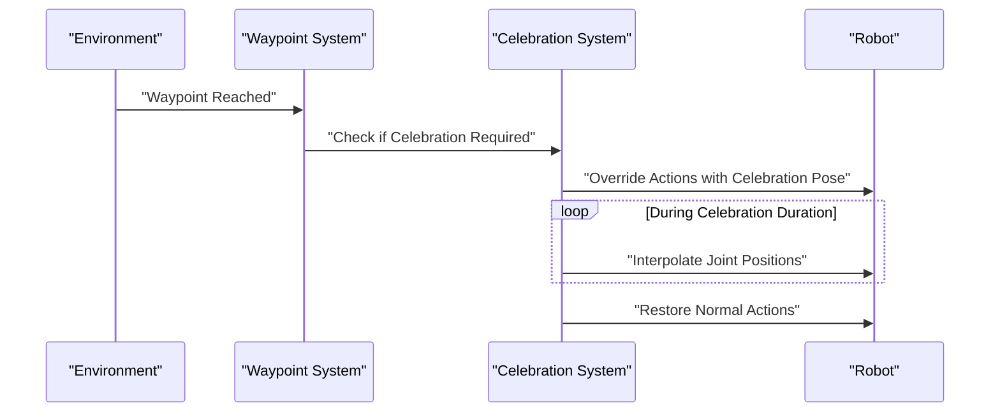
```mermaid
sequenceDiagram
participant Env as "Environment"
participant WPSystem as "Waypoint System"
participant Celebration as "Celebration System"
participant Robot as "Robot"
Env->>WPSystem : "Waypoint Reached"
WPSystem->>Celebration : "Check if Celebration Required"
Celebration->>Robot : "Override Actions with Celebration Pose"
loop During Celebration Duration
Celebration->>Robot : "Interpolate Joint Positions"
end
Celebration->>Robot : "Restore Normal Actions"
```

**Diagram sources**
- [vbot_section002_waypoint_np.py](file://motrix_envs/src/motrix_envs/navigation/vbot/vbot_section002_waypoint_np.py#L300-L370)

**Section sources**
- [vbot_section002_waypoint_np.py](file://motrix_envs/src/motrix_envs/navigation/vbot/vbot_section002_waypoint_np.py#L287-L298)
- [vbot_section002_waypoint_np.py](file://motrix_envs/src/motrix_envs/navigation/vbot/vbot_section002_waypoint_np.py#L300-L370)

## Advanced Reward Components

**Updated** The reward system now includes several advanced components that enhance navigation performance and encourage intelligent behavior patterns.

### Turn Preparation Reward
Encourages robots to prepare for turns before executing them:

#### Reward Calculation
- **Condition**: Large turns (>30°) with correct turning direction
- **Formula**: `turn_preparation_reward = np.clip(np.abs(gyro[:, 2]) * 2.0, 0, 1.0)`
- **Purpose**: Reinforces proper turn initiation and direction alignment

### Heading Alignment Reward  
Provides reward for achieving proper heading alignment:

#### Reward Calculation
- **Formula**: `heading_alignment_reward = np.exp(-np.square(heading_to_target) / (np.pi/6)**2)`
- **Standard Deviation**: σ = 30° for smooth reward curve
- **Purpose**: Encourages accurate orientation towards targets

### Waypoint Proximity Turning Reward
Strongly encourages proper turning behavior when approaching waypoints:

#### Reward Calculation
- **Proximity Condition**: `distance_to_target < 1.0m`
- **Large Turn Condition**: `np.abs(heading_to_target) > 45°`
- **In-place Turn Condition**: Low forward speed (<0.3m/s) + High turning speed (>0.8 rad/s)
- **Reward Value**: 1.5 for successful in-place turning

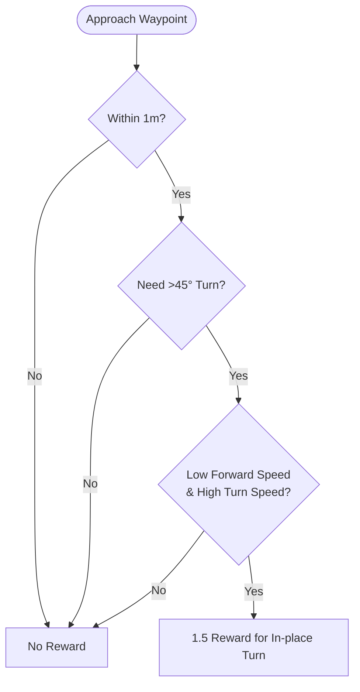
```mermaid
flowchart TD
Start(["Approach Waypoint"]) --> CheckProximity{"Within 1m?"}
CheckProximity --> |No| NoReward["No Reward"]
CheckProximity --> |Yes| CheckTurn{"Need >45° Turn?"}
CheckTurn --> |No| NoReward
CheckTurn --> |Yes| CheckConditions{"Low Forward Speed<br/>& High Turn Speed?"}
CheckConditions --> |No| NoReward
CheckConditions --> |Yes| InPlaceReward["1.5 Reward for In-place Turn"]
```

**Diagram sources**
- [vbot_section002_waypoint_np.py](file://motrix_envs/src/motrix_envs/navigation/vbot/vbot_section002_waypoint_np.py#L1347-L1369)

**Section sources**
- [vbot_section002_waypoint_np.py](file://motrix_envs/src/motrix_envs/navigation/vbot/vbot_section002_waypoint_np.py#L1277-L1298)
- [vbot_section002_waypoint_np.py](file://motrix_envs/src/motrix_envs/navigation/vbot/vbot_section002_waypoint_np.py#L1347-L1369)

## Python Package Infrastructure

**Updated** The VBot navigation system now includes comprehensive Python package infrastructure for flag parsing, command-line argument processing, and testing utilities.

### Flag Parsing System
The system leverages the Abseil flags package for robust command-line argument processing:

#### Core Flag Components
- **DEFINE Functions**: String, boolean, integer, float, enum, and list flag definitions
- **Flag Validators**: Multi-flags validators and validation decorators
- **Flag Modifiers**: Default value setting and flag override mechanisms
- **Special Flags**: Flagfile and undefok special flags for configuration management

#### Flag Processing Capabilities
- **Type Conversion**: Automatic parsing and type conversion for various flag types
- **Validation**: Built-in validation and error handling for flag values
- **Help Generation**: Comprehensive help system with flag documentation
- **Alias Support**: Flag aliases for convenient command-line usage

### Application Framework
The system includes a comprehensive application framework for managing Python applications:

#### Application Entry Points
- **Main Function Integration**: Standardized main function with argv parameter
- **Debug Support**: PDB integration for debugging and profiling
- **Usage Error Handling**: Structured error reporting and usage guidance
- **Help System**: Multiple help levels (short, full, XML) for comprehensive documentation

#### Debugging and Profiling
- **PDB Integration**: Optional post-mortem debugging support
- **Profiling Support**: CProfile and standard profile integration
- **Exception Handling**: Custom exception handlers and error reporting
- **Fault Handler**: Optional fault handler integration for crash diagnostics

### Testing Utilities
The system provides comprehensive testing utilities for development and validation:

#### Testing Framework Components
- **Flagsaver**: Context manager for temporary flag value modifications
- **Parameterized Tests**: Support for parameterized test cases
- **XML Reporting**: Test result reporting in XML format
- **Abseil Test Integration**: Full compatibility with Abseil testing framework

#### Testing Capabilities
- **Isolation**: Temporary flag value isolation during tests
- **Validation**: Automated test result validation and reporting
- **Integration**: Seamless integration with existing testing frameworks
- **Flexibility**: Support for various testing patterns and methodologies

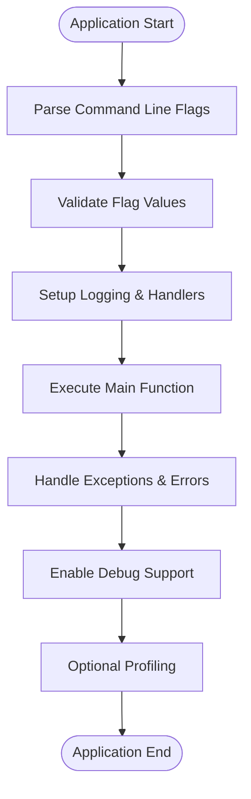
```mermaid
flowchart TD
Start(["Application Start"]) --> ParseFlags["Parse Command Line Flags"]
ParseFlags --> ValidateFlags["Validate Flag Values"]
ValidateFlags --> SetupLogging["Setup Logging & Handlers"]
SetupLogging --> RunMain["Execute Main Function"]
RunMain --> HandleExceptions["Handle Exceptions & Errors"]
HandleExceptions --> DebugSupport["Enable Debug Support"]
DebugSupport --> Profiling["Optional Profiling"]
Profiling --> End(["Application End"])
```

**Diagram sources**
- [app.py](file://pip-uninstall-uy98kyog/app.py#L331-L390)
- [flags/__init__.py](file://pip-uninstall-uy98kyog/flags/__init__.py#L123-L141)
- [flags/_argument_parser.py](file://pip-uninstall-uy98kyog/flags/_argument_parser.py#L77-L91)

**Section sources**
- [flags/__init__.py](file://pip-uninstall-uy98kyog/flags/__init__.py#L14-L221)
- [app.py](file://pip-uninstall-uy98kyog/app.py#L15-L540)
- [flags/_argument_parser.py](file://pip-uninstall-uy98kyog/flags/_argument_parser.py#L1-L200)
- [testing/flagsaver.py](file://pip-uninstall-uy98kyog/testing/flagsaver.py)

## Dependency Analysis
The VBot navigation module depends on:
- Registry for environment registration and lookup
- Configuration classes for environment-specific parameters
- Physics engine for scene simulation and sensor queries
- Math utilities for quaternion operations
- **Flag parsing infrastructure**: Comprehensive Abseil flags package for command-line argument processing
- **Testing utilities**: Integrated testing framework for development and validation
- **Application framework**: Complete application management with debugging and profiling support
- **Stuck detection system**: Advanced circular buffer implementation for motion monitoring

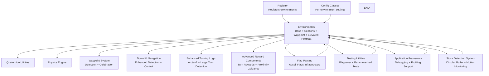
```mermaid
graph TB
REG["Registry<br/>Registers environments"]
CFG["Config Classes<br/>Per-environment settings"]
ENV["Environments<br/>Base + Sections + Waypoint + Elevated Platform"]
MATH["Quaternion Utilities"]
SIM["Physics Engine"]
WP["Waypoint System<br/>Detection + Celebration"]
DH["Downhill Navigation<br/>Enhanced Detection + Control"]
TURN["Enhanced Turning Logic<br/>Arctan2 + Large Turn Detection"]
RWD["Advanced Reward Components<br/>Turn Rewards + Proximity Guidance"]
FLAG["Flag Parsing<br/>Abseil Flags Infrastructure"]
TEST["Testing Utilities<br/>Flagsaver + Parameterized Tests"]
APP["Application Framework<br/>Debugging + Profiling Support"]
STUCK["Stuck Detection System<br/>Circular Buffer + Motion Monitoring"]
END
REG --> ENV
CFG --> ENV
ENV --> MATH
ENV --> SIM
ENV --> WP
ENV --> DH
ENV --> TURN
ENV --> RWD
ENV --> FLAG
ENV --> TEST
ENV --> APP
ENV --> STUCK
FLAG --> ENV
TEST --> ENV
APP --> ENV
STUCK --> ENV
```

**Diagram sources**
- [__init__.py](file://motrix_envs/src/motrix_envs/navigation/vbot/__init__.py#L17-L35)
- [cfg.py](file://motrix_envs/src/motrix_envs/navigation/vbot/cfg.py#L19-L20)
- [vbot_np.py](file://motrix_envs/src/motrix_envs/navigation/vbot/vbot_np.py#L21-L23)
- [vbot_section002_waypoint_np.py](file://motrix_envs/src/motrix_envs/navigation/vbot/vbot_section002_waypoint_np.py#L27-L33)
- [vbot_section01_np.py](file://motrix_envs/src/motrix_envs/navigation/vbot/vbot_section01_np.py#L20-L25)
- [flags/__init__.py](file://pip-uninstall-uy98kyog/flags/__init__.py#L14-L221)
- [app.py](file://pip-uninstall-uy98kyog/app.py#L15-L540)

**Section sources**
- [__init__.py](file://motrix_envs/src/motrix_envs/navigation/vbot/__init__.py#L17-L35)
- [cfg.py](file://motrix_envs/src/motrix_envs/navigation/vbot/cfg.py#L19-L20)
- [vbot_np.py](file://motrix_envs/src/motrix_envs/navigation/vbot/vbot_np.py#L21-L23)

## Performance Considerations
- Action filtering: Exponential smoothing of actions reduces jitter and improves control stability.
- Normalization: Observations and commands are normalized to stabilize training dynamics.
- PD gains: Tuned gains balance responsiveness and stability; adaptive gains in sloped sections improve robustness.
- Termination thresholds: Carefully tuned thresholds prevent premature termination while ensuring safety.
- **Enhanced downhill detection**: More sensitive -5° threshold enables earlier stability responses.
- **Improved stability control**: Reduced leg gains (65.0/80.0) and increased damping (8.5) provide better descent stability.
- **Strengthened reward incentives**: Higher downhill rewards (0.8) encourage stable descent behavior.
- **Waypoint detection optimization**: Dual-path detection system with ordered traversal ensures reliable operation even with sensor failures.
- **Ordered traversal system**: Visited waypoints tracking prevents out-of-order waypoint visits and ensures systematic navigation.
- **Enhanced debugging capabilities**: Comprehensive logging and error handling for waypoint system operations.
- **Advanced turning logic**: Arctan2-based heading calculations provide precise directional control with large turn prioritization.
- **Intelligent reward shaping**: Turn preparation, heading alignment, and proximity rewards guide more natural navigation patterns.
- **Expanded waypoint configuration**: Hard-5 mode with 20 waypoints provides maximum training complexity and reward opportunities.
- **Celebration system optimization**: Smooth interpolation and timing controls ensure visually appealing animations without disrupting navigation.
- **Corrected waypoint reach distance**: 0.1 meter threshold provides optimal balance between reliability and responsiveness.
- **Flag parsing performance**: Cached argument parsers and efficient flag validation minimize startup overhead.
- **Testing infrastructure**: Comprehensive testing utilities enable thorough validation and debugging support.
- **Application framework**: Integrated debugging and profiling support streamline development workflow.
- **Stuck detection efficiency**: Circular buffer implementation minimizes memory overhead while providing comprehensive motion monitoring.
- **Terrain model loading order**: Optimized XML loading sequence improves scene initialization performance.

## Training Methodology
- Flat Base Training: Start with the flat terrain environment to learn basic navigation skills (position/heading tracking, obstacle avoidance).
- Section-wise Pretraining: Train on individual sections to learn section-specific behaviors (slopes, transitions).
- **Enhanced Downhill Training**: Utilize the more sensitive downhill detection system to teach stable descent techniques.
- **Waypoint Training**: Train on waypoint-based navigation to learn path following, ordered traversal, and dynamic goal updating.
- **Celebration Training**: Utilize the enhanced celebration system to learn proper waypoint interaction and animation timing.
- **Advanced Turning Training**: Utilize the enhanced turning logic system to learn intelligent turn prioritization and large turn handling.
- **Elevated Platform Training**: Utilate the new VBotSection01Env for specialized elevated platform navigation skills.
- **Stuck Detection Training**: Utilize the stuck detection system to teach robots how to recover from immobilized states.
- **Difficulty Scaling**: Progress from simple to hard difficulty modes to gradually increase path complexity.
- Multi-Section Training: Combine sections into longer courses to practice continuous navigation across transitions.
- **Flag-based Configuration**: Utilize flag parsing for dynamic environment configuration and parameter tuning.

## Curriculum Learning and Transfer Learning
- Curriculum Learning: Progress from simple flat navigation to complex sections, adjusting action scales, noise levels, and episode durations.
- **Enhanced Downhill Curriculum**: Start with gentle slopes using the -5° detection threshold, gradually introducing steeper terrain.
- **Waypoint Curriculum**: Start with simple waypoint configurations and gradually increase complexity with more waypoints and celebration animations.
- **Celebration Curriculum**: Begin with simple waypoint interactions, progress to timed celebrations, and finally master complex animation sequences.
- **Advanced Turning Curriculum**: Begin with small turns, progress to large turns (>60°), and finally master complex navigation scenarios.
- **Elevated Platform Curriculum**: Start with basic elevated platform navigation, progress to complex height management, and finally master precision platform traversal.
- **Stuck Detection Curriculum**: Begin with environments that rarely encounter stuck situations, progress to more challenging terrains with higher stuck probability.
- **Difficulty Progression**: Systematic progression through difficulty modes (simple → easy → normal → hard-1 → hard-2 → hard-3 → hard-4 → hard-5) for optimal learning.
- Transfer Learning: Use pre-trained policies from simpler sections as initialization for harder sections. Shared observation/action spaces facilitate cross-task adaptation.
- Section Interleaving: Alternate between sections during training to improve generalization across diverse track layouts.
- **Flag-based Experimentation**: Utilize flag parsing for systematic hyperparameter tuning and experimental configuration management.

## Troubleshooting Guide
Common issues and remedies:
- Excessive termination due to contact sensors: Adjust contact thresholds and ensure proper sensor calibration.
- Instability on slopes: Reduce action scale and enable adaptive PD gains in sloped environments.
- Poor convergence: Verify normalization parameters and reward shaping balances; consider curriculum progression.
- Numerical instabilities: Monitor DOF velocity limits and apply appropriate penalties to prevent extreme states.
- **Enhanced downhill detection issues**: Verify -5° threshold is appropriate for training terrain; adjust sensitivity if needed.
- **Control parameter conflicts**: Ensure reduced leg gains (65.0/80.0) and increased damping (8.5) are compatible with robot dynamics.
- **Reward system imbalances**: Monitor downhill reward strength (0.8) to prevent over-encouraging descent behavior.
- **Waypoint detection failures**: Check sensor configurations and verify waypoint geometry placement in XML files.
- **Celebration system conflicts**: Ensure proper timing and duration settings for celebration animations to prevent interference with navigation.
- **Ordered traversal issues**: Verify waypoint index fields are correctly set and that visited waypoints tracking works properly.
- **Advanced turning logic issues**: Check arctan2 calculations and large turn detection thresholds for proper operation.
- **Turn priority conflicts**: Verify turn priority factors (0.3 forward speed, 1.5 turn amplification) are appropriate for robot dynamics.
- **Waypoint proximity reward problems**: Adjust proximity thresholds (1.0m) and in-place turn conditions for optimal performance.
- **Waypoint reach distance issues**: Verify the 0.1 meter threshold is appropriate for the specific waypoint configuration being used.
- **Debugging and logging**: Utilize comprehensive logging system for waypoint system operations, sensor failures, and reward calculations.
- **Flag parsing issues**: Verify flag definitions and validation rules are correctly configured for the intended use case.
- **Testing utility conflicts**: Ensure proper isolation and cleanup when using flagsaver and other testing utilities.
- **Application framework problems**: Check help flag registration and usage error handling for proper application behavior.
- **Stuck detection false positives**: Verify detection thresholds (0.15m position, 15° rotation) are appropriate for the robot's capabilities.
- **Stuck detection performance**: Monitor circular buffer memory usage and detection frequency for optimal performance.
- **Terrain model loading issues**: Verify XML loading order and model file accessibility for proper scene initialization.

**Section sources**
- [vbot_section011_np.py](file://motrix_envs/src/motrix_envs/navigation/vbot/vbot_section011_np.py#L573-L634)
- [vbot_section012_np.py](file://motrix_envs/src/motrix_envs/navigation/vbot/vbot_section012_np.py#L573-L634)
- [vbot_section013_np.py](file://motrix_envs/src/motrix_envs/navigation/vbot/vbot_section013_np.py#L573-L634)
- [vbot_section002_waypoint_np.py](file://motrix_envs/src/motrix_envs/navigation/vbot/vbot_section002_waypoint_np.py#L198-L253)
- [vbot_section01_np.py](file://motrix_envs/src/motrix_envs/navigation/vbot/vbot_section01_np.py#L495-L680)

## Conclusion
The VBot navigation environments provide a flexible, modular framework for training wheeled robots across diverse track sections. With carefully designed observation spaces, reward shaping, and section-specific adaptations, the system supports effective curriculum learning and transfer learning strategies.

**Updated** The enhanced VBot navigation system now features a sophisticated turning logic system with arctan2-based heading calculations, large turn detection (60-degree threshold), and adaptive turn prioritization. The introduction of the new VBotSection01Env for elevated platform terrain navigation provides specialized capabilities for height management and precision platform traversal. The comprehensive waypoint system with six difficulty modes (simple to hard-5) and enhanced celebration system with smooth pose animations provides maximum training complexity and reward opportunities. The integrated Python package infrastructure with flag parsing, testing utilities, and application framework streamlines development, testing, and deployment processes. The renamed 'celebration' system replaces the previous 'special action' terminology with more descriptive naming and improved animation mechanics. The corrected waypoint reach distance parameterization to 0.1 meters ensures optimal balance between reliability and responsiveness. The centralized configuration system and environment registry simplify experimentation and deployment across multiple track layouts. Most significantly, the new stuck termination detection system provides robust automatic termination for immobilized robots, improving training reliability and preventing infinite episodes. The enhanced terrain model loading order in the scene XML optimizes initialization performance. The stuck detection system with its 480-step circular buffer, 0.15m positional threshold, and 15-degree rotational threshold provides comprehensive motion monitoring with automatic termination after 240 consecutive detections. This addition completes the navigation system with advanced failure detection capabilities, making it an ideal platform for advanced robotics research and education with enhanced navigation capabilities, intelligent behavior patterns, and robust termination detection.