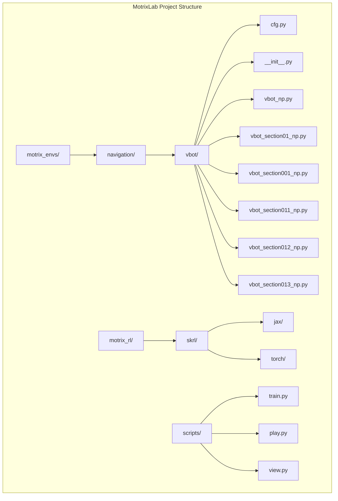
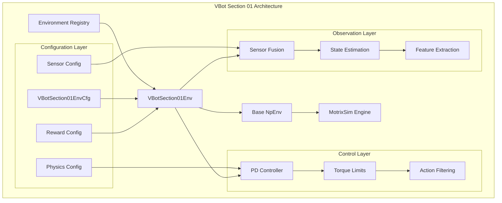
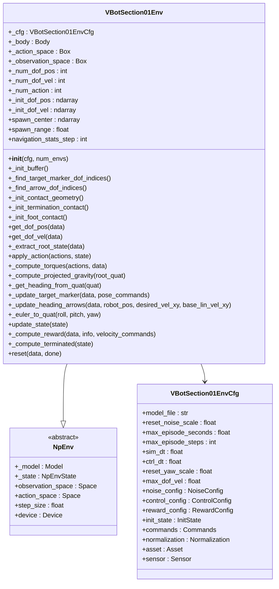
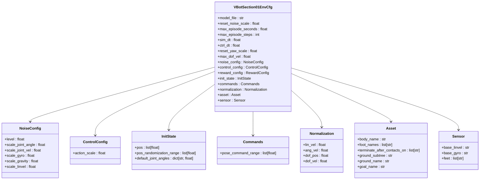
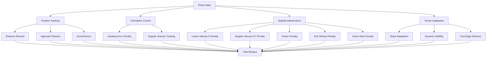
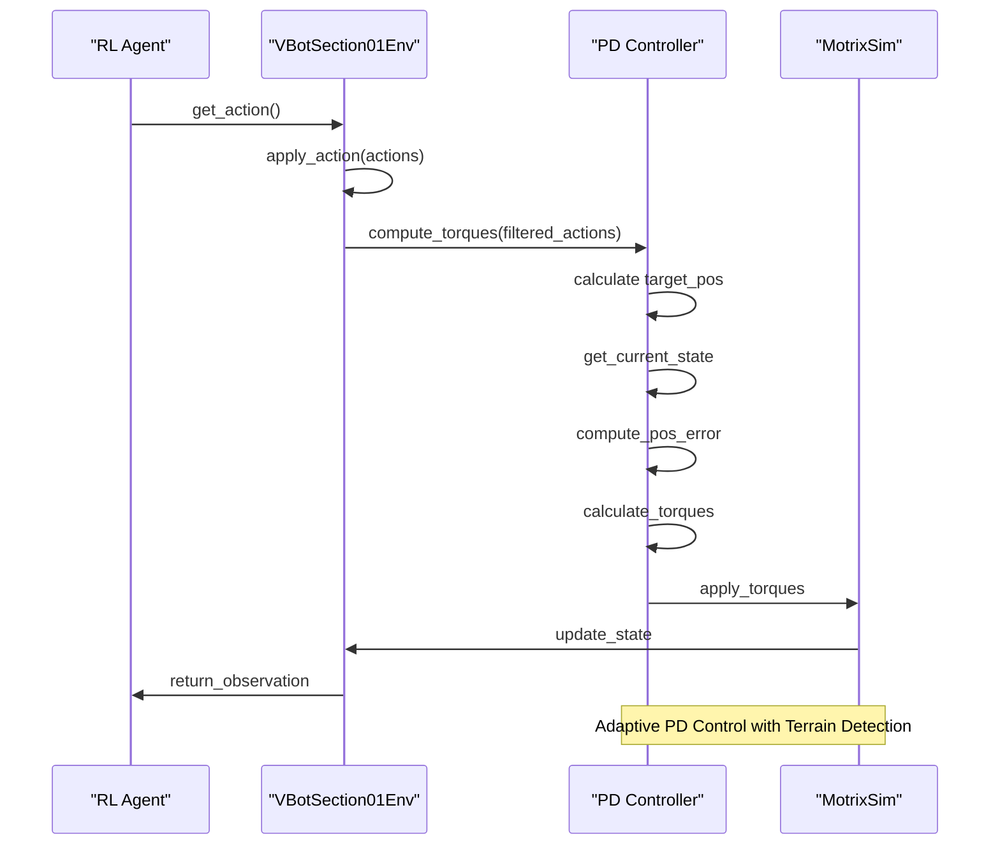
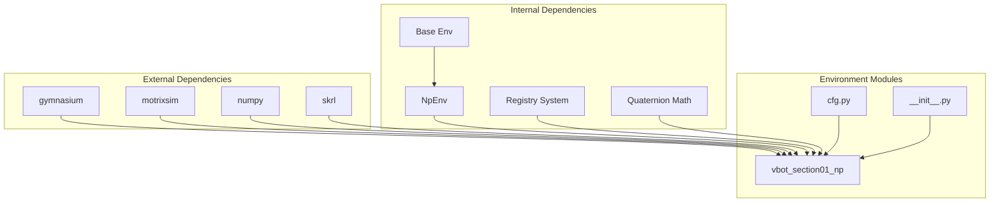

# VBot Section 01 Environment

<cite>
**Referenced Files in This Document**
- [README.md](file://README.md)
- [__init__.py](file://motrix_envs/src/motrix_envs/navigation/vbot/__init__.py)
- [cfg.py](file://motrix_envs/src/motrix_envs/navigation/vbot/cfg.py)
- [vbot_np.py](file://motrix_envs/src/motrix_envs/navigation/vbot/vbot_np.py)
- [vbot_section01_np.py](file://motrix_envs/src/motrix_envs/navigation/vbot/vbot_section01_np.py)
- [vbot_section001_np.py](file://motrix_envs/src/motrix_envs/navigation/vbot/vbot_section001_np.py)
- [vbot_section011_np.py](file://motrix_envs/src/motrix_envs/navigation/vbot/vbot_section011_np.py)
- [vbot_section012_np.py](file://motrix_envs/src/motrix_envs/navigation/vbot/vbot_section012_np.py)
- [vbot_section013_np.py](file://motrix_envs/src/motrix_envs/navigation/vbot/vbot_section013_np.py)
- [train.py](file://scripts/train.py)
</cite>

## Table of Contents
1. [Introduction](#introduction)
2. [Project Structure](#project-structure)
3. [Core Components](#core-components)
4. [Architecture Overview](#architecture-overview)
5. [Detailed Component Analysis](#detailed-component-analysis)
6. [Dependency Analysis](#dependency-analysis)
7. [Performance Considerations](#performance-considerations)
8. [Troubleshooting Guide](#troubleshooting-guide)
9. [Conclusion](#conclusion)

## Introduction
This document provides a comprehensive analysis of the VBot Section 01 Environment within the MotrixLab reinforcement learning framework. The VBot Section 01 Environment represents a specialized navigation task where a quadruped robot (VBot) must navigate through a challenging terrain section featuring elevated platforms, ramps, and obstacles. This environment serves as a critical component in the MotrixLab ecosystem, designed for training and evaluating robotic navigation capabilities using the SKRL reinforcement learning framework.

The VBot Section 01 Environment extends the broader VBot navigation framework, incorporating advanced terrain modeling, sophisticated reward systems, and adaptive control mechanisms. It leverages the MotrixSim physics engine for realistic simulation while providing a unified interface for reinforcement learning applications.

## Project Structure
The VBot Section 01 Environment is organized within the MotrixLab project structure, specifically located in the navigation/vbot module. The project follows a modular architecture that separates concerns between environment definitions, configuration management, and training infrastructure.

**Diagram sources**
- [__init__.py](file://motrix_envs/src/motrix_envs/navigation/vbot/__init__.py#L16-L35)
- [cfg.py](file://motrix_envs/src/motrix_envs/navigation/vbot/cfg.py#L1-L20)

The environment implementation consists of several key components:
- Configuration management through dataclass-based configuration system
- Environment-specific implementations for different terrain sections
- Unified base classes for common functionality
- Integration with the SKRL training framework

**Section sources**
- [README.md](file://README.md#L1-L124)
- [__init__.py](file://motrix_envs/src/motrix_envs/navigation/vbot/__init__.py#L16-L35)

## Core Components
The VBot Section 01 Environment comprises several interconnected components that work together to provide a comprehensive navigation simulation platform.

### Configuration System
The configuration system utilizes a hierarchical dataclass structure that defines environment parameters, physics properties, and reward mechanisms. The base configuration includes fundamental parameters such as simulation timestep, episode duration, and sensor specifications.

### Environment Classes
Multiple environment classes implement different aspects of the VBot navigation task:
- Base VBot environment for flat terrain navigation
- Section-specific environments for different terrain challenges
- Advanced environments with waypoint systems and dynamic features

### Reward and Control Systems
The reward system incorporates multiple components including position tracking, orientation control, stability maintenance, and terrain adaptation. The control system implements PD-based torque control with adaptive parameters for different terrain conditions.

**Section sources**
- [cfg.py](file://motrix_envs/src/motrix_envs/navigation/vbot/cfg.py#L24-L138)
- [vbot_section01_np.py](file://motrix_envs/src/motrix_envs/navigation/vbot/vbot_section01_np.py#L40-L95)

## Architecture Overview
The VBot Section 01 Environment follows a layered architecture that separates concerns between simulation, control, and learning components.

**Diagram sources**
- [vbot_section01_np.py](file://motrix_envs/src/motrix_envs/navigation/vbot/vbot_section01_np.py#L40-L95)
- [cfg.py](file://motrix_envs/src/motrix_envs/navigation/vbot/cfg.py#L171-L215)

The architecture ensures modularity and extensibility while maintaining performance through optimized simulation integration.

**Section sources**
- [vbot_section01_np.py](file://motrix_envs/src/motrix_envs/navigation/vbot/vbot_section01_np.py#L39-L95)
- [cfg.py](file://motrix_envs/src/motrix_envs/navigation/vbot/cfg.py#L171-L215)

## Detailed Component Analysis

### VBotSection01Env Implementation
The VBotSection01Env class represents the core implementation of the Section 01 navigation environment. This class inherits from the base NpEnv class and implements specialized functionality for terrain navigation.

**Diagram sources**
- [vbot_section01_np.py](file://motrix_envs/src/motrix_envs/navigation/vbot/vbot_section01_np.py#L40-L95)
- [cfg.py](file://motrix_envs/src/motrix_envs/navigation/vbot/cfg.py#L171-L215)

The environment implementation includes sophisticated state management, contact detection, and reward computation mechanisms tailored for challenging terrain navigation.

**Section sources**
- [vbot_section01_np.py](file://motrix_envs/src/motrix_envs/navigation/vbot/vbot_section01_np.py#L40-L95)
- [vbot_section01_np.py](file://motrix_envs/src/motrix_envs/navigation/vbot/vbot_section01_np.py#L396-L458)

### Configuration Management
The configuration system provides a comprehensive framework for defining environment parameters, physics properties, and reward mechanisms through dataclass inheritance and composition.

**Diagram sources**
- [cfg.py](file://motrix_envs/src/motrix_envs/navigation/vbot/cfg.py#L24-L138)

The configuration system enables fine-grained control over environment behavior, allowing for easy experimentation with different parameters and scenarios.

**Section sources**
- [cfg.py](file://motrix_envs/src/motrix_envs/navigation/vbot/cfg.py#L24-L138)

### Reward System Architecture
The reward system implements a multi-faceted approach to encourage efficient navigation while maintaining stability and safety.

**Diagram sources**
- [vbot_section01_np.py](file://motrix_envs/src/motrix_envs/navigation/vbot/vbot_section01_np.py#L528-L685)

The reward system balances exploration and exploitation while ensuring safe and efficient navigation behavior.

**Section sources**
- [vbot_section01_np.py](file://motrix_envs/src/motrix_envs/navigation/vbot/vbot_section01_np.py#L528-L685)

### Control System Implementation
The control system implements a sophisticated PD controller with adaptive parameters for different terrain conditions.

**Diagram sources**
- [vbot_section01_np.py](file://motrix_envs/src/motrix_envs/navigation/vbot/vbot_section01_np.py#L204-L245)

The control system adapts parameters based on detected terrain conditions, providing optimal performance across different environments.

**Section sources**
- [vbot_section01_np.py](file://motrix_envs/src/motrix_envs/navigation/vbot/vbot_section01_np.py#L224-L245)

## Dependency Analysis
The VBot Section 01 Environment exhibits well-structured dependencies that promote maintainability and extensibility.

**Diagram sources**
- [vbot_section01_np.py](file://motrix_envs/src/motrix_envs/navigation/vbot/vbot_section01_np.py#L17-L25)
- [__init__.py](file://motrix_envs/src/motrix_envs/navigation/vbot/__init__.py#L16-L35)

The dependency structure ensures loose coupling between modules while maintaining clear interfaces for extension and modification.

**Section sources**
- [vbot_section01_np.py](file://motrix_envs/src/motrix_envs/navigation/vbot/vbot_section01_np.py#L17-L25)
- [__init__.py](file://motrix_envs/src/motrix_envs/navigation/vbot/__init__.py#L16-L35)

## Performance Considerations
The VBot Section 01 Environment is designed with several performance optimization strategies:

### Simulation Efficiency
- Optimized contact detection algorithms for terrain interaction
- Efficient state caching and buffer management
- Parallel environment execution support for scalability

### Memory Management
- Streamlined observation space representation
- Efficient action filtering with configurable alpha values
- Optimized data structures for sensor readings

### Computational Optimization
- Vectorized operations for batch processing
- Early termination conditions to reduce unnecessary computations
- Adaptive control parameter selection based on terrain analysis

## Troubleshooting Guide
Common issues and their solutions when working with the VBot Section 01 Environment:

### Environment Initialization Issues
- **Problem**: Environment fails to initialize with configuration errors
- **Solution**: Verify configuration file paths and ensure all required assets are available
- **Prevention**: Use the registry system for proper environment registration

### Training Instability
- **Problem**: Training shows inconsistent convergence or unstable behavior
- **Solution**: Adjust reward scaling factors and normalization parameters
- **Prevention**: Monitor reward magnitude and adjust action scaling appropriately

### Physics Simulation Problems
- **Problem**: Robot exhibits unrealistic movement or falls through terrain
- **Solution**: Check collision geometry definitions and contact sensor configurations
- **Prevention**: Validate terrain mesh quality and contact surface definitions

**Section sources**
- [vbot_section01_np.py](file://motrix_envs/src/motrix_envs/navigation/vbot/vbot_section01_np.py#L505-L527)

## Conclusion
The VBot Section 01 Environment represents a sophisticated implementation of robotic navigation challenges within the MotrixLab framework. Through its modular architecture, comprehensive configuration system, and adaptive control mechanisms, it provides a robust foundation for reinforcement learning research in robotics.

The environment successfully balances realism with computational efficiency, offering researchers and practitioners a powerful tool for developing and testing navigation algorithms. Its extensible design allows for easy customization and extension to support various navigation scenarios and terrain types.

Future enhancements could include additional terrain variants, more sophisticated reward mechanisms, and integration with advanced reinforcement learning algorithms to further expand the capabilities of the VBot navigation system.